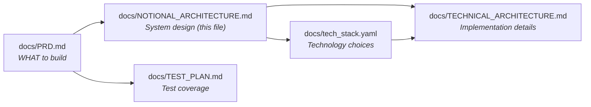
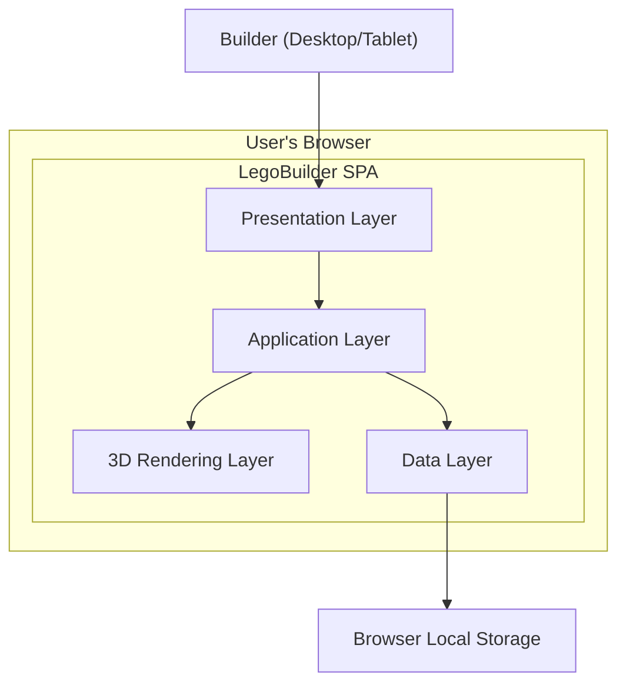
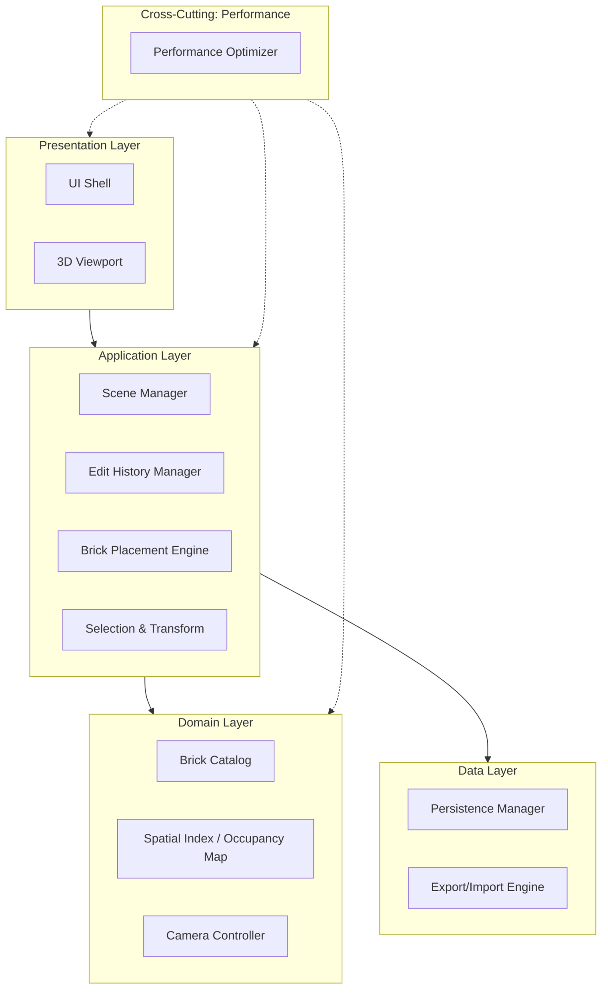
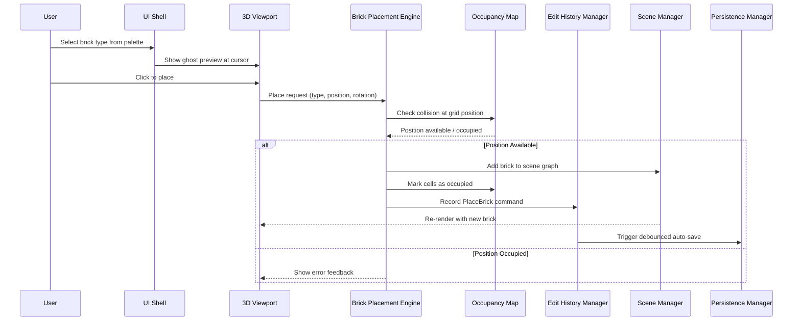

# Notional Architecture — LegoBuilder

> **This document describes WHAT the system does, not HOW it's implemented.**
>
> For technology choices, see `docs/tech_stack.yaml`.
> For implementation details, see `docs/TECHNICAL_ARCHITECTURE.md`.

---

## Document Relationships

| Document | Focus | Changes When |
|----------|-------|-------------|
| `docs/PRD.md` | Requirements (FR/NFR) | Business needs change |
| `docs/NOTIONAL_ARCHITECTURE.md` | System design (this file) | Component structure changes |
| `docs/tech_stack.yaml` | Technology mapping | Framework/version evolves |
| `docs/TECHNICAL_ARCHITECTURE.md` | Implementation details | Tech implementation changes |
| `docs/TEST_PLAN.md` | Test coverage | Test strategy changes |

---

## 1. System Context

> LegoBuilder is a client-only single-page application. There are no external backend services, APIs, or databases in the MVP. All computation, rendering, state management, and persistence happen entirely within the user's browser.

### 1.1 System Boundaries

| Boundary | Inside System | Outside System |
|----------|---------------|----------------|
| **User Interface** | 2D UI panels, toolbar, brick palette | User input devices (mouse, keyboard, touch) |
| **3D Viewport** | Scene graph, camera, lighting, brick meshes | GPU hardware rendering |
| **Data Boundary** | In-memory scene state, serialization | Browser-provided storage APIs |
| **File Boundary** | Export/import serialization logic | User's file system (download/upload) |

---

## 2. Component Overview

> All components are deterministic. LegoBuilder has no AI/LLM features.

| Component | Responsibility | Classification |
|-----------|---------------|----------------|
| Scene Manager | Manages the 3D scene graph — baseplate, lighting, camera defaults, grid system | Deterministic |
| Brick Catalog | Provides the palette of available brick types with geometry and color metadata | Deterministic |
| Brick Placement Engine | Handles snap-to-grid placement, stud alignment, and collision detection | Deterministic |
| Selection & Transform System | Manages brick selection (single/multi), movement, rotation, and deletion | Deterministic |
| Edit History Manager | Implements undo/redo via command pattern with bounded history stack | Deterministic |
| Camera Controller | Provides orbit, pan, zoom controls with configurable constraints | Deterministic |
| Persistence Manager | Handles auto-save, manual save/load, and project management via browser storage | Deterministic |
| Export/Import Engine | Serializes scenes to JSON format and deserializes with schema validation | Deterministic |
| UI Shell | Renders toolbar, brick palette, property panel, status bar, and keyboard shortcut handling | Deterministic |
| Performance Optimizer | Manages instanced rendering, spatial indexing, and frame budget allocation | Deterministic |

### 2.1 Component Classification

**Every component is Deterministic** — same input always produces the same output.

| Classification | Behavior | Validation | Examples |
|---------------|----------|------------|----------|
| **Deterministic** | Same input → Same output | TDD (Unit/Integration tests) | All LegoBuilder components |

No probabilistic or hybrid components exist in the MVP. All 82 test cases use traditional TDD.

---

## 2b. Business Process → Component Mapping

| Business Process | Key Steps | Component(s) | Classification | AI Opportunity? |
|-----------------|-----------|--------------|----------------|:---------------:|
| Build a LEGO scene | Open app → select brick → place on grid → repeat | Scene Manager, Brick Catalog, Brick Placement Engine | Deterministic | No |
| Edit existing bricks | Select brick → move/rotate/delete → confirm | Selection & Transform System, Edit History Manager | Deterministic | No |
| Navigate the 3D scene | Orbit → pan → zoom → reset camera | Camera Controller | Deterministic | No |
| Save and resume work | Auto-save triggers → manual save → load project | Persistence Manager | Deterministic | No |
| Share a creation | Export to JSON → share file → recipient imports | Export/Import Engine | Deterministic | No |
| Undo a mistake | Press Ctrl+Z → action reversed → redo available | Edit History Manager | Deterministic | No |

---

## 3. Layered Architecture

> LegoBuilder uses a simplified layered architecture appropriate for a client-only SPA.
> No backend, API gateway, communication layer, or AI/agent layer exists.

### 3.1 Presentation Layer

**Responsibility:** Handle user interactions (mouse, keyboard, touch) and render both 2D UI and 3D viewport.

| Component | Purpose |
|-----------|---------|
| **UI Shell** | Renders toolbar, brick palette sidebar, property inspector, status bar, modal dialogs, and keyboard shortcut overlays |
| **3D Viewport** | Renders the interactive 3D scene — baseplate, placed bricks, grid overlay, selection highlights, ghost preview of brick being placed |

**Rules:**
- No business logic in this layer
- Transforms user gestures (click, drag, scroll) into application-layer commands
- Handles responsive layout for desktop and tablet viewports
- Displays feedback: hover highlights, selection outlines, placement previews

### 3.2 Application Layer

**Responsibility:** Orchestrate building workflows, manage scene state, and coordinate between user actions and domain logic.

| Component | Purpose |
|-----------|---------|
| **Scene Manager** | Maintains the scene graph — tracks all placed bricks, baseplate configuration, lighting, and grid settings |
| **Edit History Manager** | Records every state-changing action as a command; provides undo (up to 50 levels) and redo |
| **Brick Placement Engine** | Validates placement requests against the occupancy map, snaps to grid, checks stud alignment, and commits valid placements |
| **Selection & Transform System** | Manages single-click and multi-select (Shift+click, box select), handles move/rotate/delete operations on selected bricks |

**Rules:**
- Contains workflow orchestration (place → validate → commit → record history)
- All state mutations go through the Edit History Manager for undo support
- No direct rendering calls — delegates to Presentation Layer
- Manages transaction-like consistency (placement either fully succeeds or is rejected)

### 3.3 Domain Layer

**Responsibility:** Encapsulate core building rules, brick definitions, and spatial logic.

| Component | Purpose |
|-----------|---------|
| **Brick Catalog** | Defines available brick types (2×4, 2×2, 1×1, 1×2, 2×2 slope, 1×4 plate) with geometry dimensions, stud positions, and color options (10 colors) |
| **Spatial Index / Occupancy Map** | Maintains a 3D grid-based occupancy structure for O(1) collision detection and stud-connectivity validation |
| **Camera Controller** | Defines orbit, pan, zoom behaviors with constraints (min/max zoom, orbit limits, smooth transitions) |

**Rules:**
- Technology-agnostic domain logic
- Contains validation rules: "Can this brick be placed at this position?" "Are studs aligned?"
- No dependencies on rendering or persistence layers
- Brick catalog is extensible for future brick types

### 3.4 Data Layer

**Responsibility:** Handle persistence to browser storage and file export/import.

| Component | Purpose |
|-----------|---------|
| **Persistence Manager** | Auto-saves scene state every 5 seconds (debounced) to browser storage; manages named project slots (up to 5 projects); handles manual save/load |
| **Export/Import Engine** | Serializes scene state to a versioned JSON schema for file download; validates and deserializes imported JSON files with schema version migration |

**Rules:**
- Abstracts browser storage details from the application layer
- Handles storage quota management and user notification on quota exceeded
- Import validates schema version and data integrity before loading
- Export produces self-contained JSON files (no external dependencies)

### 3.5 Cross-Cutting: Performance Optimizer

**Responsibility:** Ensure the application meets NFR performance targets across all layers.

| Concern | Strategy |
|---------|----------|
| **Rendering** | Batch identical brick geometries into instanced draw calls to minimize GPU overhead |
| **Collision Detection** | Use spatial acceleration structure (BVH) for raycasting; occupancy map for O(1) grid-based checks |
| **State Updates** | Immutable state with structural sharing to minimize re-renders |
| **Memory** | Object pooling for frequently created/destroyed objects; lazy geometry generation |
| **Frame Budget** | Target 60 FPS; degrade gracefully (reduce shadow quality, simplify grid) under load |

---

## 4. Data Flow

> All data flows occur within the browser. No network requests are made.

### 4.1 Primary Data Flow: Brick Placement

### 4.2 Key Data Flows

| Flow Name | Source | Destination | Purpose |
|-----------|--------|-------------|---------|
| Brick Placement | User click → Placement Engine | Scene Manager → Viewport | Add a brick to the scene with validation |
| Brick Selection | User click → Selection System | Scene Manager → Viewport | Highlight and enable operations on selected bricks |
| Undo/Redo | Keyboard shortcut → Edit History | Scene Manager → Viewport | Reverse or replay the last state-changing action |
| Camera Navigation | Mouse drag/scroll → Camera Controller | Viewport | Change the viewing angle, position, or zoom level |
| Auto-Save | Debounce timer → Persistence Manager | Browser Storage | Persist current scene state to prevent data loss |
| Manual Save/Load | UI button → Persistence Manager | Browser Storage | Explicitly save or load a named project |
| Export | UI button → Export Engine | File Download | Serialize scene to JSON and trigger browser download |
| Import | File Upload → Import Engine | Scene Manager | Validate and load a JSON scene file |
| Color Change | UI palette → Selection System | Scene Manager → Viewport | Change the color of selected brick(s) |
| Multi-Select | Shift+click / Box drag → Selection System | Scene Manager → Viewport | Select multiple bricks for batch operations |

---

## 5. Personas & Access Control

> LegoBuilder is a single-user, client-only application. There is no authentication or authorization system. All users have full access to all features.

### 5.1 Personas

| Persona | Description | Access Level |
|---------|-------------|-------------|
| Casual Builder (Casey) | Ages 8–14, wants quick creative building with minimal learning curve | Full — all features |
| Enthusiast Designer (Dana) | Ages 16+, wants precise control, complex models, and sharing capabilities | Full — all features |

### 5.2 Access Matrix

| Resource | Casual Builder | Enthusiast Designer |
|----------|---------------|---------------------|
| Place/move/delete bricks | Full | Full |
| Save/load projects | Full | Full |
| Export/import JSON | Full | Full |
| Camera controls | Full | Full |
| Undo/redo | Full | Full |
| Keyboard shortcuts | Full | Full |

> No access restrictions exist. Both personas use the same application with the same capabilities. The distinction is in usage patterns, not permissions.

---

## 6. Integration Points

> LegoBuilder MVP has no external integrations. It is a fully self-contained client-side application.

| Integration | Purpose | Data Exchanged | Direction |
|-------------|---------|----------------|-----------|
| Browser Storage API | Persist scene state locally | Serialized scene JSON | Bidirectional |
| File System API | Export/import scene files | JSON files | Bidirectional |
| Clipboard API | Copy/paste brick selections (future) | Serialized brick data | Bidirectional |

> These are browser-provided APIs, not external services. No network calls are made.

---

## 7. Quality Attributes (NFRs)

> Architectural decisions mapped to the 12 NFRs defined in the PRD.

| NFR | Target | Architectural Decision | Component(s) Affected |
|-----|--------|------------------------|----------------------|
| **NFR-PERF-001: Frame Rate** | ≥ 60 FPS with 500 bricks | Instanced rendering batches identical geometries into single draw calls; spatial BVH accelerates raycasting | Performance Optimizer, 3D Viewport |
| **NFR-PERF-002: Placement Latency** | < 100ms per brick placement | Occupancy map provides O(1) collision checks; no network round-trips | Brick Placement Engine, Occupancy Map |
| **NFR-PERF-003: Load Time** | < 3 seconds initial load | Code splitting, lazy loading of non-critical modules, optimized asset bundling | All layers (build configuration) |
| **NFR-PERF-004: Memory** | < 512 MB for 500-brick scene | Object pooling, geometry sharing via instanced meshes, structural sharing in state | Performance Optimizer, Scene Manager |
| **NFR-UX-001: Undo Latency** | < 50ms per undo/redo | Command pattern with pre-computed inverse operations; immutable state snapshots | Edit History Manager |
| **NFR-UX-002: Responsiveness** | Desktop (1024px+) and tablet (768px+) | Responsive layout with breakpoint-based UI adaptation; touch event normalization | UI Shell, 3D Viewport |
| **NFR-DATA-001: Auto-Save** | Every 5 seconds, debounced | Debounced serialization to browser storage; delta-based saves when possible | Persistence Manager |
| **NFR-DATA-002: Storage Limit** | 5 projects, graceful quota handling | Project slot management; quota detection and user notification | Persistence Manager |
| **NFR-DATA-003: Export Compatibility** | Versioned JSON schema | Schema version field in export format; migration functions for older versions | Export/Import Engine |
| **NFR-ACC-001: Keyboard Navigation** | Full keyboard accessibility | Keyboard shortcut system with discoverable bindings; focus management | UI Shell |
| **NFR-ACC-002: Color Contrast** | WCAG 2.1 AA compliance | High-contrast UI theme; distinguishable brick colors in palette | UI Shell, Brick Catalog |
| **NFR-COMPAT-001: Browser Support** | Chrome, Firefox, Safari, Edge (latest 2 versions) | Feature detection for WebGL2; graceful degradation for missing APIs | All layers |

---

## 8. Component Mapping to tech_stack.yaml

> This section maps notional components to `tech_stack.yaml` entries.

| Notional Component | tech_stack.yaml Key | Purpose |
|--------------------|---------------------|---------|
| Presentation Layer / UI Shell | `frontend.framework`, `frontend.ui_library` | 2D user interface rendering |
| Presentation Layer / 3D Viewport | `frontend.framework`, `frontend.rendering_3d` | 3D scene rendering |
| Application Layer / Scene Manager | `frontend.state_management` | Scene state management |
| Application Layer / Edit History | `frontend.state_management` | Command history with immutable state |
| Domain Layer / Occupancy Map | `frontend.language` (pure logic) | Spatial collision detection |
| Domain Layer / Brick Catalog | `frontend.language` (pure logic) | Brick type definitions |
| Data Layer / Persistence Manager | `frontend.persistence` | Browser storage abstraction |
| Data Layer / Export/Import Engine | `frontend.language` (pure logic) | JSON serialization/deserialization |
| Performance Optimizer | `frontend.rendering_3d`, `frontend.spatial_acceleration` | Instanced rendering, BVH |

> **Note:** LegoBuilder has no AI/LLM components. The `agentic_workflows` and `llm` sections in `tech_stack.yaml` are disabled.

---

## 9. Enterprise Product Intelligence Layer

> Not applicable. LegoBuilder is a standalone consumer application, not part of a multi-product enterprise organization.

---

## 10. Decision Log

| Decision | Rationale | NFR Impact | Date |
|----------|-----------|------------|------|
| Client-only SPA (no backend) | MVP scope is single-user creative tool; no collaboration, auth, or server-side processing needed | Simplifies all NFRs — no network latency | 2026-04-10 |
| Occupancy map for collision detection | O(1) lookup vs O(n) iteration; critical for meeting NFR-PERF-002 < 100ms placement | NFR-PERF-002 | 2026-04-10 |
| Command pattern for undo/redo | Clean separation of state mutations; enables bounded 50-level history without full state snapshots | NFR-UX-001 | 2026-04-10 |
| Instanced rendering for brick meshes | Batches identical geometries into single draw calls; essential for 60 FPS at 500 bricks | NFR-PERF-001, NFR-PERF-004 | 2026-04-10 |
| BVH-accelerated raycasting | Logarithmic raycast performance for mouse picking; avoids linear scan of all meshes | NFR-PERF-001, NFR-PERF-002 | 2026-04-10 |
| Debounced auto-save to browser storage | 5-second debounce prevents excessive writes while ensuring data safety | NFR-DATA-001 | 2026-04-10 |
| Versioned JSON export schema | Forward-compatible export format with migration support for schema evolution | NFR-DATA-003 | 2026-04-10 |
| 5-project slot limit | Manages browser storage quota; prevents unbounded growth | NFR-DATA-002 | 2026-04-10 |
| Desktop-first with tablet support | Primary persona (Casey) uses desktop; tablet is secondary but supported | NFR-UX-002 | 2026-04-10 |
| Immutable state with structural sharing | Minimizes re-renders; enables efficient undo/redo snapshots | NFR-PERF-001, NFR-UX-001 | 2026-04-10 |

---

## Next Steps

After completing this document:

1. **Define technology choices** in `docs/tech_stack.yaml`
2. **Create technical architecture** in `docs/TECHNICAL_ARCHITECTURE.md`
3. **Verify test plan alignment** — all 82 test cases map to components defined here
