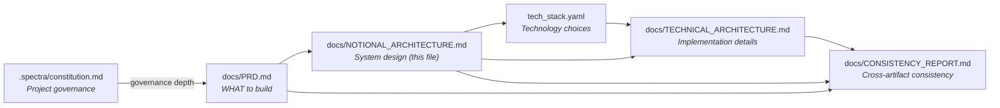
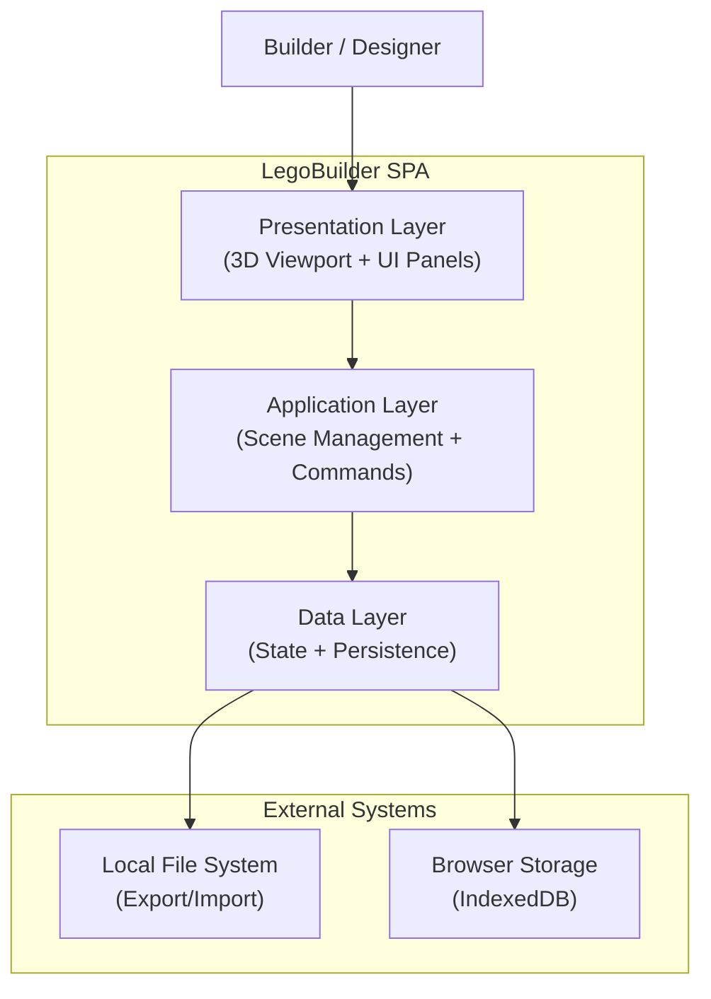
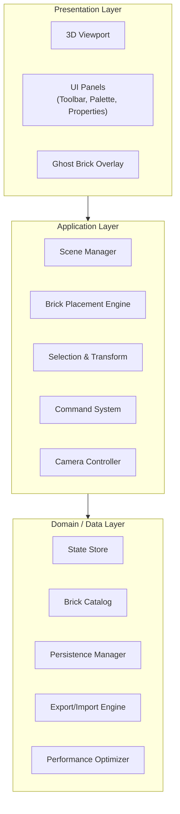
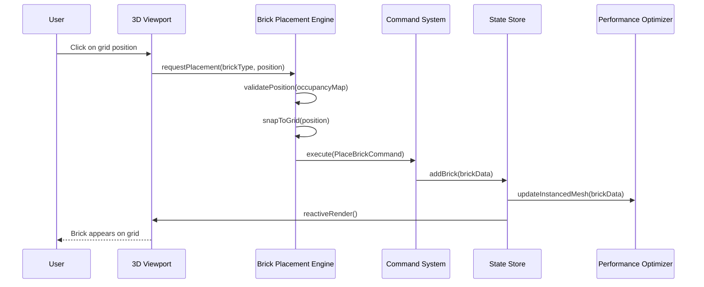
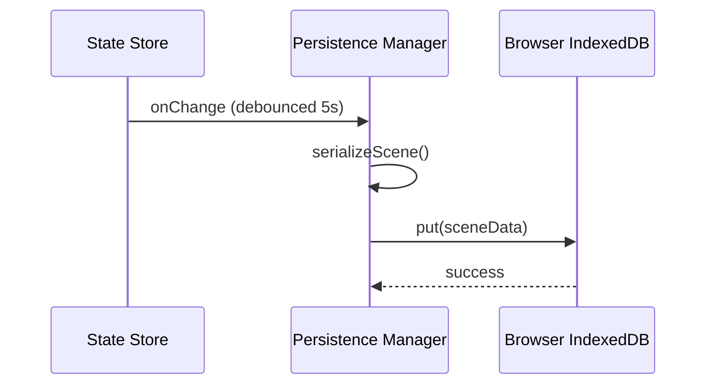

# Notional Architecture — LegoBuilder

> **This document describes WHAT the system does, not HOW it's implemented.**
>
> For technology choices, see `tech_stack.yaml`.
> For implementation details, see `docs/TECHNICAL_ARCHITECTURE.md`.

---

## Document Relationships

| Document | Focus | Changes When |
|----------|-------|-------------|
| `.spectra/constitution.md` | Project governance (governs all below) | Team norms or governance depth change |
| `docs/PRD.md` | Requirements (FR/NFR) | Business needs change |
| `docs/NOTIONAL_ARCHITECTURE.md` | System design (this file) | Component structure changes |
| `tech_stack.yaml` | Technology mapping | Framework/version evolves |
| `docs/TECHNICAL_ARCHITECTURE.md` | Implementation details | Tech implementation changes |
| `docs/CONSISTENCY_REPORT.md` | Cross-artifact consistency check | After all specs/arch finalized |

---

## 1. System Context

> LegoBuilder is a client-only single-page application. There are no backend servers or external API integrations. All data persists locally in the user's browser.

### 1.1 System Boundaries

| Boundary | Inside System | Outside System |
|----------|---------------|----------------|
| **User Interface** | 3D viewport, toolbar, brick palette, property panels | User's mouse/keyboard/touch input |
| **Rendering Boundary** | Scene graph, camera, lighting, grid | GPU/WebGL driver |
| **Data Boundary** | State store, command history, scene serialization | Browser IndexedDB, file system |
| **Performance Boundary** | Brick batching, spatial indexing, frustum culling | Browser memory limits, GPU capabilities |

---

## 2. Component Overview

> All components are deterministic — same input always produces the same output. There are no AI/LLM components in this application.

| Component | Responsibility | Classification |
|-----------|---------------|----------------|
| **Scene Manager** | Manages the 3D scene graph: grid, lighting, camera, and all placed bricks | Deterministic |
| **Brick Catalog** | Provides the library of available brick types with geometry and color metadata | Deterministic |
| **Brick Placement Engine** | Handles snap-to-grid placement, collision detection, and stud alignment | Deterministic |
| **Selection & Transform** | Manages brick selection (single/multi), movement, rotation, and deletion | Deterministic |
| **Command System** | Implements undo/redo via command pattern with 50-level history stack | Deterministic |
| **Camera Controller** | Orbit, pan, zoom controls with preset views (top, front, isometric) | Deterministic |
| **State Store** | Centralized application state with immutable updates | Deterministic |
| **Persistence Manager** | Auto-save to IndexedDB, manual save/load, scene listing | Deterministic |
| **Export/Import Engine** | JSON export/import with schema versioning, PNG screenshot capture | Deterministic |
| **UI Shell** | Toolbar, brick palette sidebar, property panel, scene list, keyboard shortcuts | Deterministic |
| **Performance Optimizer** | InstancedMesh batching, BVH spatial indexing, occupancy map for O(1) collision | Deterministic |
| **Ghost Brick Preview** | Shows translucent preview of brick placement with valid/invalid color feedback | Deterministic |

### 2.1 Component Classification

**Every component is Deterministic** — this is a pure client-side 3D building tool with no AI/ML features.

| Classification | Behavior | Validation | Examples |
|---------------|----------|------------|----------|
| **Deterministic** | Same input → Same output | TDD (Unit/Integration tests) | All components — placement, selection, undo/redo, persistence, export |

---

## 2b. Business Process → Component Mapping

| Business Process | Key Steps | Component(s) | Classification | AI Opportunity? |
|-----------------|-----------|--------------|----------------|:---------------:|
| **Build a LEGO Scene** | Select brick → Position on grid → Snap & validate → Place | Brick Catalog, Brick Placement Engine, Ghost Brick Preview, Scene Manager | Deterministic | No |
| **Edit Existing Bricks** | Select brick(s) → Move/Rotate/Delete → Update scene | Selection & Transform, Command System, Scene Manager | Deterministic | No |
| **Navigate the Scene** | Orbit → Pan → Zoom → Preset views | Camera Controller | Deterministic | No |
| **Save & Resume Work** | Auto-save periodically → Manual save → List scenes → Load scene | Persistence Manager, State Store | Deterministic | No |
| **Share Creations** | Export to JSON → Import from JSON → Capture screenshot | Export/Import Engine | Deterministic | No |
| **Undo Mistakes** | Perform action → Undo → Redo → Navigate history | Command System, State Store | Deterministic | No |

---

## 3. Layered Architecture

> LegoBuilder uses a three-layer architecture. There is no backend, no AI layer, no communication layer, and no external API gateway. The entire application runs in the browser.

### 3.1 Presentation Layer

**Responsibility:** Render the 3D scene and provide all user interaction surfaces.

| Component | Purpose |
|-----------|--------|
| **3D Viewport** | Renders the brick scene using WebGL; handles mouse/touch events for placement, selection, and camera control |
| **UI Panels** | Toolbar (undo/redo/delete/export), brick palette sidebar (brick type + color selection), property panel (selected brick info) |
| **Ghost Brick Overlay** | Renders a translucent preview brick at the cursor position; green for valid placement, red for collision/invalid |

**Rules:**
- No business logic in this layer
- Transforms user input events into application-layer commands
- Reads state reactively from the State Store
- Delegates all scene mutations to the Application Layer

### 3.2 Application Layer

**Responsibility:** Orchestrate all building workflows, enforce placement rules, and manage scene operations.

| Component | Purpose |
|-----------|--------|
| **Scene Manager** | Coordinates the 3D scene graph — adds/removes/updates brick meshes, manages grid, lighting, and scene-level operations (new/clear) |
| **Brick Placement Engine** | Validates placement positions using the occupancy map, enforces snap-to-grid (stud alignment), checks collision via BVH raycasting |
| **Selection & Transform** | Handles click-to-select, multi-select (Shift+click), drag-to-move, rotation (R key), and deletion (Delete key) |
| **Command System** | Wraps every mutation (place, move, rotate, delete, color change) in a reversible command object; maintains a 50-level undo/redo stack |
| **Camera Controller** | Manages orbit (left-drag), pan (right-drag/middle-drag), zoom (scroll), and preset view transitions |

**Rules:**
- Contains all workflow orchestration and business rules
- Every state mutation goes through the Command System for undo/redo support
- No direct DOM or WebGL manipulation — delegates rendering to Presentation Layer
- No direct storage access — delegates to Domain/Data Layer

### 3.3 Communication Layer

> **Not applicable.** LegoBuilder is a client-only application with no voice, real-time messaging, or customer support features.

### 3.4 AI / Agent Layer

> **Not applicable.** LegoBuilder has no AI/agentic features. All components are deterministic.

### 3.5 Skill & Plugin Layer

> **Not applicable for the application itself.** Spectra skills govern the development process but are not part of the LegoBuilder runtime.

### 3.6 Domain / Data Layer

**Responsibility:** Manage application state, brick definitions, persistence, and data transformations.

| Component | Purpose |
|-----------|--------|
| **State Store** | Single source of truth for all application state: scene data (bricks, grid size), UI state (selected brick, active tool, palette selection), and command history |
| **Brick Catalog** | Defines available brick types (1×1, 2×1, 2×2, 2×4, 4×2) with geometry dimensions, stud positions, and default colors; provides the 10-color palette |
| **Persistence Manager** | Handles auto-save (5-second debounce after changes), manual save/load, scene listing with metadata (name, date, brick count, thumbnail), and IndexedDB operations |
| **Export/Import Engine** | Serializes scene state to versioned JSON format, deserializes and validates imported JSON with schema migration, captures PNG screenshots of the viewport |
| **Performance Optimizer** | Groups bricks by geometry type for InstancedMesh batching, maintains BVH spatial index for raycasting, manages occupancy map (3D grid) for O(1) collision detection |

**Rules:**
- State Store is the single source of truth — all reads are reactive subscriptions
- Persistence Manager never blocks the UI — all IndexedDB operations are async
- Export format includes schema version for forward compatibility
- Performance Optimizer is transparent to other layers — it optimizes rendering without changing semantics

### 3.7 Integration Layer

> LegoBuilder has minimal integration — only with browser-native APIs.

| Component | Purpose |
|-----------|--------|
| **Browser Storage Adapter** | Abstracts IndexedDB operations (open, read, write, list, delete) behind a clean async interface |
| **File System Adapter** | Abstracts browser file download (JSON export, PNG export) and file upload (JSON import) via File API |

**Rules:**
- Abstracts browser API details from the rest of the application
- Provides consistent async interfaces regardless of browser implementation
- Handles errors gracefully (storage quota exceeded, file read failures)

---

## 4. Data Flow

> All data flows occur within the browser. There are no network requests.

### 4.1 Primary Data Flow — Brick Placement

### 4.2 Primary Data Flow — Auto-Save

### 4.3 Key Data Flows

| Flow Name | Source | Destination | Purpose |
|-----------|--------|-------------|--------|
| **Brick Placement** | User click → Viewport | State Store (via Command System) | Place a new brick on the grid |
| **Brick Selection** | User click → Viewport | State Store (selection state) | Select one or more bricks for editing |
| **Brick Transform** | User drag/key → Viewport | State Store (via Command System) | Move, rotate, or delete selected bricks |
| **Undo/Redo** | User Ctrl+Z/Y → UI | State Store (via Command System) | Reverse or replay the last command |
| **Auto-Save** | State Store (on change) | IndexedDB (via Persistence Manager) | Persist scene data every 5 seconds |
| **Manual Save** | User → Save button | IndexedDB (via Persistence Manager) | Explicitly save current scene with name |
| **Scene Load** | User → Scene list | State Store (from IndexedDB) | Load a previously saved scene |
| **JSON Export** | User → Export button | File download (via Export Engine) | Download scene as JSON file |
| **JSON Import** | User → Import button | State Store (via Export Engine) | Load scene from uploaded JSON file |
| **PNG Screenshot** | User → Screenshot button | File download (via Export Engine) | Capture and download viewport image |
| **Camera Control** | User mouse/keyboard | Camera Controller → Viewport | Orbit, pan, zoom the 3D view |
| **Ghost Preview** | User mouse move → Viewport | Ghost Brick Overlay | Show placement preview at cursor |

---

## 5. Personas & Access Control

> LegoBuilder is a single-user, client-only application. There is no authentication or authorization. All data is local to the browser.

### 5.1 Personas

| Persona | Description | Access Level |
|---------|-------------|-------------|
| **Casual Builder (Casey)** | Hobbyist who builds simple scenes for fun; values ease of use and quick results | Full access (single-user app) |
| **Enthusiast Designer (Dana)** | Experienced builder who creates complex models; values precision, performance, and export capabilities | Full access (single-user app) |

### 5.2 Access Matrix

| Resource | Casual Builder | Enthusiast Designer |
|----------|---------------|--------------------|
| 3D Viewport | Full | Full |
| Brick Palette | Full | Full |
| Scene Save/Load | Full | Full |
| Export/Import | Full | Full |
| All Features | Full | Full |

> **Note:** Both personas have identical access. The distinction is in usage patterns and performance expectations (Dana works with larger scenes closer to the 500-brick limit).

---

## 6. Integration Points

> LegoBuilder has no external service integrations. All integrations are with browser-native APIs.

| Integration | Purpose | Data Exchanged | Direction |
|-------------|---------|----------------|----------|
| **IndexedDB** | Persistent local storage for scenes | Scene JSON (bricks, metadata, thumbnails) | Bidirectional |
| **File API (Download)** | Export scenes and screenshots | JSON files, PNG images | Outbound |
| **File API (Upload)** | Import scenes from files | JSON files | Inbound |
| **WebGL / GPU** | 3D rendering | Geometry buffers, textures, shaders | Outbound |
| **Clipboard API** | Copy/paste brick data (future) | Serialized brick data | Bidirectional |

---

## 7. Quality Attributes (NFRs)

> Maps architectural decisions to non-functional requirements from the PRD.

| NFR | Architectural Decision | Component(s) Affected |
|-----|----------------------|----------------------|
| **NFR-PERF-001: 60 FPS rendering** | InstancedMesh batching groups bricks by geometry type to minimize draw calls; frustum culling skips off-screen bricks | Performance Optimizer, Scene Manager |
| **NFR-PERF-002: <200ms placement** | Occupancy map provides O(1) collision lookup; BVH accelerates raycasting for snap-to-grid | Brick Placement Engine, Performance Optimizer |
| **NFR-PERF-003: <1s scene load** | Scenes stored as compact JSON; InstancedMesh rebuilt in batch on load rather than per-brick | Persistence Manager, Performance Optimizer |
| **NFR-PERF-004: 500-brick support** | InstancedMesh reduces draw calls from O(n) to O(types); occupancy map scales O(1) regardless of brick count | Performance Optimizer, State Store |
| **NFR-UX-001: <100ms UI response** | State subscriptions trigger targeted re-renders; UI panels read from store without computation | State Store, UI Shell |
| **NFR-UX-002: Keyboard shortcuts** | Global keyboard listener with configurable key bindings; no conflicts with browser defaults | UI Shell |
| **NFR-DATA-001: Zero data loss** | 5-second debounced auto-save to IndexedDB; manual save always available; export as backup | Persistence Manager |
| **NFR-DATA-002: Schema versioning** | Export JSON includes version field; import engine applies migrations for older schemas | Export/Import Engine |
| **NFR-COMPAT-001: Modern browsers** | Target Chrome 90+, Firefox 90+, Safari 15+, Edge 90+; progressive enhancement for WebGL2 | All rendering components |
| **NFR-COMPAT-002: Responsive layout** | Desktop-first with tablet support (≥768px); touch events for tablet interaction | UI Shell, Presentation Layer |
| **NFR-ACCESS-001: Keyboard navigation** | All tools accessible via keyboard; focus management for panels | UI Shell |
| **NFR-MAINT-001: Modular architecture** | Clear layer separation; each component has single responsibility; state store decouples components | All components |

---

## 8. Component Mapping to tech_stack.yaml

> This section maps notional components to `tech_stack.yaml` entries.

| Notional Component | tech_stack.yaml Key | Purpose |
|--------------------|---------------------|--------|
| Presentation Layer / 3D Viewport | `frontend.framework` + `frontend.3d_library` | 3D rendering and user interaction |
| Presentation Layer / UI Panels | `frontend.framework` + `frontend.ui_library` | Toolbar, palette, property panels |
| Application Layer / Scene Manager | `frontend.framework` | Scene graph coordination |
| Application Layer / Brick Placement Engine | `frontend.3d_library` (raycasting, BVH) | Placement validation and snap-to-grid |
| Application Layer / Command System | `frontend.state_management` | Undo/redo command pattern |
| Domain Layer / State Store | `frontend.state_management` | Centralized immutable state |
| Domain Layer / Persistence Manager | `database.primary` (IndexedDB) | Local scene persistence |
| Domain Layer / Export/Import Engine | Native browser APIs | JSON/PNG export and import |
| Domain Layer / Performance Optimizer | `frontend.3d_library` (InstancedMesh, BVH) | Rendering and collision optimization |

> **Note:** LegoBuilder has no AI/LLM components. The `agentic_workflows` and `llm` sections of `tech_stack.yaml` are not applicable and will be marked as disabled.

---

## 9. Enterprise Product Intelligence Layer

> **Not applicable.** LegoBuilder is a standalone product, not part of a multi-product organization.

---

## 10. Decision Log

| Decision | Rationale | NFR Impact | Date |
|----------|-----------|------------|------|
| **Client-only SPA (no backend)** | MVP scope is single-user local building; eliminates server costs and complexity; all data stays on user's device | NFR-DATA-001, NFR-MAINT-001 | 2026-04-10 |
| **InstancedMesh batching per geometry type** | Reduces draw calls from O(n) to O(brick_types); critical for 60 FPS at 500 bricks | NFR-PERF-001, NFR-PERF-004 | 2026-04-10 |
| **Occupancy map (3D grid) for collision** | O(1) collision detection vs O(n) brute force; essential for <200ms placement response | NFR-PERF-002 | 2026-04-10 |
| **BVH-accelerated raycasting** | Logarithmic raycast performance for mouse-to-brick intersection; enables smooth ghost preview | NFR-PERF-002, NFR-UX-001 | 2026-04-10 |
| **Command pattern for undo/redo** | Clean separation of mutation logic; supports 50-level history; each command is self-contained and reversible | NFR-UX-001, NFR-MAINT-001 | 2026-04-10 |
| **Immutable state with centralized store** | Predictable state transitions; enables time-travel debugging; simplifies reactive rendering | NFR-MAINT-001, NFR-UX-001 | 2026-04-10 |
| **IndexedDB for persistence** | Large storage quota (browser-native); async API doesn't block UI; supports structured data | NFR-DATA-001, NFR-PERF-003 | 2026-04-10 |
| **5-second debounced auto-save** | Balances data safety with performance; avoids excessive writes during rapid editing | NFR-DATA-001, NFR-PERF-001 | 2026-04-10 |
| **Schema-versioned JSON export** | Forward compatibility for scene files; enables migration path as format evolves | NFR-DATA-002 | 2026-04-10 |
| **Desktop-first with tablet support** | Primary use case is desktop (mouse + keyboard); tablet is secondary with touch adaptation | NFR-COMPAT-002 | 2026-04-10 |

---

## Next Steps

After completing this document:

1. **Define technology choices** in `tech_stack.yaml`
2. **Create technical architecture** in `docs/TECHNICAL_ARCHITECTURE.md`
3. **Update test plan** in `docs/TEST_PLAN.md` based on component classification
4. **No eval plan needed** — all components are deterministic (no probabilistic/AI components)
