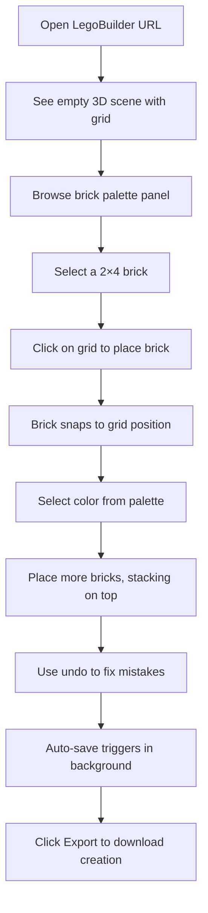
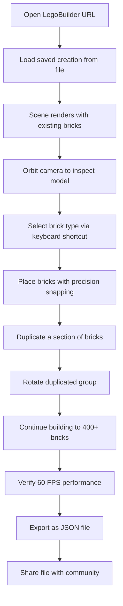
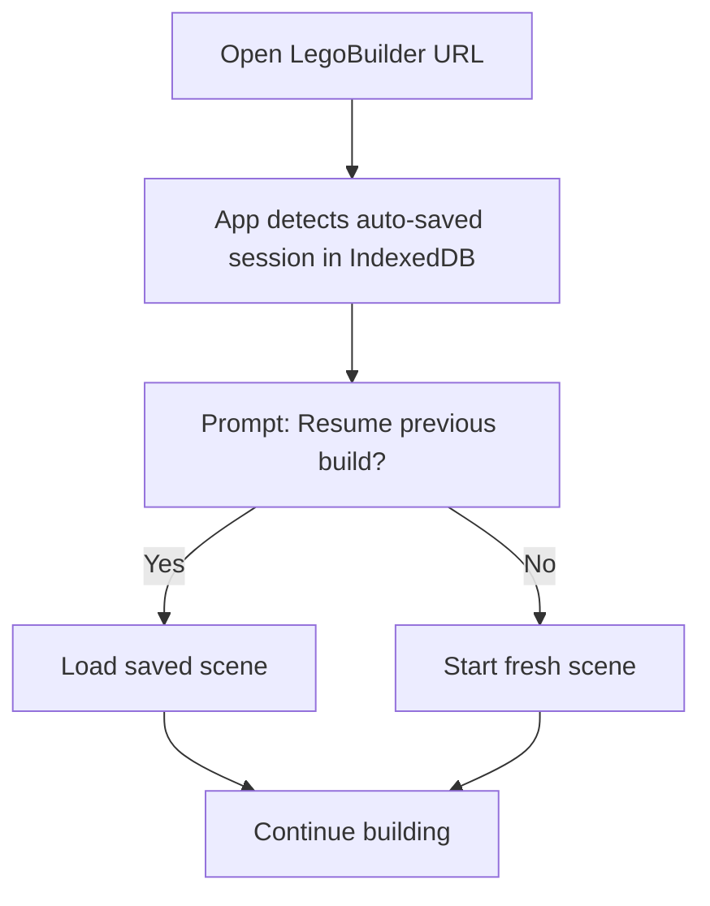

# Product Requirements Document (PRD) — LegoBuilder

---

## Document Version

| Version | Date | Changes | OpenSpec Change |
|---------|------|---------|-----------------|
| 1.0 | 2026-04-10 | Initial PRD | `initial-mvp` |

---

## 0. Constitution Reference

> This PRD is governed by the project constitution at `.spectra/constitution.md`.
> The governance depth, quality standards, and compliance requirements defined there
> apply to all specifications in this document.

| Constitution Attribute | Value |
|----------------------|-------|
| **Governance Depth** | Lightweight |
| **Compliance** | NONE |
| **Active Regulation Packs** | None |
| **Regulation Test Cases Scaffolded** | NO |
| **Compliance Review Cadence** | RELEASE_ONLY |
| **TDD Required** | YES |
| **EDD Required** | NO |
| **Model Tier Policy** | DEFAULT |
| **SLM Optimization** | DISABLED |
| **Lifecycle Hooks** | DEFAULT |
| **Delegation Policy** | DEFAULT |
| **Maturity Lever Target** | 2 |
| **Behavioral Verification Dashboard** | DISABLED |
| **E2E Testing** | ENABLED |

---

## 0b. Redundancy Analysis

> **Anti-redundancy check result:** No existing Spectra-governed products in this organization.
> This is the first Spectra project — no overlapping FRs, personas, or business processes detected.

| Check | Result | Action |
|-------|--------|--------|
| **Overlapping FRs** | NONE — first project in org | N/A |
| **Same Target Persona** | NONE | N/A |
| **Overlapping Business Processes** | NONE | N/A |
| **Reuse Recommendations** | NONE | N/A |

---

## 1. Overview

### 1.1 Product Name

LegoBuilder

### 1.2 Description

LegoBuilder is a browser-based 3D brick-building application that enables users to design, assemble, and share virtual Lego-style creations directly in the browser. Built with React 18, TypeScript, and Three.js (via @react-three/fiber), it provides an intuitive drag-and-drop interface with real-time 3D rendering, snap-to-grid placement, and a rich palette of brick types and colors. The MVP targets desktop-first usage with responsive tablet support, local persistence via IndexedDB, and file-based export/import for sharing.

### 1.3 Goals

| ID | Goal | Success Metric | Priority |
|----|------|---------------|:--------:|
| G-1 | Deliver a performant browser-based 3D brick builder that handles up to 500 bricks at 60 FPS | p95 frame time < 16.7ms with 500 bricks on mid-range hardware | P0 |
| G-2 | Provide intuitive snap-to-grid brick placement with zero learning curve | 90% of first-time users place 10 bricks within 2 minutes (usability test) | P0 |
| G-3 | Enable users to save, load, and share their creations | 100% round-trip fidelity on export/import (no data loss) | P0 |
| G-4 | Support a diverse brick palette with standard Lego-compatible dimensions | Minimum 6 brick types × 12 colors available at launch | P1 |

### 1.4 Non-Goals (Explicitly Out of Scope)

| ID | Non-Goal | Why It's Out of Scope |
|----|----------|----------------------|
| NG-1 | Multiplayer / real-time collaboration | Significantly expands backend requirements; deferred to v2.0 |
| NG-2 | Cloud save / user accounts | Requires authentication infrastructure; deferred to v2.0 |
| NG-3 | LDraw official part library integration | Licensing implications require legal review; deferred to v2.0 |
| NG-4 | Mobile phone support | 3D interaction on small screens is suboptimal; tablet is minimum |
| NG-5 | Physics simulation | Not needed for static brick building; adds complexity without MVP value |
| NG-6 | Monetization / in-app purchases | Premature for MVP; focus on user experience first |

### 1.5 Anti-Goals (Actively Avoid)

| ID | Anti-Goal | Why It's Harmful | Detection |
|----|-----------|-----------------|----------|
| AG-1 | Performance degradation below 30 FPS at 500 bricks | Users abandon laggy 3D apps within seconds; core value proposition destroyed | Automated performance tests measuring frame time at 500-brick scenes |
| AG-2 | Data loss on save/load cycles | Users losing hours of creative work destroys trust permanently | Round-trip fidelity tests on every export format |
| AG-3 | Inaccessible UI that requires 3D expertise | Target audience includes casual users and children; expert-only UI kills adoption | Usability testing with non-technical users; WCAG 2.1 AA compliance checks |
| AG-4 | Vendor lock-in to proprietary file formats | Users must own their data; proprietary formats prevent ecosystem growth | Export format is documented JSON; import accepts standard formats |

### 1.6 OKRs (Objectives and Key Results)

**Objective 1: Deliver a delightful 3D building experience**

| KR ID | Key Result | Baseline | Target | Status |
|-------|-----------|----------|--------|:------:|
| KR-1.1 | Scene renders at ≥60 FPS with 500 bricks on mid-range hardware | 0 FPS (no product) | ≥60 FPS | 🔴 Not Started |
| KR-1.2 | First-time users place 10 bricks within 2 minutes | N/A | 90% success rate | 🔴 Not Started |
| KR-1.3 | Brick snap accuracy within 0.01 stud units | N/A | 100% snaps correct | 🔴 Not Started |

**Objective 2: Enable creation persistence and sharing**

| KR ID | Key Result | Baseline | Target | Status |
|-------|-----------|----------|--------|:------:|
| KR-2.1 | Export/import round-trip with zero data loss | N/A | 100% fidelity | 🔴 Not Started |
| KR-2.2 | Auto-save triggers within 5 seconds of last change | N/A | 100% of changes persisted | 🔴 Not Started |
| KR-2.3 | Users can share creations via file download | N/A | Export completes in <2s for 500-brick scene | 🔴 Not Started |

### 1.7 Goal–FR–OKR Traceability

| FR ID | Traces to Goal | Traces to KR | Violates Non-Goal? | Violates Anti-Goal? |
|-------|:-------------:|:------------:|:------------------:|:-------------------:|
| FR-SCENE-001 | G-1 | KR-1.1 | No | No |
| FR-SCENE-002 | G-1 | KR-1.1 | No | No |
| FR-SCENE-003 | G-1 | KR-1.1 | No | No |
| FR-BRICK-001 | G-2, G-4 | KR-1.2, KR-1.3 | No | No |
| FR-BRICK-002 | G-2 | KR-1.2, KR-1.3 | No | No |
| FR-BRICK-003 | G-4 | KR-1.2 | No | No |
| FR-BRICK-004 | G-2 | KR-1.2 | No | No |
| FR-EDIT-001 | G-2 | KR-1.2 | No | No |
| FR-EDIT-002 | G-2 | KR-1.2 | No | No |
| FR-EDIT-003 | G-2 | KR-1.2 | No | No |
| FR-CAM-001 | G-1 | KR-1.1 | No | No |
| FR-CAM-002 | G-1 | KR-1.1 | No | No |
| FR-PERS-001 | G-3 | KR-2.1, KR-2.2 | No | No |
| FR-PERS-002 | G-3 | KR-2.1, KR-2.2 | No | No |
| FR-EXPORT-001 | G-3 | KR-2.1, KR-2.3 | No | No |
| FR-EXPORT-002 | G-3 | KR-2.1, KR-2.3 | No | No |
| FR-UI-001 | G-2 | KR-1.2 | No | No |
| FR-UI-002 | G-2, G-4 | KR-1.2 | No | No |
| FR-UI-003 | G-2 | KR-1.2 | No | No |
| FR-PERF-001 | G-1 | KR-1.1 | No | No |

### 1.8 What This Product Replaces (Innovator's Gift)

| Current Alternative | Type | Target Users Affected | Primary Pain Point |
|---------------------|------|----------------------|-------------------|
| Mecabricks.com | Product | Hobbyist Lego builders | Requires account creation; complex UI; slow rendering for large models |
| Bricklink Studio 2.0 | Product | Serious Lego designers | Desktop-only native app; heavy install; steep learning curve |
| BrickLink Stud.io | Product | MOC (My Own Creation) builders | No browser access; Windows/Mac only; no casual mode |
| Physical Lego bricks | DIY | Children, families, casual builders | Expensive; limited pieces; no undo; cleanup required |
| Generic 3D tools (Blender, TinkerCAD) | Workaround | Tech-savvy builders | Not brick-specific; no snap-to-grid; no stud system |

**Why They'll Switch**:
- Zero-install browser experience — open a URL and start building immediately
- Intuitive snap-to-grid eliminates the learning curve of generic 3D tools
- Free and open format — no vendor lock-in, no account required for MVP
- Performant 3D rendering that handles 500+ bricks without lag

**Switching Friction Mitigation**:
- JSON export format is human-readable and documented for interoperability
- Familiar brick metaphor requires no 3D modeling knowledge
- Progressive disclosure: simple tools visible first, advanced features discoverable

---

## 2. Personas

### 2.1 Casual Builder (Casey)

- **Description**: A casual user (age 8–65) who wants to build Lego-style creations for fun without installing software or creating accounts. May be a parent building with children or an adult hobbyist.
- **Access Level**: public
- **Capabilities**:
  - Place, move, rotate, and delete bricks in the 3D scene
  - Select brick types and colors from the palette
  - Save and load creations locally
  - Export creations as files to share
- **Constraints**:
  - No prior 3D modeling experience assumed
  - May use a trackpad instead of a mouse
  - Expects immediate visual feedback for every action

### 2.2 Enthusiast Designer (Dana)

- **Description**: An experienced Lego hobbyist or MOC designer who builds complex models (200–500 bricks) and wants precise control over placement, efficient workflows, and the ability to share designs.
- **Access Level**: public
- **Capabilities**:
  - All Casual Builder capabilities
  - Use keyboard shortcuts for rapid building
  - Undo/redo with full history
  - Duplicate groups of bricks
  - Navigate complex scenes with orbit/pan/zoom
- **Constraints**:
  - Expects professional-grade snap accuracy
  - Needs performance at 500 bricks without frame drops
  - Wants export in formats compatible with other Lego tools (future)

---

## 2b. Business Processes & AI Opportunities

> No AI/agentic capabilities identified for MVP. This is a client-side creative tool.
> AI features (e.g., AI-assisted building suggestions, auto-completion of patterns) may be
> explored in v2.0+.

| Process ID | Business Process | Current State | Pain Points | AI Opportunity | Proposed AI Capability |
|:----------:|-----------------|---------------|-------------|:--------------:|----------------------|
| BP-1 | 3D brick placement and assembly | Manual (new product) | N/A — greenfield | NO | N/A |
| BP-2 | Creation persistence and sharing | Manual (new product) | N/A — greenfield | NO | N/A |

---

## 2c. Skill & Plugin Requirements

| Requirement ID | Type | Name | Purpose | Custom? |
|---------------|------|------|---------|--------|
| SK-001 | Governance Skill | `governance-tdd` | Enforce test-first development | No (core) |
| SK-002 | Governance Skill | `governance-traceability` | FR → Test → Code linkage | No (core) |
| SK-003 | Governance Skill | `workflow-git-branching` | Branch naming and PR conventions | No (core) |
| SK-004 | Governance Skill | `workflow-agent-handoff` | Agent transition artifacts | No (core) |

---

## 3. User Journeys

### 3.1 First-Time Build (Casual Builder)

### 3.2 Complex Build Session (Enthusiast Designer)

### 3.3 Resume Previous Build

---

## 4. Functional Requirements (FR)

### 4.1 Scene Management

| ID | Requirement | Personas | Priority | Source |
|----|-------------|----------|----------|--------|
| FR-SCENE-001 | The application SHALL render a 3D scene using Three.js via @react-three/fiber with a visible ground grid plane | Casey, Dana | P0 | `initial-mvp` |
| FR-SCENE-002 | The application SHALL use InstancedMesh rendering to batch identical brick geometries for performance | Dana | P0 | `initial-mvp` |
| FR-SCENE-003 | The application SHALL use three-mesh-bvh for accelerated raycasting to determine brick placement positions | Casey, Dana | P0 | `initial-mvp` |

**Acceptance Criteria — FR-SCENE-001:**
- Given the application loads, when the 3D canvas renders, then a ground grid plane is visible with grid lines at 1-stud intervals.
- Given the scene is empty, when the user views the canvas, then the grid extends at least 32×32 studs.
- Given the scene renders, when measured on a mid-range device (e.g., Intel i5 + integrated GPU), then the empty scene achieves ≥60 FPS.

**Acceptance Criteria — FR-SCENE-002:**
- Given 100 identical 2×4 bricks are placed, when the scene renders, then all 100 bricks are drawn in a single InstancedMesh draw call.
- Given 500 bricks of mixed types are placed, when the scene renders, then the number of draw calls equals the number of unique brick geometries (not the number of bricks).
- Given InstancedMesh is used, when a single brick's color changes, then only that instance's color attribute updates (no full re-render).

**Acceptance Criteria — FR-SCENE-003:**
- Given the user hovers over the scene, when raycasting determines the hover target, then the raycast completes in <2ms for a 500-brick scene.
- Given three-mesh-bvh is enabled, when compared to naive raycasting, then raycast performance improves by at least 5× for scenes with >100 bricks.

### 4.2 Brick Placement & Manipulation

| ID | Requirement | Personas | Priority | Source |
|----|-------------|----------|----------|--------|
| FR-BRICK-001 | The application SHALL provide snap-to-grid placement using an occupancy map and raycasting so bricks align to stud positions | Casey, Dana | P0 | `initial-mvp` |
| FR-BRICK-002 | The application SHALL support brick stacking where bricks placed on top of existing bricks snap to the correct vertical position | Casey, Dana | P0 | `initial-mvp` |
| FR-BRICK-003 | The application SHALL provide a brick palette with at least 6 brick types (1×1, 1×2, 2×2, 2×4, 1×4, 2×3) and 12 colors | Casey, Dana | P0 | `initial-mvp` |
| FR-BRICK-004 | The application SHALL support brick rotation in 90-degree increments around the vertical axis before and after placement | Casey, Dana | P1 | `initial-mvp` |

**Acceptance Criteria — FR-BRICK-001:**
- Given the user clicks on the grid, when a brick is placed, then the brick's position aligns exactly to the nearest stud position (within 0.01 stud units).
- Given the occupancy map tracks placed bricks, when the user attempts to place a brick in an occupied position, then the placement is rejected with visual feedback (red highlight).
- Given a 2×4 brick is selected, when placed on the grid, then it occupies exactly 8 stud positions in the occupancy map.

**Acceptance Criteria — FR-BRICK-002:**
- Given a brick exists on the grid, when the user places a new brick on top of it, then the new brick's vertical position equals the existing brick's top surface height.
- Given a stack of 3 bricks, when a 4th brick is placed on top, then the vertical position is exactly 3× brick height above the grid.
- Given the user hovers over a brick's top surface, when the placement preview renders, then it shows the new brick at the correct stacking height.

**Acceptance Criteria — FR-BRICK-003:**
- Given the brick palette panel is visible, when the user views it, then at least 6 brick types are listed with visual previews.
- Given the color picker is open, when the user views it, then at least 12 distinct colors are available.
- Given a brick type and color are selected, when the user places a brick, then it renders with the selected type geometry and color.

**Acceptance Criteria — FR-BRICK-004:**
- Given a brick is selected for placement, when the user presses the R key, then the brick preview rotates 90° clockwise around the Y-axis.
- Given a placed brick is selected, when the user presses R, then the brick rotates 90° in place without changing its grid position.
- Given a 2×4 brick is rotated 90°, when placed, then it occupies the correct rotated stud positions in the occupancy map.

### 4.3 Editing Operations

| ID | Requirement | Personas | Priority | Source |
|----|-------------|----------|----------|--------|
| FR-EDIT-001 | The application SHALL support selecting a placed brick by clicking on it, with visual highlight indicating selection | Casey, Dana | P0 | `initial-mvp` |
| FR-EDIT-002 | The application SHALL support deleting a selected brick, removing it from the scene and occupancy map | Casey, Dana | P0 | `initial-mvp` |
| FR-EDIT-003 | The application SHALL support undo/redo using the command pattern with at least 50 levels of history | Dana | P0 | `initial-mvp` |

**Acceptance Criteria — FR-EDIT-001:**
- Given bricks exist in the scene, when the user clicks on a brick, then the brick displays a visible selection highlight (outline or color change).
- Given a brick is selected, when the user clicks on a different brick, then the previous selection is cleared and the new brick is highlighted.
- Given a brick is selected, when the user clicks on empty space, then the selection is cleared.

**Acceptance Criteria — FR-EDIT-002:**
- Given a brick is selected, when the user presses the Delete key, then the brick is removed from the 3D scene.
- Given a brick is deleted, when the occupancy map is checked, then the stud positions previously occupied by that brick are now free.
- Given a brick is deleted, when the user immediately undoes, then the brick reappears in its original position and color.

**Acceptance Criteria — FR-EDIT-003:**
- Given the user places a brick, when Ctrl+Z is pressed, then the brick placement is undone and the brick disappears.
- Given 50 actions have been performed, when Ctrl+Z is pressed 50 times, then all 50 actions are undone in reverse order.
- Given the user undoes an action, when Ctrl+Y (or Ctrl+Shift+Z) is pressed, then the action is redone.
- Given the user undoes 3 actions then performs a new action, when the redo stack is checked, then it is cleared (branching history is discarded).

### 4.4 Camera Controls

| ID | Requirement | Personas | Priority | Source |
|----|-------------|----------|----------|--------|
| FR-CAM-001 | The application SHALL provide orbit, pan, and zoom camera controls using mouse/trackpad input | Casey, Dana | P0 | `initial-mvp` |
| FR-CAM-002 | The application SHALL provide a "reset camera" button that returns to the default isometric view | Casey | P1 | `initial-mvp` |

**Acceptance Criteria — FR-CAM-001:**
- Given the 3D scene is visible, when the user right-click-drags (or two-finger drags on trackpad), then the camera orbits around the scene center.
- Given the 3D scene is visible, when the user middle-click-drags (or shift+two-finger drags), then the camera pans.
- Given the 3D scene is visible, when the user scrolls the mouse wheel (or pinch gesture), then the camera zooms in/out.
- Given camera controls are active, when the user interacts, then the frame rate remains ≥60 FPS.

**Acceptance Criteria — FR-CAM-002:**
- Given the camera has been moved from default, when the user clicks "Reset Camera", then the camera returns to the default isometric position and orientation.
- Given the reset occurs, when the transition completes, then it animates smoothly over 300–500ms (not instant jump).

### 4.5 Persistence

| ID | Requirement | Personas | Priority | Source |
|----|-------------|----------|----------|--------|
| FR-PERS-001 | The application SHALL auto-save the current scene to IndexedDB within 5 seconds of the last user action | Casey, Dana | P0 | `initial-mvp` |
| FR-PERS-002 | The application SHALL detect a previously saved session on load and prompt the user to resume or start fresh | Casey, Dana | P0 | `initial-mvp` |

**Acceptance Criteria — FR-PERS-001:**
- Given the user places a brick, when 5 seconds elapse with no further action, then the scene state is persisted to IndexedDB.
- Given the user performs rapid actions, when actions stop for 5 seconds, then only the final state is saved (debounced).
- Given a 500-brick scene, when auto-save triggers, then the save completes in <500ms without blocking the UI thread.
- Given the browser is closed unexpectedly, when the user reopens the app, then the last auto-saved state is available.

**Acceptance Criteria — FR-PERS-002:**
- Given a saved session exists in IndexedDB, when the app loads, then a modal prompts "Resume previous build?" with Yes/No options.
- Given the user clicks "Yes", when the scene loads, then all bricks from the saved session appear in their correct positions, types, and colors.
- Given the user clicks "No", when the scene loads, then an empty scene with the default grid is shown.
- Given no saved session exists, when the app loads, then no prompt appears and an empty scene is shown.

### 4.6 Export/Import

| ID | Requirement | Personas | Priority | Source |
|----|-------------|----------|----------|--------|
| FR-EXPORT-001 | The application SHALL export the current scene as a JSON file containing all brick positions, types, rotations, and colors | Casey, Dana | P0 | `initial-mvp` |
| FR-EXPORT-002 | The application SHALL import a previously exported JSON file and reconstruct the scene exactly | Casey, Dana | P0 | `initial-mvp` |

**Acceptance Criteria — FR-EXPORT-001:**
- Given a scene with bricks, when the user clicks "Export", then a JSON file is downloaded to the user's device.
- Given the exported JSON, when inspected, then it contains an array of brick objects each with: position (x, y, z), type, rotation, and color.
- Given a 500-brick scene, when export is triggered, then the file is generated and download starts within 2 seconds.
- Given the JSON format, when documented, then the schema is human-readable and versioned.

**Acceptance Criteria — FR-EXPORT-002:**
- Given a valid JSON file, when the user clicks "Import" and selects the file, then the scene is reconstructed with all bricks in their original positions.
- Given an exported file is imported, when compared to the original scene, then every brick matches in position, type, rotation, and color (100% fidelity).
- Given an invalid or corrupted JSON file, when import is attempted, then a user-friendly error message is displayed and the current scene is not modified.
- Given a JSON file from a newer version, when imported into an older version, then graceful degradation occurs with a warning (forward compatibility).

### 4.7 UI/UX

| ID | Requirement | Personas | Priority | Source |
|----|-------------|----------|----------|--------|
| FR-UI-001 | The application SHALL display a toolbar with buttons for: New Scene, Import, Export, Undo, Redo, Delete, and Reset Camera | Casey, Dana | P0 | `initial-mvp` |
| FR-UI-002 | The application SHALL display a brick palette sidebar showing available brick types with visual previews and a color picker | Casey, Dana | P0 | `initial-mvp` |
| FR-UI-003 | The application SHALL display a placement preview (ghost brick) showing where the brick will be placed before the user clicks | Casey, Dana | P1 | `initial-mvp` |

**Acceptance Criteria — FR-UI-001:**
- Given the app is loaded, when the user views the toolbar, then all 7 buttons (New, Import, Export, Undo, Redo, Delete, Reset Camera) are visible with recognizable icons.
- Given the undo history is empty, when the user views the Undo button, then it appears disabled (grayed out).
- Given the redo stack is empty, when the user views the Redo button, then it appears disabled.
- Given no brick is selected, when the user views the Delete button, then it appears disabled.

**Acceptance Criteria — FR-UI-002:**
- Given the app is loaded, when the user views the sidebar, then brick types are displayed as 3D thumbnail previews.
- Given the sidebar is visible, when the user clicks a brick type, then it becomes the active placement brick.
- Given the color picker is visible, when the user selects a color, then subsequent brick placements use that color.
- Given the sidebar, when viewed on a 1024px-wide screen, then it does not obscure more than 25% of the 3D canvas.

**Acceptance Criteria — FR-UI-003:**
- Given a brick type is selected, when the user hovers over a valid placement position, then a semi-transparent ghost brick appears at the snap position.
- Given the ghost brick is visible, when the user moves the mouse, then the ghost brick follows in real-time at ≥60 FPS.
- Given the placement position is invalid (occupied), when the ghost brick renders, then it appears in red to indicate rejection.

### 4.8 Performance

| ID | Requirement | Personas | Priority | Source |
|----|-------------|----------|----------|--------|
| FR-PERF-001 | The application SHALL maintain ≥60 FPS with up to 500 bricks using InstancedMesh batching and BVH-accelerated raycasting | Dana | P0 | `initial-mvp` |

**Acceptance Criteria — FR-PERF-001:**
- Given 500 bricks of mixed types are placed, when the scene renders on a mid-range device, then the frame rate is ≥60 FPS (p95 frame time <16.7ms).
- Given 500 bricks are placed, when the user orbits the camera, then no frame drops below 30 FPS occur.
- Given the performance budget, when measured, then the JavaScript heap usage stays below 200MB for a 500-brick scene.
- Given the application loads, when the initial render completes, then time-to-interactive is <3 seconds on a 10 Mbps connection.

---

## 5. Non-Functional Requirements (NFR)

| ID | Requirement | Target | Measurement | Source |
|----|-------------|--------|-------------|--------|
| NFR-PERF-001 | Performance — Frame Rate | ≥60 FPS with 500 bricks on mid-range hardware (Intel i5 + integrated GPU) | Automated performance test using Puppeteer measuring p95 frame time via `requestAnimationFrame` timestamps | `initial-mvp` |
| NFR-PERF-002 | Performance — Raycast Latency | <2ms per raycast in 500-brick scene | Instrumented raycast timing in development builds | `initial-mvp` |
| NFR-PERF-003 | Performance — Initial Load | Time-to-interactive <3 seconds on 10 Mbps connection | Lighthouse CI measuring TTI | `initial-mvp` |
| NFR-SCALE-001 | Scalability — Brick Count | Support up to 500 bricks per scene without degradation | Performance test suite with 100, 250, 500 brick scenes | `initial-mvp` |
| NFR-SEC-001 | Security — Input Validation | All imported JSON files validated against schema before processing; no arbitrary code execution | Unit tests with malformed/malicious JSON payloads | `initial-mvp` |
| NFR-SEC-002 | Security — Content Security Policy | CSP headers prevent XSS; no inline scripts; no eval() | CSP header audit + automated scan | `initial-mvp` |
| NFR-A11Y-001 | Accessibility — Keyboard Navigation | All toolbar and palette actions accessible via keyboard (Tab, Enter, arrow keys) | Manual + automated a11y audit (axe-core) | `initial-mvp` |
| NFR-A11Y-002 | Accessibility — Screen Reader | Toolbar buttons and palette items have ARIA labels; scene state announced on changes | Screen reader testing (NVDA/VoiceOver) | `initial-mvp` |
| NFR-REL-001 | Reliability — Data Persistence | Auto-saved data survives browser crash; zero data loss on normal close | Automated test: kill browser process, reopen, verify state | `initial-mvp` |
| NFR-REL-002 | Reliability — Error Recovery | Application recovers gracefully from WebGL context loss | Automated test: simulate context loss, verify scene re-renders | `initial-mvp` |
| NFR-MAINT-001 | Maintainability — Code Coverage | ≥60% backend (state logic) unit test coverage; ≥50% frontend component coverage | Jest/Vitest coverage reports in CI | `initial-mvp` |
| NFR-MAINT-002 | Maintainability — Type Safety | 100% TypeScript strict mode; zero `any` types in production code | `tsc --strict` with zero errors in CI | `initial-mvp` |

---

## 6. User Stories

### US-1: Place My First Brick

**As a** Casual Builder (Casey),
**I want to** select a brick from the palette and click on the grid to place it,
**So that** I can start building my creation immediately without reading instructions.

**Acceptance Criteria:**
- Given I open the app for the first time, when I see the brick palette, then I can identify brick shapes by their visual previews.
- Given I select a 2×4 brick, when I click on the grid, then the brick appears at the clicked position snapped to the grid.
- Given I place a brick, when I look at the scene, then the brick is rendered in the color I selected.

**Related FRs:** FR-BRICK-001, FR-BRICK-003, FR-UI-002, FR-UI-003

### US-2: Build a Tower

**As a** Casual Builder (Casey),
**I want to** stack bricks on top of each other,
**So that** I can build vertical structures like towers and walls.

**Acceptance Criteria:**
- Given a brick is on the grid, when I hover over its top surface, then a ghost brick appears at the correct stacking height.
- Given I click on the top surface, when the brick is placed, then it sits exactly on top of the existing brick.
- Given I stack 10 bricks, when I view the tower, then all bricks are aligned and there are no gaps.

**Related FRs:** FR-BRICK-001, FR-BRICK-002, FR-UI-003

### US-3: Fix a Mistake

**As a** Casual Builder (Casey),
**I want to** undo my last action,
**So that** I can fix mistakes without starting over.

**Acceptance Criteria:**
- Given I placed a brick in the wrong spot, when I press Ctrl+Z, then the brick is removed.
- Given I deleted a brick by accident, when I press Ctrl+Z, then the brick reappears.
- Given I undo too far, when I press Ctrl+Y, then the action is redone.

**Related FRs:** FR-EDIT-003, FR-UI-001

### US-4: Share My Creation

**As an** Enthusiast Designer (Dana),
**I want to** export my creation as a file and share it with others,
**So that** other builders can view and modify my design.

**Acceptance Criteria:**
- Given I have a 300-brick creation, when I click Export, then a JSON file downloads within 2 seconds.
- Given someone sends me a JSON file, when I click Import and select it, then the creation appears exactly as the original.
- Given the file is corrupted, when I try to import it, then I see a clear error message and my current work is preserved.

**Related FRs:** FR-EXPORT-001, FR-EXPORT-002

### US-5: Resume My Build

**As a** Casual Builder (Casey),
**I want to** close the browser and come back later to continue building,
**So that** I don't lose my progress.

**Acceptance Criteria:**
- Given I've been building for 10 minutes, when I close the browser tab, then my work is already auto-saved.
- Given I reopen the app, when the page loads, then I'm asked if I want to resume my previous build.
- Given I click "Yes", when the scene loads, then all my bricks are exactly where I left them.

**Related FRs:** FR-PERS-001, FR-PERS-002

### US-6: Build a Complex Model Efficiently

**As an** Enthusiast Designer (Dana),
**I want to** use keyboard shortcuts and precise camera controls,
**So that** I can build complex 400+ brick models without the UI slowing me down.

**Acceptance Criteria:**
- Given I'm building, when I press R, then the selected brick rotates 90°.
- Given I have 400 bricks placed, when I orbit the camera, then the frame rate stays above 60 FPS.
- Given I need to inspect a detail, when I zoom in, then the camera smoothly zooms to the target area.

**Related FRs:** FR-BRICK-004, FR-CAM-001, FR-PERF-001

---

## 7. Success Metrics

| Metric | Target | Measurement Method |
|--------|--------|-------------------|
| Frame rate at 500 bricks | ≥60 FPS (p95 frame time <16.7ms) | Automated Puppeteer performance test on CI |
| Time-to-interactive | <3 seconds on 10 Mbps | Lighthouse CI |
| Export/import fidelity | 100% round-trip accuracy | Automated test comparing pre-export and post-import scene state |
| Auto-save reliability | Zero data loss across 100 simulated browser crashes | Automated crash-recovery test |
| First-time user task completion | 90% place 10 bricks in <2 min | Usability testing (manual, pre-launch) |
| Accessibility compliance | WCAG 2.1 AA for all non-3D UI | axe-core automated audit + manual screen reader test |
| Code coverage (state logic) | ≥60% | Jest/Vitest coverage in CI |
| TypeScript strict compliance | Zero errors | `tsc --strict` in CI |

---

## 8. Dependencies & Integrations

| System | Purpose | Type |
|--------|---------|------|
| Three.js / @react-three/fiber | 3D rendering engine | NPM library |
| three-mesh-bvh | Accelerated raycasting for brick selection/placement | NPM library |
| @react-three/drei | Camera controls, helpers, and utilities | NPM library |
| Zustand + Immer | State management with immutable updates | NPM library |
| IndexedDB (via idb) | Local persistence for auto-save | Browser API / NPM wrapper |
| Tailwind CSS | UI styling for toolbar, palette, and modals | NPM library |
| Vite | Build tool and dev server | NPM dev dependency |
| Vitest | Unit and integration testing | NPM dev dependency |
| Playwright | E2E testing | NPM dev dependency |
| Puppeteer | Performance testing (frame rate measurement) | NPM dev dependency |

---

## 9. Feature Prioritization

| Priority | Features |
|----------|----------|
| P0 (Must Have) | FR-SCENE-001, FR-SCENE-002, FR-SCENE-003, FR-BRICK-001, FR-BRICK-002, FR-BRICK-003, FR-EDIT-001, FR-EDIT-002, FR-EDIT-003, FR-CAM-001, FR-PERS-001, FR-PERS-002, FR-EXPORT-001, FR-EXPORT-002, FR-UI-001, FR-UI-002, FR-PERF-001 |
| P1 (Should Have) | FR-BRICK-004, FR-CAM-002, FR-UI-003 |
| P2 (Nice to Have) | (None for MVP — all features are P0 or P1) |

---

## 10. Clarification Report

> The PM Agent performed a structured self-review of this PRD against the clarification checklist.
> The following items were identified and resolved with proposed defaults.

| CLR ID | Category | Flagged Item | Question Asked | Human Answer | Resolution |
|--------|----------|-------------|----------------|--------------|------------|
| CLR-01 | SCOPE | Multiplayer / cloud save | Should multiplayer or cloud save be included in MVP? | Deferred to v2.0 per researcher recommendation | Added as NG-1 and NG-2 in Non-Goals |
| CLR-02 | SCOPE | LDraw part library | Should official Lego part geometries be used? | Deferred to v2.0 pending legal review | Added as NG-3; MVP uses simplified brick geometries |
| CLR-03 | NFR_GAP | Mobile support threshold | What is the minimum supported screen size? | Desktop-first; tablet (1024px+) is minimum | Added constraint to personas; NG-4 excludes mobile phones |
| CLR-04 | FR_GAP | Brick count limit | What is the maximum supported brick count for MVP? | 500 bricks per researcher recommendation | Set as NFR-SCALE-001 target; referenced in G-1 and FR-PERF-001 |
| CLR-05 | EDGE_CASE | WebGL context loss | How should the app handle GPU/WebGL context loss? | Graceful recovery with scene re-render | Added NFR-REL-002 with specific recovery behavior |
| CLR-06 | EDGE_CASE | Corrupted import files | How should invalid JSON imports be handled? | Show error message, preserve current scene | Added to FR-EXPORT-002 acceptance criteria |
| CLR-07 | FR_GAP | Undo history depth | How many undo levels should be supported? | At least 50 levels | Specified in FR-EDIT-003 acceptance criteria |
| CLR-08 | PERSONA_GAP | Age range for Casual Builder | What age range is the target for casual users? | 8–65 (family-friendly) | Updated Casey persona description |

**Clarification pass: COMPLETE** — 8 items flagged and resolved.

---

## 11. Open Questions

- What specific simplified brick geometries should be used for MVP (exact dimensions in Three.js units)?
- Should the JSON export format include a schema version field for forward compatibility?
- What is the target bundle size budget for the initial load?
- Should keyboard shortcuts be customizable in v1.0 or use fixed defaults?

---

## 12. Appendix

### 12.1 Glossary

| Term | Definition |
|------|------------|
| Stud | The circular connector on top of a Lego brick; the fundamental unit of the grid system (1 stud = 8mm in real Lego) |
| InstancedMesh | A Three.js optimization that renders multiple copies of the same geometry in a single draw call |
| BVH | Bounding Volume Hierarchy — a spatial data structure that accelerates raycasting by reducing the number of intersection tests |
| Occupancy Map | A data structure tracking which stud positions are occupied by bricks, used for collision detection and snap-to-grid |
| Command Pattern | A behavioral design pattern where each user action is encapsulated as an object, enabling undo/redo |
| MOC | My Own Creation — a term used in the Lego community for custom designs |
| Ghost Brick | A semi-transparent preview of where a brick will be placed, shown before the user confirms placement |
| IndexedDB | A browser-based NoSQL database for storing structured data locally |
| Raycast | A technique that projects a ray from the camera through the mouse position to determine what 3D object the user is pointing at |

### 12.2 References

- Research Analysis: `docs/research/research_analysis.md`
- Three.js Documentation: https://threejs.org/docs/
- @react-three/fiber: https://docs.pmnd.rs/react-three-fiber
- three-mesh-bvh: https://github.com/gkjohnson/three-mesh-bvh
- Zustand: https://github.com/pmndrs/zustand
- Lego Dimensions Reference: https://www.mecabricks.com/en/docs/dimensions