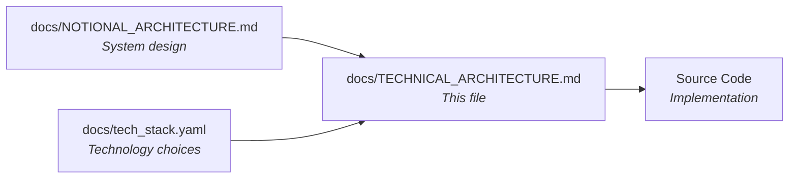

# Technical Architecture — LegoBuilder

> **This document describes HOW the system is implemented with specific technologies.**
>
> For system design (technology-agnostic), see `docs/NOTIONAL_ARCHITECTURE.md`.
> For technology choices reference, see `docs/tech_stack.yaml`.

---

## Document Relationships



| Document | Focus | Changes When |
|----------|-------|-------------|
| `docs/NOTIONAL_ARCHITECTURE.md` | System design | Component structure changes |
| `docs/tech_stack.yaml` | Technology mapping | Framework/version evolves |
| `docs/TECHNICAL_ARCHITECTURE.md` | Implementation (this file) | Tech implementation changes |

---

## 1. Technology Stack Summary

> Summary from `docs/tech_stack.yaml` — see that file for full details and rationale.

| Layer | Technology | Version |
|-------|------------|---------|
| **Language** | TypeScript | 5.x |
| **UI Framework** | React | 18.x |
| **Build Tool** | Vite | 5.x |
| **3D Rendering** | Three.js + @react-three/fiber | 0.170.x / 8.x |
| **3D Helpers** | @react-three/drei | 9.x |
| **Spatial Acceleration** | three-mesh-bvh | 0.7.x |
| **State Management** | Zustand + Immer | 4.x / 10.x |
| **CSS Framework** | Tailwind CSS | 3.x |
| **Persistence** | idb (IndexedDB) | 8.x |
| **Unit Testing** | Vitest | 2.x |
| **Component Testing** | React Testing Library | 16.x |
| **E2E Testing** | Playwright | 1.x |
| **Linting** | ESLint + Prettier | 9.x / 3.x |
| **Backend** | None (client-only SPA) | — |
| **Database** | None (IndexedDB only) | — |
| **LLM/AI** | None | — |

---

## 2. Frontend Implementation

### 2.1 Framework & Structure

**Framework:** React 18 (TypeScript 5.x) with Vite 5.x

```text
frontend/
├── public/
│   └── favicon.svg
├── src/
│   ├── components/           # React components
│   │   ├── ui/               # 2D UI components (Tailwind)
│   │   │   ├── Toolbar.tsx
│   │   │   ├── BrickPalette.tsx
│   │   │   ├── PropertyPanel.tsx
│   │   │   ├── StatusBar.tsx
│   │   │   └── KeyboardShortcuts.tsx
│   │   ├── viewport/         # 3D viewport components (@react-three/fiber)
│   │   │   ├── Scene.tsx
│   │   │   ├── Baseplate.tsx
│   │   │   ├── BrickMesh.tsx
│   │   │   ├── GhostPreview.tsx
│   │   │   ├── SelectionOutline.tsx
│   │   │   └── GridOverlay.tsx
│   │   └── App.tsx
│   ├── stores/               # Zustand state stores
│   │   ├── sceneStore.ts
│   │   ├── historyStore.ts
│   │   ├── selectionStore.ts
│   │   ├── uiStore.ts
│   │   └── cameraStore.ts
│   ├── engine/               # Core logic (technology-agnostic domain)
│   │   ├── brickCatalog.ts
│   │   ├── occupancyMap.ts
│   │   ├── placementEngine.ts
│   │   ├── commands.ts
│   │   ├── selectionManager.ts
│   │   └── exportSchema.ts
│   ├── services/             # Side-effect services
│   │   ├── persistenceService.ts
│   │   ├── exportService.ts
│   │   └── importService.ts
│   ├── hooks/                # Custom React hooks
│   │   ├── useBrickPlacement.ts
│   │   ├── useUndoRedo.ts
│   │   ├── useAutoSave.ts
│   │   ├── useKeyboardShortcuts.ts
│   │   └── useCameraControls.ts
│   ├── types/                # TypeScript type definitions
│   │   ├── brick.ts
│   │   ├── scene.ts
│   │   ├── commands.ts
│   │   └── project.ts
│   ├── utils/                # Utility functions
│   │   ├── gridMath.ts
│   │   ├── colorPalette.ts
│   │   └── debounce.ts
│   ├── main.tsx              # App entry point
│   └── index.css             # Tailwind imports
├── tests/
│   ├── unit/                 # Vitest unit tests
│   │   ├── occupancyMap.test.ts
│   │   ├── placementEngine.test.ts
│   │   ├── commands.test.ts
│   │   ├── brickCatalog.test.ts
│   │   └── exportSchema.test.ts
│   ├── component/            # React Testing Library tests
│   │   ├── BrickPalette.test.tsx
│   │   ├── Toolbar.test.tsx
│   │   └── App.test.tsx
│   └── e2e/                  # Playwright E2E tests
│       ├── brick-placement.spec.ts
│       └── save-load.spec.ts
├── package.json
├── tsconfig.json
├── vite.config.ts
├── tailwind.config.ts
├── postcss.config.js
├── eslint.config.js
├── playwright.config.ts
└── Dockerfile
```

### 2.2 Key Components

| Component | File | Purpose |
|-----------|------|---------|
| `App` | `components/App.tsx` | Root layout — splits viewport (left) and UI panels (right) |
| `Scene` | `components/viewport/Scene.tsx` | R3F Canvas wrapper — sets up camera, lights, and scene children |
| `BrickMesh` | `components/viewport/BrickMesh.tsx` | Renders placed bricks using InstancedMesh per geometry type |
| `GhostPreview` | `components/viewport/GhostPreview.tsx` | Semi-transparent preview of brick at cursor position during placement |
| `Toolbar` | `components/ui/Toolbar.tsx` | Top bar with undo/redo, save, load, export, import buttons |
| `BrickPalette` | `components/ui/BrickPalette.tsx` | Sidebar with brick type selection and color picker |
| `PropertyPanel` | `components/ui/PropertyPanel.tsx` | Shows selected brick properties; allows color change and rotation |
| `StatusBar` | `components/ui/StatusBar.tsx` | Bottom bar showing brick count, FPS, auto-save status |

### 2.3 State Management

**Approach:** Zustand stores with Immer middleware for immutable updates.

```typescript
// stores/sceneStore.ts
import { create } from 'zustand';
import { immer } from 'zustand/middleware/immer';

interface Brick {
  id: string;
  type: BrickType;
  position: [number, number, number];
  rotation: number; // 0, 90, 180, 270 degrees
  color: string;
}

interface SceneState {
  bricks: Map<string, Brick>;
  baseplate: { width: number; depth: number };
  addBrick: (brick: Brick) => void;
  removeBrick: (id: string) => void;
  updateBrick: (id: string, updates: Partial<Brick>) => void;
  clearScene: () => void;
}

export const useSceneStore = create<SceneState>()(
  immer((set) => ({
    bricks: new Map(),
    baseplate: { width: 32, depth: 32 },
    addBrick: (brick) =>
      set((state) => {
        state.bricks.set(brick.id, brick);
      }),
    removeBrick: (id) =>
      set((state) => {
        state.bricks.delete(id);
      }),
    updateBrick: (id, updates) =>
      set((state) => {
        const brick = state.bricks.get(id);
        if (brick) Object.assign(brick, updates);
      }),
    clearScene: () =>
      set((state) => {
        state.bricks.clear();
      }),
  }))
);
```

### 2.4 Command Pattern (Undo/Redo)

```typescript
// engine/commands.ts
interface Command {
  execute(): void;
  undo(): void;
  description: string;
}

class PlaceBrickCommand implements Command {
  constructor(
    private brick: Brick,
    private sceneStore: SceneStore,
    private occupancyMap: OccupancyMap
  ) {}

  execute(): void {
    this.sceneStore.addBrick(this.brick);
    this.occupancyMap.occupy(this.brick);
  }

  undo(): void {
    this.sceneStore.removeBrick(this.brick.id);
    this.occupancyMap.release(this.brick);
  }

  get description() {
    return `Place ${this.brick.type} at ${this.brick.position}`;
  }
}

// stores/historyStore.ts
interface HistoryState {
  undoStack: Command[];  // max 50 entries
  redoStack: Command[];
  executeCommand: (cmd: Command) => void;
  undo: () => void;
  redo: () => void;
  canUndo: boolean;
  canRedo: boolean;
}
```

### 2.5 Occupancy Map

```typescript
// engine/occupancyMap.ts
type GridKey = `${number},${number},${number}`;

class OccupancyMap {
  private grid: Map<GridKey, string> = new Map(); // GridKey → brickId

  /**
   * Check if all cells required by a brick at a position are free.
   * O(1) per cell check, O(w*d*h) per brick where w,d,h are brick dimensions.
   * For a 2×4 brick: O(8) = effectively O(1).
   */
  canPlace(type: BrickType, position: GridPosition): boolean {
    const cells = this.getCells(type, position);
    return cells.every((cell) => !this.grid.has(cell));
  }

  occupy(brick: Brick): void {
    const cells = this.getCells(brick.type, brick.position);
    cells.forEach((cell) => this.grid.set(cell, brick.id));
  }

  release(brick: Brick): void {
    const cells = this.getCells(brick.type, brick.position);
    cells.forEach((cell) => this.grid.delete(cell));
  }

  private getCells(type: BrickType, pos: GridPosition): GridKey[] {
    // Returns all grid cells occupied by this brick type at this position
    // Based on brick dimensions from BrickCatalog
  }
}
```

### 2.6 Brick Catalog

```typescript
// engine/brickCatalog.ts
interface BrickDefinition {
  type: BrickType;
  name: string;
  width: number;   // in stud units
  depth: number;   // in stud units
  height: number;  // in plate units (3 plates = 1 brick height)
  studs: [number, number][]; // stud positions relative to origin
  category: 'brick' | 'plate' | 'slope';
}

const BRICK_CATALOG: Record<BrickType, BrickDefinition> = {
  'brick-2x4': { type: 'brick-2x4', name: '2×4 Brick', width: 2, depth: 4, height: 3, studs: [...], category: 'brick' },
  'brick-2x2': { type: 'brick-2x2', name: '2×2 Brick', width: 2, depth: 2, height: 3, studs: [...], category: 'brick' },
  'brick-1x1': { type: 'brick-1x1', name: '1×1 Brick', width: 1, depth: 1, height: 3, studs: [...], category: 'brick' },
  'brick-1x2': { type: 'brick-1x2', name: '1×2 Brick', width: 1, depth: 2, height: 3, studs: [...], category: 'brick' },
  'slope-2x2': { type: 'slope-2x2', name: '2×2 Slope', width: 2, depth: 2, height: 3, studs: [...], category: 'slope' },
  'plate-1x4': { type: 'plate-1x4', name: '1×4 Plate', width: 1, depth: 4, height: 1, studs: [...], category: 'plate' },
};

const COLOR_PALETTE = [
  '#D01012', // Red
  '#0057A8', // Blue
  '#00852B', // Green
  '#FFD700', // Yellow
  '#FFFFFF', // White
  '#1B1B1B', // Black
  '#FF7E14', // Orange
  '#6B5A5A', // Dark Gray
  '#A0A0A0', // Light Gray
  '#8B4513', // Brown
] as const;
```

### 2.7 3D Rendering (InstancedMesh)

```typescript
// components/viewport/BrickMesh.tsx
import { useRef, useMemo } from 'react';
import { InstancedMesh, Matrix4, Color } from 'three';
import { useFrame } from '@react-three/fiber';

interface BrickMeshProps {
  brickType: BrickType;
  bricks: Brick[]; // All bricks of this type
}

export function BrickMesh({ brickType, bricks }: BrickMeshProps) {
  const meshRef = useRef<InstancedMesh>(null);
  const geometry = useMemo(() => createBrickGeometry(brickType), [brickType]);

  // Update instance matrices and colors when bricks change
  useFrame(() => {
    if (!meshRef.current) return;
    const mesh = meshRef.current;

    bricks.forEach((brick, i) => {
      const matrix = new Matrix4();
      matrix.makeRotationY((brick.rotation * Math.PI) / 180);
      matrix.setPosition(...brick.position);
      mesh.setMatrixAt(i, matrix);
      mesh.setColorAt(i, new Color(brick.color));
    });

    mesh.instanceMatrix.needsUpdate = true;
    if (mesh.instanceColor) mesh.instanceColor.needsUpdate = true;
    mesh.count = bricks.length;
  });

  return (
    <instancedMesh
      ref={meshRef}
      args={[geometry, undefined, 500]} // max 500 instances
    >
      <meshStandardMaterial />
    </instancedMesh>
  );
}
```

### 2.8 BVH-Accelerated Raycasting

```typescript
// hooks/useBrickPlacement.ts
import { computeBoundsTree, disposeBoundsTree, acceleratedRaycast } from 'three-mesh-bvh';
import { Mesh, Raycaster } from 'three';

// Patch Three.js for BVH acceleration
Mesh.prototype.raycast = acceleratedRaycast;

function setupBVH(mesh: Mesh): void {
  mesh.geometry.computeBoundsTree = computeBoundsTree;
  mesh.geometry.disposeBoundsTree = disposeBoundsTree;
  mesh.geometry.computeBoundsTree();
}

// Raycasting with BVH is O(log n) instead of O(n)
function pickBrick(raycaster: Raycaster, scene: Scene): Brick | null {
  const intersects = raycaster.intersectObjects(scene.children, true);
  if (intersects.length === 0) return null;
  return getBrickFromIntersection(intersects[0]);
}
```

---

## 3. Persistence Implementation

### 3.1 IndexedDB Schema

**Library:** idb v8.x (Promise-based IndexedDB wrapper)

```typescript
// services/persistenceService.ts
import { openDB, DBSchema, IDBPDatabase } from 'idb';

interface LegoBuilderDB extends DBSchema {
  projects: {
    key: string;           // project ID
    value: {
      id: string;
      name: string;
      scene: SerializedScene;
      thumbnail: string;   // base64 data URL
      createdAt: number;
      updatedAt: number;
    };
    indexes: {
      'by-updated': number;
    };
  };
  settings: {
    key: string;
    value: unknown;
  };
}

async function getDB(): Promise<IDBPDatabase<LegoBuilderDB>> {
  return openDB<LegoBuilderDB>('legobuilder', 1, {
    upgrade(db) {
      const projectStore = db.createObjectStore('projects', { keyPath: 'id' });
      projectStore.createIndex('by-updated', 'updatedAt');
      db.createObjectStore('settings');
    },
  });
}
```

### 3.2 Auto-Save

```typescript
// hooks/useAutoSave.ts
import { useEffect, useRef } from 'react';
import { useSceneStore } from '../stores/sceneStore';
import { persistenceService } from '../services/persistenceService';

const AUTO_SAVE_INTERVAL = 5000; // 5 seconds

export function useAutoSave() {
  const timerRef = useRef<ReturnType<typeof setTimeout>>();
  const scene = useSceneStore();

  useEffect(() => {
    // Debounced auto-save: resets timer on every state change
    if (timerRef.current) clearTimeout(timerRef.current);

    timerRef.current = setTimeout(async () => {
      await persistenceService.saveProject(scene.serialize());
    }, AUTO_SAVE_INTERVAL);

    return () => {
      if (timerRef.current) clearTimeout(timerRef.current);
    };
  }, [scene.bricks]); // Re-trigger on brick changes
}
```

### 3.3 Export/Import Schema

```typescript
// engine/exportSchema.ts
interface ExportSchema {
  version: '1.0.0';
  metadata: {
    name: string;
    createdAt: string;
    brickCount: number;
    application: 'LegoBuilder';
  };
  scene: {
    baseplate: { width: number; depth: number };
    bricks: Array<{
      id: string;
      type: BrickType;
      position: [number, number, number];
      rotation: number;
      color: string;
    }>;
  };
}

function validateImport(data: unknown): ExportSchema {
  // Validate schema version
  // Validate all required fields
  // Validate brick types exist in catalog
  // Validate positions are within baseplate bounds
  // Validate colors are in palette
  // Migrate from older schema versions if needed
}
```

---

## 4. Camera Implementation

### 4.1 OrbitControls Configuration

```typescript
// components/viewport/Scene.tsx
import { Canvas } from '@react-three/fiber';
import { OrbitControls } from '@react-three/drei';

export function Scene() {
  return (
    <Canvas
      camera={{ position: [20, 20, 20], fov: 50, near: 0.1, far: 1000 }}
      gl={{ antialias: true, alpha: false }}
    >
      <ambientLight intensity={0.6} />
      <directionalLight position={[10, 20, 10]} intensity={0.8} castShadow />

      <OrbitControls
        minDistance={5}
        maxDistance={100}
        minPolarAngle={0.1}
        maxPolarAngle={Math.PI / 2 - 0.05} // Prevent going below ground
        enableDamping
        dampingFactor={0.1}
      />

      <Baseplate />
      <GridOverlay />
      <BrickInstances />
      <GhostPreview />
      <SelectionOutline />
    </Canvas>
  );
}
```

---

## 5. Security Implementation

### 5.1 Client-Side Security

> LegoBuilder is a client-only SPA with no authentication, no API calls, and no sensitive data. Security concerns are limited to:

| Concern | Mitigation |
|---------|-----------|
| **XSS via imported JSON** | Strict schema validation on import; no `eval()` or `innerHTML` usage |
| **Storage quota abuse** | 5-project limit; quota detection with user notification |
| **Content Security Policy** | CSP headers set by hosting provider; restrict script sources |
| **Dependency vulnerabilities** | `npm audit` in CI pipeline; Dependabot alerts enabled |

### 5.2 Import Validation

```typescript
// services/importService.ts
function sanitizeImport(rawData: unknown): ExportSchema {
  // 1. Parse JSON (catches malformed input)
  // 2. Validate against ExportSchema type
  // 3. Validate brick count <= 500
  // 4. Validate all brick types exist in catalog
  // 5. Validate all colors are in palette
  // 6. Validate positions are within baseplate bounds
  // 7. Check for duplicate brick IDs
  // 8. Reject if any validation fails
  // No dynamic code execution from imported data
}
```

---

## 6. Infrastructure Configuration

### 6.1 Docker Configuration

```dockerfile
# frontend/Dockerfile
FROM node:20-alpine AS builder

WORKDIR /app
COPY package.json package-lock.json ./
RUN npm ci

COPY . .
RUN npm run build

FROM nginx:alpine
COPY --from=builder /app/dist /usr/share/nginx/html
COPY nginx.conf /etc/nginx/conf.d/default.conf
EXPOSE 80
CMD ["nginx", "-g", "daemon off;"]
```

### 6.2 Docker Compose (Development)

```yaml
# docker-compose.yml
version: '3.8'
services:
  frontend:
    build:
      context: ./frontend
      dockerfile: Dockerfile.dev
    ports:
      - "5173:5173"
    volumes:
      - ./frontend/src:/app/src
      - ./frontend/public:/app/public
    environment:
      - NODE_ENV=development
    command: npm run dev -- --host 0.0.0.0
```

### 6.3 Environment Variables

| Variable | Purpose | Example |
|----------|---------|---------|
| `VITE_APP_VERSION` | Display version in UI | `0.1.0` |
| `NODE_ENV` | Build mode | `development` / `production` |

> Minimal environment variables — no API keys, secrets, or server URLs needed for a client-only SPA.

---

## 7. Observability Implementation

### 7.1 Performance Monitoring

```typescript
// utils/performanceMonitor.ts
class PerformanceMonitor {
  private frameCount = 0;
  private lastTime = performance.now();
  private fps = 60;

  tick(): void {
    this.frameCount++;
    const now = performance.now();
    if (now - this.lastTime >= 1000) {
      this.fps = this.frameCount;
      this.frameCount = 0;
      this.lastTime = now;
    }
  }

  getFPS(): number {
    return this.fps;
  }

  measureOperation<T>(name: string, fn: () => T): T {
    const start = performance.now();
    const result = fn();
    const duration = performance.now() - start;
    if (duration > 16) { // > 1 frame at 60fps
      console.warn(`[perf] ${name} took ${duration.toFixed(1)}ms`);
    }
    return result;
  }
}
```

### 7.2 Metrics

| Metric | Type | Purpose |
|--------|------|---------|
| `fps` | Gauge | Current frames per second (target: ≥ 60) |
| `brick_count` | Gauge | Number of bricks in scene (max: 500) |
| `placement_latency_ms` | Histogram | Time to validate and place a brick (target: < 100ms) |
| `undo_latency_ms` | Histogram | Time to execute undo/redo (target: < 50ms) |
| `auto_save_latency_ms` | Histogram | Time to serialize and persist to IndexedDB |
| `memory_usage_mb` | Gauge | Estimated memory usage via `performance.memory` |

---

## 8. Testing Implementation

### 8.1 Unit Tests (Vitest)

```typescript
// tests/unit/occupancyMap.test.ts
import { describe, it, expect, beforeEach } from 'vitest';
import { OccupancyMap } from '../../src/engine/occupancyMap';

describe('OccupancyMap', () => {
  let map: OccupancyMap;

  beforeEach(() => {
    map = new OccupancyMap();
  });

  it('allows placement on empty grid', () => {
    expect(map.canPlace('brick-2x4', [0, 0, 0])).toBe(true);
  });

  it('rejects placement on occupied cells', () => {
    const brick = { id: '1', type: 'brick-2x4', position: [0, 0, 0], rotation: 0, color: '#D01012' };
    map.occupy(brick);
    expect(map.canPlace('brick-1x1', [0, 0, 0])).toBe(false);
  });

  it('frees cells on release', () => {
    const brick = { id: '1', type: 'brick-2x4', position: [0, 0, 0], rotation: 0, color: '#D01012' };
    map.occupy(brick);
    map.release(brick);
    expect(map.canPlace('brick-2x4', [0, 0, 0])).toBe(true);
  });
});
```

### 8.2 Component Tests (React Testing Library)

```typescript
// tests/component/BrickPalette.test.tsx
import { render, screen, fireEvent } from '@testing-library/react';
import { BrickPalette } from '../../src/components/ui/BrickPalette';

describe('BrickPalette', () => {
  it('renders all brick types', () => {
    render(<BrickPalette />);
    expect(screen.getByText('2×4 Brick')).toBeInTheDocument();
    expect(screen.getByText('2×2 Brick')).toBeInTheDocument();
    expect(screen.getByText('1×1 Brick')).toBeInTheDocument();
  });

  it('selects brick type on click', () => {
    render(<BrickPalette />);
    fireEvent.click(screen.getByText('2×4 Brick'));
    // Verify Zustand store updated
  });
});
```

### 8.3 E2E Tests (Playwright)

```typescript
// tests/e2e/brick-placement.spec.ts
import { test, expect } from '@playwright/test';

test('place a brick on the baseplate', async ({ page }) => {
  await page.goto('/');
  await expect(page.locator('[data-testid="viewport"]')).toBeVisible();

  // Select brick type
  await page.click('[data-testid="brick-2x4"]');

  // Click on viewport to place
  await page.click('[data-testid="viewport"]', { position: { x: 400, y: 300 } });

  // Verify brick count increased
  await expect(page.locator('[data-testid="brick-count"]')).toHaveText('1');
});
```

---

## 9. CI/CD Pipeline

### 9.1 GitHub Actions

```yaml
# .github/workflows/ci.yml
name: CI
on:
  push:
    branches: [main]
  pull_request:
    branches: [main]

jobs:
  lint:
    runs-on: ubuntu-latest
    steps:
      - uses: actions/checkout@v4
      - uses: actions/setup-node@v4
        with:
          node-version: '20'
          cache: 'npm'
          cache-dependency-path: frontend/package-lock.json
      - run: cd frontend && npm ci
      - run: cd frontend && npm run lint
      - run: cd frontend && npm run type-check

  test:
    runs-on: ubuntu-latest
    needs: lint
    steps:
      - uses: actions/checkout@v4
      - uses: actions/setup-node@v4
        with:
          node-version: '20'
          cache: 'npm'
          cache-dependency-path: frontend/package-lock.json
      - run: cd frontend && npm ci
      - run: cd frontend && npm run test -- --coverage

  build:
    runs-on: ubuntu-latest
    needs: test
    steps:
      - uses: actions/checkout@v4
      - uses: actions/setup-node@v4
        with:
          node-version: '20'
          cache: 'npm'
          cache-dependency-path: frontend/package-lock.json
      - run: cd frontend && npm ci
      - run: cd frontend && npm run build
```

---

## 10. Deployment Configuration

### 10.1 Static Hosting

LegoBuilder is a client-only SPA that produces static files (`index.html`, JS bundles, CSS). It can be deployed to any static hosting provider:

| Provider | Configuration |
|----------|--------------|
| GitHub Pages | `vite.config.ts` with `base: '/legobuilder/'` |
| Vercel | Zero-config; auto-detects Vite |
| Netlify | `netlify.toml` with `publish = "frontend/dist"` |
| CloudFlare Pages | Connect to GitHub; build command: `cd frontend && npm run build` |

### 10.2 Build Output

```text
frontend/dist/
├── index.html          # Entry point with CSP meta tags
├── assets/
│   ├── index-[hash].js # Main bundle (code-split)
│   ├── vendor-[hash].js # Three.js + React vendor chunk
│   └── index-[hash].css # Tailwind CSS output
└── favicon.svg
```

**Bundle size targets:**
- Main bundle: < 200 KB (gzipped)
- Vendor chunk (Three.js + React): < 300 KB (gzipped)
- Total initial load: < 500 KB (gzipped) for < 3s load time (NFR-PERF-003)

---

## 11. Keyboard Shortcuts

| Shortcut | Action | Component |
|----------|--------|-----------|
| `Ctrl+Z` / `Cmd+Z` | Undo | Edit History Manager |
| `Ctrl+Y` / `Cmd+Shift+Z` | Redo | Edit History Manager |
| `Ctrl+S` / `Cmd+S` | Save project | Persistence Manager |
| `Delete` / `Backspace` | Delete selected brick(s) | Selection & Transform |
| `R` | Rotate selected brick 90° | Selection & Transform |
| `Escape` | Deselect all / cancel placement | Selection & Transform |
| `1`–`6` | Quick-select brick type | Brick Catalog |
| `Ctrl+A` / `Cmd+A` | Select all bricks | Selection & Transform |
| `Ctrl+E` / `Cmd+E` | Export scene | Export Engine |

---

## Appendix: NFR Compliance Matrix

| NFR | Target | Implementation Strategy | Verification |
|-----|--------|------------------------|-------------|
| NFR-PERF-001 | ≥ 60 FPS @ 500 bricks | InstancedMesh per geometry type; BVH raycasting | FPS counter in StatusBar; Playwright perf test |
| NFR-PERF-002 | < 100ms placement | OccupancyMap O(1) checks; no network calls | `performance.now()` measurement in placement hook |
| NFR-PERF-003 | < 3s initial load | Vite code splitting; lazy loading; gzip | Lighthouse CI check |
| NFR-PERF-004 | < 512 MB memory | InstancedMesh geometry sharing; Immer structural sharing | `performance.memory` monitoring |
| NFR-UX-001 | < 50ms undo/redo | Command pattern with pre-computed inverses | Vitest timing assertions |
| NFR-UX-002 | Desktop + tablet | Tailwind responsive; touch event normalization | Playwright viewport tests |
| NFR-DATA-001 | 5s debounced auto-save | `useAutoSave` hook with `setTimeout` debounce | Vitest timer mocking |
| NFR-DATA-002 | 5 projects max | IndexedDB project count check; quota API | Vitest + mock IndexedDB |
| NFR-DATA-003 | Versioned JSON | `ExportSchema` with version field + migration | Vitest schema validation |
| NFR-ACC-001 | Keyboard nav | `useKeyboardShortcuts` hook; focus management | Playwright keyboard tests |
| NFR-ACC-002 | WCAG 2.1 AA | Tailwind color utilities; contrast-checked palette | axe-core in Playwright |
| NFR-COMPAT-001 | 4 browsers (latest 2) | Vite browserslist; WebGL2 feature detection | Playwright multi-browser |
