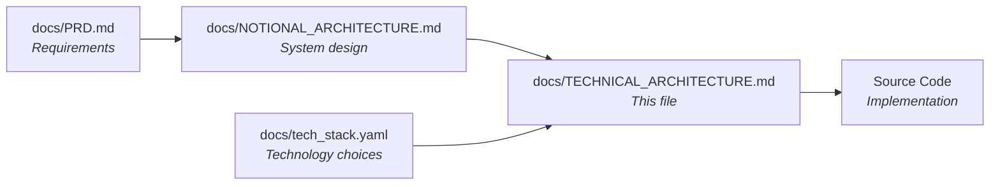

# Technical Architecture — LegoBuilder

> **This document describes HOW the system is implemented with specific technologies.**
>
> For system design (technology-agnostic), see `docs/NOTIONAL_ARCHITECTURE.md`.
> For technology choices reference, see `docs/tech_stack.yaml`.

---

## Document Relationships



| Document | Focus | Changes When |
|----------|-------|-------------|
| `docs/PRD.md` | Requirements (FR/NFR) | Business needs change |
| `docs/NOTIONAL_ARCHITECTURE.md` | System design | Component structure changes |
| `docs/tech_stack.yaml` | Technology mapping | Framework/version evolves |
| `docs/TECHNICAL_ARCHITECTURE.md` | Implementation (this file) | Tech implementation changes |

---

## 1. Technology Stack Summary

> Summary from `docs/tech_stack.yaml` — see that file for full details and rationale.

| Layer | Technology | Version |
|-------|------------|--------|
| **Language** | TypeScript | 5.x |
| **Framework** | React | 18.x |
| **Build Tool** | Vite | 5.x |
| **3D Rendering** | Three.js via @react-three/fiber | Three 0.160.x, R3F 8.x |
| **3D Helpers** | @react-three/drei | 9.x |
| **BVH Raycasting** | three-mesh-bvh | latest |
| **State Management** | Zustand + Immer | 4.x |
| **CSS Framework** | Tailwind CSS | 3.x |
| **Local Storage** | IndexedDB via idb | 8.x |
| **Unit Testing** | Vitest | latest |
| **Component Testing** | React Testing Library | latest |
| **E2E Testing** | Playwright | latest |
| **Linting** | ESLint + Prettier | 8.x |
| **Container** | Docker (nginx) | latest |
| **Orchestration** | KIND (Kubernetes) | latest |
| **CI/CD** | GitHub Actions | — |

---

## 2. Frontend Implementation

> LegoBuilder is a client-only SPA. There is no backend. This section covers the entire application.

### 2.1 Framework & Structure

**Framework:** React 18 (TypeScript 5.x) with Vite 5.x

```text
frontend/
├── public/
│   └── favicon.ico
├── src/
│   ├── components/           # React components
│   │   ├── canvas/             # 3D viewport components
│   │   │   ├── SceneCanvas.tsx   # Main R3F Canvas wrapper
│   │   │   ├── Grid.tsx          # 3D grid plane
│   │   │   ├── BrickMesh.tsx     # Individual brick rendering
│   │   │   ├── InstancedBricks.tsx # Batched brick rendering
│   │   │   ├── GhostBrick.tsx    # Placement preview overlay
│   │   │   ├── SelectionOutline.tsx # Selection highlight
│   │   │   └── CameraRig.tsx     # Camera controls wrapper
│   │   ├── ui/                 # 2D UI components
│   │   │   ├── Toolbar.tsx       # Top toolbar (undo/redo/delete/export)
│   │   │   ├── BrickPalette.tsx  # Sidebar brick type + color selector
│   │   │   ├── PropertyPanel.tsx # Selected brick properties
│   │   │   ├── SceneList.tsx     # Saved scenes list
│   │   │   ├── SaveDialog.tsx    # Save scene dialog
│   │   │   └── KeyboardShortcuts.tsx # Global keyboard handler
│   │   └── layout/             # Layout components
│   │       ├── AppShell.tsx      # Main layout wrapper
│   │       ├── Sidebar.tsx       # Left sidebar container
│   │       └── Header.tsx        # Top header/toolbar container
│   ├── stores/               # Zustand state stores
│   │   ├── sceneStore.ts       # Scene state (bricks, grid)
│   │   ├── uiStore.ts          # UI state (selected tool, palette)
│   │   ├── commandStore.ts     # Undo/redo command history
│   │   └── cameraStore.ts      # Camera state (position, target)
│   ├── engine/               # Core logic (non-React)
│   │   ├── placement.ts        # Snap-to-grid, collision detection
│   │   ├── occupancyMap.ts     # 3D grid for O(1) collision
│   │   ├── commands.ts         # Command pattern implementations
│   │   ├── selection.ts        # Selection logic
│   │   ├── brickCatalog.ts     # Brick type definitions
│   │   └── serialization.ts    # Scene JSON serialization/deserialization
│   ├── persistence/          # IndexedDB operations
│   │   ├── db.ts               # Database connection and schema
│   │   ├── sceneRepository.ts  # Scene CRUD operations
│   │   └── autoSave.ts         # 5-second debounced auto-save
│   ├── hooks/                # Custom React hooks
│   │   ├── useBrickPlacement.ts  # Placement workflow hook
│   │   ├── useSelection.ts       # Selection workflow hook
│   │   ├── useGhostBrick.ts      # Ghost preview hook
│   │   ├── useKeyboardShortcuts.ts # Keyboard binding hook
│   │   ├── useAutoSave.ts        # Auto-save lifecycle hook
│   │   └── useExport.ts          # Export/import hook
│   ├── types/                # TypeScript type definitions
│   │   ├── brick.ts            # Brick, BrickType, Color types
│   │   ├── scene.ts            # Scene, SceneMetadata types
│   │   ├── command.ts          # Command interface and types
│   │   └── grid.ts             # Grid, Position, OccupancyMap types
│   ├── utils/                # Utility functions
│   │   ├── math.ts             # 3D math helpers
│   │   └── debounce.ts         # Debounce utility
│   ├── App.tsx               # Root component
│   ├── main.tsx              # Vite entry point
│   └── index.css             # Tailwind CSS imports
├── tests/                    # Test files
│   ├── unit/                 # Unit tests (engine, stores)
│   ├── component/            # Component tests (RTL)
│   └── e2e/                  # E2E tests (Playwright)
├── package.json
├── tsconfig.json
├── vite.config.ts
├── tailwind.config.js
├── postcss.config.js
├── vitest.config.ts
├── playwright.config.ts
├── .eslintrc.cjs
├── .prettierrc
└── Dockerfile
```

### 2.2 Key Components

| Component | File | Purpose |
|-----------|------|--------|
| `SceneCanvas` | `components/canvas/SceneCanvas.tsx` | Main @react-three/fiber Canvas; sets up WebGL renderer, scene, and camera |
| `InstancedBricks` | `components/canvas/InstancedBricks.tsx` | Renders all bricks using InstancedMesh grouped by geometry type |
| `GhostBrick` | `components/canvas/GhostBrick.tsx` | Translucent preview mesh at cursor; green=valid, red=invalid |
| `Grid` | `components/canvas/Grid.tsx` | Renders the base grid plane with stud markers |
| `CameraRig` | `components/canvas/CameraRig.tsx` | Wraps OrbitControls with preset view transitions |
| `SelectionOutline` | `components/canvas/SelectionOutline.tsx` | Highlights selected bricks with outline effect |
| `Toolbar` | `components/ui/Toolbar.tsx` | Undo, redo, delete, new scene, save, export, screenshot buttons |
| `BrickPalette` | `components/ui/BrickPalette.tsx` | Brick type grid (1×1 to 4×2) + 10-color picker |
| `PropertyPanel` | `components/ui/PropertyPanel.tsx` | Shows selected brick type, position, color; allows color change |
| `SceneList` | `components/ui/SceneList.tsx` | Lists saved scenes with name, date, brick count, thumbnail |
| `AppShell` | `components/layout/AppShell.tsx` | Main layout: header + sidebar + 3D viewport |

### 2.3 State Management

**Approach:** Zustand stores with Immer middleware for immutable updates.

#### Scene Store (Primary State)

```typescript
// stores/sceneStore.ts
import { create } from 'zustand';
import { immer } from 'zustand/middleware/immer';

interface Brick {
  id: string;
  type: BrickType;       // '1x1' | '2x1' | '2x2' | '2x4' | '4x2'
  position: [number, number, number];  // grid coordinates
  rotation: number;      // 0, 90, 180, 270 degrees
  color: string;         // hex color from 10-color palette
}

interface SceneState {
  bricks: Record<string, Brick>;  // id -> Brick
  gridSize: [number, number];     // width x depth in studs
  sceneName: string;
  sceneId: string | null;
  isDirty: boolean;
  brickCount: number;
}

interface SceneActions {
  addBrick: (brick: Brick) => void;
  removeBrick: (id: string) => void;
  updateBrick: (id: string, updates: Partial<Brick>) => void;
  loadScene: (scene: SceneState) => void;
  clearScene: () => void;
  setDirty: (dirty: boolean) => void;
}

export const useSceneStore = create<SceneState & SceneActions>()(
  immer((set) => ({
    bricks: {},
    gridSize: [32, 32],
    sceneName: 'Untitled',
    sceneId: null,
    isDirty: false,
    brickCount: 0,

    addBrick: (brick) => set((state) => {
      state.bricks[brick.id] = brick;
      state.brickCount += 1;
      state.isDirty = true;
    }),

    removeBrick: (id) => set((state) => {
      delete state.bricks[id];
      state.brickCount -= 1;
      state.isDirty = true;
    }),

    updateBrick: (id, updates) => set((state) => {
      Object.assign(state.bricks[id], updates);
      state.isDirty = true;
    }),

    loadScene: (scene) => set(() => ({ ...scene, isDirty: false })),
    clearScene: () => set(() => ({
      bricks: {},
      brickCount: 0,
      sceneName: 'Untitled',
      sceneId: null,
      isDirty: false,
    })),
    setDirty: (dirty) => set({ isDirty: dirty }),
  }))
);
```

#### Command Store (Undo/Redo)

```typescript
// stores/commandStore.ts
import { create } from 'zustand';

interface Command {
  execute: () => void;
  undo: () => void;
  description: string;
}

interface CommandState {
  history: Command[];
  pointer: number;        // -1 = no history
  maxHistory: number;     // 50 levels
}

interface CommandActions {
  execute: (command: Command) => void;
  undo: () => void;
  redo: () => void;
  canUndo: () => boolean;
  canRedo: () => boolean;
  clear: () => void;
}

export const useCommandStore = create<CommandState & CommandActions>()((set, get) => ({
  history: [],
  pointer: -1,
  maxHistory: 50,

  execute: (command) => {
    command.execute();
    set((state) => {
      const newHistory = state.history.slice(0, state.pointer + 1);
      newHistory.push(command);
      if (newHistory.length > state.maxHistory) newHistory.shift();
      return { history: newHistory, pointer: newHistory.length - 1 };
    });
  },

  undo: () => {
    const { history, pointer } = get();
    if (pointer >= 0) {
      history[pointer].undo();
      set({ pointer: pointer - 1 });
    }
  },

  redo: () => {
    const { history, pointer } = get();
    if (pointer < history.length - 1) {
      history[pointer + 1].execute();
      set({ pointer: pointer + 1 });
    }
  },

  canUndo: () => get().pointer >= 0,
  canRedo: () => get().pointer < get().history.length - 1,
  clear: () => set({ history: [], pointer: -1 }),
}));
```

#### UI Store

```typescript
// stores/uiStore.ts
import { create } from 'zustand';

type Tool = 'place' | 'select' | 'move' | 'rotate' | 'delete';

interface UIState {
  activeTool: Tool;
  selectedBrickType: BrickType;
  selectedColor: string;
  selectedBrickIds: string[];
  sidebarOpen: boolean;
  sceneListOpen: boolean;
}

interface UIActions {
  setTool: (tool: Tool) => void;
  setBrickType: (type: BrickType) => void;
  setColor: (color: string) => void;
  setSelection: (ids: string[]) => void;
  addToSelection: (id: string) => void;
  clearSelection: () => void;
  toggleSidebar: () => void;
  toggleSceneList: () => void;
}

export const useUIStore = create<UIState & UIActions>()((set) => ({
  activeTool: 'place',
  selectedBrickType: '2x4',
  selectedColor: '#D01012',  // Classic red
  selectedBrickIds: [],
  sidebarOpen: true,
  sceneListOpen: false,

  setTool: (tool) => set({ activeTool: tool }),
  setBrickType: (type) => set({ selectedBrickType: type }),
  setColor: (color) => set({ selectedColor: color }),
  setSelection: (ids) => set({ selectedBrickIds: ids }),
  addToSelection: (id) => set((s) => ({ selectedBrickIds: [...s.selectedBrickIds, id] })),
  clearSelection: () => set({ selectedBrickIds: [] }),
  toggleSidebar: () => set((s) => ({ sidebarOpen: !s.sidebarOpen })),
  toggleSceneList: () => set((s) => ({ sceneListOpen: !s.sceneListOpen })),
}));
```

### 2.4 Core Engine

#### Brick Catalog

```typescript
// engine/brickCatalog.ts
export type BrickType = '1x1' | '2x1' | '2x2' | '2x4' | '4x2';

export interface BrickDefinition {
  type: BrickType;
  studsX: number;
  studsZ: number;
  height: number;       // in stud units (1 = standard brick height)
  label: string;
}

export const BRICK_CATALOG: Record<BrickType, BrickDefinition> = {
  '1x1': { type: '1x1', studsX: 1, studsZ: 1, height: 1, label: '1×1 Brick' },
  '2x1': { type: '2x1', studsX: 2, studsZ: 1, height: 1, label: '2×1 Brick' },
  '2x2': { type: '2x2', studsX: 2, studsZ: 2, height: 1, label: '2×2 Brick' },
  '2x4': { type: '2x4', studsX: 2, studsZ: 4, height: 1, label: '2×4 Brick' },
  '4x2': { type: '4x2', studsX: 4, studsZ: 2, height: 1, label: '4×2 Brick' },
};

export const COLOR_PALETTE = [
  '#D01012', // Red
  '#0057A8', // Blue
  '#237841', // Green
  '#FEC400', // Yellow
  '#FFFFFF', // White
  '#1B1B1B', // Black
  '#F57D20', // Orange
  '#6B327B', // Purple
  '#00BCD4', // Cyan
  '#8D7452', // Brown
];
```

#### Occupancy Map

```typescript
// engine/occupancyMap.ts
export class OccupancyMap {
  private grid: Map<string, string>;  // "x,y,z" -> brickId

  constructor() {
    this.grid = new Map();
  }

  private key(x: number, y: number, z: number): string {
    return `${x},${y},${z}`;
  }

  occupy(brickId: string, positions: [number, number, number][]): void {
    for (const [x, y, z] of positions) {
      this.grid.set(this.key(x, y, z), brickId);
    }
  }

  release(positions: [number, number, number][]): void {
    for (const [x, y, z] of positions) {
      this.grid.delete(this.key(x, y, z));
    }
  }

  isOccupied(x: number, y: number, z: number): boolean {
    return this.grid.has(this.key(x, y, z));
  }

  canPlace(positions: [number, number, number][]): boolean {
    return positions.every(([x, y, z]) => !this.isOccupied(x, y, z));
  }

  getBrickAt(x: number, y: number, z: number): string | undefined {
    return this.grid.get(this.key(x, y, z));
  }

  clear(): void {
    this.grid.clear();
  }
}
```

#### Command Pattern

```typescript
// engine/commands.ts
import { useSceneStore } from '../stores/sceneStore';
import { OccupancyMap } from './occupancyMap';

export class PlaceBrickCommand implements Command {
  constructor(
    private brick: Brick,
    private occupancyMap: OccupancyMap
  ) {}

  execute(): void {
    useSceneStore.getState().addBrick(this.brick);
    this.occupancyMap.occupy(this.brick.id, this.getPositions());
  }

  undo(): void {
    useSceneStore.getState().removeBrick(this.brick.id);
    this.occupancyMap.release(this.getPositions());
  }

  get description(): string {
    return `Place ${this.brick.type} at ${this.brick.position}`;
  }

  private getPositions(): [number, number, number][] {
    // Calculate all grid cells occupied by this brick
    // based on type, position, and rotation
    return calculateOccupiedCells(this.brick);
  }
}

export class DeleteBrickCommand implements Command {
  constructor(
    private brick: Brick,
    private occupancyMap: OccupancyMap
  ) {}

  execute(): void {
    useSceneStore.getState().removeBrick(this.brick.id);
    this.occupancyMap.release(this.getPositions());
  }

  undo(): void {
    useSceneStore.getState().addBrick(this.brick);
    this.occupancyMap.occupy(this.brick.id, this.getPositions());
  }

  get description(): string {
    return `Delete ${this.brick.type} at ${this.brick.position}`;
  }

  private getPositions(): [number, number, number][] {
    return calculateOccupiedCells(this.brick);
  }
}

export class MoveBrickCommand implements Command {
  constructor(
    private brickId: string,
    private fromPosition: [number, number, number],
    private toPosition: [number, number, number],
    private occupancyMap: OccupancyMap
  ) {}

  execute(): void {
    useSceneStore.getState().updateBrick(this.brickId, { position: this.toPosition });
    // Update occupancy map accordingly
  }

  undo(): void {
    useSceneStore.getState().updateBrick(this.brickId, { position: this.fromPosition });
    // Revert occupancy map
  }

  get description(): string {
    return `Move brick from ${this.fromPosition} to ${this.toPosition}`;
  }
}

export class RotateBrickCommand implements Command {
  constructor(
    private brickId: string,
    private fromRotation: number,
    private toRotation: number,
    private occupancyMap: OccupancyMap
  ) {}

  execute(): void {
    useSceneStore.getState().updateBrick(this.brickId, { rotation: this.toRotation });
  }

  undo(): void {
    useSceneStore.getState().updateBrick(this.brickId, { rotation: this.fromRotation });
  }

  get description(): string {
    return `Rotate brick to ${this.toRotation}°`;
  }
}

export class ChangeBrickColorCommand implements Command {
  constructor(
    private brickId: string,
    private fromColor: string,
    private toColor: string
  ) {}

  execute(): void {
    useSceneStore.getState().updateBrick(this.brickId, { color: this.toColor });
  }

  undo(): void {
    useSceneStore.getState().updateBrick(this.brickId, { color: this.fromColor });
  }

  get description(): string {
    return `Change color from ${this.fromColor} to ${this.toColor}`;
  }
}
```

### 2.5 Persistence Layer

#### IndexedDB Schema

```typescript
// persistence/db.ts
import { openDB, DBSchema, IDBPDatabase } from 'idb';

interface LegoBuilderDB extends DBSchema {
  scenes: {
    key: string;           // scene ID (UUID)
    value: {
      id: string;
      name: string;
      bricks: Record<string, Brick>;
      gridSize: [number, number];
      brickCount: number;
      thumbnail: string;   // base64 PNG
      createdAt: string;   // ISO 8601
      updatedAt: string;   // ISO 8601
      schemaVersion: number;
    };
    indexes: {
      'by-updated': string;
      'by-name': string;
    };
  };
}

const DB_NAME = 'legobuilder';
const DB_VERSION = 1;

export async function getDB(): Promise<IDBPDatabase<LegoBuilderDB>> {
  return openDB<LegoBuilderDB>(DB_NAME, DB_VERSION, {
    upgrade(db) {
      const store = db.createObjectStore('scenes', { keyPath: 'id' });
      store.createIndex('by-updated', 'updatedAt');
      store.createIndex('by-name', 'name');
    },
  });
}
```

#### Scene Repository

```typescript
// persistence/sceneRepository.ts
import { getDB } from './db';

export const sceneRepository = {
  async save(scene: SceneData): Promise<void> {
    const db = await getDB();
    await db.put('scenes', {
      ...scene,
      updatedAt: new Date().toISOString(),
      schemaVersion: 1,
    });
  },

  async load(id: string): Promise<SceneData | undefined> {
    const db = await getDB();
    return db.get('scenes', id);
  },

  async list(): Promise<SceneMetadata[]> {
    const db = await getDB();
    const scenes = await db.getAllFromIndex('scenes', 'by-updated');
    return scenes.reverse().map(({ id, name, brickCount, thumbnail, updatedAt }) => ({
      id, name, brickCount, thumbnail, updatedAt,
    }));
  },

  async delete(id: string): Promise<void> {
    const db = await getDB();
    await db.delete('scenes', id);
  },
};
```

#### Auto-Save

```typescript
// persistence/autoSave.ts
import { useSceneStore } from '../stores/sceneStore';
import { sceneRepository } from './sceneRepository';
import { debounce } from '../utils/debounce';

const AUTOSAVE_DELAY_MS = 5000;

const debouncedSave = debounce(async () => {
  const state = useSceneStore.getState();
  if (state.isDirty && state.sceneId) {
    await sceneRepository.save({
      id: state.sceneId,
      name: state.sceneName,
      bricks: state.bricks,
      gridSize: state.gridSize,
      brickCount: state.brickCount,
      thumbnail: '', // captured separately
      createdAt: '', // preserved from original
    });
    useSceneStore.getState().setDirty(false);
  }
}, AUTOSAVE_DELAY_MS);

export function initAutoSave(): () => void {
  return useSceneStore.subscribe(() => {
    debouncedSave();
  });
}
```

### 2.6 Export/Import

```typescript
// engine/serialization.ts
const SCHEMA_VERSION = 1;

export interface SceneExport {
  version: number;
  name: string;
  gridSize: [number, number];
  bricks: Array<{
    type: BrickType;
    position: [number, number, number];
    rotation: number;
    color: string;
  }>;
  exportedAt: string;
}

export function exportScene(state: SceneState): SceneExport {
  return {
    version: SCHEMA_VERSION,
    name: state.sceneName,
    gridSize: state.gridSize,
    bricks: Object.values(state.bricks).map(({ type, position, rotation, color }) => ({
      type, position, rotation, color,
    })),
    exportedAt: new Date().toISOString(),
  };
}

export function importScene(json: string): SceneState {
  const data = JSON.parse(json) as SceneExport;
  validateSchema(data);
  const migrated = migrateSchema(data);
  return deserializeToState(migrated);
}

function validateSchema(data: unknown): asserts data is SceneExport {
  // Validate required fields, types, and version
  if (!data || typeof data !== 'object') throw new Error('Invalid scene file');
  const d = data as Record<string, unknown>;
  if (typeof d.version !== 'number') throw new Error('Missing schema version');
  if (!Array.isArray(d.bricks)) throw new Error('Missing bricks array');
}

function migrateSchema(data: SceneExport): SceneExport {
  // Apply migrations for older schema versions
  let current = data;
  // Future: if (current.version === 1) { current = migrateV1toV2(current); }
  return current;
}
```

---

## 3. Performance Architecture

### 3.1 InstancedMesh Batching

Bricks are grouped by geometry type (5 types). Each group uses a single `THREE.InstancedMesh` with per-instance color and transform matrices.

```typescript
// components/canvas/InstancedBricks.tsx
import { useRef, useMemo, useEffect } from 'react';
import { InstancedMesh, Matrix4, Color } from 'three';
import { useSceneStore } from '../../stores/sceneStore';
import { BRICK_CATALOG, BrickType } from '../../engine/brickCatalog';

interface InstancedBrickGroupProps {
  brickType: BrickType;
}

export function InstancedBrickGroup({ brickType }: InstancedBrickGroupProps) {
  const meshRef = useRef<InstancedMesh>(null);
  const bricks = useSceneStore((s) =>
    Object.values(s.bricks).filter((b) => b.type === brickType)
  );

  const geometry = useMemo(() => {
    const def = BRICK_CATALOG[brickType];
    // Create BoxGeometry with stud dimensions
    // Add stud cylinders on top
    return createBrickGeometry(def);
  }, [brickType]);

  useEffect(() => {
    if (!meshRef.current) return;
    const mesh = meshRef.current;
    const matrix = new Matrix4();
    const color = new Color();

    bricks.forEach((brick, i) => {
      matrix.makeRotationY((brick.rotation * Math.PI) / 180);
      matrix.setPosition(...brick.position);
      mesh.setMatrixAt(i, matrix);
      mesh.setColorAt(i, color.set(brick.color));
    });

    mesh.instanceMatrix.needsUpdate = true;
    if (mesh.instanceColor) mesh.instanceColor.needsUpdate = true;
    mesh.count = bricks.length;
  }, [bricks]);

  return (
    <instancedMesh ref={meshRef} args={[geometry, undefined, 500]}>
      <meshStandardMaterial />
    </instancedMesh>
  );
}
```

**Performance impact:** Reduces draw calls from O(n) to O(5) for up to 500 bricks. At 500 bricks with 5 types, this is ~100x fewer draw calls.

### 3.2 BVH-Accelerated Raycasting

```typescript
// Raycasting setup with three-mesh-bvh
import { computeBoundsTree, disposeBoundsTree, acceleratedRaycast } from 'three-mesh-bvh';
import { BufferGeometry, Mesh } from 'three';

// Patch Three.js prototypes for BVH acceleration
BufferGeometry.prototype.computeBoundsTree = computeBoundsTree;
BufferGeometry.prototype.disposeBoundsTree = disposeBoundsTree;
Mesh.prototype.raycast = acceleratedRaycast;
```

**Performance impact:** Raycasting goes from O(n) triangle checks to O(log n) with BVH. Critical for smooth ghost brick preview at 60 FPS.

### 3.3 Occupancy Map

The occupancy map is a hash map keyed by `"x,y,z"` grid coordinates. Each brick occupies multiple cells based on its type and rotation.

- **Collision check:** O(1) per cell, O(cells_per_brick) per placement
- **Memory:** ~50 bytes per occupied cell, ~25KB for 500 bricks
- **Rebuild on load:** O(n) where n = total occupied cells

---

## 4. Component Integration Map

> This section defines how features compose into the app shell. It is the integration contract between architecture and downstream agents.

### 4.1 Frontend Component Tree

```text
App.tsx
├── AppShell.tsx (layout)
│   ├── Header.tsx
│   │   └── Toolbar.tsx [FR-UI-001, FR-EDIT-001, FR-EDIT-002]
│   ├── Sidebar.tsx
│   │   ├── BrickPalette.tsx [FR-BRICK-001, FR-BRICK-002]
│   │   ├── PropertyPanel.tsx [FR-UI-002]
│   │   └── SceneList.tsx [FR-PERS-001, FR-PERS-002, FR-PERS-003]
│   └── SceneCanvas.tsx [FR-SCENE-001, FR-SCENE-002]
│       ├── Grid.tsx [FR-SCENE-001]
│       ├── InstancedBricks.tsx [FR-PERF-001, FR-PERF-002, FR-PERF-003]
│       ├── GhostBrick.tsx [FR-UI-003]
│       ├── SelectionOutline.tsx [FR-EDIT-001]
│       └── CameraRig.tsx [FR-CAM-001, FR-CAM-002]
└── KeyboardShortcuts.tsx [FR-UI-004]
```

### 4.2 Stub Replacement Table

> Every scaffold stub component is documented with the feature that will replace it.

| Stub File Path | Stub Component | Replacing Feature (FR-ID) | Replacement Component | Description |
|---------------|---------------|--------------------------|----------------------|-------------|
| `src/components/canvas/SceneCanvas.tsx` | `SceneCanvasStub` | FR-SCENE-001, FR-SCENE-002 | `SceneCanvas` | 3D viewport with grid, lighting, and scene rendering |
| `src/components/canvas/Grid.tsx` | `GridStub` | FR-SCENE-001 | `Grid` | Stud-aligned base grid with configurable size |
| `src/components/canvas/InstancedBricks.tsx` | `InstancedBricksStub` | FR-PERF-001, FR-PERF-002, FR-PERF-003 | `InstancedBricks` | Batched brick rendering via InstancedMesh |
| `src/components/canvas/GhostBrick.tsx` | `GhostBrickStub` | FR-UI-003 | `GhostBrick` | Translucent placement preview with valid/invalid coloring |
| `src/components/canvas/SelectionOutline.tsx` | `SelectionOutlineStub` | FR-EDIT-001 | `SelectionOutline` | Visual highlight for selected bricks |
| `src/components/canvas/CameraRig.tsx` | `CameraRigStub` | FR-CAM-001, FR-CAM-002 | `CameraRig` | Orbit/pan/zoom controls with preset views |
| `src/components/ui/Toolbar.tsx` | `ToolbarStub` | FR-UI-001, FR-EDIT-001, FR-EDIT-002 | `Toolbar` | Action buttons: undo, redo, delete, save, export |
| `src/components/ui/BrickPalette.tsx` | `BrickPaletteStub` | FR-BRICK-001, FR-BRICK-002 | `BrickPalette` | Brick type grid + 10-color picker |
| `src/components/ui/PropertyPanel.tsx` | `PropertyPanelStub` | FR-UI-002 | `PropertyPanel` | Selected brick info and color change |
| `src/components/ui/SceneList.tsx` | `SceneListStub` | FR-PERS-001, FR-PERS-002, FR-PERS-003 | `SceneList` | Saved scenes with metadata and thumbnails |
| `src/components/ui/SaveDialog.tsx` | `SaveDialogStub` | FR-PERS-001 | `SaveDialog` | Scene naming and save confirmation |
| `src/components/ui/KeyboardShortcuts.tsx` | `KeyboardShortcutsStub` | FR-UI-004 | `KeyboardShortcuts` | Global keyboard shortcut handler |
| `src/stores/sceneStore.ts` | `sceneStoreStub` | FR-SCENE-001, FR-SCENE-002 | `sceneStore` | Scene state management (bricks, grid) |
| `src/stores/commandStore.ts` | `commandStoreStub` | FR-EDIT-001, FR-EDIT-002 | `commandStore` | Undo/redo command history (50 levels) |
| `src/stores/uiStore.ts` | `uiStoreStub` | FR-UI-001, FR-UI-002 | `uiStore` | UI state (tool, palette, selection) |
| `src/stores/cameraStore.ts` | `cameraStoreStub` | FR-CAM-001, FR-CAM-002 | `cameraStore` | Camera position and preset views |
| `src/engine/placement.ts` | `placementStub` | FR-BRICK-001 | `placement` | Snap-to-grid and collision validation |
| `src/engine/occupancyMap.ts` | `occupancyMapStub` | FR-PERF-002 | `occupancyMap` | O(1) collision detection grid |
| `src/engine/commands.ts` | `commandsStub` | FR-EDIT-001, FR-EDIT-002 | `commands` | Place, delete, move, rotate, color commands |
| `src/engine/brickCatalog.ts` | `brickCatalogStub` | FR-BRICK-002 | `brickCatalog` | Brick type definitions and color palette |
| `src/engine/serialization.ts` | `serializationStub` | FR-EXP-001, FR-EXP-002 | `serialization` | JSON export/import with schema versioning |
| `src/persistence/db.ts` | `dbStub` | FR-PERS-001 | `db` | IndexedDB connection and schema |
| `src/persistence/sceneRepository.ts` | `sceneRepositoryStub` | FR-PERS-001, FR-PERS-002, FR-PERS-003 | `sceneRepository` | Scene CRUD operations |
| `src/persistence/autoSave.ts` | `autoSaveStub` | FR-PERS-001 | `autoSave` | 5-second debounced auto-save |

### 4.3 Route Table

> LegoBuilder is a single-page application with no routing. The entire app renders in a single view.

| Route | Component | FR-IDs |
|-------|-----------|--------|
| `/` (root) | `App.tsx` → `AppShell` | All FRs |

### 4.4 State Provider Hierarchy

```text
main.tsx
└── React.StrictMode
    └── App.tsx
        └── AppShell.tsx
            ├── [Zustand stores are global singletons, no provider needed]
            ├── sceneStore (global)
            ├── uiStore (global)
            ├── commandStore (global)
            └── cameraStore (global)
```

> Zustand stores are module-level singletons — no React Context providers required. Components import and subscribe directly.

---

## 5. Integration Implementations

### 5.1 IndexedDB (via idb)

**Protocol:** Browser-native IndexedDB API wrapped by `idb` library.

```typescript
// All IndexedDB operations go through sceneRepository.ts
// See Section 2.5 for full implementation
```

### 5.2 File System (Browser File API)

```typescript
// Export: trigger file download
export function downloadJSON(data: SceneExport, filename: string): void {
  const blob = new Blob([JSON.stringify(data, null, 2)], { type: 'application/json' });
  const url = URL.createObjectURL(blob);
  const a = document.createElement('a');
  a.href = url;
  a.download = filename;
  a.click();
  URL.revokeObjectURL(url);
}

// Import: read uploaded file
export function readJSONFile(file: File): Promise<string> {
  return new Promise((resolve, reject) => {
    const reader = new FileReader();
    reader.onload = () => resolve(reader.result as string);
    reader.onerror = reject;
    reader.readAsText(file);
  });
}

// Screenshot: capture canvas
export function captureScreenshot(canvas: HTMLCanvasElement): string {
  return canvas.toDataURL('image/png');
}
```

---

## 6. Authentication Implementation

> **Not applicable.** LegoBuilder is a single-user, client-only application with no authentication or authorization. All data is local to the browser.

---

## 7. Infrastructure Configuration

### 7.1 Docker Configuration

```dockerfile
# frontend/Dockerfile
# Stage 1: Build
FROM node:20-alpine AS build
WORKDIR /app
COPY package.json package-lock.json ./
RUN npm ci
COPY . .
RUN npm run build

# Stage 2: Production (nginx serving static files)
FROM nginx:alpine AS production
COPY --from=build /app/dist /usr/share/nginx/html
COPY nginx.conf /etc/nginx/conf.d/default.conf
EXPOSE 80
CMD ["nginx", "-g", "daemon off;"]
```

### 7.2 Docker Compose (Development)

```yaml
version: '3.8'
services:
  frontend:
    build:
      context: ./frontend
      dockerfile: Dockerfile
    ports:
      - "3000:80"
    volumes:
      - ./frontend/src:/app/src  # Hot reload in dev
    environment:
      - NODE_ENV=development
```

### 7.3 Kubernetes Deployment (KIND)

```yaml
# k8s/deployment.yaml
apiVersion: apps/v1
kind: Deployment
metadata:
  name: legobuilder
spec:
  replicas: 1
  selector:
    matchLabels:
      app: legobuilder
  template:
    metadata:
      labels:
        app: legobuilder
    spec:
      containers:
        - name: legobuilder
          image: legobuilder:latest
          ports:
            - containerPort: 80
---
apiVersion: v1
kind: Service
metadata:
  name: legobuilder
spec:
  type: NodePort
  selector:
    app: legobuilder
  ports:
    - port: 80
      targetPort: 80
      nodePort: 30500
```

### 7.4 Environment Variables

| Variable | Purpose | Example |
|----------|---------|--------|
| `NODE_ENV` | Build mode | `development` / `production` |
| `VITE_APP_VERSION` | App version display | `0.1.0` |

> LegoBuilder has no API keys, secrets, or server configuration. All configuration is build-time only.

---

## 8. Observability Implementation

### 8.1 Logging

**Format:** Structured console logging for development.

```typescript
// utils/logger.ts
const LOG_LEVELS = ['debug', 'info', 'warn', 'error'] as const;

export const logger = {
  debug: (msg: string, data?: Record<string, unknown>) =>
    console.debug(JSON.stringify({ level: 'debug', msg, ...data, ts: Date.now() })),
  info: (msg: string, data?: Record<string, unknown>) =>
    console.info(JSON.stringify({ level: 'info', msg, ...data, ts: Date.now() })),
  warn: (msg: string, data?: Record<string, unknown>) =>
    console.warn(JSON.stringify({ level: 'warn', msg, ...data, ts: Date.now() })),
  error: (msg: string, data?: Record<string, unknown>) =>
    console.error(JSON.stringify({ level: 'error', msg, ...data, ts: Date.now() })),
};
```

### 8.2 Performance Metrics

```typescript
// utils/perfMonitor.ts
export class PerfMonitor {
  private frameCount = 0;
  private lastTime = performance.now();

  measureFPS(): number {
    this.frameCount++;
    const now = performance.now();
    if (now - this.lastTime >= 1000) {
      const fps = this.frameCount;
      this.frameCount = 0;
      this.lastTime = now;
      return fps;
    }
    return -1; // Not yet 1 second
  }

  measurePlacementLatency(fn: () => void): number {
    const start = performance.now();
    fn();
    return performance.now() - start;
  }
}
```

### 8.3 Error Boundaries

```typescript
// components/ErrorBoundary.tsx
import { Component, ErrorInfo, ReactNode } from 'react';

interface Props { children: ReactNode; fallback: ReactNode; }
interface State { hasError: boolean; }

export class ErrorBoundary extends Component<Props, State> {
  state: State = { hasError: false };

  static getDerivedStateFromError(): State {
    return { hasError: true };
  }

  componentDidCatch(error: Error, info: ErrorInfo): void {
    logger.error('React error boundary caught', {
      error: error.message,
      stack: error.stack,
      componentStack: info.componentStack,
    });
  }

  render(): ReactNode {
    return this.state.hasError ? this.props.fallback : this.props.children;
  }
}
```

---

## 9. AI / Agentic Implementation

> **Not applicable.** LegoBuilder has no AI/agentic features. All components are deterministic.

---

## 10. Skill & Plugin Runtime

> **Not applicable for the application runtime.** Spectra skills govern the development process but are not part of the LegoBuilder application.

---

## 11. Voice & Communication Implementation

> **Not applicable.** LegoBuilder has no voice or real-time communication features.

---

## 12. Testing Implementation

### 12.1 Unit Tests (Vitest)

**Framework:** Vitest (Vite-native)

```typescript
// tests/unit/occupancyMap.test.ts
import { describe, it, expect, beforeEach } from 'vitest';
import { OccupancyMap } from '../../src/engine/occupancyMap';

describe('OccupancyMap', () => {
  let map: OccupancyMap;

  beforeEach(() => {
    map = new OccupancyMap();
  });

  it('should report unoccupied cells as available', () => {
    expect(map.isOccupied(0, 0, 0)).toBe(false);
    expect(map.canPlace([[0, 0, 0], [1, 0, 0]])).toBe(true);
  });

  it('should detect collisions after occupation', () => {
    map.occupy('brick-1', [[0, 0, 0], [1, 0, 0]]);
    expect(map.isOccupied(0, 0, 0)).toBe(true);
    expect(map.canPlace([[0, 0, 0]])).toBe(false);
  });

  it('should release cells on brick removal', () => {
    map.occupy('brick-1', [[0, 0, 0]]);
    map.release([[0, 0, 0]]);
    expect(map.isOccupied(0, 0, 0)).toBe(false);
  });
});
```

### 12.2 Component Tests (React Testing Library)

```typescript
// tests/component/BrickPalette.test.tsx
import { render, screen, fireEvent } from '@testing-library/react';
import { describe, it, expect } from 'vitest';
import { BrickPalette } from '../../src/components/ui/BrickPalette';

describe('BrickPalette', () => {
  it('renders all brick types', () => {
    render(<BrickPalette />);
    expect(screen.getByText('1×1 Brick')).toBeInTheDocument();
    expect(screen.getByText('2×4 Brick')).toBeInTheDocument();
  });

  it('renders all 10 colors', () => {
    render(<BrickPalette />);
    const colorButtons = screen.getAllByRole('button', { name: /color/i });
    expect(colorButtons).toHaveLength(10);
  });
});
```

### 12.3 E2E Tests (Playwright)

```typescript
// tests/e2e/build-scene.spec.ts
import { test, expect } from '@playwright/test';

test('can place a brick on the grid', async ({ page }) => {
  await page.goto('/');
  // Select 2x4 brick from palette
  await page.click('[data-testid="brick-2x4"]');
  // Click on the 3D canvas to place
  await page.click('[data-testid="scene-canvas"]', { position: { x: 400, y: 300 } });
  // Verify brick count increased
  await expect(page.locator('[data-testid="brick-count"]')).toHaveText('1');
});
```

---

## 13. Deployment Configuration

### 13.1 CI/CD Pipeline

**Platform:** GitHub Actions

```yaml
# .github/workflows/ci.yml
name: CI
on:
  push:
    branches: [main]
  pull_request:
    branches: [main]

jobs:
  lint:
    runs-on: ubuntu-latest
    steps:
      - uses: actions/checkout@v4
      - uses: actions/setup-node@v4
        with:
          node-version: '20'
          cache: 'npm'
          cache-dependency-path: frontend/package-lock.json
      - run: cd frontend && npm ci
      - run: cd frontend && npm run lint
      - run: cd frontend && npm run typecheck

  test:
    runs-on: ubuntu-latest
    steps:
      - uses: actions/checkout@v4
      - uses: actions/setup-node@v4
        with:
          node-version: '20'
          cache: 'npm'
          cache-dependency-path: frontend/package-lock.json
      - run: cd frontend && npm ci
      - run: cd frontend && npm test

  build:
    runs-on: ubuntu-latest
    needs: [lint, test]
    steps:
      - uses: actions/checkout@v4
      - uses: actions/setup-node@v4
        with:
          node-version: '20'
          cache: 'npm'
          cache-dependency-path: frontend/package-lock.json
      - run: cd frontend && npm ci
      - run: cd frontend && npm run build

  docker:
    runs-on: ubuntu-latest
    needs: [build]
    steps:
      - uses: actions/checkout@v4
      - run: docker build -t legobuilder:latest ./frontend
```

### 13.2 Resources

| Resource | Service | Configuration |
|----------|---------|---------------|
| Static Files | nginx (Docker) | Serves Vite production build from `/usr/share/nginx/html` |
| Container | Docker / KIND | Single container, NodePort 30500 |

---

## 14. Security Implementation

### 14.1 Content Security Policy

```nginx
# nginx.conf
server {
    listen 80;
    root /usr/share/nginx/html;
    index index.html;

    # SPA routing
    location / {
        try_files $uri $uri/ /index.html;
    }

    # Security headers
    add_header X-Frame-Options "SAMEORIGIN";
    add_header X-Content-Type-Options "nosniff";
    add_header X-XSS-Protection "1; mode=block";
    add_header Referrer-Policy "strict-origin-when-cross-origin";
    add_header Content-Security-Policy "default-src 'self'; script-src 'self'; style-src 'self' 'unsafe-inline'; img-src 'self' blob: data:;";

    # Cache static assets
    location /assets/ {
        expires 1y;
        add_header Cache-Control "public, immutable";
    }
}
```

### 14.2 Input Validation

- **JSON Import:** Schema validation before deserialization; reject malformed files
- **Brick Count:** Enforce 500-brick limit at the state store level
- **Grid Bounds:** Reject placements outside grid boundaries
- **File Size:** Limit imported JSON file size to 10MB

---

## 15. Enterprise Product Intelligence Implementation

> **Not applicable.** LegoBuilder is a standalone product.

---

## Appendix: tech_stack.yaml Reference

See `docs/tech_stack.yaml` for the complete, machine-readable technology configuration including:
- All component technology mappings
- Version specifications
- Rationale for each choice
- Infrastructure configuration
