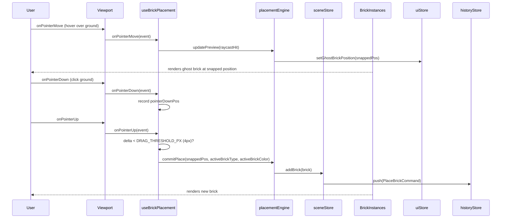
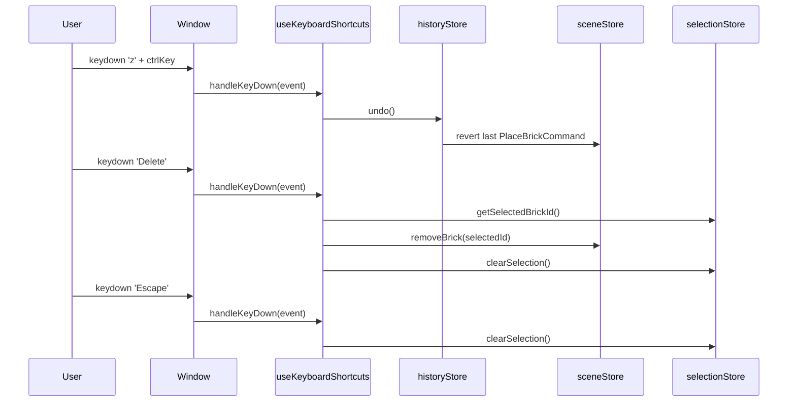
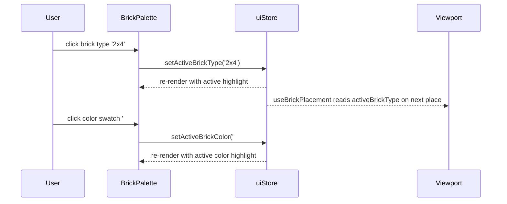

# Low-Level Design — Bug #88
## All Interactive Elements Non-Functional: Event Handler Disconnection

**Bug ID:** BUG-88  
**FR-ID:** FR-88  
**Issue:** [#88](https://github.com/sreenivasmrpivot/legobuilder/issues/88)  
**Priority:** Critical  
**Area:** Frontend  
**Status:** Design — Pending Review  
**Branch:** `bugfix/issue-88-lld`  
**Date:** 2026-04-12  

---

## 1. Bug Summary

The LegoBuilder application renders the full UI (3D canvas, toolbar, brick palette, ground grid) but **all interactive elements are completely non-functional**. No click, drag, keyboard, or hover events produce any response. The root cause is a set of **integration wiring gaps** — hooks exist and engines exist, but the connection between them and the React component tree is broken at multiple points.

---

## 2. Root Cause Analysis

Six distinct disconnection points have been identified through codebase inspection:

| # | Disconnection Point | Affected File(s) | Symptom |
|---|--------------------|-----------------|---------|
| DC-1 | `useBrickPlacement` hook not mounted; returned handlers not spread onto canvas | `App.tsx`, `Viewport.tsx` | Clicking ground grid places no brick; no ghost preview on hover |
| DC-2 | `useKeyboardShortcuts` hook not called in component tree | `App.tsx` | R, Delete, Escape, Ctrl+Z/Y produce no response |
| DC-3 | `BrickPalette` onClick handlers missing — no call to `uiStore.setActiveBrickType()` / `uiStore.setActiveBrickColor()` | `BrickPalette.tsx` | Palette clicks produce no selection change |
| DC-4 | `Toolbar` button onClick handlers are no-ops or missing — not wired to `historyStore` / `sceneStore` / export service | `Toolbar.tsx` | Undo, Redo, Clear, Export buttons do nothing |
| DC-5 | `useUndoRedo` hook not mounted or its `undo`/`redo` functions not passed to Toolbar | `App.tsx`, `Toolbar.tsx` | Undo/Redo buttons and Ctrl+Z/Y have no effect |
| DC-6 | CSS `pointer-events` or z-index overlay may intercept all pointer events before reaching R3F canvas | `index.css`, layout wrappers | All pointer events silently swallowed |

---

## 3. Component Architecture (Current vs. Required)

### 3.1 Current (Broken) Wiring

```
App.tsx
├── <ViewportCanvas>          ← renders R3F Canvas
│   └── <Viewport>            ← no pointer event handlers wired
│       ├── <GroundGrid>      ← no onPointerDown/Move/Up
│       └── <BrickInstances>  ← click handler exists but not connected
├── <BrickPalette>            ← renders items but onClick = undefined/noop
└── <Toolbar>                 ← renders buttons but onClick = undefined/noop

[Missing from App.tsx]
  useKeyboardShortcuts()      ← hook defined but never called
  useBrickPlacement()         ← hook defined but never called / handlers not spread
  useUndoRedo()               ← hook defined but undo/redo not passed to Toolbar
```

### 3.2 Required (Fixed) Wiring

```
App.tsx
├── useKeyboardShortcuts()    ← MOUNT HERE (global keyboard listener)
├── useUndoRedo()             ← MOUNT HERE → pass { undo, redo } to Toolbar
├── <ViewportCanvas>
│   └── <Viewport>
│       ├── useBrickPlacement() ← MOUNT HERE → spread handlers onto <mesh> / ground plane
│       │   ├── onPointerMove → placementEngine.updatePreview()
│       │   ├── onPointerDown → placementEngine.startPlace()
│       │   └── onPointerUp   → placementEngine.commitPlace() → sceneStore.addBrick()
│       ├── <GroundGrid onPointerDown onPointerMove onPointerUp />
│       └── <BrickInstances onPointerDown → selectionManager.selectByRaycast() />
├── <BrickPalette
│       onSelectType={uiStore.setActiveBrickType}
│       onSelectColor={uiStore.setActiveBrickColor} />
└── <Toolbar
        onUndo={undo}
        onRedo={redo}
        onClear={sceneStore.clearScene}
        onExport={exportService.exportJSON} />
```

---

## 4. Detailed Fix Specifications

### 4.1 DC-1 — Mount `useBrickPlacement` and Wire Pointer Events

**File:** `frontend/src/components/viewport/Viewport.tsx`

**Current state:** `useBrickPlacement` is defined in `hooks/useBrickPlacement.ts` but is not called inside `Viewport.tsx`. The ground plane mesh has no pointer event props.

**Required change:**
```tsx
// Inside Viewport component body:
const { onPointerDown, onPointerMove, onPointerUp } = useBrickPlacement();

// Spread onto the ground plane / baseplate mesh:
<Baseplate
  onPointerDown={onPointerDown}
  onPointerMove={onPointerMove}
  onPointerUp={onPointerUp}
/>
```

**Contract:** `useBrickPlacement()` must return `{ onPointerDown, onPointerMove, onPointerUp }` that:
- `onPointerMove` → calls `placementEngine.updatePreview(event)` → updates ghost brick position in `uiStore`
- `onPointerDown` → records pointer-down position for drag disambiguation
- `onPointerUp` → if delta < `DRAG_THRESHOLD_PX` (4px), calls `placementEngine.commitPlace()` → `sceneStore.addBrick(brick)`

### 4.2 DC-2 — Mount `useKeyboardShortcuts` in App

**File:** `frontend/src/components/App.tsx`

**Current state:** `useKeyboardShortcuts.ts` defines handlers for R, Delete, Escape, Ctrl+Z, Ctrl+Y but the hook is never called in the component tree.

**Required change:**
```tsx
// Inside App component body (top-level, so listeners are always active):
useKeyboardShortcuts();
```

**Contract:** `useKeyboardShortcuts()` must:
- Register `window.addEventListener('keydown', handler)` in `useEffect`
- Clean up with `window.removeEventListener` on unmount
- Handle: `r`/`R` → rotate preview; `Delete` → `sceneStore.removeBrick(selectedId)`; `Escape` → `selectionStore.clearSelection()`; `Ctrl+Z` → `historyStore.undo()`; `Ctrl+Y` / `Ctrl+Shift+Z` → `historyStore.redo()`

### 4.3 DC-3 — Wire BrickPalette onClick to uiStore

**File:** `frontend/src/components/ui/BrickPalette.tsx`

**Current state:** Brick type and color items render but have no `onClick` handlers connected to store actions.

**Required change:**
```tsx
// Read store actions:
const setActiveBrickType = useUiStore(s => s.setActiveBrickType);
const setActiveBrickColor = useUiStore(s => s.setActiveBrickColor);
const activeBrickType = useUiStore(s => s.activeBrickType);
const activeBrickColor = useUiStore(s => s.activeBrickColor);

// Wire to items:
<BrickTypeItem
  key={type.id}
  type={type}
  isActive={activeBrickType === type.id}
  onClick={() => setActiveBrickType(type.id)}
/>
<ColorSwatch
  key={color}
  color={color}
  isActive={activeBrickColor === color}
  onClick={() => setActiveBrickColor(color)}
/>
```

**Contract:** `uiStore` must expose `setActiveBrickType(typeId: string): void` and `setActiveBrickColor(color: string): void`. Visual feedback (active highlight) must reflect `activeBrickType` and `activeBrickColor` state.

### 4.4 DC-4 & DC-5 — Wire Toolbar Buttons to Store Actions

**File:** `frontend/src/components/ui/Toolbar.tsx`  
**File:** `frontend/src/components/App.tsx`

**Current state:** Toolbar buttons render but `onClick` handlers are missing or reference placeholder functions. `useUndoRedo` is not mounted in App.

**Required change in App.tsx:**
```tsx
const { undo, redo } = useUndoRedo();
const clearScene = useSceneStore(s => s.clearScene);
```

**Required change in Toolbar.tsx:**
```tsx
interface ToolbarProps {
  onUndo: () => void;
  onRedo: () => void;
  onClear: () => void;
  onExport: () => void;
}

// Buttons:
<button onClick={onUndo}>Undo</button>
<button onClick={onRedo}>Redo</button>
<button onClick={onClear}>Clear</button>
<button onClick={onExport}>Export</button>
```

**Contract:** `useUndoRedo()` must return `{ undo: () => void, redo: () => void }` that delegate to `historyStore.undo()` / `historyStore.redo()`. Export button must call `exportService.exportJSON(sceneStore.getState().bricks)`.

### 4.5 DC-6 — Audit CSS for pointer-events Blocking

**File:** `frontend/src/index.css`, layout wrapper divs

**Required check:**
- Verify no `pointer-events: none` on `#root`, `.viewport-container`, `.canvas-wrapper`, or any overlay div
- Verify no invisible `position: absolute; z-index: 9999` div sitting above the canvas
- Verify R3F `<Canvas>` has `style={{ display: 'block' }}` and no `userSelect: none` that might interfere
- If an overlay exists (e.g., for loading state), ensure it is removed or has `pointer-events: none` only when active

---

## 5. Data Flow Diagrams

### 5.1 Brick Placement Flow (Fixed)



### 5.2 Keyboard Shortcut Flow (Fixed)



### 5.3 BrickPalette Selection Flow (Fixed)



---

## 6. Affected Files — Change Summary

| File | Change Type | Description |
|------|------------|-------------|
| `frontend/src/components/App.tsx` | Modify | Mount `useKeyboardShortcuts()`, `useUndoRedo()`. Pass `undo`, `redo`, `clearScene`, `exportJSON` as props to `<Toolbar>`. |
| `frontend/src/components/viewport/Viewport.tsx` | Modify | Call `useBrickPlacement()`. Spread `onPointerDown`, `onPointerMove`, `onPointerUp` onto `<Baseplate>` / ground mesh. |
| `frontend/src/components/viewport/Baseplate.tsx` | Modify | Accept and forward `onPointerDown`, `onPointerMove`, `onPointerUp` props to the underlying `<mesh>`. |
| `frontend/src/components/ui/BrickPalette.tsx` | Modify | Subscribe to `uiStore.activeBrickType` and `uiStore.activeBrickColor`. Wire `onClick` on each type item and color swatch to store setters. |
| `frontend/src/components/ui/Toolbar.tsx` | Modify | Accept `onUndo`, `onRedo`, `onClear`, `onExport` props. Wire each button's `onClick`. |
| `frontend/src/hooks/useBrickPlacement.ts` | Verify/Fix | Ensure hook returns `{ onPointerDown, onPointerMove, onPointerUp }` and internally calls `placementEngine`. |
| `frontend/src/hooks/useKeyboardShortcuts.ts` | Verify/Fix | Ensure hook registers global `keydown` listener and handles all 5 shortcut cases. |
| `frontend/src/hooks/useUndoRedo.ts` | Verify/Fix | Ensure hook returns `{ undo, redo }` delegating to `historyStore`. |
| `frontend/src/stores/uiStore.ts` | Verify/Fix | Ensure `setActiveBrickType` and `setActiveBrickColor` actions are exported. |
| `frontend/src/index.css` | Audit | Remove any `pointer-events: none` on root/canvas containers. |

---

## 7. Interface Contracts

### 7.1 `useBrickPlacement()` Return Type
```typescript
interface BrickPlacementHandlers {
  onPointerDown: (event: ThreeEvent<PointerEvent>) => void;
  onPointerMove: (event: ThreeEvent<PointerEvent>) => void;
  onPointerUp: (event: ThreeEvent<PointerEvent>) => void;
}
```

### 7.2 `useUndoRedo()` Return Type
```typescript
interface UndoRedoHandlers {
  undo: () => void;
  redo: () => void;
  canUndo: boolean;
  canRedo: boolean;
}
```

### 7.3 `useKeyboardShortcuts()` — No Return Value
```typescript
// Side-effect only hook. Registers/deregisters window keydown listener.
function useKeyboardShortcuts(): void
```

### 7.4 `ToolbarProps`
```typescript
interface ToolbarProps {
  onUndo: () => void;
  onRedo: () => void;
  onClear: () => void;
  onExport: () => void;
  canUndo?: boolean;
  canRedo?: boolean;
}
```

### 7.5 `BrickPaletteProps`
```typescript
// BrickPalette reads directly from uiStore — no props needed for selection.
// Optionally accepts brickTypes and colors as props for testability.
interface BrickPaletteProps {
  brickTypes?: BrickType[];   // defaults to brickCatalog.getAllTypes()
  colors?: string[];          // defaults to brickCatalog.getColors()
}
```

### 7.6 `uiStore` Required Actions
```typescript
interface UIStore {
  activeBrickType: string;           // e.g. '2x4'
  activeBrickColor: string;          // e.g. '#FF0000'
  ghostBrickPosition: Vector3 | null;
  setActiveBrickType(typeId: string): void;
  setActiveBrickColor(color: string): void;
  setGhostBrickPosition(pos: Vector3 | null): void;
}
```

---

## 8. Error Handling Strategy

| Scenario | Handling |
|----------|----------|
| Raycast misses all geometry | `placementEngine.updatePreview()` returns `null`; ghost brick hidden (`uiStore.setGhostBrickPosition(null)`) |
| `placementEngine.commitPlace()` called with no active brick type | No-op; log warning in dev mode |
| `historyStore.undo()` called with empty stack | No-op; `canUndo` returns `false`; Undo button disabled |
| `historyStore.redo()` called with empty future stack | No-op; `canRedo` returns `false`; Redo button disabled |
| `sceneStore.removeBrick()` called with no selection | No-op; guard `if (!selectedId) return` |
| Export with empty scene | Export produces `{ version: '1.0', bricks: [] }` — valid empty JSON |
| CSS overlay detected | Log console.warn in dev mode; no runtime error |

---

## 9. Security Considerations

- No server-side calls are involved in this fix — all changes are client-side event wiring.
- Export JSON is generated client-side and downloaded via `URL.createObjectURL` — no XSS risk as content is user-generated scene data.
- Keyboard shortcut handler must call `event.preventDefault()` only for shortcuts that would conflict with browser defaults (e.g., Ctrl+Z browser undo). All other keys pass through.
- No user input is eval'd or injected into the DOM.

---

## 10. Test Mapping

The following regression tests (authored by the frontend-test agent on branch `bugfix/88-interactive-elements-wiring`) map directly to the disconnection points fixed by this LLD:

| Test ID | File | Disconnection Point | Acceptance Criterion |
|---------|------|--------------------|-----------------------|
| T-BUG-88-01 | `useBrickPlacementBug88.test.ts` | DC-1 | `useBrickPlacement` returns handlers; `onPointerUp` calls `sceneStore.addBrick` |
| T-BUG-88-02 | `useBrickPlacementBug88.test.ts` | DC-1 | Ghost brick position updates on `onPointerMove` |
| T-BUG-88-03 | `useKeyboardShortcutsBug88.test.ts` | DC-2 | Ctrl+Z triggers `historyStore.undo()` |
| T-BUG-88-04 | `useKeyboardShortcutsBug88.test.ts` | DC-2 | Delete key triggers `sceneStore.removeBrick(selectedId)` |
| T-BUG-88-05 | `useKeyboardShortcutsBug88.test.ts` | DC-2 | Escape key triggers `selectionStore.clearSelection()` |
| T-BUG-88-06 | `brickPaletteWiringBug88.test.ts` | DC-3 | Clicking brick type calls `uiStore.setActiveBrickType()` |
| T-BUG-88-07 | `brickPaletteWiringBug88.test.ts` | DC-3 | Clicking color swatch calls `uiStore.setActiveBrickColor()` |
| T-BUG-88-08 | `toolbarWiringBug88.test.ts` | DC-4 | Undo button click calls `onUndo` prop |
| T-BUG-88-09 | `toolbarWiringBug88.test.ts` | DC-4 | Redo button click calls `onRedo` prop |
| T-BUG-88-10 | `toolbarWiringBug88.test.ts` | DC-4 | Clear button click calls `onClear` prop |
| T-BUG-88-11 | `toolbarWiringBug88.test.ts` | DC-4 | Export button click calls `onExport` prop |
| T-BUG-88-12 | `interactiveElementsBug88.spec.ts` | DC-1–6 | E2E: click ground → brick placed; palette click → selection updates; toolbar buttons respond |

---

## 11. Implementation Order (for Coding Agent)

Implement fixes in this order to minimize risk of cascading failures:

1. **DC-6 first** — Audit and fix CSS `pointer-events`. This unblocks all pointer events immediately and is the lowest-risk change.
2. **DC-3** — Wire `BrickPalette` onClick to `uiStore`. Self-contained; no dependencies on other fixes.
3. **DC-4 + DC-5** — Wire `Toolbar` props and mount `useUndoRedo` in App. Self-contained.
4. **DC-2** — Mount `useKeyboardShortcuts` in App. Depends on `historyStore` and `selectionStore` being correct (already implemented).
5. **DC-1** — Mount `useBrickPlacement` in Viewport and spread handlers onto Baseplate. Most complex; depends on `placementEngine` and `uiStore` being correct.
6. **Run all regression tests** — All 12 test IDs must pass (42 unit + 10 E2E).

---

## 12. Acceptance Criteria (from Issue #88)

- [ ] Clicking on the ground grid/baseplate places a brick at the correct snapped position
- [ ] Clicking a brick type in BrickPalette updates the active selection and shows visual feedback
- [ ] Clicking a color swatch in BrickPalette updates the active brick color
- [ ] Toolbar Undo button triggers `historyStore.undo()` and reverses the last action
- [ ] Toolbar Redo button triggers `historyStore.redo()` and re-applies the last undone action
- [ ] Toolbar Clear button triggers `sceneStore.clearScene()` and removes all bricks
- [ ] Toolbar Export button triggers JSON export of the current scene
- [ ] Clicking an existing brick in the 3D scene selects it (visual highlight via BrickInstances)
- [ ] Pressing R key rotates the placement preview or selected brick by 90°
- [ ] Pressing Delete key removes the currently selected brick
- [ ] Pressing Escape clears the current selection
- [ ] Pressing Ctrl+Z / Ctrl+Y triggers undo/redo
- [ ] Hovering over the ground grid shows a placement preview (ghost brick)
- [ ] All 12 regression test IDs pass (T-BUG-88-01 through T-BUG-88-12)
- [ ] All existing tests still pass

---

## 13. Out of Scope

- No new features are introduced by this fix
- No changes to `placementEngine.ts` or `selectionManager.ts` logic (engines are correct; only wiring is broken)
- No changes to store state shape (stores are correct; only subscriptions are missing)
- No changes to `historyStore.ts` (undo/redo logic is correct)
- No backend changes

---

*Produced by Spectra Framework — design-agent*  
*Spectra-Agent: design-agent | Spectra-FRs: FR-88 | Gate: pending*
