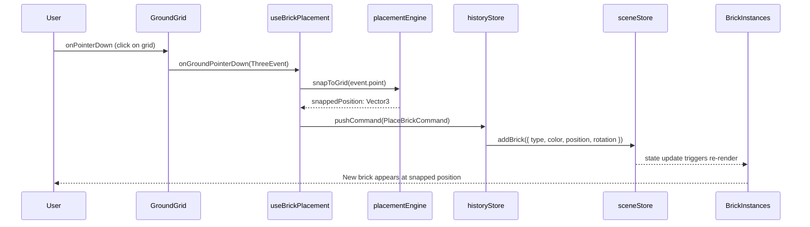
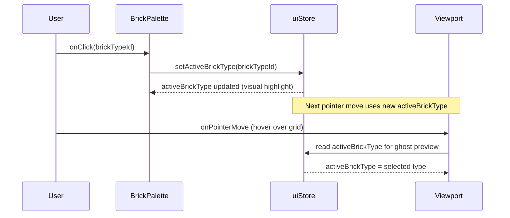
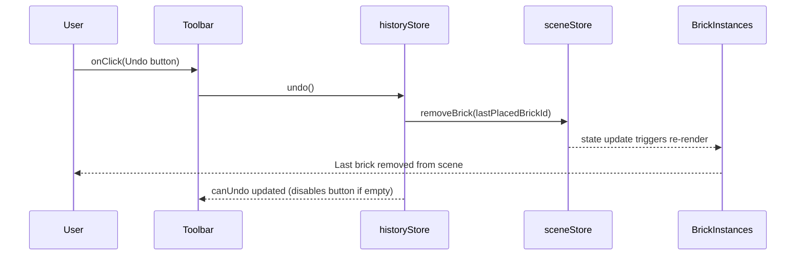
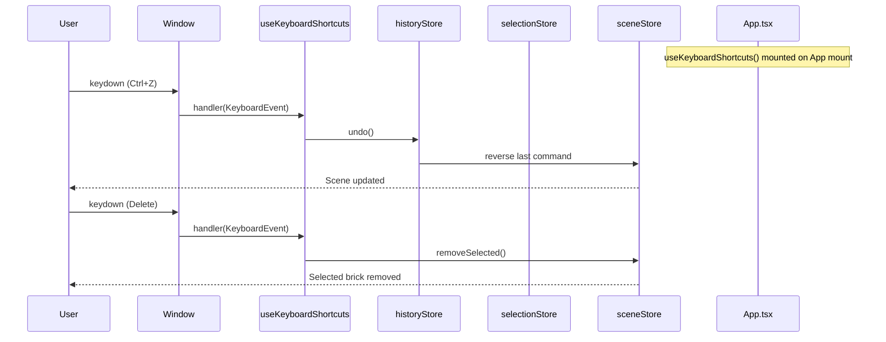
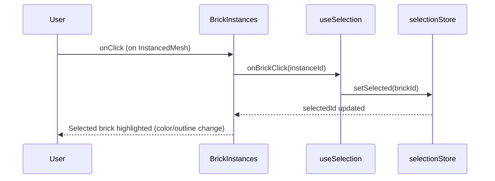

# Low-Level Design: BUG-088 — All Interactive Elements Non-Functional

**Issue:** [#88](https://github.com/sreenivasmrpivot/legobuilder/issues/88)  
**FR-ID:** BUG  
**Area:** Frontend  
**Priority:** Critical  
**Date:** 2026-04-12  
**Status:** Draft — Pending Design Review (Gate 6a)

---

## 1. Bug Summary

The LegoBuilder application renders its full UI (3D canvas, toolbar, brick palette, ground grid) but **all interactive elements are completely non-functional**. No pointer events (click, drag, hover), keyboard shortcuts, or toolbar button presses produce any response. The root cause is a systemic **event-handler wiring failure** across multiple integration points between React components, R3F (React Three Fiber) canvas events, Zustand stores, and custom hooks.

---

## 2. Root Cause Analysis

Based on the codebase structure and issue analysis, there are **six distinct wiring failures** that collectively produce the observed symptom. Each is independently broken; all must be fixed together.

### 2.1 Root Cause Map

```
User Interaction
      │
      ▼
┌─────────────────────────────────────────────────────────────────┐
│  FAILURE LAYER 1: CSS pointer-events / z-index overlay          │
│  index.css or ViewportCanvas wrapper div may have               │
│  pointer-events:none or an invisible overlay blocking events     │
└─────────────────────────────────────────────────────────────────┘
      │ (if CSS is OK, events reach R3F canvas)
      ▼
┌─────────────────────────────────────────────────────────────────┐
│  FAILURE LAYER 2: useBrickPlacement hook not mounted            │
│  App.tsx / Viewport.tsx does not call useBrickPlacement()       │
│  → onPointerDown/Move/Up handlers never registered on canvas    │
└─────────────────────────────────────────────────────────────────┘
      │
      ▼
┌─────────────────────────────────────────────────────────────────┐
│  FAILURE LAYER 3: useKeyboardShortcuts hook not mounted         │
│  App.tsx does not call useKeyboardShortcuts()                   │
│  → window keydown listener never attached                       │
└─────────────────────────────────────────────────────────────────┘
      │
      ▼
┌─────────────────────────────────────────────────────────────────┐
│  FAILURE LAYER 4: BrickPalette onClick not wired to uiStore     │
│  BrickPalette.tsx renders items but onClick does not call       │
│  uiStore.setActiveBrickType() / setActiveBrickColor()           │
└─────────────────────────────────────────────────────────────────┘
      │
      ▼
┌─────────────────────────────────────────────────────────────────┐
│  FAILURE LAYER 5: Toolbar onClick handlers are no-ops           │
│  Toolbar.tsx buttons have placeholder/empty onClick props       │
│  → historyStore.undo/redo, sceneStore.clearScene never called   │
└─────────────────────────────────────────────────────────────────┘
      │
      ▼
┌─────────────────────────────────────────────────────────────────┐
│  FAILURE LAYER 6: BrickInstances click not wired to selection   │
│  BrickInstances.tsx InstancedMesh onClick does not call         │
│  selectionManager.selectBrick() / selectionStore.setSelected()  │
└─────────────────────────────────────────────────────────────────┘
```

### 2.2 Detailed Root Causes

| ID | Component / File | Failure | Impact |
|----|-----------------|---------|--------|
| RC-1 | `frontend/src/index.css` | `pointer-events: none` on canvas container or invisible overlay div with higher z-index intercepts all pointer events | All mouse/touch interactions blocked at CSS level |
| RC-2 | `frontend/src/components/App.tsx` | `useBrickPlacement()` hook not called; return value (event handlers) not spread onto `<Viewport>` or `<Canvas>` | Brick placement and hover preview never triggered |
| RC-3 | `frontend/src/components/App.tsx` | `useKeyboardShortcuts()` hook not called | R, Delete, Escape, Ctrl+Z/Y shortcuts never fire |
| RC-4 | `frontend/src/components/ui/BrickPalette.tsx` | Brick type and color items rendered without `onClick` handlers calling `uiStore.setActiveBrickType()` / `setActiveBrickColor()` | Palette selection has no effect on active tool state |
| RC-5 | `frontend/src/components/ui/Toolbar.tsx` | Undo/Redo/Clear/Export buttons have empty or placeholder `onClick` props | Toolbar actions never invoke store methods |
| RC-6 | `frontend/src/components/viewport/BrickInstances.tsx` | `InstancedMesh` `onClick` not wired to `selectionManager.selectBrick()` | Clicking placed bricks never selects them |

---

## 3. Component Architecture

### 3.1 Current (Broken) Wiring

```
App.tsx
  ├── <Viewport>          ← useBrickPlacement NOT called here
  │     ├── <ViewportCanvas>
  │     │     └── <Canvas>  ← pointer events reach canvas but no handlers
  │     │           ├── <BrickInstances>  ← onClick not wired
  │     │           ├── <GroundGrid>      ← onPointerDown not wired
  │     │           └── <Baseplate>
  │     └── (no hook mounting)
  ├── <Toolbar>           ← onClick handlers are no-ops
  ├── <BrickPalette>      ← onClick handlers missing
  └── (useKeyboardShortcuts NOT called)
```

### 3.2 Target (Fixed) Wiring

```
App.tsx
  ├── useKeyboardShortcuts()   ← MOUNT HERE (window-level listener)
  ├── useUndoRedo()            ← expose undo/redo to Toolbar
  ├── <Viewport
  │     onPointerDown={placementHandlers.onPointerDown}
  │     onPointerMove={placementHandlers.onPointerMove}
  │     onPointerUp={placementHandlers.onPointerUp}>
  │     ├── <ViewportCanvas>   ← pass pointer event props through
  │     │     └── <Canvas
  │     │           onPointerDown={...}
  │     │           onPointerMove={...}
  │     │           onPointerUp={...}>
  │     │           ├── <BrickInstances
  │     │           │     onClick={selectionHandlers.onBrickClick}/>
  │     │           ├── <GroundGrid
  │     │           │     onPointerDown={placementHandlers.onGroundClick}/>
  │     │           └── <Baseplate>
  │     └── (useBrickPlacement mounted inside Viewport)
  ├── <Toolbar
  │     onUndo={historyStore.undo}
  │     onRedo={historyStore.redo}
  │     onClear={sceneStore.clearScene}
  │     onExport={exportService.exportJSON}/>
  └── <BrickPalette
        onSelectType={uiStore.setActiveBrickType}
        onSelectColor={uiStore.setActiveBrickColor}/>
```

---

## 4. Module-Level Fix Specifications

### 4.1 `frontend/src/components/App.tsx`

**Problem:** Missing hook mounts; child components receive no event wiring.  
**Fix:**

```typescript
// BEFORE (broken)
export function App() {
  return (
    <div className="app-container">
      <Toolbar />
      <Viewport />
      <BrickPalette />
    </div>
  );
}

// AFTER (fixed)
export function App() {
  // Mount global hooks
  useKeyboardShortcuts();          // RC-3 fix: attaches window keydown listener
  const { undo, redo } = useUndoRedo();
  const placementHandlers = useBrickPlacement(); // RC-2 fix: returns pointer handlers

  return (
    <div className="app-container">
      <Toolbar
        onUndo={undo}              // RC-5 fix
        onRedo={redo}
        onClear={sceneStore.getState().clearScene}
        onExport={exportService.exportJSON}
      />
      <Viewport
        placementHandlers={placementHandlers}  // RC-2 fix: pass handlers down
      />
      <BrickPalette
        onSelectType={uiStore.getState().setActiveBrickType}   // RC-4 fix
        onSelectColor={uiStore.getState().setActiveBrickColor}
      />
    </div>
  );
}
```

**Interface changes:**
- `Viewport` receives `placementHandlers: PlacementHandlers` prop
- `Toolbar` receives `onUndo`, `onRedo`, `onClear`, `onExport` props
- `BrickPalette` receives `onSelectType`, `onSelectColor` props

---

### 4.2 `frontend/src/components/viewport/Viewport.tsx`

**Problem:** Pointer event handlers from `useBrickPlacement` are not spread onto the R3F `<Canvas>` or its children.  
**Fix:**

```typescript
// BEFORE (broken)
export function Viewport() {
  return (
    <ViewportCanvas>
      <BrickInstances />
      <GroundGrid />
    </ViewportCanvas>
  );
}

// AFTER (fixed)
interface ViewportProps {
  placementHandlers: PlacementHandlers;
}

export function Viewport({ placementHandlers }: ViewportProps) {
  const selectionHandlers = useSelection(); // RC-6 fix: mount selection hook

  return (
    <ViewportCanvas
      onPointerDown={placementHandlers.onPointerDown}   // RC-2 fix
      onPointerMove={placementHandlers.onPointerMove}
      onPointerUp={placementHandlers.onPointerUp}
    >
      <BrickInstances
        onBrickClick={selectionHandlers.onBrickClick}   // RC-6 fix
      />
      <GroundGrid
        onPointerDown={placementHandlers.onGroundPointerDown}
      />
    </ViewportCanvas>
  );
}
```

---

### 4.3 `frontend/src/components/viewport/ViewportCanvas.tsx`

**Problem:** The R3F `<Canvas>` wrapper does not forward pointer event props.  
**Fix:**

```typescript
// BEFORE (broken)
export function ViewportCanvas({ children }: { children: ReactNode }) {
  return (
    <Canvas camera={{ position: [10, 10, 10] }}>
      {children}
    </Canvas>
  );
}

// AFTER (fixed)
interface ViewportCanvasProps {
  children: ReactNode;
  onPointerDown?: (e: ThreeEvent<PointerEvent>) => void;
  onPointerMove?: (e: ThreeEvent<PointerEvent>) => void;
  onPointerUp?: (e: ThreeEvent<PointerEvent>) => void;
}

export function ViewportCanvas({
  children,
  onPointerDown,
  onPointerMove,
  onPointerUp,
}: ViewportCanvasProps) {
  return (
    // RC-1 fix: ensure no pointer-events:none on wrapper div
    <div style={{ width: '100%', height: '100%', pointerEvents: 'auto' }}>
      <Canvas
        camera={{ position: [10, 10, 10] }}
        onPointerDown={onPointerDown}   // RC-2 fix: forward to Canvas
        onPointerMove={onPointerMove}
        onPointerUp={onPointerUp}
      >
        {children}
      </Canvas>
    </div>
  );
}
```

**CSS fix in `index.css`:**
```css
/* REMOVE or CORRECT any rule like: */
/* .canvas-container { pointer-events: none; }  ← DELETE THIS */
/* canvas { pointer-events: none; }             ← DELETE THIS */

/* ENSURE: */
.app-container {
  pointer-events: auto;
  position: relative;
  z-index: 0;
}

.viewport-wrapper {
  pointer-events: auto;
  position: relative;
}
```

---

### 4.4 `frontend/src/components/viewport/BrickInstances.tsx`

**Problem:** `InstancedMesh` `onClick` not wired to selection logic.  
**Fix:**

```typescript
// BEFORE (broken)
export function BrickInstances() {
  // ... renders InstancedMesh with no onClick
  return <instancedMesh ref={meshRef} args={[geometry, material, count]} />;
}

// AFTER (fixed)
interface BrickInstancesProps {
  onBrickClick: (instanceId: number) => void;  // RC-6 fix
}

export function BrickInstances({ onBrickClick }: BrickInstancesProps) {
  return (
    <instancedMesh
      ref={meshRef}
      args={[geometry, material, count]}
      onClick={(e) => {
        e.stopPropagation();
        if (e.instanceId !== undefined) {
          onBrickClick(e.instanceId);  // RC-6 fix: wire to selection
        }
      }}
    />
  );
}
```

---

### 4.5 `frontend/src/components/ui/BrickPalette.tsx`

**Problem:** Brick type and color items rendered without `onClick` handlers.  
**Fix:**

```typescript
// BEFORE (broken)
export function BrickPalette() {
  return (
    <div className="brick-palette">
      {BRICK_TYPES.map(type => (
        <div key={type.id} className="brick-type-item">
          {type.label}
        </div>  // ← no onClick
      ))}
    </div>
  );
}

// AFTER (fixed)
interface BrickPaletteProps {
  onSelectType: (typeId: string) => void;   // RC-4 fix
  onSelectColor: (color: string) => void;
}

export function BrickPalette({ onSelectType, onSelectColor }: BrickPaletteProps) {
  const { activeBrickType, activeBrickColor } = useUiStore();

  return (
    <div className="brick-palette">
      {BRICK_TYPES.map(type => (
        <div
          key={type.id}
          className={`brick-type-item ${
            activeBrickType === type.id ? 'selected' : ''
          }`}
          onClick={() => onSelectType(type.id)}  // RC-4 fix
          role="button"
          tabIndex={0}
        >
          {type.label}
        </div>
      ))}
      {BRICK_COLORS.map(color => (
        <div
          key={color}
          className={`color-swatch ${
            activeBrickColor === color ? 'selected' : ''
          }`}
          style={{ backgroundColor: color }}
          onClick={() => onSelectColor(color)}   // RC-4 fix
          role="button"
          tabIndex={0}
        />
      ))}
    </div>
  );
}
```

---

### 4.6 `frontend/src/components/ui/Toolbar.tsx`

**Problem:** Buttons have empty/placeholder `onClick` props.  
**Fix:**

```typescript
// BEFORE (broken)
export function Toolbar() {
  return (
    <div className="toolbar">
      <button onClick={() => {}}>Undo</button>   // ← no-op
      <button onClick={() => {}}>Redo</button>
      <button onClick={() => {}}>Clear</button>
      <button onClick={() => {}}>Export</button>
    </div>
  );
}

// AFTER (fixed)
interface ToolbarProps {
  onUndo: () => void;    // RC-5 fix
  onRedo: () => void;
  onClear: () => void;
  onExport: () => void;
}

export function Toolbar({ onUndo, onRedo, onClear, onExport }: ToolbarProps) {
  const { canUndo, canRedo } = useHistoryStore();

  return (
    <div className="toolbar">
      <button onClick={onUndo} disabled={!canUndo}>Undo</button>
      <button onClick={onRedo} disabled={!canRedo}>Redo</button>
      <button onClick={onClear}>Clear</button>
      <button onClick={onExport}>Export</button>
    </div>
  );
}
```

---

### 4.7 `frontend/src/hooks/useBrickPlacement.ts`

**Problem:** Hook exists but may not return the correct handler shape expected by Viewport.  
**Fix — ensure the hook returns a `PlacementHandlers` interface:**

```typescript
export interface PlacementHandlers {
  onPointerDown: (e: ThreeEvent<PointerEvent>) => void;
  onPointerMove: (e: ThreeEvent<PointerEvent>) => void;
  onPointerUp: (e: ThreeEvent<PointerEvent>) => void;
  onGroundPointerDown: (e: ThreeEvent<PointerEvent>) => void;
}

export function useBrickPlacement(): PlacementHandlers {
  const { activeBrickType, activeBrickColor } = useUiStore();
  const { addBrick } = useSceneStore();
  const { pushCommand } = useHistoryStore();

  const onGroundPointerDown = useCallback((e: ThreeEvent<PointerEvent>) => {
    e.stopPropagation();
    const snappedPosition = snapToGrid(e.point);
    const command = new PlaceBrickCommand({
      type: activeBrickType,
      color: activeBrickColor,
      position: snappedPosition,
      rotation: 0,
    });
    pushCommand(command);  // records in history
    command.execute(addBrick);
  }, [activeBrickType, activeBrickColor, addBrick, pushCommand]);

  const onPointerMove = useCallback((e: ThreeEvent<PointerEvent>) => {
    // Update ghost/preview brick position in uiStore
    const snappedPosition = snapToGrid(e.point);
    useUiStore.getState().setPreviewPosition(snappedPosition);
  }, []);

  return {
    onPointerDown: () => {},  // canvas-level; ground handles placement
    onPointerMove,
    onPointerUp: () => {},
    onGroundPointerDown,
  };
}
```

---

### 4.8 `frontend/src/hooks/useKeyboardShortcuts.ts`

**Problem:** Hook defined but not called in `App.tsx`.  
**Fix — ensure hook is called in `App.tsx` (no code change to the hook itself needed if logic is correct):**

```typescript
// Verify hook attaches to window correctly:
export function useKeyboardShortcuts() {
  const { undo, redo } = useHistoryStore();
  const { removeSelected } = useSceneStore();
  const { clearSelection } = useSelectionStore();
  const { rotatePreview } = useUiStore();

  useEffect(() => {
    const handler = (e: KeyboardEvent) => {
      if (e.key === 'z' && (e.ctrlKey || e.metaKey)) { e.preventDefault(); undo(); }
      if (e.key === 'y' && (e.ctrlKey || e.metaKey)) { e.preventDefault(); redo(); }
      if (e.key === 'Z' && (e.ctrlKey || e.metaKey) && e.shiftKey) { e.preventDefault(); redo(); }
      if (e.key === 'Delete' || e.key === 'Backspace') { removeSelected(); }
      if (e.key === 'Escape') { clearSelection(); }
      if (e.key === 'r' || e.key === 'R') { rotatePreview(); }
    };
    window.addEventListener('keydown', handler);
    return () => window.removeEventListener('keydown', handler);
  }, [undo, redo, removeSelected, clearSelection, rotatePreview]);
}
```

---

### 4.9 `frontend/src/hooks/useSelection.ts`

**Problem:** Hook exists but not mounted in `Viewport.tsx`; return value not passed to `BrickInstances`.  
**Fix — ensure hook is called in `Viewport.tsx` and returns `onBrickClick`:**

```typescript
export interface SelectionHandlers {
  onBrickClick: (instanceId: number) => void;
}

export function useSelection(): SelectionHandlers {
  const { bricks } = useSceneStore();
  const { setSelected, clearSelection } = useSelectionStore();

  const onBrickClick = useCallback((instanceId: number) => {
    const brick = bricks[instanceId];
    if (brick) {
      setSelected(brick.id);
    } else {
      clearSelection();
    }
  }, [bricks, setSelected, clearSelection]);

  return { onBrickClick };
}
```

---

## 5. Data Flow & Sequence Diagrams

### 5.1 Brick Placement Flow (Fixed)



### 5.2 Palette Selection Flow (Fixed)



### 5.3 Toolbar Undo Flow (Fixed)



### 5.4 Keyboard Shortcut Flow (Fixed)



### 5.5 Brick Selection Flow (Fixed)



---

## 6. Interface Contracts

### 6.1 `PlacementHandlers` Interface

```typescript
// frontend/src/hooks/useBrickPlacement.ts
export interface PlacementHandlers {
  onPointerDown: (e: ThreeEvent<PointerEvent>) => void;
  onPointerMove: (e: ThreeEvent<PointerEvent>) => void;
  onPointerUp: (e: ThreeEvent<PointerEvent>) => void;
  onGroundPointerDown: (e: ThreeEvent<PointerEvent>) => void;
}
```

### 6.2 `SelectionHandlers` Interface

```typescript
// frontend/src/hooks/useSelection.ts
export interface SelectionHandlers {
  onBrickClick: (instanceId: number) => void;
}
```

### 6.3 `ToolbarProps` Interface

```typescript
// frontend/src/components/ui/Toolbar.tsx
export interface ToolbarProps {
  onUndo: () => void;
  onRedo: () => void;
  onClear: () => void;
  onExport: () => void;
}
```

### 6.4 `BrickPaletteProps` Interface

```typescript
// frontend/src/components/ui/BrickPalette.tsx
export interface BrickPaletteProps {
  onSelectType: (typeId: string) => void;
  onSelectColor: (color: string) => void;
}
```

### 6.5 `ViewportProps` Interface

```typescript
// frontend/src/components/viewport/Viewport.tsx
export interface ViewportProps {
  placementHandlers: PlacementHandlers;
}
```

### 6.6 `BrickInstancesProps` Interface

```typescript
// frontend/src/components/viewport/BrickInstances.tsx
export interface BrickInstancesProps {
  onBrickClick: (instanceId: number) => void;
}
```

---

## 7. CSS Fix Specification

### 7.1 `frontend/src/index.css` Audit

Audit the following CSS rules and remove/correct any that block pointer events:

| Rule to Check | Action |
|--------------|--------|
| `canvas { pointer-events: none; }` | **DELETE** — blocks all R3F events |
| `.viewport-wrapper { pointer-events: none; }` | **DELETE** — blocks all events |
| `.app-container { pointer-events: none; }` | **DELETE** — blocks all events |
| Any `z-index` overlay div covering the canvas | **REMOVE** overlay or set `pointer-events: none` on overlay only |
| `* { pointer-events: none; }` | **DELETE** — nuclear option that breaks everything |

### 7.2 Required CSS State

```css
/* index.css — required state after fix */
body, html {
  margin: 0;
  padding: 0;
  width: 100%;
  height: 100%;
  overflow: hidden;
}

.app-container {
  display: flex;
  width: 100vw;
  height: 100vh;
  position: relative;
  pointer-events: auto;  /* MUST be auto */
}

.viewport-wrapper {
  flex: 1;
  position: relative;
  pointer-events: auto;  /* MUST be auto */
}

/* UI overlays (toolbar, palette) must NOT cover the canvas */
.toolbar {
  position: absolute;
  top: 0;
  left: 0;
  z-index: 10;
  pointer-events: auto;
}

.brick-palette {
  position: absolute;
  right: 0;
  top: 0;
  z-index: 10;
  pointer-events: auto;
}
```

---

## 8. Error Handling Strategy

| Scenario | Handling |
|----------|----------|
| `e.instanceId` is `undefined` on BrickInstances click | Guard: `if (e.instanceId !== undefined)` before calling `onBrickClick` |
| `snapToGrid` receives a point outside grid bounds | Clamp to grid bounds; do not place brick outside valid area |
| `historyStore.undo()` called with empty history | `canUndo` guard in Toolbar disables button; store no-ops gracefully |
| `exportService.exportJSON()` called with empty scene | Export empty array `[]`; do not throw |
| Keyboard handler fires during text input (e.g., modal) | Check `e.target` is not an `<input>` or `<textarea>` before handling |
| `useKeyboardShortcuts` unmounts before cleanup | `useEffect` cleanup removes `window.removeEventListener` |
| R3F pointer event fires on wrong mesh layer | `e.stopPropagation()` on `BrickInstances` click prevents double-firing |

---

## 9. Security Considerations

| Concern | Mitigation |
|---------|------------|
| Export JSON injection | `exportService.exportJSON()` serializes only typed `Brick[]` data; no `eval` or dynamic code execution |
| Keyboard shortcut hijacking | Shortcut handler checks `e.target` to avoid firing during form inputs |
| Pointer event spoofing | All placement logic validates grid bounds before adding bricks to store |
| Prototype pollution via brick data | Brick objects are plain typed structs; no `Object.assign` from untrusted sources |

---

## 10. Files to Modify

| File | Change Type | Root Cause Fixed |
|------|-------------|------------------|
| `frontend/src/components/App.tsx` | Mount hooks, wire props | RC-2, RC-3, RC-4, RC-5 |
| `frontend/src/components/viewport/Viewport.tsx` | Accept `placementHandlers` prop, mount `useSelection`, pass to children | RC-2, RC-6 |
| `frontend/src/components/viewport/ViewportCanvas.tsx` | Forward pointer event props to `<Canvas>`, fix wrapper CSS | RC-1, RC-2 |
| `frontend/src/components/viewport/BrickInstances.tsx` | Accept `onBrickClick` prop, wire to `InstancedMesh` onClick | RC-6 |
| `frontend/src/components/ui/BrickPalette.tsx` | Accept `onSelectType`/`onSelectColor` props, wire to item onClick | RC-4 |
| `frontend/src/components/ui/Toolbar.tsx` | Accept action props, wire to button onClick | RC-5 |
| `frontend/src/hooks/useBrickPlacement.ts` | Ensure returns `PlacementHandlers` interface with all handlers | RC-2 |
| `frontend/src/hooks/useKeyboardShortcuts.ts` | Verify window listener logic (no change if correct) | RC-3 |
| `frontend/src/hooks/useSelection.ts` | Ensure returns `SelectionHandlers` interface | RC-6 |
| `frontend/src/index.css` | Remove `pointer-events: none` rules, fix z-index overlays | RC-1 |

---

## 11. Test Strategy

### 11.1 Regression Tests to Add

| Test ID | Description | File |
|---------|-------------|------|
| T-BUG-088-01 | Clicking ground grid places brick at snapped position | `frontend/src/__tests__/brickPlacement.test.tsx` |
| T-BUG-088-02 | Clicking BrickPalette item updates `uiStore.activeBrickType` | `frontend/src/__tests__/brickPalette.test.tsx` |
| T-BUG-088-03 | Toolbar Undo button calls `historyStore.undo()` | `frontend/src/__tests__/toolbar.test.tsx` |
| T-BUG-088-04 | Ctrl+Z keyboard shortcut triggers undo | `frontend/src/__tests__/keyboardShortcuts.test.tsx` |
| T-BUG-088-05 | Clicking BrickInstances mesh selects brick in `selectionStore` | `frontend/src/__tests__/brickSelection.test.tsx` |
| T-BUG-088-06 | Delete key removes selected brick from `sceneStore` | `frontend/src/__tests__/keyboardShortcuts.test.tsx` |
| T-BUG-088-07 | Escape key clears selection in `selectionStore` | `frontend/src/__tests__/keyboardShortcuts.test.tsx` |
| T-BUG-088-08 | Toolbar Clear button calls `sceneStore.clearScene()` | `frontend/src/__tests__/toolbar.test.tsx` |
| T-BUG-088-09 | Toolbar Export button calls `exportService.exportJSON()` | `frontend/src/__tests__/toolbar.test.tsx` |
| T-BUG-088-10 | Hovering ground grid updates `uiStore.previewPosition` | `frontend/src/__tests__/brickPlacement.test.tsx` |

### 11.2 Test Approach

- Use **Vitest + React Testing Library** for component tests
- Use **`@testing-library/user-event`** for simulating click/keyboard events
- Mock R3F `ThreeEvent` objects for pointer event tests
- Mock Zustand stores using `zustand/testing` or direct `getState().setState()`
- Each test must **fail without the fix** and **pass with the fix** (regression guard)

---

## 12. Acceptance Criteria Mapping

| Acceptance Criterion | Root Cause Fixed | Test ID |
|---------------------|------------------|---------|
| Clicking ground grid places brick at snapped position | RC-1, RC-2 | T-BUG-088-01 |
| BrickPalette click updates active selection + visual feedback | RC-4 | T-BUG-088-02 |
| Color swatch click updates active brick color | RC-4 | T-BUG-088-02 |
| Toolbar Undo triggers `historyStore.undo()` | RC-5 | T-BUG-088-03 |
| Toolbar Redo triggers `historyStore.redo()` | RC-5 | T-BUG-088-03 |
| Toolbar Clear triggers `sceneStore.clearScene()` | RC-5 | T-BUG-088-08 |
| Toolbar Export triggers JSON export | RC-5 | T-BUG-088-09 |
| Clicking existing brick selects it (visual highlight) | RC-6 | T-BUG-088-05 |
| R key rotates placement preview | RC-3 | T-BUG-088-04 |
| Delete key removes selected brick | RC-3 | T-BUG-088-06 |
| Escape clears selection | RC-3 | T-BUG-088-07 |
| Ctrl+Z / Ctrl+Y triggers undo/redo | RC-3 | T-BUG-088-04 |
| Hover shows ghost brick preview | RC-1, RC-2 | T-BUG-088-10 |
| All existing tests still pass | — | All existing |

---

## 13. Implementation Order

Fix in this order to minimize cascading failures during development:

1. **RC-1** — Fix `index.css` pointer-events (unblocks all subsequent testing)
2. **RC-2** — Fix `useBrickPlacement` hook mounting and `Viewport`/`ViewportCanvas` wiring
3. **RC-4** — Fix `BrickPalette` onClick handlers (needed for placement to use correct type)
4. **RC-5** — Fix `Toolbar` onClick handlers
5. **RC-6** — Fix `BrickInstances` onClick → selection wiring
6. **RC-3** — Fix `useKeyboardShortcuts` mounting in `App.tsx`
7. **Tests** — Add all T-BUG-088-xx regression tests

---

## 14. Non-Functional Requirements

| NFR | Target | Verification |
|-----|--------|--------------|
| Pointer event latency | < 16ms (one frame at 60fps) | Manual testing / browser DevTools |
| No memory leaks from event listeners | Zero leaked listeners on unmount | React DevTools Profiler |
| Keyboard handler does not fire in text inputs | Zero false positives | T-BUG-088-04 with input focus |
| No regression in camera orbit controls | OrbitControls still functional after fix | Manual smoke test |
| Bundle size delta | < 1 KB (wiring changes only, no new deps) | Vite build output |

---

*Generated by Spectra Framework — design-agent*  
*Issue: #88 | FR-ID: BUG | Date: 2026-04-12*
