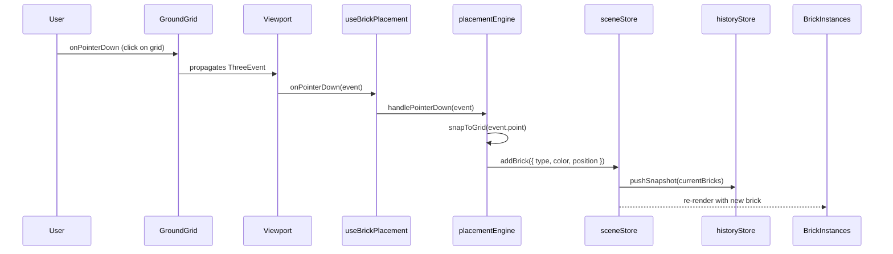
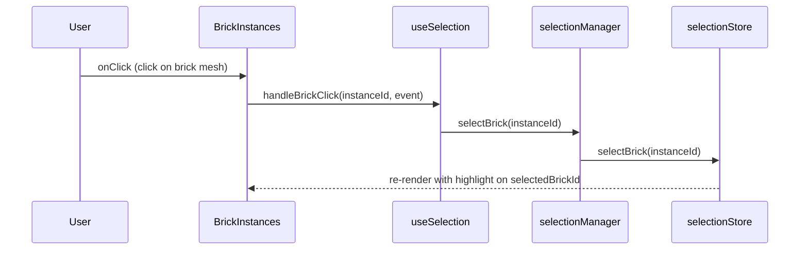
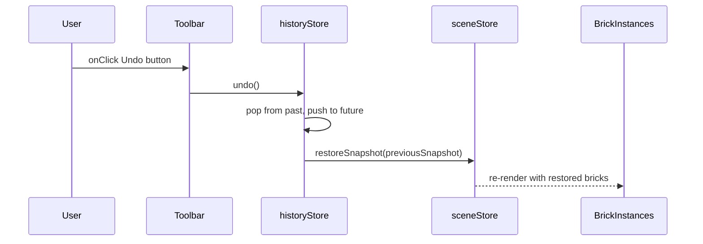
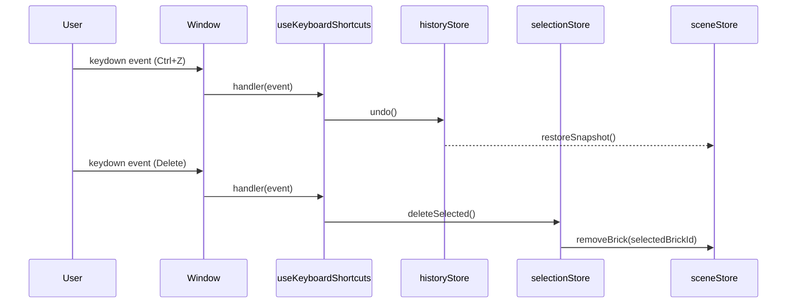
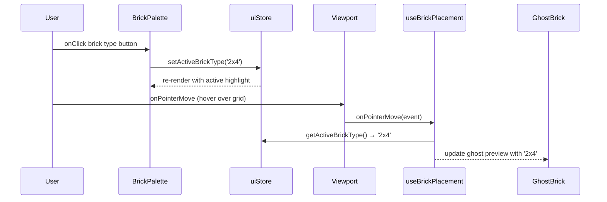

# Low-Level Design: BUG-088 — All Interactive Elements Non-Functional

**Issue:** #88  
**FR-ID:** BUG-088  
**Type:** Bug Fix  
**Priority:** Critical  
**Area:** Frontend  
**Status:** Draft — Pending Design Review (Gate 6a)

---

## 1. Executive Summary

The LegoBuilder application renders its 3D canvas, toolbar, and brick palette visually but **all user interactions are completely non-functional**. No bricks can be placed, selected, moved, or deleted. Toolbar buttons and palette selectors produce zero response. Keyboard shortcuts are inert.

Root cause analysis (from issue #88) points to **integration wiring failures** — the hooks, event handlers, and store subscriptions exist in the codebase but are not connected to the component tree or DOM events. This LLD defines the precise wiring changes required across six categories of disconnection.

---

## 2. Root Cause Classification

| ID | Category | Affected Files | Severity |
|----|----------|---------------|----------|
| RC-01 | Viewport pointer events not wired to placement/selection engines | `Viewport.tsx`, `ViewportCanvas.tsx` | Critical |
| RC-02 | `useBrickPlacement` hook not mounted or return values not spread onto canvas | `Viewport.tsx`, `useBrickPlacement.ts` | Critical |
| RC-03 | `useKeyboardShortcuts` hook not mounted in component tree | `App.tsx`, `useKeyboardShortcuts.ts` | High |
| RC-04 | `BrickPalette.tsx` onClick handlers not connected to `uiStore`/`sceneStore` | `BrickPalette.tsx`, `uiStore.ts` | High |
| RC-05 | `Toolbar.tsx` onClick handlers are no-ops or missing | `Toolbar.tsx`, `historyStore.ts`, `sceneStore.ts` | High |
| RC-06 | CSS `pointer-events: none` or z-index overlay blocking all pointer events | `index.css`, layout wrappers | Medium |

---

## 3. Component Architecture

### 3.1 Current (Broken) Wiring Diagram

```
App.tsx
├── Toolbar.tsx          ← buttons render but onClick = undefined / no-op
├── BrickPalette.tsx     ← items render but onClick = undefined / no-op
└── Viewport.tsx
    └── ViewportCanvas.tsx (R3F <Canvas>)
        ├── GroundGrid.tsx    ← no onPointerDown/Move/Up handlers
        ├── Baseplate.tsx     ← no pointer events
        └── BrickInstances.tsx ← no click handler for selection

Hooks (UNMOUNTED / DISCONNECTED):
  useBrickPlacement.ts  ← defined but not called in Viewport
  useSelection.ts       ← defined but not called in Viewport
  useKeyboardShortcuts.ts ← defined but not called in App
  useUndoRedo.ts        ← defined but not connected to Toolbar
```

### 3.2 Target (Fixed) Wiring Diagram

```
App.tsx
├── useKeyboardShortcuts()   ← MOUNT HERE (window-level keyboard events)
├── Toolbar.tsx
│   ├── onUndo  → historyStore.undo()
│   ├── onRedo  → historyStore.redo()
│   ├── onClear → sceneStore.clearScene()
│   └── onExport → exportService.exportJSON()
├── BrickPalette.tsx
│   ├── onSelectType(type) → uiStore.setActiveBrickType(type)
│   └── onSelectColor(color) → uiStore.setActiveBrickColor(color)
└── Viewport.tsx
    ├── useBrickPlacement()  ← MOUNT HERE, spread handlers onto canvas
    ├── useSelection()       ← MOUNT HERE, pass handleClick to BrickInstances
    └── ViewportCanvas.tsx
        ├── onPointerDown → placementEngine.handlePointerDown()
        ├── onPointerMove → placementEngine.handlePointerMove() (ghost brick)
        ├── onPointerUp   → placementEngine.handlePointerUp()
        ├── GroundGrid.tsx
        │   └── onPointerDown → placementEngine.placeAtGridPosition()
        ├── Baseplate.tsx
        │   └── onPointerDown → placementEngine.placeAtGridPosition()
        └── BrickInstances.tsx
            └── onClick(instanceId) → selectionManager.selectBrick(instanceId)
```

---

## 4. Detailed Fix Specifications

### 4.1 RC-01 & RC-02 — Viewport Pointer Event Wiring

**File:** `frontend/src/components/viewport/Viewport.tsx`

**Problem:** `useBrickPlacement` and `useSelection` hooks are not called inside `Viewport`. The R3F `<Canvas>` (or its wrapper) does not receive `onPointerDown`, `onPointerMove`, `onPointerUp` event props.

**Fix:**

```typescript
// Viewport.tsx — BEFORE (broken)
export function Viewport() {
  return (
    <ViewportCanvas>
      <GroundGrid />
      <BrickInstances />
    </ViewportCanvas>
  );
}

// Viewport.tsx — AFTER (fixed)
export function Viewport() {
  const { onPointerDown, onPointerMove, onPointerUp } = useBrickPlacement();
  const { handleBrickClick } = useSelection();

  return (
    <ViewportCanvas
      onPointerDown={onPointerDown}
      onPointerMove={onPointerMove}
      onPointerUp={onPointerUp}
    >
      <GroundGrid onPointerDown={onPointerDown} />
      <BrickInstances onBrickClick={handleBrickClick} />
    </ViewportCanvas>
  );
}
```

**Interface contract for `useBrickPlacement`:**

```typescript
interface BrickPlacementHandlers {
  onPointerDown: (event: ThreeEvent<PointerEvent>) => void;
  onPointerMove: (event: ThreeEvent<PointerEvent>) => void;
  onPointerUp:   (event: ThreeEvent<PointerEvent>) => void;
}

function useBrickPlacement(): BrickPlacementHandlers
```

**Interface contract for `useSelection`:**

```typescript
interface SelectionHandlers {
  handleBrickClick: (instanceId: string, event: ThreeEvent<MouseEvent>) => void;
}

function useSelection(): SelectionHandlers
```

### 4.2 RC-01 — ViewportCanvas Event Passthrough

**File:** `frontend/src/components/viewport/ViewportCanvas.tsx`

**Problem:** The R3F `<Canvas>` wrapper may not be forwarding pointer event props to the underlying canvas DOM element.

**Fix:** Accept and spread pointer event props:

```typescript
interface ViewportCanvasProps {
  children: React.ReactNode;
  onPointerDown?: (event: ThreeEvent<PointerEvent>) => void;
  onPointerMove?: (event: ThreeEvent<PointerEvent>) => void;
  onPointerUp?:   (event: ThreeEvent<PointerEvent>) => void;
}

export function ViewportCanvas({
  children,
  onPointerDown,
  onPointerMove,
  onPointerUp,
}: ViewportCanvasProps) {
  return (
    <Canvas
      onPointerDown={onPointerDown}
      onPointerMove={onPointerMove}
      onPointerUp={onPointerUp}
      style={{ width: '100%', height: '100%' }}
    >
      {children}
    </Canvas>
  );
}
```

**CSS guard** — ensure the canvas container has no `pointer-events: none`:

```css
/* index.css — ensure canvas wrapper is interactive */
.viewport-container {
  pointer-events: auto;
  position: relative;
  z-index: 0;
}
```

### 4.3 RC-03 — Keyboard Shortcuts Hook Mount

**File:** `frontend/src/components/App.tsx`

**Problem:** `useKeyboardShortcuts` is defined but never called in the component tree, so no `keydown` event listeners are registered on `window`.

**Fix:**

```typescript
// App.tsx — BEFORE (broken)
export function App() {
  return (
    <div className="app-layout">
      <Toolbar />
      <BrickPalette />
      <Viewport />
    </div>
  );
}

// App.tsx — AFTER (fixed)
export function App() {
  useKeyboardShortcuts(); // ← ADD THIS LINE

  return (
    <div className="app-layout">
      <Toolbar />
      <BrickPalette />
      <Viewport />
    </div>
  );
}
```

**`useKeyboardShortcuts` must implement:**

```typescript
function useKeyboardShortcuts(): void {
  useEffect(() => {
    const handler = (e: KeyboardEvent) => {
      if (e.key === 'r' || e.key === 'R')         → sceneStore.rotateSelected(90)
      if (e.key === 'Delete')                      → selectionStore.deleteSelected()
      if (e.key === 'Escape')                      → selectionStore.clearSelection()
      if ((e.ctrlKey || e.metaKey) && e.key === 'z') → historyStore.undo()
      if ((e.ctrlKey || e.metaKey) && e.key === 'y') → historyStore.redo()
    };
    window.addEventListener('keydown', handler);
    return () => window.removeEventListener('keydown', handler);
  }, []);
}
```

### 4.4 RC-04 — BrickPalette Store Connection

**File:** `frontend/src/components/ui/BrickPalette.tsx`

**Problem:** Brick type and color items render but their `onClick` handlers do not call `uiStore.setActiveBrickType()` or `uiStore.setActiveBrickColor()`.

**Fix:**

```typescript
// BrickPalette.tsx — AFTER (fixed)
export function BrickPalette() {
  const { activeBrickType, activeBrickColor, setActiveBrickType, setActiveBrickColor }
    = useUiStore();

  return (
    <div className="brick-palette">
      {BRICK_TYPES.map((type) => (
        <button
          key={type.id}
          className={`brick-type-btn ${activeBrickType === type.id ? 'active' : ''}`}
          onClick={() => setActiveBrickType(type.id)}  // ← WIRE THIS
        >
          {type.label}
        </button>
      ))}
      {BRICK_COLORS.map((color) => (
        <button
          key={color.hex}
          className={`color-swatch ${activeBrickColor === color.hex ? 'active' : ''}`}
          style={{ backgroundColor: color.hex }}
          onClick={() => setActiveBrickColor(color.hex)}  // ← WIRE THIS
        />
      ))}
    </div>
  );
}
```

**`uiStore` must expose:**

```typescript
interface UIStore {
  activeBrickType: string;
  activeBrickColor: string;
  setActiveBrickType: (type: string) => void;
  setActiveBrickColor: (color: string) => void;
}
```

### 4.5 RC-05 — Toolbar Store Connection

**File:** `frontend/src/components/ui/Toolbar.tsx`

**Problem:** Toolbar buttons render but `onClick` handlers are either missing, undefined, or reference placeholder no-op functions.

**Fix:**

```typescript
// Toolbar.tsx — AFTER (fixed)
export function Toolbar() {
  const { undo, redo, canUndo, canRedo } = useHistoryStore();
  const { clearScene } = useSceneStore();
  const { exportJSON } = useExportService();

  return (
    <div className="toolbar">
      <button onClick={undo}   disabled={!canUndo}>Undo</button>    // ← WIRE
      <button onClick={redo}   disabled={!canRedo}>Redo</button>    // ← WIRE
      <button onClick={clearScene}>Clear</button>                   // ← WIRE
      <button onClick={exportJSON}>Export</button>                  // ← WIRE
    </div>
  );
}
```

**`historyStore` must expose:**

```typescript
interface HistoryStore {
  undo: () => void;
  redo: () => void;
  canUndo: boolean;
  canRedo: boolean;
}
```

### 4.6 RC-06 — CSS Pointer-Events Audit

**File:** `frontend/src/index.css` and all layout wrapper components

**Problem:** An invisible overlay div or `pointer-events: none` on the canvas container may intercept all pointer events before they reach interactive elements.

**Audit checklist:**

```css
/* FORBIDDEN patterns — remove if found */
.viewport-container { pointer-events: none; }  /* blocks all canvas events */
.app-overlay        { pointer-events: all; z-index: 9999; }  /* intercepts events */

/* REQUIRED patterns */
.viewport-container { pointer-events: auto; }
.canvas-wrapper     { pointer-events: auto; }
.ui-overlay         { pointer-events: none; }  /* UI overlays must pass through */
.ui-overlay button  { pointer-events: auto; }  /* but interactive elements must receive */
```

---

## 5. Data Models

No new data models are introduced. This bug fix only wires existing stores and hooks. The relevant store interfaces are documented for completeness:

### 5.1 UIStore (uiStore.ts)

```typescript
interface UIState {
  activeBrickType: string;          // e.g. '1x1', '2x2', '2x4'
  activeBrickColor: string;         // hex color string e.g. '#FF0000'
  activeTool: 'place' | 'select' | 'delete';
  setActiveBrickType: (type: string) => void;
  setActiveBrickColor: (color: string) => void;
  setActiveTool: (tool: UIState['activeTool']) => void;
}
```

### 5.2 SceneStore (sceneStore.ts)

```typescript
interface SceneState {
  bricks: Brick[];
  addBrick: (brick: Brick) => void;
  removeBrick: (id: string) => void;
  clearScene: () => void;
  rotateSelected: (degrees: number) => void;
}

interface Brick {
  id: string;
  type: string;
  color: string;
  position: [number, number, number];
  rotation: number;  // degrees, multiples of 90
}
```

### 5.3 SelectionStore (selectionStore.ts)

```typescript
interface SelectionState {
  selectedBrickId: string | null;
  selectBrick: (id: string) => void;
  clearSelection: () => void;
  deleteSelected: () => void;
}
```

### 5.4 HistoryStore (historyStore.ts)

```typescript
interface HistoryState {
  past: SceneSnapshot[];
  future: SceneSnapshot[];
  canUndo: boolean;
  canRedo: boolean;
  undo: () => void;
  redo: () => void;
  pushSnapshot: (snapshot: SceneSnapshot) => void;
}

type SceneSnapshot = Brick[];
```

---

## 6. Sequence Diagrams

### 6.1 Brick Placement Flow (Fixed)



### 6.2 Brick Selection Flow (Fixed)



### 6.3 Toolbar Undo Flow (Fixed)



### 6.4 Keyboard Shortcut Flow (Fixed)



### 6.5 BrickPalette Selection Flow (Fixed)



---

## 7. Error Handling Strategy

| Scenario | Handling |
|----------|----------|
| `useBrickPlacement` returns undefined handlers | Guard with `?? noop` defaults; log warning in dev mode |
| `placementEngine.handlePointerDown` throws | Catch in hook, log error, do not crash app |
| `historyStore.undo()` called with empty past | `canUndo` guard disables button; no-op if called directly |
| `selectionStore.deleteSelected()` with no selection | No-op; `selectedBrickId === null` guard |
| CSS overlay blocks events | Detected via pointer-events audit; fixed in index.css |
| R3F Canvas not receiving events | Verify `eventSource` prop on `<Canvas>` points to correct DOM element |

---

## 8. Security Considerations

- No authentication or authorization changes required (client-side only).
- Export JSON functionality must sanitize brick data before download to prevent XSS via crafted brick names/colors.
- No new network requests introduced by this fix.
- Keyboard shortcut handler must check `event.target` to avoid triggering shortcuts when user is typing in an input field (e.g., `if (event.target instanceof HTMLInputElement) return`).

---

## 9. Acceptance Criteria Mapping

| Acceptance Criterion | Root Cause Fixed | Test ID |
|---------------------|-----------------|--------|
| Clicking ground grid places brick at snapped position | RC-01, RC-02 | T-BUG-088-01 |
| Clicking BrickPalette type updates active selection | RC-04 | T-BUG-088-02 |
| Clicking BrickPalette color updates active color | RC-04 | T-BUG-088-02 |
| Toolbar Undo triggers `historyStore.undo()` | RC-05 | T-BUG-088-03 |
| Toolbar Redo triggers `historyStore.redo()` | RC-05 | T-BUG-088-03 |
| Toolbar Clear triggers `sceneStore.clearScene()` | RC-05 | T-BUG-088-03 |
| Toolbar Export triggers JSON export | RC-05 | T-BUG-088-03 |
| Clicking existing brick selects it (visual highlight) | RC-01, RC-02 | T-BUG-088-04 |
| R key rotates placement preview / selected brick | RC-03 | T-BUG-088-05 |
| Delete key removes selected brick | RC-03 | T-BUG-088-05 |
| Escape clears selection | RC-03 | T-BUG-088-05 |
| Ctrl+Z / Ctrl+Y triggers undo/redo | RC-03 | T-BUG-088-05 |
| Hover shows ghost brick preview | RC-01, RC-02 | T-BUG-088-01 |
| No pointer-events CSS blocking | RC-06 | T-BUG-088-06 |

---

## 10. Files to Modify

| File | Change Type | Root Cause |
|------|------------|------------|
| `frontend/src/components/App.tsx` | Mount `useKeyboardShortcuts()` | RC-03 |
| `frontend/src/components/viewport/Viewport.tsx` | Mount `useBrickPlacement()`, `useSelection()`; spread handlers | RC-01, RC-02 |
| `frontend/src/components/viewport/ViewportCanvas.tsx` | Accept and forward pointer event props | RC-01 |
| `frontend/src/components/viewport/GroundGrid.tsx` | Accept `onPointerDown` prop | RC-01 |
| `frontend/src/components/viewport/BrickInstances.tsx` | Accept `onBrickClick` prop; wire to instance click | RC-01 |
| `frontend/src/components/ui/BrickPalette.tsx` | Wire `onClick` to `uiStore.setActiveBrickType/Color` | RC-04 |
| `frontend/src/components/ui/Toolbar.tsx` | Wire `onClick` to `historyStore`, `sceneStore`, export | RC-05 |
| `frontend/src/hooks/useBrickPlacement.ts` | Ensure returns `{ onPointerDown, onPointerMove, onPointerUp }` | RC-02 |
| `frontend/src/hooks/useSelection.ts` | Ensure returns `{ handleBrickClick }` | RC-02 |
| `frontend/src/hooks/useKeyboardShortcuts.ts` | Ensure registers `window` keydown listener | RC-03 |
| `frontend/src/index.css` | Remove any `pointer-events: none` on canvas/viewport containers | RC-06 |

---

## 11. Testing Strategy

### Unit Tests (Vitest + React Testing Library)

| Test ID | Description | File |
|---------|-------------|------|
| T-BUG-088-01 | Simulating `pointerdown` on GroundGrid calls `placementEngine.handlePointerDown` | `Viewport.test.tsx` |
| T-BUG-088-02 | Clicking brick type button in BrickPalette calls `uiStore.setActiveBrickType` | `BrickPalette.test.tsx` |
| T-BUG-088-03 | Clicking Undo/Redo/Clear/Export buttons calls respective store actions | `Toolbar.test.tsx` |
| T-BUG-088-04 | Clicking BrickInstances mesh calls `selectionManager.selectBrick` | `BrickInstances.test.tsx` |
| T-BUG-088-05 | Dispatching `keydown` events triggers correct store actions | `useKeyboardShortcuts.test.ts` |
| T-BUG-088-06 | CSS audit: no `pointer-events: none` on `.viewport-container` | `index.css.test.ts` (or manual) |

### Integration Tests

- End-to-end flow: open app → click palette → click grid → brick appears in scene
- Undo/redo cycle: place brick → undo → brick removed → redo → brick restored
- Keyboard shortcut cycle: place brick → press Delete → brick removed

### Regression Guard

- All existing tests (useAutoSave, ResumePrompt) must continue to pass
- No new TypeScript errors introduced

---

## 12. Non-Functional Requirements

| NFR | Target |
|-----|--------|
| Pointer event latency | < 16ms (one frame at 60fps) from click to visual feedback |
| No memory leaks | `useKeyboardShortcuts` must clean up `window.removeEventListener` on unmount |
| No re-render storms | Store subscriptions must be granular (select only needed slice) |
| TypeScript strict mode | All new/modified code must pass `tsc --strict` with zero errors |
| Bundle size | No new dependencies; fix is pure wiring |

---

## 13. Implementation Order

The following order minimizes risk and allows incremental verification:

1. **RC-06 first** — Audit and fix CSS `pointer-events`. Cheapest fix; unblocks all others if this is the sole cause.
2. **RC-04** — Wire `BrickPalette` onClick handlers. Isolated UI component; easy to test.
3. **RC-05** — Wire `Toolbar` onClick handlers. Isolated UI component; easy to test.
4. **RC-03** — Mount `useKeyboardShortcuts` in `App.tsx`. Single line addition.
5. **RC-02** — Verify `useBrickPlacement` and `useSelection` return correct handler shapes.
6. **RC-01** — Wire pointer events through `Viewport` → `ViewportCanvas` → `GroundGrid`/`BrickInstances`.

---

## 14. Open Questions

| # | Question | Impact | Owner |
|---|----------|--------|-------|
| OQ-1 | Does `ViewportCanvas` use R3F `<Canvas>` `eventSource` prop to target a specific DOM element? If so, is it pointing to the correct ref? | Could explain why pointer events never reach R3F objects | Frontend Coding Agent |
| OQ-2 | Does `useCameraControls` use `OrbitControls` with `makeDefault`? If so, it may be consuming all pointer events before placement handlers run. | Needs `enablePan`/`enableZoom` event priority tuning | Frontend Coding Agent |
| OQ-3 | Are there any React portals or modal overlays rendered above the viewport that could intercept events? | CSS z-index audit needed | Frontend Coding Agent |
| OQ-4 | Is `BrickPalette` using a drag-and-drop library (e.g., `react-dnd`) that requires a `DndProvider` wrapper in `App.tsx`? | If yes, `DndProvider` must be added | Frontend Coding Agent |
