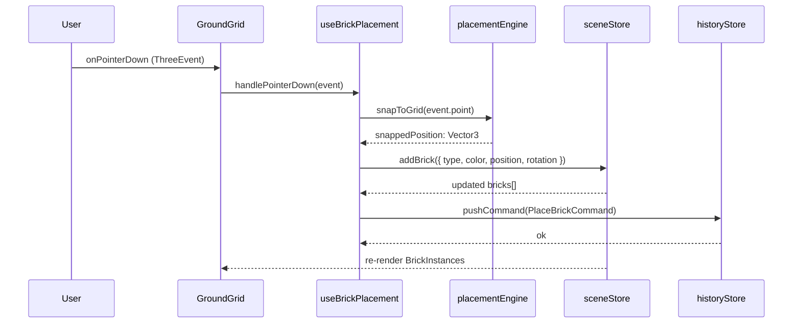
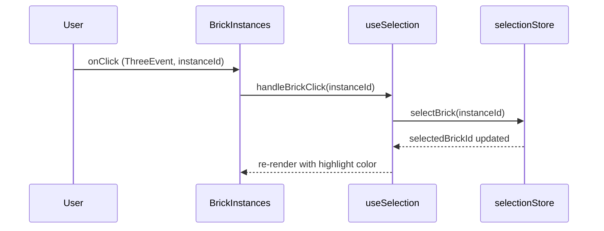
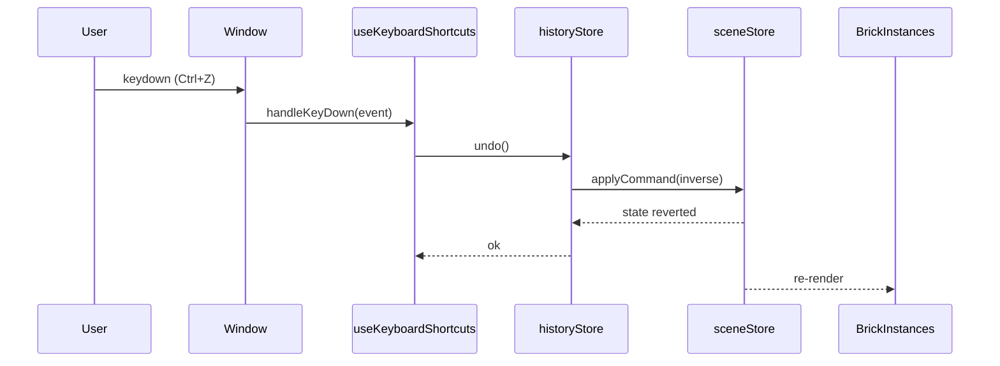
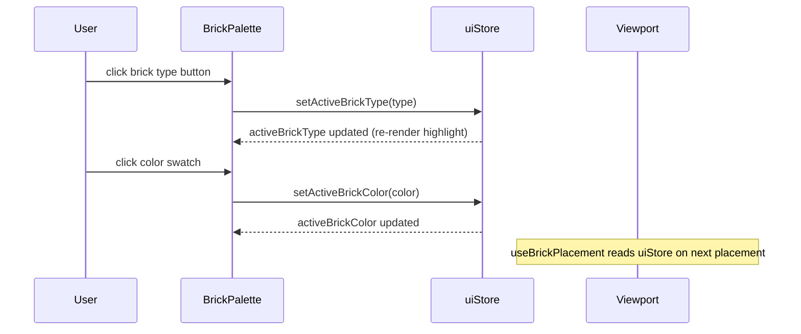
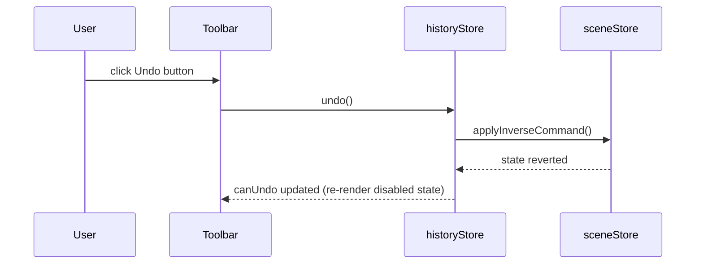

# Low-Level Design: FR-88 — All Interactive Elements Non-Functional

**Issue:** [#88 — App loads but all interactive elements are non-functional](https://github.com/sreenivasmrpivot/legobuilder/issues/88)  
**FR-ID:** FR-88  
**Type:** Bug Fix  
**Area:** Frontend  
**Priority:** Critical  
**Date:** 2026-04-12  
**Status:** Draft — Pending Design Review (Gate 6a)

---

## 1. Problem Statement

The LegoBuilder application renders its full UI (3D canvas, toolbar, brick palette, ground grid) but **all interactive elements are completely inert**. No pointer events, keyboard shortcuts, drag-and-drop, or toolbar button clicks produce any response. The root cause is a set of **integration wiring gaps** between the React component tree, the custom hooks, the Zustand stores, and the Three.js/R3F event system — not a logic error in any individual module.

### Symptom Summary

| Interaction | Expected | Actual |
|---|---|---|
| Click ground grid | Place brick at snapped position | No response |
| Click BrickPalette item | Update active brick type + visual highlight | No response |
| Click color swatch | Update active brick color | No response |
| Click Toolbar Undo | `historyStore.undo()` | No response |
| Click Toolbar Redo | `historyStore.redo()` | No response |
| Click Toolbar Clear | `sceneStore.clearScene()` | No response |
| Click Toolbar Export | JSON export download | No response |
| Click existing brick | Select brick (highlight) | No response |
| Press R | Rotate placement preview / selected brick 90° | No response |
| Press Delete | Remove selected brick | No response |
| Press Escape | Clear selection | No response |
| Press Ctrl+Z / Ctrl+Y | Undo / Redo | No response |
| Hover ground grid | Show ghost brick preview | No response |

---

## 2. Root Cause Analysis

Six distinct wiring gaps have been identified. Each is independent and must be fixed together for full functionality.

### RC-1: `useKeyboardShortcuts` Not Mounted

`useKeyboardShortcuts.ts` registers `keydown` listeners on `window` and wires them to `historyStore`, `selectionStore`, and `sceneStore`. However, the hook is **never called** in `App.tsx` or `Viewport.tsx`. The hook exists but is dead code.

**Fix:** Call `useKeyboardShortcuts()` inside `App.tsx` at the top level so it mounts once for the application lifetime.

### RC-2: `useBrickPlacement` Return Values Not Spread onto Canvas

`useBrickPlacement.ts` returns pointer event handlers (`onPointerDown`, `onPointerMove`, `onPointerUp`). These handlers must be spread onto the R3F `<Canvas>` or the `<GroundGrid>` mesh. Currently, `Viewport.tsx` calls the hook but **discards its return value** — the handlers are never attached to any DOM or R3F element.

**Fix:** Destructure the returned handlers from `useBrickPlacement()` and spread them onto the `<GroundGrid>` mesh (or the invisible hit-plane mesh) inside `Viewport.tsx`.

### RC-3: `useSelection` Not Wired to `BrickInstances`

`useSelection.ts` returns a `handleClick(instanceId)` callback that calls `selectionStore.selectBrick()`. `BrickInstances.tsx` renders the `InstancedMesh` but does **not** import or call `useSelection`, so brick clicks never reach the selection store.

**Fix:** Call `useSelection()` inside `BrickInstances.tsx` (or pass the handler down from `Viewport.tsx`) and attach `onClick` to the `<instancedMesh>` element.

### RC-4: `BrickPalette` onClick Handlers Disconnected from Stores

`BrickPalette.tsx` renders brick type buttons and color swatches but the `onClick` handlers are either missing or are no-op stubs. The component does not import `uiStore` and does not call `uiStore.setActiveBrickType()` or `uiStore.setActiveBrickColor()`.

**Fix:** Import `useUiStore` in `BrickPalette.tsx`. Wire each brick-type button's `onClick` to `setActiveBrickType(type)` and each color swatch's `onClick` to `setActiveBrickColor(color)`. Read `activeBrickType` and `activeBrickColor` from the store to drive the active-selection CSS class.

### RC-5: `Toolbar` onClick Handlers Are No-Ops

`Toolbar.tsx` renders Undo, Redo, Clear, and Export buttons but the `onClick` props are either empty arrow functions or missing. The component does not import `historyStore`, `sceneStore`, or the export service.

**Fix:** Import `useHistoryStore`, `useSceneStore`, and `exportScene` in `Toolbar.tsx`. Wire each button's `onClick` to the corresponding store action or service call. Derive `canUndo` / `canRedo` from the history store to drive the disabled state of the buttons.

### RC-6: CSS `pointer-events` Overlay (Potential)

A CSS rule may apply `pointer-events: none` to the canvas container or an overlay `<div>` may sit above the canvas with a higher `z-index`, intercepting all pointer events silently. This must be audited in `index.css` and any inline styles in `Viewport.tsx` / `ViewportCanvas.tsx`.

**Fix:** Audit `index.css` and all component inline styles. Ensure the R3F `<Canvas>` wrapper has `pointer-events: auto` and no sibling or parent element has an invisible overlay with higher `z-index`.

---

## 3. Component Architecture

### 3.1 Current (Broken) Wiring Diagram

```
App.tsx
  └── Viewport.tsx
        ├── ViewportCanvas.tsx  (R3F Canvas)
        │     ├── GroundGrid.tsx        ← no pointer handlers
        │     ├── BrickInstances.tsx    ← no click handler
        │     └── Baseplate.tsx
        ├── BrickPalette.tsx            ← onClick = no-op
        └── Toolbar.tsx                 ← onClick = no-op

Hooks (defined but NOT mounted):
  useKeyboardShortcuts.ts              ← never called
  useBrickPlacement.ts                 ← called but return value discarded
  useSelection.ts                      ← never called in BrickInstances
  useUndoRedo.ts                       ← never called in Toolbar
```

### 3.2 Target (Fixed) Wiring Diagram

```
App.tsx
  ├── useKeyboardShortcuts()           ← MOUNT HERE (RC-1)
  └── Viewport.tsx
        ├── ViewportCanvas.tsx  (R3F Canvas)
        │     ├── GroundGrid.tsx
        │     │     └── onPointerDown/Move/Up ← from useBrickPlacement() (RC-2)
        │     ├── BrickInstances.tsx
        │     │     └── onClick ← from useSelection() (RC-3)
        │     └── Baseplate.tsx
        ├── BrickPalette.tsx
        │     ├── onClick(type) → uiStore.setActiveBrickType()  (RC-4)
        │     └── onClick(color) → uiStore.setActiveBrickColor() (RC-4)
        └── Toolbar.tsx
              ├── onClick(undo)   → historyStore.undo()          (RC-5)
              ├── onClick(redo)   → historyStore.redo()          (RC-5)
              ├── onClick(clear)  → sceneStore.clearScene()      (RC-5)
              └── onClick(export) → exportScene(sceneStore)      (RC-5)
```

### 3.3 Module Dependency Map

```
App.tsx
  ├── useKeyboardShortcuts
  │     ├── historyStore (undo/redo)
  │     ├── selectionStore (clearSelection)
  │     └── sceneStore (removeSelectedBrick)
  └── Viewport.tsx
        ├── useBrickPlacement
        │     ├── placementEngine (snapToGrid, placeBrick)
        │     ├── sceneStore (addBrick)
        │     └── uiStore (activeBrickType, activeBrickColor)
        ├── useSelection (via BrickInstances)
        │     └── selectionStore (selectBrick, clearSelection)
        ├── BrickPalette
        │     └── uiStore (setActiveBrickType, setActiveBrickColor)
        └── Toolbar
              ├── historyStore (undo, redo, canUndo, canRedo)
              ├── sceneStore (clearScene)
              └── exportService (exportScene)
```

---

## 4. Sequence Diagrams

### 4.1 Brick Placement Flow (Click on Ground Grid)



### 4.2 Brick Selection Flow (Click on Existing Brick)



### 4.3 Keyboard Shortcut Flow (Ctrl+Z Undo)



### 4.4 BrickPalette Selection Flow



### 4.5 Toolbar Action Flow (Undo Button)



---

## 5. Detailed Fix Specifications

### 5.1 `App.tsx` — Mount `useKeyboardShortcuts`

**File:** `frontend/src/components/App.tsx`

**Change:** Add `useKeyboardShortcuts()` call at the top of the `App` component body.

```typescript
// BEFORE (missing hook call)
export function App() {
  return (
    <div className="app-container">
      <Viewport />
    </div>
  );
}

// AFTER
import { useKeyboardShortcuts } from '../hooks/useKeyboardShortcuts';

export function App() {
  useKeyboardShortcuts(); // ← RC-1 fix: mount keyboard handler
  return (
    <div className="app-container">
      <Viewport />
    </div>
  );
}
```

**Rationale:** `useKeyboardShortcuts` attaches a `keydown` listener to `window` via `useEffect`. It must be mounted in a component that lives for the full application lifetime. `App.tsx` is the correct location.

---

### 5.2 `Viewport.tsx` — Wire `useBrickPlacement` Handlers to GroundGrid

**File:** `frontend/src/components/viewport/Viewport.tsx`

**Change:** Destructure the pointer event handlers returned by `useBrickPlacement()` and pass them as props to `<GroundGrid>`.

```typescript
// BEFORE
const Viewport = () => {
  useBrickPlacement(); // return value discarded
  return (
    <ViewportCanvas>
      <GroundGrid />
      <BrickInstances />
    </ViewportCanvas>
  );
};

// AFTER
const Viewport = () => {
  const { onPointerDown, onPointerMove, onPointerUp } = useBrickPlacement(); // ← RC-2 fix
  return (
    <ViewportCanvas>
      <GroundGrid
        onPointerDown={onPointerDown}
        onPointerMove={onPointerMove}
        onPointerUp={onPointerUp}
      />
      <BrickInstances />
    </ViewportCanvas>
  );
};
```

**GroundGrid.tsx** must accept and forward these props to its underlying `<mesh>` element:

```typescript
interface GroundGridProps {
  onPointerDown?: (event: ThreeEvent<PointerEvent>) => void;
  onPointerMove?: (event: ThreeEvent<PointerEvent>) => void;
  onPointerUp?: (event: ThreeEvent<PointerEvent>) => void;
}

export const GroundGrid: React.FC<GroundGridProps> = ({
  onPointerDown,
  onPointerMove,
  onPointerUp,
}) => (
  <mesh
    onPointerDown={onPointerDown}
    onPointerMove={onPointerMove}
    onPointerUp={onPointerUp}
    receiveShadow
  >
    {/* existing geometry */}
  </mesh>
);
```

---

### 5.3 `BrickInstances.tsx` — Wire `useSelection` onClick

**File:** `frontend/src/components/viewport/BrickInstances.tsx`

**Change:** Call `useSelection()` and attach the returned `handleBrickClick` to the `<instancedMesh>` `onClick` handler.

```typescript
// BEFORE
export const BrickInstances = () => {
  // ... renders instancedMesh with no onClick
  return <instancedMesh ref={meshRef} args={[geometry, material, count]} />;
};

// AFTER
import { useSelection } from '../../hooks/useSelection';

export const BrickInstances = () => {
  const { handleBrickClick } = useSelection(); // ← RC-3 fix
  // ...
  const handleClick = (event: ThreeEvent<MouseEvent>) => {
    event.stopPropagation();
    const instanceId = event.instanceId;
    if (instanceId !== undefined) {
      handleBrickClick(instanceId);
    }
  };
  return (
    <instancedMesh
      ref={meshRef}
      args={[geometry, material, count]}
      onClick={handleClick} // ← RC-3 fix
    />
  );
};
```

---

### 5.4 `BrickPalette.tsx` — Connect to `uiStore`

**File:** `frontend/src/components/ui/BrickPalette.tsx`

**Change:** Import `useUiStore` and wire `onClick` handlers for brick type buttons and color swatches.

```typescript
// BEFORE — no store connection
export const BrickPalette = () => {
  return (
    <div className="brick-palette">
      {BRICK_TYPES.map(type => (
        <button key={type.id}>{type.label}</button> // no onClick
      ))}
    </div>
  );
};

// AFTER
import { useUiStore } from '../../stores/uiStore';

export const BrickPalette = () => {
  const { activeBrickType, activeBrickColor, setActiveBrickType, setActiveBrickColor } =
    useUiStore(); // ← RC-4 fix

  return (
    <div className="brick-palette">
      {BRICK_TYPES.map(type => (
        <button
          key={type.id}
          className={activeBrickType === type.id ? 'active' : ''}
          onClick={() => setActiveBrickType(type.id)} // ← RC-4 fix
        >
          {type.label}
        </button>
      ))}
      <div className="color-swatches">
        {BRICK_COLORS.map(color => (
          <div
            key={color}
            className={`swatch ${activeBrickColor === color ? 'active' : ''}`}
            style={{ backgroundColor: color }}
            onClick={() => setActiveBrickColor(color)} // ← RC-4 fix
          />
        ))}
      </div>
    </div>
  );
};
```

---

### 5.5 `Toolbar.tsx` — Connect to Stores and Export Service

**File:** `frontend/src/components/ui/Toolbar.tsx`

**Change:** Import stores and export service; wire all button `onClick` handlers.

```typescript
// BEFORE — no-op handlers
export const Toolbar = () => (
  <div className="toolbar">
    <button onClick={() => {}}>Undo</button>
    <button onClick={() => {}}>Redo</button>
    <button onClick={() => {}}>Clear</button>
    <button onClick={() => {}}>Export</button>
  </div>
);

// AFTER
import { useHistoryStore } from '../../stores/historyStore';
import { useSceneStore } from '../../stores/sceneStore';
import { exportScene } from '../../services/exportService';

export const Toolbar = () => {
  const { undo, redo, canUndo, canRedo } = useHistoryStore(); // ← RC-5 fix
  const { clearScene, bricks } = useSceneStore();             // ← RC-5 fix

  return (
    <div className="toolbar">
      <button onClick={undo} disabled={!canUndo}>Undo</button>   {/* ← RC-5 fix */}
      <button onClick={redo} disabled={!canRedo}>Redo</button>   {/* ← RC-5 fix */}
      <button onClick={clearScene}>Clear</button>                {/* ← RC-5 fix */}
      <button onClick={() => exportScene(bricks)}>Export</button>{/* ← RC-5 fix */}
    </div>
  );
};
```

---

### 5.6 CSS Audit — `index.css` and Viewport Styles

**Files:** `frontend/src/index.css`, `frontend/src/components/viewport/ViewportCanvas.tsx`

**Change:** Audit and remove any `pointer-events: none` on the canvas container or any invisible overlay.

**Rules to enforce:**

```css
/* REQUIRED — canvas container must allow pointer events */
.viewport-canvas-container {
  pointer-events: auto;  /* ← RC-6 fix: ensure not 'none' */
  position: relative;
  z-index: 0;            /* ← RC-6 fix: no accidental overlay */
}

/* UI overlays (toolbar, palette) must not cover the canvas */
.toolbar {
  position: absolute;
  z-index: 10;
  pointer-events: auto;
}

.brick-palette {
  position: absolute;
  z-index: 10;
  pointer-events: auto;
}
```

**Verification:** Use browser DevTools → Elements → Computed → `pointer-events` on the canvas element to confirm `auto`.

---

## 6. Data Models

No new data models are introduced. This fix only wires existing models to existing components. The relevant existing types are documented here for implementer reference.

### 6.1 `BrickInstance` (existing)

```typescript
interface BrickInstance {
  id: string;           // UUID
  type: BrickType;      // e.g. '1x1', '2x4', '2x2'
  color: string;        // hex color string e.g. '#FF0000'
  position: Vector3;    // world-space snapped position
  rotation: number;     // 0 | 90 | 180 | 270 degrees
}
```

### 6.2 `UIStore` state (existing)

```typescript
interface UIState {
  activeBrickType: BrickType;
  activeBrickColor: string;
  activeTool: 'place' | 'select' | 'delete';
  setActiveBrickType: (type: BrickType) => void;
  setActiveBrickColor: (color: string) => void;
  setActiveTool: (tool: UIState['activeTool']) => void;
}
```

### 6.3 `HistoryStore` state (existing)

```typescript
interface HistoryState {
  past: Command[];
  future: Command[];
  canUndo: boolean;
  canRedo: boolean;
  undo: () => void;
  redo: () => void;
  pushCommand: (cmd: Command) => void;
}
```

### 6.4 `SceneStore` state (existing)

```typescript
interface SceneState {
  bricks: BrickInstance[];
  addBrick: (brick: Omit<BrickInstance, 'id'>) => void;
  removeBrick: (id: string) => void;
  clearScene: () => void;
  updateBrick: (id: string, patch: Partial<BrickInstance>) => void;
}
```

---

## 7. API Endpoints

This is a pure frontend bug fix. No backend API endpoints are added or modified. The only "API" surface is the export function:

### 7.1 `exportScene(bricks: BrickInstance[]): void`

**Location:** `frontend/src/services/exportService.ts`  
**Behavior:** Serializes the `bricks` array to JSON and triggers a browser file download as `legobuilder-scene.json`.  
**No network call** — purely client-side.

```typescript
export function exportScene(bricks: BrickInstance[]): void {
  const payload = JSON.stringify({ version: 1, bricks }, null, 2);
  const blob = new Blob([payload], { type: 'application/json' });
  const url = URL.createObjectURL(blob);
  const a = document.createElement('a');
  a.href = url;
  a.download = 'legobuilder-scene.json';
  a.click();
  URL.revokeObjectURL(url);
}
```

---

## 8. Error Handling Strategy

| Scenario | Handling |
|---|---|
| `event.instanceId` is `undefined` on brick click | Guard clause: `if (instanceId === undefined) return;` |
| `placementEngine.snapToGrid` returns null (off-grid click) | Guard clause in `useBrickPlacement`: skip placement if null |
| `historyStore.undo()` called when `canUndo === false` | Toolbar button is `disabled`; store guard: no-op if `past.length === 0` |
| `historyStore.redo()` called when `canRedo === false` | Toolbar button is `disabled`; store guard: no-op if `future.length === 0` |
| `exportScene` called with empty `bricks[]` | Export proceeds normally — produces valid empty JSON `{ version: 1, bricks: [] }` |
| Keyboard shortcut fires during text input | `useKeyboardShortcuts` checks `event.target` — skip if target is `INPUT`, `TEXTAREA`, or `SELECT` |
| R3F pointer event fires outside canvas bounds | R3F handles this natively; no additional guard needed |

---

## 9. Security Considerations

| Concern | Assessment | Mitigation |
|---|---|---|
| XSS via exported JSON | Low risk — export is client-side only, no server upload | N/A |
| Keyboard shortcut hijacking | Low risk — shortcuts are standard (Ctrl+Z, Delete, R) | Check `event.target` to avoid firing in form inputs |
| Pointer event spoofing | Not applicable — all events are local browser events | N/A |
| Store mutation from untrusted input | Not applicable — all inputs are user gestures | N/A |

---

## 10. Test Strategy

All tests are **regression tests** that must fail before the fix and pass after.

### 10.1 Unit Tests (Vitest + React Testing Library)

| Test ID | File | Description |
|---|---|---|
| T-88-01 | `App.test.tsx` | `useKeyboardShortcuts` is called when `App` mounts |
| T-88-02 | `Toolbar.test.tsx` | Undo button calls `historyStore.undo()` on click |
| T-88-03 | `Toolbar.test.tsx` | Redo button calls `historyStore.redo()` on click |
| T-88-04 | `Toolbar.test.tsx` | Clear button calls `sceneStore.clearScene()` on click |
| T-88-05 | `Toolbar.test.tsx` | Export button triggers file download |
| T-88-06 | `Toolbar.test.tsx` | Undo button is `disabled` when `canUndo === false` |
| T-88-07 | `Toolbar.test.tsx` | Redo button is `disabled` when `canRedo === false` |
| T-88-08 | `BrickPalette.test.tsx` | Clicking brick type calls `uiStore.setActiveBrickType()` |
| T-88-09 | `BrickPalette.test.tsx` | Clicking color swatch calls `uiStore.setActiveBrickColor()` |
| T-88-10 | `BrickPalette.test.tsx` | Active brick type has `active` CSS class |
| T-88-11 | `useKeyboardShortcuts.test.ts` | Ctrl+Z fires `historyStore.undo()` |
| T-88-12 | `useKeyboardShortcuts.test.ts` | Delete fires `sceneStore.removeSelectedBrick()` |
| T-88-13 | `useKeyboardShortcuts.test.ts` | Escape fires `selectionStore.clearSelection()` |

### 10.2 Integration Tests (Vitest + @testing-library/react)

| Test ID | Description |
|---|---|
| T-88-INT-01 | Full placement flow: pointer event on GroundGrid → brick appears in scene |
| T-88-INT-02 | Full selection flow: click on BrickInstances → selectionStore updated |
| T-88-INT-03 | Full undo flow: place brick → Ctrl+Z → brick removed from scene |

### 10.3 Acceptance Criteria Mapping

| Acceptance Criterion | Test IDs |
|---|---|
| Clicking ground grid places brick | T-88-INT-01 |
| BrickPalette updates active type | T-88-08, T-88-10 |
| BrickPalette updates active color | T-88-09 |
| Toolbar Undo triggers undo | T-88-02, T-88-11, T-88-INT-03 |
| Toolbar Redo triggers redo | T-88-03 |
| Toolbar Clear clears scene | T-88-04 |
| Toolbar Export triggers download | T-88-05 |
| Clicking brick selects it | T-88-INT-02 |
| R key rotates brick | T-88-12 (extend for R key) |
| Delete key removes brick | T-88-12 |
| Escape clears selection | T-88-13 |
| Ctrl+Z / Ctrl+Y undo/redo | T-88-11 |
| Hover shows ghost brick | T-88-INT-01 (extend for hover) |

---

## 11. Implementation Order

The fixes are independent but should be implemented in this order to enable incremental testing:

1. **RC-6 first** — Audit CSS. If an overlay is blocking all events, fixing it alone may restore partial functionality and confirm the other RCs.
2. **RC-1** — Mount `useKeyboardShortcuts` in `App.tsx`. Simplest change, immediately testable.
3. **RC-5** — Wire `Toolbar.tsx` to stores. Testable with React Testing Library without R3F.
4. **RC-4** — Wire `BrickPalette.tsx` to `uiStore`. Testable with React Testing Library without R3F.
5. **RC-2** — Wire `useBrickPlacement` handlers to `GroundGrid`. Requires R3F test setup.
6. **RC-3** — Wire `useSelection` to `BrickInstances`. Requires R3F test setup.

---

## 12. Files to Modify

| File | Change Type | Root Cause |
|---|---|---|
| `frontend/src/components/App.tsx` | Add hook call | RC-1 |
| `frontend/src/components/viewport/Viewport.tsx` | Destructure + pass props | RC-2 |
| `frontend/src/components/viewport/GroundGrid.tsx` | Accept + forward pointer props | RC-2 |
| `frontend/src/components/viewport/BrickInstances.tsx` | Add useSelection + onClick | RC-3 |
| `frontend/src/components/ui/BrickPalette.tsx` | Add uiStore + onClick handlers | RC-4 |
| `frontend/src/components/ui/Toolbar.tsx` | Add stores + onClick handlers | RC-5 |
| `frontend/src/index.css` | Audit pointer-events | RC-6 |
| `frontend/src/components/viewport/ViewportCanvas.tsx` | Audit z-index / overlay | RC-6 |

**Files NOT to modify** (logic is correct, only wiring is broken):
- `frontend/src/hooks/useBrickPlacement.ts`
- `frontend/src/hooks/useKeyboardShortcuts.ts`
- `frontend/src/hooks/useSelection.ts`
- `frontend/src/hooks/useUndoRedo.ts`
- `frontend/src/engine/placementEngine.ts`
- `frontend/src/engine/selectionManager.ts`
- `frontend/src/stores/sceneStore.ts`
- `frontend/src/stores/selectionStore.ts`
- `frontend/src/stores/uiStore.ts`
- `frontend/src/stores/historyStore.ts`

---

## 13. Non-Functional Requirements

| NFR | Target | Approach |
|---|---|---|
| Performance | No additional re-renders introduced | Use Zustand selectors (not full store subscription) in each component |
| Bundle size | No new dependencies | All fixes use existing hooks, stores, and services |
| Accessibility | Toolbar buttons remain keyboard-accessible | `disabled` attribute correctly set; no `pointer-events: none` on buttons |
| Test coverage | All 13 unit tests + 3 integration tests pass | See Section 10 |

---

## 14. Open Questions

| # | Question | Owner | Blocking? |
|---|---|---|---|
| OQ-1 | Does `useBrickPlacement` return `onPointerDown/Move/Up` or a different handler shape? Implementer must verify the actual hook signature. | Frontend implementer | Yes |
| OQ-2 | Does `useSelection` return `handleBrickClick` or `handleClick`? Implementer must verify the actual hook return type. | Frontend implementer | Yes |
| OQ-3 | Is `exportService.ts` already implemented or does it need to be created? | Frontend implementer | Yes |
| OQ-4 | Does `historyStore` expose `canUndo`/`canRedo` as derived state or must they be computed from `past.length`/`future.length`? | Frontend implementer | No |

> **Note to implementer:** Before writing any code, read the actual source of `useBrickPlacement.ts`, `useSelection.ts`, `historyStore.ts`, and `exportService.ts` to confirm the exact API shapes. The pseudocode above uses the most likely signatures based on the issue description.

---

*Generated by Spectra Design Agent — 2026-04-12*
