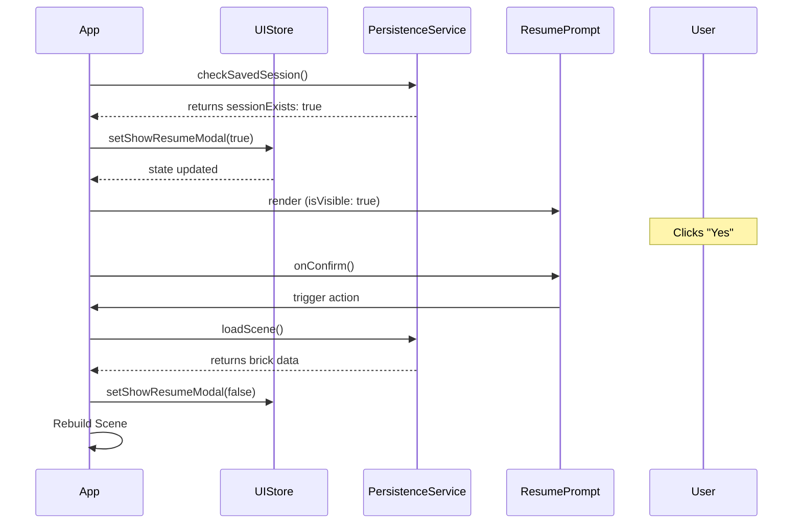

# Low-Level Design: Resume Prompt Integration (FR-PERS-002)

## Overview
This document outlines the design for re-integrating the `ResumePrompt` component into the `App.tsx` shell to resolve the issue where the session resume feature is non-functional.

## 1. API & Data Models

### 1.1 Session Data Schema
The session data is stored in IndexedDB via the `persistenceService`.

**Session Object Structure:**
```typescript
interface SavedSession {
  version: string; // e.g., "1.0"
  timestamp: number;
  bricks: BrickData[];
}

interface BrickData {
  id: string;
  type: string;
  position: { x: number; y: number; z: number };
  rotation: { x: number; y: number; z: number };
  color: string;
}
```

### 1.2 State Management (Zustand)
The `uiStore` will manage the visibility of the prompt.

**`uiStore` Additions:**
- `showResumeModal: boolean`
- `setShowResumeModal: (show: boolean) => void`

## 2. Component Architecture

### 2.1 Component Hierarchy
- `App.tsx` (Root)
    - `ResumePrompt` (Modal/Overlay)
        - `Button (Yes)` -> Triggers `persistenceService.loadScene()`
        - `Button (No)` -> Triggers `persistenceService.clearSession()`

### 2.2 Component Implementation Details

#### `ResumePrompt.tsx`
The component will be a functional component using Tailwind CSS for styling.

**Props Interface:**
```typescript
interface ResumePromptProps {
  isVisible: boolean;
  onConfirm: () => void;
  onDecline: () => void;
}
```

**Logic:**
- Rendered as a centered modal overlay when `isVisible` is true.
- Uses `z-index` to ensure it appears above the 3D canvas.

#### `App.tsx` Integration
The `App.tsx` component will use a `useEffect` hook to check for existing sessions on mount.

**Lifecycle Flow:**
1. `App` mounts.
2. `useEffect` calls `persistenceService.checkSavedSession()`.
3. If a session is detected, `uiStore.setShowResumeModal(true)` is called.
4. `ResumePrompt` renders.

## 3. Sequence Diagram



## 4. Error Handling & Security

### 4.1 Error Handling
- **Load Failure**: If `loadScene()` fails due to corrupted data, the `ResumePrompt` should be dismissed, and a toast notification should inform the user.
- **Type Mismatch**: Ensure `ResumePrompt` props strictly follow the `persistenceStore` API to prevent the TypeScript errors that led to its removal.

### 4.2 Security
- **Input Validation**: The `importService` (used by the load process) must validate the incoming JSON structure to prevent any malicious payload execution during the deserialization of the session.

## 5. Implementation Checklist
- [ ] Define `showResumeModal` in `uiStore`.
- [ ] Implement `ResumePrompt` component with `onConfirm` and `onDecline` callbacks.
- [ ] Update `App.tsx` to include `ResumePrompt` in the component tree.
- [ ] Implement `useEffect` in `App.tsx` to trigger session check on mount.
- [ ] Verify type compatibility between `persistenceService` and `ResumePrompt`.
