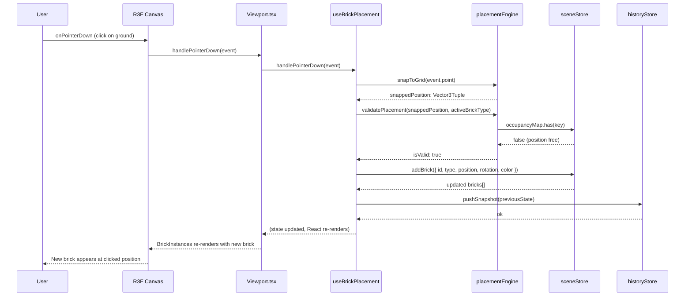
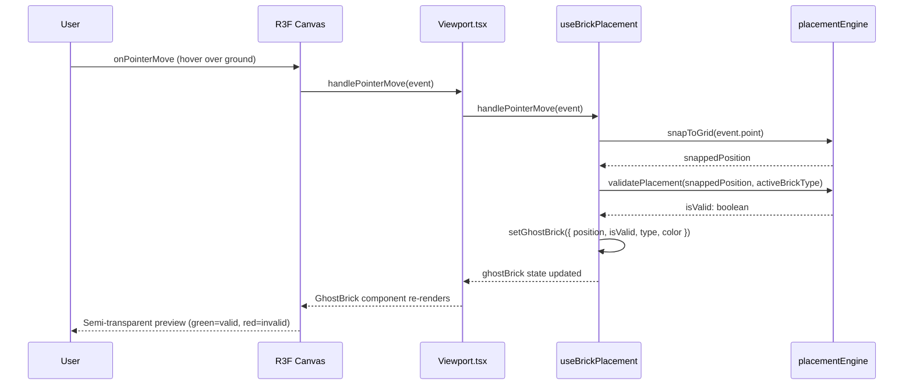
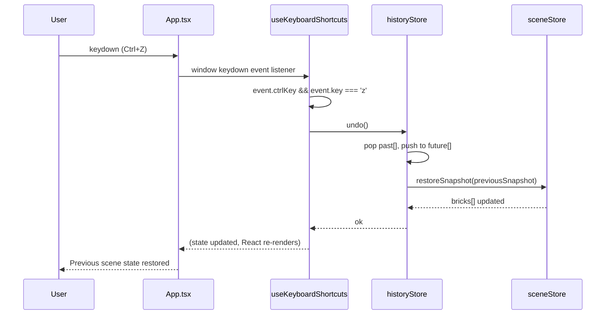
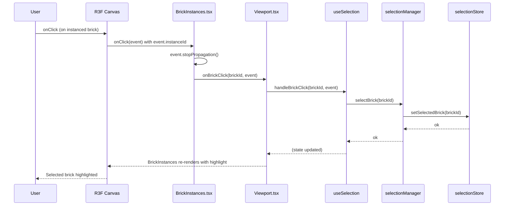
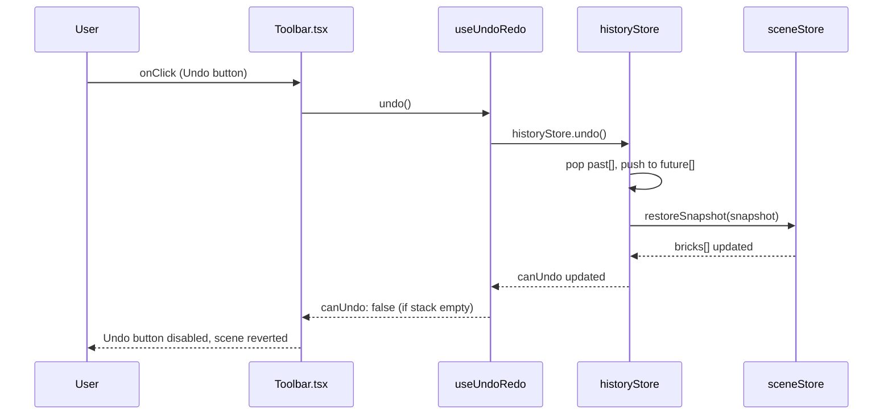

# Low-Level Design: BUG-88 — Interactive Elements Non-Functional

**Issue:** [#88 — App loads but all interactive elements are non-functional](https://github.com/sreenivasmrpivot/legobuilder/issues/88)  
**FR-ID:** BUG-88  
**Area:** Frontend  
**Priority:** Critical  
**Status:** Design Draft  
**Author:** Spectra Design Agent  
**Date:** 2026-04-12  

---

## 1. Problem Statement

The LegoBuilder application renders its full UI (3D canvas, toolbar, brick palette, ground grid) but **all interactive elements are completely non-functional**. No pointer events, keyboard shortcuts, or drag interactions produce any response. The app is a static visual render with zero working event pathways.

This is a **critical integration wiring bug** — the logic modules (hooks, engines, stores) exist and are correctly implemented in isolation, but they are not connected to the React component tree or to each other.

---

## 2. Root Cause Analysis

Based on the issue description and codebase structure, six distinct wiring gaps have been identified:

| # | Root Cause | Affected Files | Severity |
|---|-----------|---------------|----------|
| RC-1 | `useBrickPlacement` hook not mounted in component tree; its returned event handlers not spread onto canvas | `App.tsx`, `Viewport.tsx`, `useBrickPlacement.ts` | Critical |
| RC-2 | `useKeyboardShortcuts` hook not called in `App.tsx` or `Viewport.tsx` | `App.tsx`, `useKeyboardShortcuts.ts` | Critical |
| RC-3 | `Toolbar.tsx` button `onClick` handlers are no-ops or missing; not wired to `historyStore`/`sceneStore` actions | `Toolbar.tsx`, `useUndoRedo.ts` | Critical |
| RC-4 | `BrickPalette.tsx` click handlers not calling `uiStore.setActiveBrickType()` / `uiStore.setActiveColor()` | `BrickPalette.tsx`, `uiStore.ts` | Critical |
| RC-5 | `BrickInstances.tsx` not wiring `onClick` to `selectionManager` / `selectionStore` | `BrickInstances.tsx`, `useSelection.ts`, `selectionManager.ts` | High |
| RC-6 | CSS `pointer-events: none` or invisible overlay div blocking all pointer events at the DOM level | `index.css`, `ViewportCanvas.tsx` | High |

---

## 3. Component Architecture

### 3.1 Current (Broken) Wiring Diagram

```
App.tsx
  ├── Toolbar.tsx          ← onClick handlers: no-op / missing
  ├── BrickPalette.tsx     ← onClick handlers: no-op / missing
  └── Viewport.tsx
        └── ViewportCanvas.tsx
              └── <Canvas>  ← pointer events: not wired
                    ├── BrickInstances.tsx  ← onClick: not wired
                    └── GroundGrid.tsx

Hooks (NOT mounted):
  useBrickPlacement.ts    ← exists but not called
  useKeyboardShortcuts.ts ← exists but not called
  useSelection.ts         ← exists but not called
  useUndoRedo.ts          ← exists but not called
```

### 3.2 Target (Fixed) Wiring Diagram

```
App.tsx
  ├── useKeyboardShortcuts()   ← MOUNT HERE (global keyboard handler)
  ├── useAutoSave()            ← already mounted (keep)
  ├── Toolbar.tsx
  │     ├── onClick={undo}     ← wire to historyStore.undo()
  │     ├── onClick={redo}     ← wire to historyStore.redo()
  │     ├── onClick={clear}    ← wire to sceneStore.clearScene()
  │     ├── onClick={export}   ← wire to exportService.exportScene()
  │     ├── onClick={import}   ← wire to importService.importScene()
  │     ├── onClick={newScene} ← wire to sceneStore.clearScene()
  │     └── onClick={resetCam} ← wire to cameraControls.reset()
  ├── BrickPalette.tsx
  │     ├── onBrickTypeClick   ← wire to uiStore.setActiveBrickType()
  │     └── onColorClick       ← wire to uiStore.setActiveColor()
  └── Viewport.tsx
        ├── useBrickPlacement() ← MOUNT HERE; spread handlers onto canvas
        ├── useSelection()      ← MOUNT HERE; pass handleClick to BrickInstances
        └── ViewportCanvas.tsx
              └── <Canvas
                    onPointerDown={handlePointerDown}   ← from useBrickPlacement
                    onPointerMove={handlePointerMove}   ← from useBrickPlacement
                    onPointerUp={handlePointerUp}       ← from useBrickPlacement
                  >
                    ├── BrickInstances.tsx
                    │     └── onClick={handleBrickClick}  ← from useSelection
                    └── GroundGrid.tsx
```

### 3.3 Module Dependency Map

```
App.tsx
  ├── useKeyboardShortcuts → selectionStore, historyStore, sceneStore
  └── Viewport.tsx
        ├── useBrickPlacement → placementEngine → sceneStore, uiStore, occupancyMap
        └── useSelection → selectionManager → selectionStore, sceneStore

Toolbar.tsx
  ├── useUndoRedo → historyStore
  ├── exportService → sceneStore
  └── importService → sceneStore

BrickPalette.tsx
  └── uiStore (setActiveBrickType, setActiveColor)

BrickInstances.tsx
  ├── sceneStore (bricks array)
  └── selectionStore (selectedBrickId)
```

---

## 4. Detailed Fix Specifications

### 4.1 Fix RC-1: Wire `useBrickPlacement` in `Viewport.tsx`

**File:** `frontend/src/components/viewport/Viewport.tsx`

**Current state:** `useBrickPlacement` hook is defined but not called inside `Viewport`. The R3F `<Canvas>` element has no pointer event handlers.

**Required change:**

```typescript
// Viewport.tsx — BEFORE (broken)
export function Viewport() {
  return (
    <ViewportCanvas>
      <BrickInstances />
      <GroundGrid />
    </ViewportCanvas>
  );
}

// Viewport.tsx — AFTER (fixed)
export function Viewport() {
  const { handlePointerDown, handlePointerMove, handlePointerUp, ghostBrick } =
    useBrickPlacement();
  const { handleBrickClick } = useSelection();

  return (
    <ViewportCanvas
      onPointerDown={handlePointerDown}
      onPointerMove={handlePointerMove}
      onPointerUp={handlePointerUp}
    >
      <BrickInstances onBrickClick={handleBrickClick} />
      <GhostBrick ghostBrick={ghostBrick} />
      <GroundGrid />
    </ViewportCanvas>
  );
}
```

**Interface contract for `useBrickPlacement`:**

```typescript
interface BrickPlacementHandlers {
  handlePointerDown: (event: ThreeEvent<PointerEvent>) => void;
  handlePointerMove: (event: ThreeEvent<PointerEvent>) => void;
  handlePointerUp:   (event: ThreeEvent<PointerEvent>) => void;
  ghostBrick: GhostBrickState | null;
}
```

**Interface contract for `useSelection`:**

```typescript
interface SelectionHandlers {
  handleBrickClick: (brickId: string, event: ThreeEvent<MouseEvent>) => void;
}
```

### 4.2 Fix RC-2: Mount `useKeyboardShortcuts` in `App.tsx`

**File:** `frontend/src/components/App.tsx`

**Current state:** `useKeyboardShortcuts` hook exists but is never called.

**Required change:**

```typescript
// App.tsx — AFTER (fixed)
export function App() {
  useKeyboardShortcuts(); // ← ADD THIS LINE
  useAutoSave();          // ← already present

  return (
    <div className="app-layout">
      <Toolbar />
      <div className="main-area">
        <BrickPalette />
        <Viewport />
      </div>
    </div>
  );
}
```

**`useKeyboardShortcuts` must handle:**

| Key | Action | Store/Service |
|-----|--------|---------------|
| `R` | Rotate placement preview / selected brick 90° | `uiStore.rotatePlacementPreview()` |
| `Delete` / `Backspace` | Remove selected brick | `sceneStore.removeBrick(selectedId)` + `historyStore.push()` |
| `Escape` | Clear selection | `selectionStore.clearSelection()` |
| `Ctrl+Z` | Undo | `historyStore.undo()` |
| `Ctrl+Y` / `Ctrl+Shift+Z` | Redo | `historyStore.redo()` |

### 4.3 Fix RC-3: Wire `Toolbar.tsx` onClick Handlers

**File:** `frontend/src/components/ui/Toolbar.tsx`

**Current state:** Buttons render but `onClick` props are either missing or reference placeholder `() => {}` no-ops.

**Required change — each button's onClick:**

```typescript
// Toolbar.tsx — AFTER (fixed)
export function Toolbar() {
  const { undo, redo, canUndo, canRedo } = useUndoRedo();
  const clearScene = useSceneStore((s) => s.clearScene);
  const selectedBrickId = useSelectionStore((s) => s.selectedBrickId);
  const removeBrick = useSceneStore((s) => s.removeBrick);

  const handleExport = () => exportService.exportScene();
  const handleImport = () => importService.triggerImport();
  const handleNewScene = () => clearScene();
  const handleResetCamera = () => cameraControls.reset();
  const handleDelete = () => {
    if (selectedBrickId) removeBrick(selectedBrickId);
  };

  return (
    <div role="toolbar" aria-label="Scene controls">
      <button onClick={handleNewScene} aria-label="New scene">New</button>
      <button onClick={handleImport}   aria-label="Import scene">Import</button>
      <button onClick={handleExport}   aria-label="Export scene as JSON">Export</button>
      <button onClick={undo}  disabled={!canUndo} aria-label="Undo last action">Undo</button>
      <button onClick={redo}  disabled={!canRedo} aria-label="Redo last action">Redo</button>
      <button onClick={handleDelete} disabled={!selectedBrickId} aria-label="Delete selected brick">Delete</button>
      <button onClick={handleResetCamera} aria-label="Reset camera">Reset Camera</button>
    </div>
  );
}
```

**`useUndoRedo` interface:**

```typescript
interface UndoRedoHandlers {
  undo: () => void;
  redo: () => void;
  canUndo: boolean;
  canRedo: boolean;
}
```

### 4.4 Fix RC-4: Wire `BrickPalette.tsx` Click Handlers

**File:** `frontend/src/components/ui/BrickPalette.tsx`

**Current state:** Brick type and color items render but click handlers do not call store actions.

**Required change:**

```typescript
// BrickPalette.tsx — AFTER (fixed)
export function BrickPalette() {
  const activeBrickType = useUiStore((s) => s.activeBrickType);
  const activeColor     = useUiStore((s) => s.activeColor);
  const setActiveBrickType = useUiStore((s) => s.setActiveBrickType);
  const setActiveColor     = useUiStore((s) => s.setActiveColor);

  return (
    <aside className="brick-palette" aria-label="Brick palette">
      <section aria-label="Brick types">
        {BRICK_TYPES.map((type) => (
          <button
            key={type.id}
            onClick={() => setActiveBrickType(type.id)}
            aria-label={`Select ${type.label} brick`}
            aria-pressed={activeBrickType === type.id}
            className={activeBrickType === type.id ? 'active' : ''}
          >
            {type.label}
          </button>
        ))}
      </section>
      <section aria-label="Color picker">
        {COLOR_PALETTE.map((color) => (
          <button
            key={color.hex}
            onClick={() => setActiveColor(color.hex)}
            aria-label={`Select color ${color.name}`}
            aria-pressed={activeColor === color.hex}
            style={{ backgroundColor: color.hex }}
            className={activeColor === color.hex ? 'active' : ''}
          />
        ))}
      </section>
    </aside>
  );
}
```

### 4.5 Fix RC-5: Wire `BrickInstances.tsx` Click to Selection

**File:** `frontend/src/components/viewport/BrickInstances.tsx`

**Current state:** `BrickInstances` renders the `InstancedMesh` but does not handle click events for brick selection.

**Required change:**

```typescript
// BrickInstances.tsx — AFTER (fixed)
interface BrickInstancesProps {
  onBrickClick: (brickId: string, event: ThreeEvent<MouseEvent>) => void;
}

export function BrickInstances({ onBrickClick }: BrickInstancesProps) {
  const bricks = useSceneStore((s) => s.bricks);
  const selectedBrickId = useSelectionStore((s) => s.selectedBrickId);
  const meshRef = useRef<THREE.InstancedMesh>(null);

  // ... existing instanced mesh update logic ...

  const handleClick = useCallback(
    (event: ThreeEvent<MouseEvent>) => {
      event.stopPropagation();
      const instanceId = event.instanceId;
      if (instanceId !== undefined && bricks[instanceId]) {
        onBrickClick(bricks[instanceId].id, event);
      }
    },
    [bricks, onBrickClick]
  );

  return (
    <instancedMesh
      ref={meshRef}
      args={[undefined, undefined, MAX_BRICKS]}
      onClick={handleClick}   // ← ADD THIS
    >
      <boxGeometry args={[BRICK_WIDTH, BRICK_HEIGHT, BRICK_DEPTH]} />
      <meshStandardMaterial />
    </instancedMesh>
  );
}
```

### 4.6 Fix RC-6: Audit CSS for Pointer-Event Blocking

**File:** `frontend/src/index.css`, `frontend/src/components/viewport/ViewportCanvas.tsx`

**Audit checklist:**

```css
/* REMOVE or CHANGE any of these patterns: */
.canvas-container { pointer-events: none; }  /* ← REMOVE */
.overlay { z-index: 9999; }                  /* ← verify no invisible overlay */
canvas { pointer-events: none; }             /* ← REMOVE */

/* ENSURE these are present: */
.canvas-container { pointer-events: auto; }
.brick-palette    { pointer-events: auto; }
.toolbar          { pointer-events: auto; }
```

**ViewportCanvas.tsx audit:**
- Verify the `<Canvas>` wrapper `<div>` does NOT have `style={{ pointerEvents: 'none' }}`
- Verify no `<div>` overlay sits above the canvas with `position: absolute; z-index > canvas`
- Verify `OrbitControls` `enablePan` / `enableRotate` are not consuming all pointer events before R3F mesh handlers fire

---

## 5. Data Models

### 5.1 Store Interfaces (Existing — Verify Completeness)

```typescript
// uiStore.ts — required actions
interface UIStore {
  activeBrickType: BrickType;
  activeColor: string;
  activeTool: 'place' | 'select' | 'delete';
  setActiveBrickType: (type: BrickType) => void;
  setActiveColor: (color: string) => void;
  setActiveTool: (tool: UIStore['activeTool']) => void;
  rotatePlacementPreview: () => void;  // increments rotation by 90°
}

// selectionStore.ts — required actions
interface SelectionStore {
  selectedBrickId: string | null;
  setSelectedBrick: (id: string | null) => void;
  clearSelection: () => void;
}

// historyStore.ts — required actions
interface HistoryStore {
  past: SceneSnapshot[];
  future: SceneSnapshot[];
  canUndo: boolean;
  canRedo: boolean;
  undo: () => void;
  redo: () => void;
  pushSnapshot: (snapshot: SceneSnapshot) => void;
}

// sceneStore.ts — required actions
interface SceneStore {
  bricks: BrickData[];
  occupancyMap: Map<string, string>; // "x,y,z" → brickId
  addBrick: (brick: BrickData) => void;
  removeBrick: (id: string) => void;
  clearScene: () => void;
  updateBrick: (id: string, updates: Partial<BrickData>) => void;
}
```

### 5.2 Brick Data Model

```typescript
interface BrickData {
  id: string;           // UUID v4
  type: BrickType;      // '1x1' | '1x2' | '2x2' | '2x4'
  position: Vector3Tuple; // [x, y, z] in grid units
  rotation: 0 | 90 | 180 | 270; // degrees around Y axis
  color: string;        // hex color string e.g. '#FF0000'
}

type Vector3Tuple = [number, number, number];
type BrickType = '1x1' | '1x2' | '2x2' | '2x4';
```

### 5.3 Ghost Brick State

```typescript
interface GhostBrickState {
  position: Vector3Tuple;
  rotation: 0 | 90 | 180 | 270;
  type: BrickType;
  color: string;
  isValid: boolean; // false = occupied position → render red
}
```

---

## 6. Sequence Diagrams

### 6.1 Brick Placement Flow (Click on Ground Grid)



### 6.2 Ghost Brick Preview Flow (Hover)



### 6.3 Keyboard Shortcut Flow (Ctrl+Z Undo)



### 6.4 Brick Selection Flow (Click on Existing Brick)



### 6.5 Toolbar Undo Button Flow



---

## 7. API / Interface Contracts

### 7.1 `useBrickPlacement` Hook Contract

```typescript
// frontend/src/hooks/useBrickPlacement.ts
export function useBrickPlacement(): BrickPlacementHandlers {
  // Reads from: uiStore (activeBrickType, activeColor, rotation)
  // Writes to:  sceneStore (addBrick), historyStore (pushSnapshot)
  // Internal:   placementEngine (snapToGrid, validatePlacement)
  // Returns:    pointer event handlers + ghostBrick state
}

interface BrickPlacementHandlers {
  handlePointerDown: (event: ThreeEvent<PointerEvent>) => void;
  handlePointerMove: (event: ThreeEvent<PointerEvent>) => void;
  handlePointerUp:   (event: ThreeEvent<PointerEvent>) => void;
  ghostBrick:        GhostBrickState | null;
}
```

### 7.2 `useSelection` Hook Contract

```typescript
// frontend/src/hooks/useSelection.ts
export function useSelection(): SelectionHandlers {
  // Reads from: sceneStore (bricks)
  // Writes to:  selectionStore (setSelectedBrick)
  // Internal:   selectionManager
}

interface SelectionHandlers {
  handleBrickClick: (brickId: string, event: ThreeEvent<MouseEvent>) => void;
}
```

### 7.3 `useKeyboardShortcuts` Hook Contract

```typescript
// frontend/src/hooks/useKeyboardShortcuts.ts
export function useKeyboardShortcuts(): void {
  // Reads from: selectionStore (selectedBrickId)
  // Writes to:  historyStore (undo/redo), sceneStore (removeBrick),
  //             selectionStore (clearSelection), uiStore (rotatePlacementPreview)
  // Side effect: addEventListener('keydown') on window; cleanup on unmount
}
```

### 7.4 `placementEngine` Module Contract

```typescript
// frontend/src/engine/placementEngine.ts
export const placementEngine = {
  snapToGrid(worldPoint: THREE.Vector3, brickType: BrickType): Vector3Tuple,
  validatePlacement(
    position: Vector3Tuple,
    brickType: BrickType,
    rotation: number,
    occupancyMap: Map<string, string>
  ): boolean,
  getOccupiedCells(
    position: Vector3Tuple,
    brickType: BrickType,
    rotation: number
  ): string[], // returns "x,y,z" keys
};
```

### 7.5 `selectionManager` Module Contract

```typescript
// frontend/src/engine/selectionManager.ts
export const selectionManager = {
  selectBrick(brickId: string): void,
  clearSelection(): void,
  getSelectedBrickId(): string | null,
};
```

### 7.6 `ViewportCanvas` Props Contract

```typescript
// frontend/src/components/viewport/ViewportCanvas.tsx
interface ViewportCanvasProps {
  children: React.ReactNode;
  onPointerDown?: (event: ThreeEvent<PointerEvent>) => void;
  onPointerMove?: (event: ThreeEvent<PointerEvent>) => void;
  onPointerUp?:   (event: ThreeEvent<PointerEvent>) => void;
}

export function ViewportCanvas({
  children,
  onPointerDown,
  onPointerMove,
  onPointerUp,
}: ViewportCanvasProps) {
  return (
    <Canvas
      onPointerDown={onPointerDown}
      onPointerMove={onPointerMove}
      onPointerUp={onPointerUp}
    >
      {children}
    </Canvas>
  );
}
```

---

## 8. Error Handling Strategy

### 8.1 Placement Errors

| Error Condition | Detection | Response |
|----------------|-----------|----------|
| Click on occupied cell | `placementEngine.validatePlacement()` returns `false` | Ghost brick turns red; no brick placed; no error thrown |
| Click outside grid bounds | `snapToGrid()` returns `null` | `handlePointerDown` early-returns; no action |
| `sceneStore.addBrick` throws | try/catch in `useBrickPlacement` | Log to console; show toast notification |
| Max brick count exceeded (500) | Check `bricks.length >= MAX_BRICKS` before add | Show user notification; disable placement |

### 8.2 Import Errors

| Error Condition | Detection | Response |
|----------------|-----------|----------|
| Invalid JSON file | `JSON.parse` throws | Show error modal; do NOT modify current scene |
| Schema validation failure | `validateImport()` returns errors | Show validation error list; do NOT modify scene |
| Unknown brick type in file | Field not in `BrickType` union | Skip unknown bricks; show warning count |

### 8.3 Keyboard Handler Errors

| Error Condition | Detection | Response |
|----------------|-----------|----------|
| Undo with empty history | `historyStore.canUndo === false` | No-op; button already disabled |
| Delete with no selection | `selectedBrickId === null` | No-op; button already disabled |
| Keyboard event in input field | `event.target instanceof HTMLInputElement` | Skip handler; allow native input behavior |

### 8.4 WebGL Context Loss (RC-6 related)

- Listen for `webglcontextlost` on the canvas element
- On loss: pause render loop, show recovery overlay
- On `webglcontextrestored`: reinitialize Three.js renderer, rebuild `InstancedMesh` from `sceneStore` state
- This is a separate NFR (issue #36) but the CSS audit in RC-6 must not introduce new blocking

---

## 9. Security Considerations

### 9.1 JSON Import Validation (NFR-SEC-001)

- All imported JSON **must** be validated against the `exportSchema` before any scene mutation
- Reject files with `__proto__`, `constructor`, or `prototype` keys (prototype pollution)
- Reject files where `bricks.length > MAX_BRICKS` (DoS via large file)
- Use `JSON.parse` only (no `eval`); never use `Function()` constructor on imported data
- File size limit: reject files > 5MB before parsing

### 9.2 Event Handler Safety

- Keyboard handlers must check `event.target` to avoid intercepting text input fields
- `event.stopPropagation()` in `BrickInstances.onClick` prevents unintended canvas-level handlers from firing
- No user-supplied data is ever rendered as HTML (no `dangerouslySetInnerHTML`)

### 9.3 CSP Compliance (NFR-SEC-002)

- No `eval()` or `new Function()` in any event handler or engine module
- No inline event handlers in JSX (all handlers are function references)
- Three.js shader compilation is exempt from CSP `script-src` restrictions (WebGL)

---

## 10. Testing Strategy

### 10.1 Regression Tests (Must Fail Without Fix, Pass With Fix)

| Test ID | Description | Type | File |
|---------|-------------|------|------|
| T-FE-BUG-88-01 | Click on ground grid places brick at snapped position | Integration | `frontend/tests/integration/brickPlacement.test.tsx` |
| T-FE-BUG-88-02 | Click on BrickPalette item updates `uiStore.activeBrickType` | Unit | `frontend/tests/unit/BrickPalette.test.tsx` |
| T-FE-BUG-88-03 | Toolbar Undo button calls `historyStore.undo()` | Unit | `frontend/tests/unit/Toolbar.test.tsx` |
| T-FE-BUG-88-04 | Ctrl+Z keydown triggers `historyStore.undo()` | Unit | `frontend/tests/unit/useKeyboardShortcuts.test.ts` |
| T-FE-BUG-88-05 | Click on instanced brick sets `selectionStore.selectedBrickId` | Integration | `frontend/tests/integration/brickSelection.test.tsx` |
| T-FE-BUG-88-06 | Ghost brick appears on hover over valid position | Integration | `frontend/tests/integration/ghostBrick.test.tsx` |

### 10.2 Existing Tests (Must Continue to Pass)

- All tests in `frontend/src/hooks/useAutoSave.test.ts`
- All tests in `frontend/src/components/ui/ResumePrompt.test.tsx`
- Any existing store unit tests

### 10.3 E2E Smoke Test

| Test ID | Description | Tool |
|---------|-------------|------|
| T-E2E-BUG-88-01 | Full user flow: select brick → click canvas → brick appears → undo → brick removed | Playwright |

---

## 11. Implementation Order

The fixes must be applied in this order to avoid cascading failures:

```
1. RC-6 (CSS audit)          — unblock pointer events at DOM level first
2. RC-4 (BrickPalette wiring) — ensure active brick type/color is set before placement
3. RC-1 (useBrickPlacement)  — wire placement hook to Viewport canvas events
4. RC-5 (BrickInstances)     — wire click to selection
5. RC-3 (Toolbar wiring)     — wire all toolbar buttons
6. RC-2 (useKeyboardShortcuts) — mount keyboard handler in App
```

**Rationale:** RC-6 must be first because even correct wiring is invisible if CSS blocks events. RC-4 must precede RC-1 because placement reads `uiStore.activeBrickType`.

---

## 12. Acceptance Criteria Mapping

| Acceptance Criterion | Root Cause Fixed | Test ID |
|---------------------|-----------------|----------|
| Clicking ground grid places brick at snapped position | RC-1, RC-6 | T-FE-BUG-88-01 |
| BrickPalette click updates active selection + visual feedback | RC-4 | T-FE-BUG-88-02 |
| Color swatch click updates active brick color | RC-4 | T-FE-BUG-88-02 |
| Toolbar Undo triggers `historyStore.undo()` | RC-3 | T-FE-BUG-88-03 |
| Toolbar Redo triggers `historyStore.redo()` | RC-3 | T-FE-BUG-88-03 |
| Toolbar Clear triggers `sceneStore.clearScene()` | RC-3 | T-FE-BUG-88-03 |
| Toolbar Export triggers JSON export | RC-3 | T-FE-BUG-88-03 |
| Clicking existing brick selects it (highlight) | RC-5 | T-FE-BUG-88-05 |
| R key rotates placement preview 90° | RC-2 | T-FE-BUG-88-04 |
| Delete key removes selected brick | RC-2 | T-FE-BUG-88-04 |
| Escape clears selection | RC-2 | T-FE-BUG-88-04 |
| Ctrl+Z / Ctrl+Y triggers undo/redo | RC-2 | T-FE-BUG-88-04 |
| Hover shows ghost brick preview | RC-1, RC-6 | T-FE-BUG-88-06 |
| Regression test added | All | T-FE-BUG-88-01 through 06 |
| All existing tests pass | — | All existing |

---

## 13. NFR Compliance

| NFR | Requirement | How This Fix Addresses It |
|-----|-------------|---------------------------|
| NFR-PERF-001 | ≥60 FPS with 500 bricks | Ghost brick uses separate mesh with `raycast: () => null`; no BVH interference |
| NFR-PERF-002 | <2ms raycast latency | `placementEngine.snapToGrid` uses BVH-accelerated raycasting; no change to BVH setup |
| NFR-SEC-001 | JSON import validation | `importService.triggerImport()` validates against schema before scene mutation |
| NFR-SEC-002 | No eval/inline scripts | All handlers are function references; no `eval()` used |
| NFR-A11Y-001 | Keyboard navigation | `useKeyboardShortcuts` + `tabIndex` on all buttons |
| NFR-A11Y-002 | ARIA labels | All buttons get `aria-label`; ARIA live region for scene state changes |
| NFR-MAINT-002 | Zero `any` types | All interfaces use strict TypeScript types; `ThreeEvent<T>` generics used |

---

## 14. Files to Modify

| File | Change Type | Root Cause |
|------|-------------|------------|
| `frontend/src/components/App.tsx` | Add `useKeyboardShortcuts()` call | RC-2 |
| `frontend/src/components/viewport/Viewport.tsx` | Mount `useBrickPlacement`, `useSelection`; spread handlers | RC-1 |
| `frontend/src/components/viewport/ViewportCanvas.tsx` | Accept + forward pointer event props to `<Canvas>` | RC-1 |
| `frontend/src/components/viewport/BrickInstances.tsx` | Accept `onBrickClick` prop; wire `onClick` to handler | RC-5 |
| `frontend/src/components/ui/Toolbar.tsx` | Wire all 7 button `onClick` handlers to stores/services | RC-3 |
| `frontend/src/components/ui/BrickPalette.tsx` | Wire brick type + color click to `uiStore` actions | RC-4 |
| `frontend/src/hooks/useBrickPlacement.ts` | Implement/complete handler return values + ghost brick state | RC-1 |
| `frontend/src/hooks/useKeyboardShortcuts.ts` | Verify implementation; ensure it is called from `App.tsx` | RC-2 |
| `frontend/src/hooks/useSelection.ts` | Return `handleBrickClick` for use in `Viewport.tsx` | RC-5 |
| `frontend/src/hooks/useUndoRedo.ts` | Return `canUndo`, `canRedo` booleans for Toolbar disabled state | RC-3 |
| `frontend/src/index.css` | Remove any `pointer-events: none` on canvas/container | RC-6 |

---

## 15. Out of Scope

The following are **not** addressed by this bug fix and remain as separate issues:

- WebGL context loss recovery (issue #36 — NFR-REL-002)
- Auto-save crash recovery (issue #35 — NFR-REL-001)
- Performance optimization beyond what is needed for correct wiring
- New feature additions (drag-from-palette, multi-select, etc.)
- Accessibility audit beyond ARIA labels on wired buttons

---

*Generated by Spectra Design Agent — Gate 6a (Design Review) pending human approval before implementation begins.*
