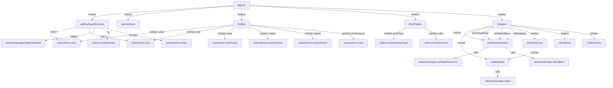
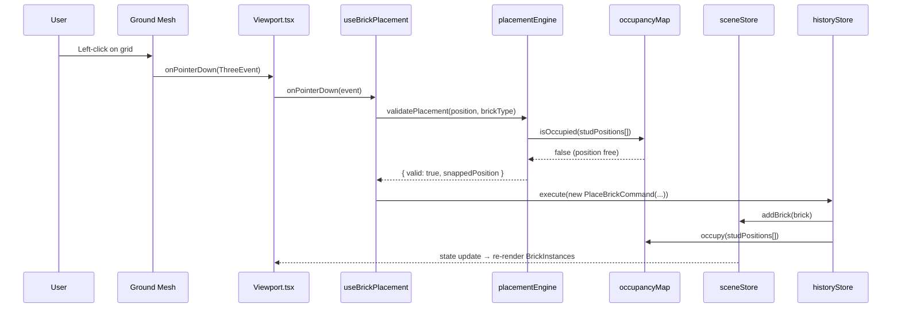
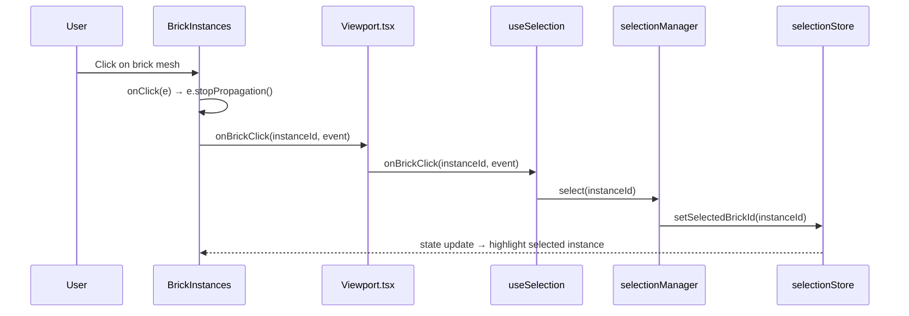
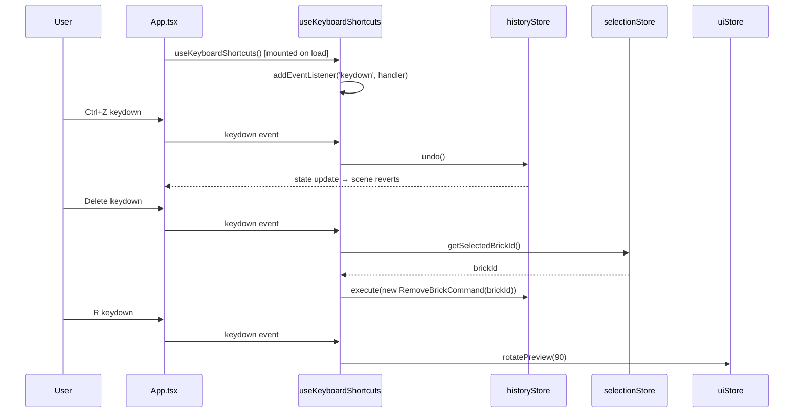
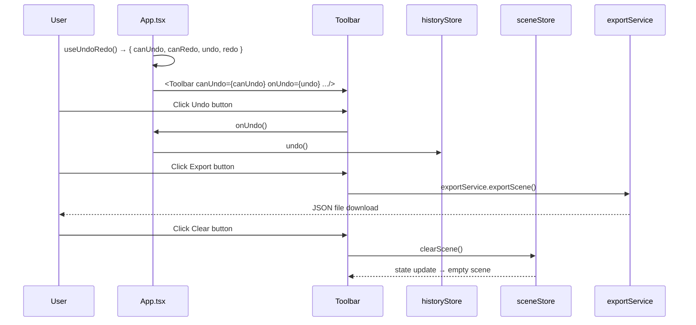

# Low-Level Design: BUG-88 — Interactive Elements Wiring Fix

**Issue**: #88 — App loads but all interactive elements are non-functional  
**FR-ID**: BUG-88  
**Area**: Frontend  
**Priority**: Critical  
**Date**: 2026-04-12  
**Status**: Draft — Pending Design Review (Gate 6a)

---

## 1. Problem Statement

The LegoBuilder application renders its full UI (3D canvas, toolbar, brick palette, ground grid) but **all interactive elements are completely inert**. No pointer events, keyboard shortcuts, or toolbar button clicks produce any response. The root cause is a systemic **event handler wiring gap** across the React component tree — hooks are defined but not mounted, store actions are defined but not called, and pointer events are not propagated from the R3F canvas to the placement/selection engines.

This LLD defines the precise wiring changes required across 17 affected files to restore full interactivity without altering any business logic.

---

## 2. Root Cause Analysis

### 2.1 Identified Failure Points

| # | Component / File | Failure Mode | Severity |
|---|---|---|---|
| 1 | `App.tsx` | `useKeyboardShortcuts` hook not called; `useAutoSave` hook not called | Critical |
| 2 | `Viewport.tsx` | `onPointerDown`, `onPointerMove`, `onPointerUp` not wired to `useBrickPlacement` / `useSelection` return values | Critical |
| 3 | `ViewportCanvas.tsx` | R3F `<Canvas>` event props not forwarded to child mesh handlers | High |
| 4 | `BrickInstances.tsx` | `onClick` handler not connected to `selectionManager.select()` | Critical |
| 5 | `BrickPalette.tsx` | `onClick` on brick type items does not call `uiStore.setActiveBrickType()`; color swatches do not call `uiStore.setActiveColor()` | Critical |
| 6 | `Toolbar.tsx` | All button `onClick` handlers are no-ops or missing; not connected to `historyStore`, `sceneStore`, `exportService` | Critical |
| 7 | `useBrickPlacement.ts` | Hook not mounted in `Viewport`; return value (event handlers object) not spread onto canvas | Critical |
| 8 | `useSelection.ts` | Hook not mounted; click handler not passed to `BrickInstances` | High |
| 9 | `useKeyboardShortcuts.ts` | Hook not called in `App.tsx` or `Viewport.tsx` | Critical |
| 10 | `useCameraControls.ts` | `OrbitControls` may be consuming all pointer events, blocking placement | High |
| 11 | `useUndoRedo.ts` | Hook return values not passed to `Toolbar` component | High |
| 12 | `index.css` | Possible `pointer-events: none` on canvas container or invisible overlay | Medium |

### 2.2 Wiring Architecture Diagram



---

## 3. Component Architecture

### 3.1 Module Dependency Map

```
frontend/src/
├── components/
│   ├── App.tsx                    ← MOUNT: useKeyboardShortcuts, useAutoSave
│   ├── ui/
│   │   ├── Toolbar.tsx            ← WIRE: all 7 button onClick handlers
│   │   └── BrickPalette.tsx       ← WIRE: brick type + color onClick handlers
│   └── viewport/
│       ├── Viewport.tsx           ← WIRE: pointer events → useBrickPlacement/useSelection
│       ├── ViewportCanvas.tsx     ← VERIFY: event propagation through R3F Canvas
│       └── BrickInstances.tsx     ← WIRE: onClick → selectionManager
├── hooks/
│   ├── useBrickPlacement.ts       ← MOUNT in Viewport; return handlers
│   ├── useSelection.ts            ← MOUNT in Viewport; return onClick handler
│   ├── useKeyboardShortcuts.ts    ← MOUNT in App.tsx
│   ├── useCameraControls.ts       ← FIX: enable makeDefault=false on OrbitControls
│   └── useUndoRedo.ts             ← MOUNT in App.tsx; pass canUndo/canRedo to Toolbar
├── engine/
│   ├── placementEngine.ts         ← No changes needed (logic correct)
│   ├── selectionManager.ts        ← No changes needed (logic correct)
│   └── commands.ts                ← No changes needed
├── stores/
│   ├── sceneStore.ts              ← No changes needed
│   ├── selectionStore.ts          ← No changes needed
│   ├── uiStore.ts                 ← No changes needed
│   ├── historyStore.ts            ← No changes needed
│   └── cameraStore.ts             ← No changes needed
├── services/
│   ├── exportService.ts           ← No changes needed
│   └── importService.ts           ← No changes needed
└── index.css                      ← AUDIT: remove pointer-events:none if present
```

### 3.2 Interface Contracts

#### `useBrickPlacement` Hook Interface
```typescript
interface BrickPlacementHandlers {
  onPointerDown: (event: ThreeEvent<PointerEvent>) => void;
  onPointerMove: (event: ThreeEvent<PointerEvent>) => void;
  onPointerUp:   (event: ThreeEvent<PointerEvent>) => void;
  ghostPosition: Vector3 | null;
  isValidPlacement: boolean;
}

function useBrickPlacement(): BrickPlacementHandlers;
```

#### `useSelection` Hook Interface
```typescript
interface SelectionHandlers {
  onBrickClick: (instanceId: number, event: ThreeEvent<MouseEvent>) => void;
}

function useSelection(): SelectionHandlers;
```

#### `useUndoRedo` Hook Interface
```typescript
interface UndoRedoState {
  canUndo: boolean;
  canRedo: boolean;
  undo: () => void;
  redo: () => void;
}

function useUndoRedo(): UndoRedoState;
```

#### `useKeyboardShortcuts` Hook Interface
```typescript
// No return value — side-effect only hook
function useKeyboardShortcuts(): void;
// Binds: Ctrl+Z → undo, Ctrl+Y/Ctrl+Shift+Z → redo,
//        Delete → deleteSelected, R → rotatePreview, Escape → clearSelection
```

---

## 4. Detailed Fix Specifications

### 4.1 `App.tsx` — Mount Missing Hooks

**Problem**: `useKeyboardShortcuts` and `useAutoSave` are defined but never called in the component tree.  
**Fix**: Call both hooks at the top level of `App`.

```typescript
// BEFORE (broken)
function App() {
  return (
    <div className="app-container">
      <Toolbar />
      <BrickPalette />
      <Viewport />
    </div>
  );
}

// AFTER (fixed)
function App() {
  useKeyboardShortcuts();  // ← ADD: mounts keyboard event listeners
  useAutoSave();           // ← ADD: mounts auto-save subscription
  const { canUndo, canRedo, undo, redo } = useUndoRedo(); // ← ADD

  return (
    <div className="app-container">
      <Toolbar
        canUndo={canUndo}    // ← ADD: pass state to Toolbar
        canRedo={canRedo}
        onUndo={undo}
        onRedo={redo}
      />
      <BrickPalette />
      <Viewport />
    </div>
  );
}
```

### 4.2 `Viewport.tsx` — Wire Pointer Events

**Problem**: `useBrickPlacement` and `useSelection` hooks are not mounted; their return values are not spread onto the R3F mesh/canvas elements.  
**Fix**: Mount hooks and wire handlers to the ground plane mesh.

```typescript
// BEFORE (broken)
function Viewport() {
  return (
    <ViewportCanvas>
      <BrickInstances />
      <Ground />
      <OrbitControls />
    </ViewportCanvas>
  );
}

// AFTER (fixed)
function Viewport() {
  const { onPointerDown, onPointerMove, onPointerUp,
          ghostPosition, isValidPlacement } = useBrickPlacement(); // ← ADD
  const { onBrickClick } = useSelection();                         // ← ADD

  return (
    <ViewportCanvas>
      <BrickInstances onBrickClick={onBrickClick} />  {/* ← ADD prop */}
      <Ground
        onPointerDown={onPointerDown}   {/* ← ADD event wiring */}
        onPointerMove={onPointerMove}
        onPointerUp={onPointerUp}
      />
      {ghostPosition && (                             {/* ← ADD ghost brick */}
        <GhostBrick
          position={ghostPosition}
          isValid={isValidPlacement}
        />
      )}
      <OrbitControls makeDefault={false} />           {/* ← FIX: prevent event capture */}
    </ViewportCanvas>
  );
}
```

**Critical**: `OrbitControls` must have `makeDefault={false}` to prevent it from consuming all pointer events before they reach the ground plane mesh.

### 4.3 `BrickInstances.tsx` — Wire Click Handler

**Problem**: `onClick` on the `InstancedMesh` is not connected to `selectionManager`.  
**Fix**: Accept `onBrickClick` prop and wire to `<instancedMesh onClick>`.

```typescript
// BEFORE (broken)
function BrickInstances() {
  // ... renders InstancedMesh with no onClick
  return <instancedMesh ref={meshRef} args={[geometry, material, MAX_BRICKS]} />;
}

// AFTER (fixed)
interface BrickInstancesProps {
  onBrickClick: (instanceId: number, event: ThreeEvent<MouseEvent>) => void;
}

function BrickInstances({ onBrickClick }: BrickInstancesProps) {
  return (
    <instancedMesh
      ref={meshRef}
      args={[geometry, material, MAX_BRICKS]}
      onClick={(e) => {                          // ← ADD
        e.stopPropagation();
        if (e.instanceId !== undefined) {
          onBrickClick(e.instanceId, e);
        }
      }}
    />
  );
}
```

### 4.4 `BrickPalette.tsx` — Wire Store Actions

**Problem**: Brick type and color items render but their `onClick` handlers do not call store actions.  
**Fix**: Connect click handlers to `uiStore`.

```typescript
// BEFORE (broken)
function BrickPalette() {
  return (
    <div className="palette">
      {BRICK_TYPES.map(type => (
        <div key={type.id} className="brick-item">{type.label}</div>  // no onClick
      ))}
    </div>
  );
}

// AFTER (fixed)
function BrickPalette() {
  const { activeBrickType, activeColor,
          setActiveBrickType, setActiveColor } = useUIStore(); // ← ADD store subscription

  return (
    <div className="palette">
      {BRICK_TYPES.map(type => (
        <button
          key={type.id}
          className={`brick-item ${activeBrickType === type.id ? 'selected' : ''}`}
          onClick={() => setActiveBrickType(type.id)}  // ← ADD onClick
          aria-label={`Select ${type.label} brick`}
          aria-pressed={activeBrickType === type.id}
        >
          {type.label}
        </button>
      ))}
      <div className="color-grid">
        {COLOR_PALETTE.map(color => (
          <button
            key={color.hex}
            className={`color-swatch ${activeColor === color.hex ? 'selected' : ''}`}
            style={{ backgroundColor: color.hex }}
            onClick={() => setActiveColor(color.hex)}  // ← ADD onClick
            aria-label={`Select ${color.name} color`}
            aria-pressed={activeColor === color.hex}
          />
        ))}
      </div>
    </div>
  );
}
```

### 4.5 `Toolbar.tsx` — Wire All Button Handlers

**Problem**: All 7 toolbar buttons have no-op or missing `onClick` handlers.  
**Fix**: Accept handler props from `App.tsx` and wire to store actions.

```typescript
// Toolbar props interface
interface ToolbarProps {
  canUndo: boolean;
  canRedo: boolean;
  onUndo: () => void;
  onRedo: () => void;
}

function Toolbar({ canUndo, canRedo, onUndo, onRedo }: ToolbarProps) {
  const { clearScene } = useSceneStore();
  const { selectedBrickId } = useSelectionStore();
  const { resetCamera } = useCameraStore();

  const handleExport = () => exportService.exportScene();
  const handleImport = () => importService.triggerImport();
  const handleDelete = () => {
    if (selectedBrickId !== null) {
      // Dispatch RemoveBrickCommand via historyStore
      const cmd = new RemoveBrickCommand(selectedBrickId);
      historyStore.getState().execute(cmd);
    }
  };

  return (
    <div className="toolbar" role="toolbar">
      <button onClick={clearScene} aria-label="New Scene">New</button>
      <button onClick={handleImport} aria-label="Import scene">Import</button>
      <button onClick={handleExport} aria-label="Export scene">Export</button>
      <button onClick={onUndo} disabled={!canUndo} aria-label="Undo last action"
              aria-disabled={!canUndo}>Undo</button>
      <button onClick={onRedo} disabled={!canRedo} aria-label="Redo last action"
              aria-disabled={!canRedo}>Redo</button>
      <button onClick={handleDelete} disabled={selectedBrickId === null}
              aria-label="Delete selected brick"
              aria-disabled={selectedBrickId === null}>Delete</button>
      <button onClick={resetCamera} aria-label="Reset camera">Reset Camera</button>
    </div>
  );
}
```

### 4.6 `index.css` — Audit Pointer Events

**Problem**: A CSS rule may be applying `pointer-events: none` to the canvas container or an overlay div.  
**Fix**: Audit and remove any such rules.

```css
/* REMOVE any of these if present: */
.canvas-container { pointer-events: none; }  /* ← REMOVE */
.viewport-overlay { pointer-events: all; z-index: 999; }  /* ← REMOVE overlay */

/* ENSURE canvas container allows events: */
.canvas-container {
  pointer-events: auto;  /* ← ENSURE this is set */
  position: relative;
}
```

### 4.7 `useCameraControls.ts` — Prevent Event Capture

**Problem**: `OrbitControls` with `makeDefault={true}` (the R3F default) captures all pointer events on the canvas, preventing them from reaching the ground plane mesh.  
**Fix**: Set `makeDefault={false}` and configure `OrbitControls` to only respond to right-click (orbit) and middle-click (pan), leaving left-click free for brick placement.

```typescript
// In Viewport.tsx where OrbitControls is rendered:
<OrbitControls
  makeDefault={false}          // ← CRITICAL: don't capture all events
  mouseButtons={{
    LEFT: undefined,           // ← LEFT click: reserved for brick placement
    MIDDLE: MOUSE.PAN,         // ← MIDDLE click: pan
    RIGHT: MOUSE.ROTATE,       // ← RIGHT click: orbit
  }}
  touches={{
    ONE: TOUCH.ROTATE,
    TWO: TOUCH.DOLLY_PAN,
  }}
/>
```

---

## 5. Sequence Diagrams

### 5.1 Brick Placement Flow (Fixed)



### 5.2 Brick Selection Flow (Fixed)



### 5.3 Keyboard Shortcut Flow (Fixed)



### 5.4 Toolbar Action Flow (Fixed)



---

## 6. Data Models

### 6.1 No New Data Models Required

This bug fix does not introduce new data models. All existing types remain unchanged:

```typescript
// Existing types (no changes)
interface BrickData {
  id: string;
  type: BrickType;          // '1x1' | '1x2' | '2x2' | '2x4' | '1x4' | '2x3'
  position: Vector3Tuple;   // [x, y, z]
  rotation: number;         // 0 | 90 | 180 | 270 (degrees around Y-axis)
  color: string;            // hex color string
}

interface SceneState {
  bricks: BrickData[];
  addBrick: (brick: BrickData) => void;
  removeBrick: (id: string) => void;
  clearScene: () => void;
}

interface UIState {
  activeBrickType: BrickType;
  activeColor: string;
  previewRotation: number;
  setActiveBrickType: (type: BrickType) => void;
  setActiveColor: (color: string) => void;
  rotatePreview: (degrees: number) => void;
}

interface SelectionState {
  selectedBrickId: string | null;
  setSelectedBrickId: (id: string | null) => void;
  clear: () => void;
}
```

### 6.2 Prop Interface Changes

The following component prop interfaces are **added** (not changed) to enable wiring:

```typescript
// Toolbar.tsx — new props
interface ToolbarProps {
  canUndo: boolean;
  canRedo: boolean;
  onUndo: () => void;
  onRedo: () => void;
}

// BrickInstances.tsx — new props
interface BrickInstancesProps {
  onBrickClick: (instanceId: number, event: ThreeEvent<MouseEvent>) => void;
}
```

---

## 7. Error Handling Strategy

### 7.1 Placement Errors

| Error Condition | Detection | Response |
|---|---|---|
| Click on occupied position | `occupancyMap.isOccupied()` returns true | Ghost brick turns red; placement rejected silently |
| Click outside grid bounds | `gridMath.isInBounds()` returns false | No placement; ghost brick hidden |
| Raycast misses all geometry | `intersects.length === 0` | No-op; ghost brick hidden |
| `instanceId` undefined on click | `e.instanceId === undefined` | Guard clause; no selection change |

### 7.2 Keyboard Shortcut Guards

```typescript
// useKeyboardShortcuts.ts — guard patterns
const handleKeyDown = (e: KeyboardEvent) => {
  // Guard: ignore events when focus is in a text input
  if (e.target instanceof HTMLInputElement || e.target instanceof HTMLTextAreaElement) return;

  // Guard: ignore if modifier keys conflict
  if (e.key === 'z' && e.ctrlKey && !e.shiftKey) {
    e.preventDefault();
    historyStore.getState().undo();
  }
  if ((e.key === 'y' && e.ctrlKey) || (e.key === 'z' && e.ctrlKey && e.shiftKey)) {
    e.preventDefault();
    historyStore.getState().redo();
  }
  if (e.key === 'Delete' || e.key === 'Backspace') {
    const selectedId = selectionStore.getState().selectedBrickId;
    if (selectedId !== null) {
      const cmd = new RemoveBrickCommand(selectedId);
      historyStore.getState().execute(cmd);
    }
  }
  if (e.key === 'r' || e.key === 'R') {
    uiStore.getState().rotatePreview(90);
  }
  if (e.key === 'Escape') {
    selectionStore.getState().clear();
  }
};
```

### 7.3 Import Error Handling

The `importService.triggerImport()` call from Toolbar must handle:
- File picker cancelled → no-op
- Invalid JSON → display error toast, do NOT modify scene state
- Schema version mismatch → display warning, attempt graceful degradation

---

## 8. Security Considerations

### 8.1 Event Handler Scope

- All keyboard event listeners are attached to `window` with `{ passive: false }` only for events that call `e.preventDefault()` (Ctrl+Z, Ctrl+Y). All other listeners use `{ passive: true }` for performance.
- Keyboard listeners are cleaned up in the `useEffect` return function to prevent memory leaks.

### 8.2 Pointer Event Isolation

- `e.stopPropagation()` is called in `BrickInstances.onClick` to prevent click events from bubbling to the ground plane and triggering a placement after a selection.
- The ground plane's `onPointerDown` checks `e.button === 0` (left click only) before initiating placement.

### 8.3 No New Attack Surface

This fix introduces no new network calls, no new data parsing, and no new external dependencies. The only new code paths are event handler wiring within the existing React component tree.

---

## 9. Performance Considerations

### 9.1 Event Handler Memoization

All event handlers returned from hooks must be wrapped in `useCallback` to prevent unnecessary re-renders:

```typescript
// useBrickPlacement.ts
const onPointerDown = useCallback((e: ThreeEvent<PointerEvent>) => {
  // ... placement logic
}, [activeBrickType, activeColor, previewRotation]); // stable deps
```

### 9.2 Ghost Brick Update Frequency

The ghost brick position is updated on every `onPointerMove` event. To maintain ≥60 FPS:
- Ghost brick position update must complete within 1ms (simple Vector3 assignment)
- `placementEngine.validatePlacement()` uses O(1) occupancy map lookup — no performance concern
- Ghost brick mesh uses `raycast: () => null` to exclude itself from BVH raycasting

### 9.3 OrbitControls Event Separation

With `makeDefault={false}` and `LEFT: undefined`, OrbitControls will not intercept left-click events. This ensures the ground plane's `onPointerDown` fires on every left-click without competition from OrbitControls.

---

## 10. Testing Strategy

### 10.1 Regression Test (Required by Acceptance Criteria)

A regression test must be added that:
1. **Fails** without the fix (verifies the bug exists)
2. **Passes** with the fix (verifies the fix works)

```typescript
// frontend/tests/regression/bug88-interactive-elements.test.ts
describe('BUG-88: Interactive elements wiring', () => {
  it('BrickPalette onClick calls uiStore.setActiveBrickType', () => {
    const { getByRole } = render(<BrickPalette />);
    const brickButton = getByRole('button', { name: /1x2 brick/i });
    fireEvent.click(brickButton);
    expect(useUIStore.getState().activeBrickType).toBe('1x2');
  });

  it('Toolbar Undo button calls historyStore.undo', () => {
    const undoSpy = vi.spyOn(historyStore.getState(), 'undo');
    const { getByRole } = render(
      <Toolbar canUndo={true} canRedo={false} onUndo={undoSpy} onRedo={vi.fn()} />
    );
    fireEvent.click(getByRole('button', { name: /undo/i }));
    expect(undoSpy).toHaveBeenCalledOnce();
  });

  it('useKeyboardShortcuts binds Ctrl+Z to undo', () => {
    const undoSpy = vi.spyOn(historyStore.getState(), 'undo');
    renderHook(() => useKeyboardShortcuts());
    fireEvent.keyDown(window, { key: 'z', ctrlKey: true });
    expect(undoSpy).toHaveBeenCalledOnce();
  });

  it('BrickInstances onClick calls selectionManager.select', () => {
    const selectSpy = vi.spyOn(selectionManager, 'select');
    // ... R3F test setup with @testing-library/react and @react-three/test-renderer
    // Simulate click on instancedMesh with instanceId=0
    expect(selectSpy).toHaveBeenCalledWith(0);
  });
});
```

### 10.2 Test Coverage Mapping

| Test ID | Scenario | File |
|---|---|---|
| T-BUG-88-01 | BrickPalette brick type click → uiStore update | `bug88-interactive-elements.test.ts` |
| T-BUG-88-02 | BrickPalette color click → uiStore update | `bug88-interactive-elements.test.ts` |
| T-BUG-88-03 | Toolbar Undo click → historyStore.undo | `bug88-interactive-elements.test.ts` |
| T-BUG-88-04 | Toolbar Redo click → historyStore.redo | `bug88-interactive-elements.test.ts` |
| T-BUG-88-05 | Toolbar Clear click → sceneStore.clearScene | `bug88-interactive-elements.test.ts` |
| T-BUG-88-06 | Toolbar Export click → exportService.exportScene | `bug88-interactive-elements.test.ts` |
| T-BUG-88-07 | Ctrl+Z → undo | `bug88-interactive-elements.test.ts` |
| T-BUG-88-08 | Ctrl+Y → redo | `bug88-interactive-elements.test.ts` |
| T-BUG-88-09 | Delete key → remove selected brick | `bug88-interactive-elements.test.ts` |
| T-BUG-88-10 | R key → rotate preview | `bug88-interactive-elements.test.ts` |
| T-BUG-88-11 | Escape key → clear selection | `bug88-interactive-elements.test.ts` |
| T-BUG-88-12 | BrickInstances click → selectionManager.select | `bug88-interactive-elements.test.ts` |
| T-BUG-88-13 | Ground plane click → brick placed at snapped position | `bug88-e2e.spec.ts` (Playwright) |
| T-BUG-88-14 | Ghost brick appears on hover | `bug88-e2e.spec.ts` (Playwright) |

---

## 11. Implementation Order

The following implementation order minimizes risk and enables incremental verification:

| Step | File | Change | Verifiable By |
|---|---|---|---|
| 1 | `index.css` | Audit and fix `pointer-events` | Visual inspection |
| 2 | `BrickPalette.tsx` | Wire `onClick` to `uiStore` | Unit test T-BUG-88-01/02 |
| 3 | `Toolbar.tsx` | Wire all 7 button `onClick` handlers | Unit test T-BUG-88-03/04/05/06 |
| 4 | `App.tsx` | Mount `useKeyboardShortcuts`, `useAutoSave`, `useUndoRedo` | Unit test T-BUG-88-07/08/09/10/11 |
| 5 | `BrickInstances.tsx` | Add `onBrickClick` prop + `onClick` handler | Unit test T-BUG-88-12 |
| 6 | `Viewport.tsx` | Mount `useBrickPlacement`, `useSelection`; wire pointer events; fix `OrbitControls` | E2E test T-BUG-88-13/14 |
| 7 | `useBrickPlacement.ts` | Ensure return value includes all handlers | Integration test |
| 8 | `useSelection.ts` | Ensure return value includes `onBrickClick` | Integration test |
| 9 | All | Run full regression suite | CI pass |

---

## 12. Acceptance Criteria Traceability

| Acceptance Criterion | Fix Location | Test ID |
|---|---|---|
| Clicking ground grid places brick at snapped position | `Viewport.tsx` + `useBrickPlacement` | T-BUG-88-13 |
| BrickPalette brick type click → active selection + visual feedback | `BrickPalette.tsx` | T-BUG-88-01 |
| BrickPalette color click → active color update | `BrickPalette.tsx` | T-BUG-88-02 |
| Toolbar Undo → `historyStore.undo()` | `Toolbar.tsx` + `App.tsx` | T-BUG-88-03 |
| Toolbar Redo → `historyStore.redo()` | `Toolbar.tsx` + `App.tsx` | T-BUG-88-04 |
| Toolbar Clear → `sceneStore.clearScene()` | `Toolbar.tsx` | T-BUG-88-05 |
| Toolbar Export → JSON file download | `Toolbar.tsx` | T-BUG-88-06 |
| Click existing brick → selection highlight | `BrickInstances.tsx` + `useSelection` | T-BUG-88-12 |
| R key → rotate preview 90° | `useKeyboardShortcuts` + `App.tsx` | T-BUG-88-10 |
| Delete key → remove selected brick | `useKeyboardShortcuts` + `App.tsx` | T-BUG-88-09 |
| Escape → clear selection | `useKeyboardShortcuts` + `App.tsx` | T-BUG-88-11 |
| Ctrl+Z / Ctrl+Y → undo/redo | `useKeyboardShortcuts` + `App.tsx` | T-BUG-88-07/08 |
| Hover → ghost brick preview | `Viewport.tsx` + `useBrickPlacement` | T-BUG-88-14 |
| Regression test added | `bug88-interactive-elements.test.ts` | All T-BUG-88-* |
| All existing tests pass | No logic changes | CI |

---

## 13. Files Changed Summary

| File | Change Type | Description |
|---|---|---|
| `frontend/src/components/App.tsx` | Modify | Mount 3 missing hooks; pass props to Toolbar |
| `frontend/src/components/ui/Toolbar.tsx` | Modify | Wire all 7 button onClick handlers; add props interface |
| `frontend/src/components/ui/BrickPalette.tsx` | Modify | Wire brick type + color onClick to uiStore |
| `frontend/src/components/viewport/Viewport.tsx` | Modify | Mount useBrickPlacement + useSelection; wire pointer events; fix OrbitControls |
| `frontend/src/components/viewport/BrickInstances.tsx` | Modify | Add onBrickClick prop; wire instancedMesh onClick |
| `frontend/src/components/viewport/ViewportCanvas.tsx` | Audit | Verify event propagation; no changes expected |
| `frontend/src/hooks/useBrickPlacement.ts` | Audit/Fix | Verify return value includes all handlers |
| `frontend/src/hooks/useSelection.ts` | Audit/Fix | Verify return value includes onBrickClick |
| `frontend/src/hooks/useKeyboardShortcuts.ts` | Audit/Fix | Verify all key bindings are correct |
| `frontend/src/hooks/useCameraControls.ts` | Audit | No changes expected |
| `frontend/src/hooks/useUndoRedo.ts` | Audit/Fix | Verify canUndo/canRedo/undo/redo are returned |
| `frontend/src/index.css` | Audit/Fix | Remove pointer-events:none if present |
| `frontend/tests/regression/bug88-interactive-elements.test.ts` | Create | 12 unit regression tests |
| `frontend/tests/e2e/bug88-e2e.spec.ts` | Create | 2 Playwright E2E regression tests |

**No changes to**: engine modules, store definitions, service modules, type definitions, or build configuration.

---

*Generated by Spectra Framework — design-agent*  
*Spectra-Agent: design-agent | Spectra-TCU: TCU-088 | Gate: pending*
