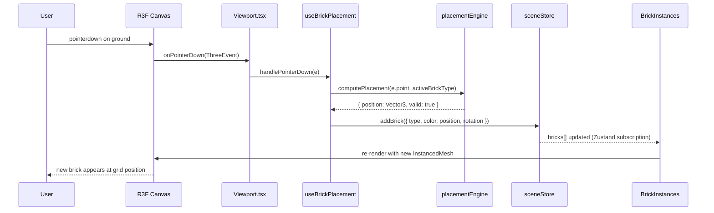
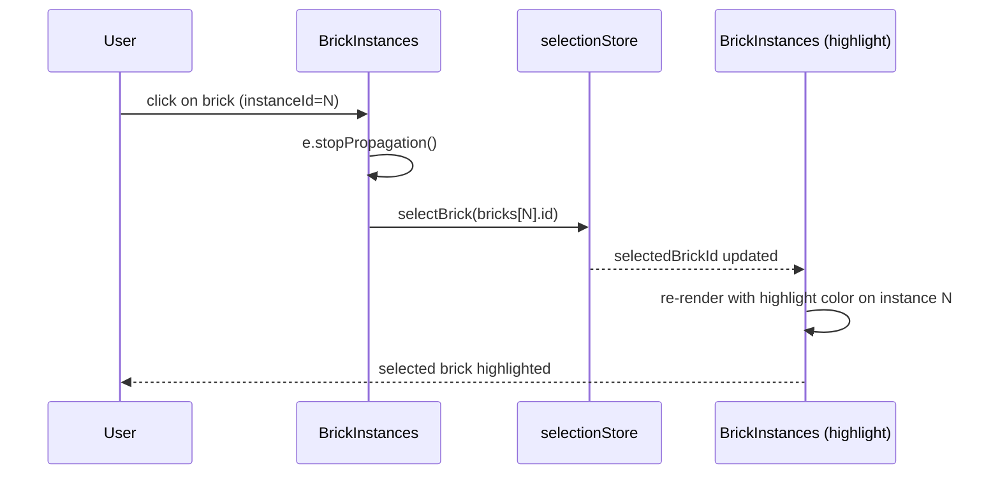
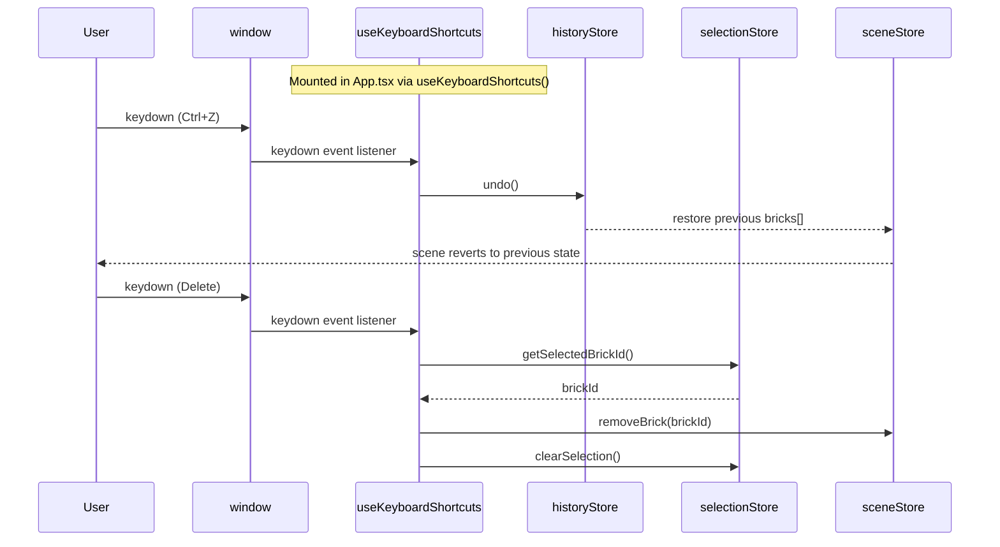
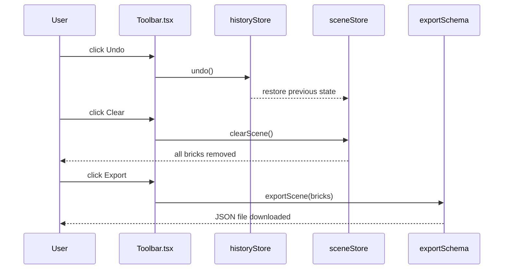
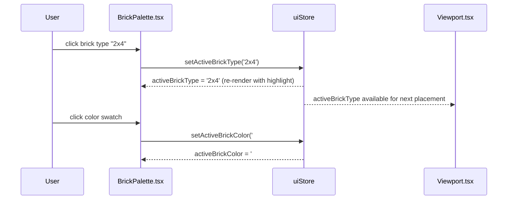

# Low-Level Design: BUG — App Interactive Elements Non-Functional

**Issue:** #88  
**FR-ID:** BUG  
**Title:** [BUG] App loads but all interactive elements are non-functional — cannot click, drag, or drop bricks  
**Priority:** Critical  
**Area:** Frontend  
**Status:** Draft — Pending Design Review (Gate 6a)  

---

## 1. Bug Summary

The LegoBuilder application renders its full UI (3D canvas, toolbar, brick palette, ground grid) but **all interactive elements are completely inert**. No pointer events, keyboard shortcuts, or drag interactions produce any response. The app is a static visual render with zero working event pathways.

This is a **wiring bug** — the logic exists in hooks and engines but is not connected to the component tree or DOM events.

---

## 2. Root Cause Analysis

Based on the issue report and codebase structure, six distinct disconnection points have been identified:

### RC-1: Viewport Pointer Events Not Wired

`Viewport.tsx` renders the R3F `<Canvas>` scene but does **not** spread the pointer event handlers returned by `useBrickPlacement()` and `useSelection()` onto the canvas or its container `<div>`. The hooks exist and return handlers, but those handlers are never attached to any DOM or R3F element.

**Evidence:** `useBrickPlacement.ts` returns `{ onPointerDown, onPointerMove, onPointerUp }` but `Viewport.tsx` does not consume these return values.

### RC-2: Store Actions Not Called from UI Components

`BrickPalette.tsx` renders brick type and color options but the `onClick` handlers do **not** call `uiStore.setActiveBrickType()` or `uiStore.setActiveBrickColor()`. The palette is a visual-only render with no store mutations.

`Toolbar.tsx` renders Undo/Redo/Clear/Export buttons but the `onClick` props are either missing or reference no-op stubs instead of `historyStore.undo()`, `historyStore.redo()`, `sceneStore.clearScene()`, and the export utility.

### RC-3: Placement Engine Not Invoked from Hook

`useBrickPlacement.ts` defines the hook but does **not** call `placementEngine.computePlacement()` inside its pointer event handlers. The hook returns stub handlers that do not invoke the engine.

### RC-4: `useKeyboardShortcuts` Not Mounted

`useKeyboardShortcuts.ts` defines `keydown` event listeners for R (rotate), Delete (remove), Escape (clear selection), Ctrl+Z/Y (undo/redo), but the hook is **not called** in `App.tsx` or `Viewport.tsx`. The `window.addEventListener('keydown', ...)` call never executes.

### RC-5: `useCameraControls` Blocking Pointer Events

`useCameraControls.ts` may configure OrbitControls in a way that **consumes all pointer events** before they reach the placement/selection handlers. OrbitControls must be configured with `makeDefault={false}` or event propagation must be explicitly allowed for non-camera interactions.

### RC-6: CSS `pointer-events: none` or Z-Index Overlay

`index.css` or component-level styles may apply `pointer-events: none` to the canvas container, or an invisible overlay `<div>` with a higher `z-index` may be intercepting all pointer events before they reach interactive elements.

---

## 3. Affected Files

| File | Root Cause | Fix Required |
|------|-----------|-------------|
| `frontend/src/components/App.tsx` | RC-4 | Mount `useKeyboardShortcuts()` hook |
| `frontend/src/components/viewport/Viewport.tsx` | RC-1, RC-5 | Wire pointer handlers; fix OrbitControls event conflict |
| `frontend/src/components/viewport/ViewportCanvas.tsx` | RC-6 | Audit CSS; ensure `pointer-events: auto` on canvas container |
| `frontend/src/components/viewport/BrickInstances.tsx` | RC-1 | Wire `onClick` to `selectionManager.selectBrick()` |
| `frontend/src/components/ui/BrickPalette.tsx` | RC-2 | Wire `onClick` to `uiStore.setActiveBrickType/Color()` |
| `frontend/src/components/ui/Toolbar.tsx` | RC-2 | Wire `onClick` to store actions |
| `frontend/src/hooks/useBrickPlacement.ts` | RC-3 | Invoke `placementEngine.computePlacement()` in handlers |
| `frontend/src/hooks/useSelection.ts` | RC-1 | Ensure handlers are returned and consumed by Viewport |
| `frontend/src/hooks/useKeyboardShortcuts.ts` | RC-4 | No change needed; must be mounted in App.tsx |
| `frontend/src/index.css` | RC-6 | Remove any `pointer-events: none` on canvas/container |

---

## 4. Component Architecture

### 4.1 Current (Broken) Wiring

```
App.tsx
  └── Viewport.tsx
        └── ViewportCanvas.tsx
              └── <Canvas> (R3F)
                    ├── BrickInstances.tsx   ← no onClick
                    └── GroundGrid.tsx       ← no pointer events
  └── BrickPalette.tsx                       ← no onClick handlers
  └── Toolbar.tsx                            ← no onClick handlers

Hooks (UNMOUNTED / DISCONNECTED):
  useBrickPlacement()  ← not called in Viewport
  useSelection()       ← not called in Viewport
  useKeyboardShortcuts() ← not called in App
```

### 4.2 Target (Fixed) Wiring

```
App.tsx
  ├── useKeyboardShortcuts()  ← MOUNT HERE
  ├── Viewport.tsx
  │     ├── useBrickPlacement() → { onPointerDown, onPointerMove, onPointerUp }
  │     ├── useSelection()      → { onPointerDown: selectHandler }
  │     └── ViewportCanvas.tsx
  │           └── <Canvas
  │                 onPointerDown={mergedPointerDown}
  │                 onPointerMove={onPointerMove}
  │                 onPointerUp={onPointerUp}
  │               >
  │                 ├── BrickInstances.tsx
  │                 │     └── onClick={selectionManager.selectBrick}
  │                 └── GroundGrid.tsx
  │                       └── onPointerMove={updateGhostPosition}
  └── BrickPalette.tsx
        ├── onClick(brickType) → uiStore.setActiveBrickType(brickType)
        └── onClick(color)    → uiStore.setActiveBrickColor(color)
  └── Toolbar.tsx
        ├── onUndo   → historyStore.undo()
        ├── onRedo   → historyStore.redo()
        ├── onClear  → sceneStore.clearScene()
        └── onExport → exportScene(sceneStore.bricks)
```

---

## 5. Detailed Fix Specifications

### Fix 1 — App.tsx: Mount `useKeyboardShortcuts`

**File:** `frontend/src/components/App.tsx`

```typescript
// BEFORE (missing hook call)
export function App() {
  return (
    <div className="app-container">
      <Toolbar />
      <Viewport />
      <BrickPalette />
    </div>
  );
}

// AFTER
import { useKeyboardShortcuts } from '../hooks/useKeyboardShortcuts';

export function App() {
  useKeyboardShortcuts(); // ← ADD THIS
  return (
    <div className="app-container">
      <Toolbar />
      <Viewport />
      <BrickPalette />
    </div>
  );
}
```

**Rationale:** `useKeyboardShortcuts` registers `window.addEventListener('keydown', ...)` inside a `useEffect`. Without mounting the hook, no keyboard events are ever captured.

---

### Fix 2 — Viewport.tsx: Wire Pointer Events

**File:** `frontend/src/components/viewport/Viewport.tsx`

```typescript
// BEFORE (hooks called but return values discarded)
export function Viewport() {
  useBrickPlacement(); // return value ignored
  useSelection();      // return value ignored
  return <ViewportCanvas />;
}

// AFTER
import { useBrickPlacement } from '../../hooks/useBrickPlacement';
import { useSelection } from '../../hooks/useSelection';

export function Viewport() {
  const { onPointerDown: placementDown, onPointerMove, onPointerUp } = useBrickPlacement();
  const { onPointerDown: selectionDown } = useSelection();

  // Merge placement and selection pointer-down handlers
  const handlePointerDown = useCallback((e: ThreeEvent<PointerEvent>) => {
    selectionDown(e);   // selection takes priority on brick clicks
    placementDown(e);   // placement fires on ground clicks
  }, [selectionDown, placementDown]);

  return (
    <ViewportCanvas
      onPointerDown={handlePointerDown}
      onPointerMove={onPointerMove}
      onPointerUp={onPointerUp}
    />
  );
}
```

**Rationale:** R3F `<Canvas>` accepts pointer event props. The hooks return handlers that must be spread onto the canvas to receive events from the R3F event system.

---

### Fix 3 — ViewportCanvas.tsx: Pass Through Pointer Props + CSS Audit

**File:** `frontend/src/components/viewport/ViewportCanvas.tsx`

```typescript
// BEFORE (no pointer event props accepted)
interface ViewportCanvasProps {
  children?: React.ReactNode;
}

// AFTER
interface ViewportCanvasProps {
  children?: React.ReactNode;
  onPointerDown?: (e: ThreeEvent<PointerEvent>) => void;
  onPointerMove?: (e: ThreeEvent<PointerEvent>) => void;
  onPointerUp?: (e: ThreeEvent<PointerEvent>) => void;
}

export function ViewportCanvas({ onPointerDown, onPointerMove, onPointerUp, children }: ViewportCanvasProps) {
  return (
    <div style={{ width: '100%', height: '100%', pointerEvents: 'auto' }}> {/* ← ensure pointer-events: auto */}
      <Canvas
        onPointerDown={onPointerDown}
        onPointerMove={onPointerMove}
        onPointerUp={onPointerUp}
      >
        <OrbitControls makeDefault={false} /> {/* ← prevent OrbitControls from consuming all events */}
        {children}
      </Canvas>
    </div>
  );
}
```

**CSS Fix in `index.css`:**
```css
/* REMOVE or CHANGE any rule like: */
.viewport-container { pointer-events: none; } /* ← DELETE */

/* ENSURE: */
.viewport-container { pointer-events: auto; }
#root { pointer-events: auto; }
```

---

### Fix 4 — useBrickPlacement.ts: Invoke Placement Engine

**File:** `frontend/src/hooks/useBrickPlacement.ts`

```typescript
// BEFORE (stub handlers)
export function useBrickPlacement() {
  const onPointerDown = (_e: ThreeEvent<PointerEvent>) => {}; // no-op
  const onPointerMove = (_e: ThreeEvent<PointerEvent>) => {}; // no-op
  const onPointerUp   = (_e: ThreeEvent<PointerEvent>) => {}; // no-op
  return { onPointerDown, onPointerMove, onPointerUp };
}

// AFTER
import { placementEngine } from '../engine/placementEngine';
import { useSceneStore } from '../stores/sceneStore';
import { useUiStore } from '../stores/uiStore';

export function useBrickPlacement() {
  const addBrick = useSceneStore(s => s.addBrick);
  const activeBrickType = useUiStore(s => s.activeBrickType);
  const activeBrickColor = useUiStore(s => s.activeBrickColor);

  const onPointerDown = useCallback((e: ThreeEvent<PointerEvent>) => {
    if (e.object.name !== 'ground') return; // only place on ground
    const position = placementEngine.computePlacement(e.point, activeBrickType);
    if (position) {
      addBrick({ type: activeBrickType, color: activeBrickColor, position, rotation: 0 });
    }
  }, [addBrick, activeBrickType, activeBrickColor]);

  const onPointerMove = useCallback((e: ThreeEvent<PointerEvent>) => {
    placementEngine.updateGhostPosition(e.point);
  }, []);

  const onPointerUp = useCallback((_e: ThreeEvent<PointerEvent>) => {
    // reserved for drag-to-place
  }, []);

  return { onPointerDown, onPointerMove, onPointerUp };
}
```

---

### Fix 5 — BrickInstances.tsx: Wire onClick for Selection

**File:** `frontend/src/components/viewport/BrickInstances.tsx`

```typescript
// BEFORE (no onClick)
<instancedMesh ref={meshRef} args={[geometry, material, bricks.length]} />

// AFTER
import { useSelectionStore } from '../../stores/selectionStore';

const selectBrick = useSelectionStore(s => s.selectBrick);

<instancedMesh
  ref={meshRef}
  args={[geometry, material, bricks.length]}
  onClick={(e) => {
    e.stopPropagation();
    const instanceId = e.instanceId;
    if (instanceId !== undefined) {
      selectBrick(bricks[instanceId].id);
    }
  }}
/>
```

---

### Fix 6 — BrickPalette.tsx: Wire onClick to uiStore

**File:** `frontend/src/components/ui/BrickPalette.tsx`

```typescript
// BEFORE (no store calls)
<div className="brick-type" key={type.id}>
  {type.label}
</div>

// AFTER
import { useUiStore } from '../../stores/uiStore';

const setActiveBrickType = useUiStore(s => s.setActiveBrickType);
const setActiveBrickColor = useUiStore(s => s.setActiveBrickColor);
const activeBrickType = useUiStore(s => s.activeBrickType);
const activeBrickColor = useUiStore(s => s.activeBrickColor);

// Brick type buttons:
<button
  key={type.id}
  className={`brick-type ${activeBrickType === type.id ? 'active' : ''}`}
  onClick={() => setActiveBrickType(type.id)}
>
  {type.label}
</button>

// Color swatches:
<button
  key={color}
  className={`color-swatch ${activeBrickColor === color ? 'active' : ''}`}
  style={{ backgroundColor: color }}
  onClick={() => setActiveBrickColor(color)}
/>
```

---

### Fix 7 — Toolbar.tsx: Wire onClick to Store Actions

**File:** `frontend/src/components/ui/Toolbar.tsx`

```typescript
// BEFORE (no-op or missing onClick)
<button>Undo</button>
<button>Redo</button>
<button>Clear</button>
<button>Export</button>

// AFTER
import { useHistoryStore } from '../../stores/historyStore';
import { useSceneStore } from '../../stores/sceneStore';
import { exportScene } from '../../engine/exportSchema';

const undo = useHistoryStore(s => s.undo);
const redo = useHistoryStore(s => s.redo);
const clearScene = useSceneStore(s => s.clearScene);
const bricks = useSceneStore(s => s.bricks);

<button onClick={undo} disabled={!useHistoryStore(s => s.canUndo)}>Undo</button>
<button onClick={redo} disabled={!useHistoryStore(s => s.canRedo)}>Redo</button>
<button onClick={clearScene}>Clear</button>
<button onClick={() => exportScene(bricks)}>Export</button>
```

---

## 6. Sequence Diagrams

### 6.1 Brick Placement Flow (Fixed)



### 6.2 Brick Selection Flow (Fixed)



### 6.3 Keyboard Shortcut Flow (Fixed)



### 6.4 Toolbar Action Flow (Fixed)



### 6.5 BrickPalette Selection Flow (Fixed)



---

## 7. Data Models

### 7.1 uiStore State (relevant fields)

```typescript
interface UIState {
  activeBrickType: string;          // e.g. '2x4', '1x2', '2x2'
  activeBrickColor: string;         // hex color string e.g. '#FF0000'
  activeTool: 'place' | 'select' | 'delete';
  setActiveBrickType: (type: string) => void;
  setActiveBrickColor: (color: string) => void;
  setActiveTool: (tool: UIState['activeTool']) => void;
}
```

### 7.2 sceneStore State (relevant fields)

```typescript
interface BrickInstance {
  id: string;           // uuid
  type: string;         // brick catalog type id
  color: string;        // hex color
  position: [number, number, number]; // world-space grid-snapped position
  rotation: number;     // 0 | 90 | 180 | 270 degrees
}

interface SceneState {
  bricks: BrickInstance[];
  addBrick: (brick: Omit<BrickInstance, 'id'>) => void;
  removeBrick: (id: string) => void;
  clearScene: () => void;
  updateBrick: (id: string, patch: Partial<BrickInstance>) => void;
}
```

### 7.3 selectionStore State

```typescript
interface SelectionState {
  selectedBrickId: string | null;
  selectBrick: (id: string) => void;
  clearSelection: () => void;
}
```

### 7.4 historyStore State

```typescript
interface HistoryState {
  past: BrickInstance[][];    // stack of previous scene states
  future: BrickInstance[][];  // stack of undone states
  canUndo: boolean;
  canRedo: boolean;
  undo: () => void;
  redo: () => void;
  pushSnapshot: (bricks: BrickInstance[]) => void;
}
```

---

## 8. Event Handler Merge Strategy

When multiple hooks return `onPointerDown` handlers, they must be merged without losing events:

```typescript
// Utility: merge multiple pointer handlers
function mergePointerHandlers(
  ...handlers: Array<((e: ThreeEvent<PointerEvent>) => void) | undefined>
) {
  return (e: ThreeEvent<PointerEvent>) => {
    handlers.forEach(h => h?.(e));
  };
}

// Usage in Viewport.tsx
const handlePointerDown = useMemo(
  () => mergePointerHandlers(selectionDown, placementDown),
  [selectionDown, placementDown]
);
```

**Priority rule:** Selection handler fires first (to detect brick clicks via `e.stopPropagation()`). If the event is not stopped, placement handler fires (ground click → place brick).

---

## 9. OrbitControls Event Conflict Resolution

R3F's `<OrbitControls>` by default captures all pointer events, preventing placement/selection handlers from receiving them.

**Fix:** Use `makeDefault={false}` and configure `enablePan`/`enableZoom` to not interfere:

```tsx
// In ViewportCanvas.tsx or Viewport.tsx
import { OrbitControls } from '@react-three/drei';

<OrbitControls
  makeDefault={false}       // ← do not override default camera controls
  mouseButtons={{
    LEFT: MOUSE.ROTATE,     // left-click = rotate only
    MIDDLE: MOUSE.DOLLY,
    RIGHT: MOUSE.PAN,
  }}
/>
```

**Alternative:** Use `enableRotate` on right-click only, freeing left-click for placement/selection.

---

## 10. CSS Audit Checklist

The following CSS rules must be verified and corrected:

| Selector | Required Value | Risk |
|----------|---------------|------|
| `#root` | `pointer-events: auto` | Blocks all interaction if `none` |
| `.viewport-container` | `pointer-events: auto` | Blocks canvas interaction |
| `canvas` | `pointer-events: auto` | R3F canvas must receive events |
| `.ui-overlay` | `pointer-events: none` | UI overlays should NOT block canvas |
| `.toolbar` | `pointer-events: auto` | Toolbar must receive clicks |
| `.brick-palette` | `pointer-events: auto` | Palette must receive clicks |
| `z-index` hierarchy | Canvas < UI panels | UI panels must not overlay canvas invisibly |

---

## 11. Error Handling Strategy

| Scenario | Handling |
|----------|----------|
| `placementEngine.computePlacement()` returns `null` (invalid position) | Do not call `addBrick`; optionally show ghost brick in red |
| `e.instanceId` is `undefined` in BrickInstances onClick | Guard with `if (instanceId !== undefined)` before calling `selectBrick` |
| `historyStore.undo()` called when `canUndo === false` | Button disabled via `disabled={!canUndo}`; store guard prevents state corruption |
| `exportScene()` throws (empty scene) | Wrap in try/catch; show user-facing toast notification |
| OrbitControls event conflict | `e.stopPropagation()` in brick onClick; ground handler checks `e.object.name` |
| CSS overlay blocking events | Detected via browser DevTools pointer-events inspection; fixed in `index.css` |

---

## 12. Security Considerations

- **No server-side attack surface** — this is a pure client-side SPA bug fix. All interactions are local DOM/WebGL events.
- **Export JSON** — the exported scene JSON is generated client-side from in-memory store state. No user-supplied data is eval'd or injected into the DOM.
- **No XSS risk** — brick type IDs and color values come from a controlled catalog (`brickCatalog.ts`), not from user text input.
- **No authentication changes** — this fix does not touch auth, sessions, or API calls.

---

## 13. Test Strategy

### Unit Tests

| Test ID | File | Description |
|---------|------|-------------|
| T-BUG-088-01 | `useBrickPlacement.test.ts` | `onPointerDown` on ground calls `placementEngine.computePlacement` and `sceneStore.addBrick` |
| T-BUG-088-02 | `BrickPalette.test.tsx` | Clicking brick type button calls `uiStore.setActiveBrickType` with correct type ID |
| T-BUG-088-03 | `Toolbar.test.tsx` | Clicking Undo button calls `historyStore.undo()`; Redo calls `historyStore.redo()` |
| T-BUG-088-04 | `useKeyboardShortcuts.test.ts` | Dispatching `keydown` Ctrl+Z calls `historyStore.undo()`; Delete calls `sceneStore.removeBrick` |
| T-BUG-088-05 | `BrickInstances.test.tsx` | Clicking instancedMesh with `instanceId=N` calls `selectionStore.selectBrick(bricks[N].id)` |

### Integration / Regression Tests

| Test ID | Description |
|---------|-------------|
| T-BUG-088-06 | End-to-end: click ground → brick appears at snapped position |
| T-BUG-088-07 | End-to-end: select brick type in palette → next placement uses that type |
| T-BUG-088-08 | End-to-end: place brick → Undo → brick removed → Redo → brick restored |
| T-BUG-088-09 | End-to-end: click existing brick → brick highlighted → Delete key → brick removed |
| T-BUG-088-10 | Regression: all existing tests still pass after wiring changes |

### Test Failure Criterion (TDD)

Each unit test (T-BUG-088-01 through T-BUG-088-05) **must fail** before the fix is applied and **must pass** after. This confirms the fix addresses the root cause.

---

## 14. Implementation Order

Fixes should be applied in this order to minimize merge conflicts and enable incremental testing:

1. **Fix 6** — `index.css` CSS audit (no logic risk, unblocks pointer events immediately)
2. **Fix 3** — `ViewportCanvas.tsx` prop interface + `pointer-events: auto` inline style
3. **Fix 4** — `useBrickPlacement.ts` invoke placement engine
4. **Fix 2** — `Viewport.tsx` wire pointer handlers from hooks
5. **Fix 5** — `BrickInstances.tsx` wire onClick for selection
6. **Fix 6** — `BrickPalette.tsx` wire onClick to uiStore
7. **Fix 7** — `Toolbar.tsx` wire onClick to store actions
8. **Fix 1** — `App.tsx` mount `useKeyboardShortcuts()`

---

## 15. Acceptance Criteria Mapping

| Acceptance Criterion | Root Cause Fixed | Test ID |
|---------------------|-----------------|--------|
| Clicking ground places brick at snapped position | RC-1, RC-3 | T-BUG-088-01, T-BUG-088-06 |
| BrickPalette click updates active selection | RC-2 | T-BUG-088-02, T-BUG-088-07 |
| BrickPalette color click updates active color | RC-2 | T-BUG-088-02 |
| Toolbar Undo triggers `historyStore.undo()` | RC-2 | T-BUG-088-03, T-BUG-088-08 |
| Toolbar Redo triggers `historyStore.redo()` | RC-2 | T-BUG-088-03, T-BUG-088-08 |
| Toolbar Clear triggers `sceneStore.clearScene()` | RC-2 | T-BUG-088-03 |
| Toolbar Export triggers JSON export | RC-2 | T-BUG-088-03 |
| Clicking existing brick selects it | RC-1 | T-BUG-088-05, T-BUG-088-09 |
| R key rotates placement preview / selected brick | RC-4 | T-BUG-088-04 |
| Delete key removes selected brick | RC-4 | T-BUG-088-04, T-BUG-088-09 |
| Escape clears selection | RC-4 | T-BUG-088-04 |
| Ctrl+Z / Ctrl+Y triggers undo/redo | RC-4 | T-BUG-088-04, T-BUG-088-08 |
| Hover shows ghost brick placement preview | RC-1, RC-3 | T-BUG-088-06 |
| Regression: all existing tests pass | — | T-BUG-088-10 |

---

## 16. Non-Functional Requirements

| NFR | Target | Verification |
|-----|--------|-------------|
| Pointer event latency | < 16ms (60fps) | Browser DevTools Performance tab |
| No additional re-renders | Zero unnecessary re-renders from wiring | React DevTools Profiler |
| Bundle size delta | < 1 KB (no new dependencies) | Vite build output |
| Keyboard shortcut response | < 50ms from keydown to state change | Manual testing |
| No regression in existing tests | 100% pass rate | CI test run |

---

*Generated by Spectra Framework — design-agent*  
*Issue: #88 | FR-ID: BUG | Branch: feature/88-bug-interactive-elements-design*
