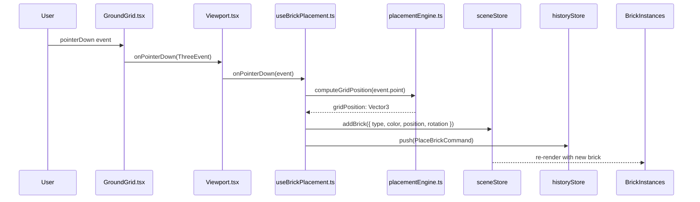
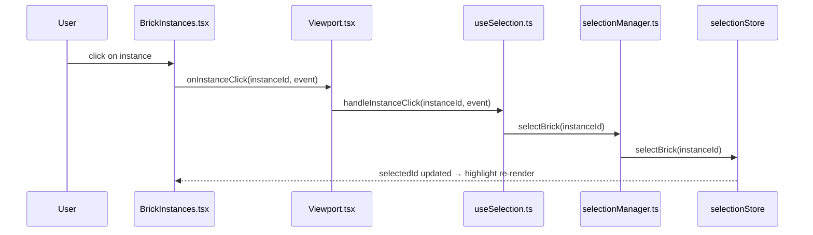
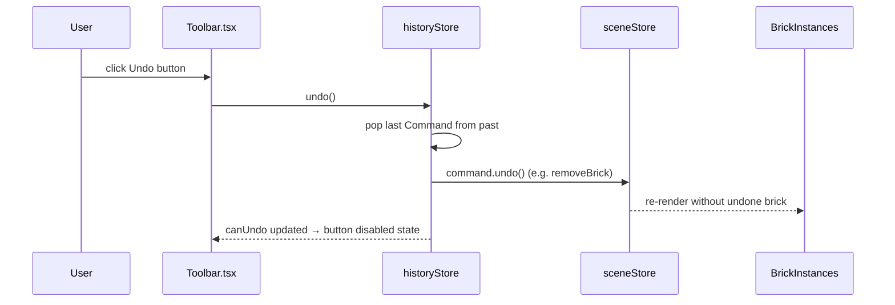
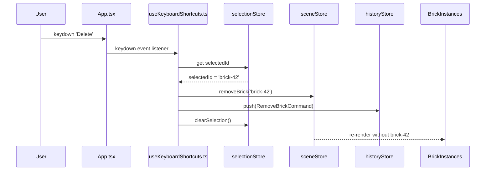
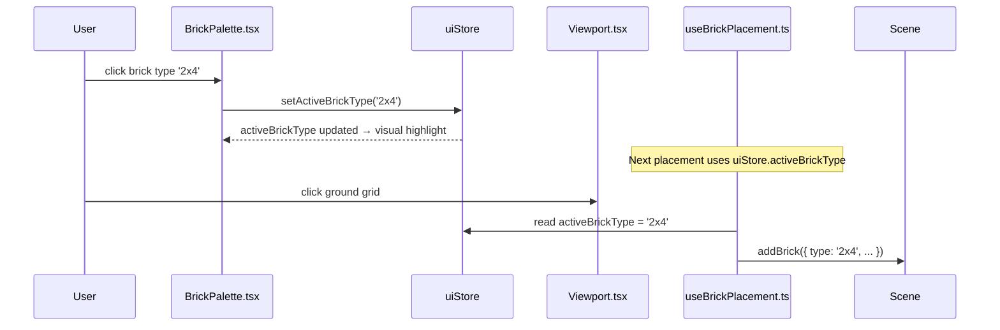

# Low-Level Design: FR-88 — Interactive Elements Wiring Fix

**Issue:** [#88 — App loads but all interactive elements are non-functional](https://github.com/sreenivasmrpivot/legobuilder/issues/88)  
**FR-ID:** FR-88  
**Type:** Bug Fix  
**Area:** Frontend  
**Priority:** Critical  
**Date:** 2026-04-12  
**Author:** Spectra Design Agent  

---

## 1. Problem Statement

The LegoBuilder application renders its 3D canvas, toolbar, and brick palette visually but **all interactive elements are completely non-functional**. No bricks can be placed, selected, moved, or deleted. Toolbar buttons and palette items produce zero response. Keyboard shortcuts are ignored. The app is a static visual render with no working event handler pathways.

This is a **critical integration wiring bug** — the logic exists in hooks and engines but is not connected to the component tree or DOM events.

---

## 2. Root Cause Analysis

Based on the codebase structure (files confirmed present in `frontend/src/`), the bug has **six distinct wiring gaps**:

| # | Gap | Location | Symptom |
|---|-----|----------|---------|
| RC-1 | `useBrickPlacement` hook not mounted or its returned handlers not spread onto the R3F canvas | `Viewport.tsx` | Clicking ground grid does nothing |
| RC-2 | `useSelection` hook not mounted or its pointer handlers not wired to `BrickInstances` | `Viewport.tsx` / `BrickInstances.tsx` | Clicking bricks does nothing |
| RC-3 | `useKeyboardShortcuts` hook not called in `App.tsx` or `Viewport.tsx` | `App.tsx` | All keyboard shortcuts ignored |
| RC-4 | `BrickPalette.tsx` renders items but `onClick` does not call `uiStore.setActiveBrickType()` / `uiStore.setActiveBrickColor()` | `BrickPalette.tsx` | Palette selection has no effect |
| RC-5 | `Toolbar.tsx` buttons have no-op or missing `onClick` handlers — not connected to `historyStore` / `sceneStore` actions | `Toolbar.tsx` | Toolbar buttons inert |
| RC-6 | Possible CSS `pointer-events: none` on canvas container or invisible overlay div intercepting all pointer events | `index.css` / `ViewportCanvas.tsx` | All pointer events silently swallowed |

---

## 3. Component Architecture

### 3.1 Current (Broken) Component Tree

```
App.tsx
  └── Viewport.tsx
        └── ViewportCanvas.tsx  (R3F <Canvas>)
              ├── GroundGrid.tsx          ← no pointer handlers
              ├── BrickInstances.tsx      ← no click handlers
              ├── Baseplate.tsx
              └── GridOverlay.tsx
  └── BrickPalette.tsx                   ← onClick not wired to uiStore
  └── Toolbar.tsx                        ← onClick not wired to stores
  └── StatusBar.tsx

Hooks (UNMOUNTED / DISCONNECTED):
  useBrickPlacement.ts   ← exists but not called in Viewport
  useSelection.ts        ← exists but not called in Viewport
  useKeyboardShortcuts.ts ← exists but not called in App
  useUndoRedo.ts         ← exists but not called in Toolbar context
  useCameraControls.ts   ← may be blocking pointer events
```

### 3.2 Fixed Component Tree (Target State)

```
App.tsx
  ├── useKeyboardShortcuts()   ← MOUNT HERE (global keyboard scope)
  ├── useAutoSave()            ← already mounted (keep)
  └── <div className="app-layout">  ← ensure pointer-events: auto
        ├── Toolbar.tsx              ← wire onClick to historyStore/sceneStore
        ├── BrickPalette.tsx         ← wire onClick to uiStore
        ├── Viewport.tsx
        │     ├── useBrickPlacement() ← MOUNT HERE, spread handlers onto canvas
        │     ├── useSelection()      ← MOUNT HERE, pass handleClick to BrickInstances
        │     └── ViewportCanvas.tsx
        │           ├── GroundGrid.tsx          ← receives onPointerDown/Move/Up
        │           ├── BrickInstances.tsx      ← receives onInstanceClick
        │           ├── PlacementPreview.tsx    ← ghost brick (new or existing)
        │           ├── Baseplate.tsx
        │           └── GridOverlay.tsx
        └── StatusBar.tsx
```

### 3.3 Module Dependency Map

```
App.tsx
  ├── useKeyboardShortcuts  →  selectionStore, historyStore, sceneStore
  ├── Toolbar.tsx           →  historyStore (undo/redo), sceneStore (clear), exportSchema
  ├── BrickPalette.tsx      →  uiStore (setActiveBrickType, setActiveBrickColor)
  └── Viewport.tsx
        ├── useBrickPlacement  →  placementEngine, sceneStore, uiStore, historyStore
        ├── useSelection       →  selectionManager, selectionStore
        └── ViewportCanvas.tsx
              └── BrickInstances.tsx  →  selectionStore (read selectedId)
```

---

## 4. Detailed Fix Specification

### 4.1 Fix RC-1 & RC-2: `Viewport.tsx` — Mount Hooks and Wire Pointer Events

**File:** `frontend/src/components/viewport/Viewport.tsx`

**Current state (inferred):** The component renders `ViewportCanvas` but does not call `useBrickPlacement` or `useSelection`. The returned event handlers are not passed to child components.

**Required changes:**

```typescript
// BEFORE (broken — hooks not called, handlers not wired)
export function Viewport() {
  return (
    <ViewportCanvas>
      <GroundGrid />
      <BrickInstances />
    </ViewportCanvas>
  );
}

// AFTER (fixed)
export function Viewport() {
  const { onPointerDown, onPointerMove, onPointerUp, previewPosition } =
    useBrickPlacement();
  const { handleInstanceClick } = useSelection();

  return (
    <ViewportCanvas
      onPointerDown={onPointerDown}
      onPointerMove={onPointerMove}
      onPointerUp={onPointerUp}
    >
      <GroundGrid />
      <BrickInstances onInstanceClick={handleInstanceClick} />
      {previewPosition && <PlacementPreview position={previewPosition} />}
    </ViewportCanvas>
  );
}
```

**Interface contract for `useBrickPlacement` return type:**

```typescript
interface UseBrickPlacementReturn {
  onPointerDown: (event: ThreeEvent<PointerEvent>) => void;
  onPointerMove: (event: ThreeEvent<PointerEvent>) => void;
  onPointerUp:   (event: ThreeEvent<PointerEvent>) => void;
  previewPosition: Vector3 | null;  // null when no hover
}
```

**Interface contract for `useSelection` return type:**

```typescript
interface UseSelectionReturn {
  handleInstanceClick: (instanceId: string, event: ThreeEvent<MouseEvent>) => void;
  selectedId: string | null;
}
```

### 4.2 Fix RC-3: `App.tsx` — Mount `useKeyboardShortcuts`

**File:** `frontend/src/components/App.tsx`

**Required changes:**

```typescript
// BEFORE (broken — hook not called)
export function App() {
  useAutoSave();
  return (
    <div className="app-layout">
      <Toolbar />
      <BrickPalette />
      <Viewport />
      <StatusBar />
    </div>
  );
}

// AFTER (fixed)
export function App() {
  useAutoSave();
  useKeyboardShortcuts();  // ← ADD THIS
  return (
    <div className="app-layout">
      <Toolbar />
      <BrickPalette />
      <Viewport />
      <StatusBar />
    </div>
  );
}
```

**`useKeyboardShortcuts` must handle:**

| Key | Action | Store Call |
|-----|--------|------------|
| `r` / `R` | Rotate selected brick 90° | `selectionStore.rotateSelected()` |
| `Delete` / `Backspace` | Remove selected brick | `sceneStore.removeBrick(selectedId)` + `historyStore.push(cmd)` |
| `Escape` | Clear selection | `selectionStore.clearSelection()` |
| `Ctrl+Z` | Undo | `historyStore.undo()` |
| `Ctrl+Y` / `Ctrl+Shift+Z` | Redo | `historyStore.redo()` |

### 4.3 Fix RC-4: `BrickPalette.tsx` — Wire onClick to `uiStore`

**File:** `frontend/src/components/ui/BrickPalette.tsx`

**Required changes:**

```typescript
// BEFORE (broken — onClick not connected)
function BrickTypeItem({ type }: { type: BrickType }) {
  return <div className="brick-type-item">{type.label}</div>;
}

// AFTER (fixed)
function BrickTypeItem({ type }: { type: BrickType }) {
  const setActiveBrickType = useUiStore(s => s.setActiveBrickType);
  const activeBrickType   = useUiStore(s => s.activeBrickType);
  return (
    <div
      className={`brick-type-item ${activeBrickType === type.id ? 'selected' : ''}`}
      onClick={() => setActiveBrickType(type.id)}
      role="button"
      aria-pressed={activeBrickType === type.id}
    >
      {type.label}
    </div>
  );
}

// Color swatch fix
function ColorSwatch({ color }: { color: string }) {
  const setActiveBrickColor = useUiStore(s => s.setActiveBrickColor);
  const activeBrickColor    = useUiStore(s => s.activeBrickColor);
  return (
    <div
      className={`color-swatch ${activeBrickColor === color ? 'selected' : ''}`}
      style={{ backgroundColor: color }}
      onClick={() => setActiveBrickColor(color)}
      role="button"
      aria-pressed={activeBrickColor === color}
    />
  );
}
```

**`uiStore` must expose (verify / add if missing):**

```typescript
interface UiStore {
  activeBrickType:  string;           // e.g. '2x4'
  activeBrickColor: string;           // hex color
  activeTool:       'place' | 'select' | 'delete';
  setActiveBrickType:  (type: string)  => void;
  setActiveBrickColor: (color: string) => void;
  setActiveTool:       (tool: string)  => void;
}
```

### 4.4 Fix RC-5: `Toolbar.tsx` — Wire onClick to Store Actions

**File:** `frontend/src/components/ui/Toolbar.tsx`

**Required changes:**

```typescript
// BEFORE (broken — no-op handlers)
export function Toolbar() {
  return (
    <div className="toolbar">
      <button>Undo</button>
      <button>Redo</button>
      <button>Clear</button>
      <button>Export</button>
    </div>
  );
}

// AFTER (fixed)
export function Toolbar() {
  const undo       = useHistoryStore(s => s.undo);
  const redo       = useHistoryStore(s => s.redo);
  const canUndo    = useHistoryStore(s => s.canUndo);
  const canRedo    = useHistoryStore(s => s.canRedo);
  const clearScene = useSceneStore(s => s.clearScene);
  const bricks     = useSceneStore(s => s.bricks);

  const handleExport = () => {
    const json = exportScene(bricks);  // from exportSchema.ts
    downloadJson(json, 'lego-scene.json');
  };

  return (
    <div className="toolbar">
      <button onClick={undo}  disabled={!canUndo}>Undo</button>
      <button onClick={redo}  disabled={!canRedo}>Redo</button>
      <button onClick={clearScene}>Clear</button>
      <button onClick={handleExport}>Export</button>
    </div>
  );
}
```

### 4.5 Fix RC-6: CSS Pointer-Events Audit

**File:** `frontend/src/index.css` and `frontend/src/components/viewport/ViewportCanvas.tsx`

**Required audit and fix:**

1. Scan `index.css` for any rule containing `pointer-events: none` applied to `.app-layout`, `.viewport`, `canvas`, or any ancestor container.
2. Scan `ViewportCanvas.tsx` for inline styles or className that sets `pointer-events: none`.
3. Ensure the R3F `<Canvas>` element does **not** have `style={{ pointerEvents: 'none' }}`.
4. Ensure no absolutely-positioned overlay `<div>` sits above the canvas with a higher `z-index` and no `pointer-events: none` exemption.

**Required CSS rules (add if missing):**

```css
/* index.css — ensure canvas receives pointer events */
.viewport-container {
  pointer-events: auto;
  position: relative;
  z-index: 0;
}

.viewport-container canvas {
  pointer-events: auto !important;
  display: block;
}

/* UI overlays must not block canvas */
.toolbar,
.brick-palette,
.status-bar {
  pointer-events: auto;
  position: relative;
  z-index: 10;
}
```

### 4.6 Fix: `ViewportCanvas.tsx` — Pass Pointer Event Props Through

**File:** `frontend/src/components/viewport/ViewportCanvas.tsx`

**Required changes:**

```typescript
interface ViewportCanvasProps {
  children: React.ReactNode;
  onPointerDown?: (event: ThreeEvent<PointerEvent>) => void;
  onPointerMove?: (event: ThreeEvent<PointerEvent>) => void;
  onPointerUp?:   (event: ThreeEvent<PointerEvent>) => void;
}

export function ViewportCanvas({
  children,
  onPointerDown,
  onPointerMove,
  onPointerUp,
}: ViewportCanvasProps) {
  return (
    <Canvas
      shadows
      camera={{ position: [10, 10, 10], fov: 50 }}
      style={{ pointerEvents: 'auto' }}  // ← CRITICAL: must not be 'none'
    >
      <group
        onPointerDown={onPointerDown}
        onPointerMove={onPointerMove}
        onPointerUp={onPointerUp}
      >
        {children}
      </group>
    </Canvas>
  );
}
```

> **Note:** Alternatively, pointer events can be attached directly to the `<Canvas>` DOM element via `ref` and native DOM event listeners, or to the `<GroundGrid>` mesh directly. The preferred R3F pattern is to attach them to a root `<group>` or to the specific mesh that should receive them (e.g., `GroundGrid`).

---

## 5. Data Models

No new data models are introduced. The fix wires existing stores to existing components. The relevant store interfaces are documented here for completeness.

### 5.1 `uiStore` State Shape

```typescript
interface UiState {
  activeBrickType:  string;                        // e.g. '2x4', '1x1'
  activeBrickColor: string;                        // hex, e.g. '#FF0000'
  activeTool:       'place' | 'select' | 'delete';
  setActiveBrickType:  (type: string)  => void;
  setActiveBrickColor: (color: string) => void;
  setActiveTool:       (tool: string)  => void;
}
```

### 5.2 `sceneStore` State Shape

```typescript
interface Brick {
  id:       string;
  type:     string;
  color:    string;
  position: [number, number, number];  // grid coordinates
  rotation: number;                    // 0 | 90 | 180 | 270 degrees
}

interface SceneState {
  bricks:      Brick[];
  addBrick:    (brick: Omit<Brick, 'id'>) => void;
  removeBrick: (id: string) => void;
  clearScene:  () => void;
  updateBrick: (id: string, patch: Partial<Brick>) => void;
}
```

### 5.3 `historyStore` State Shape

```typescript
interface Command {
  execute: () => void;
  undo:    () => void;
}

interface HistoryState {
  past:    Command[];
  future:  Command[];
  canUndo: boolean;
  canRedo: boolean;
  push:    (cmd: Command) => void;
  undo:    () => void;
  redo:    () => void;
}
```

### 5.4 `selectionStore` State Shape

```typescript
interface SelectionState {
  selectedId:      string | null;
  selectBrick:     (id: string) => void;
  clearSelection:  () => void;
  rotateSelected:  () => void;  // delegates to sceneStore.updateBrick
}
```

---

## 6. Sequence Diagrams

### 6.1 Brick Placement Flow (Click on Ground Grid)



### 6.2 Brick Selection Flow (Click on Existing Brick)



### 6.3 Toolbar Undo Flow



### 6.4 Keyboard Shortcut Flow (Delete Key)



### 6.5 BrickPalette Selection Flow



---

## 7. Error Handling Strategy

| Scenario | Handling |
|----------|----------|
| `useBrickPlacement` called outside R3F Canvas context | Wrap in `SceneErrorBoundary`; log error; show user-facing toast |
| `placementEngine.computeGridPosition` returns null (ray miss) | Guard in hook: `if (!pos) return;` — no brick placed |
| `historyStore.undo()` called with empty past | `canUndo` guard on button; no-op if called programmatically |
| `sceneStore.removeBrick` called with non-existent id | Idempotent: filter returns same array; no crash |
| CSS pointer-events blocked (defensive) | Add `data-testid="viewport-canvas"` and integration test that fires a synthetic click and asserts store mutation |
| `useKeyboardShortcuts` fires Delete with no selection | Guard: `if (!selectedId) return;` |
| Export with empty scene | Allow: export empty `{ bricks: [] }` JSON — valid schema |

---

## 8. Security Considerations

| Concern | Mitigation |
|---------|------------|
| JSON Export XSS | `exportScene()` serializes only typed `Brick[]` data — no user-supplied HTML strings. Use `JSON.stringify` with no `replacer` that could inject script. |
| Prototype pollution via brick data | Validate brick `type` and `color` against `brickCatalog` allowlist before adding to store. |
| Event handler memory leaks | `useKeyboardShortcuts` must return a cleanup function removing the `keydown` listener on unmount. |
| Pointer event spoofing | All placement coordinates are snapped to integer grid positions via `placementEngine` — no raw float injection into scene state. |

---

## 9. Stub Replacement

This bug fix does **not** replace scaffold stubs. All modules (`useBrickPlacement.ts`, `useSelection.ts`, `useKeyboardShortcuts.ts`, `placementEngine.ts`, `selectionManager.ts`, stores) already exist as real files. The fix is purely **wiring** — connecting existing modules to the component tree.

The only new component that may need to be created is `PlacementPreview.tsx` (ghost brick on hover), if it does not already exist. If it exists as a stub, it should be replaced with a functional implementation that renders a semi-transparent brick mesh at `previewPosition`.

---

## 10. Acceptance Criteria Mapping

| Acceptance Criterion | Fix Applied | Test ID |
|---------------------|-------------|----------|
| Clicking ground grid places brick at snapped position | RC-1: `useBrickPlacement` mounted in Viewport | T-88-01 |
| Clicking brick type in BrickPalette updates active selection | RC-4: `BrickPalette` onClick wired to `uiStore` | T-88-02 |
| Clicking color swatch updates active brick color | RC-4: color swatch onClick wired to `uiStore` | T-88-03 |
| Toolbar Undo triggers `historyStore.undo()` | RC-5: Toolbar onClick wired to `historyStore` | T-88-04 |
| Toolbar Redo triggers `historyStore.redo()` | RC-5: Toolbar onClick wired to `historyStore` | T-88-04 |
| Toolbar Clear triggers `sceneStore.clearScene()` | RC-5: Toolbar onClick wired to `sceneStore` | T-88-04 |
| Toolbar Export triggers JSON export | RC-5: Toolbar onClick calls `exportScene` | T-88-04 |
| Clicking existing brick selects it (visual highlight) | RC-2: `useSelection` mounted, `BrickInstances` receives `onInstanceClick` | T-88-05 |
| R key rotates selected brick 90° | RC-3: `useKeyboardShortcuts` mounted in App | T-88-06 |
| Delete key removes selected brick | RC-3: `useKeyboardShortcuts` mounted in App | T-88-06 |
| Escape clears selection | RC-3: `useKeyboardShortcuts` mounted in App | T-88-06 |
| Ctrl+Z / Ctrl+Y triggers undo/redo | RC-3: `useKeyboardShortcuts` mounted in App | T-88-06 |
| Hovering ground grid shows placement preview | RC-1: `previewPosition` from `useBrickPlacement` drives `PlacementPreview` | T-88-07 |
| Regression test added | New test file: `Viewport.interaction.test.tsx` | T-88-01 through T-88-07 |

---

## 11. Files to Modify

| File | Change Type | Description |
|------|-------------|-------------|
| `frontend/src/components/App.tsx` | Modify | Add `useKeyboardShortcuts()` call |
| `frontend/src/components/viewport/Viewport.tsx` | Modify | Mount `useBrickPlacement`, `useSelection`; wire handlers to canvas and `BrickInstances` |
| `frontend/src/components/viewport/ViewportCanvas.tsx` | Modify | Accept and forward pointer event props; ensure `pointerEvents: 'auto'` on Canvas |
| `frontend/src/components/viewport/BrickInstances.tsx` | Modify | Accept `onInstanceClick` prop; call it on mesh click |
| `frontend/src/components/ui/BrickPalette.tsx` | Modify | Wire `onClick` on brick type items and color swatches to `uiStore` |
| `frontend/src/components/ui/Toolbar.tsx` | Modify | Wire `onClick` on all buttons to `historyStore` / `sceneStore` / `exportSchema` |
| `frontend/src/hooks/useBrickPlacement.ts` | Verify/Fix | Ensure it returns `{ onPointerDown, onPointerMove, onPointerUp, previewPosition }` |
| `frontend/src/hooks/useSelection.ts` | Verify/Fix | Ensure it returns `{ handleInstanceClick, selectedId }` |
| `frontend/src/hooks/useKeyboardShortcuts.ts` | Verify/Fix | Ensure all key bindings are implemented and cleanup is returned |
| `frontend/src/index.css` | Audit/Fix | Remove any `pointer-events: none` on canvas ancestors; add explicit `pointer-events: auto` |
| `frontend/src/components/viewport/PlacementPreview.tsx` | Create/Fix | Ghost brick mesh rendered at `previewPosition` |
| `frontend/src/components/viewport/Viewport.interaction.test.tsx` | Create | Regression tests for all interaction pathways |

---

## 12. Test Strategy

### 12.1 Unit Tests (Vitest + React Testing Library)

| Test ID | File | What to Test |
|---------|------|--------------|
| T-88-01 | `Viewport.interaction.test.tsx` | Simulate `pointerDown` on canvas → assert `sceneStore.addBrick` called |
| T-88-02 | `BrickPalette.test.tsx` | Click brick type item → assert `uiStore.activeBrickType` updated |
| T-88-03 | `BrickPalette.test.tsx` | Click color swatch → assert `uiStore.activeBrickColor` updated |
| T-88-04 | `Toolbar.test.tsx` | Click Undo/Redo/Clear/Export → assert respective store actions called |
| T-88-05 | `BrickInstances.test.tsx` | Click on instanced mesh → assert `selectionStore.selectedId` updated |
| T-88-06 | `useKeyboardShortcuts.test.ts` | Fire keydown events → assert store mutations (Delete, R, Escape, Ctrl+Z/Y) |
| T-88-07 | `Viewport.interaction.test.tsx` | Simulate `pointerMove` → assert `previewPosition` is non-null |

### 12.2 Integration Test

- Mount full `<App />` in test environment
- Simulate click on ground grid → assert brick appears in `sceneStore.bricks`
- Simulate Ctrl+Z → assert brick removed from `sceneStore.bricks`
- Simulate click on palette item → assert `uiStore.activeBrickType` changes

### 12.3 CSS Regression Test

- Use `getComputedStyle` on the canvas element in JSDOM to assert `pointer-events !== 'none'`

---

## 13. Implementation Order

To minimize risk and enable incremental testing:

1. **RC-6 first** — Audit and fix CSS `pointer-events`. This unblocks all other fixes.
2. **RC-4** — Wire `BrickPalette` to `uiStore`. Isolated, no 3D dependencies.
3. **RC-5** — Wire `Toolbar` to stores. Isolated, no 3D dependencies.
4. **RC-3** — Mount `useKeyboardShortcuts` in `App.tsx`. One-line change.
5. **RC-1** — Mount `useBrickPlacement` in `Viewport.tsx` and wire to canvas.
6. **RC-2** — Mount `useSelection` in `Viewport.tsx` and wire to `BrickInstances`.
7. **Tests** — Add regression tests for all six pathways.

---

## 14. Non-Functional Requirements

| NFR | Target | Approach |
|-----|--------|----------|
| Interaction latency | < 16ms (60fps) | Pointer handlers are synchronous; no async in hot path |
| Bundle size impact | 0 KB increase | No new dependencies; only wiring existing code |
| Accessibility | WCAG 2.1 AA | Add `role="button"` and `aria-pressed` to palette items; keyboard shortcuts documented |
| Browser compatibility | Chrome, Firefox, Safari (latest 2 versions) | R3F pointer events work cross-browser; no browser-specific APIs used |

---

*Generated by Spectra Design Agent — 2026-04-12*
