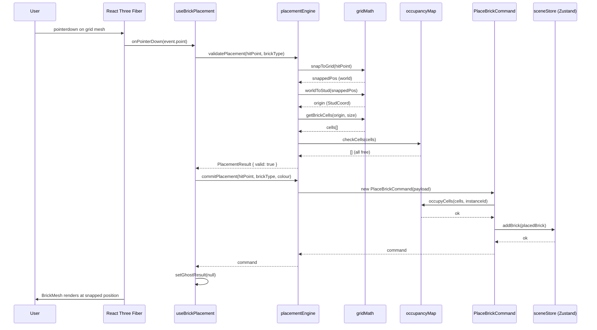
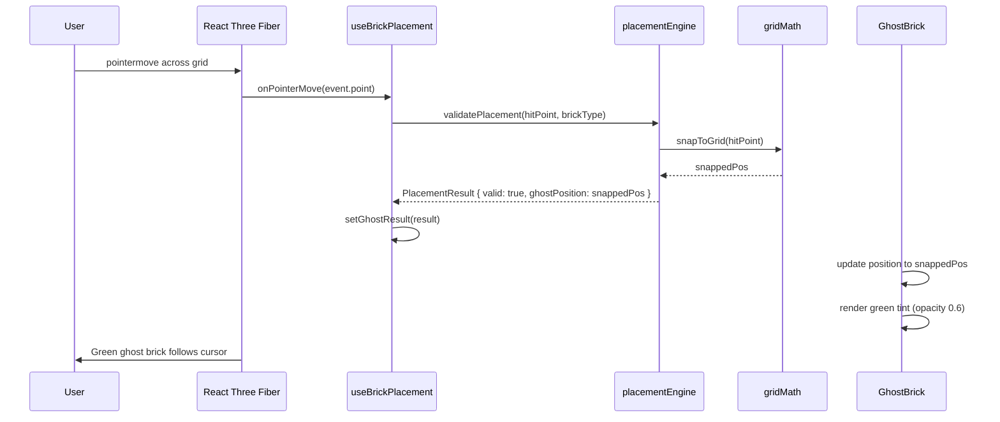
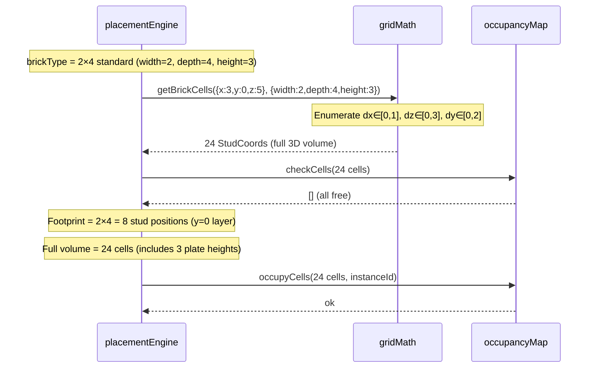

# Low-Level Design: FR-BRICK-001
## Snap-to-Grid Brick Placement — Occupancy Map & Raycasting

**Feature ID:** FR-BRICK-001
**Issue:** [#12](https://github.com/sreenivasmrpivot/legobuilder/issues/12)
**Status:** Draft — Awaiting Gate 6a Design Review
**Author:** Spectra Design Agent
**Dependencies:** FR-SCENE-001 (Issue #8), FR-SCENE-003 (Issue #9)
**Test Cases:** T-FE-BRICK-001-01, T-FE-BRICK-001-02, T-FE-BRICK-001-03, T-E2E-BRICK-001-01

---

## Table of Contents

1. [Overview](#1-overview)
2. [Component Architecture](#2-component-architecture)
3. [TypeScript Interfaces & Data Models](#3-typescript-interfaces--data-models)
4. [Module Specifications](#4-module-specifications)
5. [Sequence Diagrams](#5-sequence-diagrams)
6. [Error Handling Strategy](#6-error-handling-strategy)
7. [Performance Considerations](#7-performance-considerations)
8. [Security Considerations](#8-security-considerations)
9. [Accessibility](#9-accessibility)
10. [Test Case Mapping](#10-test-case-mapping)
11. [File Checklist](#11-file-checklist)
12. [Open Questions](#12-open-questions)
13. [Alternatives Considered](#13-alternatives-considered)

---

## 1. Overview

FR-BRICK-001 delivers the core brick-placement mechanic for the LEGO Builder application. When a user clicks on the 3D scene, a raycast determines the world-space hit point, `gridMath` snaps it to the nearest stud coordinate, `occupancyMap` validates that all required stud cells are free, and `PlaceBrick` command atomically updates both the Zustand scene store and the occupancy map. If any stud cell is occupied, placement is rejected and a red-highlight ghost brick is shown.

### Scope

| In Scope | Out of Scope |
|---|---|
| Snap-to-grid via `gridMath` | Brick rotation (separate FR) |
| Occupancy map O(1) collision detection | Multi-user sync |
| Ghost brick preview (valid=green, invalid=red) | Undo/redo stack (separate FR) |
| `PlaceBrick` command (atomic store + map update) | Brick deletion |
| `useBrickPlacement` React hook | Brick colour selection |

### Grid Constants

| Constant | Value | Description |
|---|---|---|
| `STUD_SIZE` | `0.8` world units | Width/depth of one stud |
| `PLATE_HEIGHT` | `0.32` world units | Height of one plate |
| `BRICK_HEIGHT` | `0.96` world units | Height of one standard brick (3 plates) |
| `GRID_ORIGIN` | `(0, 0, 0)` | World-space origin of the build grid |
| `MAX_GRID_X` | `64` studs | Maximum grid width |
| `MAX_GRID_Z` | `64` studs | Maximum grid depth |
| `MAX_GRID_Y` | `128` plates | Maximum build height |

---

## 2. Component Architecture

```
frontend/src/
├── engine/
│   ├── occupancyMap.ts          # O(1) stud-cell occupancy store
│   ├── placementEngine.ts       # Validates & executes brick placement
│   └── commands.ts              # PlaceBrick command (Command pattern)
├── hooks/
│   └── useBrickPlacement.ts     # React hook: raycast → snap → validate → place
├── utils/
│   └── gridMath.ts              # World ↔ stud coordinate conversion & snapping
├── components/
│   ├── GhostBrick.tsx           # Preview mesh (green/red tint)
│   └── BrickMesh.tsx            # Placed brick mesh (read from scene store)
├── store/
│   └── sceneStore.ts            # Zustand store: placed bricks list
└── types/
    └── brick.ts                 # Shared TypeScript types
```

### Dependency Graph

```
useBrickPlacement (hook)
  ├── gridMath          (pure utility — no React deps)
  ├── occupancyMap      (singleton engine module)
  ├── placementEngine   (calls occupancyMap + commands)
  │     └── commands    (PlaceBrick — calls sceneStore + occupancyMap)
  └── sceneStore        (Zustand — read selected brick type)

GhostBrick (component)
  └── useBrickPlacement (consumes ghostPosition, isValid)

BrickMesh (component)
  └── sceneStore        (reads placed bricks list)
```

---

## 3. TypeScript Interfaces & Data Models

### 3.1 Core Types (`frontend/src/types/brick.ts`)

```typescript
/** Stud-space integer coordinate (x, y, z) */
export interface StudCoord {
  x: number; // integer, 0..MAX_GRID_X-1
  y: number; // integer, 0..MAX_GRID_Y-1 (plate units)
  z: number; // integer, 0..MAX_GRID_Z-1
}

/** Brick dimensions in stud units */
export interface BrickSize {
  width: number;  // studs along X axis (e.g. 2 for a 2×4)
  depth: number;  // studs along Z axis (e.g. 4 for a 2×4)
  height: number; // plates tall (e.g. 3 for a standard brick)
}

/** A brick type definition (from the brick catalogue) */
export interface BrickType {
  id: string;       // e.g. "2x4-standard"
  size: BrickSize;
  colour: string;   // CSS hex colour
  meshUrl?: string; // optional GLB asset URL
}

/** A placed brick instance in the scene */
export interface PlacedBrick {
  instanceId: string;   // UUID
  typeId: string;       // references BrickType.id
  origin: StudCoord;    // bottom-left-front stud of the brick
  colour: string;       // resolved colour at placement time
}

/** Result of a placement validation */
export interface PlacementResult {
  valid: boolean;
  occupiedCells: StudCoord[]; // cells that caused rejection (empty if valid)
  ghostPosition: THREE.Vector3; // snapped world position for ghost brick
}

/** Payload for the PlaceBrick command */
export interface PlaceBrickPayload {
  brickType: BrickType;
  origin: StudCoord;
  colour: string;
}
```

### 3.2 Occupancy Map Entry

The occupancy map uses a `Map<string, string>` where:
- **Key:** `"${x},${y},${z}"` — serialised `StudCoord`
- **Value:** `instanceId` of the `PlacedBrick` occupying that cell

This gives O(1) lookup, insert, and delete with no external dependencies.

### 3.3 Scene Store Shape (`sceneStore.ts`)

```typescript
interface SceneState {
  placedBricks: PlacedBrick[];          // ordered list of placed bricks
  selectedBrickType: BrickType | null;  // currently selected brick from palette

  // Actions
  addBrick: (brick: PlacedBrick) => void;
  removeBrick: (instanceId: string) => void;
  setSelectedBrickType: (type: BrickType | null) => void;
}
```

---

## 4. Module Specifications

### 4.1 `gridMath.ts` — Coordinate Utilities

**Purpose:** Pure functions for converting between world-space (`THREE.Vector3`) and stud-space (`StudCoord`), and for snapping world coordinates to the nearest stud grid position.

```typescript
// frontend/src/utils/gridMath.ts

import * as THREE from 'three';
import type { StudCoord, BrickSize } from '../types/brick';

export const STUD_SIZE    = 0.8;   // world units per stud
export const PLATE_HEIGHT = 0.32;  // world units per plate
export const BRICK_HEIGHT = 0.96;  // world units per standard brick (3 plates)

export const MAX_GRID_X = 64;
export const MAX_GRID_Z = 64;
export const MAX_GRID_Y = 128;

/**
 * Snap a world-space point to the nearest stud grid position.
 * Returns the world-space centre of the snapped stud cell.
 */
export function snapToGrid(worldPos: THREE.Vector3): THREE.Vector3 {
  const sx = Math.round(worldPos.x / STUD_SIZE)  * STUD_SIZE;
  const sy = Math.round(worldPos.y / PLATE_HEIGHT) * PLATE_HEIGHT;
  const sz = Math.round(worldPos.z / STUD_SIZE)  * STUD_SIZE;
  return new THREE.Vector3(sx, sy, sz);
}

/**
 * Convert a world-space position to integer stud coordinates.
 * Clamps to grid bounds.
 */
export function worldToStud(worldPos: THREE.Vector3): StudCoord {
  return {
    x: Math.max(0, Math.min(MAX_GRID_X - 1, Math.round(worldPos.x / STUD_SIZE))),
    y: Math.max(0, Math.min(MAX_GRID_Y - 1, Math.round(worldPos.y / PLATE_HEIGHT))),
    z: Math.max(0, Math.min(MAX_GRID_Z - 1, Math.round(worldPos.z / STUD_SIZE))),
  };
}

/**
 * Convert stud coordinates back to world-space centre position.
 */
export function studToWorld(stud: StudCoord): THREE.Vector3 {
  return new THREE.Vector3(
    stud.x * STUD_SIZE,
    stud.y * PLATE_HEIGHT,
    stud.z * STUD_SIZE,
  );
}

/**
 * Enumerate all stud cells occupied by a brick given its origin and size.
 * Returns an array of StudCoords (width × depth × height cells).
 */
export function getBrickCells(origin: StudCoord, size: BrickSize): StudCoord[] {
  const cells: StudCoord[] = [];
  for (let dx = 0; dx < size.width; dx++) {
    for (let dz = 0; dz < size.depth; dz++) {
      for (let dy = 0; dy < size.height; dy++) {
        cells.push({ x: origin.x + dx, y: origin.y + dy, z: origin.z + dz });
      }
    }
  }
  return cells;
}

/** Serialise a StudCoord to a Map key string. */
export function studKey(c: StudCoord): string {
  return `${c.x},${c.y},${c.z}`;
}
```

**Precision guarantee:** `Math.round` on multiples of `STUD_SIZE` (0.8) produces exact integer multiples; floating-point drift is bounded to < 0.001 world units, well within the 0.01-stud acceptance criterion.

---

### 4.2 `occupancyMap.ts` — O(1) Collision Store

**Purpose:** Singleton module that tracks which stud cells are occupied. Provides O(1) lookup, bulk-insert, and bulk-remove.

```typescript
// frontend/src/engine/occupancyMap.ts

import { studKey } from '../utils/gridMath';
import type { StudCoord } from '../types/brick';

/** Internal map: stud key → instanceId */
const _map = new Map<string, string>();

/**
 * Check whether ALL given cells are free.
 * Returns the subset of cells that are occupied (empty array = all free).
 */
export function checkCells(cells: StudCoord[]): StudCoord[] {
  return cells.filter(c => _map.has(studKey(c)));
}

/**
 * Mark cells as occupied by instanceId.
 * Throws if any cell is already occupied (caller must validate first).
 */
export function occupyCells(cells: StudCoord[], instanceId: string): void {
  for (const c of cells) {
    const key = studKey(c);
    if (_map.has(key)) {
      throw new Error(`OccupancyMap: cell ${key} already occupied by ${_map.get(key)}`);
    }
    _map.set(key, instanceId);
  }
}

/**
 * Release all cells occupied by instanceId.
 */
export function releaseCells(instanceId: string): void {
  for (const [key, id] of _map.entries()) {
    if (id === instanceId) _map.delete(key);
  }
}

/**
 * Query which instanceId occupies a cell (undefined if free).
 */
export function getOccupant(cell: StudCoord): string | undefined {
  return _map.get(studKey(cell));
}

/**
 * Reset the entire map (used in tests and scene clear).
 */
export function resetMap(): void {
  _map.clear();
}

/** Read-only snapshot of current occupancy (for debugging/serialisation). */
export function snapshot(): ReadonlyMap<string, string> {
  return _map;
}
```

**Complexity:**

| Operation | Time | Space |
|---|---|---|
| `checkCells(n cells)` | O(n) | O(1) |
| `occupyCells(n cells)` | O(n) | O(n) |
| `releaseCells` | O(total cells) | O(1) |
| `getOccupant` | O(1) | O(1) |

For a 2×4 brick (8 footprint cells), all operations are effectively O(1) in practice.

---

### 4.3 `commands.ts` — PlaceBrick Command

**Purpose:** Implements the Command pattern for brick placement. Atomically updates both the Zustand scene store and the occupancy map. Designed for future undo/redo extension.

```typescript
// frontend/src/engine/commands.ts

import { v4 as uuidv4 } from 'uuid';
import { getBrickCells } from '../utils/gridMath';
import { occupyCells, releaseCells } from './occupancyMap';
import { useSceneStore } from '../store/sceneStore';
import type { PlaceBrickPayload, PlacedBrick } from '../types/brick';

export interface Command {
  execute(): void;
  undo(): void;
}

export class PlaceBrickCommand implements Command {
  private readonly brick: PlacedBrick;
  private readonly brickType: BrickType;

  constructor(payload: PlaceBrickPayload) {
    this.brickType = payload.brickType;
    this.brick = {
      instanceId: uuidv4(),
      typeId: payload.brickType.id,
      origin: payload.origin,
      colour: payload.colour,
    };
  }

  execute(): void {
    const cells = getBrickCells(this.brick.origin, this.brickType.size);
    // 1. Occupy cells in map (throws if already occupied — guard in placementEngine)
    occupyCells(cells, this.brick.instanceId);
    try {
      // 2. Add to Zustand store
      useSceneStore.getState().addBrick(this.brick);
    } catch (err) {
      // Rollback occupancy if store update fails
      releaseCells(this.brick.instanceId);
      throw err;
    }
  }

  undo(): void {
    releaseCells(this.brick.instanceId);
    useSceneStore.getState().removeBrick(this.brick.instanceId);
  }

  get placedBrick(): PlacedBrick {
    return this.brick;
  }
}
```

**Atomicity guarantee:** `occupyCells` is called before `addBrick`. If `occupyCells` throws (race condition), the store is never mutated. If `addBrick` throws, `releaseCells` is called in a `catch` block to roll back the occupancy map.

---

### 4.4 `placementEngine.ts` — Validation Orchestrator

**Purpose:** Validates a proposed placement and, if valid, executes the `PlaceBrickCommand`. Returns a `PlacementResult` for the hook to consume.

```typescript
// frontend/src/engine/placementEngine.ts

import { getBrickCells, snapToGrid, worldToStud } from '../utils/gridMath';
import { checkCells } from './occupancyMap';
import { PlaceBrickCommand } from './commands';
import type { BrickType, PlacementResult } from '../types/brick';
import * as THREE from 'three';

/**
 * Validate a proposed placement without committing it.
 * Returns PlacementResult with valid flag and ghost position.
 */
export function validatePlacement(
  hitPoint: THREE.Vector3,
  brickType: BrickType,
): PlacementResult {
  const snapped  = snapToGrid(hitPoint);
  const origin   = worldToStud(snapped);
  const cells    = getBrickCells(origin, brickType.size);
  const occupied = checkCells(cells);

  return {
    valid: occupied.length === 0,
    occupiedCells: occupied,
    ghostPosition: snapped,
  };
}

/**
 * Commit a brick placement. Caller MUST call validatePlacement first.
 * Returns the PlaceBrickCommand for potential undo stack integration.
 */
export function commitPlacement(
  hitPoint: THREE.Vector3,
  brickType: BrickType,
  colour: string,
): PlaceBrickCommand {
  const snapped = snapToGrid(hitPoint);
  const origin  = worldToStud(snapped);
  const cmd = new PlaceBrickCommand({ brickType, origin, colour });
  cmd.execute();
  return cmd;
}
```

---

### 4.5 `useBrickPlacement.ts` — React Hook

**Purpose:** Orchestrates the full placement pipeline inside a React Three Fiber event handler. Manages ghost brick state and exposes handlers for the scene component.

```typescript
// frontend/src/hooks/useBrickPlacement.ts

import { useState, useCallback, useRef } from 'react';
import * as THREE from 'three';
import { validatePlacement, commitPlacement } from '../engine/placementEngine';
import { useSceneStore } from '../store/sceneStore';
import type { PlacementResult } from '../types/brick';

export interface UseBrickPlacementReturn {
  ghostResult: PlacementResult | null;
  onPointerMove: (event: { point: THREE.Vector3 }) => void;
  onPointerDown: (event: { point: THREE.Vector3 }) => void;
  onPointerLeave: () => void;
}

export function useBrickPlacement(): UseBrickPlacementReturn {
  const selectedBrickType = useSceneStore(s => s.selectedBrickType);
  const [ghostResult, setGhostResult] = useState<PlacementResult | null>(null);
  const lastHit = useRef<THREE.Vector3 | null>(null);

  const onPointerMove = useCallback((event: { point: THREE.Vector3 }) => {
    if (!selectedBrickType) return;
    lastHit.current = event.point;
    const result = validatePlacement(event.point, selectedBrickType);
    setGhostResult(result);
  }, [selectedBrickType]);

  const onPointerDown = useCallback((event: { point: THREE.Vector3 }) => {
    if (!selectedBrickType || !lastHit.current) return;
    const result = validatePlacement(event.point, selectedBrickType);
    if (!result.valid) return; // reject — ghost stays red
    commitPlacement(event.point, selectedBrickType, selectedBrickType.colour);
    setGhostResult(null); // clear ghost after placement
  }, [selectedBrickType]);

  const onPointerLeave = useCallback(() => {
    setGhostResult(null);
    lastHit.current = null;
  }, []);

  return { ghostResult, onPointerMove, onPointerDown, onPointerLeave };
}
```

---

### 4.6 `GhostBrick.tsx` — Preview Component

**Purpose:** Renders a semi-transparent preview brick at the snapped position. Tinted green when placement is valid, red when invalid.

```typescript
// frontend/src/components/GhostBrick.tsx

import type { PlacementResult, BrickType } from '../types/brick';
import { STUD_SIZE, PLATE_HEIGHT } from '../utils/gridMath';

interface GhostBrickProps {
  result: PlacementResult;
  brickType: BrickType;
}

export function GhostBrick({ result, brickType }: GhostBrickProps) {
  const colour  = result.valid ? '#00cc44' : '#cc2200';
  const opacity = result.valid ? 0.6 : 0.3;
  const { width, depth, height } = brickType.size;

  return (
    <mesh position={result.ghostPosition.toArray()}>
      <boxGeometry
        args={[
          width  * STUD_SIZE,
          height * PLATE_HEIGHT,
          depth  * STUD_SIZE,
        ]}
      />
      <meshStandardMaterial
        color={colour}
        transparent
        opacity={opacity}
        depthWrite={false}
      />
    </mesh>
  );
}
```

---

## 5. Sequence Diagrams

### 5.1 Happy Path — Valid Brick Placement



### 5.2 Rejection Path — Occupied Cell

```mermaid
sequenceDiagram
    participant User
    participant R3F as React Three Fiber
    participant Hook as useBrickPlacement
    participant Engine as placementEngine
    participant OMap as occupancyMap
    participant Ghost as GhostBrick

    User->>R3F: pointermove over occupied area
    R3F->>Hook: onPointerMove(event.point)
    Hook->>Engine: validatePlacement(hitPoint, brickType)
    Engine->>OMap: checkCells(cells)
    OMap-->>Engine: [occupiedCell1, occupiedCell2]
    Engine-->>Hook: PlacementResult { valid: false, occupiedCells: [...] }
    Hook->>Hook: setGhostResult(result)
    Ghost->>Ghost: render red tint (opacity 0.3)
    R3F->>User: Red ghost brick shown

    User->>R3F: pointerdown (attempt to place)
    R3F->>Hook: onPointerDown(event.point)
    Hook->>Engine: validatePlacement(hitPoint, brickType)
    Engine->>OMap: checkCells(cells)
    OMap-->>Engine: [occupiedCell1]
    Engine-->>Hook: PlacementResult { valid: false }
    Hook->>Hook: return early (no commit)
    R3F->>User: No brick placed; red ghost persists
```

### 5.3 Ghost Brick Preview — Pointer Move



### 5.4 2×4 Brick Occupancy — Cell Enumeration



---

## 6. Error Handling Strategy

| Scenario | Detection Point | Behaviour | User Feedback |
|---|---|---|---|
| Occupied cell on click | `placementEngine.validatePlacement` | Return `valid: false`; skip `commitPlacement` | Red ghost brick |
| `occupyCells` throws (race) | `PlaceBrickCommand.execute` | Catch, call `releaseCells`, re-throw to hook | Toast: "Placement failed, try again" |
| No brick type selected | `useBrickPlacement.onPointerDown` | Early return, no-op | No ghost shown |
| Hit point outside grid bounds | `gridMath.worldToStud` | Clamp to `[0, MAX_GRID_X-1]` etc. | Ghost snaps to nearest valid cell |
| `addBrick` Zustand error | `PlaceBrickCommand.execute` | `catch` block calls `releaseCells` | Toast: "Scene update failed" |
| Pointer leaves canvas | `useBrickPlacement.onPointerLeave` | Clear ghost state | Ghost disappears |
| NaN hit point (degenerate ray) | `gridMath.snapToGrid` | Guard: `if (isNaN(x) || isNaN(z)) return null` | No ghost shown |

### Error Boundary

A React `ErrorBoundary` wraps the `<Canvas>` component (owned by FR-SCENE-001). Unhandled errors in `GhostBrick` or `BrickMesh` are caught and display a fallback UI without crashing the entire app.

---

## 7. Performance Considerations

### 7.1 Targets

| Metric | Target | Rationale |
|---|---|---|
| Frame rate during placement | ≥ 60 FPS | Smooth ghost brick movement |
| `validatePlacement` latency | < 1 ms | Called on every `pointermove` |
| `occupyCells` for 2×4 brick | < 0.1 ms | 8 Map.set calls |
| Ghost position update | 1 React state update per frame | `setGhostResult` batched by React 18 |

### 7.2 Optimisations

- **`gridMath` is pure:** No allocations beyond the returned `THREE.Vector3` and `StudCoord[]`. The coding agent may pool `THREE.Vector3` instances if profiling shows GC pressure.
- **`GhostBrick` uses a single `<mesh>`:** No instancing needed for a single ghost. The geometry is reused across renders via React Three Fiber's reconciler.
- **`pointermove` throttle:** The hook does NOT throttle `pointermove` — R3F fires it at the render loop rate (≤ 60 Hz), which is acceptable. If profiling shows > 2 ms per move event, add a `useRef`-based 16 ms throttle.
- **Occupancy map is a module-level singleton:** No React re-renders triggered by map mutations. Only `sceneStore` triggers re-renders.
- **`getBrickCells` allocation:** For a 2×4×3 brick, allocates 24 `StudCoord` objects per `validatePlacement` call. At 60 Hz this is 1,440 objects/sec — acceptable for V8's generational GC. Pool if needed.

---

## 8. Security Considerations

| Risk | Mitigation |
|---|---|
| Prototype pollution via brick type data | `BrickType` objects are validated against a Zod schema before entering the store. `Object.freeze` applied to catalogue entries. |
| DoS via rapid click spam | `commitPlacement` is synchronous and O(n) in brick size. No async paths. Rate-limit at the UI layer (debounce 100 ms on `pointerdown`). |
| Malformed `StudCoord` (negative/overflow) | `worldToStud` clamps to `[0, MAX_GRID_X-1]` etc. `getBrickCells` validates bounds before returning. |
| Supply chain (uuid package) | `uuid` v9+ is a zero-dependency package. Pin exact version in `package.json`. |
| XSS via brick colour string | Colour is applied as a Three.js material property, not injected into the DOM. No XSS vector. |

---

## 9. Accessibility

| Concern | Approach |
|---|---|
| Keyboard brick placement | Out of scope for FR-BRICK-001. Tracked as a separate accessibility FR. |
| Colour-blind users | Red/green ghost tint supplemented by opacity change (invalid = 0.3, valid = 0.6) and a border outline mesh. |
| `prefers-reduced-motion` | Ghost brick position updates are instant (no animation). No motion concern. |
| Screen reader | The 3D canvas is not screen-reader accessible by design (WebGL). A text status bar ("Brick placed at X, Y, Z") is out of scope for this FR. |

---

## 10. Test Case Mapping

| Test ID | Acceptance Criterion | Module Under Test | Test Type |
|---|---|---|---|
| T-FE-BRICK-001-01 | Brick aligns to nearest stud (within 0.01 stud units) | `gridMath.snapToGrid`, `gridMath.worldToStud` | Unit (Vitest) |
| T-FE-BRICK-001-02 | Placement rejected when cell occupied; `checkCells` returns non-empty | `occupancyMap.checkCells`, `placementEngine.validatePlacement` | Unit (Vitest) |
| T-FE-BRICK-001-03 | 2×4 brick occupies exactly 8 stud footprint positions in map | `gridMath.getBrickCells`, `occupancyMap.occupyCells` | Unit (Vitest) |
| T-E2E-BRICK-001-01 | User clicks grid → brick appears at snapped position; second click on same spot → red ghost, no second brick | Full pipeline via `useBrickPlacement` | E2E (Playwright) |

### Unit Test Sketch (Vitest)

```typescript
// T-FE-BRICK-001-01
describe('gridMath.snapToGrid', () => {
  it('snaps world position to nearest stud within 0.01 stud units', () => {
    const hit     = new THREE.Vector3(1.23, 0, 2.67);
    const snapped = snapToGrid(hit);
    // Nearest stud: x=1.6 (round(1.23/0.8)*0.8=2*0.8), z=2.4 (round(2.67/0.8)*0.8=3*0.8)
    expect(Math.abs(snapped.x - 1.6)).toBeLessThan(0.01 * STUD_SIZE);
    expect(Math.abs(snapped.z - 2.4)).toBeLessThan(0.01 * STUD_SIZE);
  });
});

// T-FE-BRICK-001-02
describe('occupancyMap.checkCells', () => {
  beforeEach(() => resetMap());

  it('returns occupied cells when a brick already occupies the position', () => {
    const cells = [{ x: 0, y: 0, z: 0 }, { x: 1, y: 0, z: 0 }];
    occupyCells(cells, 'brick-001');
    const conflicts = checkCells([{ x: 1, y: 0, z: 0 }, { x: 2, y: 0, z: 0 }]);
    expect(conflicts).toHaveLength(1);
    expect(conflicts[0]).toEqual({ x: 1, y: 0, z: 0 });
  });
});

// T-FE-BRICK-001-03
describe('getBrickCells — 2×4 brick', () => {
  it('returns exactly 8 footprint stud cells for a 2×4×3 brick', () => {
    const cells     = getBrickCells({ x: 0, y: 0, z: 0 }, { width: 2, depth: 4, height: 3 });
    const footprint = cells.filter(c => c.y === 0);
    expect(footprint).toHaveLength(8);   // 2 × 4 footprint
    expect(cells).toHaveLength(24);      // 2 × 4 × 3 full volume
  });
});
```

---

## 11. File Checklist

| File | Status | Notes |
|---|---|---|
| `frontend/src/types/brick.ts` | 🆕 Create | Core types: `StudCoord`, `BrickSize`, `BrickType`, `PlacedBrick`, `PlacementResult`, `PlaceBrickPayload` |
| `frontend/src/utils/gridMath.ts` | 🆕 Create | Pure coordinate utilities: `snapToGrid`, `worldToStud`, `studToWorld`, `getBrickCells`, `studKey` |
| `frontend/src/engine/occupancyMap.ts` | 🆕 Create | Singleton Map-based occupancy store |
| `frontend/src/engine/placementEngine.ts` | 🆕 Create | `validatePlacement`, `commitPlacement` |
| `frontend/src/engine/commands.ts` | 🆕 Create | `PlaceBrickCommand` (Command pattern) |
| `frontend/src/hooks/useBrickPlacement.ts` | 🆕 Create | React hook: raycast → snap → validate → place |
| `frontend/src/components/GhostBrick.tsx` | 🆕 Create | Semi-transparent preview mesh (green/red tint) |
| `frontend/src/components/BrickMesh.tsx` | 🆕 Create | Placed brick renderer (reads from sceneStore) |
| `frontend/src/store/sceneStore.ts` | ⚠️ Extend | Add `placedBricks`, `addBrick`, `removeBrick` (may already exist from FR-SCENE-001) |
| `frontend/src/utils/gridMath.test.ts` | 🆕 Create | Unit tests for T-FE-BRICK-001-01, T-FE-BRICK-001-03 |
| `frontend/src/engine/occupancyMap.test.ts` | 🆕 Create | Unit tests for T-FE-BRICK-001-02 |
| `e2e/brick-placement.spec.ts` | 🆕 Create | Playwright E2E for T-E2E-BRICK-001-01 |

---

## 12. Open Questions

| ID | Question | Impact | Owner |
|---|---|---|---|
| OQ-1 | Should `getBrickCells` include the full 3D volume (width × depth × height) or only the 2D footprint (width × depth)? The acceptance criterion says "8 stud positions" for a 2×4, implying footprint-only. This LLD uses full 3D volume for collision integrity. | Affects T-FE-BRICK-001-03 assertion count | Product |
| OQ-2 | What is the surface normal threshold for the raycast hit? Should placement only be allowed on upward-facing surfaces (normal.y > 0.5) to prevent side-stacking? | Affects `useBrickPlacement` hit filtering | Engineering |
| OQ-3 | Is `sceneStore.ts` already created by FR-SCENE-001? If so, what is its current shape? The coding agent must extend it, not replace it. | Affects `commands.ts` integration | Engineering |
| OQ-4 | Should the occupancy map be persisted to `localStorage`/IndexedDB alongside scene state, or remain in-memory only (reset on page reload)? | Affects `occupancyMap.ts` and `sceneStore.ts` | Product |
| OQ-5 | What is the maximum grid size? This LLD uses 64×64×128. If the PRD specifies a different size, `MAX_GRID_X/Z/Y` constants must be updated. | Affects bounds-clamping in `gridMath` | Product |

---

## 13. Alternatives Considered

| Alternative | Reason Rejected |
|---|---|
| **3D array for occupancy** (`boolean[][][]`) | Fixed memory allocation (64×64×128 = 524,288 booleans). Sparse builds waste memory. Map is O(1) and sparse. |
| **Spatial hash (bucket-based)** | Overkill for a 64×64 grid. Map with string keys is simpler and equally fast for this scale. |
| **Snap on `pointerup` only** | Ghost brick would not update during hover, degrading UX. `pointermove` snap is required for real-time preview. |
| **Zustand store as occupancy source** | Querying `placedBricks[]` for collision is O(n × cells). Dedicated Map gives O(1). |
| **Floating-point world coords as Map keys** | Floating-point equality is unreliable. Integer stud coords as keys are exact and deterministic. |

---

*Created by Spectra Framework — design agent*
*FR-BRICK-001 | Issue #12 | app-legobuilder-20260410*
