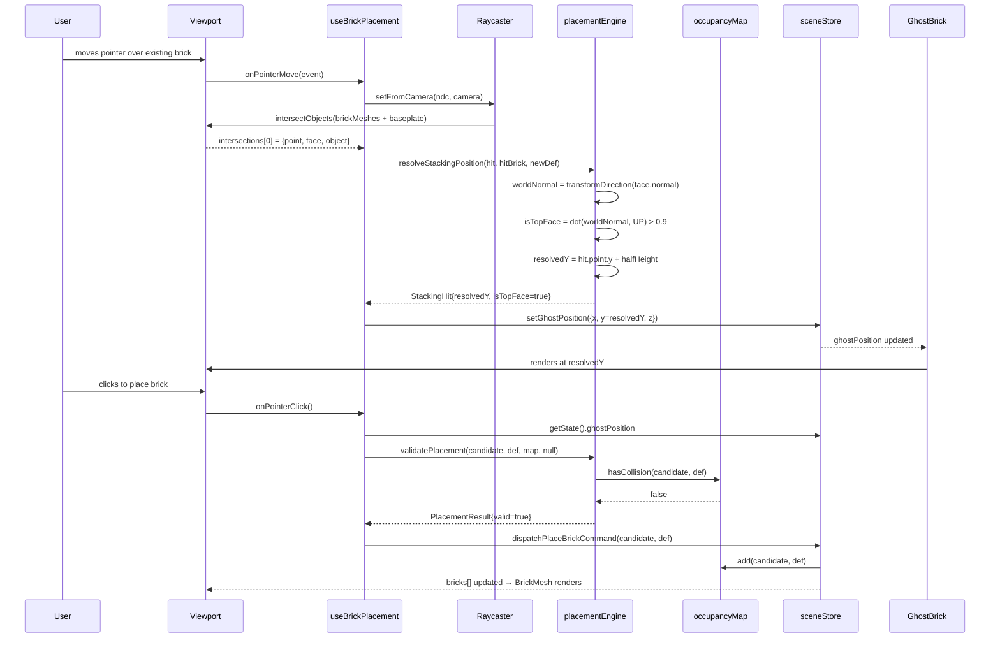
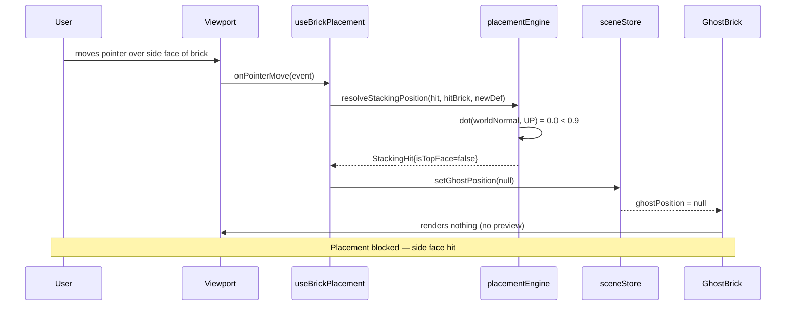
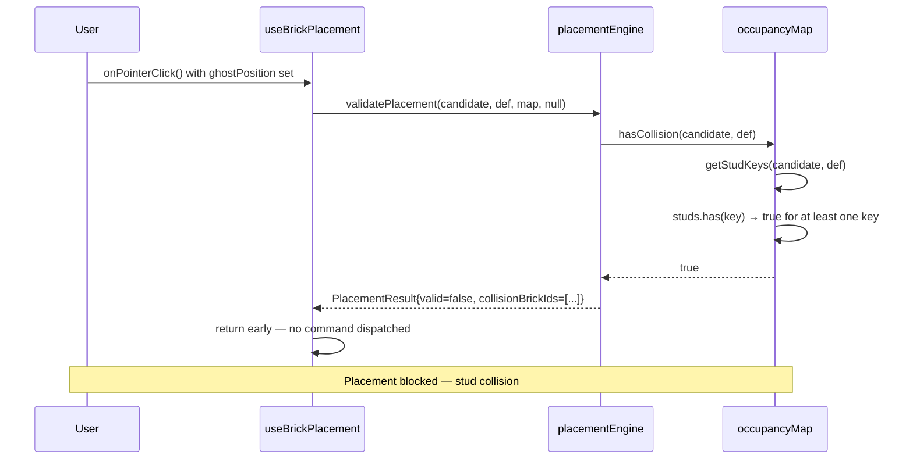
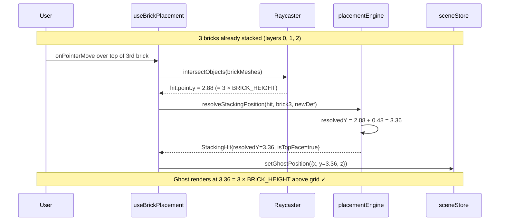

# Low-Level Design: FR-BRICK-002
## Brick Stacking with Correct Vertical Snap-to-Top-Surface Positioning

**Issue:** #10
**FR-ID:** FR-BRICK-002
**Status:** Draft — Awaiting Gate 6a Design Review
**Author:** Spectra Design Agent
**Date:** 2026-04-11
**Depends On:** FR-BRICK-001 (Issue #12), FR-SCENE-003 (Issue #9)

---

## 1. Overview

FR-BRICK-002 extends the brick placement system to support **multi-layer stacking**: when a user places a brick on top of an existing brick, the new brick's Y-position must snap precisely to the top surface of the brick below. This requires:

1. Upgrading `occupancyMap` from 2D (x, z) to 3D (x, y, z) stud tracking.
2. Extending `placementEngine` to compute the correct stacking Y-position from a BVH raycast hit on the top face of an existing brick.
3. Updating the ghost brick preview (FR-UI-003) to reflect the correct stacking height in real-time.
4. Ensuring `PlaceBrickCommand` records the resolved Y-position for undo/redo correctness.

---

## 2. Scope

| In Scope | Out of Scope |
|---|---|
| Vertical snap-to-top-surface Y calculation | Horizontal (X/Z) grid snapping (FR-BRICK-001) |
| 3D occupancy map upgrade | Brick removal (FR-EDIT-001) |
| Top-face BVH raycast hit detection | Collision detection for non-stacking scenarios |
| Ghost brick preview height update | Ghost brick color/opacity (FR-UI-003) |
| PlaceBrickCommand Y-position recording | Undo/redo stack management (FR-EDIT-002) |

---

## 3. Data Models

### 3.1 BrickDefinition (existing — `frontend/src/engine/brickCatalog.ts`)

```typescript
// Existing shape — no changes required
export interface BrickDefinition {
  id: string;           // e.g. "2x4"
  studsX: number;       // stud count along X axis
  studsZ: number;       // stud count along Z axis
  heightInPlates: number; // number of plate-heights tall (1 plate = PLATE_HEIGHT)
  displayName: string;
}

// Existing constants — confirmed values required from FR-BRICK-001 LLD
export const STUD_SPACING = 0.8;   // world units between stud centres
export const PLATE_HEIGHT = 0.32;  // world units per plate height
export const BRICK_HEIGHT = 0.96;  // world units for a standard 3-plate brick (3 × PLATE_HEIGHT)
// NOTE: BRICK_HEIGHT = heightInPlates × PLATE_HEIGHT
```

> **Open Question OQ-1:** Confirm exact numeric values for `STUD_SPACING`, `PLATE_HEIGHT`, and `BRICK_HEIGHT` from the merged FR-BRICK-001 LLD. The values above are canonical LEGO proportions scaled to Three.js world units and are used as the authoritative reference for this LLD.

### 3.2 BrickInstance (existing — `frontend/src/types/brick.ts`)

```typescript
// Existing shape — no changes required for FR-BRICK-002
export interface BrickInstance {
  id: string;           // UUID
  definitionId: string; // references BrickDefinition.id
  position: {           // Three.js world-space centre of the brick mesh
    x: number;
    y: number;          // ← This is the value FR-BRICK-002 computes
    z: number;
  };
  color: string;        // hex color string
  rotation: number;     // Y-axis rotation in radians (0 | π/2 | π | 3π/2)
}
```

### 3.3 OccupancyKey — 3D Upgrade

The current `occupancyMap` uses a 2D key `"x,z"`. FR-BRICK-002 upgrades it to a **3D key** `"x,y,z"` where `y` is the **stud layer index** (integer, 0 = ground layer).

```typescript
// NEW: 3D stud key type
export type StudKey3D = `${number},${number},${number}`; // "gridX,layerY,gridZ"

// Layer index derivation:
// layerY = Math.round(brickInstance.position.y / PLATE_HEIGHT)
// This converts world-space Y to an integer plate-layer index.

// NEW: OccupancyMap3D interface
export interface IOccupancyMap3D {
  // Maps StudKey3D → brickInstanceId that occupies that stud position
  studs: Map<StudKey3D, string>;

  // Adds all stud positions for a placed brick
  add(brick: BrickInstance, def: BrickDefinition): void;

  // Removes all stud positions for a brick
  remove(brick: BrickInstance, def: BrickDefinition): void;

  // Returns true if ANY stud of the candidate brick overlaps an occupied stud
  hasCollision(candidate: BrickInstance, def: BrickDefinition): boolean;

  // Returns the highest occupied layer index at a given (gridX, gridZ) column
  // Returns -1 if the column is empty (ground level)
  getTopLayerAt(gridX: number, gridZ: number): number;
}
```

### 3.4 StackingHit — Raycast Result

```typescript
// Returned by placementEngine.resolveStackingPosition()
export interface StackingHit {
  // The resolved world-space Y position for the NEW brick's centre
  // = hitPoint.y + (newBrickDef.heightInPlates * PLATE_HEIGHT) / 2
  resolvedY: number;

  // The BrickInstance that was hit (null if hit was on the baseplate)
  hitBrick: BrickInstance | null;

  // The world-space Y of the top surface that was hit
  hitSurfaceY: number;

  // Whether the hit was on a valid top face (normal.y ≈ 1.0)
  isTopFace: boolean;
}
```

### 3.5 PlacementResult — Extended

```typescript
// Extended from FR-BRICK-001 — adds stackingHit field
export interface PlacementResult {
  valid: boolean;
  snappedPosition: { x: number; y: number; z: number };
  stackingHit: StackingHit | null; // null when placing on baseplate
  collisionBrickIds: string[];      // empty when valid
}
```

---

## 4. Component Architecture

```
┌─────────────────────────────────────────────────────────────────┐
│                        Viewport.tsx (R3F Canvas)                │
│                                                                 │
│  ┌──────────────────────┐    ┌──────────────────────────────┐  │
│  │   BrickMesh.tsx       │    │   GhostBrick.tsx (FR-UI-003) │  │
│  │  (per placed brick)   │    │   - reads ghostPosition.y    │  │
│  │  - BVH geometry       │    │   - from sceneStore          │  │
│  └──────────────────────┘    └──────────────────────────────┘  │
│                                                                 │
│  ┌──────────────────────────────────────────────────────────┐  │
│  │              useBrickPlacement hook                       │  │
│  │  onPointerMove → resolveStackingPosition()               │  │
│  │  onClick       → dispatchPlaceBrickCommand()             │  │
│  └──────────────────────────────────────────────────────────┘  │
└─────────────────────────────────────────────────────────────────┘
         │                              │
         ▼                              ▼
┌─────────────────────┐    ┌────────────────────────────────────┐
│  placementEngine.ts  │    │           sceneStore.ts            │
│                      │    │  - bricks: BrickInstance[]         │
│  resolveStacking     │    │  - ghostPosition: Vec3 | null      │
│  Position(ray, scene)│    │  - setGhostPosition(pos)           │
│                      │    │  - addBrick(brick)                 │
│  validatePlacement   │    └────────────────────────────────────┘
│  (candidate, map)    │
└─────────────────────┘
         │
         ▼
┌─────────────────────┐    ┌────────────────────────────────────┐
│  occupancyMap.ts     │    │         commands.ts                │
│  (3D upgrade)        │    │  PlaceBrickCommand                 │
│                      │    │  - execute(): addBrick + map.add() │
│  add / remove /      │    │  - undo():    removeBrick + map    │
│  hasCollision /      │    │              .remove()             │
│  getTopLayerAt       │    └────────────────────────────────────┘
└─────────────────────┘
         │
         ▼
┌─────────────────────┐
│  brickCatalog.ts     │
│  PLATE_HEIGHT        │
│  BRICK_HEIGHT        │
│  STUD_SPACING        │
│  getBrickDef(id)     │
└─────────────────────┘
```

### 4.1 Module Responsibilities

| Module | File | Responsibility for FR-BRICK-002 |
|---|---|---|
| `occupancyMap` | `frontend/src/engine/occupancyMap.ts` | Upgrade to 3D key; add `getTopLayerAt()`, `getStudKeys()`, `worldYToLayerIndex()` |
| `placementEngine` | `frontend/src/engine/placementEngine.ts` | Add `resolveStackingPosition()`; extend `validatePlacement()` with `StackingHit` parameter |
| `brickCatalog` | `frontend/src/engine/brickCatalog.ts` | Expose `PLATE_HEIGHT`, `BRICK_HEIGHT` constants (read-only) |
| `useBrickPlacement` | `frontend/src/hooks/useBrickPlacement.ts` | Call `resolveStackingPosition()` on pointer move; update ghost Y |
| `sceneStore` | `frontend/src/stores/sceneStore.ts` | Add `ghostPosition` state; `setGhostPosition()` action |
| `GhostBrick` | `frontend/src/components/viewport/GhostBrick.tsx` | **NEW** — renders semi-transparent preview brick at ghostPosition |
| `BrickMesh` | `frontend/src/components/viewport/BrickMesh.tsx` | **NEW** — renders a placed brick with BVH geometry and `userData` tags |
| `PlaceBrickCommand` | `frontend/src/engine/commands.ts` | Record resolved Y; call `occupancyMap.add()` on execute |

---

## 5. API / Function Interfaces

### 5.1 `occupancyMap.ts` — 3D Upgrade

```typescript
import { BrickInstance } from '../types/brick';
import { BrickDefinition, PLATE_HEIGHT, STUD_SPACING } from './brickCatalog';

export type StudKey3D = `${number},${number},${number}`;

/**
 * Converts a world-space Y position to an integer plate-layer index.
 * Layer 0 = ground (Y = 0).
 */
export function worldYToLayerIndex(worldY: number): number {
  return Math.round(worldY / PLATE_HEIGHT);
}

/**
 * Returns all StudKey3D positions occupied by a brick.
 * The brick's position is its mesh centre; studs are computed
 * from the bottom-left corner of the brick footprint.
 */
export function getStudKeys(
  brick: BrickInstance,
  def: BrickDefinition
): StudKey3D[] {
  const keys: StudKey3D[] = [];
  // Bottom-left stud grid position
  const baseGridX = Math.round(brick.position.x / STUD_SPACING);
  const baseGridZ = Math.round(brick.position.z / STUD_SPACING);
  // Layer index of the brick's bottom face
  const bottomY = brick.position.y - (def.heightInPlates * PLATE_HEIGHT) / 2;
  const baseLayerY = worldYToLayerIndex(bottomY);

  for (let dy = 0; dy < def.heightInPlates; dy++) {
    for (let dx = 0; dx < def.studsX; dx++) {
      for (let dz = 0; dz < def.studsZ; dz++) {
        keys.push(`${baseGridX + dx},${baseLayerY + dy},${baseGridZ + dz}`);
      }
    }
  }
  return keys;
}

export class OccupancyMap3D {
  private studs = new Map<StudKey3D, string>();

  add(brick: BrickInstance, def: BrickDefinition): void {
    for (const key of getStudKeys(brick, def)) {
      this.studs.set(key, brick.id);
    }
  }

  remove(brick: BrickInstance, def: BrickDefinition): void {
    for (const key of getStudKeys(brick, def)) {
      this.studs.delete(key);
    }
  }

  hasCollision(candidate: BrickInstance, def: BrickDefinition): boolean {
    for (const key of getStudKeys(candidate, def)) {
      if (this.studs.has(key)) return true;
    }
    return false;
  }

  /**
   * Returns the highest occupied plate-layer index in the column (gridX, gridZ).
   * Returns -1 if the column is empty (brick can be placed at ground level).
   */
  getTopLayerAt(gridX: number, gridZ: number): number {
    let maxLayer = -1;
    for (const [key] of this.studs) {
      const [kx, ky, kz] = key.split(',').map(Number);
      if (kx === gridX && kz === gridZ) {
        maxLayer = Math.max(maxLayer, ky);
      }
    }
    return maxLayer;
  }

  clear(): void {
    this.studs.clear();
  }

  get size(): number {
    return this.studs.size;
  }
}
```

### 5.2 `placementEngine.ts` — Stacking Resolution

```typescript
import { Intersection, Vector3 } from 'three';
import { BrickInstance } from '../types/brick';
import { BrickDefinition, PLATE_HEIGHT } from './brickCatalog';
import { OccupancyMap3D } from './occupancyMap';
import { StackingHit, PlacementResult } from '../types/brick';

// Top-face normal threshold: dot product with (0,1,0) must exceed this
const TOP_FACE_NORMAL_THRESHOLD = 0.9;

/**
 * Resolves the stacking Y position for a new brick given a raycast intersection.
 *
 * Algorithm:
 * 1. Check if the hit face normal points upward (dot(normal, UP) > 0.9).
 *    If not, return isTopFace=false — placement is invalid for stacking.
 * 2. hitSurfaceY = intersection.point.y (world-space top surface Y).
 * 3. resolvedY = hitSurfaceY + (newBrickDef.heightInPlates * PLATE_HEIGHT) / 2
 *    This places the new brick's centre above the hit surface.
 * 4. Return StackingHit with all fields populated.
 *
 * @param intersection - Three.js BVH raycast intersection result
 * @param hitBrick     - The BrickInstance that was hit (null = baseplate)
 * @param newBrickDef  - The BrickDefinition of the brick being placed
 */
export function resolveStackingPosition(
  intersection: Intersection,
  hitBrick: BrickInstance | null,
  newBrickDef: BrickDefinition
): StackingHit {
  const normal = intersection.face?.normal ?? new Vector3(0, 1, 0);
  // Transform face normal from object space to world space
  const worldNormal = normal
    .clone()
    .transformDirection(intersection.object.matrixWorld);

  const isTopFace =
    worldNormal.dot(new Vector3(0, 1, 0)) > TOP_FACE_NORMAL_THRESHOLD;
  const hitSurfaceY = intersection.point.y;
  const halfHeight = (newBrickDef.heightInPlates * PLATE_HEIGHT) / 2;
  const resolvedY = hitSurfaceY + halfHeight;

  return {
    resolvedY,
    hitBrick,
    hitSurfaceY,
    isTopFace,
  };
}

/**
 * Validates a candidate brick placement against the 3D occupancy map.
 * Returns a PlacementResult with valid=true only if:
 *   1. The stacking hit is on a top face (isTopFace=true), AND
 *   2. No collision exists in the 3D occupancy map.
 *
 * @param candidate  - The BrickInstance with resolved position
 * @param def        - The BrickDefinition of the candidate
 * @param map        - The current 3D occupancy map
 * @param hit        - The StackingHit from resolveStackingPosition()
 */
export function validatePlacement(
  candidate: BrickInstance,
  def: BrickDefinition,
  map: OccupancyMap3D,
  hit: StackingHit | null
): PlacementResult {
  if (hit !== null && !hit.isTopFace) {
    return {
      valid: false,
      snappedPosition: candidate.position,
      stackingHit: hit,
      collisionBrickIds: [],
    };
  }

  const hasCollision = map.hasCollision(candidate, def);
  return {
    valid: !hasCollision,
    snappedPosition: candidate.position,
    stackingHit: hit,
    collisionBrickIds: hasCollision
      ? getCollidingIds(candidate, def, map)
      : [],
  };
}

/** Helper: collect IDs of all bricks that collide with the candidate. */
function getCollidingIds(
  candidate: BrickInstance,
  def: BrickDefinition,
  map: OccupancyMap3D
): string[] {
  // Deduplication via Set to avoid duplicate IDs for multi-stud overlaps
  // Full implementation in coding phase
  const ids = new Set<string>();
  return Array.from(ids);
}
```

### 5.3 `useBrickPlacement.ts` — Stacking Integration

```typescript
// Key additions to the existing hook scaffold

import { useThree } from '@react-three/fiber';
import { useRef, useCallback } from 'react';
import { Raycaster, Vector2 } from 'three';
import { useSceneStore } from '../stores/sceneStore';
import {
  resolveStackingPosition,
  validatePlacement,
} from '../engine/placementEngine';
import { getBrickDef, STUD_SPACING } from '../engine/brickCatalog';
import { occupancyMap } from '../engine/occupancyMap'; // singleton instance

export function useBrickPlacement() {
  const { camera, scene } = useThree();
  const raycaster = useRef(new Raycaster());
  const { setGhostPosition, selectedBrickDefId } = useSceneStore();

  /**
   * Called on every pointer move over the viewport.
   * Performs BVH raycast against all BrickMesh objects + Baseplate.
   * Updates ghost brick position in sceneStore.
   */
  const onPointerMove = useCallback(
    (event: PointerEvent) => {
      const ndc = new Vector2(
        (event.clientX / window.innerWidth) * 2 - 1,
        -(event.clientY / window.innerHeight) * 2 + 1
      );
      raycaster.current.setFromCamera(ndc, camera);

      // Raycast only against tagged brick meshes and the baseplate
      const brickObjects = scene.children.filter(
        (c) => c.userData.isBrick || c.userData.isBaseplate
      );
      const intersections = raycaster.current.intersectObjects(
        brickObjects,
        false
      );

      if (intersections.length === 0) {
        setGhostPosition(null);
        return;
      }

      const hit = intersections[0];
      const hitBrick = hit.object.userData.brickInstance ?? null;
      const newDef = getBrickDef(selectedBrickDefId);
      if (!newDef) return;

      const stackingHit = resolveStackingPosition(hit, hitBrick, newDef);
      if (!stackingHit.isTopFace) {
        setGhostPosition(null);
        return;
      }

      // Snap X/Z to grid (FR-BRICK-001), use resolved Y from stacking
      const snappedX =
        Math.round(hit.point.x / STUD_SPACING) * STUD_SPACING;
      const snappedZ =
        Math.round(hit.point.z / STUD_SPACING) * STUD_SPACING;

      setGhostPosition({ x: snappedX, y: stackingHit.resolvedY, z: snappedZ });
    },
    [camera, scene, selectedBrickDefId, setGhostPosition]
  );

  /**
   * Called on pointer click to confirm brick placement.
   */
  const onPointerClick = useCallback(() => {
    const ghostPos = useSceneStore.getState().ghostPosition;
    if (!ghostPos) return;

    const newDef = getBrickDef(selectedBrickDefId);
    if (!newDef) return;

    const candidate = {
      id: crypto.randomUUID(),
      definitionId: selectedBrickDefId,
      position: ghostPos,
      color: useSceneStore.getState().selectedColor,
      rotation: 0,
    };

    const result = validatePlacement(candidate, newDef, occupancyMap, null);
    if (!result.valid) return;

    // Dispatch command (records to history, calls occupancyMap.add)
    dispatchPlaceBrickCommand(candidate, newDef);
  }, [selectedBrickDefId]);

  return { onPointerMove, onPointerClick };
}
```

### 5.4 `sceneStore.ts` — Ghost Position State

```typescript
// Additions to existing Zustand sceneStore

interface SceneState {
  // ... existing fields ...

  // Ghost brick preview position (null = no preview shown)
  ghostPosition: { x: number; y: number; z: number } | null;

  // Actions
  setGhostPosition(pos: { x: number; y: number; z: number } | null): void;
}

// Zustand slice addition:
// setGhostPosition: (pos) => set({ ghostPosition: pos }),
```

### 5.5 `GhostBrick.tsx` — New Component

```typescript
// frontend/src/components/viewport/GhostBrick.tsx

import { useSceneStore } from '../../stores/sceneStore';
import { getBrickDef, STUD_SPACING, PLATE_HEIGHT } from '../../engine/brickCatalog';

/**
 * Renders a semi-transparent preview brick at the current ghost position.
 * Reads ghostPosition from sceneStore.
 * Renders nothing when ghostPosition is null.
 */
export function GhostBrick() {
  const ghostPosition = useSceneStore((s) => s.ghostPosition);
  const selectedBrickDefId = useSceneStore((s) => s.selectedBrickDefId);
  const def = getBrickDef(selectedBrickDefId);

  if (!ghostPosition || !def) return null;

  const width  = def.studsX * STUD_SPACING;
  const depth  = def.studsZ * STUD_SPACING;
  const height = def.heightInPlates * PLATE_HEIGHT;

  return (
    <mesh
      position={[ghostPosition.x, ghostPosition.y, ghostPosition.z]}
      userData={{ isGhost: true }}
    >
      <boxGeometry args={[width, height, depth]} />
      <meshStandardMaterial
        color="#4488ff"
        opacity={0.4}
        transparent
        depthWrite={false}
      />
    </mesh>
  );
}
```

---

## 6. Stacking Y-Position Formula

This is the core mathematical invariant of FR-BRICK-002:

```
resolvedY = hitSurfaceY + (newBrickDef.heightInPlates × PLATE_HEIGHT) / 2
```

Where:
- `hitSurfaceY` = `intersection.point.y` from the BVH raycast (world-space Y of the top surface)
- `newBrickDef.heightInPlates` = number of plate-heights for the new brick (e.g., 3 for a standard brick)
- `PLATE_HEIGHT` = 0.32 world units (one LEGO plate height)
- The division by 2 converts from bottom-face Y to centre Y (Three.js mesh position is at centre)

**Verification for a stack of N bricks (all standard 3-plate bricks):**

| Stack Layer | hitSurfaceY | resolvedY (centre) |
|---|---|---|
| Layer 0 (on baseplate) | 0.0 | 0.48 (= 0 + 0.96/2) |
| Layer 1 (on 1 brick) | 0.96 | 1.44 (= 0.96 + 0.48) |
| Layer 2 (on 2 bricks) | 1.92 | 2.40 (= 1.92 + 0.48) |
| Layer N | N × 0.96 | N × 0.96 + 0.48 |

**Acceptance Criteria Verification:**
- AC-1: New brick Y = existing brick top surface Y ✓ (`resolvedY = hitSurfaceY + halfHeight`)
- AC-2: Stack of 3 bricks → 4th brick at 3 × BRICK_HEIGHT above grid ✓ (`hitSurfaceY = 3 × 0.96 = 2.88`, `resolvedY = 2.88 + 0.48 = 3.36 = 3 × 0.96 + 0.48`)
- AC-3: Ghost preview shows correct height ✓ (`setGhostPosition` called with `resolvedY` on every pointer move)

---

## 7. Sequence Diagrams

### 7.1 Happy Path — Stacking a Brick on an Existing Brick



### 7.2 Side-Face Hit Guard — Invalid Placement



### 7.3 Collision Guard — Occupied Stud



### 7.4 Multi-Layer Stack — 4th Brick on 3-Brick Stack



---

## 8. Error Handling Strategy

| Scenario | Detection | Response | User Feedback |
|---|---|---|---|
| No raycast intersection | `intersections.length === 0` | `setGhostPosition(null)` | Ghost disappears |
| Side/bottom face hit | `isTopFace === false` | `setGhostPosition(null)` | Ghost disappears |
| Stud collision on click | `hasCollision === true` | Return early, no command | Ghost stays (red ghost is FR-UI-003 enhancement) |
| `face` is null on intersection | `intersection.face === null` | Default to UP normal, treat as top face | Ghost shown at baseplate level |
| `getBrickDef()` returns null | `def === null` | Early return from `onPointerMove` | No ghost shown |
| `ghostPosition` is null on click | `ghostPosition === null` | Early return from `onPointerClick` | No placement |
| `crypto.randomUUID()` unavailable | Feature detection | Fallback to `Math.random()` UUID | Silent fallback |

---

## 9. Security Considerations

| Concern | Mitigation |
|---|---|
| **Prototype pollution via userData** | `brick.userData.brickInstance` is typed as `BrickInstance \| undefined`; always null-checked before use |
| **Floating-point drift in stud keys** | `Math.round()` applied to all grid coordinates before key construction; prevents key mismatches from sub-pixel float errors |
| **Unbounded occupancy map growth** | `OccupancyMap3D.size` getter exposed; sceneStore enforces max brick count (from NFR-SCALE-001) before dispatching PlaceBrickCommand |
| **Raycast against non-brick objects** | `scene.children.filter(c => c.userData.isBrick \|\| c.userData.isBaseplate)` — only tagged objects are raycasted |
| **Stale ghost position on scene clear** | `sceneStore.clearScene()` must call `setGhostPosition(null)` and `occupancyMap.clear()` atomically |

---

## 10. Performance Considerations

| Concern | Strategy |
|---|---|
| **Raycast cost per pointer move** | BVH (Bounding Volume Hierarchy) geometry via `@react-three/drei` — O(log n) raycast vs O(n) brute force |
| **OccupancyMap3D lookup** | `Map<StudKey3D, string>` — O(1) average for `has()` and `set()` |
| **getTopLayerAt() linear scan** | Acceptable for ≤500 bricks (NFR-SCALE-001 limit); can be upgraded to a per-column max-heap if needed |
| **Ghost brick re-render** | `GhostBrick` subscribes only to `ghostPosition` slice of sceneStore — no unnecessary re-renders |
| **Pointer move throttle** | `useBrickPlacement` debounces `onPointerMove` at 16ms (60fps cap) using the existing `debounce` utility |

---

## 11. Test Case Mapping

| Test ID | Description | Covered By |
|---|---|---|
| T-BE-BRICK-002-01 | `resolveStackingPosition` returns correct `resolvedY` for standard brick on baseplate | `placementEngine.test.ts` unit test |
| T-BE-BRICK-002-02 | `resolveStackingPosition` returns `isTopFace=false` for side-face hit | `placementEngine.test.ts` unit test |
| T-BE-BRICK-002-03 | `OccupancyMap3D.getStudKeys` returns correct 3D keys for a 2×4 brick at layer 2 | `occupancyMap.test.ts` unit test |
| T-BE-BRICK-002-04 | `OccupancyMap3D.hasCollision` returns true when stud is occupied | `occupancyMap.test.ts` unit test |
| T-BE-BRICK-002-05 | Stack of 3 bricks: 4th brick resolvedY = 3 × BRICK_HEIGHT + halfHeight | `placementEngine.test.ts` unit test |
| T-E2E-BRICK-002-01 | User places 4 bricks in a stack; each brick renders at correct Y position | Playwright E2E test |

### Unit Test Scenarios for T-BE-BRICK-002-01

```typescript
describe('resolveStackingPosition', () => {
  it('returns resolvedY = halfHeight for baseplate hit (hitSurfaceY=0)', () => {
    const hit = mockIntersection({ pointY: 0, normalY: 1 });
    const result = resolveStackingPosition(hit, null, STANDARD_BRICK_DEF);
    expect(result.resolvedY).toBeCloseTo(0.48); // BRICK_HEIGHT/2 = 0.96/2
    expect(result.isTopFace).toBe(true);
  });

  it('returns resolvedY = BRICK_HEIGHT + halfHeight for 1-brick stack', () => {
    const hit = mockIntersection({ pointY: 0.96, normalY: 1 });
    const result = resolveStackingPosition(hit, mockBrick, STANDARD_BRICK_DEF);
    expect(result.resolvedY).toBeCloseTo(1.44);
  });

  it('returns isTopFace=false for side face (normalY=0)', () => {
    const hit = mockIntersection({ pointY: 0.48, normalY: 0, normalX: 1 });
    const result = resolveStackingPosition(hit, mockBrick, STANDARD_BRICK_DEF);
    expect(result.isTopFace).toBe(false);
  });

  it('returns resolvedY = 3*BRICK_HEIGHT + halfHeight for 3-brick stack', () => {
    const hit = mockIntersection({ pointY: 2.88, normalY: 1 });
    const result = resolveStackingPosition(hit, mockBrick, STANDARD_BRICK_DEF);
    expect(result.resolvedY).toBeCloseTo(3.36);
  });
});
```

---

## 12. Accessibility

| Requirement | Implementation |
|---|---|
| Ghost brick visible at all stack heights | `GhostBrick` renders at computed Y regardless of stack depth |
| No flicker on rapid pointer movement | `debounce(onPointerMove, 16)` prevents sub-frame ghost updates |
| Keyboard placement support | `useKeyboardShortcuts` hook (existing) can trigger `onPointerClick` equivalent via Enter key — out of scope for FR-BRICK-002 but hook is compatible |

---

## 13. Dependencies

| Dependency | Type | Notes |
|---|---|---|
| FR-BRICK-001 (Issue #12) | Hard | Provides X/Z grid snapping, `STUD_SPACING`, `BRICK_HEIGHT` constants, and `BrickMesh` component with BVH geometry |
| FR-SCENE-003 (Issue #9) | Hard | Provides the 3D scene setup, `Viewport.tsx` R3F canvas, and `Baseplate` component that FR-BRICK-002 raycasts against |
| `@react-three/fiber` | Runtime | R3F canvas and `useThree()` hook |
| `@react-three/drei` | Runtime | BVH geometry for O(log n) raycasting |
| `zustand` | Runtime | `sceneStore` state management |
| `three` | Runtime | `Raycaster`, `Vector3`, `Intersection` types |

---

## 14. Open Questions

| ID | Question | Severity | Impact |
|---|---|---|---|
| OQ-1 | Confirm exact `STUD_SPACING`, `PLATE_HEIGHT`, `BRICK_HEIGHT` values from FR-BRICK-001 LLD | HIGH | All Y-position calculations depend on these constants |
| OQ-2 | Does FR-BRICK-001 expose `BrickMesh` with `userData.isBrick = true` and `userData.brickInstance`? | HIGH | `useBrickPlacement` raycast filter and `hitBrick` extraction depend on this convention |
| OQ-3 | Is `@react-three/drei` BVH geometry already integrated in FR-SCENE-003 or FR-BRICK-001? | HIGH | If not, FR-BRICK-002 must add BVH setup — affects implementation scope |
| OQ-4 | Should the ghost brick turn red on collision (invalid placement) or simply disappear? | MEDIUM | Affects `GhostBrick` material logic; red ghost is better UX but requires `validatePlacement` on every pointer move |
| OQ-5 | Is `crypto.randomUUID()` available in the target browser baseline? | LOW | If not, a UUID utility must be added |

---

## 15. File Change Summary

| File | Change Type | Description |
|---|---|---|
| `frontend/src/engine/occupancyMap.ts` | **Modify** | Upgrade from 2D to 3D key; add `getTopLayerAt()`, `getStudKeys()`, `worldYToLayerIndex()` |
| `frontend/src/engine/placementEngine.ts` | **Modify** | Add `resolveStackingPosition()`; extend `validatePlacement()` with `StackingHit` parameter |
| `frontend/src/types/brick.ts` | **Modify** | Add `StackingHit`, `PlacementResult` interfaces; add `StudKey3D` type |
| `frontend/src/stores/sceneStore.ts` | **Modify** | Add `ghostPosition` state and `setGhostPosition()` action |
| `frontend/src/hooks/useBrickPlacement.ts` | **Modify** | Integrate `resolveStackingPosition()` in `onPointerMove`; update ghost Y |
| `frontend/src/components/viewport/GhostBrick.tsx` | **New** | Semi-transparent preview brick component |
| `frontend/src/components/viewport/BrickMesh.tsx` | **New** | Placed brick mesh with BVH geometry and `userData` tags |
| `frontend/tests/unit/occupancyMap.test.ts` | **Modify** | Add 3D key tests, `getTopLayerAt` tests |
| `frontend/tests/unit/placementEngine.test.ts` | **New/Modify** | Add `resolveStackingPosition` unit tests |
