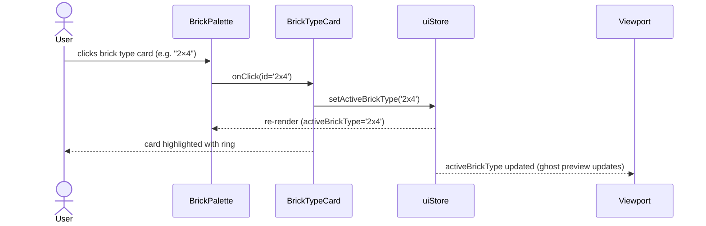
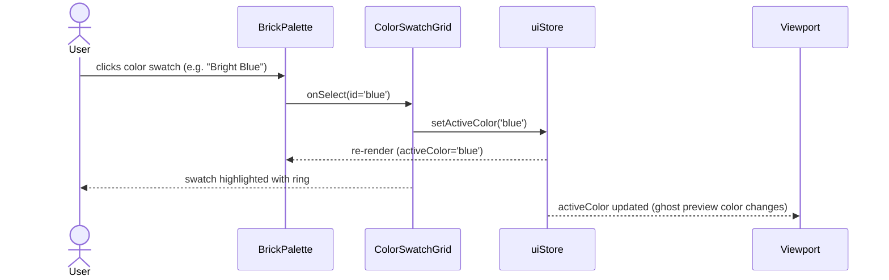
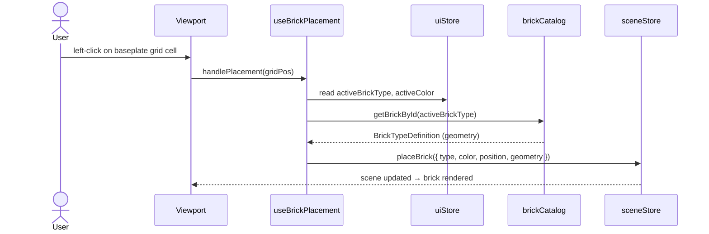
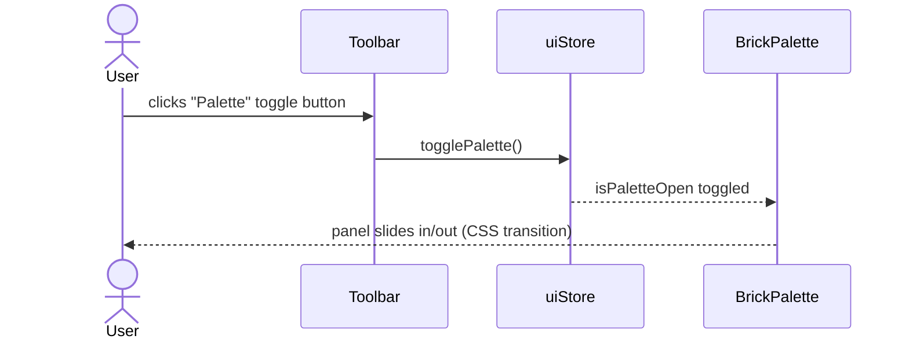

# Low-Level Design: FR-BRICK-003
## Provide Brick Palette with 6 Brick Types and 12 Colors

**FR-ID:** FR-BRICK-003  
**Issue:** [#11](https://github.com/sreenivasmrpivot/legobuilder/issues/11)  
**Status:** Draft — Awaiting Gate 6a Design Review  
**Author:** Spectra Design Agent  
**Date:** 2026-04-11  
**Area:** Frontend  

---

## Table of Contents

1. [Overview](#1-overview)
2. [Component Architecture](#2-component-architecture)
3. [TypeScript Interfaces & Data Models](#3-typescript-interfaces--data-models)
4. [Data Catalog Definitions](#4-data-catalog-definitions)
5. [Sequence Diagrams](#5-sequence-diagrams)
6. [State Management](#6-state-management)
7. [Rendering Strategy](#7-rendering-strategy)
8. [Error Handling Strategy](#8-error-handling-strategy)
9. [Security Considerations](#9-security-considerations)
10. [Accessibility](#10-accessibility)
11. [Performance Budget](#11-performance-budget)
12. [Test Case Mapping](#12-test-case-mapping)
13. [File Checklist](#13-file-checklist)
14. [Open Questions](#14-open-questions)
15. [Alternatives Considered](#15-alternatives-considered)

---

## 1. Overview

FR-BRICK-003 delivers the **Brick Palette** — the primary selection interface for both Casual Builders and Enthusiast Designers. It exposes:

- **6 brick types** (1×1, 1×2, 1×4, 2×2, 2×3, 2×4) with Three.js `BoxGeometry` dimensions
- **12 named colors** with hex values and Tailwind CSS tokens
- A sidebar panel (`BrickPalette.tsx`) that renders visual previews and a color swatch grid
- `uiStore` Zustand slice tracking `activeBrickType` and `activeColor`
- `brickCatalog.ts` engine module as the single source of truth for brick dimensions
- `colorPalette.ts` utility as the single source of truth for color definitions

This feature depends on **FR-SCENE-001 (Issue #8)** — the R3F Canvas must be mounted before brick placement can be tested end-to-end.

---

## 2. Component Architecture

### 2.1 Module Dependency Graph

```
App.tsx
└── BrickPalette.tsx          (UI sidebar — owns palette rendering)
    ├── BrickTypeCard.tsx      (NEW — renders one brick type with SVG preview)
    ├── ColorSwatchGrid.tsx    (NEW — renders 12 color swatches)
    ├── brickCatalog.ts        (engine — brick type definitions)
    ├── colorPalette.ts        (utils — color definitions)
    └── uiStore.ts             (Zustand — activeBrickType, activeColor)
```

### 2.2 Component Responsibilities

| Component / Module | File Path | Responsibility |
|---|---|---|
| `BrickPalette` | `frontend/src/components/ui/BrickPalette.tsx` | Sidebar container; renders brick type list + color swatch grid; reads/writes `uiStore` |
| `BrickTypeCard` | `frontend/src/components/ui/BrickTypeCard.tsx` | Renders a single brick type entry: SVG icon + label + stud count; highlights active selection |
| `ColorSwatchGrid` | `frontend/src/components/ui/ColorSwatchGrid.tsx` | Renders 12 color swatches in a 4×3 grid; highlights active color; shows tooltip with color name |
| `brickCatalog` | `frontend/src/engine/brickCatalog.ts` | Exports `BRICK_CATALOG: BrickTypeDefinition[]` — 6 entries with id, label, studs, geometry dims |
| `colorPalette` | `frontend/src/utils/colorPalette.ts` | Exports `COLOR_PALETTE: ColorDefinition[]` — 12 entries with id, name, hex, tailwindClass |
| `uiStore` | `frontend/src/stores/uiStore.ts` | Zustand slice: `activeBrickType`, `activeColor`, `isPaletteOpen`, `setActiveBrickType`, `setActiveColor` |

### 2.3 Props Interfaces

```typescript
// BrickPalette.tsx — no external props; reads from uiStore
interface BrickPaletteProps {} // stateless shell

// BrickTypeCard.tsx
interface BrickTypeCardProps {
  definition: BrickTypeDefinition;
  isActive: boolean;
  onClick: (id: BrickTypeId) => void;
}

// ColorSwatchGrid.tsx
interface ColorSwatchGridProps {
  colors: ColorDefinition[];
  activeColorId: ColorId;
  onSelect: (id: ColorId) => void;
}
```

---

## 3. TypeScript Interfaces & Data Models

### 3.1 Brick Type

```typescript
// frontend/src/types/brick.ts  (extend existing file)

/** Unique identifier for a brick type */
export type BrickTypeId =
  | '1x1'
  | '1x2'
  | '1x4'
  | '2x2'
  | '2x3'
  | '2x4';

/** Unique identifier for a color */
export type ColorId =
  | 'red' | 'blue' | 'yellow' | 'green' | 'white' | 'black'
  | 'orange' | 'purple' | 'brown' | 'gray' | 'tan' | 'lime';

/** Three.js BoxGeometry dimensions in world units */
export interface BrickGeometry {
  /** Width in studs (X axis) */
  studsX: number;
  /** Depth in studs (Z axis) */
  studsZ: number;
  /** Height in plates (Y axis); standard brick = 1 */
  plates: number;
  /** Rendered width in Three.js world units (studsX × STUD_SIZE) */
  width: number;
  /** Rendered depth in Three.js world units (studsZ × STUD_SIZE) */
  depth: number;
  /** Rendered height in Three.js world units (plates × PLATE_HEIGHT) */
  height: number;
}

/** Full definition of a brick type in the catalog */
export interface BrickTypeDefinition {
  id: BrickTypeId;
  label: string;          // e.g. "1×2"
  studsX: number;
  studsZ: number;
  plates: number;
  geometry: BrickGeometry;
  svgIcon: string;        // inline SVG path data for palette preview
  description: string;   // accessible label
}

/** Color entry in the palette */
export interface ColorDefinition {
  id: ColorId;
  name: string;           // e.g. "Bright Red"
  hex: string;            // e.g. "#C91A09"
  tailwindClass: string;  // e.g. "bg-brick-red"
  contrastHex: string;    // text color for accessibility (black or white)
}
```

### 3.2 uiStore State Shape

```typescript
// frontend/src/stores/uiStore.ts  (extend existing scaffold)

interface UIState {
  activeBrickType: BrickTypeId;       // default: '2x4'
  activeColor: ColorId;               // default: 'red'
  isPaletteOpen: boolean;             // default: true
  setActiveBrickType: (id: BrickTypeId) => void;
  setActiveColor: (id: ColorId) => void;
  togglePalette: () => void;
}
```

---

## 4. Data Catalog Definitions

### 4.1 Brick Catalog — 6 Types

Constants: `STUD_SIZE = 1.0` (world unit), `PLATE_HEIGHT = 1.2` (world unit).

| ID | Label | StudsX | StudsZ | Plates | Width | Depth | Height |
|---|---|---|---|---|---|---|---|
| `1x1` | 1×1 | 1 | 1 | 1 | 1.0 | 1.0 | 1.2 |
| `1x2` | 1×2 | 1 | 2 | 1 | 1.0 | 2.0 | 1.2 |
| `1x4` | 1×4 | 1 | 4 | 1 | 1.0 | 4.0 | 1.2 |
| `2x2` | 2×2 | 2 | 2 | 1 | 2.0 | 2.0 | 1.2 |
| `2x3` | 2×3 | 2 | 3 | 1 | 2.0 | 3.0 | 1.2 |
| `2x4` | 2×4 | 2 | 4 | 1 | 2.0 | 4.0 | 1.2 |

```typescript
// frontend/src/engine/brickCatalog.ts
export const STUD_SIZE = 1.0;
export const PLATE_HEIGHT = 1.2;

export const BRICK_CATALOG: BrickTypeDefinition[] = [
  {
    id: '1x1', label: '1×1', studsX: 1, studsZ: 1, plates: 1,
    geometry: { studsX: 1, studsZ: 1, plates: 1,
      width: 1.0, depth: 1.0, height: 1.2 },
    svgIcon: '<rect x="2" y="2" width="12" height="12" rx="1"/>',
    description: 'Single stud brick, 1 by 1',
  },
  {
    id: '1x2', label: '1×2', studsX: 1, studsZ: 2, plates: 1,
    geometry: { studsX: 1, studsZ: 2, plates: 1,
      width: 1.0, depth: 2.0, height: 1.2 },
    svgIcon: '<rect x="2" y="4" width="12" height="8" rx="1"/>',
    description: 'Brick 1 by 2',
  },
  {
    id: '1x4', label: '1×4', studsX: 1, studsZ: 4, plates: 1,
    geometry: { studsX: 1, studsZ: 4, plates: 1,
      width: 1.0, depth: 4.0, height: 1.2 },
    svgIcon: '<rect x="2" y="6" width="12" height="4" rx="1"/>',
    description: 'Brick 1 by 4',
  },
  {
    id: '2x2', label: '2×2', studsX: 2, studsZ: 2, plates: 1,
    geometry: { studsX: 2, studsZ: 2, plates: 1,
      width: 2.0, depth: 2.0, height: 1.2 },
    svgIcon: '<rect x="2" y="2" width="12" height="12" rx="1"/><circle cx="8" cy="8" r="2"/>',
    description: 'Brick 2 by 2',
  },
  {
    id: '2x3', label: '2×3', studsX: 2, studsZ: 3, plates: 1,
    geometry: { studsX: 2, studsZ: 3, plates: 1,
      width: 2.0, depth: 3.0, height: 1.2 },
    svgIcon: '<rect x="2" y="2" width="12" height="12" rx="1"/>',
    description: 'Brick 2 by 3',
  },
  {
    id: '2x4', label: '2×4', studsX: 2, studsZ: 4, plates: 1,
    geometry: { studsX: 2, studsZ: 4, plates: 1,
      width: 2.0, depth: 4.0, height: 1.2 },
    svgIcon: '<rect x="1" y="4" width="14" height="8" rx="1"/>',
    description: 'Standard 2 by 4 brick',
  },
];

export function getBrickById(id: BrickTypeId): BrickTypeDefinition {
  const def = BRICK_CATALOG.find(b => b.id === id);
  if (!def) throw new Error(`Unknown brick type: ${id}`);
  return def;
}
```

### 4.2 Color Palette — 12 Colors

| ID | Name | Hex | Tailwind Class |
|---|---|---|---|
| `red` | Bright Red | `#C91A09` | `bg-brick-red` |
| `blue` | Bright Blue | `#006DB7` | `bg-brick-blue` |
| `yellow` | Bright Yellow | `#FFD700` | `bg-brick-yellow` |
| `green` | Bright Green | `#237841` | `bg-brick-green` |
| `white` | White | `#FFFFFF` | `bg-brick-white` |
| `black` | Black | `#1B2A34` | `bg-brick-black` |
| `orange` | Bright Orange | `#FE8A18` | `bg-brick-orange` |
| `purple` | Medium Lilac | `#8D73B3` | `bg-brick-purple` |
| `brown` | Reddish Brown | `#582A12` | `bg-brick-brown` |
| `gray` | Medium Stone Grey | `#9BA19D` | `bg-brick-gray` |
| `tan` | Tan | `#E4CD9E` | `bg-brick-tan` |
| `lime` | Bright Yellowish Green | `#BBE90B` | `bg-brick-lime` |

```typescript
// frontend/src/utils/colorPalette.ts
export const COLOR_PALETTE: ColorDefinition[] = [
  { id: 'red',    name: 'Bright Red',              hex: '#C91A09', tailwindClass: 'bg-brick-red',    contrastHex: '#FFFFFF' },
  { id: 'blue',   name: 'Bright Blue',             hex: '#006DB7', tailwindClass: 'bg-brick-blue',   contrastHex: '#FFFFFF' },
  { id: 'yellow', name: 'Bright Yellow',           hex: '#FFD700', tailwindClass: 'bg-brick-yellow', contrastHex: '#000000' },
  { id: 'green',  name: 'Bright Green',            hex: '#237841', tailwindClass: 'bg-brick-green',  contrastHex: '#FFFFFF' },
  { id: 'white',  name: 'White',                   hex: '#FFFFFF', tailwindClass: 'bg-brick-white',  contrastHex: '#000000' },
  { id: 'black',  name: 'Black',                   hex: '#1B2A34', tailwindClass: 'bg-brick-black',  contrastHex: '#FFFFFF' },
  { id: 'orange', name: 'Bright Orange',           hex: '#FE8A18', tailwindClass: 'bg-brick-orange', contrastHex: '#000000' },
  { id: 'purple', name: 'Medium Lilac',            hex: '#8D73B3', tailwindClass: 'bg-brick-purple', contrastHex: '#FFFFFF' },
  { id: 'brown',  name: 'Reddish Brown',           hex: '#582A12', tailwindClass: 'bg-brick-brown',  contrastHex: '#FFFFFF' },
  { id: 'gray',   name: 'Medium Stone Grey',       hex: '#9BA19D', tailwindClass: 'bg-brick-gray',   contrastHex: '#000000' },
  { id: 'tan',    name: 'Tan',                     hex: '#E4CD9E', tailwindClass: 'bg-brick-tan',    contrastHex: '#000000' },
  { id: 'lime',   name: 'Bright Yellowish Green',  hex: '#BBE90B', tailwindClass: 'bg-brick-lime',   contrastHex: '#000000' },
];

export function getColorById(id: ColorId): ColorDefinition {
  const def = COLOR_PALETTE.find(c => c.id === id);
  if (!def) throw new Error(`Unknown color: ${id}`);
  return def;
}
```

---

## 5. Sequence Diagrams

### 5.1 User Selects a Brick Type



### 5.2 User Selects a Color



### 5.3 Brick Placement with Active Type and Color



### 5.4 Palette Panel Toggle



---

## 6. State Management

### 6.1 uiStore Slice Design

```typescript
// frontend/src/stores/uiStore.ts
import { create } from 'zustand';
import type { BrickTypeId, ColorId } from '../types/brick';

interface UIState {
  activeBrickType: BrickTypeId;
  activeColor: ColorId;
  isPaletteOpen: boolean;
  setActiveBrickType: (id: BrickTypeId) => void;
  setActiveColor: (id: ColorId) => void;
  togglePalette: () => void;
}

export const useUIStore = create<UIState>((set) => ({
  activeBrickType: '2x4',
  activeColor: 'red',
  isPaletteOpen: true,
  setActiveBrickType: (id) => set({ activeBrickType: id }),
  setActiveColor: (id) => set({ activeColor: id }),
  togglePalette: () => set((s) => ({ isPaletteOpen: !s.isPaletteOpen })),
}));
```

### 6.2 State Flow

```
uiStore.activeBrickType ──► BrickPalette (highlight active card)
                        ──► useBrickPlacement (geometry lookup)
                        ──► Viewport ghost preview

uiStore.activeColor     ──► BrickPalette (highlight active swatch)
                        ──► useBrickPlacement (color applied to placed brick)
                        ──► Viewport ghost preview material
```

### 6.3 Persistence

`uiStore` is **session-only** (in-memory Zustand). Active brick type and color are not persisted to IndexedDB — they reset to defaults (`2x4`, `red`) on page reload. This is intentional: the palette is a transient UI preference, not part of the saved scene.

---

## 7. Rendering Strategy

### 7.1 Brick Type Previews

Each `BrickTypeCard` renders an **inline SVG icon** (16×16 viewBox) representing the brick's top-down footprint. SVG is preferred over 3D thumbnails for:
- Zero Three.js overhead in the sidebar
- Instant render (no WebGL context needed)
- Scalable at any DPI
- Accessible via `aria-label`

SVG icons are stored as string literals in `brickCatalog.ts` and injected via `dangerouslySetInnerHTML` with a sanitized wrapper (no user input involved — static catalog data only).

### 7.2 Color Swatches

`ColorSwatchGrid` renders a **4×3 CSS grid** of `<button>` elements. Each swatch:
- Background: `style={{ backgroundColor: color.hex }}`
- Active ring: Tailwind `ring-2 ring-offset-2 ring-white` when `isActive`
- Tooltip: `title={color.name}` + `aria-label={color.name}`
- Size: `w-8 h-8` (32×32 px)

### 7.3 Layout

```
┌─────────────────────────────┐
│  BrickPalette (sidebar)     │
│  ┌─────────────────────┐   │
│  │  Brick Types        │   │
│  │  ┌──┐ ┌──┐ ┌──┐    │   │
│  │  │1×1│ │1×2│ │1×4│   │   │
│  │  └──┘ └──┘ └──┘    │   │
│  │  ┌──┐ ┌──┐ ┌──┐    │   │
│  │  │2×2│ │2×3│ │2×4│   │   │
│  │  └──┘ └──┘ └──┘    │   │
│  └─────────────────────┘   │
│  ┌─────────────────────┐   │
│  │  Colors (4×3 grid)  │   │
│  │  ■ ■ ■ ■            │   │
│  │  ■ ■ ■ ■            │   │
│  │  ■ ■ ■ ■            │   │
│  └─────────────────────┘   │
└─────────────────────────────┘
```

---

## 8. Error Handling Strategy

| Scenario | Detection | Response | User Impact |
|---|---|---|---|
| `getBrickById` called with unknown ID | `find()` returns `undefined` | Throw `Error('Unknown brick type: ${id}')` | Caught by React error boundary; fallback UI shown |
| `getColorById` called with unknown ID | `find()` returns `undefined` | Throw `Error('Unknown color: ${id}')` | Caught by React error boundary; fallback UI shown |
| `BRICK_CATALOG` empty (import failure) | `BRICK_CATALOG.length === 0` | `BrickPalette` renders empty state with message | User sees "No brick types available" |
| `COLOR_PALETTE` empty (import failure) | `COLOR_PALETTE.length === 0` | `ColorSwatchGrid` renders empty state | User sees "No colors available" |
| `uiStore` hydration mismatch | TypeScript type guard on `BrickTypeId` | Reset to default `'2x4'` / `'red'` | Silent recovery; no user impact |
| SVG injection XSS | Static catalog data only; no user input | N/A — static strings, no sanitization needed | No risk |

### 8.1 React Error Boundary

`BrickPalette` is wrapped in an `ErrorBoundary` component (to be implemented in `frontend/src/components/ui/ErrorBoundary.tsx`). On error, it renders:

```tsx
<div role="alert" className="p-4 text-red-500">
  Brick palette unavailable. Please refresh.
</div>
```

---

## 9. Security Considerations

| Concern | Mitigation |
|---|---|
| SVG injection via `dangerouslySetInnerHTML` | SVG path strings are **static catalog constants** — never derived from user input or external API. No sanitization needed, but must remain static. |
| Prototype pollution via catalog import | `BRICK_CATALOG` and `COLOR_PALETTE` are `const` arrays of plain objects. No `Object.assign` or dynamic key access from user input. |
| Supply chain (catalog data) | Catalog is co-located in the repo (`brickCatalog.ts`, `colorPalette.ts`). No external CDN or runtime fetch. |
| Color hex injection into `style` prop | Hex values are static constants. If ever made dynamic, validate against `/^#[0-9A-Fa-f]{6}$/` before use. |
| Accessibility — color-only information | Each color swatch has `aria-label` with the color name. Active state is also indicated by a visible ring, not color alone. |

---

## 10. Accessibility

| Requirement | Implementation |
|---|---|
| Keyboard navigation | `BrickTypeCard` and color swatches are `<button>` elements — natively focusable and activatable via `Enter`/`Space` |
| Screen reader labels | `aria-label={definition.description}` on each `BrickTypeCard`; `aria-label={color.name}` on each swatch |
| Active state announcement | `aria-pressed={isActive}` on each card and swatch |
| Color contrast | `contrastHex` field in `ColorDefinition` ensures text on swatches meets WCAG AA (4.5:1 minimum) |
| Reduced motion | Palette slide-in/out transition respects `prefers-reduced-motion` via Tailwind `motion-safe:transition-transform` |
| Focus visible | Tailwind `focus-visible:ring-2` applied to all interactive elements |

---

## 11. Performance Budget

| Metric | Target | Strategy |
|---|---|---|
| Palette initial render | < 16 ms | Static data; no async fetch; pure React render |
| Re-render on selection change | < 8 ms | Zustand selector — only `BrickTypeCard` / swatch with changed `isActive` re-renders |
| Bundle size delta | < 5 KB gzipped | SVG icons as strings; no additional icon library |
| Color swatch paint | < 2 ms | CSS `background-color` only; no canvas or WebGL |
| Memory footprint | < 50 KB | 6 catalog entries + 12 color entries; negligible |

### 11.1 Zustand Selector Optimization

```typescript
// In BrickTypeCard — subscribe only to activeBrickType
const activeBrickType = useUIStore((s) => s.activeBrickType);

// In ColorSwatchGrid — subscribe only to activeColor
const activeColor = useUIStore((s) => s.activeColor);
```

This prevents `BrickPalette` from re-rendering when unrelated store slices change.

---

## 12. Test Case Mapping

| Test ID | Description | Component Under Test | Assertion |
|---|---|---|---|
| T-BE-BRICK-003-01 | `BRICK_CATALOG` exports exactly 6 entries | `brickCatalog.ts` | `expect(BRICK_CATALOG).toHaveLength(6)` |
| T-BE-BRICK-003-02 | Each catalog entry has valid geometry (width = studsX × STUD_SIZE) | `brickCatalog.ts` | `expect(entry.geometry.width).toBe(entry.studsX * STUD_SIZE)` |
| T-FE-UI-002-01 | `BrickPalette` renders 6 brick type cards | `BrickPalette.tsx` | `expect(screen.getAllByRole('button', { name: /brick/i })).toHaveLength(6)` |
| T-FE-UI-002-03 | Clicking a color swatch updates `uiStore.activeColor` | `ColorSwatchGrid.tsx` | `userEvent.click(swatch); expect(useUIStore.getState().activeColor).toBe('blue')` |
| T-E2E-BRICK-001-01 | Selecting 2×4 + Blue and placing a brick renders correct geometry and color | Full app (Playwright) | Brick mesh has `geometry.width=2.0, depth=4.0` and material `color=#006DB7` |

### 12.1 Additional Unit Tests (Recommended)

| Test ID | Description |
|---|---|
| T-FE-UI-002-02 | Clicking a brick type card updates `uiStore.activeBrickType` |
| T-FE-UI-002-04 | `COLOR_PALETTE` exports exactly 12 entries |
| T-FE-UI-002-05 | Active brick type card has `aria-pressed="true"` |
| T-FE-UI-002-06 | Active color swatch has `aria-pressed="true"` |
| T-FE-UI-002-07 | `getBrickById` throws for unknown ID |
| T-FE-UI-002-08 | `getColorById` throws for unknown ID |

---

## 13. File Checklist

| File | Action | Notes |
|---|---|---|
| `frontend/src/types/brick.ts` | **Extend** | Add `BrickTypeId`, `ColorId`, `BrickGeometry`, `BrickTypeDefinition`, `ColorDefinition` |
| `frontend/src/engine/brickCatalog.ts` | **Implement** | Replace scaffold with full `BRICK_CATALOG` array + `getBrickById` |
| `frontend/src/utils/colorPalette.ts` | **Implement** | Replace scaffold with full `COLOR_PALETTE` array + `getColorById` |
| `frontend/src/stores/uiStore.ts` | **Extend** | Add `activeBrickType`, `activeColor`, `isPaletteOpen`, actions |
| `frontend/src/components/ui/BrickPalette.tsx` | **Implement** | Replace scaffold with full sidebar component |
| `frontend/src/components/ui/BrickTypeCard.tsx` | **Create** | New component |
| `frontend/src/components/ui/ColorSwatchGrid.tsx` | **Create** | New component |
| `frontend/src/components/ui/ErrorBoundary.tsx` | **Create** | Generic error boundary for palette |
| `frontend/src/components/App.tsx` | **Update** | Wire `isPaletteOpen` toggle from `Toolbar` to `BrickPalette` |
| `frontend/src/__tests__/brickCatalog.test.ts` | **Create** | Unit tests for catalog |
| `frontend/src/__tests__/colorPalette.test.ts` | **Create** | Unit tests for color palette |
| `frontend/src/__tests__/BrickPalette.test.tsx` | **Create** | Component tests |
| `frontend/src/__tests__/ColorSwatchGrid.test.tsx` | **Create** | Component tests |

---

## 14. Open Questions

| ID | Question | Impact | Default Assumption |
|---|---|---|---|
| OQ-1 | Should the palette support **multi-select** of brick types (e.g., stamp mode)? | Medium — affects `uiStore` shape | No; single active type only |
| OQ-2 | Should **custom colors** (hex input) be supported beyond the 12 named colors? | High — affects `ColorSwatchGrid` and `ColorDefinition` | No; 12 named colors only for FR-BRICK-003 |
| OQ-3 | Should the palette be **collapsible** on mobile (< 768 px)? | Low — affects layout | Yes; `isPaletteOpen` defaults to `false` on mobile |
| OQ-4 | Should active brick type and color be **persisted** across sessions (IndexedDB)? | Medium — affects `uiStore` persistence | No; session-only |
| OQ-5 | Are the **SVG icon designs** approved, or should they be replaced with 3D thumbnails? | Medium — affects `BrickTypeCard` rendering | SVG icons (top-down footprint) for v1 |

---

## 15. Alternatives Considered

| Alternative | Reason Rejected |
|---|---|
| **3D thumbnail previews** (mini R3F Canvas per brick type) | High overhead — 6 WebGL contexts in sidebar; SVG icons are sufficient for v1 |
| **External icon library** (e.g., react-icons) | Adds bundle weight; custom SVG paths are simpler and more accurate for brick shapes |
| **CSS-only color swatches** (Tailwind classes only) | Tailwind purges unused classes; hex values in `style` prop are more reliable for dynamic colors |
| **Redux Toolkit** for UI state | Overkill for simple palette state; Zustand is already the project standard |
| **Server-side catalog** (API endpoint for brick types) | This is a pure client-side SPA; static catalog in TypeScript is simpler, faster, and offline-capable |
