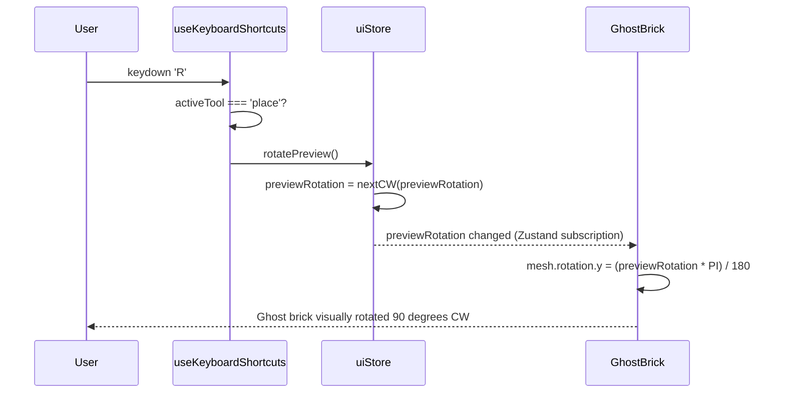
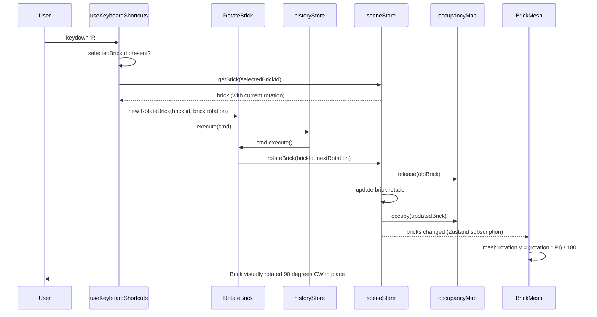
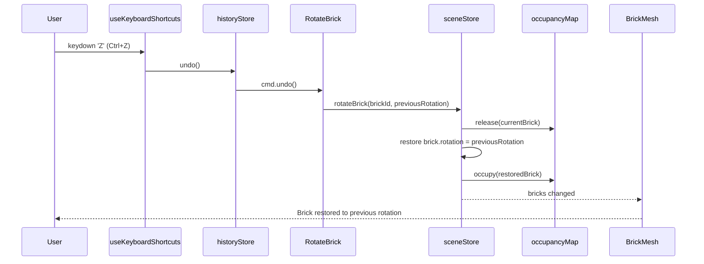
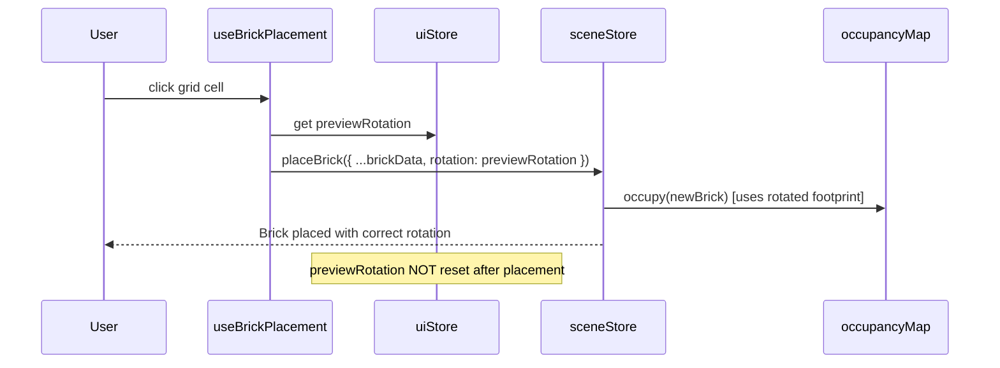

# Low-Level Design: FR-BRICK-004 — Brick Rotation in 90-Degree Increments

**Feature:** FR-BRICK-004
**Issue:** [#15](https://github.com/sreenivasmrpivot/legobuilder/issues/15)
**Author:** Spectra Design Agent
**Status:** Draft — Awaiting Gate 6a Human Review
**Dependencies:** FR-BRICK-001 (#10), FR-BRICK-003 (#12)
**Test Cases:** T-BE-BRICK-004-01, T-BE-BRICK-004-02, T-E2E-BRICK-004-01

---

## 1. Overview

This document defines the low-level design for brick rotation support in the LegoBuilder application. Rotation is constrained to 90-degree increments around the vertical (Y) axis, matching the LEGO building paradigm. Rotation applies to both the placement preview (ghost brick) and already-placed bricks selected in the scene.

The design touches four layers:
1. **Type system** — `BrickRotation` enum and `rotation` field on `PlacedBrick`
2. **Engine** — `RotateBrick` command in `commands.ts`, `gridMath` rotated-footprint helper
3. **State** — `uiStore` (preview rotation), `sceneStore` (per-brick rotation), `occupancyMap` (rotated footprint)
4. **Input** — `useKeyboardShortcuts` hook (R key binding)

---

## 2. Data Models

### 2.1 BrickRotation Enum

```typescript
// frontend/src/types/brick.ts  (addition)
export enum BrickRotation {
  DEG_0   = 0,
  DEG_90  = 90,
  DEG_180 = 180,
  DEG_270 = 270,
}
```

**Rationale:** An enum of integer degree values is human-readable in serialised JSON, maps directly to Three.js `Math.PI / 2` multiples, and prevents invalid rotation states at the type level.

### 2.2 PlacedBrick Type Extension

```typescript
// frontend/src/types/brick.ts  (updated interface)
export interface PlacedBrick {
  id: string;                  // UUID v4
  type: BrickType;             // catalog key (e.g. '2x4')
  position: GridPosition;      // { x, y, z } in stud units
  rotation: BrickRotation;     // NEW — Y-axis rotation (0 | 90 | 180 | 270)
  color: string;               // hex color string
}
```

**Default:** `rotation: BrickRotation.DEG_0` for all newly placed bricks.

### 2.3 GridPosition (unchanged)

```typescript
export interface GridPosition {
  x: number;  // stud column
  y: number;  // layer (height)
  z: number;  // stud row
}
```

### 2.4 Rotated Footprint

For a brick of catalog dimensions `{ studsX: W, studsZ: D }`, the effective footprint at each rotation is:

| Rotation | Effective Width (X) | Effective Depth (Z) |
|----------|--------------------|--------------------|
| 0°       | W                  | D                  |
| 90°      | D                  | W                  |
| 180°     | W                  | D                  |
| 270°     | D                  | W                  |

At 90° and 270° the width and depth are swapped. This is the only geometric transformation needed for the occupancy map.

---

## 3. Component Architecture

```
+----------------------------------------------------------------+
|                        User Input Layer                        |
|  useKeyboardShortcuts.ts  --  R key -->  rotatePreview()       |
|                                     +-->  rotatePlacedBrick()  |
+----------------------------------------------------------------+
                             |
              +--------------v--------------+
              |       Command Layer          |
              |  RotateBrick (commands.ts)   |
              |  execute() / undo()          |
              +--------------+--------------+
                             |
         +-------------------+-------------------+
         |                   |                   |
+--------v--------+ +--------v--------+ +--------v--------+
|   uiStore.ts    | |  sceneStore.ts  | |  occupancyMap   |
| previewRotation | | brick.rotation  | | rotated footprint|
| (BrickRotation) | | (BrickRotation) | | recalculation   |
+--------+--------+ +--------+--------+ +--------+--------+
         |                   |                   |
         +-------------------+-------------------+
                    +--------v--------+
                    |  gridMath.ts    |
                    | getRotatedFootprint()
                    +-----------------+
```

### 3.1 Module Responsibilities

| Module | File | Responsibility |
|--------|------|----------------|
| `BrickRotation` enum | `types/brick.ts` | Type-safe rotation values |
| `RotateBrick` command | `engine/commands.ts` | Encapsulate rotation mutation + undo |
| `getRotatedFootprint()` | `utils/gridMath.ts` | Compute stud cells for rotated brick |
| `uiStore` | `stores/uiStore.ts` | Hold `previewRotation` for ghost brick |
| `sceneStore` | `stores/sceneStore.ts` | Persist `rotation` on each `PlacedBrick` |
| `occupancyMap` | `engine/occupancyMap.ts` | Use rotated footprint for collision detection |
| `useKeyboardShortcuts` | `hooks/useKeyboardShortcuts.ts` | Bind R key to rotation actions |
| `BrickMesh` / `GhostBrick` | `components/viewport/` | Apply `rotation.y` to Three.js mesh |

---

## 4. Interface Contracts

### 4.1 RotateBrick Command

```typescript
// frontend/src/engine/commands.ts

import { Command } from '../types/commands';
import { BrickRotation } from '../types/brick';
import { useSceneStore } from '../stores/sceneStore';

export class RotateBrick implements Command {
  private readonly brickId: string;
  private readonly previousRotation: BrickRotation;
  private readonly nextRotation: BrickRotation;

  constructor(brickId: string, currentRotation: BrickRotation) {
    this.brickId = brickId;
    this.previousRotation = currentRotation;
    this.nextRotation = RotateBrick.nextCW(currentRotation);
  }

  execute(): void {
    useSceneStore.getState().rotateBrick(this.brickId, this.nextRotation);
  }

  undo(): void {
    useSceneStore.getState().rotateBrick(this.brickId, this.previousRotation);
  }

  /** Returns the next 90-degree clockwise rotation */
  static nextCW(rotation: BrickRotation): BrickRotation {
    const sequence: BrickRotation[] = [
      BrickRotation.DEG_0,
      BrickRotation.DEG_90,
      BrickRotation.DEG_180,
      BrickRotation.DEG_270,
    ];
    const idx = sequence.indexOf(rotation);
    return sequence[(idx + 1) % 4];
  }
}
```

**Invariants:**
- `RotateBrick` is immutable after construction — `previousRotation` and `nextRotation` are captured at creation time.
- `undo()` restores the exact previous rotation (not a counter-rotation), making it safe for multi-step undo chains.
- The command does NOT update the occupancy map directly; `sceneStore.rotateBrick()` is responsible for that.

### 4.2 sceneStore — `rotateBrick` Action

```typescript
// frontend/src/stores/sceneStore.ts  (addition)

rotateBrick: (brickId: string, rotation: BrickRotation) => void;

// Implementation sketch:
rotateBrick: (brickId, rotation) => set((state) => {
  const brick = state.bricks.find(b => b.id === brickId);
  if (!brick) return state;

  // 1. Remove old footprint from occupancy map
  state.occupancyMap.release(brick);

  // 2. Update rotation
  const updated = { ...brick, rotation };

  // 3. Re-register rotated footprint
  state.occupancyMap.occupy(updated);

  return {
    bricks: state.bricks.map(b => b.id === brickId ? updated : b),
  };
}),
```

### 4.3 uiStore — Preview Rotation

```typescript
// frontend/src/stores/uiStore.ts  (additions)

interface UIState {
  // ... existing fields ...
  previewRotation: BrickRotation;       // NEW
  rotatePreview: () => void;            // NEW — advances previewRotation by 90 degrees CW
  resetPreviewRotation: () => void;     // NEW — resets to DEG_0 on tool change
}

// Implementation sketch:
previewRotation: BrickRotation.DEG_0,

rotatePreview: () => set((state) => ({
  previewRotation: RotateBrick.nextCW(state.previewRotation),
})),

resetPreviewRotation: () => set({ previewRotation: BrickRotation.DEG_0 }),
```

**Note:** `previewRotation` is NOT persisted to localStorage — it resets to 0° on page reload and on tool deselection.

### 4.4 gridMath — `getRotatedFootprint`

```typescript
// frontend/src/utils/gridMath.ts  (addition)

import { BrickRotation } from '../types/brick';
import { BrickCatalogEntry } from '../engine/brickCatalog';
import { GridPosition } from '../types/brick';

/**
 * Returns the set of stud cells occupied by a brick at the given
 * grid position and rotation.
 *
 * @param origin   - anchor position (top-left stud at 0 and 180 degrees;
 *                   top-right stud at 90 degrees; bottom-right at 270 degrees)
 * @param catalog  - brick catalog entry with studsX and studsZ
 * @param rotation - Y-axis rotation in 90-degree increments
 * @returns        - array of { x, z } stud coordinates
 */
export function getRotatedFootprint(
  origin: GridPosition,
  catalog: BrickCatalogEntry,
  rotation: BrickRotation,
): Array<{ x: number; z: number }> {
  const isSwapped = rotation === BrickRotation.DEG_90
                 || rotation === BrickRotation.DEG_270;
  const w = isSwapped ? catalog.studsZ : catalog.studsX;
  const d = isSwapped ? catalog.studsX : catalog.studsZ;

  const cells: Array<{ x: number; z: number }> = [];
  for (let dx = 0; dx < w; dx++) {
    for (let dz = 0; dz < d; dz++) {
      cells.push({ x: origin.x + dx, z: origin.z + dz });
    }
  }
  return cells;
}
```

**Complexity:** O(W x D) — bounded by the largest brick footprint (max 4x2 = 8 cells in the current catalog).

### 4.5 occupancyMap — Rotated Footprint Integration

```typescript
// frontend/src/engine/occupancyMap.ts  (updated occupy/release)

// Both occupy() and release() must call getRotatedFootprint()
// instead of the current axis-aligned footprint calculation.

occupy(brick: PlacedBrick): void {
  const cells = getRotatedFootprint(
    brick.position,
    getBrickCatalogEntry(brick.type),
    brick.rotation,
  );
  cells.forEach(({ x, z }) => {
    const key = `${x},${brick.position.y},${z}`;
    this.map.set(key, brick.id);
  });
}

release(brick: PlacedBrick): void {
  const cells = getRotatedFootprint(
    brick.position,
    getBrickCatalogEntry(brick.type),
    brick.rotation,
  );
  cells.forEach(({ x, z }) => {
    const key = `${x},${brick.position.y},${z}`;
    this.map.delete(key);
  });
}
```

### 4.6 useKeyboardShortcuts — R Key Binding

```typescript
// frontend/src/hooks/useKeyboardShortcuts.ts  (updated handler)

case 'KeyR': {
  const { selectedBrickId } = useSelectionStore.getState();
  const { activeTool, rotatePreview } = useUIStore.getState();

  if (activeTool === 'place') {
    // Rotate placement preview — no command needed (not undoable)
    rotatePreview();
  } else if (selectedBrickId) {
    // Rotate placed brick — undoable via command pattern
    const brick = useSceneStore.getState().getBrick(selectedBrickId);
    if (brick) {
      const cmd = new RotateBrick(brick.id, brick.rotation);
      useHistoryStore.getState().execute(cmd);
    }
  }
  break;
}
```

**Design decision:** Preview rotation is NOT pushed to the history stack. Only rotation of already-placed bricks is undoable. This matches the UX convention that placement-mode interactions are ephemeral.

### 4.7 Three.js Mesh Rotation

```typescript
// frontend/src/components/viewport/BrickMesh.tsx  (rotation prop)

// Convert BrickRotation enum to Three.js radians:
const rotationY = (brick.rotation * Math.PI) / 180;

// Apply to R3F mesh:
<mesh rotation={[0, rotationY, 0]} ...>
  ...
</mesh>
```

Same pattern applies to `GhostBrick.tsx` using `previewRotation` from `uiStore`.

---

## 5. Sequence Diagrams

### 5.1 Rotate Placement Preview (R key, placement mode)



### 5.2 Rotate Placed Brick (R key, select mode)



### 5.3 Undo Rotation



### 5.4 Placement with Rotated Preview



---

## 6. Error Handling Strategy

| Scenario | Detection | Response |
|----------|-----------|----------|
| `rotateBrick` called with unknown `brickId` | `bricks.find()` returns `undefined` | Early return — no state mutation, no error thrown |
| Invalid rotation value (e.g. 45°) | TypeScript enum prevents at compile time | N/A at runtime; enum exhaustiveness enforced |
| Occupancy conflict after rotation | `occupancyMap.isOccupied()` check | **Not applicable** — rotation does not change the brick's anchor position; conflict check is only needed at placement time. Rotation of a placed brick is always valid. |
| R key pressed with no selection and not in place mode | Guard in `useKeyboardShortcuts` | Silently ignored — no action taken |
| `getBrickCatalogEntry` returns undefined for unknown type | Defensive check in `getRotatedFootprint` | Throw `Error('Unknown brick type: ' + type)` — this is a programming error, not a user error |

**Design decision:** Rotation of a placed brick cannot create a collision because the brick's anchor cell does not move and the occupancy map is updated atomically (release old → occupy new). If the rotated footprint would extend outside the grid boundary, the rotation is still applied (the brick is partially off-grid). A future FR may add boundary clamping.

---

## 7. Security Considerations

| Concern | Risk | Mitigation |
|---------|------|------------|
| Prototype pollution via rotation value | Low — enum values are integers | TypeScript enum prevents arbitrary string injection |
| Denial of service via rapid R key spam | Low — rotation is O(1) per keypress | No debounce needed; browser key-repeat rate is the natural throttle |
| State desync between occupancyMap and sceneStore | Medium — if release/occupy is not atomic | `rotateBrick` in sceneStore performs release + update + occupy in a single Zustand `set()` call, preventing partial state |
| Serialisation of rotation in export/import | Low — integer enum serialises cleanly to JSON | Export schema (FR-EXPORT-001) must include `rotation` field; import must validate it is one of {0, 90, 180, 270} |

---

## 8. Performance Budget

| Operation | Complexity | Expected Latency | Budget |
|-----------|-----------|-----------------|--------|
| `RotateBrick.nextCW()` | O(1) | < 0.01 ms | PASS |
| `getRotatedFootprint()` | O(WxD) <= O(8) | < 0.1 ms | PASS |
| `occupancyMap.release()` + `occupy()` | O(WxD) <= O(8) | < 0.1 ms | PASS |
| Zustand state update + React re-render | O(n) bricks in scene | < 16 ms (1 frame) for <= 500 bricks | PASS |
| Three.js mesh rotation update | O(1) per mesh | < 1 ms | PASS |

Total perceived latency from R keypress to visual update: **< 16 ms** (single animation frame). No Web Worker or deferred rendering needed.

---

## 9. Test Case Mapping

| Test ID | Description | Covered By |
|---------|-------------|------------|
| T-BE-BRICK-004-01 | `RotateBrick.nextCW()` cycles through all 4 rotations and wraps | Unit test on `commands.ts` |
| T-BE-BRICK-004-02 | `getRotatedFootprint()` returns swapped dimensions at 90°/270° | Unit test on `gridMath.ts` |
| T-BE-BRICK-004-02 | `occupancyMap.occupy()` uses rotated footprint correctly | Unit test on `occupancyMap.ts` |
| T-E2E-BRICK-004-01 | User presses R → ghost brick rotates; user places → brick occupies rotated cells | Playwright E2E test |
| T-E2E-BRICK-004-01 | User selects placed brick, presses R → brick rotates in place; Ctrl+Z → rotation undone | Playwright E2E test |

---

## 10. Open Questions & Assumptions

| # | Question | Assumption / Decision |
|---|----------|-----------------------|
| 1 | Should preview rotation persist across brick type changes in the palette? | **Assumption:** Preview rotation resets to 0° when the user selects a different brick type from the palette. `resetPreviewRotation()` is called on palette selection. |
| 2 | Should rotation be included in the undo history for preview rotations? | **Decision:** No. Preview rotation is ephemeral UI state, not a scene mutation. Only placed-brick rotation is undoable. |
| 3 | What is the anchor point for rotation? | **Decision:** The anchor is the top-left stud of the brick at 0°. At 90°, the footprint expands rightward and downward from the same anchor. This matches the `getRotatedFootprint` implementation above. |
| 4 | Does rotation affect stud-connection logic (FR-BRICK-003)? | **Assumption:** Stud connections are determined by the occupancy map footprint, which already uses the rotated footprint. No additional changes to FR-BRICK-003 logic are needed. |
| 5 | Should the export schema (FR-EXPORT-001) include `rotation`? | **Decision:** Yes. The `BrickData` schema in `exportSchema.ts` must add `rotation: z.union([z.literal(0), z.literal(90), z.literal(180), z.literal(270)])`. This is a cross-feature dependency. |
| 6 | Is `BrickRotation` already present in the codebase? | **Assumption:** The scaffold does not yet define `BrickRotation`. This LLD introduces it as a new enum in `types/brick.ts`. |

---

## 11. Files to Create / Modify

| File | Action | Change Summary |
|------|--------|----------------|
| `frontend/src/types/brick.ts` | Modify | Add `BrickRotation` enum; add `rotation: BrickRotation` to `PlacedBrick` |
| `frontend/src/engine/commands.ts` | Modify | Add `RotateBrick` class implementing `Command` |
| `frontend/src/utils/gridMath.ts` | Modify | Add `getRotatedFootprint()` function |
| `frontend/src/engine/occupancyMap.ts` | Modify | Update `occupy()` and `release()` to use `getRotatedFootprint()` |
| `frontend/src/stores/uiStore.ts` | Modify | Add `previewRotation`, `rotatePreview()`, `resetPreviewRotation()` |
| `frontend/src/stores/sceneStore.ts` | Modify | Add `rotateBrick()` action; ensure `placeBrick()` accepts `rotation` |
| `frontend/src/hooks/useKeyboardShortcuts.ts` | Modify | Add R key handler for both placement and selection modes |
| `frontend/src/components/viewport/BrickMesh.tsx` | Modify | Apply `rotation.y` from `brick.rotation` to Three.js mesh |
| `frontend/src/components/viewport/GhostBrick.tsx` | Modify | Apply `rotation.y` from `uiStore.previewRotation` to ghost mesh |
| `frontend/src/engine/exportSchema.ts` | Modify | Add `rotation` field to `BrickData` Zod schema (cross-feature: FR-EXPORT-001) |

---

*Generated by Spectra Design Agent — FR-BRICK-004 — Issue #15*
