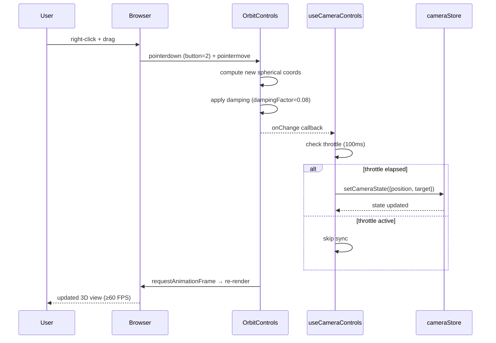
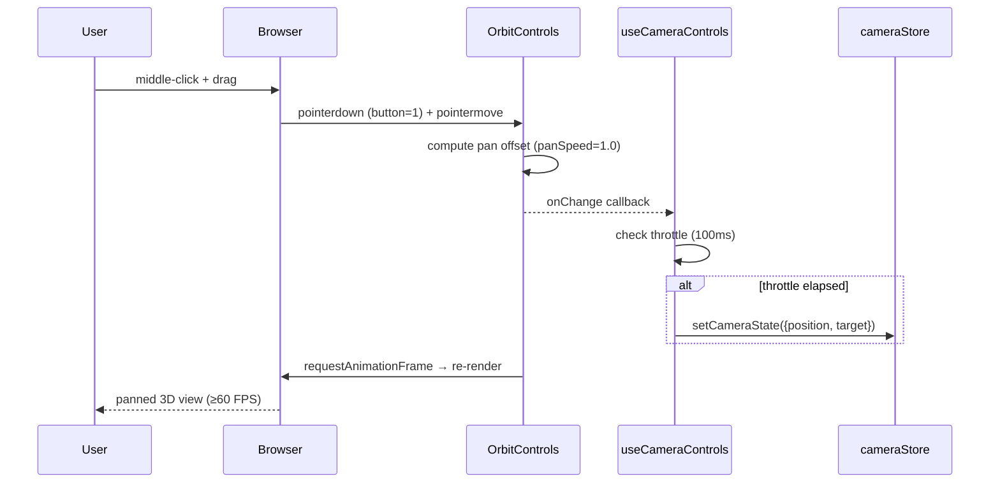
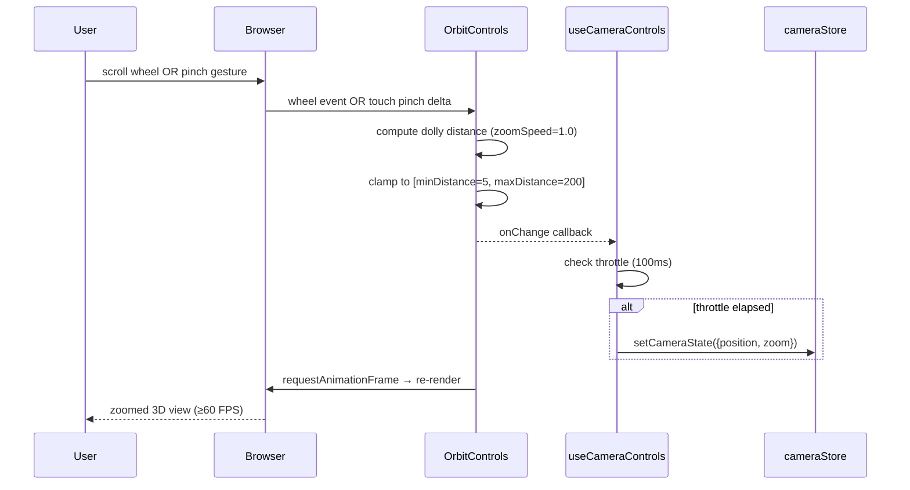
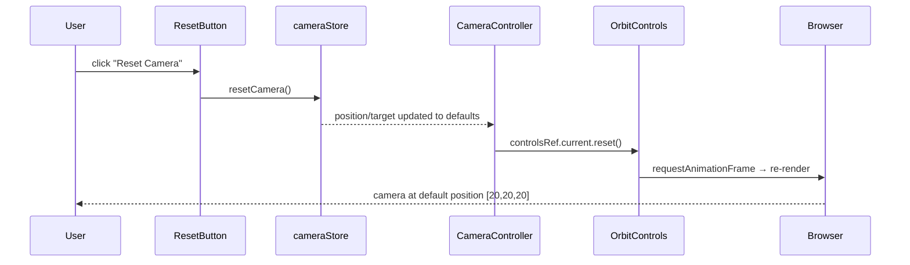

# Low-Level Design: FR-CAM-001
## Implement Orbit, Pan, and Zoom Camera Controls via Mouse and Trackpad

**Feature ID:** FR-CAM-001
**Issue:** [#17](https://github.com/sreenivasmrpivot/legobuilder/issues/17)
**Status:** Draft — Awaiting Gate 6a Design Review
**Author:** Spectra Design Agent
**Date:** 2026-04-11

---

## 1. Overview

This document provides the low-level design for FR-CAM-001: interactive 3D camera controls (orbit, pan, zoom) driven by mouse and trackpad input within the LegoBuilder React Three Fiber (R3F) canvas. The implementation uses `@react-three/drei`'s `OrbitControls` component, a `useCameraControls` custom hook, and a `cameraStore` Zustand slice to persist camera state for reset functionality (FR-CAM-002).

### 1.1 Scope

| In Scope | Out of Scope |
|---|---|
| Orbit (right-click drag / two-finger drag) | Keyboard-driven camera movement |
| Pan (middle-click drag / Shift+two-finger drag) | Touch-only mobile gestures (future FR) |
| Zoom (scroll wheel / pinch gesture) | Camera animation / fly-to transitions |
| ≥60 FPS performance during interaction | Camera collision detection |
| Camera state persistence to `cameraStore` | Server-side camera state sync |
| Trackpad gesture support | VR/AR camera modes |

### 1.2 Dependencies

| Dependency | Type | Notes |
|---|---|---|
| FR-SCENE-001 (Issue #8) | Hard prerequisite | R3F `<Canvas>` and scene must exist before camera controls can be mounted |
| FR-CAM-002 | Downstream consumer | Reads `cameraStore` position/target for reset |
| `@react-three/drei` ≥ 9.x | Library | Provides `OrbitControls` |
| `@react-three/fiber` ≥ 8.x | Library | R3F canvas context |
| `zustand` ≥ 4.x | Library | State management for `cameraStore` |
| `three` ≥ 0.160 | Library | `THREE.Vector3` types |

---

## 2. Component Architecture

### 2.1 Module Map

```
frontend/src/
├── components/
│   └── scene/
│       └── CameraController.tsx        ← NEW: mounts OrbitControls, syncs store
├── hooks/
│   └── useCameraControls.ts            ← NEW: OrbitControls config + event wiring
├── stores/
│   └── cameraStore.ts                  ← NEW: Zustand slice for camera state
├── types/
│   └── camera.ts                       ← NEW: CameraState, CameraConfig interfaces
└── App.tsx                             ← MODIFIED: renders <CameraController> inside <Canvas>
```

### 2.2 Component Responsibilities

| Module | Responsibility | Owns |
|---|---|---|
| `CameraController.tsx` | Mounts `<OrbitControls>` inside R3F Canvas; subscribes to `onChange` to sync camera position/target to `cameraStore` | Rendering, event bridging |
| `useCameraControls.ts` | Returns a typed `OrbitControls` ref and a config object; encapsulates all OrbitControls prop values | Configuration, ref management |
| `cameraStore.ts` | Zustand store slice holding `position`, `target`, `zoom`; exposes `setCameraState`, `resetCamera` actions | State persistence |
| `camera.ts` | TypeScript interfaces `CameraState`, `CameraConfig`, `CameraControlsRef` | Type contracts |
| `App.tsx` | Renders `<CameraController>` as a child of `<Canvas>` | Composition |

### 2.3 TypeScript Interfaces

```typescript
// frontend/src/types/camera.ts

import type { Vector3 } from 'three';

/** Persisted camera state written to cameraStore */
export interface CameraState {
  /** Camera world position [x, y, z] */
  position: [number, number, number];
  /** Orbit target (look-at) world position [x, y, z] */
  target: [number, number, number];
  /** Orthographic zoom factor (perspective: unused, kept for FR-CAM-002 reset) */
  zoom: number;
}

/** Static configuration passed to OrbitControls */
export interface CameraConfig {
  /** Mouse button for orbit: 2 = right-click */
  mouseButtons: {
    LEFT: number | null;
    MIDDLE: number;
    RIGHT: number;
  };
  /** Touch gesture mapping */
  touches: {
    ONE: number;   // TOUCH.ROTATE
    TWO: number;   // TOUCH.DOLLY_PAN
  };
  enableDamping: boolean;
  dampingFactor: number;
  enableZoom: boolean;
  zoomSpeed: number;
  enablePan: boolean;
  panSpeed: number;
  minDistance: number;
  maxDistance: number;
  minPolarAngle: number;  // radians
  maxPolarAngle: number;  // radians
  /** Throttle interval for store sync (ms) */
  syncThrottleMs: number;
}

/** Ref type for the OrbitControls imperative handle */
export type CameraControlsRef = React.RefObject<{
  target: Vector3;
  object: { position: Vector3; zoom: number };
  update: () => void;
  reset: () => void;
}>;
```

### 2.4 Default Camera Configuration

```typescript
// Default values used in useCameraControls.ts
export const DEFAULT_CAMERA_CONFIG: CameraConfig = {
  mouseButtons: {
    LEFT: null,          // Disable left-click orbit (reserved for brick selection)
    MIDDLE: 1,           // MOUSE.PAN  — middle-click drag pans
    RIGHT: 0,            // MOUSE.ROTATE — right-click drag orbits
  },
  touches: {
    ONE: 0,              // TOUCH.ROTATE — single-finger rotate (disabled; reserved for brick drag)
    TWO: 1,              // TOUCH.DOLLY_PAN — two-finger pinch/pan
  },
  enableDamping: true,
  dampingFactor: 0.08,
  enableZoom: true,
  zoomSpeed: 1.0,
  enablePan: true,
  panSpeed: 1.0,
  minDistance: 5,
  maxDistance: 200,
  minPolarAngle: 0,
  maxPolarAngle: Math.PI / 2,  // Prevent camera going below ground plane
  syncThrottleMs: 100,
};
```

---

## 3. Zustand Store: `cameraStore`

### 3.1 Store Slice Definition

```typescript
// frontend/src/stores/cameraStore.ts
import { create } from 'zustand';
import { devtools } from 'zustand/middleware';
import type { CameraState } from '../types/camera';

const DEFAULT_CAMERA_STATE: CameraState = {
  position: [20, 20, 20],
  target:   [0, 0, 0],
  zoom:     1,
};

interface CameraStore extends CameraState {
  /** Overwrite camera state (called from CameraController onChange) */
  setCameraState: (state: Partial<CameraState>) => void;
  /** Restore to DEFAULT_CAMERA_STATE (called by FR-CAM-002 reset button) */
  resetCamera: () => void;
}

export const useCameraStore = create<CameraStore>()(
  devtools(
    (set) => ({
      ...DEFAULT_CAMERA_STATE,
      setCameraState: (partial) => set((s) => ({ ...s, ...partial }), false, 'camera/set'),
      resetCamera:    ()        => set(DEFAULT_CAMERA_STATE, false, 'camera/reset'),
    }),
    { name: 'cameraStore' }
  )
);

export { DEFAULT_CAMERA_STATE };
```

### 3.2 Store State Machine

```
[INITIAL]
  position: [20,20,20]
  target:   [0,0,0]
  zoom:     1
       │
       ▼  setCameraState(partial)
[UPDATED]  ← throttled 100ms from OrbitControls onChange
       │
       ▼  resetCamera()
[INITIAL]  ← triggered by FR-CAM-002 reset button
```

---

## 4. Hook: `useCameraControls`

```typescript
// frontend/src/hooks/useCameraControls.ts
import { useRef, useCallback } from 'react';
import { useCameraStore } from '../stores/cameraStore';
import { DEFAULT_CAMERA_CONFIG } from '../types/camera';
import type { CameraConfig, CameraControlsRef } from '../types/camera';

/**
 * Returns OrbitControls ref and configuration props.
 * Encapsulates all camera control logic outside the component tree.
 */
export function useCameraControls(config: Partial<CameraConfig> = {}) {
  const prefersReducedMotion =
    typeof window !== 'undefined' &&
    window.matchMedia('(prefers-reduced-motion: reduce)').matches;

  const mergedConfig: CameraConfig = {
    ...DEFAULT_CAMERA_CONFIG,
    ...config,
    dampingFactor: prefersReducedMotion ? 0 : DEFAULT_CAMERA_CONFIG.dampingFactor,
  };

  const controlsRef: CameraControlsRef = useRef(null);
  const setCameraState = useCameraStore((s) => s.setCameraState);

  // Throttle ref to avoid excessive store writes
  const lastSyncRef = useRef<number>(0);

  const handleChange = useCallback(() => {
    const now =
      typeof performance !== 'undefined' ? performance.now() : Date.now();
    if (now - lastSyncRef.current < mergedConfig.syncThrottleMs) return;
    lastSyncRef.current = now;

    const controls = controlsRef.current;
    if (!controls) return;

    const { x: px, y: py, z: pz } = controls.object.position;
    const { x: tx, y: ty, z: tz } = controls.target;

    setCameraState({
      position: [px, py, pz],
      target:   [tx, ty, tz],
      zoom:     controls.object.zoom,
    });
  }, [setCameraState, mergedConfig.syncThrottleMs]);

  return { controlsRef, handleChange, config: mergedConfig };
}
```

---

## 5. Component: `CameraController`

```typescript
// frontend/src/components/scene/CameraController.tsx
import React from 'react';
import { OrbitControls } from '@react-three/drei';
import { MOUSE, TOUCH } from 'three';
import { useCameraControls } from '../../hooks/useCameraControls';

/**
 * Mounts OrbitControls inside the R3F Canvas.
 * Must be rendered as a direct child of <Canvas>.
 */
export const CameraController: React.FC = () => {
  const { controlsRef, handleChange, config } = useCameraControls();

  return (
    <OrbitControls
      ref={controlsRef}
      onChange={handleChange}
      mouseButtons={{
        LEFT:   config.mouseButtons.LEFT   ?? undefined,
        MIDDLE: MOUSE.PAN,
        RIGHT:  MOUSE.ROTATE,
      }}
      touches={{
        ONE: TOUCH.ROTATE,
        TWO: TOUCH.DOLLY_PAN,
      }}
      enableDamping={config.enableDamping}
      dampingFactor={config.dampingFactor}
      enableZoom={config.enableZoom}
      zoomSpeed={config.zoomSpeed}
      enablePan={config.enablePan}
      panSpeed={config.panSpeed}
      minDistance={config.minDistance}
      maxDistance={config.maxDistance}
      minPolarAngle={config.minPolarAngle}
      maxPolarAngle={config.maxPolarAngle}
    />
  );
};

export default CameraController;
```

### 5.1 App.tsx Integration

```tsx
// frontend/src/App.tsx (relevant excerpt — MODIFIED)
import { Canvas } from '@react-three/fiber';
import { CameraController } from './components/scene/CameraController';
// ... other imports

function App() {
  return (
    <ErrorBoundary fallback={<SceneErrorFallback />}>
      <Canvas
        camera={{ position: [20, 20, 20], fov: 50 }}
        gl={{ antialias: true }}
      >
        {/* Camera controls — must be inside Canvas */}
        <CameraController />

        {/* Scene content (FR-SCENE-001) */}
        <SceneContent />
      </Canvas>
    </ErrorBoundary>
  );
}
```

---

## 6. Sequence Diagrams

### 6.1 Orbit Interaction (Right-Click Drag)



### 6.2 Pan Interaction (Middle-Click Drag)



### 6.3 Zoom Interaction (Scroll Wheel / Pinch)



### 6.4 Camera Reset (FR-CAM-002 Consumer)



---

## 7. Performance Design

### 7.1 ≥60 FPS Strategy

| Concern | Mitigation |
|---|---|
| Store writes on every frame | Throttle `setCameraState` to 100ms intervals via `performance.now()` |
| React re-renders from store updates | `cameraStore` consumers use selector subscriptions; `CameraController` itself does NOT subscribe to the store (write-only path) |
| OrbitControls damping cost | `dampingFactor: 0.08` — low enough for smooth feel, high enough to converge quickly |
| R3F render loop | OrbitControls integrates with R3F's `useFrame` loop natively — no extra `requestAnimationFrame` calls |
| Garbage collection | `handleChange` is memoized with `useCallback`; no object allocation on hot path |

### 7.2 Performance Budget

| Metric | Target | Measurement Method |
|---|---|---|
| Frame rate during orbit/pan/zoom | ≥ 60 FPS | Chrome DevTools Performance panel, `stats.js` overlay |
| Store sync overhead | < 0.1ms per sync | `performance.mark` around `setCameraState` |
| `handleChange` execution time | < 0.5ms | Vitest benchmark or Chrome profiler |
| Memory allocation per interaction | 0 heap allocations on hot path | Chrome Memory profiler |

---

## 8. Error Handling Strategy

| Scenario | Detection | Handling | User Impact |
|---|---|---|---|
| `controlsRef.current` is null on `onChange` | Null check in `handleChange` | Early return — skip sync | None (controls not yet mounted) |
| `cameraStore` `setCameraState` throws | Zustand internal error | Caught by React error boundary wrapping `<Canvas>` | Scene resets; user sees error toast |
| OrbitControls not available (drei import fails) | Module load error | Vite build fails at compile time | Build-time failure, not runtime |
| Camera goes out of bounds | `minDistance`/`maxDistance` clamp | OrbitControls enforces limits automatically | Camera stops at boundary |
| Trackpad pinch not recognized | Browser compatibility | Fallback to scroll wheel zoom (same event path) | Zoom still works via scroll |
| `performance.now()` unavailable | Feature detection | Fallback to `Date.now()` (no throttle degradation) | Slightly higher store write rate |

### 8.1 Error Boundary

The `<Canvas>` component in `App.tsx` MUST be wrapped in a React Error Boundary. Any runtime error inside the R3F canvas (including `CameraController`) will be caught and display a fallback UI rather than crashing the entire application.

```tsx
<ErrorBoundary fallback={<SceneErrorFallback />}>
  <Canvas ...>
    <CameraController />
    <SceneContent />
  </Canvas>
</ErrorBoundary>
```

---

## 9. Security Considerations

| Concern | Risk | Mitigation |
|---|---|---|
| Prototype pollution via camera state | Low — state is numeric tuples only | TypeScript strict mode enforces `[number, number, number]` type; no dynamic key access |
| XSS via camera position values | None — values are numbers, never rendered as HTML | N/A |
| Denial of service via rapid scroll events | Low — browser throttles wheel events | 100ms sync throttle further limits store write rate |
| Camera state leakage | None — state is client-side only, never sent to server | N/A |
| Dependency supply chain | Medium — drei/fiber are widely used OSS | Pin exact versions in `package.json`; audit with `npm audit` |

---

## 10. Accessibility Considerations

| Requirement | Implementation |
|---|---|
| Keyboard camera navigation | Out of scope for FR-CAM-001; tracked as future enhancement |
| Screen reader announcements | Camera position changes are not announced (visual-only feature) |
| Reduced motion preference | `prefers-reduced-motion`: disable damping (`dampingFactor: 0`) when media query matches |
| Focus management | OrbitControls captures pointer events only; keyboard focus is not affected |
| High contrast | Not applicable to 3D camera controls |

### 10.1 Reduced Motion Implementation

```typescript
// In useCameraControls.ts — already included in Section 4
const prefersReducedMotion =
  typeof window !== 'undefined' &&
  window.matchMedia('(prefers-reduced-motion: reduce)').matches;

const mergedConfig = {
  ...DEFAULT_CAMERA_CONFIG,
  ...config,
  dampingFactor: prefersReducedMotion ? 0 : DEFAULT_CAMERA_CONFIG.dampingFactor,
};
```

---

## 11. Test Case Mapping

| Test ID | Description | Component Under Test | Test Type |
|---|---|---|---|
| T-FE-CAM-001-01 | `useCameraControls` returns correct config with default values; throttle suppresses rapid calls | `useCameraControls` hook | Unit (Vitest + React Testing Library) |
| T-FE-CAM-001-02 | `cameraStore.setCameraState` updates position/target; `resetCamera` restores defaults | `cameraStore` | Unit (Vitest) |
| T-E2E-CAM-001-01 | Right-click drag orbits camera; scroll zooms; middle-click pans; frame rate ≥60 FPS | Full scene in browser | E2E (Playwright) |

### 11.1 Unit Test Sketches

```typescript
// T-FE-CAM-001-01: useCameraControls hook
import { renderHook } from '@testing-library/react';
import { useCameraControls } from '../hooks/useCameraControls';

test('returns default config with correct mouseButtons', () => {
  const { result } = renderHook(() => useCameraControls());
  expect(result.current.config.mouseButtons.RIGHT).toBe(0);   // MOUSE.ROTATE
  expect(result.current.config.mouseButtons.MIDDLE).toBe(1);  // MOUSE.PAN
  expect(result.current.config.mouseButtons.LEFT).toBeNull();
});

test('throttles store sync to syncThrottleMs', () => {
  // Mock performance.now to advance time, call handleChange rapidly,
  // assert setCameraState called only once within throttle window
});
```

```typescript
// T-FE-CAM-001-02: cameraStore
import { useCameraStore, DEFAULT_CAMERA_STATE } from '../stores/cameraStore';

beforeEach(() => useCameraStore.setState(DEFAULT_CAMERA_STATE));

test('setCameraState updates position', () => {
  useCameraStore.getState().setCameraState({ position: [10, 10, 10] });
  expect(useCameraStore.getState().position).toEqual([10, 10, 10]);
});

test('resetCamera restores defaults', () => {
  useCameraStore.getState().setCameraState({ position: [99, 99, 99] });
  useCameraStore.getState().resetCamera();
  expect(useCameraStore.getState().position).toEqual(DEFAULT_CAMERA_STATE.position);
});
```

### 11.2 E2E Test Sketch (Playwright)

```typescript
// T-E2E-CAM-001-01
test('orbit camera with right-click drag', async ({ page }) => {
  await page.goto('/');
  const canvas = page.locator('canvas');

  const initialPos = await page.evaluate(() =>
    (window as any).__zustand_cameraStore?.getState().position
  );

  // Simulate right-click drag
  await canvas.dispatchEvent('pointerdown', { button: 2, clientX: 400, clientY: 300 });
  await canvas.dispatchEvent('pointermove', { button: 2, clientX: 450, clientY: 280 });
  await canvas.dispatchEvent('pointerup',   { button: 2 });
  await page.waitForTimeout(200); // allow throttle + RAF

  const newPos = await page.evaluate(() =>
    (window as any).__zustand_cameraStore?.getState().position
  );
  expect(newPos).not.toEqual(initialPos);
});
```

---

## 12. File Checklist

| File | Action | Notes |
|---|---|---|
| `frontend/src/types/camera.ts` | CREATE | `CameraState`, `CameraConfig`, `CameraControlsRef` interfaces |
| `frontend/src/stores/cameraStore.ts` | CREATE | Zustand slice with `setCameraState`, `resetCamera` |
| `frontend/src/hooks/useCameraControls.ts` | CREATE | Hook returning config, ref, `handleChange` |
| `frontend/src/components/scene/CameraController.tsx` | CREATE | R3F component mounting `<OrbitControls>` |
| `frontend/src/App.tsx` | MODIFY | Add `<CameraController>` inside `<Canvas>`, wrap in `<ErrorBoundary>` |
| `frontend/src/hooks/__tests__/useCameraControls.test.ts` | CREATE | Unit tests for hook |
| `frontend/src/stores/__tests__/cameraStore.test.ts` | CREATE | Unit tests for store |
| `frontend/e2e/camera.spec.ts` | CREATE | Playwright E2E tests |

---

## 13. Open Questions & Risks

| ID | Question | Severity | Owner |
|---|---|---|---|
| OQ-1 | Should LEFT mouse button be permanently disabled for orbit, or configurable per user preference? Current design: LEFT=null (disabled, reserved for brick selection). | Medium | Product |
| OQ-2 | Should single-finger touch rotate the camera or drag bricks? Current design: ONE=TOUCH.ROTATE (reserved for brick interaction — effectively disabled for camera). | High | Product |
| OQ-3 | Is `maxPolarAngle: Math.PI/2` (no camera below ground) the correct constraint, or should users be able to look at the underside of builds? | Low | Product |
| OQ-4 | Should camera state be persisted to IndexedDB (alongside scene state in FR-PERS-001) or remain session-only? Current design: session-only (Zustand in-memory). | Medium | Product |
| OQ-5 | Confirm `@react-three/drei` version pinned in `package.json` supports the `mouseButtons` prop shape used in this design. | High | Engineering |

---

## 14. Alternatives Considered

| Alternative | Reason Rejected |
|---|---|
| `camera-controls` library (yomotsu) | Adds a third-party dependency not already in the stack; `@react-three/drei` OrbitControls is already a project dependency |
| Custom pointer event handler in `useEffect` | Higher implementation complexity; OrbitControls handles cross-browser pointer/touch normalization |
| Left-click for orbit (Three.js default) | Conflicts with brick selection interaction (left-click selects bricks); right-click orbit avoids conflict |
| Zustand `persist` middleware for camera state | Camera position is transient UX state; persisting to localStorage adds complexity without clear user benefit (FR-CAM-002 reset is sufficient) |
| Separate `panStore` and `orbitStore` | Unnecessary split; all camera state is cohesive and consumed together by FR-CAM-002 |

---

*Generated by Spectra Design Agent — Gate 6a approval required before implementation begins.*
