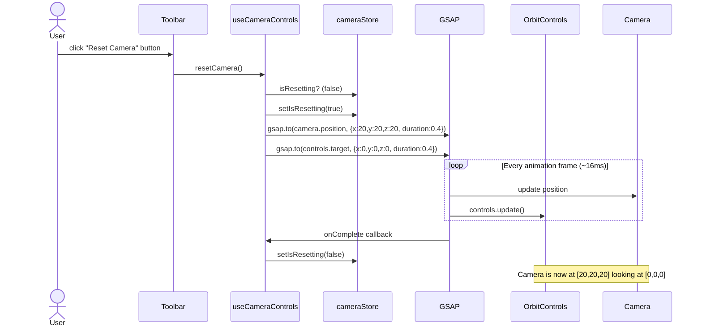
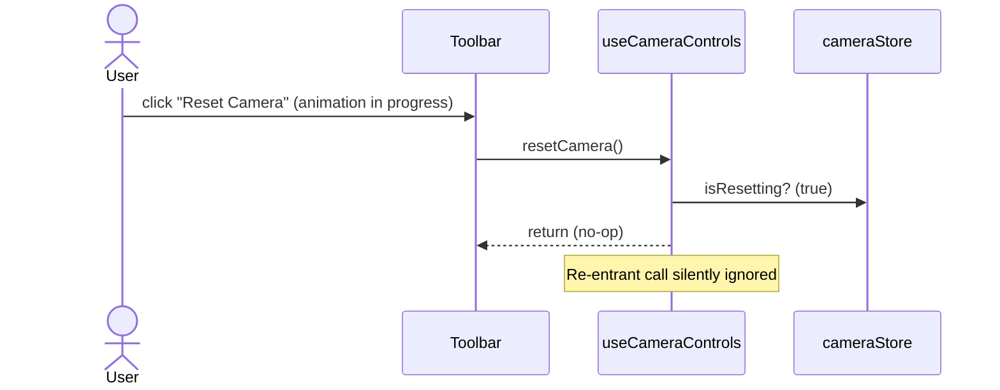
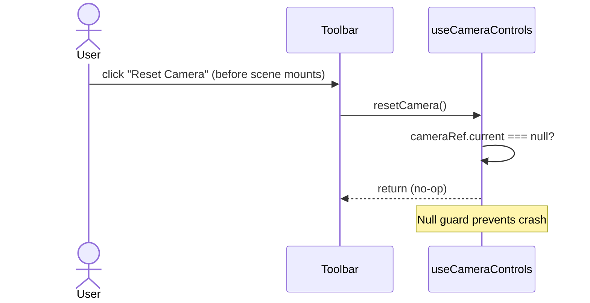

# Low-Level Design: FR-CAM-002 — Reset Camera Button (Default Isometric View)

**Feature ID:** FR-CAM-002
**Issue:** [#18](https://github.com/sreenivasmrpivot/legobuilder/issues/18)
**Title:** Implement Reset Camera button returning to default isometric view
**Author:** Spectra Design Agent
**Status:** Draft — Awaiting Gate 6a Design Review
**Depends On:** FR-CAM-001 (Issue #17) — OrbitControls camera setup

---

## 1. Overview

FR-CAM-002 adds a **Reset Camera** button to the `Toolbar` component that returns the Three.js camera to a predefined default isometric position and orientation with a smooth animated transition (300–500 ms). This helps Casual Builders (persona: Casey) recover from disorienting camera positions without reloading the page.

The feature is **purely frontend** — no backend, no persistence, no network calls. It operates entirely within the React/Three.js/Zustand client-side SPA.

---

## 2. Component Architecture

### 2.1 Component & Module Map

```
frontend/src/
├── components/
│   └── ui/
│       └── Toolbar.tsx              ← ADD: Reset Camera button (UI only)
├── hooks/
│   └── useCameraControls.ts         ← ADD: resetCamera() action
├── stores/
│   └── cameraStore.ts               ← ADD: DEFAULT_ISOMETRIC_POSITION constant
│                                          ADD: DEFAULT_ISOMETRIC_TARGET constant
│                                          ADD: isResetting flag (animation lock)
└── scene/
    └── CameraRig.tsx                ← MODIFY: attach cameraRef + controlsRef
```

### 2.2 Responsibility Matrix

| Module | Responsibility |
|--------|----------------|
| `cameraStore.ts` | Holds `DEFAULT_ISOMETRIC_POSITION`, `DEFAULT_ISOMETRIC_TARGET`, and `isResetting` flag. Single source of truth for camera defaults. |
| `useCameraControls.ts` | Exposes `resetCamera()` action. Reads defaults from `cameraStore`. Drives the GSAP/drei tween. |
| `Toolbar.tsx` | Renders the Reset Camera `<button>`. Calls `useCameraControls().resetCamera()` on click. |
| `CameraRig.tsx` | Hosts the Three.js camera and `OrbitControls` ref. Provides the camera/controls ref to `useCameraControls`. |

---

## 3. TypeScript Interfaces & Types

### 3.1 cameraStore.ts

```typescript
// frontend/src/stores/cameraStore.ts

import { create } from 'zustand';

/** Default isometric camera position (world units). */
export const DEFAULT_ISOMETRIC_POSITION: Readonly<[number, number, number]> = [20, 20, 20];

/** Default OrbitControls target (look-at point). */
export const DEFAULT_ISOMETRIC_TARGET: Readonly<[number, number, number]> = [0, 0, 0];

/** Duration of the reset animation in milliseconds. */
export const CAMERA_RESET_DURATION_MS = 400;

export interface CameraState {
  /** True while a reset animation is in progress — prevents re-entrant resets. */
  isResetting: boolean;
  setIsResetting: (value: boolean) => void;
}

export const useCameraStore = create<CameraState>((set) => ({
  isResetting: false,
  setIsResetting: (value) => set({ isResetting: value }),
}));
```

### 3.2 useCameraControls.ts

```typescript
// frontend/src/hooks/useCameraControls.ts

import { useCallback, useRef } from 'react';
import { Camera } from 'three';
import { OrbitControls as OrbitControlsImpl } from 'three-stdlib';
import gsap from 'gsap';
import {
  DEFAULT_ISOMETRIC_POSITION,
  DEFAULT_ISOMETRIC_TARGET,
  CAMERA_RESET_DURATION_MS,
  useCameraStore,
} from '../stores/cameraStore';

export interface CameraControlsHandle {
  /** Ref to the Three.js Camera instance. */
  cameraRef: React.RefObject<Camera>;
  /** Ref to the OrbitControls instance. */
  controlsRef: React.RefObject<OrbitControlsImpl>;
  /** Animate camera back to default isometric position. */
  resetCamera: () => void;
}

export function useCameraControls(): CameraControlsHandle {
  const cameraRef = useRef<Camera>(null);
  const controlsRef = useRef<OrbitControlsImpl>(null);
  const { isResetting, setIsResetting } = useCameraStore();

  const resetCamera = useCallback(() => {
    if (isResetting) return; // guard against re-entrant calls
    const camera = cameraRef.current;
    const controls = controlsRef.current;
    if (!camera || !controls) return;

    setIsResetting(true);

    const [tx, ty, tz] = DEFAULT_ISOMETRIC_TARGET;
    const [px, py, pz] = DEFAULT_ISOMETRIC_POSITION;

    const prefersReducedMotion = window.matchMedia(
      '(prefers-reduced-motion: reduce)'
    ).matches;
    const durationSec = prefersReducedMotion ? 0 : CAMERA_RESET_DURATION_MS / 1000;

    // Tween camera position
    gsap.to(camera.position, {
      x: px,
      y: py,
      z: pz,
      duration: durationSec,
      ease: 'power2.inOut',
      onUpdate: () => {
        controls.update();
      },
      onComplete: () => {
        setIsResetting(false);
      },
      onInterrupt: () => {
        setIsResetting(false); // safety net — unlock state if tween is killed
      },
    });

    // Tween OrbitControls target (parallel, same duration)
    gsap.to(controls.target, {
      x: tx,
      y: ty,
      z: tz,
      duration: durationSec,
      ease: 'power2.inOut',
    });
  }, [isResetting, setIsResetting]);

  return { cameraRef, controlsRef, resetCamera };
}
```

### 3.3 Toolbar.tsx (relevant addition)

```typescript
// frontend/src/components/ui/Toolbar.tsx

import { useCameraControls } from '../../hooks/useCameraControls';

export function Toolbar() {
  const { resetCamera } = useCameraControls();

  return (
    <div role="toolbar" aria-label="Scene toolbar">
      {/* ... existing toolbar items ... */}
      <button
        type="button"
        onClick={resetCamera}
        aria-label="Reset camera to default isometric view"
        title="Reset Camera"
        data-testid="reset-camera-btn"
      >
        Reset Camera
      </button>
    </div>
  );
}
```

---

## 4. Data Models

No persistent data models are required. All camera state is ephemeral (in-memory Three.js objects and Zustand store). The relevant constants are:

| Constant | Value | Description |
|----------|-------|-------------|
| `DEFAULT_ISOMETRIC_POSITION` | `[20, 20, 20]` | Camera world position for isometric view |
| `DEFAULT_ISOMETRIC_TARGET` | `[0, 0, 0]` | OrbitControls look-at target |
| `CAMERA_RESET_DURATION_MS` | `400` | Animation duration (within 300–500 ms spec) |

> **Note:** The exact values for `DEFAULT_ISOMETRIC_POSITION` must be validated against the scene scale established in FR-CAM-001. The LLD uses `[20, 20, 20]` as a representative isometric position; the implementation team should confirm this matches the FR-CAM-001 approved defaults.

---

## 5. Sequence Diagrams

### 5.1 Happy Path — User Clicks Reset Camera



### 5.2 Re-entrant Guard — User Clicks Reset During Animation



### 5.3 Null Guard — Camera/Controls Not Yet Mounted



---

## 6. Animation Strategy

### 6.1 Chosen Approach: GSAP Tween

The issue technical notes list two options:
1. `@react-three/drei` camera animation utilities (e.g., `CameraControls` with `setLookAt`)
2. GSAP tween on camera position/target

**Decision: GSAP tween** is selected for the following reasons:

| Criterion | GSAP | drei CameraControls |
|-----------|------|---------------------|
| Fine-grained easing control | Yes — `power2.inOut`, `elastic`, etc. | Limited |
| Works with existing OrbitControls | Yes — direct ref manipulation | Replaces OrbitControls |
| Bundle size impact | Minimal (tree-shakeable) | Larger |
| Testability | Yes — mock `gsap.to` in Vitest | Harder to mock |

> **Fallback:** If GSAP is not already a project dependency, use `@react-three/drei`'s `CameraControls` component with `cameraControlsRef.current.setLookAt(px, py, pz, tx, ty, tz, true)` where the last `true` enables animation. The implementation team should confirm GSAP availability before coding.

### 6.2 Easing

- Easing function: `power2.inOut` (smooth acceleration and deceleration)
- Duration: `400ms` (midpoint of the 300–500 ms spec range)
- Both `camera.position` and `controls.target` tweens run in parallel with identical duration/easing for a coherent motion

### 6.3 Frame Synchronization

GSAP's default ticker runs on `requestAnimationFrame`. The `onUpdate` callback calls `controls.update()` to keep OrbitControls in sync with the tweened camera position on every frame.

---

## 7. Hook & Store Contract

This feature has no REST API endpoints (pure frontend). The public contract is the hook and store interface:

### `useCameraControls()` Hook

| Export | Type | Description |
|--------|------|-------------|
| `cameraRef` | `React.RefObject<Camera>` | Ref attached to the Three.js `<PerspectiveCamera>` |
| `controlsRef` | `React.RefObject<OrbitControlsImpl>` | Ref attached to `<OrbitControls>` |
| `resetCamera()` | `() => void` | Triggers animated reset to default isometric view |

### `cameraStore` Zustand Slice

| Export | Type | Description |
|--------|------|-------------|
| `DEFAULT_ISOMETRIC_POSITION` | `readonly [number, number, number]` | Default camera position constant |
| `DEFAULT_ISOMETRIC_TARGET` | `readonly [number, number, number]` | Default look-at target constant |
| `CAMERA_RESET_DURATION_MS` | `number` | Animation duration constant |
| `useCameraStore().isResetting` | `boolean` | True while reset animation is in progress |
| `useCameraStore().setIsResetting` | `(v: boolean) => void` | Setter for `isResetting` |

---

## 8. Error Handling Strategy

| Scenario | Detection | Handling |
|----------|-----------|----------|
| `cameraRef.current` is null (scene not mounted) | Null check at start of `resetCamera()` | Silent no-op; no error thrown |
| `controlsRef.current` is null | Null check at start of `resetCamera()` | Silent no-op; no error thrown |
| Re-entrant reset call (animation in progress) | `isResetting` flag check | Silent no-op; button click ignored |
| GSAP tween throws (unexpected) | GSAP internal error | `onInterrupt` callback calls `setIsResetting(false)` to unlock state |
| GSAP not available (import error) | TypeScript compile error | Build fails fast; fallback to drei approach |

---

## 9. Security Considerations

| Concern | Assessment | Mitigation |
|---------|------------|------------|
| XSS via camera position values | Not applicable — values are hardcoded constants, not user input | N/A |
| Prototype pollution via GSAP | GSAP tweens plain object properties; no `__proto__` manipulation | Use GSAP >= 3.x (patched) |
| Denial of service via rapid button clicks | Re-entrant guard (`isResetting` flag) prevents animation storm | Implemented in `resetCamera()` |
| Dependency supply chain | GSAP is a well-maintained library | Pin to specific semver in `package.json` |

---

## 10. Accessibility Considerations

| Requirement | Implementation |
|-------------|----------------|
| Button is keyboard-focusable | Native `<button>` element (focusable by default) |
| Screen reader label | `aria-label="Reset camera to default isometric view"` |
| Tooltip for sighted users | `title="Reset Camera"` |
| Focus not lost after click | Button remains in DOM; focus stays on button after click |
| Animation respects `prefers-reduced-motion` | Check `window.matchMedia('(prefers-reduced-motion: reduce)')` and set `duration: 0` if true |
| Test ID for automation | `data-testid="reset-camera-btn"` |

---

## 11. State Machine

```
            +------------------------------------------+
            |         IDLE (isResetting=false)         |
            +------------------+-----------------------+
                               | User clicks Reset Camera
                               v
            +------------------------------------------+
            |      ANIMATING (isResetting=true)        |
            |  GSAP tweening position + target         |
            +------------------+-----------------------+
                               | onComplete / onInterrupt
                               v
            +------------------------------------------+
            |         IDLE (isResetting=false)         |
            +------------------------------------------+

  Re-entrant click while ANIMATING -> no-op (stays in ANIMATING)
  Null guard (no camera/controls)  -> no-op (stays in IDLE)
```

---

## 12. Test Case Mapping

| Test ID | Description | Covered By |
|---------|-------------|------------|
| T-FE-CAM-002-01 | Reset Camera button returns camera to default isometric position with smooth animation | `useCameraControls.test.ts` + `Toolbar.test.tsx` |

### Unit Test Scenarios (Vitest)

| Scenario | File | Assertion |
|----------|------|-----------|
| `resetCamera()` calls `gsap.to` with correct position args | `useCameraControls.test.ts` | `expect(gsap.to).toHaveBeenCalledWith(camera.position, expect.objectContaining({ x: 20, y: 20, z: 20 }))` |
| `resetCamera()` calls `gsap.to` with correct target args | `useCameraControls.test.ts` | `expect(gsap.to).toHaveBeenCalledWith(controls.target, expect.objectContaining({ x: 0, y: 0, z: 0 }))` |
| `resetCamera()` sets `isResetting=true` then `false` on complete | `useCameraControls.test.ts` | Check store state transitions |
| Re-entrant call is no-op when `isResetting=true` | `useCameraControls.test.ts` | `gsap.to` called only once |
| Null guard: no-op when `cameraRef.current` is null | `useCameraControls.test.ts` | `gsap.to` not called |
| Reset Camera button renders with correct `aria-label` | `Toolbar.test.tsx` | `getByRole('button', { name: /reset camera/i })` |
| Reset Camera button click calls `resetCamera()` | `Toolbar.test.tsx` | `userEvent.click(btn)` -> mock called |
| Animation duration is 0 when `prefers-reduced-motion` is set | `useCameraControls.test.ts` | Mock `window.matchMedia` -> duration 0 |

---

## 13. Dependency on FR-CAM-001

FR-CAM-002 depends on FR-CAM-001 (Issue #17) for:

1. **`OrbitControls` setup** — FR-CAM-001 establishes the `<OrbitControls>` component and its ref pattern in `CameraRig.tsx`. FR-CAM-002 reuses this ref via `useCameraControls`.
2. **`CameraRig.tsx` structure** — FR-CAM-002 assumes `CameraRig.tsx` exposes `cameraRef` and `controlsRef` (or a context/hook that provides them).
3. **Default position values** — The `DEFAULT_ISOMETRIC_POSITION` constant should be consistent with the initial camera position set in FR-CAM-001. If FR-CAM-001 defines its own initial position constant, FR-CAM-002 should import and reuse it rather than defining a duplicate.

> **Implementation note:** Before coding FR-CAM-002, confirm the ref-sharing pattern from FR-CAM-001. If FR-CAM-001 uses a React Context to share `cameraRef`/`controlsRef`, `useCameraControls` should consume that context rather than creating new refs.

---

## 14. File Change Summary

| File | Change Type | Description |
|------|-------------|-------------|
| `frontend/src/stores/cameraStore.ts` | CREATE or MODIFY | Add `DEFAULT_ISOMETRIC_POSITION`, `DEFAULT_ISOMETRIC_TARGET`, `CAMERA_RESET_DURATION_MS`, `CameraState` interface, `useCameraStore` |
| `frontend/src/hooks/useCameraControls.ts` | CREATE | New hook exposing `cameraRef`, `controlsRef`, `resetCamera()` |
| `frontend/src/components/ui/Toolbar.tsx` | MODIFY | Add Reset Camera `<button>` wired to `useCameraControls().resetCamera()` |
| `frontend/src/scene/CameraRig.tsx` | MODIFY | Attach `cameraRef` and `controlsRef` from `useCameraControls` (or expose via context) |
| `frontend/src/hooks/useCameraControls.test.ts` | CREATE | Unit tests for `resetCamera()` logic |
| `frontend/src/components/ui/Toolbar.test.tsx` | CREATE or MODIFY | Unit tests for Reset Camera button render + click |

---

## 15. Open Questions for Human Review

| # | Question | Impact | Severity |
|---|----------|--------|----------|
| 1 | What are the exact `DEFAULT_ISOMETRIC_POSITION` values from FR-CAM-001? | Determines the reset target coordinates | HIGH |
| 2 | Is GSAP already a project dependency, or should `@react-three/drei` `CameraControls` be used instead? | Determines animation implementation path | HIGH |
| 3 | Does FR-CAM-001 expose `cameraRef`/`controlsRef` via a React Context, or should `useCameraControls` own the refs? | Determines ref-sharing architecture | HIGH |
| 4 | Should the Reset Camera button be disabled (visually) while `isResetting=true`, or just silently ignore clicks? | UX decision | MEDIUM |
| 5 | Should `prefers-reduced-motion` skip animation entirely (instant snap) or use a very short duration (50ms)? | Accessibility decision | MEDIUM |
