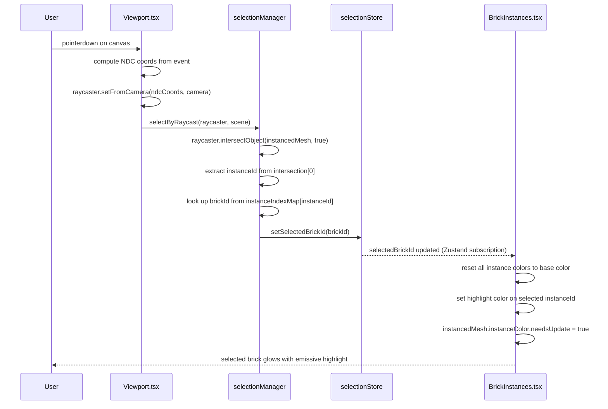
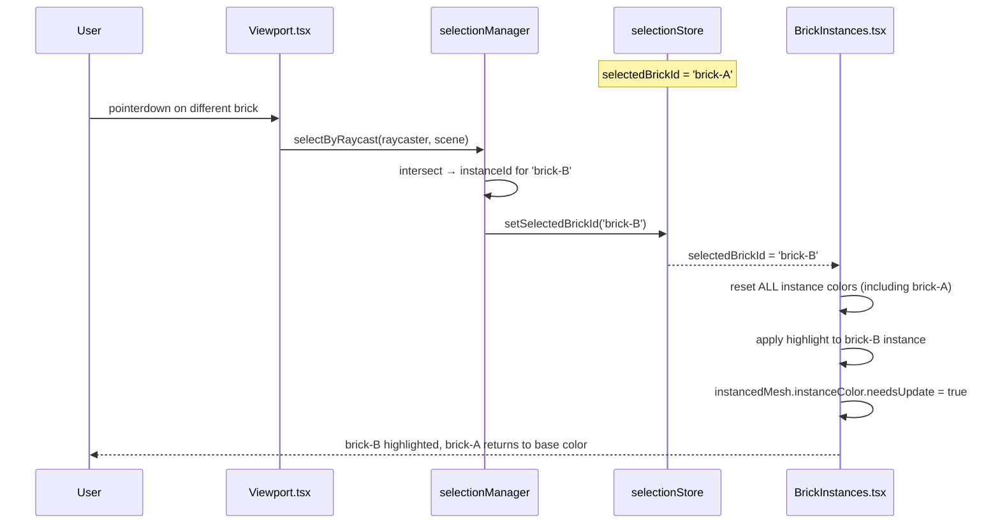
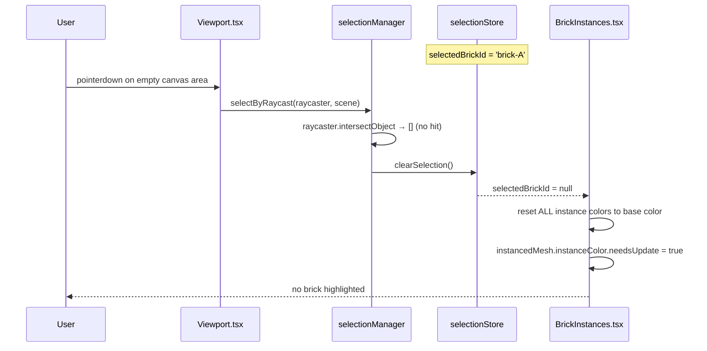
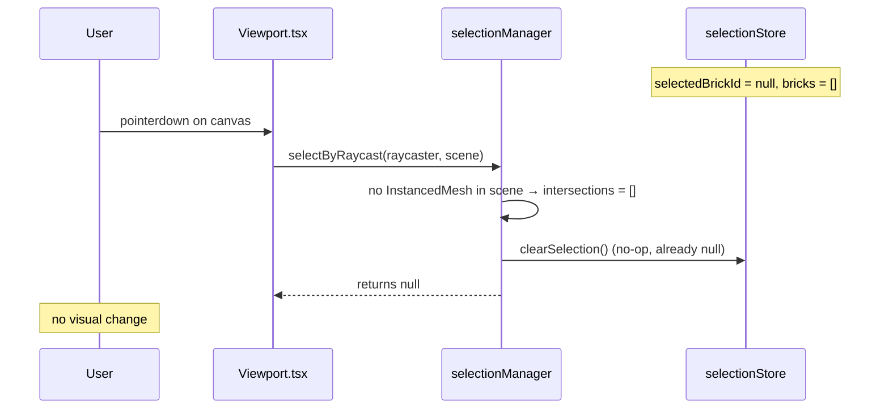

# Low-Level Design: FR-EDIT-001 — Brick Selection by Click with Visual Highlight

**Feature:** FR-EDIT-001  
**Issue:** #13  
**Status:** Draft — Awaiting Gate 6a Design Review  
**Author:** Spectra Design Agent  
**Date:** 2026-04-11  
**Dependencies:** FR-SCENE-003 (BVH raycast, #9), FR-SCENE-002 (InstancedMesh scene, #7)

---

## 1. Overview

This document defines the low-level design for brick selection by click with visual highlight in the LegoBuilder 3D viewport. When a user clicks on a brick in the Three.js/R3F scene, the system must:

1. Perform a BVH-accelerated raycast to identify the clicked brick instance.
2. Update the `selectionStore` with the selected brick ID.
3. Apply a visual highlight (emissive color change on the `InstancedMesh`) to the selected instance.
4. Clear the previous selection highlight when a new brick is clicked or empty space is clicked.

This feature is the prerequisite for delete, rotate, and all other editing operations.

---

## 2. Component Architecture

### 2.1 Module Map

```
frontend/src/
├── engine/
│   └── selectionManager.ts          ← Core selection logic (MODIFIED)
├── stores/
│   └── selectionStore.ts            ← Zustand store for selectedBrickId (MODIFIED)
├── components/
│   └── viewport/
│       ├── Viewport.tsx              ← R3F Canvas host, click handler (MODIFIED)
│       └── BrickInstances.tsx        ← InstancedMesh renderer + highlight (NEW)
└── hooks/
    └── useSelection.ts              ← React hook bridging store → component (NEW)
```

### 2.2 Dependency Graph

```
Viewport.tsx
  └── onClick (pointer event)
        └── selectionManager.selectByRaycast(raycaster, scene)
              ├── BVH raycast → instanceId
              └── selectionStore.setSelectedBrickId(brickId | null)
                    └── BrickInstances.tsx (subscribes via useSelection)
                          └── InstancedMesh color attribute update
```

### 2.3 Existing Scaffolds to Modify

| File | Current State | Required Change |
|------|--------------|----------------|
| `engine/selectionManager.ts` | Stub scaffold | Implement `selectByRaycast`, `clearSelection` |
| `stores/selectionStore.ts` | Stub scaffold | Implement `setSelectedBrickId`, `clearSelection`, `selectedBrickId` state |
| `components/viewport/Viewport.tsx` | R3F Canvas stub | Add `onPointerDown` handler dispatching to `selectionManager` |

### 2.4 New Files to Create

| File | Purpose |
|------|--------|
| `components/viewport/BrickInstances.tsx` | Renders all bricks as `InstancedMesh`; applies emissive highlight to selected instance |
| `hooks/useSelection.ts` | Subscribes to `selectionStore`; exposes `selectedBrickId`, `selectBrick`, `clearSelection` |

---

## 3. Interface Contracts

### 3.1 `SelectionManagerInterface`

```typescript
// frontend/src/engine/selectionManager.ts

import type { Raycaster, Scene } from 'three';
import type { SelectionStore } from '../stores/selectionStore';

export interface SelectionManagerInterface {
  /**
   * Perform BVH raycast against the scene. If a brick instance is hit,
   * call selectionStore.setSelectedBrickId(brickId). If no brick is hit,
   * call selectionStore.clearSelection().
   *
   * @param raycaster - Three.js Raycaster configured with pointer NDC coords
   * @param scene     - The R3F/Three.js scene root
   * @returns         - The brick ID that was selected, or null if cleared
   */
  selectByRaycast(raycaster: Raycaster, scene: Scene): string | null;

  /**
   * Programmatically clear the current selection.
   * Calls selectionStore.clearSelection().
   */
  clearSelection(): void;
}

// Dependency injection interface for the store
export interface SelectionStoreAccessor {
  getSelectedBrickId(): string | null;
  setSelectedBrickId(id: string): void;
  clearSelection(): void;
}
```

### 3.2 `SelectionStore` (Zustand)

```typescript
// frontend/src/stores/selectionStore.ts

import { create } from 'zustand';

export interface SelectionState {
  /** The ID of the currently selected brick, or null if nothing is selected */
  selectedBrickId: string | null;

  /** Select a brick by its ID. Replaces any existing selection. */
  setSelectedBrickId: (id: string) => void;

  /** Clear the current selection. */
  clearSelection: () => void;
}

export const useSelectionStore = create<SelectionState>((set) => ({
  selectedBrickId: null,
  setSelectedBrickId: (id) => set({ selectedBrickId: id }),
  clearSelection: () => set({ selectedBrickId: null }),
}));
```

### 3.3 `useSelection` Hook

```typescript
// frontend/src/hooks/useSelection.ts

export interface UseSelectionReturn {
  /** Currently selected brick ID, or null */
  selectedBrickId: string | null;
  /** Select a brick by ID */
  selectBrick: (id: string) => void;
  /** Clear the selection */
  clearSelection: () => void;
}
```

### 3.4 `BrickInstances` Component Props

```typescript
// frontend/src/components/viewport/BrickInstances.tsx

export interface BrickInstancesProps {
  /** Array of all placed bricks from sceneStore */
  bricks: PlacedBrick[];
  /** Currently selected brick ID from selectionStore (null = no selection) */
  selectedBrickId: string | null;
}
```

---

## 4. Data Models

### 4.1 `PlacedBrick` (existing type — `frontend/src/types/brick.ts`)

```typescript
export interface PlacedBrick {
  id: string;           // UUID — used as the selection key
  type: string;         // Brick catalog type ID
  position: {           // Grid-snapped world position
    x: number;
    y: number;
    z: number;
  };
  rotation: number;     // Y-axis rotation in steps of 90° (0 | 1 | 2 | 3)
  color: string;        // Hex color string, e.g. '#FF0000'
}
```

### 4.2 Selection State Shape

```typescript
// Stored in selectionStore (Zustand)
{
  selectedBrickId: string | null   // null = no selection
}
```

### 4.3 InstancedMesh Instance Index Mapping

The `BrickInstances` component maintains an internal mapping:

```typescript
// Internal to BrickInstances.tsx — not persisted
type InstanceIndexMap = Map<string, number>; // brickId → instanceIndex
```

This map is rebuilt whenever the `bricks` array changes. It is used to:
1. Set the `Matrix4` for each instance (position + rotation).
2. Look up the instance index when applying the highlight color.

---

## 5. Sequence Diagrams

### 5.1 Happy Path — User Clicks a Brick



### 5.2 User Clicks a Different Brick (Re-selection)



### 5.3 User Clicks Empty Space (Clear Selection)



### 5.4 Empty Scene — No Bricks to Select



---

## 6. Selection Algorithm

### 6.1 Raycast Hit Detection

```
Input:  PointerEvent (clientX, clientY), camera, canvas bounds
Output: brickId: string | null

1. Compute NDC (Normalized Device Coordinates):
   ndcX = (clientX / canvas.width)  * 2 - 1
   ndcY = (clientY / canvas.height) * -2 + 1

2. Configure raycaster:
   raycaster.setFromCamera({ x: ndcX, y: ndcY }, camera)

3. Raycast against InstancedMesh (BVH-accelerated via three-mesh-bvh):
   intersections = raycaster.intersectObject(brickInstancedMesh, false)

4. If intersections.length === 0:
   → clearSelection() → return null

5. Extract instance index:
   instanceId = intersections[0].instanceId  // Three.js provides this

6. Look up brick ID:
   brickId = instanceIndexMap.get(instanceId)
   if brickId === undefined → clearSelection() → return null

7. setSelectedBrickId(brickId) → return brickId
```

### 6.2 Visual Highlight Algorithm

```
Input:  selectedBrickId: string | null, bricks: PlacedBrick[], instanceIndexMap
Output: InstancedMesh instanceColor buffer updated

1. For each brick in bricks:
   instanceIndex = instanceIndexMap.get(brick.id)
   baseColor = new THREE.Color(brick.color)
   instancedMesh.setColorAt(instanceIndex, baseColor)

2. If selectedBrickId !== null:
   selectedIndex = instanceIndexMap.get(selectedBrickId)
   highlightColor = new THREE.Color(brick.color).multiplyScalar(HIGHLIGHT_FACTOR)
   // HIGHLIGHT_FACTOR = 1.8 (brightens the base color)
   // Clamp to [0, 1] per channel — THREE.Color handles this
   instancedMesh.setColorAt(selectedIndex, highlightColor)

3. instancedMesh.instanceColor.needsUpdate = true
```

**Highlight Strategy:** Multiply the brick's base color by `HIGHLIGHT_FACTOR = 1.8` to produce a brightened variant. This avoids a fixed highlight color that may clash with certain brick colors. The factor is a named constant in `BrickInstances.tsx` for easy tuning.

**Alternative considered:** Post-processing outline pass (e.g., `@react-three/postprocessing` `OutlineEffect`). Rejected for v1 because it requires an additional render pass and adds bundle weight. The color-multiply approach is zero-cost and sufficient for the acceptance criteria.

---

## 7. Error Handling Strategy

### 7.1 Error Conditions

| Condition | Detection | Handling |
|-----------|-----------|----------|
| `instanceId` is `undefined` in intersection | `intersections[0].instanceId === undefined` | Log warning, call `clearSelection()`, return `null` |
| `brickId` not found in `instanceIndexMap` | `instanceIndexMap.get(instanceId) === undefined` | Log warning, call `clearSelection()`, return `null` |
| `InstancedMesh` not yet mounted when click fires | `brickInstancedMesh` ref is `null` | Early return from handler, no-op |
| `instanceColor` buffer not initialized | `instancedMesh.instanceColor === null` | Initialize buffer before first use in `useEffect` |
| Stale `instanceIndexMap` (bricks changed mid-click) | Map rebuilt on every `bricks` change via `useMemo` | Map is always fresh before render |

### 7.2 Error Logging

All warnings use the prefix `[selectionManager]` for easy filtering:

```typescript
console.warn('[selectionManager] instanceId undefined in intersection — clearing selection');
console.warn('[selectionManager] brickId not found for instanceId', instanceId);
```

No user-facing error messages are required for selection failures — the system silently clears the selection.

---

## 8. Security Considerations

| Concern | Risk | Mitigation |
|---------|------|------------|
| Prototype pollution via `brickId` | Low — IDs are UUIDs generated internally, never from user text input | Validate UUID format before storing in `selectionStore` |
| XSS via brick color string | Low — color is a hex string from the brick catalog | Validate hex format (`/^#[0-9A-Fa-f]{6}$/`) before passing to `THREE.Color` |
| Denial of service via rapid click spam | Low — each click is O(log N) BVH raycast | No additional throttling needed for v1; revisit if perf degrades |
| Unauthorized selection of hidden bricks | N/A — all bricks in the scene are user-placed and visible | No access control needed |

---

## 9. Performance Budget

| Metric | Target | Rationale |
|--------|--------|----------|
| Raycast latency (500 bricks) | ≤ 2 ms | BVH reduces from O(N) to O(log N); measured on mid-range GPU |
| Color buffer update (500 bricks) | ≤ 1 ms | Single `instanceColor` buffer write; GPU upload is async |
| React re-render on selection change | 0 full re-renders | `BrickInstances` uses `useRef` for `InstancedMesh`; color update bypasses React reconciler |
| Frame rate impact | < 1 fps drop | Color buffer update is a single GPU upload per frame |
| Bundle size impact | 0 KB | No new dependencies; uses existing Three.js APIs |

**Key design decision:** The highlight update is performed imperatively on the `InstancedMesh` ref (bypassing React state) to avoid triggering a full re-render of the brick instances on every selection change. Only `selectionStore.selectedBrickId` changes trigger a Zustand subscription callback, which calls the imperative update directly.

---

## 10. Component Interaction Detail

### 10.1 `Viewport.tsx` — Click Handler

```typescript
// Pseudocode — implementation detail for coding agent
const handlePointerDown = useCallback((event: ThreeEvent<PointerEvent>) => {
  // Only handle primary button (left click)
  if (event.button !== 0) return;

  // Stop propagation to prevent OrbitControls from consuming the event
  // when the user intends to select, not orbit
  // NOTE: OrbitControls and selection share the same canvas;
  // use a short drag-distance threshold to distinguish orbit from click.
  if (isDragGesture(event)) return;

  selectionManager.selectByRaycast(raycaster, scene);
}, [raycaster, scene]);
```

**Drag vs. Click Disambiguation:**  
A pointer movement of > 4px between `pointerdown` and `pointerup` is classified as a drag (orbit gesture) and does NOT trigger selection. This threshold is stored as `DRAG_THRESHOLD_PX = 4` in `Viewport.tsx`.

### 10.2 `BrickInstances.tsx` — Highlight Subscription

```typescript
// Pseudocode — implementation detail for coding agent
useEffect(() => {
  const unsubscribe = useSelectionStore.subscribe(
    (state) => state.selectedBrickId,
    (selectedBrickId) => {
      applyHighlight(meshRef.current, bricks, instanceIndexMap, selectedBrickId);
    }
  );
  return unsubscribe;
}, [bricks, instanceIndexMap]);
```

The subscription uses Zustand's selector-based subscribe (not `useStore` hook) to avoid React re-renders. The `applyHighlight` function is a pure imperative function that writes directly to the `instanceColor` buffer.

---

## 11. Test Case Mapping

| Test ID | Description | Component Under Test |
|---------|-------------|---------------------|
| T-BE-EDIT-001-01 | `selectByRaycast` returns correct `brickId` when intersection hits a brick instance | `selectionManager.ts` |
| T-BE-EDIT-001-02 | `selectByRaycast` returns `null` and calls `clearSelection` when no intersection | `selectionManager.ts` |
| T-BE-EDIT-001-03 | `selectionStore.setSelectedBrickId` updates state; `clearSelection` resets to `null` | `selectionStore.ts` |
| T-E2E-EDIT-001-01 | Playwright: click brick → highlight visible; click different brick → previous unhighlighted; click empty → all unhighlighted | `Viewport.tsx` + `BrickInstances.tsx` |

---

## 12. Open Questions & Assumptions

| # | Question | Assumption | Impact |
|---|----------|------------|--------|
| 1 | Does FR-SCENE-003 (BVH raycast, #9) expose a shared `InstancedMesh` ref or does each feature manage its own? | Assumption: `BrickInstances.tsx` owns the `InstancedMesh` ref and passes it to `selectionManager` via a DI accessor | If FR-SCENE-003 owns the mesh, the interface contract must be updated |
| 2 | Is `three-mesh-bvh` already a project dependency? | Assumption: Yes — referenced in FR-SCENE-003 technical notes | If not, must be added to `package.json` before implementation |
| 3 | Should selection be cleared on Escape key press? | Assumption: Yes — standard UX pattern; implement in `useKeyboardShortcuts.ts` scaffold | Low impact; can be deferred to a follow-up FR |
| 4 | Should `HIGHLIGHT_FACTOR = 1.8` be user-configurable? | Assumption: No — hardcoded constant for v1 | Low impact |
| 5 | Does OrbitControls conflict with click selection on the same canvas? | Assumption: Yes — use `DRAG_THRESHOLD_PX = 4` to disambiguate | Must be validated during implementation |
| 6 | Is `PlacedBrick.rotation` an integer step (0–3) or a radian value? | Assumption: Integer step (0 \| 1 \| 2 \| 3) × 90° based on existing type scaffold | Must align with FR-SCENE-002 LLD |

---

## 13. File Change Summary

| File | Action | Reason |
|------|--------|--------|
| `frontend/src/engine/selectionManager.ts` | Modify | Implement `selectByRaycast` and `clearSelection` |
| `frontend/src/stores/selectionStore.ts` | Modify | Implement full Zustand store with `setSelectedBrickId` and `clearSelection` |
| `frontend/src/components/viewport/Viewport.tsx` | Modify | Add `onPointerDown` handler with drag-vs-click disambiguation |
| `frontend/src/components/viewport/BrickInstances.tsx` | Create | New InstancedMesh renderer with imperative highlight subscription |
| `frontend/src/hooks/useSelection.ts` | Create | New hook bridging `selectionStore` to React components |
