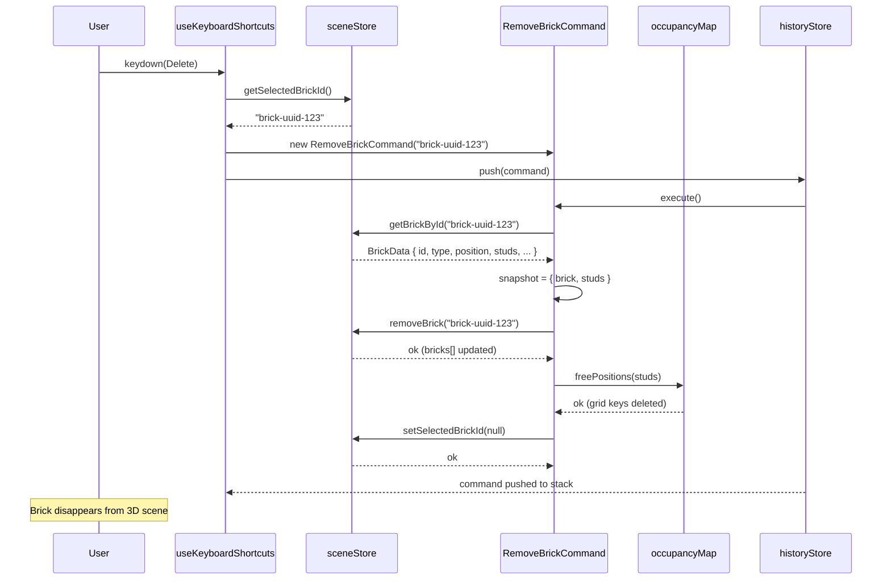
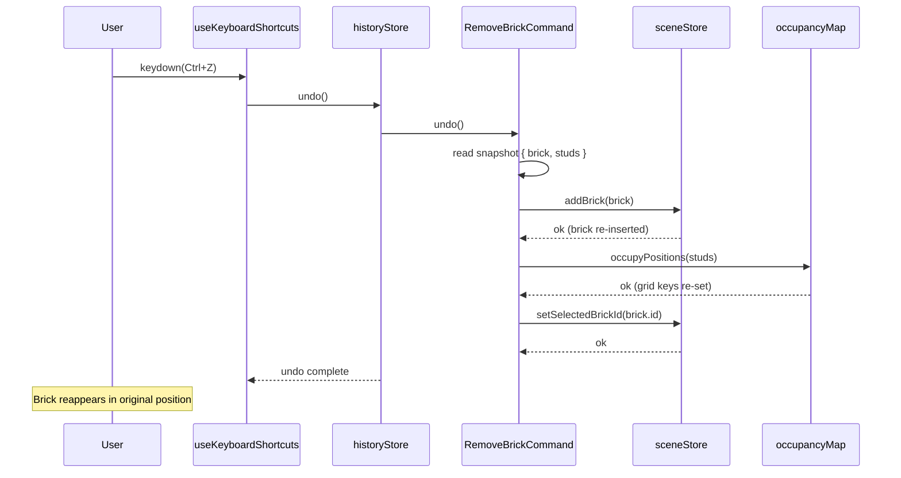
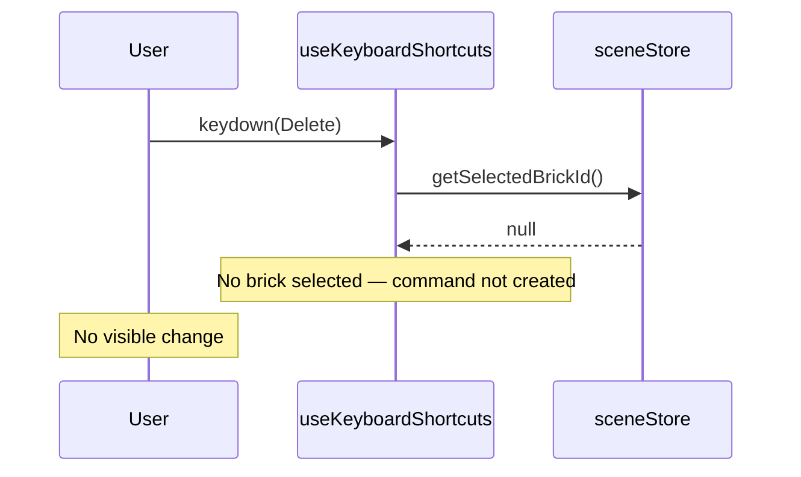
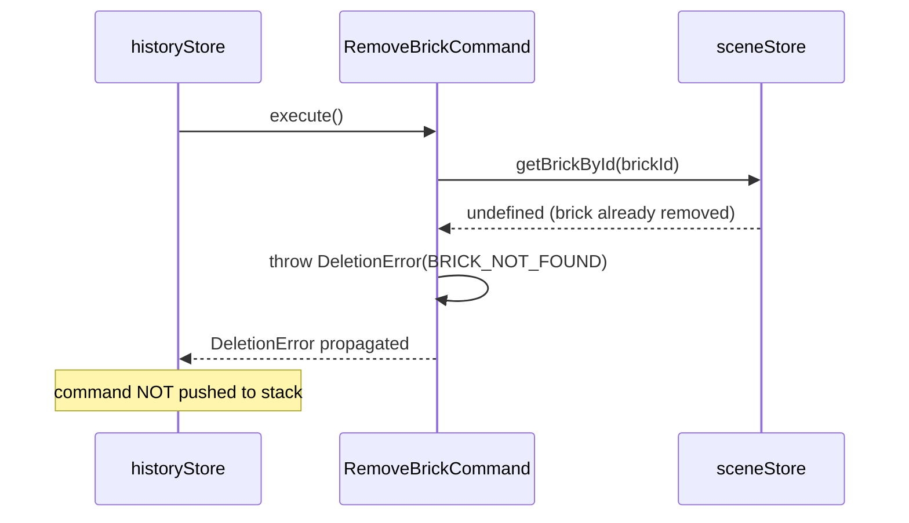

# Low-Level Design: FR-EDIT-002 — Brick Deletion with Occupancy Map Cleanup

**Feature ID:** FR-EDIT-002  
**Issue:** [#14](https://github.com/sreenivasmrpivot/legobuilder/issues/14)  
**Author:** Spectra Design Agent  
**Status:** Draft — Awaiting Gate 6a Human Review  
**Dependencies:** FR-BRICK-001 (Issue #10), FR-EDIT-001 (SelectBrick feature)

---

## 1. Overview

FR-EDIT-002 enables users to delete a selected brick from the 3D scene by pressing the `Delete` key. Deletion is implemented as a reversible `RemoveBrick` command following the Command Pattern already established in the codebase. The command atomically removes the brick from `sceneStore` and frees its stud positions in `occupancyMap`. Undo re-adds the brick and re-occupies those positions. The feature integrates with `historyStore` for undo/redo stack management and `useKeyboardShortcuts` for key binding.

### Scope
- **In scope:** `RemoveBrick` command, keyboard shortcut binding, `sceneStore` removal, `occupancyMap` cleanup, undo/redo integration.
- **Out of scope:** Multi-brick deletion, right-click context menu deletion, redo after new action (handled by `historyStore` generically).

---

## 2. Component Architecture

### 2.1 Module Map

```
frontend/src/
├── commands/
│   └── commands.ts              ← ADD: RemoveBrickCommand class
├── hooks/
│   └── useKeyboardShortcuts.ts  ← MODIFY: bind Delete key → execute RemoveBrickCommand
├── stores/
│   ├── sceneStore.ts            ← MODIFY: add removeBrick(id) and getBrickById(id) actions
│   ├── occupancyMap.ts          ← MODIFY: add freePositions(studs[]) action
│   └── historyStore.ts          ← NO CHANGE: generic push(command) already exists
└── types/
    └── brick.ts                 ← NO CHANGE: BrickData type already defined
```

### 2.2 Component Dependency Graph

```
useKeyboardShortcuts
        │  Delete key event
        ▼
 RemoveBrickCommand
   ├── execute()  ──► sceneStore.removeBrick(id)
   │                  occupancyMap.freePositions(studs)
   └── undo()    ──► sceneStore.addBrick(brick)
                     occupancyMap.occupyPositions(studs)
        │
        ▼
  historyStore.push(command)
```

### 2.3 Interface Contracts

#### `ICommand` (existing)
```typescript
interface ICommand {
  execute(): void;
  undo(): void;
}
```

#### `RemoveBrickCommand` (new)
```typescript
class RemoveBrickCommand implements ICommand {
  private readonly brickId: string;
  private snapshot: BrickData | null = null;   // captured at execute() time
  private studsSnapshot: StudPosition[] = [];  // captured at execute() time

  constructor(brickId: string) {
    this.brickId = brickId;
  }

  execute(): void;
  undo(): void;
}
```

#### `SceneStoreActions` additions
```typescript
interface SceneStoreActions {
  // existing
  addBrick(brick: BrickData): void;
  getBricks(): BrickData[];
  getSelectedBrickId(): string | null;
  setSelectedBrickId(id: string | null): void;

  // new for FR-EDIT-002
  removeBrick(id: string): void;              // removes brick from bricks[] array; no-op if not found
  getBrickById(id: string): BrickData | undefined;  // selector for command snapshot
}
```

#### `OccupancyMapActions` additions
```typescript
interface OccupancyMapActions {
  // existing
  occupyPositions(studs: StudPosition[]): void;
  isOccupied(stud: StudPosition): boolean;

  // new for FR-EDIT-002
  freePositions(studs: StudPosition[]): void;  // marks stud positions as unoccupied
}
```

#### `HistoryStoreActions` (existing — no change)
```typescript
interface HistoryStoreActions {
  push(command: ICommand): void;
  undo(): void;
  redo(): void;
  canUndo(): boolean;
  canRedo(): boolean;
}
```

---

## 3. Data Models

### 3.1 BrickData (existing — from FR-BRICK-001)
```typescript
interface BrickData {
  id: string;              // UUID, unique per brick
  type: string;            // e.g. "2x4", "1x2"
  position: Vector3Like;   // { x: number; y: number; z: number }
  rotation: EulerLike;     // { x: number; y: number; z: number } in radians
  color: string;           // hex color string e.g. "#FF0000"
  studs: StudPosition[];   // pre-computed stud grid positions occupied by this brick
}
```

### 3.2 StudPosition (existing)
```typescript
interface StudPosition {
  x: number;  // grid column
  z: number;  // grid row (depth)
  y: number;  // layer (height)
}
```

### 3.3 OccupancyMap internal structure (existing)
```typescript
// Key: `${x},${y},${z}` string  →  Value: brickId string | undefined
type OccupancyGrid = Map<string, string>;
```

### 3.4 DeletionSnapshot (runtime only — not persisted)
```typescript
// Captured inside execute() before mutation:
interface DeletionSnapshot {
  brick: BrickData;          // full brick data for undo re-insertion
  studs: StudPosition[];     // stud positions to free / re-occupy
}
```

---

## 4. Detailed Logic

### 4.1 `RemoveBrickCommand.execute()`

```
1. brickId = this.brickId
2. brick = sceneStore.getBrickById(brickId)   // throws DeletionError if not found
3. studs = brick.studs                         // capture stud positions
4. this.snapshot = { brick, studs }            // store for undo
5. sceneStore.removeBrick(brickId)             // remove from bricks[]
6. occupancyMap.freePositions(studs)           // mark positions free
7. sceneStore.setSelectedBrickId(null)         // deselect
```

### 4.2 `RemoveBrickCommand.undo()`

```
1. if (this.snapshot === null) throw DeletionError("undo called before execute")
2. { brick, studs } = this.snapshot
3. sceneStore.addBrick(brick)                  // re-insert at original position
4. occupancyMap.occupyPositions(studs)         // re-mark positions occupied
5. sceneStore.setSelectedBrickId(brick.id)     // re-select restored brick
```

### 4.3 `sceneStore.removeBrick(id)`

```
1. bricks = get().bricks
2. index = bricks.findIndex(b => b.id === id)
3. if (index === -1) return  // no-op: brick already gone (idempotent)
4. set({ bricks: bricks.filter(b => b.id !== id) })
```

### 4.4 `occupancyMap.freePositions(studs)`

```
1. for each stud in studs:
     key = `${stud.x},${stud.y},${stud.z}`
     occupancyGrid.delete(key)
```

### 4.5 `useKeyboardShortcuts` — Delete key binding

```
1. Listen for keydown event on window
2. if (event.key === 'Delete' || event.key === 'Backspace'):
     selectedId = sceneStore.getSelectedBrickId()
     if (selectedId === null) return  // nothing selected, ignore
     command = new RemoveBrickCommand(selectedId)
     historyStore.push(command)        // push() calls execute() internally
3. event.preventDefault()             // prevent browser back-navigation on Backspace
```

---

## 5. Sequence Diagrams

### 5.1 Happy Path — Delete Key Pressed with Selected Brick



### 5.2 Undo Path — User Presses Ctrl+Z



### 5.3 No-Op Path — Delete Key Pressed with No Selection



### 5.4 Error Path — Brick Not Found at Execute Time



---

## 6. Error Handling Strategy

### 6.1 `DeletionError` Class

```typescript
export class DeletionError extends Error {
  constructor(
    public readonly code: DeletionErrorCode,
    message: string
  ) {
    super(message);
    this.name = 'DeletionError';
  }
}

export type DeletionErrorCode =
  | 'BRICK_NOT_FOUND'      // getBrickById returned undefined
  | 'UNDO_BEFORE_EXECUTE'  // undo() called before execute()
  | 'STALE_SNAPSHOT';      // snapshot studs no longer match occupancyMap state
```

### 6.2 Error Conditions & Handling

| Condition | Error Code | Handling | User Visible? |
|-----------|-----------|----------|---------------|
| Delete pressed, no brick selected | — | Silent no-op in `useKeyboardShortcuts` | No |
| `getBrickById` returns undefined at execute time | `BRICK_NOT_FOUND` | Throw `DeletionError`; command not pushed to history | No (console.warn) |
| `undo()` called before `execute()` | `UNDO_BEFORE_EXECUTE` | Throw `DeletionError`; historyStore catches and logs | No (console.error) |
| `freePositions` called with empty studs array | — | No-op (loop over empty array) | No |
| `removeBrick` called with unknown id | — | Idempotent no-op (findIndex returns -1) | No |

### 6.3 Global Error Boundary

Any uncaught `DeletionError` propagates to the React error boundary already present in the app shell. The error boundary displays a generic "Something went wrong" toast and logs to console. No crash recovery is needed for deletion errors — the scene state remains consistent because mutations are atomic (execute either completes fully or throws before any mutation).

---

## 7. Security Considerations

| Concern | Risk | Mitigation |
|---------|------|------------|
| Prototype pollution via `brickId` | Low — `brickId` is a UUID string used as a Map key | Validate `brickId` matches UUID regex before command creation |
| Denial of service via rapid Delete key spam | Low — each deletion is O(studs) ≈ O(8) operations | Debounce keyboard handler at 50 ms |
| Stale closure capturing wrong `selectedBrickId` | Medium — React hook closure may capture stale state | Read `selectedBrickId` from store at event time, not from closure |
| Undo stack memory growth | Low — each snapshot is one `BrickData` object (~200 bytes) | `historyStore` already caps stack at N commands (verify cap exists) |
| XSS via brick `color` or `type` field in error messages | Low — error messages are console-only, not rendered to DOM | Never interpolate brick fields into rendered HTML |

---

## 8. Performance Budget

| Operation | Expected Complexity | Target Latency | Notes |
|-----------|-------------------|----------------|-------|
| `removeBrick(id)` | O(n) where n = brick count | < 1 ms for n ≤ 500 | Array filter; acceptable |
| `freePositions(studs)` | O(s) where s = stud count | < 0.1 ms for s ≤ 8 | Map.delete per stud |
| `execute()` end-to-end | O(n + s) | < 2 ms | Synchronous; no async needed |
| `undo()` end-to-end | O(n + s) | < 2 ms | Synchronous; addBrick is O(1) append |
| Keyboard event handler | O(1) | < 0.5 ms | Guard clause exits early if no selection |

No Web Worker or async processing is required. All operations are synchronous and well within the 16 ms frame budget.

---

## 9. Test Case Mapping

| Test ID | Description | Covered By |
|---------|-------------|------------|
| T-BE-EDIT-002-01 | `RemoveBrickCommand.execute()` removes brick from `sceneStore` and frees occupancy | Unit test on `RemoveBrickCommand` |
| T-BE-EDIT-002-02 | `RemoveBrickCommand.undo()` re-adds brick and re-occupies positions | Unit test on `RemoveBrickCommand` |
| T-E2E-EDIT-001-01 | End-to-end: place brick → select → press Delete → brick gone; Ctrl+Z → brick back | Playwright/Cypress E2E test |

### 9.1 Unit Test Scenarios (T-BE-EDIT-002-01)

```
Given: sceneStore has brick B with studs [S1, S2, S3, S4]
       occupancyMap has S1..S4 marked occupied by B.id
When:  RemoveBrickCommand(B.id).execute()
Then:  sceneStore.getBricks() does not contain B
       occupancyMap.isOccupied(S1) === false
       occupancyMap.isOccupied(S2) === false
       sceneStore.getSelectedBrickId() === null
```

### 9.2 Unit Test Scenarios (T-BE-EDIT-002-02)

```
Given: RemoveBrickCommand(B.id) has been executed (snapshot captured)
When:  command.undo()
Then:  sceneStore.getBricks() contains B at original position
       occupancyMap.isOccupied(S1) === true
       sceneStore.getSelectedBrickId() === B.id
```

### 9.3 E2E Test Scenario (T-E2E-EDIT-001-01)

```
Given: User has placed a 2x4 brick at position (0,0,0)
When:  User clicks the brick (selects it)
       User presses Delete key
Then:  Brick mesh is removed from Three.js scene
       Occupancy grid positions are free (verified via store inspection)
When:  User presses Ctrl+Z
Then:  Brick mesh reappears at (0,0,0)
       Occupancy grid positions are re-occupied
```

---

## 10. Open Questions & Assumptions

| # | Question | Assumption Made | Impact |
|---|----------|-----------------|--------|
| 1 | Does `historyStore.push()` call `execute()` internally, or does the caller call `execute()` first? | Assumed `push()` calls `execute()` (common Command Pattern variant) | If caller calls `execute()` first, snapshot is captured before push — adjust `useKeyboardShortcuts` accordingly |
| 2 | Does `BrickData` include a `studs: StudPosition[]` field, or must studs be computed from `position`, `type`, and `rotation`? | Assumed `studs` is a pre-computed field on `BrickData` (set at brick creation time in FR-BRICK-001) | If studs must be computed, add a `computeStuds(brick)` utility and call it in `execute()` |
| 3 | Should `Backspace` also trigger deletion (for Mac users)? | Yes — bind both `Delete` and `Backspace` with `event.preventDefault()` to avoid browser back-navigation | If Backspace should not trigger deletion, remove that binding |
| 4 | Is there a maximum undo stack depth in `historyStore`? | Assumed yes (e.g., 50 commands) — verify the cap exists to prevent unbounded memory growth | If no cap, add one in `historyStore` |
| 5 | Does `sceneStore` expose `getBrickById(id)` or only `getBricks()`? | Assumed `getBrickById` exists or can be derived as `getBricks().find(b => b.id === id)` | If only `getBricks()` exists, implement `getBrickById` as a selector |
| 6 | Should deletion deselect the brick before or after removing it from the scene? | Deselect after removal (step 7 in execute()) to avoid a frame where a deleted brick is still "selected" | Adjust order if UI flicker is observed |
