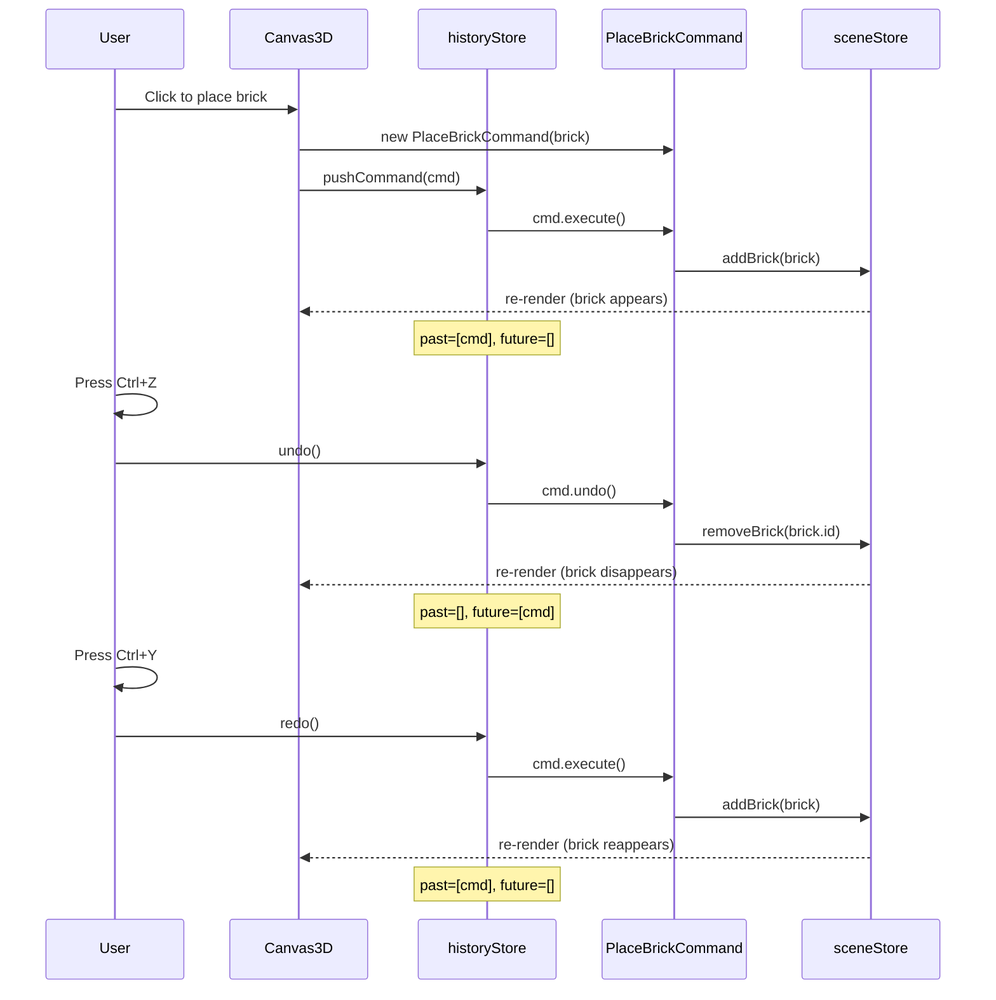
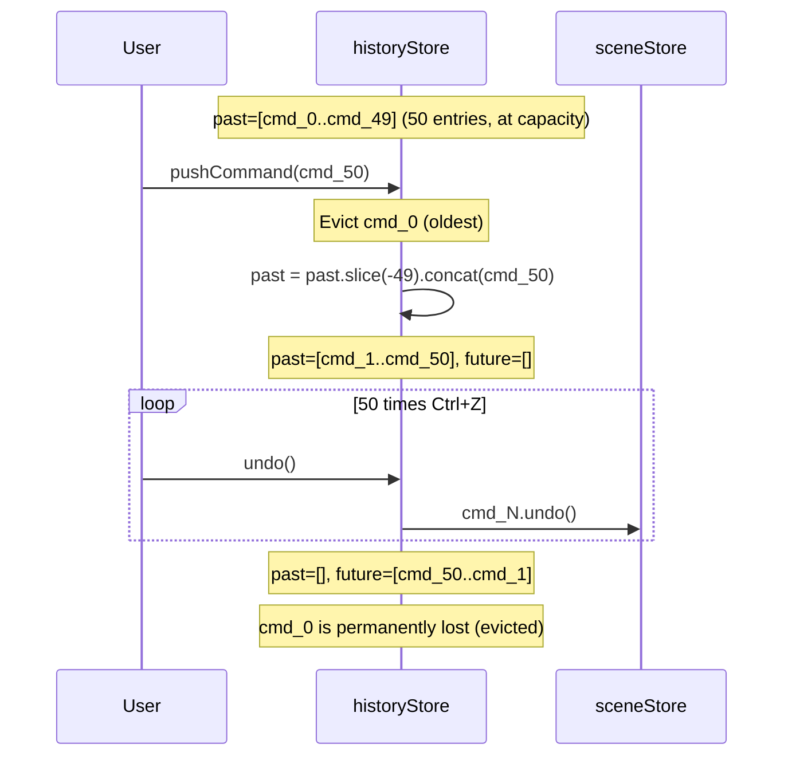
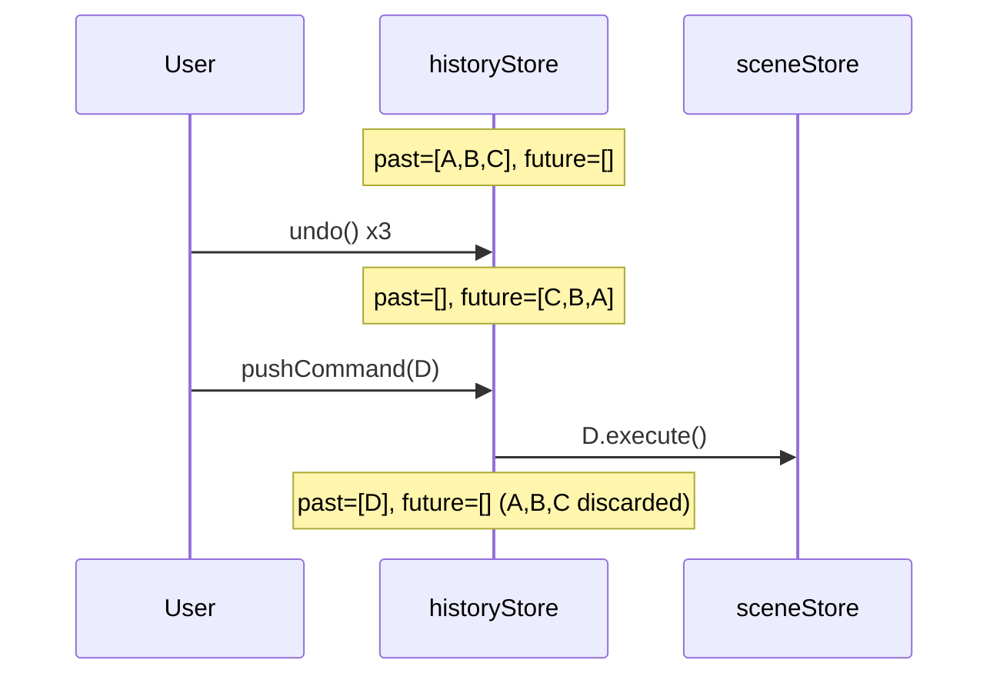
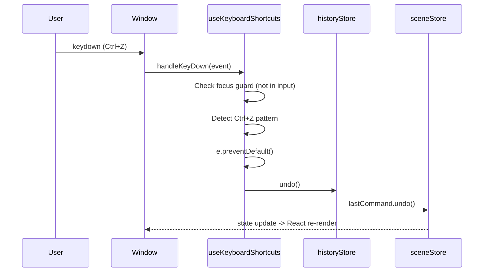
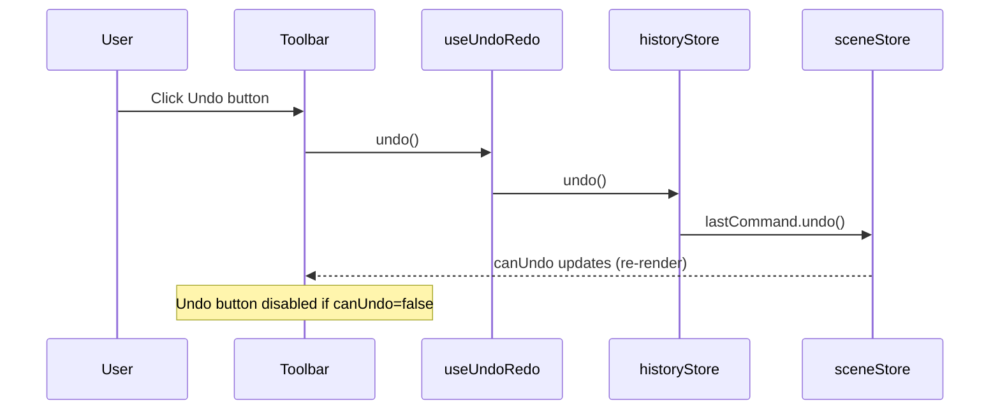

# Low-Level Design: FR-EDIT-003 — Undo/Redo with Command Pattern (50-Level History)

**Feature ID:** FR-EDIT-003
**Issue:** [#16](https://github.com/sreenivasmrpivot/legobuilder/issues/16)
**Author:** Spectra Design Agent
**Status:** Draft — Awaiting Gate 6a Design Review
**Area:** Frontend
**Dependencies:** FR-EDIT-001 (#14), FR-EDIT-002 (#15)

---

## Table of Contents

1. [Overview](#1-overview)
2. [Component Architecture](#2-component-architecture)
3. [TypeScript Interfaces & Types](#3-typescript-interfaces--types)
4. [Data Models & State](#4-data-models--state)
5. [Command Implementations](#5-command-implementations)
6. [historyStore Contract](#6-historystore-contract)
7. [useUndoRedo Hook](#7-useundoredo-hook)
8. [Keyboard Shortcut Integration](#8-keyboard-shortcut-integration)
9. [Sequence Diagrams](#9-sequence-diagrams)
10. [Error Handling Strategy](#10-error-handling-strategy)
11. [Security Considerations](#11-security-considerations)
12. [Performance Considerations](#12-performance-considerations)
13. [Test Case Mapping](#13-test-case-mapping)
14. [Open Questions](#14-open-questions)

---

## 1. Overview

FR-EDIT-003 implements a **Command Pattern**-based undo/redo system for the LEGO Builder application. Every user action that mutates the scene (place brick, delete brick, rotate brick) is encapsulated as a reversible `ICommand` object. A bounded history stack (max 50 entries) is maintained in Zustand's `historyStore`. The system follows a **linear history model**: performing a new action after an undo discards the redo stack.

### Design Goals

| Goal | Approach |
|------|----------|
| Full reversibility of all scene mutations | `ICommand.execute()` / `ICommand.undo()` contract |
| 50-level bounded history | Circular-buffer-style `past[]` capped at `MAX_HISTORY = 50` |
| Keyboard-driven UX | `useKeyboardShortcuts` handles Ctrl+Z / Ctrl+Y / Ctrl+Shift+Z |
| Linear history (no branching) | New action after undo clears `future[]` |
| Zero external dependencies | Pure TypeScript + Zustand — no additional libraries |

### File Map

| File | Role |
|------|------|
| `frontend/src/engine/commands.ts` | `ICommand` interface + all concrete command classes |
| `frontend/src/stores/historyStore.ts` | Zustand store — `past[]`, `future[]`, `pushCommand`, `undo`, `redo` |
| `frontend/src/hooks/useUndoRedo.ts` | React hook exposing `undo`, `redo`, `canUndo`, `canRedo` |
| `frontend/src/hooks/useKeyboardShortcuts.ts` | Keyboard event listener — Ctrl+Z, Ctrl+Y, Ctrl+Shift+Z |
| `frontend/src/stores/sceneStore.ts` | Scene state mutated by commands (bricks map) |

---

## 2. Component Architecture

```
+----------------------------------------------------------------+
|                        React UI Layer                           |
|  +--------------+  +--------------+  +----------------------+  |
|  |  Toolbar     |  |  Canvas3D    |  |  useKeyboardShortcuts|  |
|  |  (Undo/Redo  |  |  (brick      |  |  (Ctrl+Z / Ctrl+Y)  |  |
|  |   buttons)   |  |   events)    |  +----------+----------+  |
|  +------+-------+  +------+-------+             |             |
|         |                 |                     |             |
|         +---------+-------+                     |             |
|                   v                             v             |
|         +------------------------------------------+         |
|         |            useUndoRedo Hook               |         |
|         |  canUndo, canRedo, undo(), redo()          |         |
|         +--------------------+---------------------+         |
+----------------------------+----------------------------------+
                             |
                             v
+----------------------------------------------------------------+
|                      historyStore (Zustand)                     |
|  past: ICommand[]   future: ICommand[]   MAX_HISTORY: 50       |
|  pushCommand()      undo()               redo()                |
+------------------------------+---------------------------------+
                               |  calls execute() / undo()
                               v
+----------------------------------------------------------------+
|                    Command Objects (engine/commands.ts)         |
|  +------------------+  +------------------+  +--------------+  |
|  | PlaceBrickCommand|  |RemoveBrickCommand|  |RotateBrick   |  |
|  | execute(): adds  |  | execute(): removes|  |Command       |  |
|  | undo(): removes  |  | undo(): re-adds  |  | execute/undo |  |
|  +--------+---------+  +--------+---------+  +------+-------+  |
+------------+--------------------+--------------------+---------+
             |                    |                    |
             +--------------------+--------------------+
                                  v
+----------------------------------------------------------------+
|                      sceneStore (Zustand)                       |
|  bricks: Map<string, BrickInstance>                            |
|  addBrick() / removeBrick() / updateBrick()                    |
+----------------------------------------------------------------+
```

### Module Dependency Graph

```
useKeyboardShortcuts
    +-- useUndoRedo
            +-- historyStore
                    +-- ICommand (interface)
                            +-- PlaceBrickCommand  --> sceneStore
                            +-- RemoveBrickCommand --> sceneStore
                            +-- RotateBrickCommand --> sceneStore
```

---

## 3. TypeScript Interfaces & Types

### 3.1 ICommand Interface

```typescript
// frontend/src/engine/commands.ts

/**
 * Core command interface. Every reversible user action implements this.
 * Commands are plain objects — no React dependencies, no async operations.
 */
export interface ICommand {
  /** Unique identifier for debugging and logging */
  readonly id: string;
  /** Human-readable description for potential future UI (e.g., "Place Red 2x4") */
  readonly description: string;
  /** Apply the action to the scene */
  execute(): void;
  /** Reverse the action, restoring prior scene state */
  undo(): void;
}
```

### 3.2 BrickInstance Type (referenced by commands)

```typescript
// frontend/src/types/brick.ts (existing — referenced here for completeness)
export interface BrickInstance {
  id: string;           // UUID
  type: BrickType;      // e.g., '2x4', '1x2'
  color: string;        // hex color string
  position: Vector3;    // Three.js-compatible {x, y, z}
  rotation: Euler;      // Three.js-compatible {x, y, z, order}
}

export type BrickType = '1x1' | '1x2' | '1x4' | '2x2' | '2x4' | '2x6' | '2x8';
```

### 3.3 HistoryStore State Type

```typescript
// frontend/src/stores/historyStore.ts

export const MAX_HISTORY = 50;

export interface HistoryState {
  /** Commands that can be undone (oldest at index 0, newest at end) */
  past: ICommand[];
  /** Commands that can be redone (most-recently-undone at end) */
  future: ICommand[];
}

export interface HistoryActions {
  /**
   * Push a command onto the history stack.
   * - Calls command.execute() internally.
   * - Clears future[] (linear history model).
   * - Trims past[] to MAX_HISTORY if exceeded.
   */
  pushCommand: (command: ICommand) => void;
  /** Undo the most recent command. No-op if past[] is empty. */
  undo: () => void;
  /** Redo the most recently undone command. No-op if future[] is empty. */
  redo: () => void;
}

export type HistoryStore = HistoryState & HistoryActions;
```

### 3.4 useUndoRedo Hook Return Type

```typescript
// frontend/src/hooks/useUndoRedo.ts

export interface UseUndoRedoReturn {
  /** True when there is at least one command in past[] */
  canUndo: boolean;
  /** True when there is at least one command in future[] */
  canRedo: boolean;
  /** Trigger undo — delegates to historyStore.undo() */
  undo: () => void;
  /** Trigger redo — delegates to historyStore.redo() */
  redo: () => void;
}
```

---

## 4. Data Models & State

### 4.1 History Stack Model

The history is maintained as two arrays within Zustand's `historyStore`:

```
Initial state:
  past:   []
  future: []

After 3 actions (A, B, C):
  past:   [A, B, C]   <- C is most recent
  future: []

After Ctrl+Z (undo C):
  past:   [A, B]
  future: [C]         <- C can be redone

After Ctrl+Z again (undo B):
  past:   [A]
  future: [C, B]      <- B is most-recently-undone (at end)

After Ctrl+Y (redo B):
  past:   [A, B]
  future: [C]

After new action D (clears future):
  past:   [A, B, D]
  future: []          <- C is permanently discarded
```

### 4.2 Bounded History (50-level cap)

When `past.length >= MAX_HISTORY` and a new command is pushed:

```
Before push (past has 50 entries [cmd_0 ... cmd_49]):
  past:   [cmd_0, cmd_1, ..., cmd_49]

After pushCommand(cmd_50):
  past:   [cmd_1, cmd_2, ..., cmd_49, cmd_50]  <- cmd_0 is evicted (oldest)
  future: []  (cleared)
```

This is implemented via `past.slice(-(MAX_HISTORY - 1))` before appending.

### 4.3 sceneStore Mutations (called by commands)

| Method | Signature | Description |
|--------|-----------|-------------|
| `addBrick` | `(brick: BrickInstance) => void` | Adds brick to the bricks map |
| `removeBrick` | `(id: string) => void` | Removes brick by ID |
| `updateBrick` | `(id: string, patch: Partial<BrickInstance>) => void` | Updates brick fields (position, rotation, color) |

---

## 5. Command Implementations

### 5.1 PlaceBrickCommand

```typescript
// frontend/src/engine/commands.ts

import { v4 as uuidv4 } from 'uuid';
import { useSceneStore } from '../stores/sceneStore';
import type { BrickInstance } from '../types/brick';

export class PlaceBrickCommand implements ICommand {
  readonly id: string;
  readonly description: string;
  private readonly brick: BrickInstance;

  constructor(brick: BrickInstance) {
    this.id = uuidv4();
    this.description = `Place ${brick.color} ${brick.type} brick`;
    // Deep-clone to prevent external mutation of captured state
    this.brick = { ...brick, position: { ...brick.position }, rotation: { ...brick.rotation } };
  }

  execute(): void {
    useSceneStore.getState().addBrick(this.brick);
  }

  undo(): void {
    useSceneStore.getState().removeBrick(this.brick.id);
  }
}
```

### 5.2 RemoveBrickCommand

```typescript
export class RemoveBrickCommand implements ICommand {
  readonly id: string;
  readonly description: string;
  private readonly brick: BrickInstance;

  constructor(brick: BrickInstance) {
    this.id = uuidv4();
    this.description = `Remove ${brick.color} ${brick.type} brick`;
    // Snapshot the full brick state at time of deletion
    this.brick = { ...brick, position: { ...brick.position }, rotation: { ...brick.rotation } };
  }

  execute(): void {
    useSceneStore.getState().removeBrick(this.brick.id);
  }

  undo(): void {
    useSceneStore.getState().addBrick(this.brick);
  }
}
```

### 5.3 RotateBrickCommand

```typescript
export type Euler = { x: number; y: number; z: number; order: string };

export class RotateBrickCommand implements ICommand {
  readonly id: string;
  readonly description: string;
  private readonly brickId: string;
  private readonly previousRotation: Euler;
  private readonly nextRotation: Euler;

  constructor(brickId: string, previousRotation: Euler, nextRotation: Euler) {
    this.id = uuidv4();
    this.description = `Rotate brick`;
    this.brickId = brickId;
    this.previousRotation = { ...previousRotation };
    this.nextRotation = { ...nextRotation };
  }

  execute(): void {
    useSceneStore.getState().updateBrick(this.brickId, { rotation: this.nextRotation });
  }

  undo(): void {
    useSceneStore.getState().updateBrick(this.brickId, { rotation: this.previousRotation });
  }
}
```

### 5.4 Command Factory Pattern (optional helper)

```typescript
// Convenience factory to reduce boilerplate at call sites
export const CommandFactory = {
  placeBrick: (brick: BrickInstance): PlaceBrickCommand =>
    new PlaceBrickCommand(brick),

  removeBrick: (brick: BrickInstance): RemoveBrickCommand =>
    new RemoveBrickCommand(brick),

  rotateBrick: (brickId: string, prev: Euler, next: Euler): RotateBrickCommand =>
    new RotateBrickCommand(brickId, prev, next),
} as const;
```

---

## 6. historyStore Contract

```typescript
// frontend/src/stores/historyStore.ts

import { create } from 'zustand';
import type { ICommand } from '../engine/commands';

export const MAX_HISTORY = 50;

export const useHistoryStore = create<HistoryStore>((set, get) => ({
  past: [],
  future: [],

  pushCommand: (command: ICommand) => {
    try {
      command.execute();
    } catch (err) {
      console.error('[historyStore] command.execute() failed:', err);
      return; // Do not push failed command to history
    }
    set((state) => {
      const trimmedPast =
        state.past.length >= MAX_HISTORY
          ? state.past.slice(-(MAX_HISTORY - 1))
          : state.past;
      return {
        past: [...trimmedPast, command],
        future: [], // Linear history: discard redo stack
      };
    });
  },

  undo: () => {
    const { past, future } = get();
    if (past.length === 0) return; // No-op guard
    const command = past[past.length - 1];
    try {
      command.undo();
    } catch (err) {
      console.error('[historyStore] command.undo() failed:', err);
      return; // Do not modify stacks on failure
    }
    set({
      past: past.slice(0, -1),
      future: [...future, command],
    });
  },

  redo: () => {
    const { past, future } = get();
    if (future.length === 0) return; // No-op guard
    const command = future[future.length - 1];
    try {
      command.execute();
    } catch (err) {
      console.error('[historyStore] command.execute() (redo) failed:', err);
      return; // Do not modify stacks on failure
    }
    set({
      past: [...past, command],
      future: future.slice(0, -1),
    });
  },
}));
```

### historyStore Selector Contracts

```typescript
// Granular selectors — prevent unnecessary re-renders
export const selectCanUndo = (s: HistoryStore): boolean => s.past.length > 0;
export const selectCanRedo = (s: HistoryStore): boolean => s.future.length > 0;
export const selectPastCount = (s: HistoryStore): number => s.past.length;
export const selectFutureCount = (s: HistoryStore): number => s.future.length;
export const selectPushCommand = (s: HistoryStore) => s.pushCommand;
export const selectUndo = (s: HistoryStore) => s.undo;
export const selectRedo = (s: HistoryStore) => s.redo;
```

---

## 7. useUndoRedo Hook

```typescript
// frontend/src/hooks/useUndoRedo.ts

import {
  useHistoryStore,
  selectCanUndo,
  selectCanRedo,
  selectUndo,
  selectRedo,
} from '../stores/historyStore';

export interface UseUndoRedoReturn {
  canUndo: boolean;
  canRedo: boolean;
  undo: () => void;
  redo: () => void;
}

/**
 * Exposes undo/redo capabilities to React components.
 * Uses granular selectors to minimize re-renders.
 * Components should prefer this hook over direct store access.
 */
export function useUndoRedo(): UseUndoRedoReturn {
  const canUndo = useHistoryStore(selectCanUndo);
  const canRedo = useHistoryStore(selectCanRedo);
  const undo = useHistoryStore(selectUndo);
  const redo = useHistoryStore(selectRedo);

  return { canUndo, canRedo, undo, redo };
}
```

---

## 8. Keyboard Shortcut Integration

### 8.1 Shortcut Bindings

| Shortcut | Action | Notes |
|----------|--------|-------|
| `Ctrl+Z` | Undo | Windows/Linux |
| `Cmd+Z` | Undo | macOS |
| `Ctrl+Y` | Redo | Windows/Linux |
| `Ctrl+Shift+Z` | Redo | Windows/Linux + macOS |
| `Cmd+Shift+Z` | Redo | macOS |

### 8.2 useKeyboardShortcuts Integration

```typescript
// frontend/src/hooks/useKeyboardShortcuts.ts (relevant excerpt)

import { useEffect } from 'react';
import { useHistoryStore, selectUndo, selectRedo } from '../stores/historyStore';

export function useKeyboardShortcuts(): void {
  const undo = useHistoryStore(selectUndo);
  const redo = useHistoryStore(selectRedo);

  useEffect(() => {
    const handleKeyDown = (e: KeyboardEvent): void => {
      // Focus guard: do not intercept in text inputs
      const target = e.target as HTMLElement;
      if (
        target.tagName === 'INPUT' ||
        target.tagName === 'TEXTAREA' ||
        target.isContentEditable
      ) {
        return;
      }

      const isMac = navigator.platform.toUpperCase().includes('MAC');
      const ctrlOrCmd = isMac ? e.metaKey : e.ctrlKey;

      if (!ctrlOrCmd) return;

      // Undo: Ctrl+Z / Cmd+Z
      if (e.key === 'z' && !e.shiftKey) {
        e.preventDefault();
        undo();
        return;
      }

      // Redo: Ctrl+Y / Cmd+Shift+Z / Ctrl+Shift+Z
      if (e.key === 'y' || (e.key === 'z' && e.shiftKey)) {
        e.preventDefault();
        redo();
        return;
      }
    };

    window.addEventListener('keydown', handleKeyDown);
    return () => window.removeEventListener('keydown', handleKeyDown);
  }, [undo, redo]);
}
```

---

## 9. Sequence Diagrams

### 9.1 Place Brick -> Undo -> Redo



### 9.2 Undo After 50 Actions (Boundary Condition)



### 9.3 New Action After Undo (Clears Redo Stack)



### 9.4 Keyboard Shortcut Flow



### 9.5 Toolbar Undo/Redo Button Click



---

## 10. Error Handling Strategy

| Scenario | Detection | Response | User Feedback |
|----------|-----------|----------|---------------|
| `undo()` called with empty `past[]` | `past.length === 0` guard | No-op (silent) | Undo button disabled via `canUndo=false` |
| `redo()` called with empty `future[]` | `future.length === 0` guard | No-op (silent) | Redo button disabled via `canRedo=false` |
| `command.execute()` throws in `pushCommand` | try/catch in `pushCommand` | Log error, do NOT push to `past[]` | Console error; scene unchanged |
| `command.undo()` throws | try/catch in `undo()` | Log error, do NOT modify stacks | Console error; scene unchanged |
| `command.execute()` throws during `redo()` | try/catch in `redo()` | Log error, do NOT modify stacks | Console error; scene unchanged |
| Brick ID not found during `undo` of `RemoveBrickCommand` | `sceneStore.addBrick` idempotency check | Log warning, no-op | Silent (brick already present) |
| History store corrupted (non-serializable command) | TypeScript type enforcement at compile time | N/A — prevented by type system | N/A |

---

## 11. Security Considerations

| Concern | Risk | Mitigation |
|---------|------|------------|
| Command object memory growth | 50 large brick snapshots could consume significant memory | Commands store only primitive data (IDs, positions, rotations, colors) — no Three.js objects or DOM references |
| Prototype pollution via command injection | Malicious command object passed to `pushCommand` | TypeScript `ICommand` interface enforced at compile time; no dynamic command construction from user input |
| XSS via brick description field | `description` string rendered in future UI | Sanitize before rendering; currently only used in console logs |
| Keyboard shortcut hijacking | Ctrl+Z/Y intercepted in text inputs | Focus guard prevents interception in `INPUT`, `TEXTAREA`, `contenteditable` elements |
| Stale closure in event listener | `undo`/`redo` refs captured at mount time | `useEffect` dependency array includes `[undo, redo]`; Zustand actions are stable references (no stale closure risk) |

---

## 12. Performance Considerations

| Concern | Approach |
|---------|----------|
| Re-render on every history change | Granular Zustand selectors (`selectCanUndo`, `selectCanRedo`) — components only re-render when boolean changes, not on every push |
| Memory: 50 command objects | Commands hold only primitive snapshots (no Three.js Mesh/Geometry references) — memory footprint is negligible |
| Array spread on every push | `past.slice()` + spread is O(n) where n <= 50 — acceptable; no optimization needed |
| Keyboard event listener | Single `window` listener registered once via `useEffect` — no per-component listeners |
| Zustand `set()` batching | Zustand batches React state updates automatically — no manual batching needed |

---

## 13. Test Case Mapping

| Test ID | Description | Type | Tool | Acceptance Criterion |
|---------|-------------|------|------|----------------------|
| T-BE-EDIT-003-01 | Place brick -> Ctrl+Z -> brick disappears | Unit | Vitest | `past.length === 0` after undo; `sceneStore.bricks` does not contain brick |
| T-BE-EDIT-003-02 | 50 actions -> Ctrl+Z x50 -> all undone in reverse | Unit | Vitest | After 50 undos: `past.length === 0`, `future.length === 50`, scene is empty |
| T-BE-EDIT-003-03 | Undo -> Ctrl+Y -> action redone | Unit | Vitest | `past.length === 1`, `future.length === 0` after redo |
| T-BE-EDIT-003-04 | Undo 3 -> new action -> redo stack cleared | Unit | Vitest | `future.length === 0` after new `pushCommand` |
| T-E2E-EDIT-003-01 | Full undo/redo flow in browser | E2E | Playwright | Place brick, Ctrl+Z removes it, Ctrl+Y restores it |

### Unit Test Sketch (T-BE-EDIT-003-01)

```typescript
// frontend/src/__tests__/historyStore.test.ts
import { act } from '@testing-library/react';
import { useHistoryStore } from '../stores/historyStore';
import { PlaceBrickCommand } from '../engine/commands';
import { useSceneStore } from '../stores/sceneStore';

const mockBrick = {
  id: 'brick-001',
  type: '2x4' as const,
  color: '#FF0000',
  position: { x: 0, y: 0, z: 0 },
  rotation: { x: 0, y: 0, z: 0, order: 'XYZ' },
};

describe('historyStore — T-BE-EDIT-003-01', () => {
  beforeEach(() => {
    useHistoryStore.setState({ past: [], future: [] });
    useSceneStore.setState({ bricks: new Map() });
  });

  it('undoes a PlaceBrickCommand', () => {
    const cmd = new PlaceBrickCommand(mockBrick);
    act(() => useHistoryStore.getState().pushCommand(cmd));
    expect(useSceneStore.getState().bricks.has('brick-001')).toBe(true);
    expect(useHistoryStore.getState().past).toHaveLength(1);

    act(() => useHistoryStore.getState().undo());
    expect(useSceneStore.getState().bricks.has('brick-001')).toBe(false);
    expect(useHistoryStore.getState().past).toHaveLength(0);
    expect(useHistoryStore.getState().future).toHaveLength(1);
  });
});
```

### E2E Test Sketch (T-E2E-EDIT-003-01)

```typescript
// frontend/e2e/undoRedo.spec.ts
import { test, expect } from '@playwright/test';

test('T-E2E-EDIT-003-01: undo/redo brick placement', async ({ page }) => {
  await page.goto('/');
  // Place a brick via UI interaction
  await page.click('[data-testid="brick-palette-2x4"]');
  await page.click('[data-testid="canvas-drop-zone"]');
  await expect(page.locator('[data-testid="brick-001"]')).toBeVisible();

  // Undo
  await page.keyboard.press('Control+z');
  await expect(page.locator('[data-testid="brick-001"]')).not.toBeVisible();

  // Redo
  await page.keyboard.press('Control+y');
  await expect(page.locator('[data-testid="brick-001"]')).toBeVisible();
});
```

---

## 14. Open Questions

| ID | Question | Impact | Priority |
|----|----------|--------|----------|
| OQ-1 | Should `RemoveBrickCommand` support batch deletion (multiple bricks in one command)? The issue mentions `deleteSelected` in FR-UI-001 — if multiple bricks can be selected, a single undo should restore all of them. | Affects `RemoveBrickCommand` constructor signature and `historyStore.pushCommand` call site | HIGH |
| OQ-2 | Should `RotateBrickCommand` also capture position changes (e.g., if rotation snaps the brick to a new grid position)? | Affects `RotateBrickCommand` fields | MEDIUM |
| OQ-3 | Should the history be persisted to `localStorage` for session recovery? The PRD mentions persistence (FR-PERS-001/002) — if scene state is saved, should history be saved too? | Significant scope increase if yes | MEDIUM |
| OQ-4 | Should `pushCommand` be exposed directly to components, or should all command creation go through a dedicated `useCommandDispatch` hook? | Affects API surface and testability | LOW |
| OQ-5 | Should there be a visual indicator (e.g., toast or status bar) showing the last undone/redone action description? | Requires additional UI component | LOW |

---

## Appendix A: State Transition Table

| Current State | Action | Next State | Side Effect |
|---------------|--------|------------|-------------|
| `past=[], future=[]` | `pushCommand(A)` | `past=[A], future=[]` | `A.execute()` called |
| `past=[A], future=[]` | `pushCommand(B)` | `past=[A,B], future=[]` | `B.execute()` called |
| `past=[A,B], future=[]` | `undo()` | `past=[A], future=[B]` | `B.undo()` called |
| `past=[A], future=[B]` | `redo()` | `past=[A,B], future=[]` | `B.execute()` called |
| `past=[A], future=[B]` | `pushCommand(C)` | `past=[A,C], future=[]` | `C.execute()` called; B discarded |
| `past=[cmd_0..cmd_49], future=[]` | `pushCommand(cmd_50)` | `past=[cmd_1..cmd_50], future=[]` | `cmd_50.execute()` called; cmd_0 evicted |
| `past=[], future=[B]` | `undo()` | `past=[], future=[B]` | No-op (guard) |
| `past=[A], future=[]` | `redo()` | `past=[A], future=[]` | No-op (guard) |

---

## Appendix B: Accessibility

| Element | ARIA Role | Label | Keyboard | Disabled State |
|---------|-----------|-------|----------|----------------|
| Undo button (Toolbar) | `button` | `aria-label="Undo"` | `Enter`, `Space` | `disabled` + `aria-disabled="true"` when `canUndo=false` |
| Redo button (Toolbar) | `button` | `aria-label="Redo"` | `Enter`, `Space` | `disabled` + `aria-disabled="true"` when `canRedo=false` |
| Keyboard shortcut | N/A | N/A | Ctrl+Z / Ctrl+Y / Ctrl+Shift+Z | Suppressed in text inputs |

---

*Generated by Spectra Design Agent — Gate 6a approval required before implementation begins.*
