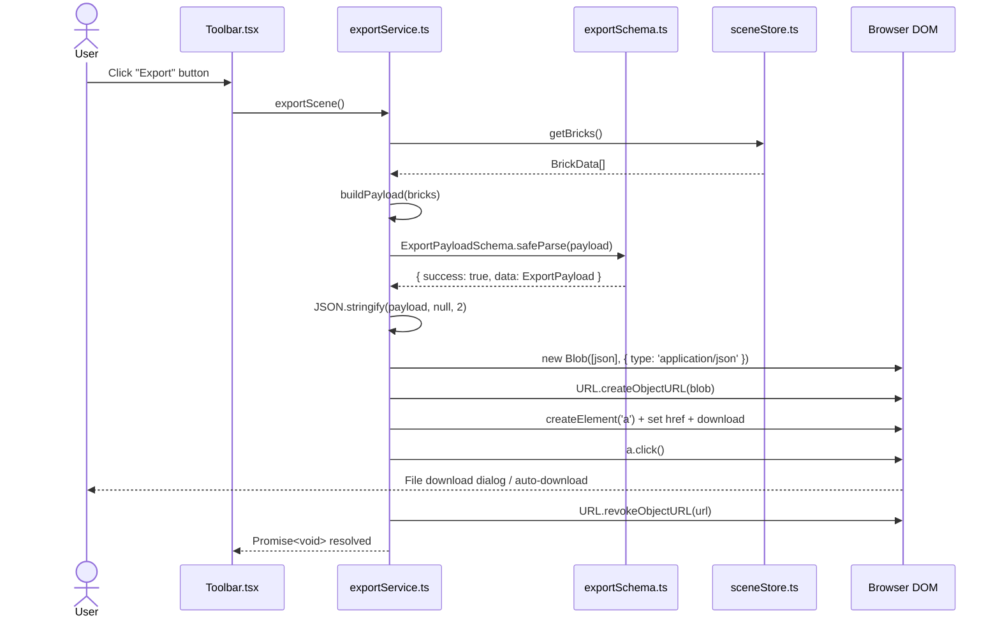
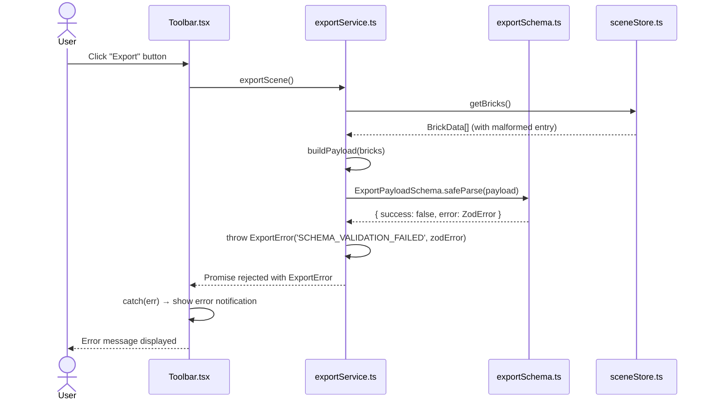
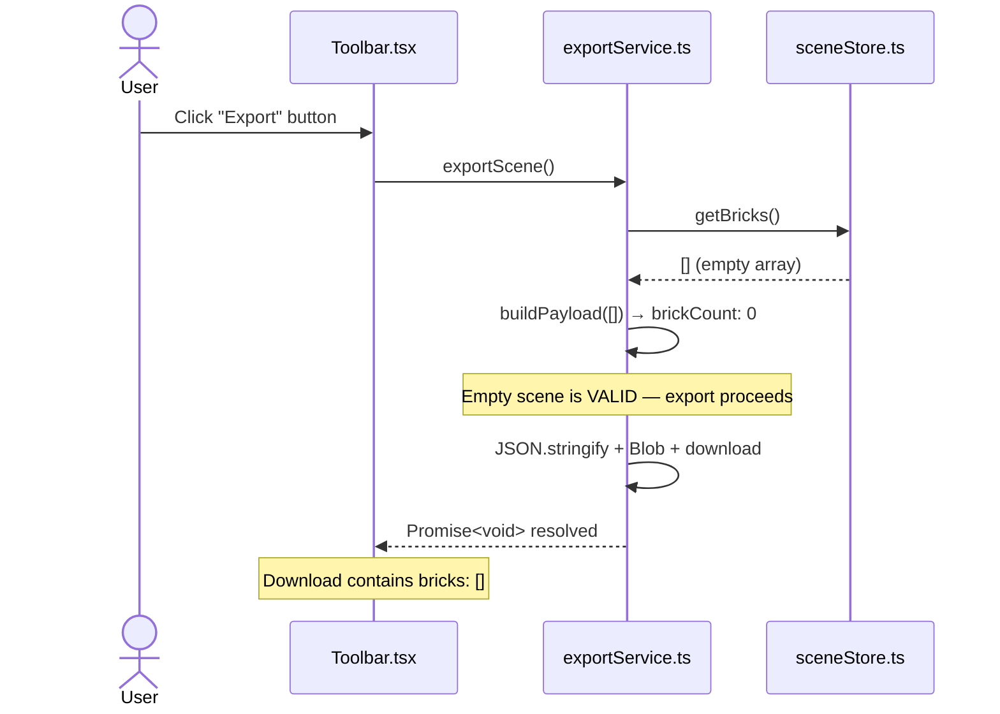

# Low-Level Design: FR-EXPORT-001 — Export Scene as Versioned JSON File

**Feature Request ID:** FR-EXPORT-001
**Issue:** [#21](https://github.com/sreenivasmrpivot/legobuilder/issues/21)
**Title:** Export scene as versioned JSON file with all brick data
**Author:** Spectra Design Agent
**Status:** Draft — Awaiting Gate 6a Human Review
**Date:** 2026-04-11

---

## Table of Contents

1. [Overview](#1-overview)
2. [Component Architecture](#2-component-architecture)
3. [Data Models](#3-data-models)
4. [API / Interface Contracts](#4-api--interface-contracts)
5. [Sequence Diagrams](#5-sequence-diagrams)
6. [Error Handling Strategy](#6-error-handling-strategy)
7. [Security Considerations](#7-security-considerations)
8. [Performance Considerations](#8-performance-considerations)
9. [Test Case Mapping](#9-test-case-mapping)
10. [Open Questions & Assumptions](#10-open-questions--assumptions)

---

## 1. Overview

FR-EXPORT-001 adds a one-click **Export** capability to the LegoBuilder application. When the user clicks the Export button in the `Toolbar`, the current scene state is serialized to a versioned, human-readable JSON file and downloaded to the user's device via the browser's native download mechanism.

### Scope

| In Scope | Out of Scope |
|---|---|
| Serialize `sceneStore` bricks to JSON | Import / load from JSON (separate FR) |
| Versioned JSON schema (`v1`) | Cloud storage / remote upload |
| Browser-native file download (Blob + anchor) | Compression / binary formats |
| Export performance ≤ 2 s for 500 bricks | Multi-scene batch export |
| Schema validation before download | Server-side rendering of export |

### Dependencies

| Dependency | Issue | Status |
|---|---|---|
| FR-SCENE-001 — Scene initialization & `sceneStore` | #8 | Required |
| FR-BRICK-001 — Brick placement & `BrickData` model | #10 | Required |

---

## 2. Component Architecture

### 2.1 Module Map

```
frontend/src/
├── components/
│   └── Toolbar/
│       └── Toolbar.tsx              ← Export button; calls exportService.exportScene()
├── services/
│   └── exportService.ts             ← Orchestrates serialization + download [NEW]
├── engine/
│   └── exportSchema.ts              ← JSON schema definition + Zod validation [NEW]
└── stores/
    └── sceneStore.ts                ← Source of truth for brick state [EXISTING]
```

### 2.2 Module Responsibilities

| Module | Responsibility | New / Existing |
|---|---|---|
| `Toolbar.tsx` | Render Export button; wire click handler to `exportService.exportScene()` | Modified |
| `exportService.ts` | Read `sceneStore`, build `ExportPayload`, validate schema, trigger download | **New** |
| `exportSchema.ts` | Define `ExportPayload` TypeScript types; Zod schema for runtime validation | **New** |
| `sceneStore.ts` | Expose `getBricks(): BrickData[]` selector (or existing state accessor) | Modified (minor) |

### 2.3 Dependency Graph

```
Toolbar.tsx
    │
    └──► exportService.ts
              │
              ├──► exportSchema.ts   (type definitions + validation)
              └──► sceneStore.ts     (read-only access to brick state)
```

### 2.4 File Contracts

#### `frontend/src/services/exportService.ts`

```typescript
/**
 * exportService.ts
 * Orchestrates scene export: reads sceneStore, builds payload,
 * validates schema, and triggers browser file download.
 */
export interface ExportServiceInterface {
  /**
   * Serialize the current scene and download as a JSON file.
   * @param filename  Optional override for the downloaded filename.
   *                  Defaults to `legobuilder-scene-<ISO8601>.json`.
   * @returns Promise<void> — resolves when download is initiated.
   * @throws ExportError on schema validation failure or store read error.
   */
  exportScene(filename?: string): Promise<void>;
}

export class ExportService implements ExportServiceInterface {
  constructor(
    private readonly store: SceneStoreAccessor,
    private readonly downloader: FileDownloader = browserDownloader,
  ) {}

  async exportScene(filename?: string): Promise<void> { /* ... */ }

  private buildPayload(bricks: BrickData[]): ExportPayload { /* ... */ }
  private generateFilename(): string { /* ... */ }
}

// Singleton export for use in Toolbar
export const exportService = new ExportService(sceneStore);
```

#### `frontend/src/engine/exportSchema.ts`

```typescript
/**
 * exportSchema.ts
 * Defines the versioned JSON export schema and Zod validator.
 */
import { z } from 'zod';

export const EXPORT_SCHEMA_VERSION = 'v1' as const;

export const BrickDataSchema = z.object({
  id:       z.string().uuid(),
  type:     z.string().min(1),
  position: z.object({ x: z.number(), y: z.number(), z: z.number() }),
  rotation: z.object({ x: z.number(), y: z.number(), z: z.number() }),
  color:    z.string().regex(/^#[0-9A-Fa-f]{6}$/),
});

export const ExportMetadataSchema = z.object({
  exportedAt:    z.string().datetime(),
  brickCount:    z.number().int().nonnegative(),
  schemaVersion: z.literal(EXPORT_SCHEMA_VERSION),
});

export const ExportPayloadSchema = z.object({
  version:  z.literal(EXPORT_SCHEMA_VERSION),
  metadata: ExportMetadataSchema,
  bricks:   z.array(BrickDataSchema),
});

export type BrickData      = z.infer<typeof BrickDataSchema>;
export type ExportMetadata = z.infer<typeof ExportMetadataSchema>;
export type ExportPayload  = z.infer<typeof ExportPayloadSchema>;
```

---

## 3. Data Models

### 3.1 `BrickData` Entity

| Field | Type | Constraints | Description |
|---|---|---|---|
| `id` | `string` (UUID v4) | Required, unique | Stable brick identifier |
| `type` | `string` | Required, non-empty | Brick type key (e.g., `"2x4"`, `"1x1"`) |
| `position.x` | `number` | Required, finite | World-space X coordinate |
| `position.y` | `number` | Required, finite | World-space Y coordinate (height) |
| `position.z` | `number` | Required, finite | World-space Z coordinate |
| `rotation.x` | `number` | Required, finite | Euler angle X (radians) |
| `rotation.y` | `number` | Required, finite | Euler angle Y (radians) |
| `rotation.z` | `number` | Required, finite | Euler angle Z (radians) |
| `color` | `string` | Required, `#RRGGBB` hex | Brick color |

### 3.2 `ExportMetadata` Entity

| Field | Type | Constraints | Description |
|---|---|---|---|
| `exportedAt` | `string` (ISO 8601) | Required | UTC timestamp of export |
| `brickCount` | `number` (integer ≥ 0) | Required | Count of bricks in payload |
| `schemaVersion` | `"v1"` | Required, literal | Schema version for forward compatibility |

### 3.3 `ExportPayload` (Root Document)

| Field | Type | Constraints | Description |
|---|---|---|---|
| `version` | `"v1"` | Required, literal | Top-level schema version |
| `metadata` | `ExportMetadata` | Required | Export context metadata |
| `bricks` | `BrickData[]` | Required, may be empty | Array of all brick objects |

### 3.4 Example JSON Output

```json
{
  "version": "v1",
  "metadata": {
    "exportedAt": "2026-04-11T10:30:00.000Z",
    "brickCount": 3,
    "schemaVersion": "v1"
  },
  "bricks": [
    {
      "id": "a1b2c3d4-e5f6-7890-abcd-ef1234567890",
      "type": "2x4",
      "position": { "x": 0, "y": 0, "z": 0 },
      "rotation": { "x": 0, "y": 0, "z": 0 },
      "color": "#FF0000"
    },
    {
      "id": "b2c3d4e5-f6a7-8901-bcde-f12345678901",
      "type": "1x2",
      "position": { "x": 2, "y": 0, "z": 0 },
      "rotation": { "x": 0, "y": 1.5708, "z": 0 },
      "color": "#0000FF"
    },
    {
      "id": "c3d4e5f6-a7b8-9012-cdef-123456789012",
      "type": "2x2",
      "position": { "x": 0, "y": 1.2, "z": 2 },
      "rotation": { "x": 0, "y": 0, "z": 0 },
      "color": "#00FF00"
    }
  ]
}
```

### 3.5 Schema Versioning Strategy

- The `version` field at the root and `metadata.schemaVersion` are both set to `"v1"` for the initial release.
- Future schema changes increment the version string (e.g., `"v2"`).
- The `exportSchema.ts` module will export a version-keyed validator map to support future multi-version validation.
- Breaking changes to `BrickData` fields require a new version; additive fields may be added to `v1` with optional Zod fields.

---

## 4. API / Interface Contracts

### 4.1 `ExportService.exportScene(filename?)`

```
Method:    exportScene(filename?: string): Promise<void>
Caller:    Toolbar.tsx onClick handler
Effect:    Triggers browser file download; no return value
Throws:    ExportError (see §6)
```

**Algorithm:**

```
1. bricks ← sceneStore.getBricks()
2. payload ← buildPayload(bricks)
   a. version   ← EXPORT_SCHEMA_VERSION
   b. metadata  ← { exportedAt: new Date().toISOString(),
                     brickCount: bricks.length,
                     schemaVersion: EXPORT_SCHEMA_VERSION }
   c. bricks    ← bricks (deep copy to avoid mutation)
3. result ← ExportPayloadSchema.safeParse(payload)
   if result.success === false → throw ExportError('SCHEMA_VALIDATION_FAILED', result.error)
4. json ← JSON.stringify(payload, null, 2)   // human-readable, 2-space indent
5. blob ← new Blob([json], { type: 'application/json' })
6. url  ← URL.createObjectURL(blob)
7. a    ← document.createElement('a')
   a.href     ← url
   a.download ← filename ?? generateFilename()
   a.click()
8. URL.revokeObjectURL(url)   // immediate cleanup
```

### 4.2 `FileDownloader` Interface (Dependency Injection)

```typescript
export interface FileDownloader {
  download(blob: Blob, filename: string): void;
}

// Production implementation
export const browserDownloader: FileDownloader = {
  download(blob: Blob, filename: string): void {
    const url = URL.createObjectURL(blob);
    const a   = document.createElement('a');
    a.href     = url;
    a.download = filename;
    a.click();
    URL.revokeObjectURL(url);
  },
};

// Test stub
export const mockDownloader: FileDownloader = {
  download: jest.fn(),
};
```

### 4.3 `SceneStoreAccessor` Interface

```typescript
export interface SceneStoreAccessor {
  getBricks(): BrickData[];
}
```

The existing `sceneStore` (Zustand store from FR-SCENE-001) must expose a `getBricks()` selector or equivalent state accessor. If the store already exposes `state.bricks` as a plain array, a thin adapter satisfies this interface.

### 4.4 Toolbar Integration

```typescript
// Toolbar.tsx (relevant addition)
import { exportService } from '../../services/exportService';

const handleExport = async () => {
  try {
    await exportService.exportScene();
  } catch (err) {
    // Display user-facing error toast / alert
    console.error('[Export] Failed:', err);
  }
};

// In JSX:
<button onClick={handleExport} aria-label="Export scene as JSON">
  Export
</button>
```

### 4.5 Generated Filename Convention

```
legobuilder-scene-<YYYY-MM-DDTHH-MM-SS>Z.json

Example: legobuilder-scene-2026-04-11T10-30-00Z.json
```

Colons in ISO 8601 timestamps are replaced with hyphens for cross-platform filename compatibility.

---

## 5. Sequence Diagrams

### 5.1 Happy Path — Successful Export



### 5.2 Failure Path — Schema Validation Error



### 5.3 Empty Scene Export



---

## 6. Error Handling Strategy

### 6.1 `ExportError` Class

```typescript
export type ExportErrorCode =
  | 'SCHEMA_VALIDATION_FAILED'
  | 'STORE_READ_FAILED'
  | 'BLOB_CREATION_FAILED'
  | 'DOWNLOAD_INITIATION_FAILED';

export class ExportError extends Error {
  constructor(
    public readonly code: ExportErrorCode,
    public readonly cause?: unknown,
  ) {
    super(`[ExportError:${code}] ${String(cause)}`);
    this.name = 'ExportError';
  }
}
```

### 6.2 Error Conditions

| # | Condition | Error Code | Recovery Action |
|---|---|---|---|
| 1 | `sceneStore.getBricks()` throws | `STORE_READ_FAILED` | Log + surface error toast to user |
| 2 | Zod schema validation fails | `SCHEMA_VALIDATION_FAILED` | Log Zod issues; surface error toast |
| 3 | `new Blob()` throws (OOM) | `BLOB_CREATION_FAILED` | Log + surface error toast |
| 4 | `URL.createObjectURL` throws | `DOWNLOAD_INITIATION_FAILED` | Log + surface error toast |
| 5 | `a.click()` blocked by browser | `DOWNLOAD_INITIATION_FAILED` | Log; advise user to allow downloads |

### 6.3 User-Facing Error Messages

| Error Code | User Message |
|---|---|
| `STORE_READ_FAILED` | "Could not read scene data. Please try again." |
| `SCHEMA_VALIDATION_FAILED` | "Export failed: scene data is invalid. Please report this issue." |
| `BLOB_CREATION_FAILED` | "Export failed: insufficient memory. Try reducing scene size." |
| `DOWNLOAD_INITIATION_FAILED` | "Download was blocked. Please allow downloads from this site." |

### 6.4 Logging Strategy

- All `ExportError` instances are logged via `console.error` with the full error object.
- In production, errors are forwarded to the application's error monitoring service (if configured).
- No sensitive user data is included in error logs.

---

## 7. Security Considerations

| Concern | Mitigation |
|---|---|
| **XSS via filename** | Filename is generated programmatically from a timestamp; no user input is used in the filename. |
| **Blob URL leakage** | `URL.revokeObjectURL(url)` is called immediately after `a.click()` to release the object URL. |
| **Data exfiltration** | Export is entirely client-side; no data is sent to any server. The Blob is created and consumed in the browser only. |
| **Prototype pollution** | `JSON.stringify` is called on a Zod-validated, typed payload — not on raw user input. |
| **Large payload DoS** | Performance budget (≤ 2 s for 500 bricks) is enforced by the acceptance criteria. Serialization is synchronous but bounded. |
| **Content-Type spoofing** | Blob is created with `type: 'application/json'`; the `.json` extension is enforced in the filename. |

---

## 8. Performance Considerations

### 8.1 Performance Budget

| Metric | Target | Basis |
|---|---|---|
| Export initiation time (500 bricks) | ≤ 2 000 ms | FR-EXPORT-001 acceptance criteria |
| `JSON.stringify` for 500 bricks | < 50 ms | Empirical estimate (< 1 KB/brick) |
| Zod validation for 500 bricks | < 100 ms | Zod v3 benchmark |
| Blob creation | < 10 ms | Browser native |
| Total synchronous work | < 200 ms | Well within 2 s budget |

### 8.2 Optimization Notes

- `JSON.stringify(payload, null, 2)` produces human-readable output. For 500 bricks at ~200 bytes/brick, the output is ~100 KB — well within browser memory limits.
- The export operation is **synchronous** within the `async exportScene()` wrapper. No Web Worker is needed at this scale.
- If future requirements increase brick counts beyond 5 000, consider offloading `JSON.stringify` to a Web Worker to avoid blocking the main thread.
- `URL.revokeObjectURL` is called synchronously after `a.click()`. Modern browsers queue the download before the URL is revoked, so this is safe.

### 8.3 Memory Profile

| Object | Estimated Size (500 bricks) |
|---|---|
| `BrickData[]` in memory | ~200 KB (JS objects) |
| JSON string | ~100 KB |
| Blob | ~100 KB |
| Peak memory delta | ~400 KB |

All objects are eligible for GC after `URL.revokeObjectURL` and the function returns.

---

## 9. Test Case Mapping

| Test ID | Description | Covered By |
|---|---|---|
| T-BE-EXPORT-001-01 | `exportService.exportScene()` produces valid JSON matching `ExportPayloadSchema` | Unit test: `exportService.test.ts` |
| T-BE-EXPORT-001-02 | Each brick in output contains `position`, `type`, `rotation`, `color` | Unit test: `exportService.test.ts` |
| T-BE-EXPORT-001-03 | Export of 500-brick scene completes within 2 000 ms | Performance test: `exportService.perf.test.ts` |
| T-E2E-EXPORT-001-01 | User clicks Export → file download is triggered in browser | E2E test: Playwright `export.spec.ts` |

### 9.1 Unit Test Approach (`exportService.test.ts`)

- Inject `mockDownloader` (jest.fn()) to capture download calls without triggering browser APIs.
- Inject a mock `SceneStoreAccessor` returning controlled `BrickData[]` fixtures.
- Assert: `mockDownloader.download` called once with a `Blob` of type `application/json`.
- Assert: Parsed Blob content matches `ExportPayloadSchema`.
- Assert: `metadata.brickCount` equals the fixture array length.
- Assert: `version === 'v1'`.

### 9.2 Performance Test Approach (`exportService.perf.test.ts`)

- Generate 500 `BrickData` fixtures programmatically.
- Record `performance.now()` before and after `exportScene()`.
- Assert elapsed time < 2 000 ms.
- Run in Node.js environment with `jsdom` (no real browser needed for timing).

### 9.3 E2E Test Approach (`export.spec.ts` — Playwright)

- Navigate to the app, add bricks via UI or `window.__legoApp` API.
- Set up `page.waitForEvent('download')` before clicking Export.
- Click the Export button.
- Assert download event fires within 2 000 ms.
- Assert downloaded filename matches `legobuilder-scene-*.json` pattern.
- Parse downloaded file content and assert it matches `ExportPayloadSchema`.

---

## 10. Open Questions & Assumptions

| # | Type | Question / Assumption | Impact |
|---|---|---|---|
| 1 | **Assumption** | `sceneStore` exposes a synchronous `getBricks()` accessor (Zustand `getState().bricks`). If the store is async, `exportScene()` must `await` the read. | Low — Zustand stores are synchronous by default. |
| 2 | **Assumption** | `BrickData` in `sceneStore` already contains `id`, `type`, `position`, `rotation`, `color` fields as defined in FR-BRICK-001 (#10). If fields differ, `exportSchema.ts` must be adjusted. | Medium — verify against FR-BRICK-001 LLD. |
| 3 | **Open Question** | Should an empty scene (0 bricks) export be allowed, or should the Export button be disabled when the scene is empty? | Low — current design allows empty export; UX decision for PM. |
| 4 | **Open Question** | Should the exported filename be user-configurable (e.g., via a "Save As" dialog)? The current design uses a generated timestamp filename. | Low — can be added as a follow-up FR. |
| 5 | **Assumption** | Zod is already a project dependency (used elsewhere in the frontend). If not, it must be added to `package.json`. | Low — standard dependency for TypeScript schema validation. |
| 6 | **Open Question** | Should `rotation` be stored as Euler angles (radians) or as a quaternion? Three.js uses both internally. The current design uses Euler XYZ. | Medium — must align with FR-BRICK-001 LLD and `sceneStore` representation. |

---

## Appendix A: FR-EXPORT-001 Acceptance Criteria Traceability

| Acceptance Criterion | Design Element |
|---|---|
| User clicks "Export" → JSON file downloaded | `Toolbar.tsx` → `exportService.exportScene()` → `browserDownloader.download()` |
| JSON contains array of brick objects with position, type, rotation, color | `BrickDataSchema` in `exportSchema.ts` |
| 500-brick scene exports within 2 seconds | Performance budget §8.1; performance test T-BE-EXPORT-001-03 |
| Schema is human-readable and versioned | `JSON.stringify(payload, null, 2)` + `version: 'v1'` + `schemaVersion: 'v1'` |

---

*Generated by Spectra Design Agent — Gate 6a approval required before implementation begins.*
