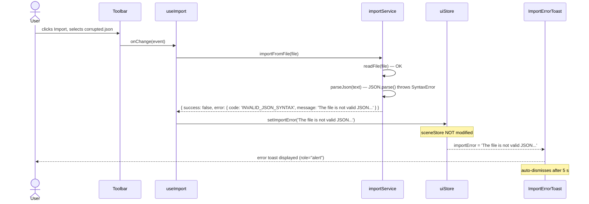
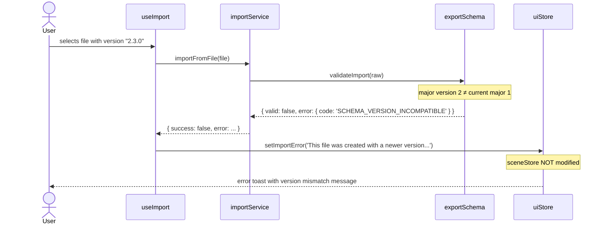
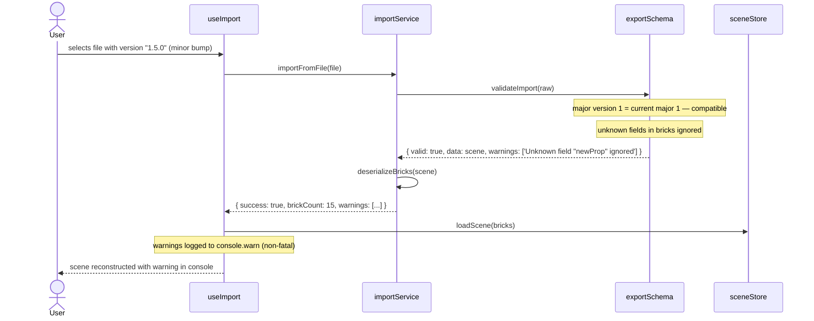

# Low-Level Design: FR-EXPORT-002 — Import JSON File and Reconstruct Scene with 100% Fidelity

**FR-ID:** FR-EXPORT-002  
**Issue:** [#22](https://github.com/sreenivasmrpivot/legobuilder/issues/22)  
**Branch:** `feature/22-fr-export-002-design`  
**Status:** Draft — awaiting Gate 6a (Design Review)  
**Depends on:** FR-EXPORT-001 (#21) — export schema and `exportSchema.ts` must be implemented first  
**Area:** Frontend (pure client-side SPA — React / Three.js / Zustand / Vitest)

---

## 1. Overview

FR-EXPORT-002 implements the **import path** of the LegoBuilder export/import round-trip. When the user clicks the **Import** button in the Toolbar, a hidden `<input type="file">` opens a file picker. The selected JSON file is:

1. Read via the `FileReader` API
2. Parsed and validated against the `LegoBuilderScene` schema (`exportSchema.ts`)
3. Deserialized into `BrickInstance[]` objects
4. Used to atomically replace the current scene in `sceneStore` and rebuild `occupancyMap`

On any error the current scene is **not modified** and a user-friendly error toast is displayed. Forward compatibility is handled by ignoring unknown fields and applying defaults for missing optional fields.

---

## 2. Component Architecture

### 2.1 Module Map

```
frontend/src/
├── components/
│   └── ui/
│       ├── Toolbar.tsx                  # Import button + hidden file input (existing, extended)
│       └── ImportErrorToast.tsx         # NEW — error feedback component
├── services/
│   └── importService.ts                 # EXTENDED — full implementation of import pipeline
├── engine/
│   └── exportSchema.ts                  # EXTENDED — validateImport() function
├── stores/
│   ├── sceneStore.ts                    # EXTENDED — loadScene() action
│   └── uiStore.ts                       # EXTENDED — importError / importSuccess state
├── hooks/
│   └── useImport.ts                     # NEW — orchestrates the import flow
└── types/
    ├── brick.ts                         # Existing — BrickInstance, BrickType
    └── scene.ts                         # Existing — LegoBuilderScene
```

### 2.2 Component Responsibilities

| Module | Responsibility |
|--------|----------------|
| `Toolbar.tsx` | Renders Import button; owns hidden `<input type="file" accept=".json">` ref; calls `useImport().handleFileSelect` on `onChange` |
| `ImportErrorToast.tsx` | Displays error message from `uiStore.importError`; auto-dismisses after 5 s; accessible via `role="alert"` |
| `importService.ts` | `readFile()`, `parseJson()`, `validateImport()`, `deserializeBricks()`, `importFromFile()` — pure functions, no side effects |
| `exportSchema.ts` | `validateImport(raw: unknown): ValidationResult` — schema version check, required field validation, forward-compat handling |
| `sceneStore.ts` | `loadScene(bricks: BrickInstance[])` — atomically clears scene, populates bricks, rebuilds `occupancyMap` |
| `uiStore.ts` | `importError: string \| null`, `importSuccess: boolean`, `setImportError()`, `setImportSuccess()`, `clearImportStatus()` |
| `useImport.ts` | Orchestrates: file read → parse → validate → deserialize → store update; dispatches UI state on success/error |

---

## 3. TypeScript Interfaces

### 3.1 Core Types (existing — confirmed from scaffolded files)

```typescript
// frontend/src/types/brick.ts
export interface BrickInstance {
  id: string;           // UUID v4
  catalogId: string;    // e.g. "2x4", "1x1", "2x2"
  position: { x: number; y: number; z: number };
  rotation: 0 | 90 | 180 | 270;  // degrees around Y-axis
  color: string;        // hex color e.g. "#FF0000"
}

// frontend/src/types/scene.ts
export interface LegoBuilderScene {
  version: string;      // semver e.g. "1.0.0"
  exportedAt: string;   // ISO 8601 timestamp
  metadata: SceneMetadata;
  bricks: BrickInstance[];
}

export interface SceneMetadata {
  brickCount: number;
  appVersion: string;
}
```

### 3.2 New Types for FR-EXPORT-002

```typescript
// frontend/src/types/import.ts  (NEW)

export type ImportErrorCode =
  | 'FILE_TOO_LARGE'               // > 10 MB
  | 'INVALID_FILE_TYPE'            // not .json / not application/json
  | 'INVALID_JSON_SYNTAX'          // JSON.parse threw
  | 'SCHEMA_VERSION_INCOMPATIBLE'  // major version mismatch
  | 'MISSING_REQUIRED_FIELD'       // version, bricks array absent
  | 'INVALID_BRICK_DATA'           // brick fails field-level validation
  | 'UNKNOWN_ERROR';               // catch-all

export interface ImportError {
  code: ImportErrorCode;
  message: string;          // human-readable, shown in toast
  detail?: string;          // technical detail for console.error
}

export interface ValidationResult {
  valid: boolean;
  error?: ImportError;
  data?: LegoBuilderScene;  // present only when valid === true
  warnings?: string[];      // forward-compat warnings (non-fatal)
}

export interface ImportResult {
  success: boolean;
  brickCount?: number;      // present on success
  error?: ImportError;      // present on failure
  warnings?: string[];      // forward-compat warnings
}
```

### 3.3 uiStore Extension

```typescript
// Addition to frontend/src/stores/uiStore.ts
interface UIStoreImportSlice {
  importError: string | null;    // null = no error
  importSuccess: boolean;        // true = show success feedback
  setImportError: (message: string) => void;
  setImportSuccess: (value: boolean) => void;
  clearImportStatus: () => void;
}
```

### 3.4 sceneStore Extension

```typescript
// Addition to frontend/src/stores/sceneStore.ts
interface SceneStoreImportSlice {
  loadScene: (bricks: BrickInstance[]) => void;
  // Atomically:
  //   1. clears bricks map
  //   2. populates bricks from array
  //   3. rebuilds occupancyMap
}
```

---

## 4. Service Contracts

### 4.1 `importService.ts` — Full API

```typescript
/**
 * Reads a File object and returns its text content.
 * Rejects with ImportError if file > MAX_IMPORT_SIZE_BYTES or wrong type.
 */
export async function readFile(file: File): Promise<string>;

/**
 * Parses a JSON string. Returns the raw object or throws ImportError
 * with code 'INVALID_JSON_SYNTAX'.
 */
export function parseJson(text: string): unknown;

/**
 * Validates the raw parsed object against the LegoBuilderScene schema.
 * Handles forward compatibility: unknown top-level fields are ignored;
 * missing optional fields receive defaults.
 * Returns ValidationResult — never throws.
 */
export function validateImport(raw: unknown): ValidationResult;

/**
 * Converts a validated LegoBuilderScene into BrickInstance[].
 * Applies field-level sanitization (trim strings, clamp numbers).
 * Returns ImportError with code 'INVALID_BRICK_DATA' if any brick fails.
 */
export function deserializeBricks(
  scene: LegoBuilderScene
): { bricks: BrickInstance[]; errors: ImportError[] };

/**
 * Top-level orchestrator. Reads, parses, validates, deserializes.
 * Returns ImportResult — never throws.
 */
export async function importFromFile(file: File): Promise<ImportResult>;
```

### 4.2 `exportSchema.ts` — `validateImport()` Extension

```typescript
// Existing file extended with:

const CURRENT_SCHEMA_VERSION = '1.0.0';
const MAX_IMPORT_SIZE_BYTES = 10 * 1024 * 1024; // 10 MB

/**
 * Schema validation rules:
 * 1. `version` field must be present (string, semver format)
 * 2. Major version must match CURRENT_SCHEMA_VERSION major
 *    (minor/patch differences are forward-compatible)
 * 3. `bricks` must be an array (may be empty)
 * 4. Each brick must have: id (string), catalogId (string),
 *    position ({x,y,z} numbers), rotation (0|90|180|270), color (#RRGGBB)
 * 5. Unknown top-level fields: ignored (forward compat)
 * 6. Unknown brick fields: ignored (forward compat)
 * 7. Missing optional fields (metadata): defaults applied
 */
export function validateImport(raw: unknown): ValidationResult;
```

### 4.3 `useImport.ts` Hook Contract

```typescript
interface UseImportReturn {
  handleFileSelect: (event: React.ChangeEvent<HTMLInputElement>) => Promise<void>;
  isImporting: boolean;  // true while async import is in progress
}

export function useImport(): UseImportReturn;
```

**Hook implementation flow:**

```
handleFileSelect(event)
  → file = event.target.files[0]
  → if (!file) return
  → setIsImporting(true)
  → result = await importService.importFromFile(file)
  → if result.success:
      sceneStore.loadScene(result.bricks)
      historyStore.reset()          // clear undo/redo stack
      uiStore.setImportSuccess(true)
      setTimeout(clearImportStatus, 3000)
  → else:
      uiStore.setImportError(result.error.message)
      setTimeout(clearImportStatus, 5000)
  → setIsImporting(false)
  → event.target.value = ''         // reset file input for re-import
```

---

## 5. Sequence Diagrams

### 5.1 Happy Path — Valid JSON Import

```mermaid
sequenceDiagram
    actor User
    participant Toolbar
    participant FileInput as "<input type=file>"
    participant useImport
    participant importService
    participant exportSchema
    participant sceneStore
    participant historyStore
    participant uiStore

    User->>Toolbar: clicks Import button
    Toolbar->>FileInput: fileInputRef.current.click()
    User->>FileInput: selects legobuilder-scene.json
    FileInput->>useImport: onChange(event)
    useImport->>useImport: setIsImporting(true)
    useImport->>importService: importFromFile(file)
    importService->>importService: readFile(file) — FileReader.readAsText()
    importService->>importService: parseJson(text) — JSON.parse()
    importService->>exportSchema: validateImport(raw)
    exportSchema-->>importService: { valid: true, data: LegoBuilderScene }
    importService->>importService: deserializeBricks(scene)
    importService-->>useImport: { success: true, brickCount: 42 }
    useImport->>sceneStore: loadScene(bricks)
    sceneStore->>sceneStore: clear bricks map
    sceneStore->>sceneStore: populate bricks from array
    sceneStore->>sceneStore: rebuild occupancyMap
    useImport->>historyStore: reset()
    useImport->>uiStore: setImportSuccess(true)
    useImport->>useImport: setIsImporting(false)
    uiStore-->>Toolbar: importSuccess = true
    Toolbar-->>User: scene reconstructed (42 bricks visible)
```



### 5.2 Error Path — Invalid JSON Syntax



### 5.3 Forward Compatibility — Newer Major Schema Version



### 5.4 Forward Compatibility — Minor Version Difference (Graceful Degradation)



---

## 6. Data Flow & State Machine

### 6.1 Import State Machine

```
IDLE
  importError: null, importSuccess: false, isImporting: false
  |
  | user clicks Import button, selects file
  v
FILE_SELECTED
  isImporting: true
  |
  |-- file too large / wrong type --> ERROR --> (5 s) --> IDLE
  |
  v
PARSING
  JSON.parse in flight
  |
  |-- parse fails --> ERROR --> (5 s) --> IDLE
  |
  v
VALIDATING
  validateImport()
  |
  |-- invalid --> ERROR --> (5 s) --> IDLE
  |
  v
DESERIALIZING
  deserializeBricks()
  |
  v
LOADING_SCENE
  sceneStore.loadScene()
  historyStore.reset()
  |
  v
SUCCESS
  importSuccess: true, isImporting: false
  |
  | 3 s timeout
  v
IDLE
```

### 6.2 `sceneStore.loadScene()` Atomic Operation

The `loadScene` action must be **atomic** — it replaces the entire scene in a single Zustand state update to prevent intermediate renders with partial state:

```typescript
loadScene: (bricks: BrickInstance[]) =>
  set((_state) => {
    // 1. Build new bricks map
    const newBricksMap = new Map<string, BrickInstance>();
    for (const brick of bricks) {
      newBricksMap.set(brick.id, brick);
    }
    // 2. Rebuild occupancyMap
    const newOccupancyMap = new OccupancyMap();
    for (const brick of bricks) {
      newOccupancyMap.add(brick);
    }
    return {
      bricks: newBricksMap,
      occupancyMap: newOccupancyMap,
    };
  }),
```

---

## 7. Validation Rules (exportSchema.ts)

### 7.1 Top-Level Schema Validation

| Field | Required | Type | Validation Rule |
|-------|----------|------|-----------------|
| `version` | Yes | `string` | semver format `^\d+\.\d+\.\d+$`; major must match current |
| `bricks` | Yes | `array` | must be an array (may be empty) |
| `exportedAt` | No | `string` | ISO 8601 if present; ignored if missing |
| `metadata` | No | `object` | defaults applied if missing |
| unknown fields | — | — | silently ignored (forward compat) |

### 7.2 Per-Brick Validation

| Field | Required | Type | Validation Rule |
|-------|----------|------|-----------------|
| `id` | Yes | `string` | UUID v4 regex `^[0-9a-f]{8}-[0-9a-f]{4}-4[0-9a-f]{3}-[89ab][0-9a-f]{3}-[0-9a-f]{12}$` |
| `catalogId` | Yes | `string` | must be in `BRICK_CATALOG` allowlist |
| `position.x` | Yes | `number` | finite number, integer |
| `position.y` | Yes | `number` | finite number, integer, >= 0 |
| `position.z` | Yes | `number` | finite number, integer |
| `rotation` | Yes | `number` | must be one of `{0, 90, 180, 270}` |
| `color` | Yes | `string` | hex color regex `^#[0-9A-Fa-f]{6}$` |
| unknown fields | — | — | silently ignored (forward compat) |

### 7.3 File-Level Guards

| Guard | Limit | Error Code |
|-------|-------|------------|
| File size | <= 10 MB | `FILE_TOO_LARGE` |
| File extension | `.json` | `INVALID_FILE_TYPE` |
| MIME type | `application/json` or `text/plain` | `INVALID_FILE_TYPE` |
| JSON depth | <= 10 levels | `DEPTH_LIMIT_EXCEEDED` (prototype pollution guard) |
| Brick count | <= 10,000 | `INVALID_BRICK_DATA` (DoS guard) |

---

## 8. Error Handling Matrix

| Scenario | Error Code | User Message | Scene Modified? | Recovery |
|----------|-----------|--------------|-----------------|----------|
| File > 10 MB | `FILE_TOO_LARGE` | "File is too large. Maximum size is 10 MB." | No | User selects smaller file |
| Non-JSON file | `INVALID_FILE_TYPE` | "Please select a valid .json file." | No | User selects correct file |
| Malformed JSON | `INVALID_JSON_SYNTAX` | "The file is not valid JSON. It may be corrupted." | No | User re-exports or fixes file |
| Major version mismatch | `SCHEMA_VERSION_INCOMPATIBLE` | "This file was created with a newer version of LegoBuilder. Please update the app." | No | User updates app |
| Missing `version` field | `MISSING_REQUIRED_FIELD` | "The file is missing required fields. It may be corrupted." | No | User re-exports |
| Missing `bricks` field | `MISSING_REQUIRED_FIELD` | "The file is missing required fields. It may be corrupted." | No | User re-exports |
| Invalid brick data | `INVALID_BRICK_DATA` | "The file contains invalid brick data. It may be corrupted." | No | User re-exports |
| FileReader error | `UNKNOWN_ERROR` | "An unexpected error occurred while reading the file." | No | User retries |
| Minor version bump | — (warning) | Console warning only; import proceeds | Yes | N/A |
| Unknown brick fields | — (warning) | Console warning only; import proceeds | Yes | N/A |

**Critical invariant:** The current scene is **never modified** if any error occurs. The `loadScene()` action is only called after all validation and deserialization succeed.

---

## 9. Security Considerations

### 9.1 Prototype Pollution Prevention

- `JSON.parse()` is the only JSON parser used — no `eval()`, no `new Function()`
- After parsing, the raw object is validated with an allowlist approach (known fields only)
- `structuredClone()` is used to deep-copy the validated data before passing to `deserializeBricks()`, breaking any prototype chain from the parsed object
- `Object.create(null)` is used for intermediate maps during deserialization

### 9.2 XSS Prevention

- All string fields (`id`, `catalogId`, `color`) are validated against strict regex allowlists before being stored in Zustand
- `color` is validated as `#RRGGBB` hex — no CSS injection possible
- `catalogId` is validated against the `BRICK_CATALOG` allowlist — no arbitrary string stored
- No string field is ever rendered as HTML (all rendered as React text nodes or Three.js material properties)

### 9.3 Denial-of-Service Guards

- File size capped at 10 MB before `FileReader.readAsText()` is called
- Brick count capped at 10,000 (well above the 500-brick performance target)
- JSON depth limited to 10 levels (prevents deeply nested objects from causing stack overflow)
- `FileReader` timeout: if `onload` does not fire within 30 s, the import is aborted with `UNKNOWN_ERROR`

### 9.4 File Input Security

- `accept=".json"` on the `<input>` element provides UX filtering (not a security boundary)
- MIME type is checked programmatically in `readFile()` as a secondary guard
- The file input `value` is reset to `''` after each import attempt to prevent re-use of the same file object

---

## 10. Accessibility Requirements

| Requirement | Implementation |
|-------------|----------------|
| Import button keyboard accessible | Native `<button>` element in Toolbar; Tab-focusable; Enter/Space activates |
| Error feedback announced to screen readers | `ImportErrorToast` uses `role="alert"` and `aria-live="assertive"` |
| Success feedback announced | `aria-live="polite"` region in `App.tsx` announces brick count on success |
| Loading state communicated | Import button shows `aria-busy="true"` and `aria-label="Importing..."` while `isImporting` is true |
| File input hidden but accessible | Hidden `<input type="file">` is `aria-hidden="true"` (triggered programmatically by button) |
| Error toast dismissible | Toast has a close button with `aria-label="Dismiss error"` |

---

## 11. Performance Considerations

| Concern | Target | Approach |
|---------|--------|----------|
| File read time | < 500 ms for 10 MB file | `FileReader.readAsText()` is async; UI remains responsive |
| JSON parse time | < 100 ms for 10,000 bricks | Native `JSON.parse()` is highly optimized |
| Validation time | < 50 ms for 10,000 bricks | Single-pass O(n) validation loop |
| `loadScene()` time | < 100 ms for 500 bricks | Single Zustand state update; OccupancyMap rebuild is O(n) |
| Total import time | < 1 s for typical scene (<= 500 bricks) | All operations are synchronous after file read |
| Re-render after import | Single React reconciliation pass | Atomic `loadScene()` prevents intermediate renders |

---

## 12. `ImportErrorToast` Component Spec

```typescript
// frontend/src/components/ui/ImportErrorToast.tsx

interface ImportErrorToastProps {
  message: string;
  onDismiss: () => void;
}

// Renders:
// <div role="alert" aria-live="assertive" className="...toast styles...">
//   <span>{message}</span>
//   <button aria-label="Dismiss error" onClick={onDismiss}>x</button>
// </div>
//
// Mounted in App.tsx when uiStore.importError !== null
// Auto-dismisses after 5 s via setTimeout in useImport hook
// Positioned: fixed bottom-right, z-index: 50
// Tailwind classes: bg-red-600 text-white rounded-lg shadow-lg p-4
```

---

## 13. Toolbar Extension Spec

The existing `Toolbar.tsx` is extended with:

```typescript
// New additions to Toolbar.tsx:
const fileInputRef = useRef<HTMLInputElement>(null);
const { handleFileSelect, isImporting } = useImport();

// Import button:
<button
  onClick={() => fileInputRef.current?.click()}
  disabled={isImporting}
  aria-busy={isImporting}
  aria-label={isImporting ? 'Importing...' : 'Import scene'}
  data-testid="toolbar-import-btn"
>
  {isImporting ? <SpinnerIcon /> : <ArrowUpTrayIcon />}
  Import
</button>

// Hidden file input:
<input
  ref={fileInputRef}
  type="file"
  accept=".json,application/json"
  aria-hidden="true"
  tabIndex={-1}
  style={{ display: 'none' }}
  onChange={handleFileSelect}
  data-testid="toolbar-import-input"
/>
```

---

## 14. Test Case Mapping

| Test ID | Description | Type | Covers |
|---------|-------------|------|--------|
| T-BE-EXPORT-002-01 | Valid JSON import reconstructs scene with 100% fidelity | Unit | `importService.importFromFile()` + `sceneStore.loadScene()` |
| T-BE-EXPORT-002-02 | Every brick matches original in position, type, rotation, color | Unit | `deserializeBricks()` round-trip with `exportService` output |
| T-BE-EXPORT-002-03 | Invalid/corrupted JSON shows error, scene unchanged | Unit | `validateImport()` error path; `sceneStore` not called |
| T-BE-EXPORT-002-04 | Newer major version shows version mismatch error | Unit | `validateImport()` version check |
| T-E2E-EXPORT-001-01 | Full export to import round-trip in browser | E2E (Playwright) | Toolbar Import button to file picker to scene reconstruction |

### Additional Design-Derived Test Cases

| Test ID | Description | Type |
|---------|-------------|------|
| T-FE-EXPORT-002-01 | File > 10 MB rejected before FileReader | Unit |
| T-FE-EXPORT-002-02 | Non-JSON file rejected with correct error code | Unit |
| T-FE-EXPORT-002-03 | Minor version bump imports with console warning | Unit |
| T-FE-EXPORT-002-04 | Unknown brick fields ignored (forward compat) | Unit |
| T-FE-EXPORT-002-05 | `loadScene()` is atomic — no intermediate renders | Unit |
| T-FE-EXPORT-002-06 | File input reset after import (allows re-import same file) | Unit |
| T-FE-EXPORT-002-07 | ImportErrorToast renders with `role="alert"` | Component |
| T-FE-EXPORT-002-08 | Import button shows `aria-busy` during import | Component |
| T-FE-EXPORT-002-09 | historyStore reset after successful import | Unit |
| T-FE-EXPORT-002-10 | Brick count <= 10,000 guard (DoS protection) | Unit |

---

## 15. File Map (Implementation Guide for Coding Agent)

| File | Action | Notes |
|------|--------|-------|
| `frontend/src/types/import.ts` | **CREATE** | `ImportErrorCode`, `ImportError`, `ValidationResult`, `ImportResult` |
| `frontend/src/services/importService.ts` | **IMPLEMENT** | Replace scaffold with full implementation per Section 4.1 |
| `frontend/src/engine/exportSchema.ts` | **EXTEND** | Add `validateImport()` per Section 4.2 |
| `frontend/src/hooks/useImport.ts` | **CREATE** | Orchestration hook per Section 4.3 |
| `frontend/src/stores/sceneStore.ts` | **EXTEND** | Add `loadScene()` action per Section 3.4 |
| `frontend/src/stores/uiStore.ts` | **EXTEND** | Add import status slice per Section 3.3 |
| `frontend/src/components/ui/Toolbar.tsx` | **EXTEND** | Add Import button + hidden file input per Section 13 |
| `frontend/src/components/ui/ImportErrorToast.tsx` | **CREATE** | Error toast component per Section 12 |
| `frontend/src/components/App.tsx` | **EXTEND** | Mount `ImportErrorToast` when `uiStore.importError !== null` |
| `frontend/src/__tests__/importService.test.ts` | **CREATE** | Unit tests per Section 14 |
| `frontend/src/__tests__/ImportErrorToast.test.tsx` | **CREATE** | Component tests per Section 14 |

---

## 16. Dependencies & Sequencing

| Dependency | Status | Notes |
|------------|--------|-------|
| FR-EXPORT-001 (#21) | Must be implemented first | Provides `exportSchema.ts`, `LegoBuilderScene` type, `exportService.ts` |
| `sceneStore.ts` scaffold | Exists in main | `loadScene()` action to be added |
| `uiStore.ts` scaffold | Exists in main | Import status slice to be added |
| `importService.ts` scaffold | Exists in main | Full implementation replaces scaffold |
| `exportSchema.ts` scaffold | Exists in main | `validateImport()` to be added |
| `Toolbar.tsx` scaffold | Exists in main | Import button to be added |

---

## 17. Open Questions

| # | Question | Impact | Suggested Default |
|---|----------|--------|-------------------|
| OQ-1 | Should a successful import show a success toast ("42 bricks imported") or is the scene reconstruction sufficient feedback? | UX | Show brief success toast for 3 s |
| OQ-2 | Should the undo/redo history be cleared after import? | UX / correctness | Yes — `historyStore.reset()` called after `loadScene()` |
| OQ-3 | Should import be blocked while an export is in progress? | Race condition | No — export is synchronous (Blob download), no conflict |
| OQ-4 | Should the file picker accept `.json` only, or also `.lego` (custom extension)? | UX | `.json` only for MVP; custom extension deferred |
| OQ-5 | Should invalid bricks be skipped (partial import) or cause full rejection? | UX / correctness | Full rejection — partial scenes are confusing |

---

*Created by Spectra Framework — design-agent*  
*FR-ID: FR-EXPORT-002 | Issue: #22 | Branch: feature/22-fr-export-002-design*  
*Awaiting Gate 6a (Design Review) — merge to main unblocks frontend-test and frontend coding agents*
