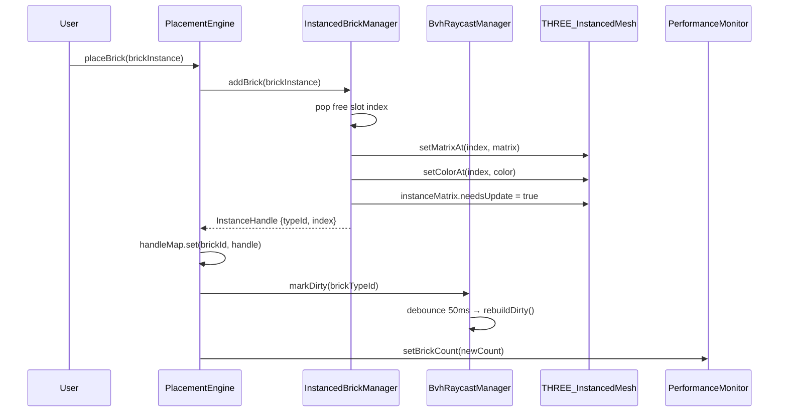
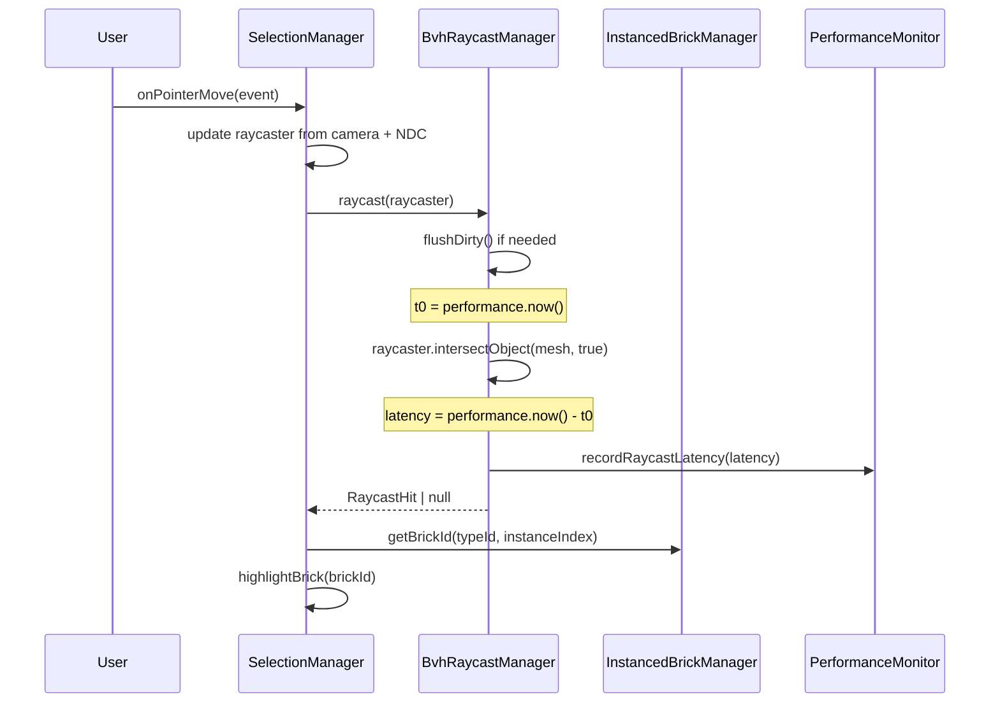
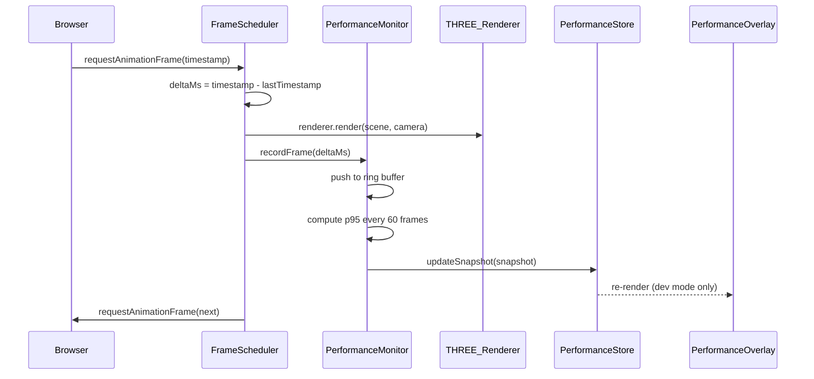
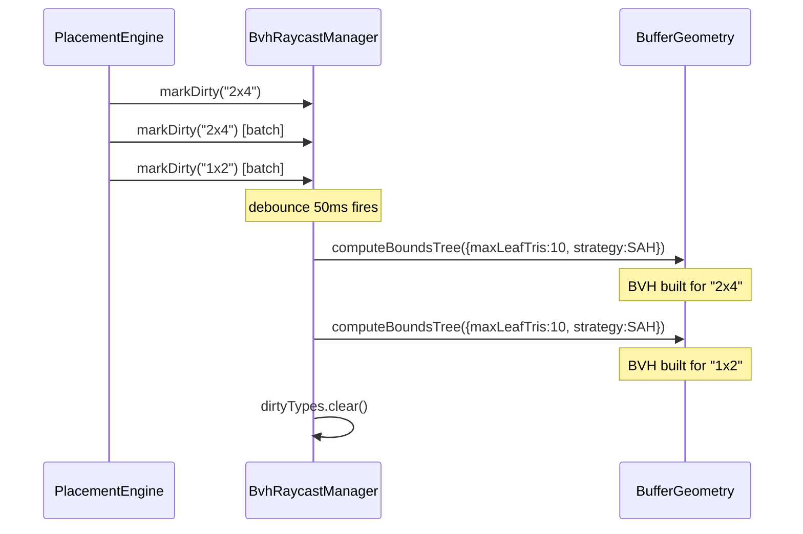

# Low-Level Design: FR-PERF-001
## Maintain ≥60 FPS with 500 Bricks using InstancedMesh and BVH Raycasting

**FR-ID:** FR-PERF-001
**Issue:** #26
**Author:** Spectra Design Agent
**Status:** Draft — Awaiting Gate 6a Design Review
**Dependencies:** FR-SCENE-002 (Issue #7), FR-SCENE-003 (Issue #9)

---

## Table of Contents

1. [Overview](#1-overview)
2. [Performance Budget](#2-performance-budget)
3. [Component Architecture](#3-component-architecture)
4. [InstancedMesh Batching Design](#4-instancedmesh-batching-design)
5. [BVH Raycasting Design](#5-bvh-raycasting-design)
6. [Performance Monitor Design](#6-performance-monitor-design)
7. [Memory Management Strategy](#7-memory-management-strategy)
8. [Vite Bundle Optimization](#8-vite-bundle-optimization)
9. [Data Models and TypeScript Interfaces](#9-data-models-and-typescript-interfaces)
10. [Sequence Diagrams](#10-sequence-diagrams)
11. [Error Handling Strategy](#11-error-handling-strategy)
12. [Security Considerations](#12-security-considerations)
13. [Test Case Mapping](#13-test-case-mapping)
14. [Measurable NFR Targets](#14-measurable-nfr-targets)
15. [Open Questions](#15-open-questions)

---

## 1. Overview

FR-PERF-001 mandates that the LegoBuilder application maintains ≥60 FPS (p95 frame time <16.7 ms) with up to 500 bricks placed in the scene on a mid-range device. This is the core performance requirement for the Enthusiast Designer persona (Dana).

The design achieves this through three complementary strategies:

| Strategy | Mechanism | Target Gain |
|----------|-----------|-------------|
| **Draw call batching** | `THREE.InstancedMesh` — one draw call per brick type | 50–100× fewer draw calls vs. individual meshes |
| **Raycast acceleration** | `three-mesh-bvh` BVH tree — O(log n) intersection tests | <2 ms raycast latency at 500 bricks |
| **Frame-time monitoring** | `performanceMonitor.ts` — rAF-based p95 tracking | Continuous regression detection |

All three strategies are implemented entirely in the **frontend** layer (`frontend/src/`). There is no backend involvement.

---

## 2. Performance Budget

| Metric | Target | Measurement Method |
|--------|--------|--------------------|
| Frame rate (p95) | ≥60 FPS (≤16.7 ms/frame) | `performanceMonitor` rAF delta |
| Minimum frame rate | ≥30 FPS (no drops below) | Puppeteer headless test |
| JavaScript heap | <200 MB at 500 bricks | Chrome DevTools / Puppeteer `metrics()` |
| Time-to-interactive | <3 s on 10 Mbps | Lighthouse / Puppeteer |
| Raycast latency | <2 ms per pointer event | `performance.now()` around `raycaster.intersectObject()` |
| Draw calls at 500 bricks | ≤10 (one per brick type) | Three.js `renderer.info.render.calls` |
| Bundle size (gzip) | <500 KB initial JS | Vite `rollup-plugin-visualizer` |

---

## 3. Component Architecture

```
frontend/src/
├── engine/
│   ├── instancedBrickManager.ts   ← NEW: InstancedMesh pool per brick type
│   ├── bvhRaycastManager.ts       ← NEW: BVH tree lifecycle + raycast API
│   ├── brickCatalog.ts            ← EXISTING: brick type definitions
│   ├── selectionManager.ts        ← MODIFIED: use BVH raycast instead of naive
│   ├── placementEngine.ts         ← MODIFIED: notify InstancedMesh on add/remove
│   ├── occupancyMap.ts            ← EXISTING: unchanged
│   └── commands.ts                ← EXISTING: unchanged
├── utils/
│   ├── performanceMonitor.ts      ← MODIFIED: add p95 calculation + heap tracking
│   └── frameScheduler.ts          ← NEW: rAF loop coordinator (single rAF per frame)
├── hooks/
│   └── usePerformanceOverlay.ts   ← NEW: React hook exposing FPS/heap to UI
├── components/
│   └── PerformanceOverlay.tsx     ← NEW: optional dev-mode HUD
└── stores/
    └── performanceStore.ts        ← NEW: Zustand slice for perf metrics
```

### Module Dependency Graph

```
placementEngine ──► instancedBrickManager ──► THREE.InstancedMesh
                                          └──► brickCatalog (geometry/material)

selectionManager ──► bvhRaycastManager ──► three-mesh-bvh (MeshBVH)
                                       └──► instancedBrickManager (mesh refs)

frameScheduler ──► performanceMonitor ──► performanceStore
               └──► THREE.WebGLRenderer.render()
```

---

## 4. InstancedMesh Batching Design

### 4.1 Rationale

Rendering 500 individual `THREE.Mesh` objects produces 500 draw calls per frame. `THREE.InstancedMesh` collapses all instances of the same geometry+material into a single draw call, with per-instance transforms stored in a GPU buffer.

### 4.2 `instancedBrickManager.ts` — Interface

```typescript
// frontend/src/engine/instancedBrickManager.ts

import * as THREE from 'three';
import type { BrickType, BrickInstance } from '../types/brick';

export interface InstancedBrickManagerOptions {
  /** Maximum bricks per type. Determines GPU buffer size. Default: 512 */
  maxInstancesPerType: number;
  scene: THREE.Scene;
}

export interface InstanceHandle {
  brickTypeId: string;
  instanceIndex: number;  // index into InstancedMesh.instanceMatrix
}

export class InstancedBrickManager {
  private meshPool: Map<string, THREE.InstancedMesh>;  // brickTypeId → InstancedMesh
  private freeSlots: Map<string, number[]>;            // brickTypeId → free index stack
  private instanceCount: Map<string, number>;          // brickTypeId → active count

  constructor(options: InstancedBrickManagerOptions);

  /**
   * Add a brick to the instanced pool.
   * Returns an InstanceHandle for later removal/update.
   * O(1) amortized — pops from free slot stack.
   */
  addBrick(brick: BrickInstance): InstanceHandle;

  /**
   * Remove a brick by swapping its slot with the last active instance.
   * O(1) — swap-and-pop pattern avoids GPU buffer compaction.
   */
  removeBrick(handle: InstanceHandle): void;

  /**
   * Update the transform of an existing instance (e.g., after move).
   * Marks instanceMatrix.needsUpdate = true.
   */
  updateBrickTransform(handle: InstanceHandle, matrix: THREE.Matrix4): void;

  /**
   * Update the color of an existing instance.
   * Marks instanceColor.needsUpdate = true.
   */
  updateBrickColor(handle: InstanceHandle, color: THREE.Color): void;

  /**
   * Returns the InstancedMesh for a given brick type (used by BVH manager).
   */
  getMesh(brickTypeId: string): THREE.InstancedMesh | undefined;

  /**
   * Returns all active InstancedMesh objects (for BVH rebuild).
   */
  getAllMeshes(): THREE.InstancedMesh[];

  /**
   * Dispose all GPU resources. Call on scene teardown.
   */
  dispose(): void;
}
```

### 4.3 Slot Management — Swap-and-Pop

To avoid O(n) compaction when removing a brick:

```
Active slots: [A, B, C, D, E]  (count = 5)
Remove C (index 2):
  1. Copy instance E's matrix/color into slot 2
  2. Decrement count to 4
  3. Push slot 4 onto freeSlots stack
  4. Update handle for E to point to index 2
Result: [A, B, E, D]  (count = 4)
```

This requires the `placementEngine` to store `InstanceHandle` alongside each `BrickInstance` in the scene state.

### 4.4 GPU Buffer Pre-allocation

- `maxInstancesPerType = 512` (power of 2, covers 500-brick requirement with headroom)
- `InstancedMesh` is created once per brick type at first use; never recreated
- `instanceMatrix` buffer: `512 × 16 floats × 4 bytes = 32 KB` per type
- `instanceColor` buffer: `512 × 3 floats × 4 bytes = 6 KB` per type
- For 10 brick types: ~380 KB GPU memory — well within budget

### 4.5 Integration with `placementEngine.ts`

```typescript
// Pseudocode — placementEngine modifications
class PlacementEngine {
  private instancedManager: InstancedBrickManager;
  private handleMap: Map<string, InstanceHandle>; // brickId → handle

  placeBrick(brick: BrickInstance): void {
    const handle = this.instancedManager.addBrick(brick);
    this.handleMap.set(brick.id, handle);
    this.occupancyMap.set(brick);
    this.bvhManager.markDirty(brick.brickTypeId); // trigger BVH rebuild
  }

  removeBrick(brickId: string): void {
    const handle = this.handleMap.get(brickId)!;
    this.instancedManager.removeBrick(handle);
    this.handleMap.delete(brickId);
    this.occupancyMap.remove(brickId);
    this.bvhManager.markDirty(handle.brickTypeId);
  }
}
```

---

## 5. BVH Raycasting Design

### 5.1 Rationale

Naive `THREE.Raycaster.intersectObjects()` on 500 meshes performs O(n × triangles) intersection tests per pointer event. With `three-mesh-bvh`, the BVH tree reduces this to O(log n × triangles_per_leaf), keeping raycast latency <2 ms.

### 5.2 Library Integration

```typescript
// One-time setup in app initialization (e.g., main.tsx or SceneCanvas.tsx)
import { acceleratedRaycast, computeBoundsTree, disposeBoundsTree } from 'three-mesh-bvh';
import * as THREE from 'three';

// Monkey-patch THREE prototypes (idempotent, safe to call once)
THREE.BufferGeometry.prototype.computeBoundsTree = computeBoundsTree;
THREE.BufferGeometry.prototype.disposeBoundsTree = disposeBoundsTree;
THREE.Mesh.prototype.raycast = acceleratedRaycast;
```

### 5.3 `bvhRaycastManager.ts` — Interface

```typescript
// frontend/src/engine/bvhRaycastManager.ts

import * as THREE from 'three';
import type { InstancedBrickManager } from './instancedBrickManager';

export interface RaycastHit {
  brickTypeId: string;
  instanceIndex: number;
  point: THREE.Vector3;
  distance: number;
  face: THREE.Face | null;
}

export interface BvhRaycastManagerOptions {
  instancedManager: InstancedBrickManager;
  /**
   * Debounce interval for BVH rebuild after scene mutations (ms).
   * Default: 50ms — balances freshness vs. rebuild cost.
   */
  rebuildDebounceMs: number;
}

export class BvhRaycastManager {
  private dirtyTypes: Set<string>;  // brick type IDs needing BVH rebuild
  private rebuildTimer: ReturnType<typeof setTimeout> | null;

  constructor(options: BvhRaycastManagerOptions);

  /**
   * Mark a brick type's BVH as needing rebuild.
   * Called by placementEngine after add/remove.
   */
  markDirty(brickTypeId: string): void;

  /**
   * Perform BVH rebuild for all dirty types.
   * Called automatically after debounce, or manually before a raycast.
   * Uses geometry.computeBoundsTree() from three-mesh-bvh.
   */
  rebuildDirty(): void;

  /**
   * Cast a ray and return the nearest hit brick instance.
   * Ensures BVH is up-to-date before casting (flushes dirty queue).
   * Returns null if no brick is hit.
   * Measured latency target: <2ms at 500 bricks.
   */
  raycast(raycaster: THREE.Raycaster): RaycastHit | null;

  /**
   * Cast a ray and return ALL hit brick instances (for multi-select).
   */
  raycastAll(raycaster: THREE.Raycaster): RaycastHit[];

  /**
   * Dispose BVH trees and timers.
   */
  dispose(): void;
}
```

### 5.4 BVH Rebuild Strategy

```
Brick placed/removed
        │
        ▼
  markDirty(typeId)
        │
        ▼
  debounce 50ms ──► rebuildDirty()
                         │
                         ▼
              for each dirty typeId:
                mesh.geometry.computeBoundsTree({
                  maxLeafTris: 10,
                  strategy: SAH
                })
```

**Why debounce?** Batch placements (e.g., paste 20 bricks) would otherwise trigger 20 sequential rebuilds. The 50 ms debounce collapses them into one rebuild, which is imperceptible to the user.

**BVH parameters:**
- `maxLeafTris: 10` — balances tree depth vs. leaf intersection cost
- `strategy: SAH` (Surface Area Heuristic) — optimal for irregular brick shapes

### 5.5 Integration with `selectionManager.ts`

```typescript
// selectionManager.ts — BEFORE (naive)
const hits = raycaster.intersectObjects(scene.children, true);

// selectionManager.ts — AFTER (BVH-accelerated)
const hit = bvhManager.raycast(raycaster);
if (hit) {
  const brickId = instancedManager.getBrickId(hit.brickTypeId, hit.instanceIndex);
  this.selectBrick(brickId);
}
```

---

## 6. Performance Monitor Design

### 6.1 Enhanced `performanceMonitor.ts`

The existing `performanceMonitor.ts` tracks frame times via `requestAnimationFrame`. This design extends it with:

1. **p95 frame time calculation** — rolling window of last 120 frames
2. **Heap usage tracking** — via `performance.memory` (Chrome) with graceful fallback
3. **Draw call tracking** — via `renderer.info.render.calls`
4. **Raycast latency tracking** — injected by `bvhRaycastManager`

```typescript
// frontend/src/utils/performanceMonitor.ts — extended interface

export interface PerformanceSnapshot {
  fps: number;                  // current instantaneous FPS
  p95FrameTimeMs: number;       // p95 of last 120 frame times
  heapUsedMB: number;           // JS heap used (MB), 0 if unavailable
  drawCalls: number;            // Three.js draw calls last frame
  raycastLatencyMs: number;     // last raycast duration (ms)
  brickCount: number;           // current brick count in scene
  timestamp: number;            // performance.now()
}

export interface PerformanceThresholds {
  minFps: number;               // default: 60
  maxHeapMB: number;            // default: 200
  maxRaycastMs: number;         // default: 2
  maxP95FrameMs: number;        // default: 16.7
}

export class PerformanceMonitor {
  private frameTimeBuffer: Float32Array;  // ring buffer, 120 slots
  private bufferHead: number;
  private renderer: THREE.WebGLRenderer;
  private thresholds: PerformanceThresholds;
  private onViolation?: (snapshot: PerformanceSnapshot) => void;

  constructor(
    renderer: THREE.WebGLRenderer,
    thresholds?: Partial<PerformanceThresholds>,
    onViolation?: (snapshot: PerformanceSnapshot) => void
  );

  /** Called each frame from frameScheduler. Records delta time. */
  recordFrame(deltaMs: number): void;

  /** Returns current snapshot. O(120) for p95 sort — acceptable. */
  getSnapshot(): PerformanceSnapshot;

  /** Called by bvhRaycastManager after each raycast. */
  recordRaycastLatency(latencyMs: number): void;

  /** Called by placementEngine when brick count changes. */
  setBrickCount(count: number): void;

  /** Start monitoring loop (hooks into frameScheduler). */
  start(): void;

  /** Stop monitoring and release rAF handle. */
  stop(): void;
}
```

### 6.2 `frameScheduler.ts` — Single rAF Loop

A critical optimization: multiple `requestAnimationFrame` callbacks registered independently cause redundant work. `frameScheduler.ts` provides a single rAF loop that all subscribers hook into.

```typescript
// frontend/src/utils/frameScheduler.ts

export type FrameCallback = (deltaMs: number, timestamp: number) => void;

export class FrameScheduler {
  private callbacks: Set<FrameCallback>;
  private rafHandle: number | null;
  private lastTimestamp: number;

  /** Register a callback to run every frame. Returns unsubscribe fn. */
  subscribe(cb: FrameCallback): () => void;

  /** Start the rAF loop. Idempotent. */
  start(): void;

  /** Stop the rAF loop. All callbacks are preserved. */
  stop(): void;
}

// Singleton export — one scheduler per app
export const frameScheduler = new FrameScheduler();
```

### 6.3 `performanceStore.ts` — Zustand Slice

```typescript
// frontend/src/stores/performanceStore.ts

import { create } from 'zustand';
import type { PerformanceSnapshot } from '../utils/performanceMonitor';

interface PerformanceState {
  snapshot: PerformanceSnapshot | null;
  isViolating: boolean;
  updateSnapshot: (s: PerformanceSnapshot) => void;
  setViolating: (v: boolean) => void;
}

export const usePerformanceStore = create<PerformanceState>((set) => ({
  snapshot: null,
  isViolating: false,
  updateSnapshot: (snapshot) => set({ snapshot }),
  setViolating: (isViolating) => set({ isViolating }),
}));
```

---

## 7. Memory Management Strategy

### 7.1 Zero-Allocation Render Loop

The primary heap budget risk is object allocation inside the render loop. The following patterns are **prohibited** in hot paths:

| Anti-pattern | Replacement |
|---|---|
| `new THREE.Vector3()` per frame | Pre-allocate and reuse: `private _tmpVec = new THREE.Vector3()` |
| `new THREE.Matrix4()` per frame | Pre-allocate: `private _tmpMat = new THREE.Matrix4()` |
| `array.filter()` / `array.map()` per frame | Mutate pre-allocated arrays |
| `JSON.parse()` per frame | Parse once at load time |
| Event listener closures capturing large objects | Use WeakRef or explicit cleanup |

### 7.2 Geometry and Material Reuse

```typescript
// brickCatalog.ts — geometry/material are singletons per brick type
const geometryCache = new Map<string, THREE.BufferGeometry>();
const materialCache = new Map<string, THREE.MeshLambertMaterial>();

function getGeometry(brickTypeId: string): THREE.BufferGeometry {
  if (!geometryCache.has(brickTypeId)) {
    geometryCache.set(brickTypeId, createBrickGeometry(brickTypeId));
  }
  return geometryCache.get(brickTypeId)!;
}
```

### 7.3 Disposal Protocol

When a scene is cleared or the component unmounts:

```typescript
// Disposal order matters to avoid GPU memory leaks
instancedManager.dispose();   // disposes InstancedMesh + geometry + material
bvhManager.dispose();         // disposes BVH trees + clears timers
frameScheduler.stop();        // cancels rAF
performanceMonitor.stop();    // stops monitoring
renderer.dispose();           // releases WebGL context
```

### 7.4 Heap Budget Breakdown (500 bricks)

| Component | Estimated Heap |
|---|---|
| Three.js core + scene graph | ~30 MB |
| InstancedMesh GPU buffers (10 types) | ~0.4 MB (GPU, not heap) |
| BVH trees (10 types × ~500 triangles) | ~5 MB |
| React component tree | ~10 MB |
| Zustand stores | ~1 MB |
| Vite runtime + vendor chunks | ~20 MB |
| **Total estimated** | **~66 MB** |
| **Budget** | **200 MB** |
| **Headroom** | **~134 MB** |

---

## 8. Vite Bundle Optimization

### 8.1 Code Splitting Strategy

```typescript
// vite.config.ts — manual chunk configuration
export default defineConfig({
  build: {
    rollupOptions: {
      output: {
        manualChunks: {
          'three-core': ['three'],
          'three-bvh': ['three-mesh-bvh'],
          'react-vendor': ['react', 'react-dom'],
          'zustand': ['zustand'],
        },
      },
    },
    chunkSizeWarningLimit: 500,  // KB
  },
});
```

### 8.2 Three.js Tree-Shaking

Import only used Three.js classes to minimize bundle size:

```typescript
// Correct — tree-shakeable
import { InstancedMesh, BufferGeometry, MeshLambertMaterial } from 'three';

// Wrong — imports entire Three.js
import * as THREE from 'three';
```

**Exception:** The `three-mesh-bvh` monkey-patch requires `THREE.BufferGeometry.prototype` access, so `import * as THREE from 'three'` is acceptable in `main.tsx` for the one-time setup only.

### 8.3 Dynamic Import for Heavy Features

```typescript
// PerformanceOverlay is dev-only — lazy load
const PerformanceOverlay = import.meta.env.DEV
  ? React.lazy(() => import('./components/PerformanceOverlay'))
  : null;
```

### 8.4 Target Bundle Sizes

| Chunk | Target (gzip) |
|---|---|
| `three-core` | ~150 KB |
| `three-bvh` | ~30 KB |
| `react-vendor` | ~45 KB |
| `zustand` | ~3 KB |
| App code | ~50 KB |
| **Total initial** | **<280 KB** |

---

## 9. Data Models and TypeScript Interfaces

### 9.1 Core Types

```typescript
// frontend/src/types/brick.ts (additions for FR-PERF-001)

export interface BrickInstance {
  id: string;                    // UUID
  brickTypeId: string;           // references BrickCatalog entry
  position: Readonly<[number, number, number]>;  // grid coordinates
  rotation: 0 | 90 | 180 | 270;  // Y-axis rotation in degrees
  colorHex: string;              // e.g. '#FF0000'
  instanceHandle?: InstanceHandle; // set after addBrick(); undefined before placement
}

export interface BrickType {
  id: string;
  name: string;
  studsX: number;                // width in studs
  studsZ: number;                // depth in studs
  heightUnits: number;           // height in plate units
  geometryKey: string;           // cache key for BufferGeometry
}
```

### 9.2 Performance Types

```typescript
// frontend/src/types/performance.ts

export interface PerformanceSnapshot {
  fps: number;
  p95FrameTimeMs: number;
  heapUsedMB: number;
  drawCalls: number;
  raycastLatencyMs: number;
  brickCount: number;
  timestamp: number;
}

export interface PerformanceThresholds {
  minFps: number;          // 60
  maxHeapMB: number;       // 200
  maxRaycastMs: number;    // 2
  maxP95FrameMs: number;   // 16.7
}

export type PerformanceViolation =
  | { type: 'fps'; actual: number; threshold: number }
  | { type: 'heap'; actual: number; threshold: number }
  | { type: 'raycast'; actual: number; threshold: number };
```

### 9.3 Instance Handle

```typescript
// frontend/src/engine/instancedBrickManager.ts

export interface InstanceHandle {
  brickTypeId: string;
  instanceIndex: number;  // index into InstancedMesh.instanceMatrix
}
```

---

## 10. Sequence Diagrams

### 10.1 Brick Placement Flow



### 10.2 Pointer Raycast Flow



### 10.3 Frame Render Loop



### 10.4 BVH Rebuild Flow



---

## 11. Error Handling Strategy

### 11.1 WebGL Context Loss

```typescript
// SceneCanvas.tsx — handle WebGL context loss gracefully
renderer.domElement.addEventListener('webglcontextlost', (event) => {
  event.preventDefault();
  frameScheduler.stop();
  console.warn('[FR-PERF-001] WebGL context lost — pausing render loop');
}, false);

renderer.domElement.addEventListener('webglcontextrestored', () => {
  instancedManager.rebuildAll();  // re-upload GPU buffers
  bvhManager.rebuildAll();        // re-build BVH trees
  frameScheduler.start();
  console.info('[FR-PERF-001] WebGL context restored');
}, false);
```

### 11.2 Performance Violation Handling

```typescript
// PerformanceMonitor — violation callback
const monitor = new PerformanceMonitor(renderer, thresholds, (snapshot) => {
  // Log violation for telemetry (non-blocking)
  console.warn('[PERF-VIOLATION]', snapshot);
  // Update store so UI can show warning badge
  usePerformanceStore.getState().setViolating(true);
  // Do NOT throw — violations are advisory, not fatal
});
```

### 11.3 BVH Build Failure

```typescript
// bvhRaycastManager.ts — graceful degradation
try {
  geometry.computeBoundsTree({ maxLeafTris: 10, strategy: SAH });
} catch (err) {
  console.error('[BVH] Build failed for', brickTypeId, err);
  // Fall back to naive raycasting for this type
  this.bvhFailedTypes.add(brickTypeId);
}
```

### 11.4 `performance.memory` Unavailability

`performance.memory` is a non-standard Chrome API. The monitor must degrade gracefully:

```typescript
const heapUsedMB = (performance as unknown as { memory?: { usedJSHeapSize: number } })
  .memory?.usedJSHeapSize
  ? (performance as unknown as { memory: { usedJSHeapSize: number } }).memory.usedJSHeapSize / 1_048_576
  : 0;  // 0 = unavailable
```

---

## 12. Security Considerations

### 12.1 No User-Controlled Code Execution

All performance monitoring is read-only instrumentation. No user input is evaluated as code. The `performanceMonitor` only reads `performance.now()`, `performance.memory`, and `renderer.info` — all browser-native APIs.

### 12.2 Memory Exhaustion Prevention

- `maxInstancesPerType = 512` is a hard cap enforced in `InstancedBrickManager.addBrick()`. Attempting to add a 513th brick of the same type throws a typed error (`BrickCapacityExceededError`) rather than silently allocating unbounded GPU memory.
- The 200 MB heap budget is monitored and surfaced as a UI warning, not a hard crash.

### 12.3 No External Network Calls

FR-PERF-001 is entirely client-side. No performance data is transmitted to external services. The `PerformanceOverlay` is dev-mode only and never rendered in production builds (`import.meta.env.DEV`).

### 12.4 Prototype Pollution Guard

The `three-mesh-bvh` monkey-patch modifies `THREE.BufferGeometry.prototype` and `THREE.Mesh.prototype`. This is called exactly once at app initialization and is idempotent. No user-supplied data touches these prototypes.

---

## 13. Test Case Mapping

| Test ID | Description | Mechanism | Pass Criterion |
|---------|-------------|-----------|----------------|
| T-PERF-PERF-001-01 | 500 bricks, mid-range device, p95 frame time | Puppeteer headless + `performanceMonitor` | p95 <= 16.7 ms |
| T-PERF-PERF-001-02 | 500 bricks, camera orbit, no frame drops | Puppeteer + rAF delta tracking | No frame > 33.3 ms (30 FPS floor) |
| T-PERF-PERF-001-03 | 500 bricks, JS heap measurement | Puppeteer `page.metrics()` | `JSHeapUsedSize` < 200 MB |
| T-PERF-PERF-003-01 | Time-to-interactive on 10 Mbps | Lighthouse / Puppeteer network throttle | TTI < 3 s |

### 13.1 Puppeteer Test Scaffold

```typescript
// tests/performance/perf-001.test.ts
describe('FR-PERF-001: 500-brick performance', () => {
  it('T-PERF-PERF-001-01: p95 frame time <= 16.7ms with 500 bricks', async () => {
    await page.goto('http://localhost:5173');
    await placeBricks(page, 500);  // helper: places 500 bricks via UI automation
    const metrics = await page.evaluate(() => window.__perfMonitor.getSnapshot());
    expect(metrics.p95FrameTimeMs).toBeLessThanOrEqual(16.7);
  });

  it('T-PERF-PERF-001-03: heap < 200MB with 500 bricks', async () => {
    const { JSHeapUsedSize } = await page.metrics();
    expect(JSHeapUsedSize / 1_048_576).toBeLessThan(200);
  });
});
```

**Note:** `window.__perfMonitor` is exposed only in test/dev builds via `vite.config.ts` define:
```typescript
define: { '__TEST_PERF_MONITOR__': JSON.stringify(process.env.NODE_ENV !== 'production') }
```

---

## 14. Measurable NFR Targets

| NFR | Target | Measurement | Enforcement |
|-----|--------|-------------|-------------|
| Frame rate (p95) | >=60 FPS | `performanceMonitor.getSnapshot().p95FrameTimeMs <= 16.7` | Puppeteer CI test |
| Frame rate (floor) | >=30 FPS | No rAF delta > 33.3 ms | Puppeteer CI test |
| JS heap at 500 bricks | <200 MB | `page.metrics().JSHeapUsedSize` | Puppeteer CI test |
| Time-to-interactive | <3 s | Lighthouse TTI score | Lighthouse CI |
| Raycast latency | <2 ms | `bvhRaycastManager` internal timer | Unit test |
| Draw calls at 500 bricks | <=10 | `renderer.info.render.calls` | Unit test |
| Initial JS bundle (gzip) | <500 KB | Vite build output | CI bundle size check |
| BVH rebuild time | <100 ms | `performance.now()` around `computeBoundsTree` | Unit test |

---

## 15. Open Questions

| # | Question | Impact | Recommendation |
|---|----------|--------|----------------|
| 1 | Is `three-mesh-bvh` already in `package.json`? | If not, must be added as a dependency | Check `frontend/package.json`; add `three-mesh-bvh@^0.7` if absent |
| 2 | What is the target device spec for "mid-range"? | Affects whether 60 FPS is achievable | Define as: integrated GPU, 8 GB RAM, 2020-era CPU (e.g., Intel i5-10th gen) |
| 3 | Should `PerformanceOverlay` be gated by a URL param or only `import.meta.env.DEV`? | Affects QA workflow | Recommend `?perf=1` URL param for staging visibility |
| 4 | Is `performance.memory` sufficient for heap tracking, or should we use a custom allocator tracker? | Affects accuracy of heap budget enforcement | `performance.memory` is sufficient for advisory monitoring; not needed for hard enforcement |
| 5 | Should BVH rebuild happen synchronously before the next raycast, or asynchronously in a Web Worker? | Web Worker avoids main-thread jank during rebuild | For 500 bricks, synchronous rebuild is <5 ms — Web Worker not needed at this scale |
