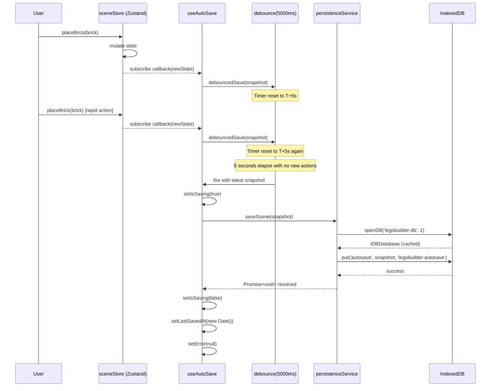
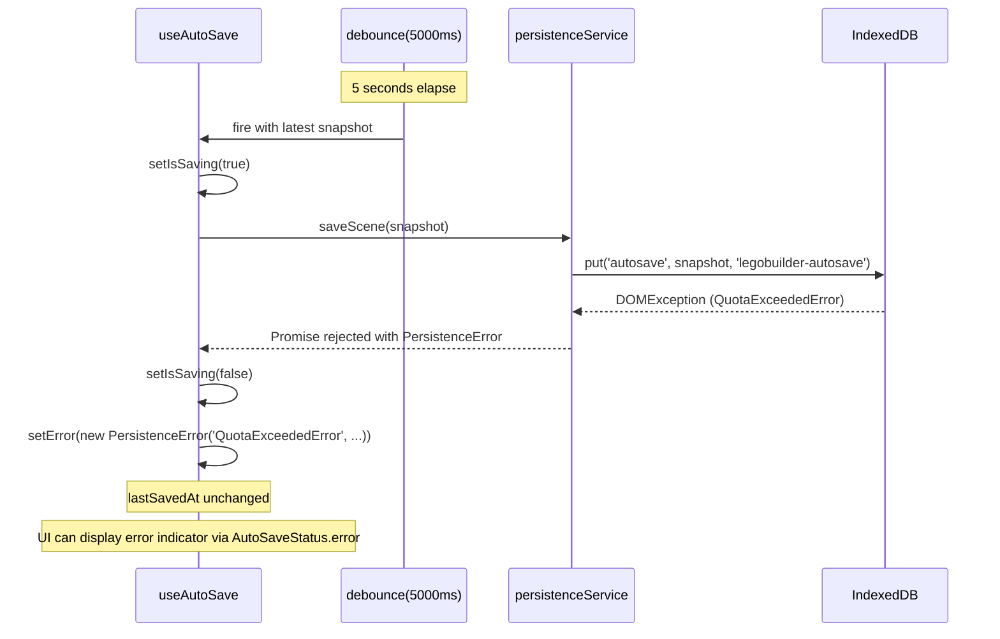
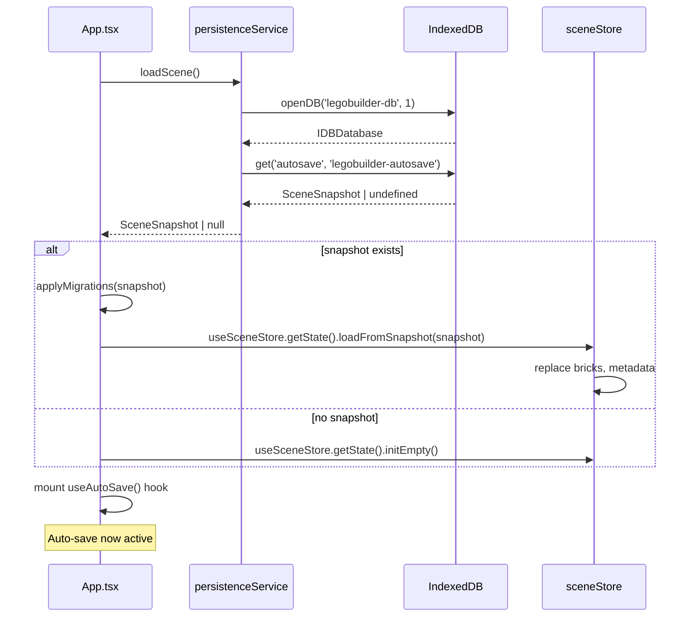
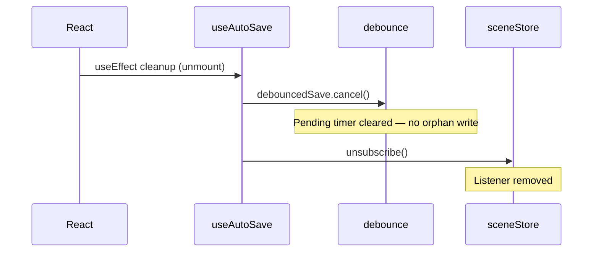

# Low-Level Design: FR-PERS-001 — Auto-Save to IndexedDB with 5-Second Debounce

**Feature:** FR-PERS-001  
**Issue:** [#20](https://github.com/sreenivasmrpivot/legobuilder/issues/20)  
**Status:** Draft — Awaiting Gate 6a Design Review  
**Author:** Spectra Design Agent  
**Date:** 2026-04-11  

---

## Table of Contents

1. [Overview](#1-overview)
2. [Component Architecture](#2-component-architecture)
3. [Data Models](#3-data-models)
4. [Interface Contracts](#4-interface-contracts)
5. [Sequence Diagrams](#5-sequence-diagrams)
6. [Error Handling Strategy](#6-error-handling-strategy)
7. [Security Considerations](#7-security-considerations)
8. [Performance Considerations](#8-performance-considerations)
9. [Test Case Mapping](#9-test-case-mapping)
10. [NFR Compliance](#10-nfr-compliance)
11. [Open Questions & Assumptions](#11-open-questions--assumptions)

---

## 1. Overview

FR-PERS-001 requires the application to automatically persist the current scene state to IndexedDB within 5 seconds of the last user action. The save is debounced to prevent excessive writes during rapid building sessions. The save operation must be non-blocking (does not interrupt the render loop) and must complete in <500 ms for a 500-brick scene.

### Scope

| Module | File | Role |
|--------|------|------|
| `debounce` utility | `frontend/src/utils/debounce.ts` | Generic debounce function (already scaffolded) |
| `persistenceService` | `frontend/src/services/persistenceService.ts` | IndexedDB read/write via `idb` library (already scaffolded) |
| `useAutoSave` hook | `frontend/src/hooks/useAutoSave.ts` | Subscribes to `sceneStore` changes, debounces 5s (already scaffolded) |
| `sceneStore` | `frontend/src/stores/sceneStore.ts` | Zustand store — source of truth for scene state |
| `App` component | `frontend/src/App.tsx` | Mounts `useAutoSave` hook at app root |

### Dependencies

- **#8 (FR-SCENE-001):** `sceneStore` must be initialized before `useAutoSave` subscribes.
- **#10 (FR-BRICK-001):** Brick placement actions must mutate `sceneStore` to trigger auto-save.
- **`idb` library:** Wraps IndexedDB with a Promise-based API (already in `package.json`).

---

## 2. Component Architecture

```
+---------------------------------------------------------------+
|                        App.tsx                                |
|  +----------------------------------------------------------+  |
|  |  useAutoSave hook (mounted once at app root)             |  |
|  |  +----------------------------------------------------+  |  |
|  |  |  Zustand sceneStore.subscribe()                    |  |  |
|  |  |  -> onChange callback                              |  |  |
|  |  |    -> debouncedSave(sceneSnapshot, 5000ms)         |  |  |
|  |  |      -> persistenceService.saveScene(snapshot)     |  |  |
|  |  |        -> idb.put('legobuilder-autosave', snapshot) |  |  |
|  |  +----------------------------------------------------+  |  |
|  +----------------------------------------------------------+  |
+---------------------------------------------------------------+

+---------------------------------------------------------------+
|                    Module Dependency Graph                    |
|                                                               |
|  App.tsx                                                      |
|    +-- useAutoSave.ts          (hook)                         |
|          +-- sceneStore.ts     (Zustand store - subscribe)    |
|          +-- persistenceService.ts  (service - saveScene)     |
|          |     +-- idb         (npm library)                  |
|          +-- debounce.ts       (utility)                      |
+---------------------------------------------------------------+
```

### 2.1 `debounce.ts` — Utility

**Path:** `frontend/src/utils/debounce.ts`  
**Responsibility:** Generic debounce factory. Returns a debounced version of any function that delays invocation until `delayMs` milliseconds have elapsed since the last call. Exposes a `.cancel()` method for cleanup.

**Interface:**
```typescript
function debounce<T extends (...args: unknown[]) => unknown>(
  fn: T,
  delayMs: number
): DebouncedFn<T>

type DebouncedFn<T extends (...args: unknown[]) => unknown> = {
  (...args: Parameters<T>): void;
  cancel(): void;
};
```

**Behaviour:**
- Each call resets the internal timer.
- After `delayMs` ms of inactivity, `fn` is invoked with the most recent arguments.
- `.cancel()` clears the pending timer without invoking `fn`.

---

### 2.2 `persistenceService.ts` — Service

**Path:** `frontend/src/services/persistenceService.ts`  
**Responsibility:** Encapsulates all IndexedDB operations. Uses the `idb` library for a Promise-based API. Exposes `saveScene`, `loadScene`, and `clearScene`.

**IndexedDB Configuration:**

| Parameter | Value |
|-----------|-------|
| Database name | `legobuilder-db` |
| Database version | `1` |
| Object store name | `autosave` |
| Key | `legobuilder-autosave` |
| Value | Serialized `SceneSnapshot` JSON |

**Interface:**
```typescript
interface PersistenceService {
  saveScene(snapshot: SceneSnapshot): Promise<void>;
  loadScene(): Promise<SceneSnapshot | null>;
  clearScene(): Promise<void>;
}
```

**Implementation Notes:**
- `openDB` is called lazily on first use and the connection is cached (singleton pattern).
- `saveScene` uses `idb.put(storeName, snapshot, IDB_KEY)` — overwrites any existing record.
- `loadScene` uses `idb.get(storeName, IDB_KEY)` — returns `null` if no record exists.
- `clearScene` uses `idb.delete(storeName, IDB_KEY)`.
- All methods are `async` and return Promises — callers must `await` or handle rejections.

---

### 2.3 `useAutoSave.ts` — React Hook

**Path:** `frontend/src/hooks/useAutoSave.ts`  
**Responsibility:** Subscribes to `sceneStore` changes via Zustand's `subscribe` API. On each change, calls the debounced save function. Manages the debounce lifecycle (creates on mount, cancels on unmount).

**Interface:**
```typescript
interface AutoSaveStatus {
  isSaving: boolean;        // true while saveScene Promise is in-flight
  lastSavedAt: Date | null; // timestamp of last successful save
  error: Error | null;      // last save error, null if no error
}

function useAutoSave(): AutoSaveStatus;
```

**Behaviour:**
- On mount: creates a debounced save function with `AUTOSAVE_DEBOUNCE_MS = 5000`.
- Subscribes to `sceneStore` using `useSceneStore.subscribe(listener)`.
- On each store change: calls `debouncedSave(currentSnapshot)`.
- On unmount: calls `debouncedSave.cancel()` and unsubscribes from the store.
- `isSaving` is set to `true` when the debounce fires and the async save begins; set to `false` when the Promise resolves or rejects.
- `lastSavedAt` is updated on successful save.
- `error` is set on save failure; cleared on next successful save.

**Constant:**
```typescript
const AUTOSAVE_DEBOUNCE_MS = 5_000; // 5 seconds
```

---

### 2.4 `sceneStore.ts` — Zustand Store (read interface)

**Path:** `frontend/src/stores/sceneStore.ts`  
**Responsibility (for this feature):** Provides the `subscribe` API and a `getSnapshot()` selector that returns a serializable `SceneSnapshot`.

**Relevant API consumed by `useAutoSave`:**
```typescript
// Subscribe to all state changes
const unsubscribe = useSceneStore.subscribe(
  (state) => state,          // selector — full state
  (newState) => { ... }      // listener
);

// Get current snapshot for serialization
const snapshot = useSceneStore.getState().getSnapshot();
```

> **Note:** `getSnapshot()` must return a plain serializable object (no class instances, no circular refs). This is a design constraint for `JSON.stringify` compatibility.

---

## 3. Data Models

### 3.1 `SceneSnapshot` — Persisted Payload

```typescript
/**
 * The serialized representation of the scene stored in IndexedDB.
 * Must be JSON-serializable (no class instances, no circular refs).
 */
interface SceneSnapshot {
  version: number;           // Schema version for future migrations (start at 1)
  savedAt: string;           // ISO 8601 timestamp (set by persistenceService)
  bricks: BrickRecord[];     // All placed bricks
  metadata: SceneMetadata;   // Scene-level metadata
}

interface BrickRecord {
  id: string;                // UUID
  type: BrickType;           // e.g. '2x4', '1x2', '2x2'
  color: string;             // Hex color string e.g. '#FF0000'
  position: Position3D;      // { x, y, z } in grid units
  rotation: Rotation3D;      // { x, y, z } in degrees (0 | 90 | 180 | 270)
}

interface Position3D {
  x: number;
  y: number;
  z: number;
}

interface Rotation3D {
  x: number;
  y: number;
  z: number;
}

interface SceneMetadata {
  name: string;              // Scene name (default: 'Untitled')
  brickCount: number;        // Denormalized count for quick reads
  createdAt: string;         // ISO 8601 — first save timestamp
  updatedAt: string;         // ISO 8601 — last mutation timestamp
}
```

### 3.2 IndexedDB Schema

```
Database: legobuilder-db  (version 1)
+-- Object Store: autosave
      keyPath: (none — explicit key passed to put/get)
      autoIncrement: false
      Indexes: (none required)
      Records:
        key: 'legobuilder-autosave'
        value: SceneSnapshot (JSON object)
```

**Schema Migration Strategy:**
- `SceneSnapshot.version` field enables future migrations.
- On `loadScene`, if `snapshot.version < CURRENT_VERSION`, a migration function is applied before returning.
- Version 1 to Version 2 migrations are out of scope for FR-PERS-001 but the version field must be present from day one.

### 3.3 `AutoSaveStatus` — Hook Return Type

```typescript
interface AutoSaveStatus {
  isSaving: boolean;        // true while IndexedDB write is in-flight
  lastSavedAt: Date | null; // null until first successful save
  error: Error | null;      // null if last save succeeded
}
```

---

## 4. Interface Contracts

### 4.1 `persistenceService` Public API

```typescript
// frontend/src/services/persistenceService.ts

export const persistenceService: PersistenceService;

interface PersistenceService {
  /**
   * Persist the given scene snapshot to IndexedDB.
   * Overwrites any previously saved snapshot.
   * @throws {PersistenceError} if IndexedDB is unavailable or write fails
   */
  saveScene(snapshot: SceneSnapshot): Promise<void>;

  /**
   * Load the last auto-saved scene snapshot from IndexedDB.
   * @returns SceneSnapshot if a saved record exists, null otherwise
   * @throws {PersistenceError} if IndexedDB is unavailable or read fails
   */
  loadScene(): Promise<SceneSnapshot | null>;

  /**
   * Delete the auto-saved record from IndexedDB.
   * @throws {PersistenceError} if IndexedDB is unavailable or delete fails
   */
  clearScene(): Promise<void>;
}
```

### 4.2 `useAutoSave` Hook API

```typescript
// frontend/src/hooks/useAutoSave.ts

/**
 * Mounts auto-save behaviour. Must be called once at the App root.
 * Subscribes to sceneStore and debounces saves to IndexedDB.
 *
 * @returns AutoSaveStatus — reactive status for UI indicators
 */
export function useAutoSave(): AutoSaveStatus;
```

### 4.3 `debounce` Utility API

```typescript
// frontend/src/utils/debounce.ts

/**
 * Returns a debounced version of fn that delays invocation by delayMs.
 * The returned function has a .cancel() method to abort pending invocation.
 */
export function debounce<T extends (...args: unknown[]) => unknown>(
  fn: T,
  delayMs: number
): DebouncedFn<T>;

export type DebouncedFn<T extends (...args: unknown[]) => unknown> = {
  (...args: Parameters<T>): void;
  cancel(): void;
};
```

### 4.4 `sceneStore` Snapshot Selector

```typescript
// frontend/src/stores/sceneStore.ts

// Selector used by useAutoSave to extract serializable snapshot
export const selectSceneSnapshot = (state: SceneState): SceneSnapshot => ({
  version: SCENE_SNAPSHOT_VERSION,  // constant = 1
  savedAt: new Date().toISOString(),
  bricks: state.bricks,
  metadata: {
    name: state.name,
    brickCount: state.bricks.length,
    createdAt: state.createdAt,
    updatedAt: state.updatedAt,
  },
});
```

---

## 5. Sequence Diagrams

### 5.1 Happy Path — Auto-Save Triggered After 5-Second Debounce



### 5.2 Failure Path — IndexedDB Write Error



### 5.3 App Startup — Load Last Saved Scene



### 5.4 Unmount / Cleanup



---

## 6. Error Handling Strategy

| Error Condition | Source | Handling | User Impact |
|----------------|--------|----------|-------------|
| `QuotaExceededError` | IndexedDB storage full | Catch in `persistenceService.saveScene`, wrap in `PersistenceError`, propagate to hook | `AutoSaveStatus.error` set; UI may show warning toast |
| `InvalidStateError` | IDB connection closed | Re-open DB on next save attempt (lazy reconnect) | Transparent retry on next debounce fire |
| `UnknownError` / generic IDB error | Browser IDB implementation | Catch, wrap in `PersistenceError`, log to console.error | `AutoSaveStatus.error` set |
| `JSON.stringify` failure | Non-serializable state | Guard in `selectSceneSnapshot` — validate before passing to service | Save skipped; error logged; no crash |
| `sceneStore` not initialized | Race condition on mount | `useAutoSave` checks `useSceneStore.getState().bricks !== undefined` before subscribing | No-op until store is ready |
| IndexedDB not supported | Old browser / private mode | Feature-detect on `persistenceService` init; log warning | Auto-save silently disabled; no crash |
| Concurrent save in-flight | Rapid debounce fires | `isSaving` guard: skip new save if previous is still in-flight | At most one write in-flight at a time |
| App closed mid-write | Browser crash / tab close | IndexedDB transactions are atomic — partial writes are rolled back | Last committed snapshot is safe |

### `PersistenceError` Class

```typescript
export class PersistenceError extends Error {
  constructor(
    public readonly code: 'QuotaExceededError' | 'InvalidStateError' | 'UnknownError',
    public readonly cause?: unknown
  ) {
    super(`PersistenceError [${code}]: ${String(cause)}`);
    this.name = 'PersistenceError';
  }
}
```

---

## 7. Security Considerations

| Concern | Mitigation |
|---------|------------|
| **Data exposure in shared browser** | IndexedDB is origin-scoped by the browser. Data is only accessible to `legobuilder` origin. No additional encryption required for non-sensitive scene data. |
| **XSS via stored data** | Scene data is loaded back into Zustand store (not rendered as HTML). No `innerHTML` or `dangerouslySetInnerHTML` usage. Safe from stored-XSS. |
| **Prototype pollution** | `loadScene` result is validated against `SceneSnapshot` schema (Zod or manual type guard) before being passed to `sceneStore`. Rejects unexpected keys. |
| **Storage quota abuse** | `saveScene` catches `QuotaExceededError` and surfaces it via `AutoSaveStatus.error`. No unbounded growth — single key overwrites previous record. |
| **Sensitive data in scene** | Scene data contains only brick geometry and colors — no PII, credentials, or sensitive user data. No encryption required. |
| **Snapshot schema injection** | `selectSceneSnapshot` produces a typed, bounded object. Only known fields are included. No dynamic key injection. |

---

## 8. Performance Considerations

### 8.1 Non-Blocking Save

- `persistenceService.saveScene` is fully `async` — it never blocks the main thread synchronously.
- The IndexedDB write is dispatched as a microtask after the debounce fires.
- The render loop (Three.js / R3F RAF) is unaffected.

### 8.2 500-Brick Scene Budget

| Metric | Target | Rationale |
|--------|--------|-----------|
| `JSON.stringify` time (500 bricks) | < 5 ms | Each brick ~100 bytes => 50 KB total; V8 stringify is ~10 MB/ms |
| IndexedDB `put` time (50 KB) | < 50 ms | Typical IDB write latency for small payloads |
| Total `saveScene` wall time | < 500 ms | Acceptance criterion from issue #20 |
| UI thread blocking | 0 ms | All IDB ops are async; no synchronous work on main thread |

### 8.3 Debounce Effectiveness

- A user placing 10 bricks/second for 30 seconds triggers 300 store mutations.
- Without debounce: 300 IDB writes.
- With 5-second debounce: 1 IDB write (only the final state).
- Debounce timer resets on every mutation — the save fires exactly 5 seconds after the **last** action.

### 8.4 Concurrent Write Guard

```typescript
// In useAutoSave — prevents overlapping writes
if (isSaving) {
  return; // skip — previous write still in-flight
}
```

This ensures at most one IndexedDB transaction is open at a time, preventing write amplification under pathological conditions.

---

## 9. Test Case Mapping

| Test ID | Description | Type | Covers |
|---------|-------------|------|--------|
| T-BE-PERS-001-01 | Debounce fires exactly once after 5s of inactivity following rapid actions | Unit | `debounce.ts` + `useAutoSave` |
| T-BE-PERS-001-02 | `persistenceService.saveScene` writes correct `SceneSnapshot` to IndexedDB | Unit | `persistenceService.ts` |
| T-BE-PERS-001-03 | `persistenceService.loadScene` returns `null` when no record exists; returns snapshot when record exists | Unit | `persistenceService.ts` |
| T-E2E-PERS-001-01 | Full E2E: place bricks -> wait 5s -> close tab -> reopen -> scene restored | E2E (Playwright) | Full stack |

### Unit Test Approach (T-BE-PERS-001-01)

```typescript
// Uses Vitest fake timers
it('fires save exactly once after 5s debounce', async () => {
  vi.useFakeTimers();
  const saveMock = vi.fn().mockResolvedValue(undefined);
  // ... mount hook with mocked persistenceService
  // Trigger 10 rapid store mutations
  for (let i = 0; i < 10; i++) {
    act(() => sceneStore.getState().addBrick(mockBrick(i)));
  }
  expect(saveMock).not.toHaveBeenCalled(); // debounce not yet fired
  await act(() => vi.advanceTimersByTimeAsync(5000));
  expect(saveMock).toHaveBeenCalledTimes(1); // exactly once
  vi.useRealTimers();
});
```

### Unit Test Approach (T-BE-PERS-001-02)

```typescript
// Uses fake-indexeddb for in-memory IDB
import 'fake-indexeddb/auto';

it('saveScene writes correct snapshot to IndexedDB', async () => {
  const snapshot = buildMockSnapshot(500); // 500 bricks
  const start = performance.now();
  await persistenceService.saveScene(snapshot);
  const elapsed = performance.now() - start;
  expect(elapsed).toBeLessThan(500); // <500ms requirement
  const loaded = await persistenceService.loadScene();
  expect(loaded).toEqual(snapshot);
});
```

### E2E Test Approach (T-E2E-PERS-001-01)

```typescript
// Playwright test
test('auto-save restores scene after tab close', async ({ page }) => {
  await page.goto('/');
  // Place 3 bricks via UI
  await placeBrick(page, { x: 0, y: 0, z: 0 });
  await placeBrick(page, { x: 2, y: 0, z: 0 });
  await placeBrick(page, { x: 4, y: 0, z: 0 });
  // Wait for auto-save (5s debounce + buffer)
  await page.waitForTimeout(6000);
  // Close and reopen
  await page.close();
  const newPage = await browser.newPage();
  await newPage.goto('/');
  // Assert 3 bricks are present
  const brickCount = await newPage.evaluate(() =>
    window.__legoApp?.scene?.getBrickCount()
  );
  expect(brickCount).toBe(3);
});
```

---

## 10. NFR Compliance

| NFR | Requirement | Design Approach | Measurable Target |
|-----|-------------|-----------------|-------------------|
| Save latency | <500 ms for 500-brick scene | Async IDB write; no main-thread blocking | `performance.now()` delta in T-BE-PERS-001-02 |
| Debounce window | Exactly 5 seconds | `AUTOSAVE_DEBOUNCE_MS = 5_000` constant | Vitest fake timers in T-BE-PERS-001-01 |
| UI thread blocking | 0 ms | All IDB ops are async Promises | No `performance.mark` jank in E2E |
| Data durability | Last state available after unexpected close | IDB transactions are atomic; single-key overwrite | T-E2E-PERS-001-01 |
| Storage efficiency | Single record, bounded size | One key `legobuilder-autosave`; overwrites on each save | ~50 KB for 500 bricks |

---

## 11. Open Questions & Assumptions

| # | Question / Assumption | Type | Resolution |
|---|----------------------|------|------------|
| 1 | **Assumption:** `sceneStore` exposes a `subscribe` method compatible with Zustand's vanilla `subscribe` API. | Assumption | Verify against FR-SCENE-001 (#8) LLD before implementation. |
| 2 | **Assumption:** `idb` library (v7+) is already in `package.json`. | Assumption | Confirmed from scaffold commit message — `idb` listed as dependency. |
| 3 | **Question:** Should `useAutoSave` also trigger a save on `beforeunload` (synchronous flush)? | Open | `beforeunload` cannot await async IDB writes. Consider `navigator.locks` or synchronous localStorage fallback for crash durability. Recommend deferring to a follow-up FR. |
| 4 | **Question:** Should `AutoSaveStatus.error` be surfaced in the UI (e.g., toast notification)? | Open | The hook exposes `error` — the UI layer decides whether to display it. Recommend a non-intrusive status bar indicator. |
| 5 | **Assumption:** `SceneSnapshot.version = 1` is the initial schema version. Migration logic is out of scope for FR-PERS-001. | Assumption | Version field must be present from day one to enable future migrations. |
| 6 | **Question:** Should `loadScene` be called in `App.tsx` or in a dedicated `useSceneRestore` hook? | Open | Recommend `App.tsx` for simplicity in v1. A dedicated hook can be extracted if restore logic grows complex. |
