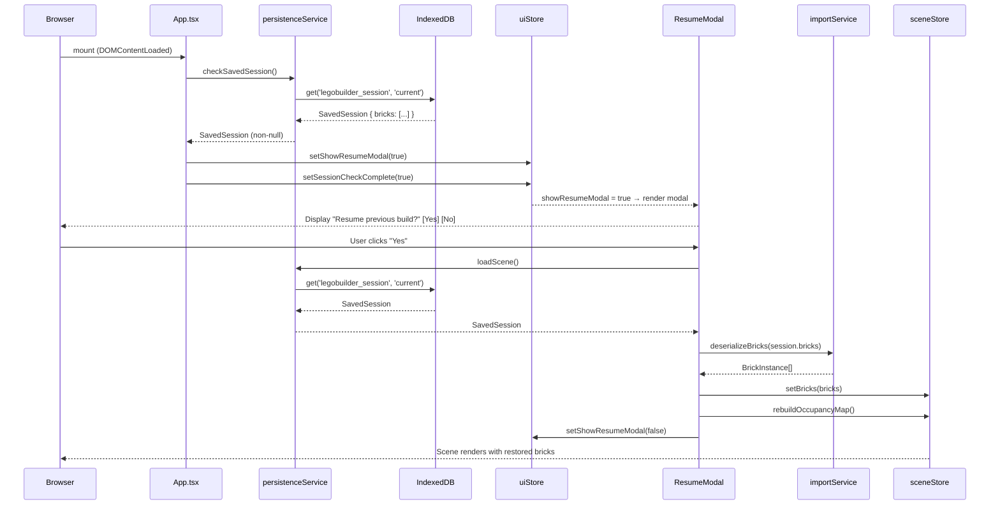
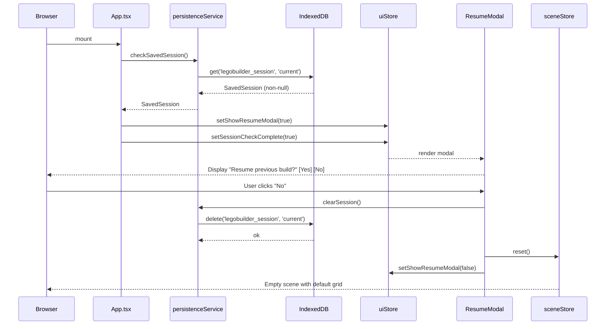
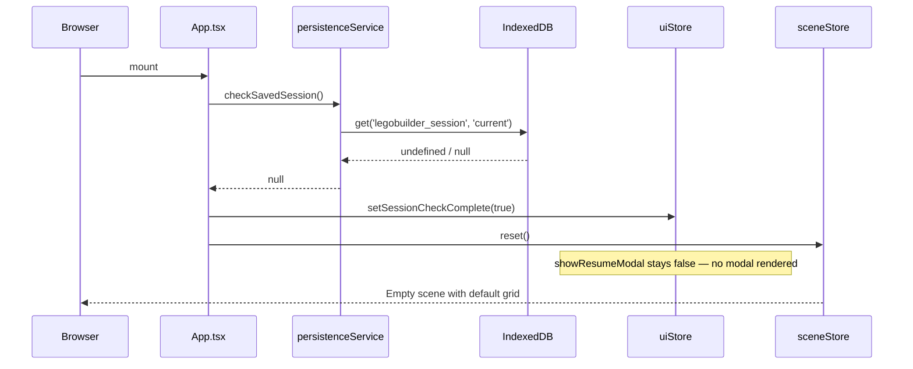

# Low-Level Design: FR-PERS-002
## Detect Saved Session on Load and Prompt User to Resume or Start Fresh

**FR-ID:** FR-PERS-002  
**Issue:** [#19](https://github.com/sreenivasmrpivot/legobuilder/issues/19)  
**Status:** Draft — Awaiting Gate 6a Design Review  
**Area:** Frontend (client-side SPA)  
**Author:** Spectra Design Agent  

---

## 1. Overview

When the LegoBuilder application loads, it must detect whether a previously saved session exists in IndexedDB. If a session is found, a modal dialog prompts the user to either **Resume** the previous build or **Start Fresh**. If no session exists, the app initialises an empty scene silently.

This feature depends on FR-PERS-001 (session persistence write path) which provides the `persistenceService` and the IndexedDB schema.

---

## 2. Component Architecture

### 2.1 Module Map

```
frontend/src/
├── App.tsx                          # Root component — orchestrates session detection on mount
├── components/
│   └── ResumeModal/
│       ├── ResumeModal.tsx           # Modal UI component (Yes / No)
│       └── ResumeModal.test.tsx      # Unit tests
├── services/
│   ├── persistenceService.ts        # checkSavedSession(), loadScene(), clearSession()
│   └── importService.ts             # deserializeBricks() — converts stored JSON → BrickInstance[]
├── stores/
│   ├── uiStore.ts                   # showResumeModal: boolean flag
│   └── sceneStore.ts                # bricks[], occupancyMap — populated on resume
└── types/
    └── persistence.types.ts         # SavedSession, BrickInstance, OccupancyKey interfaces
```

### 2.2 Dependency Graph

```
App.tsx
  └─► persistenceService.checkSavedSession()
        └─► IndexedDB (idb library)
  └─► uiStore.setShowResumeModal(true | false)

ResumeModal.tsx
  └─► uiStore.showResumeModal  (read)
  └─► onResume()  →  persistenceService.loadScene()
                       └─► importService.deserializeBricks()
                             └─► sceneStore.setBricks()
                             └─► sceneStore.rebuildOccupancyMap()
  └─► onStartFresh()  →  persistenceService.clearSession()
                           └─► sceneStore.reset()
  └─► uiStore.setShowResumeModal(false)
```

---

## 3. Data Models

### 3.1 IndexedDB Schema (owned by FR-PERS-001)

| Store Name | Key Path | Indexes | Description |
|---|---|---|---|
| `legobuilder_session` | `id` (always `"current"`) | — | Single-record session store |

### 3.2 TypeScript Interfaces

```typescript
// frontend/src/types/persistence.types.ts

export interface BrickInstance {
  id: string;           // UUID v4
  type: string;         // e.g. "2x4", "1x2"
  color: string;        // CSS hex string e.g. "#FF0000"
  position: {
    x: number;          // grid column
    y: number;          // grid row (stack height)
    z: number;          // grid depth
  };
  rotation: number;     // degrees: 0 | 90 | 180 | 270
}

export interface SavedSession {
  id: "current";        // fixed key — only one session per user
  version: number;      // schema version for forward-compat migrations
  savedAt: string;      // ISO-8601 timestamp
  bricks: BrickInstance[];
}

export type OccupancyKey = `${number},${number},${number}`; // "x,y,z"
export type OccupancyMap = Map<OccupancyKey, string>;        // key → brickId
```

### 3.3 UI Store Shape (Zustand)

```typescript
// frontend/src/stores/uiStore.ts  (relevant slice)

interface UIState {
  showResumeModal: boolean;
  sessionCheckComplete: boolean;
  setShowResumeModal: (value: boolean) => void;
  setSessionCheckComplete: (value: boolean) => void;
}
```

### 3.4 Scene Store Shape (Zustand)

```typescript
// frontend/src/stores/sceneStore.ts  (relevant slice)

interface SceneState {
  bricks: BrickInstance[];
  occupancyMap: OccupancyMap;

  setBricks: (bricks: BrickInstance[]) => void;
  rebuildOccupancyMap: () => void;
  reset: () => void;
}
```

---

## 4. Service Interfaces

### 4.1 `persistenceService`

```typescript
// frontend/src/services/persistenceService.ts

/**
 * Checks whether a saved session exists in IndexedDB.
 * Returns the session if found, null otherwise.
 * Must be called once on app init (App.tsx useEffect).
 */
export async function checkSavedSession(): Promise<SavedSession | null>;

/**
 * Loads the saved session from IndexedDB.
 * Returns the full SavedSession object.
 * Throws PersistenceError if the record is missing or corrupt.
 */
export async function loadScene(): Promise<SavedSession>;

/**
 * Deletes the saved session record from IndexedDB.
 * Called when the user chooses "Start Fresh".
 */
export async function clearSession(): Promise<void>;
```

### 4.2 `importService`

```typescript
// frontend/src/services/importService.ts

/**
 * Deserializes raw JSON bricks array from IndexedDB into typed BrickInstance[].
 * Validates each brick against the BrickInstance schema.
 * Throws ImportError if any brick fails validation.
 */
export function deserializeBricks(raw: unknown[]): BrickInstance[];
```

---

## 5. API Endpoints

This feature is **entirely client-side**. There are no HTTP API endpoints. All persistence is via the browser's IndexedDB API, accessed through the `idb` library wrapper.

| Operation | Mechanism | IndexedDB Store | Key |
|---|---|---|---|
| Check session | `idb.get('legobuilder_session', 'current')` | `legobuilder_session` | `"current"` |
| Load session | `idb.get('legobuilder_session', 'current')` | `legobuilder_session` | `"current"` |
| Clear session | `idb.delete('legobuilder_session', 'current')` | `legobuilder_session` | `"current"` |

---

## 6. Sequence Diagrams

### 6.1 App Load — Session Detected → User Resumes



### 6.2 App Load — Session Detected → User Starts Fresh



### 6.3 App Load — No Session Exists



---

## 7. Component Design: `ResumeModal`

### 7.1 Props Interface

```typescript
// frontend/src/components/ResumeModal/ResumeModal.tsx

interface ResumeModalProps {
  onResume: () => Promise<void>;
  onStartFresh: () => void;
}
```

### 7.2 Rendering Logic in App.tsx

```typescript
// App.tsx — conditional render
const showResumeModal = useUIStore((s) => s.showResumeModal);
const sessionCheckComplete = useUIStore((s) => s.sessionCheckComplete);

// Block scene render until session check resolves
if (!sessionCheckComplete) return <LoadingSpinner />;

return (
  <>
    {showResumeModal && (
      <ResumeModal
        onResume={handleResume}
        onStartFresh={handleStartFresh}
      />
    )}
    <Scene />
  </>
);
```

### 7.3 Modal Behaviour States

| State | Trigger | Outcome |
|---|---|---|
| `idle` | Initial render | Both buttons enabled |
| `loading` | User clicks "Yes" | Spinner shown; buttons disabled |
| `error` | `loadScene()` throws | Error message shown; "Try Again" + "Start Fresh" offered |

### 7.4 Accessibility

- Modal uses `role="dialog"` and `aria-modal="true"`.
- Focus is trapped inside the modal while open (focus-trap-react or equivalent).
- `aria-labelledby` points to the modal heading.
- Keyboard: `Enter` confirms "Yes"; `Escape` triggers "No" (Start Fresh).

---

## 8. Error Handling Strategy

| Error Scenario | Source | Handling |
|---|---|---|
| IndexedDB unavailable (private browsing, quota exceeded) | `checkSavedSession()` | Catch error → treat as no session → silent empty scene |
| Corrupt session data (JSON parse failure) | `deserializeBricks()` | Throw `ImportError` → modal shows error state → offer "Start Fresh" |
| `loadScene()` returns null unexpectedly | `persistenceService` | Throw `PersistenceError` → modal shows error state |
| `clearSession()` fails | `persistenceService` | Log warning; proceed with `sceneStore.reset()` regardless |
| Schema version mismatch | `deserializeBricks()` | Attempt migration; if unsupported version → treat as corrupt |

### 8.1 Custom Error Types

```typescript
export class PersistenceError extends Error {
  constructor(message: string, public readonly cause?: unknown) {
    super(message);
    this.name = 'PersistenceError';
  }
}

export class ImportError extends Error {
  constructor(message: string, public readonly invalidBrick?: unknown) {
    super(message);
    this.name = 'ImportError';
  }
}
```

---

## 9. Security Considerations

| Concern | Mitigation |
|---|---|
| **XSS via stored data** | `deserializeBricks()` validates all fields against strict TypeScript types and rejects unknown keys. Color values are validated against `/^#[0-9A-Fa-f]{6}$/`. Position values are validated as finite integers. |
| **IndexedDB quota abuse** | Session size is bounded by the maximum brick count (500 per FR-PERS-001). At ~200 bytes/brick, max payload ≈ 100 KB — well within browser quota. |
| **Prototype pollution** | `deserializeBricks()` uses `Object.create(null)` for intermediate parsing and never spreads untrusted objects directly. |
| **Data integrity** | `SavedSession.version` field enables forward-compatible schema migrations without silent data corruption. |

---

## 10. State Machine

The session detection flow follows a simple state machine:

```
[APP_INIT]
    │
    ▼
[CHECKING_SESSION] ──error──► [NO_SESSION] ──► [EMPTY_SCENE]
    │
    ├── null ──► [NO_SESSION] ──► [EMPTY_SCENE]
    │
    └── session found ──► [MODAL_SHOWN]
                               │
                    ┌──────────┴──────────┐
                    ▼                     ▼
              [RESUMING]           [CLEARING_SESSION]
                    │                     │
              ┌─────┴─────┐              ▼
              ▼           ▼        [EMPTY_SCENE]
        [SCENE_LOADED] [ERROR]
                           │
                    ┌──────┴──────┐
                    ▼             ▼
             [RETRY_RESUME] [CLEARING_SESSION]
```

---

## 11. Test Case Mapping

| Test ID | Scenario | Component Under Test |
|---|---|---|
| T-BE-PERS-002-01 | `checkSavedSession()` returns session when IndexedDB has record | `persistenceService` |
| T-BE-PERS-002-02 | `checkSavedSession()` returns null when no record exists | `persistenceService` |
| T-BE-PERS-002-03 | `loadScene()` returns full SavedSession | `persistenceService` |
| T-BE-PERS-002-04 | `clearSession()` deletes the IndexedDB record | `persistenceService` |
| T-FE-PERS-002-01 | Modal renders when `showResumeModal = true`; clicking "Yes" calls `onResume` | `ResumeModal` |
| T-FE-PERS-002-02 | Clicking "No" calls `onStartFresh`; modal unmounts | `ResumeModal` |
| T-E2E-PERS-001-01 | Full E2E: save session → reload → resume → bricks restored | App integration |

---

## 12. Implementation Notes

1. **Initialisation order**: `checkSavedSession()` must be called inside a `useEffect(() => { ... }, [])` in `App.tsx` to avoid blocking the initial render.
2. **Race condition guard**: The modal must not render until `checkSavedSession()` resolves. Use `sessionCheckComplete: boolean` in `uiStore` to gate rendering of the main scene.
3. **FR-PERS-001 dependency**: This feature reads from the IndexedDB store written by FR-PERS-001. The `legobuilder_session` store must exist before this feature runs. In tests, mock `persistenceService` to avoid real IndexedDB.
4. **idb library**: Use the `idb` npm package (already a dependency per FR-PERS-001) for all IndexedDB operations — do not use raw `indexedDB` API.
5. **Vitest + jsdom**: IndexedDB is not available in jsdom. Use `fake-indexeddb` package for unit tests of `persistenceService`.
6. **Modal z-index**: The `ResumeModal` must render above the Three.js canvas. Use a React Portal targeting `document.body` with `z-index: 1000`.
7. **Loading state**: While `sessionCheckComplete` is false, render a minimal loading indicator to prevent flash of empty scene before the check resolves.
