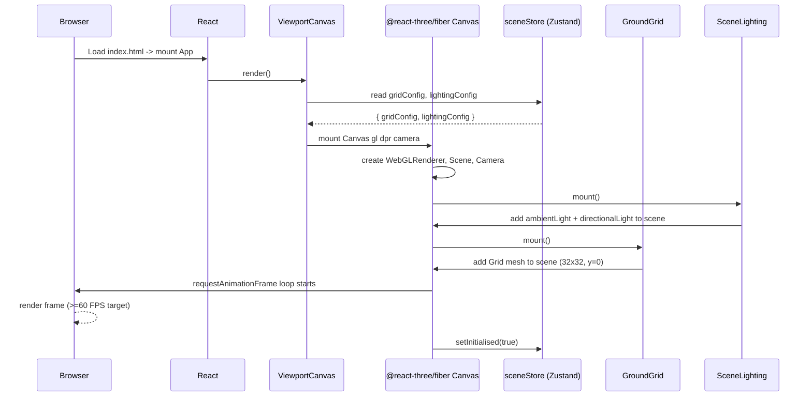
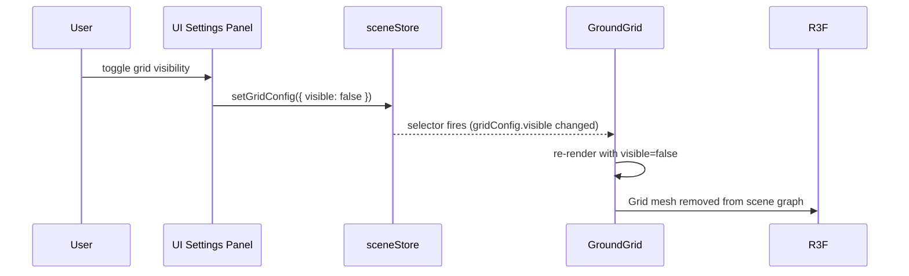
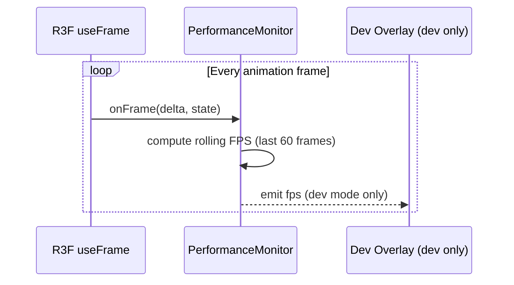
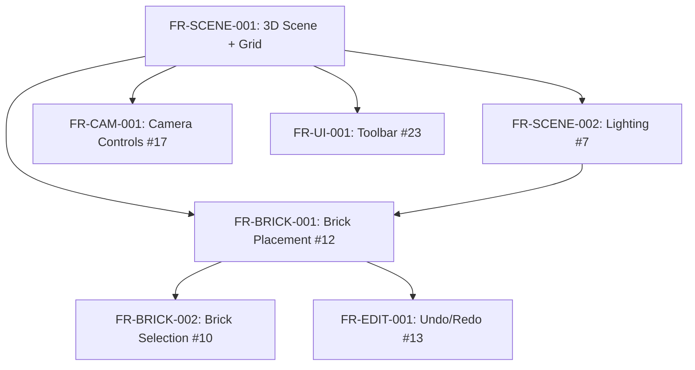

# Low-Level Design: FR-SCENE-001 — 3D Scene Rendering with Three.js Ground Grid

**Feature ID:** FR-SCENE-001
**Issue:** [#8](https://github.com/sreenivasmrpivot/legobuilder/issues/8)
**Status:** Draft — Pending Design Review (Gate 6a)
**Author:** Spectra Design Agent
**Date:** 2026-04-10
**Stack:** React 18 · TypeScript · Three.js · @react-three/fiber · @react-three/drei · Zustand

---

## 1. Overview

FR-SCENE-001 establishes the **foundational 3D rendering surface** for the LegoBuilder application. It delivers a Three.js scene (via `@react-three/fiber`) with a visible ground grid plane at 1-stud intervals extending at least 32×32 studs. This is the critical-path feature upon which all brick placement, camera control, and editing features depend.

### 1.1 Scope

| In Scope | Out of Scope |
|---|---|
| Three.js scene initialisation | Brick geometry / placement (FR-BRICK-*) |
| Ground grid plane (32×32 studs, 1-stud intervals) | Camera orbit controls (FR-CAM-001) |
| Scene store (Zustand) | Lighting beyond ambient + directional |
| Canvas wrapper component | Export / persistence |
| Performance baseline (>=60 FPS empty scene) | Shadow maps (deferred to NFR-PERF-001) |

### 1.2 Acceptance Criteria (from Issue #8)

| ID | Criterion |
|---|---|
| AC-1 | Ground grid plane visible with grid lines at 1-stud intervals on load |
| AC-2 | Grid extends >=32×32 studs when scene is empty |
| AC-3 | Empty scene achieves >=60 FPS on mid-range device (Intel i5 + integrated GPU) |

---

## 2. Component Architecture

### 2.1 Component Tree

```
App
└── ViewportCanvas          (frontend/src/components/viewport/ViewportCanvas.tsx)
    └── <Canvas>            (@react-three/fiber root — owns WebGL context)
        ├── SceneLighting   (frontend/src/components/viewport/SceneLighting.tsx)
        ├── GroundGrid      (frontend/src/components/viewport/GroundGrid.tsx)
        └── SceneRoot       (frontend/src/components/viewport/SceneRoot.tsx)
            └── [future brick objects rendered here]
```

### 2.2 Component Responsibilities

#### `ViewportCanvas` (container)
- Renders the `@react-three/fiber` `<Canvas>` with fixed camera defaults.
- Passes `gl`, `camera`, and `dpr` props to the Canvas.
- Subscribes to `sceneStore` for scene-level flags (e.g., `gridVisible`).
- Owns the CSS container that sizes the canvas to fill its parent.

#### `GroundGrid` (presentational 3D)
- Renders the ground grid using `@react-three/drei` `<Grid>` helper.
- Props: `size` (default 32), `divisions` (default 32), `colorCenterLine`, `colorGrid`.
- Positioned at `y = 0` (world origin).
- Stateless — reads grid config from `sceneStore.gridConfig`.

#### `SceneLighting` (presentational 3D)
- Renders `<ambientLight>` and `<directionalLight>` primitives.
- Intensity and position driven by `sceneStore.lightingConfig`.

#### `SceneRoot` (container 3D)
- Acts as the mount point for all dynamic scene objects (bricks, etc.).
- Subscribes to `sceneStore.objects` array (empty for FR-SCENE-001).

### 2.3 Module Dependency Graph

```
ViewportCanvas
  ├── @react-three/fiber (Canvas, useFrame, useThree)
  ├── @react-three/drei  (Grid, OrthographicCamera)
  ├── sceneStore         (Zustand)
  ├── GroundGrid
  ├── SceneLighting
  └── SceneRoot

GroundGrid
  └── @react-three/drei (Grid)

SceneLighting
  └── @react-three/fiber (primitives)

SceneRoot
  └── sceneStore (objects selector)
```

---

## 3. Data Models

### 3.1 Scene Store (`sceneStore.ts`)

Managed by Zustand. Single source of truth for scene-level state.

```typescript
// frontend/src/stores/sceneStore.ts

export interface GridConfig {
  size: number;            // studs — default 32
  divisions: number;       // grid lines — default 32
  colorCenterLine: string; // hex — default '#888888'
  colorGrid: string;       // hex — default '#444444'
  visible: boolean;        // default true
}

export interface LightingConfig {
  ambientIntensity: number;                       // default 0.6
  directionalIntensity: number;                   // default 0.8
  directionalPosition: [number, number, number];  // default [10, 20, 10]
}

export interface SceneObject {
  id: string;
  type: 'brick' | 'group';
  // Extended by FR-BRICK-* features
}

export interface SceneState {
  // Grid
  gridConfig: GridConfig;
  setGridConfig: (patch: Partial<GridConfig>) => void;

  // Lighting
  lightingConfig: LightingConfig;
  setLightingConfig: (patch: Partial<LightingConfig>) => void;

  // Scene objects (populated by FR-BRICK-001+)
  objects: SceneObject[];
  addObject: (obj: SceneObject) => void;
  removeObject: (id: string) => void;
  clearScene: () => void;

  // Meta
  isInitialised: boolean;
  setInitialised: (v: boolean) => void;
}
```

**Zustand store factory:**

```typescript
export const useSceneStore = create<SceneState>()(immer((set) => ({
  gridConfig: {
    size: 32,
    divisions: 32,
    colorCenterLine: '#888888',
    colorGrid: '#444444',
    visible: true,
  },
  setGridConfig: (patch) => set((s) => { Object.assign(s.gridConfig, patch); }),

  lightingConfig: {
    ambientIntensity: 0.6,
    directionalIntensity: 0.8,
    directionalPosition: [10, 20, 10],
  },
  setLightingConfig: (patch) => set((s) => { Object.assign(s.lightingConfig, patch); }),

  objects: [],
  addObject: (obj) => set((s) => { s.objects.push(obj); }),
  removeObject: (id) => set((s) => { s.objects = s.objects.filter(o => o.id !== id); }),
  clearScene: () => set((s) => { s.objects = []; }),

  isInitialised: false,
  setInitialised: (v) => set((s) => { s.isInitialised = v; }),
})));
```

### 3.2 Camera Store (`cameraStore.ts`)

FR-SCENE-001 seeds the default isometric camera position. FR-CAM-001 will extend this store.

```typescript
// frontend/src/stores/cameraStore.ts

export interface CameraState {
  position: [number, number, number];              // default [20, 20, 20]
  target: [number, number, number];                // default [0, 0, 0]
  zoom: number;                                    // default 1.0
  projectionType: 'perspective' | 'orthographic';  // default 'perspective'
}
```

### 3.3 Stud Unit Convention

| Constant | Value | Notes |
|---|---|---|
| `STUD_SIZE` | `1.0` (Three.js units) | 1 Three.js unit = 1 LEGO stud |
| `PLATE_HEIGHT` | `0.4` | Standard LEGO plate height |
| `BRICK_HEIGHT` | `1.2` | Standard LEGO brick height |
| `GRID_ORIGIN` | `[0, 0, 0]` | World origin = grid centre |

All geometry in the application uses these constants from `frontend/src/constants/units.ts`.

---

## 4. API / Interface Contracts

> FR-SCENE-001 is a **pure frontend feature** — there are no backend API endpoints. All state is client-side (Zustand). The "API" surface is the component props interface and the store selectors.

### 4.1 `ViewportCanvas` Props

```typescript
export interface ViewportCanvasProps {
  /** CSS class applied to the outer div wrapper */
  className?: string;
  /** Override canvas background colour (default: '#1a1a2e') */
  background?: string;
  /** Device pixel ratio cap (default: Math.min(window.devicePixelRatio, 2)) */
  dpr?: number | [number, number];
}
```

### 4.2 `GroundGrid` Props

```typescript
export interface GroundGridProps {
  /** Number of studs along each axis (default: 32) */
  size?: number;
  /** Number of grid divisions (default: 32) */
  divisions?: number;
  /** Hex colour for centre lines (default: '#888888') */
  colorCenterLine?: string;
  /** Hex colour for grid lines (default: '#444444') */
  colorGrid?: string;
}
```

### 4.3 `SceneLighting` Props

```typescript
export interface SceneLightingProps {
  ambientIntensity?: number;                       // default 0.6
  directionalIntensity?: number;                   // default 0.8
  directionalPosition?: [number, number, number];  // default [10, 20, 10]
}
```

### 4.4 Store Selectors (public API)

```typescript
// Consumers use fine-grained selectors to avoid unnecessary re-renders
const gridConfig    = useSceneStore(s => s.gridConfig);
const gridVisible   = useSceneStore(s => s.gridConfig.visible);
const objects       = useSceneStore(s => s.objects);
const isInitialised = useSceneStore(s => s.isInitialised);
```

---

## 5. Sequence Diagrams

### 5.1 Application Boot -> Scene Render



### 5.2 Grid Config Update Flow



### 5.3 Performance Monitoring Loop



---

## 6. File Structure

```
frontend/src/
├── components/
│   └── viewport/
│       ├── ViewportCanvas.tsx       <- Canvas wrapper + R3F root
│       ├── ViewportCanvas.test.tsx  <- Unit + integration tests
│       ├── GroundGrid.tsx           <- Grid plane component
│       ├── GroundGrid.test.tsx
│       ├── SceneLighting.tsx        <- Ambient + directional lights
│       ├── SceneLighting.test.tsx
│       ├── SceneRoot.tsx            <- Mount point for scene objects
│       └── index.ts                 <- Barrel export
├── stores/
│   ├── sceneStore.ts               <- Zustand scene store
│   ├── sceneStore.test.ts
│   ├── cameraStore.ts              <- Zustand camera store (seeded here)
│   └── cameraStore.test.ts
└── constants/
    └── units.ts                    <- STUD_SIZE, PLATE_HEIGHT, BRICK_HEIGHT
```

---

## 7. Error Handling Strategy

### 7.1 WebGL Context Loss

| Scenario | Detection | Recovery |
|---|---|---|
| GPU driver crash / tab backgrounded | `webglcontextlost` event on canvas | R3F handles automatically via `onContextLost` prop; show `ContextLostOverlay` UI |
| WebGL not supported | `canvas.getContext('webgl2')` returns null | Render `WebGLUnsupportedFallback` with browser upgrade message |
| Context restored | `webglcontextrestored` event | R3F re-initialises renderer; hide overlay |

```typescript
// ViewportCanvas.tsx — context loss handling
// <Canvas
//   onCreated={({ gl }) => {
//     gl.domElement.addEventListener('webglcontextlost', handleContextLost);
//     gl.domElement.addEventListener('webglcontextrestored', handleContextRestored);
//   }}
// >
```

### 7.2 Render Error Boundary

Wrap `<Canvas>` in a React Error Boundary (`SceneErrorBoundary`) that:
- Catches render errors thrown inside the R3F tree.
- Logs to `console.error` (and future telemetry hook).
- Renders a user-friendly fallback UI with a "Reload Scene" button.

### 7.3 Performance Degradation

| Trigger | Action |
|---|---|
| FPS drops below 30 for >2 seconds | Log warning to console (dev) |
| FPS drops below 15 for >5 seconds | Emit `scene:performance-warning` custom event for UI layer |

---

## 8. Security Considerations

| Concern | Mitigation |
|---|---|
| **XSS via scene data** | All scene state is typed (TypeScript); no `dangerouslySetInnerHTML`; no eval of scene data |
| **Prototype pollution** | Zustand `immer` middleware uses structural cloning; no `Object.assign` on untrusted input |
| **Canvas fingerprinting** | No canvas fingerprint data is exposed or transmitted; purely local rendering |
| **Dependency supply chain** | Three.js, R3F, Drei pinned to exact versions in `package.json`; Dependabot enabled |
| **CSP** | `script-src 'self'`; WebGL does not require `unsafe-eval`; no inline scripts |

---

## 9. Performance Design

### 9.1 Targets

| Metric | Target | Measurement |
|---|---|---|
| FPS (empty scene) | >=60 FPS | Chrome DevTools Performance tab; `useFrame` delta |
| Initial render time | <500 ms | `performance.mark('scene:ready')` |
| JS bundle (viewport chunk) | <150 KB gzipped | Vite bundle analyser |
| Memory (empty scene) | <50 MB GPU | Chrome GPU memory inspector |

### 9.2 Optimisation Techniques

| Technique | Applied Where |
|---|---|
| `dpr` cap at `Math.min(devicePixelRatio, 2)` | `ViewportCanvas` Canvas prop |
| `frameloop='demand'` when scene is static | `ViewportCanvas` — switch to `'always'` when objects are added |
| Grid geometry is shared (single instance) | `GroundGrid` — no per-frame allocation |
| Zustand fine-grained selectors | All store consumers — prevents unnecessary re-renders |
| React `memo` on all 3D components | `GroundGrid`, `SceneLighting`, `SceneRoot` |
| Vite code-splitting: viewport chunk | `vite.config.ts` — `manualChunks: { viewport: ['@react-three/fiber', 'three'] }` |

### 9.3 Frame Budget (empty scene, 60 FPS = 16.67 ms/frame)

| Task | Budget |
|---|---|
| JavaScript (React reconciler + Zustand) | <=2 ms |
| Three.js scene graph traversal | <=1 ms |
| WebGL draw calls (grid only) | <=3 ms |
| GPU rasterisation | <=8 ms |
| Browser composite | <=2 ms |
| **Total** | **<=16 ms** |

---

## 10. Accessibility Considerations

| Requirement | Implementation |
|---|---|
| Canvas `role` and `aria-label` | `<canvas role="img" aria-label="3D LEGO builder scene" />` |
| Keyboard focus indicator | Canvas wrapper div has `tabIndex={0}` with visible focus ring (CSS outline) |
| Reduced motion | `prefers-reduced-motion` media query disables non-essential animations; grid remains static |
| Screen reader fallback | `<noscript>` and `<div aria-live="polite">` announce scene state changes |

---

## 11. Testing Strategy

### 11.1 Test Case Mapping

| Test ID | Type | Description | Tool |
|---|---|---|---|
| T-BE-SCENE-001-01 | Unit | `GroundGrid` renders with correct size and divisions props | Vitest + @testing-library/react |
| T-BE-SCENE-001-02 | Unit | `sceneStore` initialises with correct default gridConfig | Vitest |
| T-E2E-SCENE-001-01 | E2E | Canvas is visible and grid is rendered on app load | Playwright |

### 11.2 Unit Test Approach

```typescript
// GroundGrid.test.tsx
import { render } from '@testing-library/react';
import { Canvas } from '@react-three/fiber';
import { GroundGrid } from './GroundGrid';

test('renders grid with default 32x32 size', () => {
  const { container } = render(
    <Canvas>
      <GroundGrid />
    </Canvas>
  );
  expect(container.querySelector('canvas')).toBeInTheDocument();
});

test('accepts custom size prop', () => {
  // Verify prop forwarding to drei Grid
  // ... mock drei Grid and assert props
});
```

### 11.3 E2E Test Approach

```typescript
// e2e/scene.spec.ts
test('ground grid is visible on load', async ({ page }) => {
  await page.goto('/');
  const canvas = page.locator('canvas');
  await expect(canvas).toBeVisible();
  await expect(page).toHaveScreenshot('empty-scene-grid.png');
});
```

---

## 12. Implementation Notes for Coding Agent

1. **Do not** install new npm packages beyond those already in `package.json` (`three`, `@react-three/fiber`, `@react-three/drei`, `zustand`, `immer`).
2. **Use** `@react-three/drei`'s `<Grid>` component (not `THREE.GridHelper`) — it supports `colorCenterLine` and `colorGrid` props natively.
3. **Seed** `cameraStore` with `position: [20, 20, 20]` and `target: [0, 0, 0]` — FR-CAM-001 will add orbit controls on top.
4. **Export** all components from `frontend/src/components/viewport/index.ts` barrel.
5. **Mark** `frameloop='demand'` initially; the brick store (FR-BRICK-001) will switch to `'always'` when objects are added.
6. **Do not** add shadow maps — deferred to NFR-PERF-001 performance optimisation phase.
7. **Constants** file `frontend/src/constants/units.ts` must be created in this feature — it is a shared dependency for all subsequent FR-BRICK-* features.

---

## 13. Open Questions / Risks

| # | Question | Owner | Resolution |
|---|---|---|---|
| OQ-1 | Should the grid extend beyond 32x32 dynamically as bricks are placed near the edge? | Product | Deferred to FR-SCENE-003 (dynamic scene bounds) |
| OQ-2 | Is `perspective` or `orthographic` camera the default? | Design | Perspective default; orthographic toggle in FR-CAM-002 |
| OQ-3 | Grid colour scheme — dark theme only or theme-aware? | Design | Dark theme only for MVP; theming deferred post-MVP |
| OQ-4 | Should `frameloop='demand'` be used from the start? | Engineering | Yes — switch to `'always'` in FR-BRICK-001 when objects animate |

---

## 14. Dependencies & Sequencing



FR-SCENE-001 has **no upstream dependencies** — it is the root of the dependency graph.

---

## 15. Revision History

| Version | Date | Author | Notes |
|---|---|---|---|
| 0.1 | 2026-04-10 | Spectra Design Agent | Initial draft — pending Gate 6a human review |
