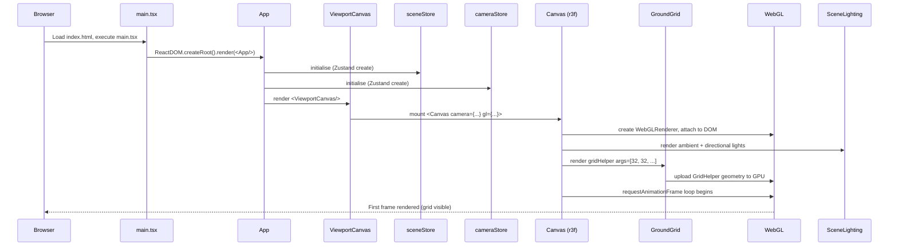
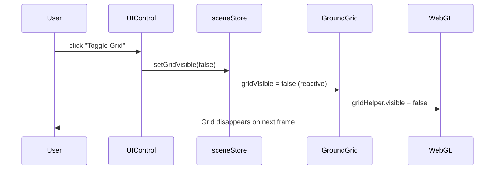
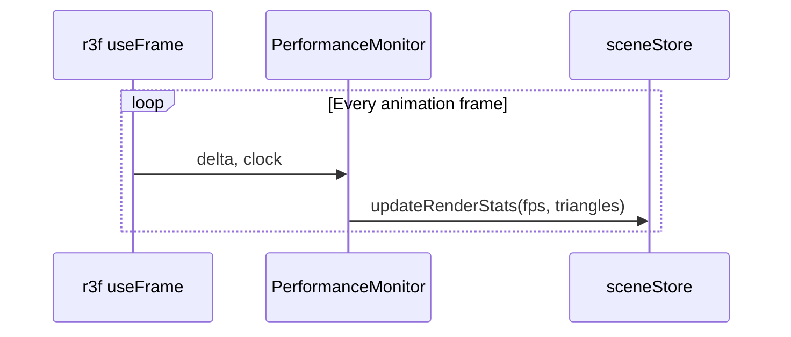

# Low-Level Design: FR-SCENE-001 — Render 3D Scene with Three.js and Visible Ground Grid Plane

**Feature ID:** FR-SCENE-001  
**Issue:** [#8](https://github.com/sreenivasmrpivot/legobuilder/issues/8)  
**Status:** Draft — Pending Design Review (Gate 6a)  
**Author:** Spectra Design Agent  
**Date:** 2026-04-10  
**Area:** Frontend  

---

## 1. Overview

FR-SCENE-001 establishes the foundational 3D rendering surface for the LegoBuilder application. It initialises a Three.js scene via `@react-three/fiber`, mounts a `<Canvas>` as the root WebGL context, and renders a visible ground grid plane at 1-stud intervals extending at least 32x32 studs. All subsequent features (brick placement, camera control, editing, persistence, export) depend on this scene being correctly initialised.

### Goals
- Provide a stable, performant WebGL canvas that achieves >=60 FPS on a mid-range device (Intel i5 + integrated GPU) with an empty scene.
- Render a grid plane that gives users clear spatial orientation for brick placement.
- Initialise the Zustand `sceneStore` as the single source of truth for scene-level state.
- Establish the component hierarchy that all other viewport features extend.

### Non-Goals
- Brick rendering (FR-BRICK-001)
- Camera orbit controls (FR-CAM-001)
- Persistence or export

---

## 2. Component Architecture

### 2.1 Component Tree

```
App
└── ViewportCanvas          (frontend/src/components/viewport/ViewportCanvas.tsx)
    ├── <Canvas>             (@react-three/fiber root — owns WebGL renderer)
    │   ├── SceneLighting    (frontend/src/components/viewport/SceneLighting.tsx)
    │   ├── GroundGrid       (frontend/src/components/viewport/GroundGrid.tsx)
    │   └── SceneContent     (frontend/src/components/viewport/SceneContent.tsx)
    │       └── [future brick meshes]
    └── PerformanceMonitor   (dev-only overlay, r3f-perf)
```

### 2.2 Component Responsibilities

| Component | File | Responsibility |
|-----------|------|----------------|
| `ViewportCanvas` | `components/viewport/ViewportCanvas.tsx` | Mounts `<Canvas>`, sets renderer config, connects to `sceneStore` and `cameraStore` |
| `SceneLighting` | `components/viewport/SceneLighting.tsx` | Ambient + directional lights; no shadows in MVP |
| `GroundGrid` | `components/viewport/GroundGrid.tsx` | Renders the 32x32 stud grid using `<gridHelper>` |
| `SceneContent` | `components/viewport/SceneContent.tsx` | Container for dynamic scene objects (bricks, ghosts, selection highlights) |

### 2.3 Module Dependencies

```
ViewportCanvas
  ├── @react-three/fiber   (Canvas, useThree, useFrame)
  ├── three                (WebGLRenderer, Scene, Color)
  ├── sceneStore           (Zustand — scene metadata)
  └── cameraStore          (Zustand — camera position/target)

GroundGrid
  ├── @react-three/fiber   (primitive)
  └── three                (GridHelper)

SceneLighting
  └── @react-three/fiber   (ambientLight, directionalLight)
```

---

## 3. Data Models

### 3.1 SceneStore (Zustand)

**File:** `frontend/src/stores/sceneStore.ts`

```typescript
interface SceneState {
  // Scene identity
  sceneId: string;              // UUID, generated on init
  sceneName: string;            // Display name, default "Untitled Scene"

  // Grid configuration
  gridSize: number;             // Number of studs per side; default 32
  gridDivisions: number;        // Cells per stud; default 1 (1-stud intervals)
  gridVisible: boolean;         // Toggle grid visibility; default true

  // Scene background
  backgroundColor: string;      // CSS hex; default "#1a1a2e"

  // Render stats (updated by useFrame)
  fps: number;                  // Current frames per second
  triangleCount: number;        // Total triangles in scene

  // Actions
  setGridVisible: (visible: boolean) => void;
  setGridSize: (size: number) => void;
  setBackgroundColor: (color: string) => void;
  updateRenderStats: (fps: number, triangles: number) => void;
  resetScene: () => void;
}
```

**Initial state:**
```typescript
const initialState = {
  sceneId: crypto.randomUUID(),
  sceneName: 'Untitled Scene',
  gridSize: 32,
  gridDivisions: 1,
  gridVisible: true,
  backgroundColor: '#1a1a2e',
  fps: 0,
  triangleCount: 0,
};
```

### 3.2 CameraStore (Zustand)

**File:** `frontend/src/stores/cameraStore.ts`

```typescript
interface CameraState {
  // Isometric default position
  position: [number, number, number];   // default [20, 20, 20]
  target: [number, number, number];     // default [0, 0, 0]
  fov: number;                          // default 50 (degrees)
  near: number;                         // default 0.1
  far: number;                          // default 1000

  // Actions
  setPosition: (pos: [number, number, number]) => void;
  setTarget: (target: [number, number, number]) => void;
  resetCamera: () => void;
}
```

### 3.3 Coordinate System

| Axis | Meaning | Unit |
|------|---------|------|
| X | Left / Right | 1 stud = 1 Three.js unit |
| Y | Up / Down | 1 stud = 1 Three.js unit |
| Z | Forward / Back | 1 stud = 1 Three.js unit |

The ground plane lies at **Y = 0**. Bricks are placed with their bottom face at Y = 0 (ground level) or Y = n (stacked).

---

## 4. API / Interface Contracts

> FR-SCENE-001 is a pure frontend feature with no HTTP API endpoints. The "API" is the component prop interface and the Zustand store contract.

### 4.1 ViewportCanvas Props

```typescript
interface ViewportCanvasProps {
  /** CSS class applied to the canvas wrapper div */
  className?: string;
  /** Override background color (falls back to sceneStore.backgroundColor) */
  backgroundColor?: string;
}
```

### 4.2 GroundGrid Props

```typescript
interface GroundGridProps {
  /** Number of studs per side (default: from sceneStore.gridSize = 32) */
  size?: number;
  /** Grid line color (default: '#444466') */
  color?: string;
  /** Center line color (default: '#6666aa') */
  centerLineColor?: string;
  /** Y position of the grid plane (default: 0) */
  yOffset?: number;
}
```

### 4.3 SceneLighting Props

```typescript
interface SceneLightingProps {
  /** Ambient light intensity (default: 0.6) */
  ambientIntensity?: number;
  /** Directional light intensity (default: 0.8) */
  directionalIntensity?: number;
  /** Directional light position (default: [10, 20, 10]) */
  directionalPosition?: [number, number, number];
}
```

### 4.4 Canvas Configuration

```typescript
// ViewportCanvas.tsx — Canvas props
<Canvas
  camera={{
    position: cameraStore.position,   // [20, 20, 20]
    fov: cameraStore.fov,             // 50
    near: cameraStore.near,           // 0.1
    far: cameraStore.far,             // 1000
  }}
  gl={{
    antialias: true,
    powerPreference: 'high-performance',
    alpha: false,
  }}
  dpr={[1, 2]}                        // Pixel ratio: min 1, max 2
  shadows={false}                     // Disabled in MVP for performance
  style={{ width: '100%', height: '100%' }}
>
```

---

## 5. Sequence Diagrams

### 5.1 Application Boot to Scene Render



### 5.2 Grid Visibility Toggle



### 5.3 FPS Monitoring Loop



---

## 6. Implementation Details

### 6.1 GroundGrid Implementation Strategy

Use Three.js `GridHelper` via `<primitive>` in r3f:

```typescript
// GroundGrid.tsx
import { useRef } from 'react';
import * as THREE from 'three';
import { useSceneStore } from '../../stores/sceneStore';

export function GroundGrid({
  color = '#444466',
  centerLineColor = '#6666aa',
  yOffset = 0,
}: GroundGridProps) {
  const { gridSize, gridDivisions, gridVisible } = useSceneStore();
  const gridRef = useRef<THREE.GridHelper>(null);

  // GridHelper(size, divisions, centerLineColor, gridColor)
  // size = gridSize studs, divisions = gridSize (one cell per stud)
  const grid = new THREE.GridHelper(
    gridSize,
    gridSize * gridDivisions,
    new THREE.Color(centerLineColor),
    new THREE.Color(color)
  );

  return (
    <primitive
      ref={gridRef}
      object={grid}
      position={[0, yOffset, 0]}
      visible={gridVisible}
    />
  );
}
```

**Key parameters:**
- `size = 32` — grid spans 32 Three.js units = 32 studs
- `divisions = 32` — 32 cells = 1 cell per stud = 1-stud intervals (requirement met)
- Grid is centred at origin (0, 0, 0)

### 6.2 Performance Budget

| Metric | Target | Measurement Method |
|--------|--------|-------------------|
| FPS (empty scene) | >= 60 FPS | `r3f-perf` overlay / `useFrame` delta |
| Initial render time | < 500 ms | `performance.now()` in `useEffect` |
| GPU memory (grid only) | < 2 MB | Chrome DevTools GPU memory |
| JS bundle size delta | < 5 KB gzipped | Vite bundle analyser |

### 6.3 Renderer Configuration Rationale

| Setting | Value | Rationale |
|---------|-------|-----------|
| `antialias` | `true` | Smooth grid lines; negligible cost on empty scene |
| `powerPreference` | `'high-performance'` | Requests discrete GPU on dual-GPU laptops |
| `alpha` | `false` | Opaque canvas; avoids compositing overhead |
| `dpr` | `[1, 2]` | Caps at 2x for Retina; prevents 3x on mobile |
| `shadows` | `false` | Not needed for MVP; saves shadow map memory |

---

## 7. Error Handling Strategy

### 7.1 WebGL Context Loss

```typescript
// ViewportCanvas.tsx — inside a useEffect after Canvas mounts
useEffect(() => {
  const canvas = gl.domElement;

  const handleContextLost = (e: Event) => {
    e.preventDefault();
    console.error('[LegoBuilder] WebGL context lost');
    uiStore.getState().showError('3D context lost. Please refresh the page.');
  };

  const handleContextRestored = () => {
    console.info('[LegoBuilder] WebGL context restored');
    uiStore.getState().clearError();
  };

  canvas.addEventListener('webglcontextlost', handleContextLost);
  canvas.addEventListener('webglcontextrestored', handleContextRestored);

  return () => {
    canvas.removeEventListener('webglcontextlost', handleContextLost);
    canvas.removeEventListener('webglcontextrestored', handleContextRestored);
  };
}, [gl]);
```

### 7.2 WebGL Not Supported

```typescript
// ViewportCanvas.tsx — ErrorBoundary wraps <Canvas>
<ErrorBoundary fallback={<WebGLNotSupportedFallback />}>
  <Canvas ...>
    ...
  </Canvas>
</ErrorBoundary>
```

`WebGLNotSupportedFallback` renders a user-friendly message with a link to enable hardware acceleration.

### 7.3 Error States Summary

| Error Condition | Detection | User Feedback | Recovery |
|----------------|-----------|---------------|----------|
| WebGL not supported | ErrorBoundary catches r3f init error | Static fallback UI | None (browser limitation) |
| WebGL context lost | `webglcontextlost` event | Error banner via `uiStore` | Auto-restore on `webglcontextrestored` |
| Grid geometry OOM | Three.js throws | Console error + Sentry | Reduce grid size fallback |
| Low FPS (< 30) | `useFrame` delta monitor | Performance warning toast | Suggest reducing grid size |

---

## 8. Security Considerations

| Concern | Mitigation |
|---------|------------|
| **XSS via scene name** | Scene name is rendered via React (auto-escaped); never injected as `innerHTML` |
| **Prototype pollution** | No `eval()` or dynamic property access on user input in this feature |
| **WebGL fingerprinting** | Renderer info is not exposed to external parties; stays client-side |
| **Content Security Policy** | `<Canvas>` uses inline WebGL; CSP must allow `'unsafe-eval'` for WASM (Three.js) — document in `nginx.conf` |
| **Dependency supply chain** | `three`, `@react-three/fiber` pinned to exact versions in `package.json`; audited via `npm audit` in CI |

---

## 9. Accessibility Considerations

| Requirement | Implementation |
|-------------|----------------|
| Canvas ARIA role | `<canvas role="img" aria-label="3D LegoBuilder scene">` |
| Keyboard focus | Canvas receives focus; keyboard events handled in FR-CAM-001 |
| Reduced motion | `prefers-reduced-motion` media query disables auto-rotation animations |
| Screen reader | Static description of scene state provided via `aria-live` region outside canvas |
| Colour contrast | Grid line colours (#444466 on #1a1a2e) meet WCAG AA for non-text elements |

---

## 10. File Map

| File | Action | Notes |
|------|--------|-------|
| `frontend/src/components/viewport/ViewportCanvas.tsx` | **Implement** | Root canvas component |
| `frontend/src/components/viewport/GroundGrid.tsx` | **Implement** | Grid helper wrapper |
| `frontend/src/components/viewport/SceneLighting.tsx` | **Implement** | Ambient + directional lights |
| `frontend/src/components/viewport/SceneContent.tsx` | **Implement** | Container for scene objects |
| `frontend/src/stores/sceneStore.ts` | **Implement** | Zustand store (scaffolded) |
| `frontend/src/stores/cameraStore.ts` | **Implement** | Zustand store (scaffolded) |
| `frontend/src/components/App.tsx` | **Update** | Mount `<ViewportCanvas>` |
| `frontend/src/types/scene.ts` | **Create** | Shared TypeScript types |

---

## 11. Test Mapping

| Test ID | Type | Description | Acceptance Criterion |
|---------|------|-------------|---------------------|
| T-BE-SCENE-001-01 | Unit (Vitest) | `GroundGrid` renders with correct `gridHelper` args | `size=32`, `divisions=32` |
| T-BE-SCENE-001-02 | Unit (Vitest) | `sceneStore` initialises with correct defaults | `gridSize=32`, `gridVisible=true` |
| T-E2E-SCENE-001-01 | E2E (Playwright) | Canvas renders and grid is visible on load | `canvas` element present; screenshot diff < 0.1% |

---

## 12. Open Questions

| # | Question | Owner | Resolution |
|---|----------|-------|------------|
| 1 | Should the grid extend beyond 32x32 studs (e.g., 64x64) for large builds? | Product | Defer to FR-SCENE-002 (scene bounds) |
| 2 | Should grid lines use `LineDashedMaterial` for a more LEGO-like aesthetic? | Design | Default solid lines; configurable via theme in future |
| 3 | Is `r3f-perf` overlay acceptable in production builds (behind a flag)? | Engineering | Recommend `import.meta.env.DEV` guard |

---

## 13. Dependencies and Risks

| Dependency | Type | Risk | Mitigation |
|------------|------|------|------------|
| `@react-three/fiber` >= 8.x | npm | API changes between major versions | Pin exact version; test on upgrade |
| `three` >= 0.160 | npm | `GridHelper` API stable since r60 | Low risk |
| Browser WebGL 2.0 support | Runtime | ~96% global support (2026) | Graceful fallback for WebGL 1.0 |
| Intel integrated GPU performance | Hardware | May not hit 60 FPS with heavy scenes | Empty scene target is achievable; monitor with `r3f-perf` |

---

## 14. Revision History

| Version | Date | Author | Change |
|---------|------|--------|--------|
| 1.0 | 2026-04-10 | Spectra Design Agent | Initial draft |
