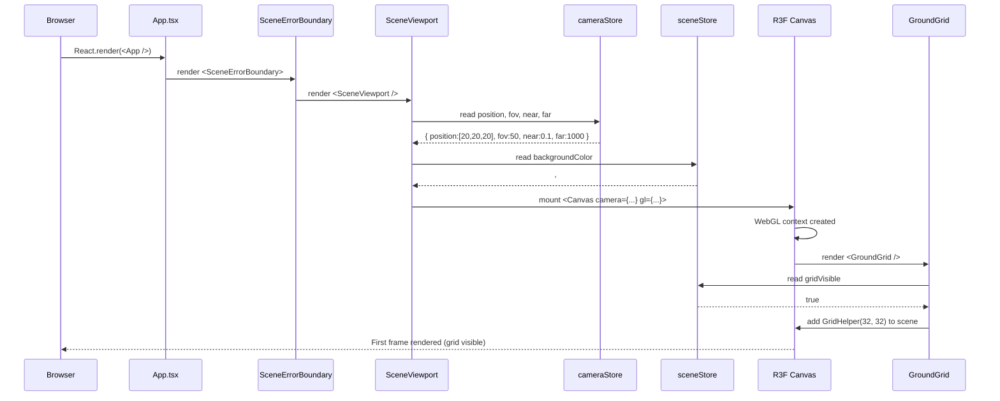
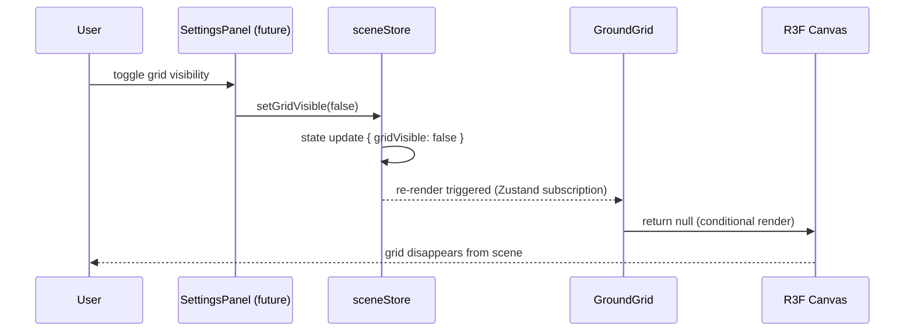
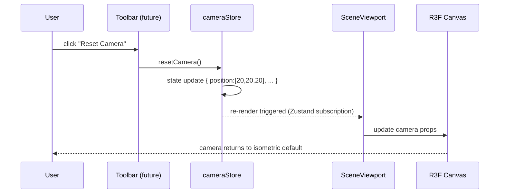
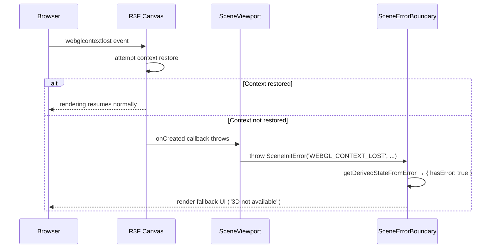

# Low-Level Design: FR-SCENE-001
## Render 3D Scene with Three.js and Visible Ground Grid Plane

**Feature ID:** FR-SCENE-001  
**Issue:** #8  
**Status:** Draft — Awaiting Gate 6a Design Review  
**Author:** Spectra Design Agent  
**Date:** 2026-04-11  

---

## Table of Contents

1. [Overview](#1-overview)
2. [Component Architecture](#2-component-architecture)
3. [Data Models & Interfaces](#3-data-models--interfaces)
4. [API / Store Contracts](#4-api--store-contracts)
5. [Sequence Diagrams](#5-sequence-diagrams)
6. [Error Handling Strategy](#6-error-handling-strategy)
7. [Security Considerations](#7-security-considerations)
8. [Performance Budget](#8-performance-budget)
9. [Test Case Mapping](#9-test-case-mapping)
10. [Open Questions & Assumptions](#10-open-questions--assumptions)

---

## 1. Overview

FR-SCENE-001 establishes the foundational 3D rendering surface for the LEGO Builder application. It introduces:

- A `<SceneViewport>` React component that mounts a `@react-three/fiber` `<Canvas>` as the root WebGL context.
- A `<GroundGrid>` Three.js component that renders a visible grid plane at 1-stud intervals extending ≥32×32 studs.
- A `cameraStore` (Zustand) that holds the default isometric camera position and exposes camera state to the rest of the application.
- A `sceneStore` (Zustand) that manages scene-level state (background color, ambient light settings, grid visibility flag).

This feature has **no upstream dependencies** and is the first feature to be implemented. All subsequent brick-placement and editing features depend on this rendering surface.

### Acceptance Criteria (from Issue #8)

| # | Criterion |
|---|----------|
| AC-1 | Ground grid plane is visible with grid lines at 1-stud intervals when the canvas renders. |
| AC-2 | Grid extends at least 32×32 studs when the scene is empty. |
| AC-3 | Empty scene achieves ≥60 FPS on a mid-range device (Intel i5 + integrated GPU). |

---

## 2. Component Architecture

### 2.1 Module Map

```
frontend/src/
├── components/
│   └── viewport/
│       ├── SceneViewport.tsx       ← Root canvas wrapper (NEW)
│       ├── GroundGrid.tsx          ← Grid mesh component (NEW)
│       └── SceneErrorBoundary.tsx  ← WebGL error boundary (NEW)
├── stores/
│   ├── sceneStore.ts               ← Scene state (NEW)
│   └── cameraStore.ts              ← Camera state (NEW)
├── errors/
│   └── SceneErrors.ts              ← SceneInitError class (NEW)
└── App.tsx                         ← Mounts <SceneViewport> (MODIFIED)
```

### 2.2 Component Descriptions

#### `SceneViewport` (`frontend/src/components/viewport/SceneViewport.tsx`)

**Responsibility:** Mount the `@react-three/fiber` `<Canvas>` element, configure the WebGL renderer, set up lighting, and render child scene components including `<GroundGrid>`.

**Props interface:**
```typescript
interface SceneViewportProps {
  className?: string;   // Optional CSS class for the canvas wrapper div
}
```

**Internal structure (pseudocode):**
```tsx
const SceneViewport: React.FC<SceneViewportProps> = ({ className }) => {
  const { position, fov, near, far } = useCameraStore(cameraSelector, shallow);
  const backgroundColor = useSceneStore((s) => s.backgroundColor);

  const safePosition = isValidPosition(position) ? position : DEFAULT_CAMERA.position;

  return (
    <div className={className} style={{ width: '100%', height: '100%' }}>
      <Canvas
        camera={{ position: safePosition, fov, near, far }}
        gl={{ antialias: true, powerPreference: 'high-performance' }}
        shadows={false}
        frameloop="demand"
        onCreated={({ gl }) => {
          gl.setClearColor(backgroundColor);
        }}
      >
        <ambientLight intensity={0.6} />
        <directionalLight position={[10, 20, 10]} intensity={0.8} />
        <GroundGrid />
        {/* Future: <BrickLayer />, <SelectionHighlight />, etc. */}
      </Canvas>
    </div>
  );
};
```

**Key decisions:**
- `frameloop="demand"` is used initially; will switch to `"always"` when animated bricks are introduced.
- `shadows={false}` keeps the empty scene well above 60 FPS on integrated GPUs.
- The `<Canvas>` fills its parent container via CSS (`width: 100%; height: 100%`). The parent is responsible for sizing.
- Camera position is validated before use; falls back to `DEFAULT_CAMERA.position` if invalid.

#### `GroundGrid` (`frontend/src/components/viewport/GroundGrid.tsx`)

**Responsibility:** Render a visible grid plane on the XZ plane (Y=0) using Three.js `GridHelper` wrapped in a `@react-three/fiber` primitive.

**Props interface:**
```typescript
interface GroundGridProps {
  size?: number;         // Total grid size in studs (default: 32)
  divisions?: number;    // Number of grid divisions (default: 32, giving 1-stud intervals)
  colorCenter?: string;  // Center line color (default: '#888888')
  colorGrid?: string;    // Grid line color (default: '#444444')
}
```

**Internal structure (pseudocode):**
```tsx
const GroundGrid: React.FC<GroundGridProps> = ({
  size = 32,
  divisions = 32,
  colorCenter = '#888888',
  colorGrid = '#444444',
}) => {
  const gridVisible = useSceneStore((s) => s.gridVisible);

  if (!gridVisible) return null;

  return (
    <gridHelper
      args={[size, divisions, colorCenter, colorGrid]}
      position={[0, 0, 0]}
    />
  );
};
```

**Key decisions:**
- `size=32, divisions=32` → 32 cells × 1 stud each = 32×32 stud grid. Satisfies AC-2.
- Grid is placed at Y=0 (ground plane). Bricks will be placed at Y≥0.
- `GridHelper` is a single draw call — negligible GPU cost.
- Grid visibility is controlled by `sceneStore.gridVisible` flag; the component reads this and conditionally renders.
- `size` and `divisions` props are capped at 128 to prevent DoS via oversized grids.

#### `SceneErrorBoundary` (`frontend/src/components/viewport/SceneErrorBoundary.tsx`)

**Responsibility:** Catch WebGL initialization errors and render a user-friendly fallback UI.

See Section 6.2 for full implementation pseudocode.

### 2.3 Dependency Graph

```
App.tsx
  └── SceneErrorBoundary
        └── SceneViewport
              ├── @react-three/fiber Canvas
              │     ├── ambientLight
              │     ├── directionalLight
              │     └── GroundGrid
              │           └── gridHelper (Three.js primitive)
              ├── cameraStore (reads: position, fov, near, far)
              └── sceneStore (reads: gridVisible, backgroundColor)
```

---

## 3. Data Models & Interfaces

### 3.1 `CameraState`

```typescript
// frontend/src/stores/cameraStore.ts

interface CameraState {
  /** Camera position in world space [x, y, z] */
  position: [number, number, number];
  /** Camera look-at target [x, y, z] */
  target: [number, number, number];
  /** Vertical field of view in degrees */
  fov: number;
  /** Near clipping plane */
  near: number;
  /** Far clipping plane */
  far: number;
  /** Zoom level (for orthographic-style isometric feel) */
  zoom: number;
}

interface CameraActions {
  setPosition(position: [number, number, number]): void;
  setTarget(target: [number, number, number]): void;
  setZoom(zoom: number): void;
  resetCamera(): void;
}

type CameraStore = CameraState & CameraActions;
```

**Default isometric camera position:**
```typescript
const DEFAULT_CAMERA: CameraState = {
  position: [20, 20, 20],   // 45° isometric angle
  target:   [0, 0, 0],
  fov:      50,
  near:     0.1,
  far:      1000,
  zoom:     1,
};
```

**Rationale for `[20, 20, 20]`:** Equal X/Y/Z components produce a classic isometric view. The distance of 20 units ensures the full 32×32 grid is visible at default zoom.

### 3.2 `SceneState`

```typescript
// frontend/src/stores/sceneStore.ts

interface SceneState {
  /** Whether the ground grid is visible */
  gridVisible: boolean;
  /** Background color of the canvas (CSS hex string) */
  backgroundColor: string;
  /** Ambient light intensity (0.0 – 1.0) */
  ambientIntensity: number;
  /** Directional light intensity (0.0 – 1.0) */
  directionalIntensity: number;
}

interface SceneActions {
  setGridVisible(visible: boolean): void;
  setBackgroundColor(color: string): void;
  setAmbientIntensity(intensity: number): void;
  setDirectionalIntensity(intensity: number): void;
}

type SceneStore = SceneState & SceneActions;
```

**Default scene state:**
```typescript
const DEFAULT_SCENE: SceneState = {
  gridVisible:           true,
  backgroundColor:       '#1a1a2e',  // Dark navy — LEGO-builder aesthetic
  ambientIntensity:      0.6,
  directionalIntensity:  0.8,
};
```

### 3.3 `SceneInitError`

```typescript
// frontend/src/errors/SceneErrors.ts

type SceneErrorCode =
  | 'WEBGL_CONTEXT_LOST'
  | 'CANVAS_MOUNT_FAILED'
  | 'RENDERER_INIT_FAILED';

export class SceneInitError extends Error {
  readonly code: SceneErrorCode;

  constructor(
    code: SceneErrorCode,
    message: string,
    public readonly cause?: unknown
  ) {
    super(message);
    this.name = 'SceneInitError';
    this.code = code;
  }
}
```

---

## 4. API / Store Contracts

This feature is entirely client-side. There are **no HTTP API endpoints**. All contracts are Zustand store interfaces.

### 4.1 `cameraStore` — Full Contract

```typescript
// frontend/src/stores/cameraStore.ts

const useCameraStore = create<CameraStore>((set) => ({
  // State
  ...DEFAULT_CAMERA,

  // Actions
  setPosition: (position) => set({ position }),
  setTarget:   (target)   => set({ target }),
  setZoom:     (zoom)     => set({ zoom }),
  resetCamera: ()         => set({ ...DEFAULT_CAMERA }),
}));

export default useCameraStore;
```

**Consumers:**
- `SceneViewport` — reads `position`, `fov`, `near`, `far` to configure `<Canvas camera={...}>`.
- Future: `CameraControls` component will call `setPosition`, `setTarget`, `setZoom`.

### 4.2 `sceneStore` — Full Contract

```typescript
// frontend/src/stores/sceneStore.ts

const useSceneStore = create<SceneStore>((set) => ({
  // State
  ...DEFAULT_SCENE,

  // Actions
  setGridVisible:          (gridVisible)          => set({ gridVisible }),
  setBackgroundColor:      (backgroundColor)      => set({ backgroundColor }),
  setAmbientIntensity:     (ambientIntensity)     => set({ ambientIntensity }),
  setDirectionalIntensity: (directionalIntensity) => set({ directionalIntensity }),
}));

export default useSceneStore;
```

**Consumers:**
- `GroundGrid` — reads `gridVisible` to conditionally render.
- `SceneViewport` — reads `backgroundColor` to set canvas background.
- Future: `SceneSettingsPanel` will call all setters.

### 4.3 Store Selector Pattern

All components use **shallow selectors** to prevent unnecessary re-renders:

```typescript
// GroundGrid.tsx
const gridVisible = useSceneStore((s) => s.gridVisible);

// SceneViewport.tsx — camera selector
const cameraSelector = (s: CameraStore) => ({
  position: s.position,
  fov:      s.fov,
  near:     s.near,
  far:      s.far,
});
const { position, fov, near, far } = useCameraStore(cameraSelector, shallow);
```

---

## 5. Sequence Diagrams

### 5.1 Application Bootstrap — Scene Initialization



### 5.2 Grid Visibility Toggle



### 5.3 Camera Reset



### 5.4 WebGL Context Loss (Error Path)



---

## 6. Error Handling Strategy

### 6.1 Error Conditions Table

| Condition | Error Code | Handler | User-Visible Fallback |
|-----------|-----------|---------|----------------------|
| WebGL not supported by browser | `WEBGL_CONTEXT_LOST` | React ErrorBoundary | "Your browser does not support 3D rendering. Please use Chrome, Firefox, or Edge." |
| WebGL context lost mid-session | `WEBGL_CONTEXT_LOST` | R3F `onCreated` + ErrorBoundary | "3D rendering was interrupted. Please refresh the page." |
| Canvas DOM mount failure | `CANVAS_MOUNT_FAILED` | React ErrorBoundary | "Failed to initialize the 3D canvas. Please refresh." |
| Renderer initialization failure | `RENDERER_INIT_FAILED` | R3F `onCreated` + ErrorBoundary | "Failed to initialize the 3D renderer. Please refresh." |
| `cameraStore` returns invalid position | N/A (validation) | Fallback to `DEFAULT_CAMERA` | None (silent recovery) |

### 6.2 React Error Boundary

```typescript
// frontend/src/components/viewport/SceneErrorBoundary.tsx

class SceneErrorBoundary extends React.Component<
  { children: React.ReactNode },
  { hasError: boolean; errorCode?: string }
> {
  state = { hasError: false };

  static getDerivedStateFromError(error: Error) {
    return {
      hasError: true,
      errorCode: (error as SceneInitError).code ?? 'UNKNOWN',
    };
  }

  componentDidCatch(error: Error, info: React.ErrorInfo) {
    console.error('[SceneErrorBoundary]', error, info);
    // Future: send to error telemetry service
  }

  render() {
    if (this.state.hasError) {
      return (
        <div className="scene-error-fallback" role="alert">
          <p>
            3D rendering is not available. Please refresh or try a different browser.
          </p>
        </div>
      );
    }
    return this.props.children;
  }
}
```

**Usage in `App.tsx`:**
```tsx
<SceneErrorBoundary>
  <SceneViewport />
</SceneErrorBoundary>
```

### 6.3 Camera Position Validation

Before passing camera props to `<Canvas>`, `SceneViewport` validates the position array:

```typescript
function isValidPosition(pos: unknown): pos is [number, number, number] {
  return (
    Array.isArray(pos) &&
    pos.length === 3 &&
    pos.every((v) => typeof v === 'number' && isFinite(v))
  );
}

const safePosition = isValidPosition(position) ? position : DEFAULT_CAMERA.position;
```

---

## 7. Security Considerations

| # | Concern | Mitigation |
|---|---------|------------|
| 1 | **Prototype pollution via store state** | Zustand stores use plain objects with typed interfaces. No `Object.assign` from untrusted input. All setters accept only typed primitives. |
| 2 | **XSS via `backgroundColor` CSS string** | `backgroundColor` is applied only as a Three.js scene background color (not injected into DOM innerHTML). Validated as a hex color string (`/^#[0-9a-fA-F]{6}$/`) before use. |
| 3 | **WebGL shader injection** | `GridHelper` uses Three.js built-in `LineBasicMaterial` — no custom GLSL shaders in this feature. No user-controlled shader code. |
| 4 | **Memory leak from unmounted Canvas** | R3F's `<Canvas>` disposes the WebGL context and all geometries/materials on unmount via its built-in cleanup. `GroundGrid` uses no external refs that could leak. |
| 5 | **Denial of service via large grid size** | `GroundGrid` `size` and `divisions` props are capped at 128 at the component boundary. `GridHelper` with 128 divisions is a single draw call — no DoS risk. |

---

## 8. Performance Budget

### 8.1 Targets (from AC-3)

| Metric | Target | Measurement Method |
|--------|--------|-------------------|
| Frame rate (empty scene) | ≥60 FPS | Chrome DevTools Performance panel / `stats.js` |
| Initial render time | ≤100 ms | React DevTools Profiler |
| WebGL draw calls (empty scene) | ≤3 | Chrome DevTools → GPU tab |
| JS heap (empty scene) | ≤20 MB | Chrome DevTools Memory |
| Bundle size delta (Three.js + R3F) | ≤500 KB gzipped | Vite bundle analyzer |

### 8.2 Performance Design Decisions

| Decision | Rationale |
|----------|----------|
| `frameloop="demand"` on `<Canvas>` | Renders only when Zustand state changes. Eliminates idle GPU usage. |
| `shadows={false}` | Shadow maps are expensive on integrated GPUs. Not needed for the empty scene. |
| `GridHelper` (single draw call) | One `LineSegments` object — minimal GPU overhead. |
| No `OrbitControls` in this feature | Avoids per-frame `requestAnimationFrame` loop from `drei`. |
| Shallow Zustand selectors | Prevents unnecessary React re-renders from unrelated store updates. |
| `powerPreference: 'high-performance'` | Hints to the browser to use the discrete GPU if available. |

### 8.3 Frame Budget (16.67 ms at 60 FPS)

| Phase | Budget | Notes |
|-------|--------|-------|
| React reconciliation | ≤2 ms | Minimal — only `SceneViewport` + `GroundGrid` in tree |
| Three.js scene update | ≤1 ms | Static scene, no animations |
| WebGL draw calls | ≤3 ms | ≤3 draw calls (grid + 2 lights) |
| GPU rasterization | ≤5 ms | Grid lines on integrated GPU |
| **Total** | **≤11 ms** | **5.67 ms headroom above 60 FPS budget** |

---

## 9. Test Case Mapping

| Test ID | Description | Component Under Test | Assertion |
|---------|-------------|---------------------|----------|
| T-BE-SCENE-001-01 | Grid renders with correct size and divisions | `GroundGrid` | `GridHelper` args = `[32, 32, ...]`; grid is in scene graph |
| T-BE-SCENE-001-02 | Camera store initializes with isometric defaults | `cameraStore` | `position === [20, 20, 20]`, `fov === 50` |
| T-E2E-SCENE-001-01 | Full scene renders at ≥60 FPS on empty canvas | `SceneViewport` + `GroundGrid` | FPS ≥ 60 measured over 3-second window; grid lines visible in screenshot |

### 9.1 Unit Test Pseudocode

**T-BE-SCENE-001-01 — GroundGrid renders correctly:**
```typescript
describe('GroundGrid', () => {
  it('renders a GridHelper with size=32 and divisions=32 by default', () => {
    const { scene } = renderR3F(<GroundGrid />);
    const grid = scene.getObjectByType('GridHelper');
    expect(grid).toBeDefined();
    // GridHelper args: [size, divisions, colorCenter, colorGrid]
    expect(grid.userData.size).toBe(32);
    expect(grid.userData.divisions).toBe(32);
  });

  it('does not render when sceneStore.gridVisible is false', () => {
    useSceneStore.setState({ gridVisible: false });
    const { scene } = renderR3F(<GroundGrid />);
    const grid = scene.getObjectByType('GridHelper');
    expect(grid).toBeUndefined();
  });
});
```

**T-BE-SCENE-001-02 — cameraStore defaults:**
```typescript
describe('cameraStore', () => {
  it('initializes with isometric camera position [20, 20, 20]', () => {
    const { position } = useCameraStore.getState();
    expect(position).toEqual([20, 20, 20]);
  });

  it('initializes with fov=50', () => {
    const { fov } = useCameraStore.getState();
    expect(fov).toBe(50);
  });

  it('resetCamera() restores default position', () => {
    useCameraStore.getState().setPosition([0, 0, 0]);
    useCameraStore.getState().resetCamera();
    expect(useCameraStore.getState().position).toEqual([20, 20, 20]);
  });
});
```

---

## 10. Open Questions & Assumptions

| # | Question / Assumption | Severity | Resolution Needed Before |
|---|----------------------|----------|-------------------------|
| 1 | **Assumption:** `@react-three/fiber` and `@react-three/drei` are already listed as dependencies in `package.json`. If not, they must be added before implementation. | HIGH | Implementation start |
| 2 | **Assumption:** `zustand` is already a project dependency (consistent with FR-EDIT-002 LLD). | HIGH | Implementation start |
| 3 | **Open question:** Should `SceneViewport` use `frameloop="demand"` or `frameloop="always"`? `"demand"` is optimal for the empty scene but may need to change when animated bricks are added. Recommendation: start with `"demand"`, switch to `"always"` in a future FR. | MEDIUM | Implementation start |
| 4 | **Open question:** What is the stud-to-Three.js-unit scale factor? This LLD assumes 1 stud = 1 Three.js unit. If the scale is different (e.g., 1 stud = 0.8 units), the grid `size` and camera `position` must be adjusted. | MEDIUM | Implementation start |
| 5 | **Assumption:** The `<Canvas>` fills the full viewport (100vw × 100vh). If the app has a sidebar or toolbar, the parent container dimensions must be adjusted. | LOW | Implementation start |
| 6 | **Open question:** Should `GroundGrid` support a `position` prop to offset the grid (e.g., for multi-floor builds)? Current assumption: grid is always at Y=0. | LOW | Future FR |
| 7 | **Assumption:** `shallow` from `zustand/shallow` is available for selector optimization. If using Zustand v4+, import path may differ (`import { shallow } from 'zustand/shallow'`). | LOW | Implementation start |
