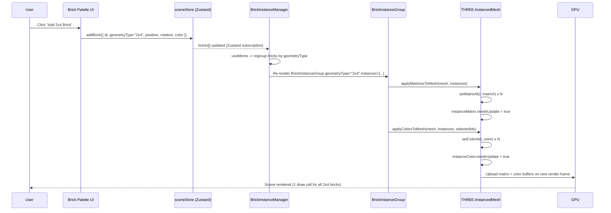
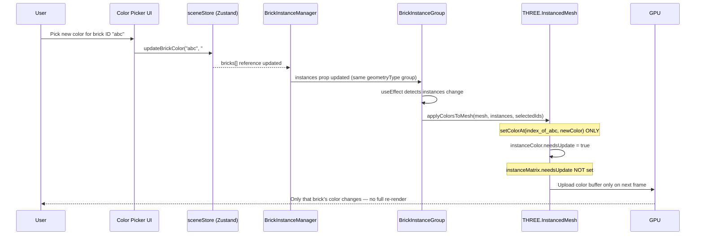
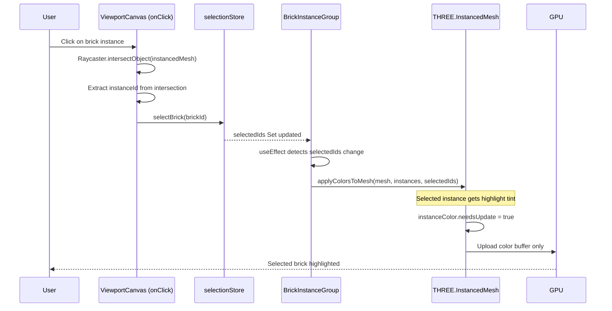
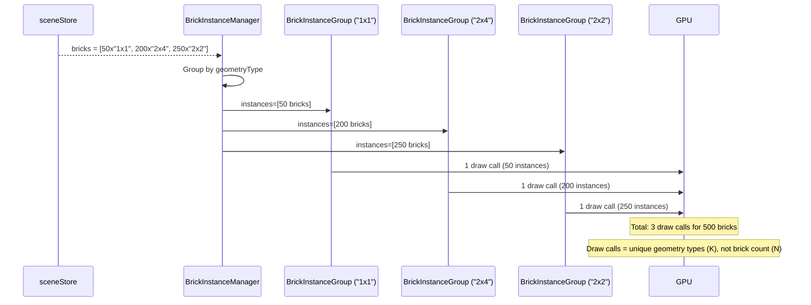

# Low-Level Design: FR-SCENE-002 — InstancedMesh Rendering for Batched Brick Geometry Draw Calls

**Feature ID:** FR-SCENE-002
**Issue:** [#7](https://github.com/sreenivasmrpivot/legobuilder/issues/7)
**Author:** Spectra Design Agent
**Status:** Draft — Awaiting Gate 6a Human Review
**Depends On:** FR-SCENE-001 (3D scene foundation — Issue #8)
**Area:** Frontend

---

## 1. Overview

FR-SCENE-002 introduces `THREE.InstancedMesh` rendering to batch identical brick geometries into a single GPU draw call per unique brick shape. This is the primary rendering optimization that enables the 60 FPS @ 500 bricks performance target by reducing draw calls from O(N) (one per brick) to O(K) (one per unique geometry type, where K << N).

### 1.1 Goals

| Goal | Metric |
|------|--------|
| Reduce draw calls | 1 draw call per unique brick geometry type |
| Maintain 60 FPS | >= 60 FPS with 500 mixed-type bricks |
| Per-instance color | Color update touches only the affected instance buffer |
| No full re-render on color change | `instanceColor.needsUpdate = true` only |

### 1.2 Non-Goals

- LOD (Level of Detail) — out of scope for this FR
- Frustum culling per-instance — future optimization
- Shadow casting per-instance — deferred to FR-SCENE-004 (if applicable)
- Brick geometry authoring — geometries are pre-defined constants

---

## 2. Component Architecture

### 2.1 Module Map

```
frontend/src/
├── components/
│   └── viewport/
│       ├── BrickInstanceManager.tsx      <- NEW: orchestrates all InstancedMesh groups
│       ├── BrickInstanceGroup.tsx        <- NEW: one InstancedMesh per geometry type
│       ├── ViewportCanvas.tsx            <- EXISTING: mounts BrickInstanceManager
│       └── index.ts                      <- re-exports
├── lib/
│   └── bricks/
│       ├── geometryRegistry.ts           <- NEW: maps brick type -> BufferGeometry
│       ├── instanceMatrixUtils.ts        <- NEW: position/rotation -> Matrix4 helpers
│       └── colorUtils.ts                 <- NEW: hex/Color3 <-> THREE.Color helpers
├── stores/
│   ├── sceneStore.ts                     <- EXISTING: brick state (extended)
│   └── selectionStore.ts                 <- EXISTING: selected brick IDs
└── types/
    └── brick.ts                          <- EXISTING: BrickInstance type (extended)
```

### 2.2 Component Responsibilities

#### `BrickInstanceManager` (React component, R3F)

- Subscribes to `sceneStore.bricks` (array of `BrickInstance`).
- Groups bricks by `geometryType` using a `Map<string, BrickInstance[]>`.
- Renders one `<BrickInstanceGroup>` per unique geometry type.
- Re-groups only when the brick list changes (memoized with `useMemo`).
- Does **not** own any Three.js objects directly — delegates to `BrickInstanceGroup`.

#### `BrickInstanceGroup` (React component, R3F)

- Receives: `geometryType: string`, `instances: BrickInstance[]`, `selectedIds: Set<string>`.
- Owns one `THREE.InstancedMesh` ref.
- On mount: creates `InstancedMesh(geometry, material, MAX_INSTANCES)`.
- On `instances` change: calls `updateMatrices()` and `updateColors()`.
- On `selectedIds` change: calls `updateColors()` only (no matrix update).
- Exposes no public API — all updates are driven by prop changes.

#### `geometryRegistry` (singleton module)

- Lazily creates and caches `THREE.BufferGeometry` objects keyed by brick type string (e.g., `"2x4"`, `"1x1"`, `"2x2"`).
- Geometry dimensions follow the stud-unit convention: 1 stud = 8 LDU (LEGO Drawing Units), plate height = 3.2 LDU, standard brick height = 9.6 LDU.
- Disposes geometries on module teardown (for HMR safety).

#### `instanceMatrixUtils`

- `buildMatrix4(position: Vector3, rotation: Euler): THREE.Matrix4` — composes a world-space transform matrix for a single brick instance.
- `applyMatricesToMesh(mesh: THREE.InstancedMesh, instances: BrickInstance[]): void` — iterates instances, calls `mesh.setMatrixAt(i, matrix)`, then sets `mesh.instanceMatrix.needsUpdate = true`.

#### `colorUtils`

- `brickColorToThree(hex: string, isSelected: boolean): THREE.Color` — returns the brick color, or a highlight tint if selected.
- `applyColorsToMesh(mesh: THREE.InstancedMesh, instances: BrickInstance[], selectedIds: Set<string>): void` — iterates instances, calls `mesh.setColorAt(i, color)`, then sets `mesh.instanceColor!.needsUpdate = true`.

---

## 3. Data Models

### 3.1 `BrickInstance` Type (extended)

```typescript
// frontend/src/types/brick.ts
export interface BrickInstance {
  id: string;                  // UUID — stable across renders
  geometryType: string;        // e.g. "2x4", "1x1", "2x2", "1x2"
  position: {
    x: number;                 // world-space X in stud units
    y: number;                 // world-space Y (height) in stud units
    z: number;                 // world-space Z in stud units
  };
  rotation: {
    x: number;                 // radians
    y: number;                 // radians (primary rotation axis for bricks)
    z: number;                 // radians
  };
  color: string;               // CSS hex string, e.g. "#FF0000"
}
```

### 3.2 `sceneStore` Schema (Zustand)

```typescript
// frontend/src/stores/sceneStore.ts
interface SceneState {
  bricks: BrickInstance[];                          // source of truth
  addBrick: (brick: BrickInstance) => void;
  removeBrick: (id: string) => void;
  updateBrickColor: (id: string, color: string) => void;  // NEW
  updateBrickTransform: (                                  // NEW
    id: string,
    position: BrickInstance['position'],
    rotation: BrickInstance['rotation']
  ) => void;
}
```

### 3.3 `selectionStore` Schema (Zustand)

```typescript
// frontend/src/stores/selectionStore.ts
interface SelectionState {
  selectedIds: Set<string>;                         // selected brick IDs
  selectBrick: (id: string) => void;
  deselectBrick: (id: string) => void;
  clearSelection: () => void;
  isSelected: (id: string) => boolean;
}
```

### 3.4 Geometry Registry Map

```typescript
// frontend/src/lib/bricks/geometryRegistry.ts
type GeometryKey = string; // "<studsX>x<studsZ>" e.g. "2x4"

const GEOMETRY_DIMENSIONS: Record<GeometryKey, { w: number; h: number; d: number }> = {
  "1x1": { w: 8,  h: 9.6, d: 8  },   // LDU
  "1x2": { w: 8,  h: 9.6, d: 16 },
  "2x2": { w: 16, h: 9.6, d: 16 },
  "2x4": { w: 16, h: 9.6, d: 32 },
  "2x6": { w: 16, h: 9.6, d: 48 },
  "2x8": { w: 16, h: 9.6, d: 64 },
};

const registry = new Map<GeometryKey, THREE.BufferGeometry>();

export function getGeometry(key: GeometryKey): THREE.BufferGeometry {
  if (!registry.has(key)) {
    const dims = GEOMETRY_DIMENSIONS[key];
    if (!dims) throw new Error(`Unknown brick geometry type: "${key}"`);
    registry.set(key, new THREE.BoxGeometry(dims.w, dims.h, dims.d));
  }
  return registry.get(key)!;
}

export function disposeAllGeometries(): void {
  registry.forEach(geo => geo.dispose());
  registry.clear();
}
```

---

## 4. API / Prop Contracts

### 4.1 `BrickInstanceManager` Props

```typescript
interface BrickInstanceManagerProps {
  // No props — reads directly from sceneStore and selectionStore
  // This avoids prop-drilling through ViewportCanvas
}
```

### 4.2 `BrickInstanceGroup` Props

```typescript
interface BrickInstanceGroupProps {
  geometryType: string;          // key into geometryRegistry
  instances: BrickInstance[];    // all bricks of this geometry type
  selectedIds: Set<string>;      // currently selected brick IDs
  maxInstances?: number;         // default: 1000 (pre-allocated buffer size)
}
```

### 4.3 `sceneStore` Action Signatures

```typescript
// Add a new brick to the scene
addBrick(brick: BrickInstance): void

// Remove a brick by ID
removeBrick(id: string): void

// Update only the color of a specific brick (triggers color buffer update only)
updateBrickColor(id: string, color: string): void

// Update position/rotation of a specific brick (triggers matrix buffer update)
updateBrickTransform(
  id: string,
  position: BrickInstance['position'],
  rotation: BrickInstance['rotation']
): void
```

### 4.4 `instanceMatrixUtils` API

```typescript
// Build a Matrix4 from position and rotation
export function buildMatrix4(
  position: { x: number; y: number; z: number },
  rotation: { x: number; y: number; z: number }
): THREE.Matrix4

// Apply all instance matrices to an InstancedMesh and flag for GPU upload
export function applyMatricesToMesh(
  mesh: THREE.InstancedMesh,
  instances: BrickInstance[]
): void
```

### 4.5 `colorUtils` API

```typescript
// Convert a brick's hex color to a THREE.Color, applying selection highlight
export function brickColorToThree(
  hex: string,
  isSelected: boolean
): THREE.Color

// Apply all instance colors to an InstancedMesh and flag for GPU upload
export function applyColorsToMesh(
  mesh: THREE.InstancedMesh,
  instances: BrickInstance[],
  selectedIds: Set<string>
): void
```

---

## 5. Sequence Diagrams

### 5.1 Initial Scene Render (Bricks Added)



### 5.2 Single Brick Color Change



### 5.3 Brick Selection (Highlight)



### 5.4 Mixed Geometry Scene (Multiple InstancedMesh Groups)



---

## 6. Rendering Strategy Details

### 6.1 InstancedMesh Pre-allocation

- Each `BrickInstanceGroup` pre-allocates `InstancedMesh` with `maxInstances = 1000` (configurable).
- Pre-allocation avoids GPU buffer reallocation when bricks are added incrementally.
- Unused instance slots are hidden by setting their matrix to a zero-scale transform: `new THREE.Matrix4().makeScale(0, 0, 0)`.
- The `count` property of `InstancedMesh` is set to the actual number of visible instances.

### 6.2 Buffer Update Strategy

| Trigger | Matrix Update | Color Update |
|---------|--------------|-------------|
| Brick added | Yes | Yes |
| Brick removed | Yes (compact + zero-scale) | Yes |
| Color changed | No | Yes |
| Transform changed | Yes | No |
| Selection changed | No | Yes |

### 6.3 Material Strategy

- Each `BrickInstanceGroup` uses a single `THREE.MeshStandardMaterial` with `vertexColors: true`.
- `vertexColors: true` enables per-instance color via `instanceColor` buffer.
- Material is shared across all instances of the same geometry type (no per-instance material).
- Roughness: `0.8`, Metalness: `0.0` — matte plastic appearance.

### 6.4 Raycasting for Selection

- `THREE.Raycaster` is used in `ViewportCanvas` to detect click intersections.
- `raycaster.intersectObjects(instancedMeshes, false)` returns `{ instanceId }` in the intersection result.
- The `instanceId` is mapped back to `BrickInstance.id` via the ordered `instances` array.
- Only the clicked `InstancedMesh` group is raycasted (not all groups) for performance.

---

## 7. State Management Integration

### 7.1 Store Subscription Pattern

```typescript
// BrickInstanceManager.tsx
const bricks = useSceneStore(state => state.bricks);
const selectedIds = useSelectionStore(state => state.selectedIds);

// Memoize grouping to avoid re-grouping on every render
const groupedBricks = useMemo(() => {
  const groups = new Map<string, BrickInstance[]>();
  for (const brick of bricks) {
    if (!groups.has(brick.geometryType)) groups.set(brick.geometryType, []);
    groups.get(brick.geometryType)!.push(brick);
  }
  return groups;
}, [bricks]);
```

### 7.2 Effect Isolation in `BrickInstanceGroup`

```typescript
// BrickInstanceGroup.tsx
const meshRef = useRef<THREE.InstancedMesh>(null);

// Matrix update: only when instances change
useEffect(() => {
  if (!meshRef.current) return;
  applyMatricesToMesh(meshRef.current, instances);
  meshRef.current.count = instances.length;
}, [instances]);

// Color update: when instances OR selectedIds change
useEffect(() => {
  if (!meshRef.current) return;
  applyColorsToMesh(meshRef.current, instances, selectedIds);
}, [instances, selectedIds]);
```

### 7.3 Zustand Selector Optimization

- Use shallow equality selectors (`useSceneStore(selector, shallow)`) to prevent unnecessary re-renders when unrelated store slices change.
- `selectedIds` is a `Set<string>` — wrap in `useRef` for stable identity when contents change without reference change.

---

## 8. Error Handling Strategy

### 8.1 Unknown Geometry Type

| Scenario | Handling |
|----------|----------|
| `geometryType` not in registry | `getGeometry()` throws `Error("Unknown brick geometry type: \"${key}\"")` |
| Caught by | `BrickInstanceGroup` wraps geometry creation in try/catch |
| Fallback | Render a `1x1` fallback geometry; log warning to console |
| User impact | Brick renders as 1x1 placeholder; no crash |

### 8.2 InstancedMesh Buffer Overflow

| Scenario | Handling |
|----------|----------|
| `instances.length > maxInstances` | Log warning; clamp to `maxInstances` |
| Mitigation | `maxInstances` defaults to 1000; configurable via env var `VITE_MAX_INSTANCES_PER_GROUP` |
| Future | Dynamic buffer resize (dispose + recreate InstancedMesh) — deferred |

### 8.3 WebGL Context Loss

- Inherited from FR-SCENE-001 error boundary.
- `THREE.WebGLRenderer` emits `webglcontextlost` event -> `ViewportCanvas` catches and shows recovery UI.
- `InstancedMesh` objects are automatically invalidated; re-created on context restore.

### 8.4 React Error Boundary

- `BrickInstanceManager` is wrapped in a React `ErrorBoundary`.
- On render error: displays a fallback message ("Scene rendering error — please refresh").
- Error is reported to console (and future telemetry hook).

---

## 9. Performance Targets & Constraints

| Metric | Target | Measurement |
|--------|--------|-------------|
| Draw calls @ 500 bricks (mixed) | <= 10 (one per unique geometry type) | Chrome DevTools GPU panel |
| Frame rate @ 500 bricks | >= 60 FPS | Stats.js panel in dev mode |
| Color update latency | < 1 frame (16ms) | `performance.now()` delta |
| Matrix update latency | < 1 frame (16ms) | `performance.now()` delta |
| Bundle size delta (this FR) | < 5 KB gzipped | Vite bundle analyzer |
| Memory per InstancedMesh (1000 instances) | ~240 KB (matrix) + ~12 KB (color) | Chrome Memory panel |

### 9.1 Optimization Notes

- `useMemo` on `groupedBricks` prevents O(N) re-grouping on every render tick.
- `useEffect` dependency arrays are tightly scoped to avoid spurious buffer uploads.
- `instanceMatrix` and `instanceColor` buffers are typed arrays (`Float32Array`) — no GC pressure during updates.
- `THREE.InstancedMesh` frustum culling is enabled by default (`frustumCulled = true`).

---

## 10. Security Considerations

| Concern | Mitigation |
|---------|------------|
| Malformed `geometryType` string | Registry lookup throws; caught and fallback applied |
| Malformed `color` hex string | `THREE.Color.set(hex)` silently clamps invalid values; no XSS risk (no DOM injection) |
| Excessive brick count (DoS) | `maxInstances` cap enforced; UI should also cap brick count at 500 per FR |
| Prototype pollution via brick data | Brick objects are plain POJOs from Zustand; no `__proto__` risk |
| WebGL shader injection | Three.js uses compiled GLSL; no user-controlled shader strings |

---

## 11. Accessibility Considerations

- The 3D viewport is a `<canvas>` element with `aria-label="LEGO brick scene"` (set by FR-SCENE-001).
- Individual brick instances are not individually focusable (WebGL limitation).
- Selection state is reflected in a separate accessible panel (future FR) — not in the canvas.
- `prefers-reduced-motion`: animation transitions (camera, placement) are suppressed; static rendering is unaffected.
- Color-only selection highlight is supplemented by a selection indicator in the UI panel.

---

## 12. Test Case Mapping

| Test ID | Description | Acceptance Criterion |
|---------|-------------|---------------------|
| T-BE-SCENE-002-01 | 100 identical 2x4 bricks -> 1 draw call | `renderer.info.render.calls === 1` after adding 100 identical bricks |
| T-BE-SCENE-002-02 | 500 mixed-type bricks -> draw calls = unique geometry count | `renderer.info.render.calls === uniqueGeometryTypes.size` |
| T-BE-SCENE-002-03 (implied) | Color change -> only `instanceColor` buffer updated | `instanceMatrix.needsUpdate` remains `false` after `updateBrickColor()` |

### 12.1 Test Implementation Notes

- Tests use `@react-three/test-renderer` or `vitest` with a mocked WebGL context.
- `renderer.info.render.calls` is the Three.js draw call counter — reset each frame.
- Matrix update isolation is verified by spying on `THREE.InstancedMesh.prototype.setMatrixAt`.
- Color update isolation is verified by spying on `THREE.InstancedMesh.prototype.setColorAt`.

---

## 13. File Change Summary

| File | Action | Description |
|------|--------|-------------|
| `frontend/src/components/viewport/BrickInstanceManager.tsx` | CREATE | Orchestrates all InstancedMesh groups; subscribes to stores |
| `frontend/src/components/viewport/BrickInstanceGroup.tsx` | CREATE | One InstancedMesh per geometry type; handles matrix + color updates |
| `frontend/src/components/viewport/ViewportCanvas.tsx` | MODIFY | Mount `<BrickInstanceManager />` inside the R3F `<Canvas>` |
| `frontend/src/components/viewport/index.ts` | MODIFY | Re-export `BrickInstanceManager` |
| `frontend/src/lib/bricks/geometryRegistry.ts` | CREATE | Lazy geometry cache keyed by brick type string |
| `frontend/src/lib/bricks/instanceMatrixUtils.ts` | CREATE | Matrix4 composition and batch-apply helpers |
| `frontend/src/lib/bricks/colorUtils.ts` | CREATE | THREE.Color helpers with selection highlight |
| `frontend/src/stores/sceneStore.ts` | MODIFY | Add `updateBrickColor` and `updateBrickTransform` actions |
| `frontend/src/types/brick.ts` | MODIFY | Ensure `BrickInstance` has `geometryType`, `rotation`, `color` fields |

---

## 14. Open Questions

| # | Question | Owner | Priority |
|---|----------|-------|----------|
| 1 | Should `maxInstances` be configurable per geometry type or global? | Tech Lead | Medium |
| 2 | Is `MeshStandardMaterial` acceptable, or should we use `MeshLambertMaterial` for lower GPU cost? | Tech Lead | Low |
| 3 | Should stud geometry (cylinder on top of brick) be included in this FR or deferred? | PM | Medium |
| 4 | What is the maximum supported unique geometry type count? (Affects draw call budget) | Tech Lead | Low |

---

## 15. Revision History

| Version | Date | Author | Change |
|---------|------|--------|--------|
| 0.1 | 2026-04-11 | Spectra Design Agent | Initial draft |

---

*This document is the authoritative Low-Level Design for FR-SCENE-002. It must be reviewed and approved at Gate 6a before implementation begins.*
