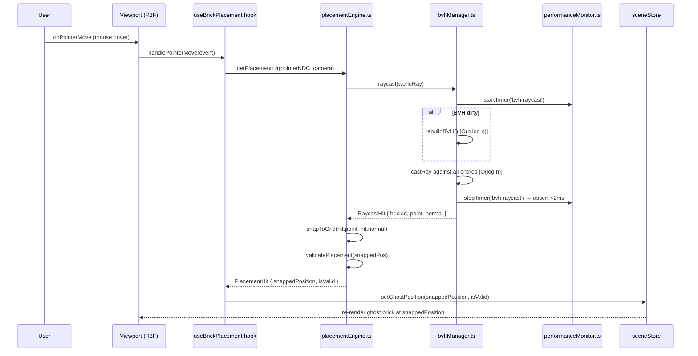
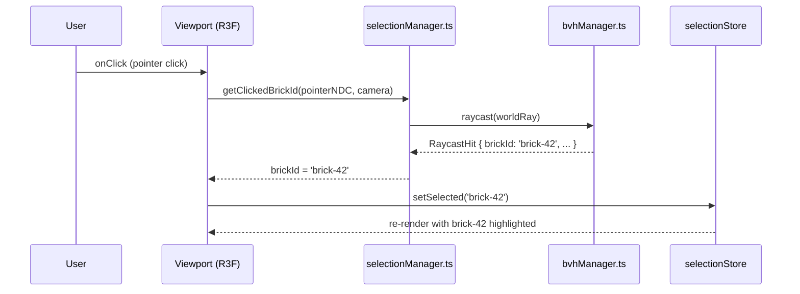
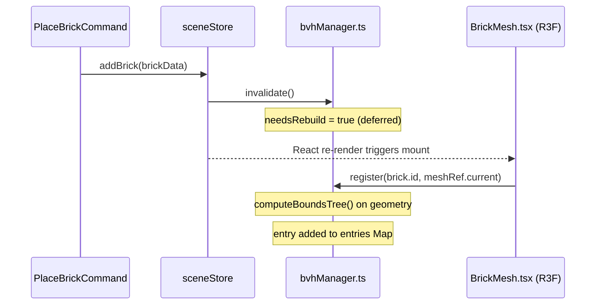
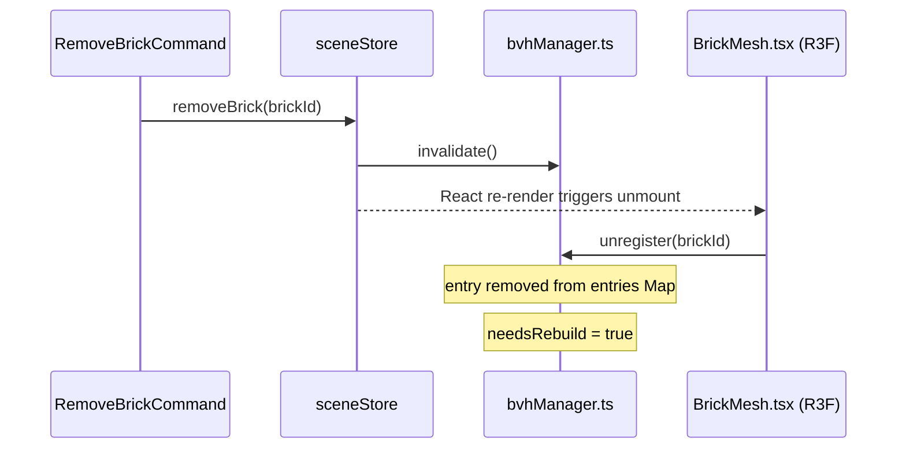
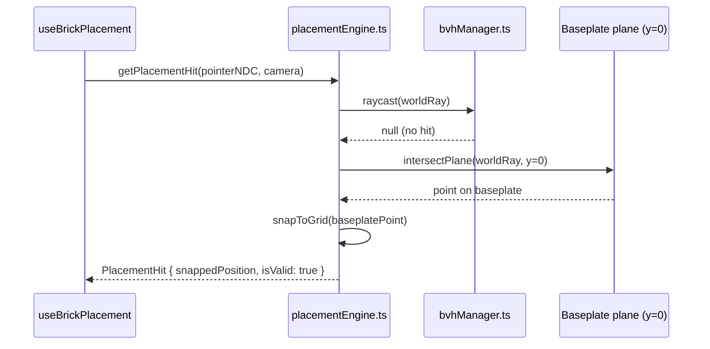

# Low-Level Design: FR-SCENE-003
# BVH-Accelerated Raycasting for Brick Placement and Selection

**Feature ID:** FR-SCENE-003  
**Issue:** [#9](https://github.com/sreenivasmrpivot/legobuilder/issues/9)  
**Status:** Draft — Awaiting Gate 6a Design Review  
**Author:** Spectra Design Agent  
**Date:** 2026-04-11  
**Dependencies:** FR-SCENE-001 (#7), FR-SCENE-002 (#8)  

---

## Table of Contents

1. [Overview](#1-overview)
2. [Component Architecture](#2-component-architecture)
3. [Data Models & Interfaces](#3-data-models--interfaces)
4. [API / Module Contracts](#4-api--module-contracts)
5. [Sequence Diagrams](#5-sequence-diagrams)
6. [BVH Lifecycle Management](#6-bvh-lifecycle-management)
7. [Error Handling Strategy](#7-error-handling-strategy)
8. [Security Considerations](#8-security-considerations)
9. [Performance Budget](#9-performance-budget)
10. [Test Case Mapping](#10-test-case-mapping)
11. [Open Questions & Assumptions](#11-open-questions--assumptions)

---

## 1. Overview

### 1.1 Purpose

FR-SCENE-003 introduces **BVH (Bounding Volume Hierarchy) acceleration** for all raycasting operations in the LegoBuilder 3D viewport. The current scaffold uses Three.js's naive O(n) raycasting, which degrades linearly with brick count. With BVH, raycast time is reduced to O(log n), achieving the <2 ms target for 500-brick scenes.

### 1.2 Scope

This LLD covers:
- Integration of `three-mesh-bvh` into `placementEngine.ts` and `selectionManager.ts`
- A new `bvhManager.ts` module responsible for BVH construction, caching, and invalidation
- BVH rebuild triggers on brick add/remove (sceneStore mutations)
- Three raycast use-cases: hover position detection, brick selection click, ghost brick positioning
- Performance measurement hooks via `performanceMonitor.ts`

### 1.3 Out of Scope

- Rendering pipeline changes (Three.js mesh rendering is unchanged)
- Undo/redo integration (BVH is a derived, non-persistent structure)
- Multi-brick selection (box-select) — future FR
- Server-side or worker-thread BVH computation

### 1.4 Technology

| Library | Version | Purpose |
|---------|---------|---------|
| `three-mesh-bvh` | ^0.7.x | BVH construction and accelerated raycasting |
| `three` | ^0.160.x | Base 3D engine, Raycaster, BufferGeometry |
| `@react-three/fiber` | ^8.x | R3F canvas, `useFrame`, `useThree` hooks |
| `zustand` | ^4.x | sceneStore — source of truth for brick list |

---

## 2. Component Architecture

### 2.1 Module Map

```
frontend/src/
├── engine/
│   ├── bvhManager.ts          ← NEW: BVH construction, cache, invalidation
│   ├── placementEngine.ts     ← MODIFIED: use bvhManager for hit detection
│   └── selectionManager.ts   ← MODIFIED: use bvhManager for click selection
├── hooks/
│   └── useBrickPlacement.ts  ← MODIFIED: pass bvhManager ref to engine calls
├── components/
│   └── Viewport/
│       └── BrickMesh.tsx      ← MODIFIED: call bvhManager.register() on mount/unmount
├── stores/
│   └── sceneStore.ts         ← MODIFIED: notify bvhManager on addBrick/removeBrick
└── utils/
    └── performanceMonitor.ts  ← EXISTING: wrap raycast calls with timing
```

### 2.2 Dependency Graph

```
BrickMesh (R3F component)
  └─ registers geometry → bvhManager.register(id, geometry)

sceneStore.addBrick / removeBrick
  └─ calls bvhManager.invalidate()

placementEngine.getHitPosition(ray)
  └─ calls bvhManager.raycast(ray) → RaycastHit | null

selectionManager.getSelectedBrick(ray)
  └─ calls bvhManager.raycast(ray) → RaycastHit | null

bvhManager
  ├─ maintains Map<brickId, { mesh: THREE.Mesh, bvh: MeshBVH }>
  ├─ maintains mergedBVH: StaticGeometryGenerator result (optional optimization)
  └─ exposes raycast(ray): RaycastHit | null
```

### 2.3 Module Responsibilities

| Module | Responsibility |
|--------|---------------|
| `bvhManager.ts` | Single source of truth for all BVH state. Owns geometry registration, BVH computation via `computeBoundsTree()`, cache invalidation, and the unified `raycast()` entry point. |
| `placementEngine.ts` | Translates pointer events into world-space rays; delegates hit detection to `bvhManager.raycast()`; snaps hit point to grid. |
| `selectionManager.ts` | Translates pointer click events into world-space rays; delegates to `bvhManager.raycast()`; maps hit `brickId` to `selectionStore.setSelected()`. |
| `BrickMesh.tsx` | Calls `bvhManager.register(id, geometry)` on mount and `bvhManager.unregister(id)` on unmount. |
| `sceneStore.ts` | After `addBrick` / `removeBrick` mutations, calls `bvhManager.invalidate()` to schedule a BVH rebuild on the next frame. |
| `performanceMonitor.ts` | Wraps `bvhManager.raycast()` calls with `performance.now()` timing; logs warnings when >2 ms. |

---

## 3. Data Models & Interfaces

### 3.1 BVH Entry

```typescript
// frontend/src/engine/bvhManager.ts

import { MeshBVH, acceleratedRaycast } from 'three-mesh-bvh';
import * as THREE from 'three';

/** A single registered brick geometry with its computed BVH. */
interface BVHEntry {
  /** The Three.js Mesh for this brick (owned by BrickMesh R3F component). */
  mesh: THREE.Mesh;
  /** The computed BVH for this brick's geometry. Null if not yet computed. */
  bvh: MeshBVH | null;
  /** Whether this entry needs BVH recomputation. */
  dirty: boolean;
}
```

### 3.2 RaycastHit

```typescript
/** Result of a successful BVH raycast. */
export interface RaycastHit {
  /** The brick ID that was hit. */
  brickId: string;
  /** World-space intersection point. */
  point: THREE.Vector3;
  /** World-space surface normal at the hit point. */
  normal: THREE.Vector3;
  /** Distance from ray origin to hit point. */
  distance: number;
  /** The face index within the geometry that was hit. */
  faceIndex: number;
}
```

### 3.3 BVHManagerState

```typescript
/** Internal state of the BVH manager. */
interface BVHManagerState {
  /** Map from brickId to BVH entry. */
  entries: Map<string, BVHEntry>;
  /** True if any entry is dirty and needs rebuild before next raycast. */
  needsRebuild: boolean;
  /** Timestamp of last full rebuild (for performance monitoring). */
  lastRebuildMs: number;
}
```

### 3.4 PlacementHit (extended from RaycastHit)

```typescript
/** Placement-specific hit result with snapped grid position. */
export interface PlacementHit extends RaycastHit {
  /** Grid-snapped stud position for brick placement. */
  snappedPosition: { x: number; y: number; z: number };
  /** Whether placement at snappedPosition is valid (no collision). */
  isValid: boolean;
}
```

### 3.5 Existing Types (unchanged)

```typescript
// frontend/src/types/brick.ts (existing — read-only reference)
export interface BrickData {
  id: string;
  type: string;          // e.g. '2x4', '1x1'
  position: { x: number; y: number; z: number };
  rotation: number;      // 0 | 90 | 180 | 270 degrees
  color: string;         // hex color string
}
```

---

## 4. API / Module Contracts

### 4.1 `bvhManager.ts` — Public API

```typescript
export interface IBVHManager {
  /**
   * Register a brick mesh for BVH tracking.
   * Called by BrickMesh on mount.
   * Triggers BVH computation for this geometry and marks needsRebuild=true.
   *
   * @param brickId  Unique brick identifier (matches BrickData.id)
   * @param mesh     The Three.js Mesh instance for this brick
   */
  register(brickId: string, mesh: THREE.Mesh): void;

  /**
   * Unregister a brick mesh from BVH tracking.
   * Called by BrickMesh on unmount.
   * Removes the entry and marks needsRebuild=true.
   *
   * @param brickId  Unique brick identifier
   */
  unregister(brickId: string): void;

  /**
   * Mark the BVH as dirty — schedule rebuild on next raycast call.
   * Called by sceneStore after addBrick / removeBrick.
   * Does NOT trigger immediate rebuild (deferred to next raycast).
   */
  invalidate(): void;

  /**
   * Perform an accelerated raycast against all registered brick geometries.
   * Rebuilds BVH if dirty before casting.
   * Returns the closest hit, or null if no intersection.
   *
   * @param ray  THREE.Ray in world space
   * @returns    Closest RaycastHit, or null
   */
  raycast(ray: THREE.Ray): RaycastHit | null;

  /**
   * Return the number of registered brick entries.
   * Used by tests and performance monitor.
   */
  getBrickCount(): number;

  /**
   * Dispose all BVH resources. Called on scene reset.
   */
  dispose(): void;
}
```

### 4.2 `placementEngine.ts` — Modified API

```typescript
export interface IPlacementEngine {
  /**
   * Given a pointer event and camera, compute the placement hit.
   * Uses bvhManager.raycast() for hit detection.
   * Falls back to baseplate plane intersection if no brick is hit.
   *
   * @param pointerNDC  Normalized device coordinates [-1,1] x [-1,1]
   * @param camera      Active Three.js camera
   * @returns           PlacementHit with snapped position, or null
   */
  getPlacementHit(
    pointerNDC: { x: number; y: number },
    camera: THREE.Camera
  ): PlacementHit | null;

  /**
   * Set the bvhManager instance (injected by useBrickPlacement hook).
   */
  setBVHManager(manager: IBVHManager): void;
}
```

### 4.3 `selectionManager.ts` — Modified API

```typescript
export interface ISelectionManager {
  /**
   * Given a pointer click event and camera, determine which brick was clicked.
   * Uses bvhManager.raycast() for hit detection.
   *
   * @param pointerNDC  Normalized device coordinates [-1,1] x [-1,1]
   * @param camera      Active Three.js camera
   * @returns           brickId of the clicked brick, or null
   */
  getClickedBrickId(
    pointerNDC: { x: number; y: number },
    camera: THREE.Camera
  ): string | null;

  /**
   * Set the bvhManager instance (injected by useBrickPlacement hook).
   */
  setBVHManager(manager: IBVHManager): void;
}
```

### 4.4 `sceneStore.ts` — Modified Actions

```typescript
// Addition to SceneStoreActions interface:
interface SceneStoreActions {
  // ... existing actions ...

  /**
   * Register the BVH manager with the scene store.
   * Called once during app initialization.
   * Enables the store to call bvhManager.invalidate() on mutations.
   */
  setBVHManager(manager: IBVHManager): void;
}
```

### 4.5 `BrickMesh.tsx` — Lifecycle Hooks

```typescript
// Props addition:
interface BrickMeshProps {
  brick: BrickData;
  bvhManager: IBVHManager;  // NEW: injected from parent Viewport
}

// Lifecycle pseudocode:
// useEffect(() => {
//   bvhManager.register(brick.id, meshRef.current);
//   return () => bvhManager.unregister(brick.id);
// }, [brick.id]);
```

---

## 5. Sequence Diagrams

### 5.1 Happy Path: Hover → Ghost Brick Positioning



### 5.2 Happy Path: Click → Brick Selection



### 5.3 BVH Registration: Brick Added to Scene



### 5.4 BVH Unregistration: Brick Removed from Scene



### 5.5 No-Hit Path: Ray Misses All Bricks → Baseplate Fallback



---

## 6. BVH Lifecycle Management

### 6.1 Initialization

```
App startup:
  1. bvhManager singleton created (module-level export)
  2. THREE.Mesh.prototype.raycast patched via acceleratedRaycast()
     → This is a one-time global patch from three-mesh-bvh
  3. sceneStore.setBVHManager(bvhManager) called in App.tsx useEffect
  4. placementEngine.setBVHManager(bvhManager) called in useBrickPlacement
  5. selectionManager.setBVHManager(bvhManager) called in Viewport
```

### 6.2 Per-Brick Registration

```
BrickMesh.tsx useEffect (mount):
  1. meshRef.current.geometry.computeBoundsTree()  ← three-mesh-bvh extension
  2. bvhManager.register(brick.id, meshRef.current)
     → stores { mesh, bvh: geometry.boundsTree, dirty: false }

BrickMesh.tsx useEffect cleanup (unmount):
  1. bvhManager.unregister(brick.id)
  2. meshRef.current.geometry.disposeBoundsTree()  ← cleanup GPU memory
```

### 6.3 Invalidation Strategy

BVH invalidation is **lazy** (deferred to next raycast call):

```
sceneStore.addBrick() / removeBrick():
  → bvhManager.invalidate()  [sets needsRebuild = true]

bvhManager.raycast(ray):
  if (needsRebuild):
    rebuildDirtyEntries()    [recomputes only dirty entries]
    needsRebuild = false
  → cast ray
```

This avoids redundant rebuilds when multiple bricks are added in a single frame (e.g., import/load).

### 6.4 Rebuild Algorithm

```
rebuildDirtyEntries():
  for each entry in entries.values():
    if entry.dirty:
      entry.mesh.geometry.computeBoundsTree({ strategy: SAH })
      entry.bvh = entry.mesh.geometry.boundsTree
      entry.dirty = false
  lastRebuildMs = performance.now()
```

**Strategy:** `SAH` (Surface Area Heuristic) — optimal for static geometry, best raycast performance at cost of slightly longer build time (~1–5 ms per brick geometry, amortized).

### 6.5 Raycast Algorithm

```
raycast(ray: THREE.Ray): RaycastHit | null:
  if needsRebuild: rebuildDirtyEntries()

  let closestHit: RaycastHit | null = null
  let minDistance = Infinity

  raycaster = new THREE.Raycaster()
  raycaster.ray.copy(ray)

  for each entry in entries.values():
    intersections = []
    entry.mesh.raycast(raycaster, intersections)  ← uses acceleratedRaycast
    for each intersection:
      if intersection.distance < minDistance:
        minDistance = intersection.distance
        closestHit = {
          brickId: entry.brickId,
          point: intersection.point,
          normal: intersection.face.normal (transformed to world space),
          distance: intersection.distance,
          faceIndex: intersection.faceIndex
        }

  return closestHit
```

---

## 7. Error Handling Strategy

### 7.1 Error Conditions

| Condition | Detection | Response |
|-----------|-----------|----------|
| `computeBoundsTree()` throws (invalid geometry) | try/catch in `register()` | Log warning, skip BVH for this brick; fall back to naive raycast for that mesh |
| `bvhManager` not initialized when `raycast()` called | Guard: `if (!this.initialized) return null` | Return null; placement engine falls back to baseplate plane |
| Raycast exceeds 2 ms budget | `performanceMonitor` timing check | Log `console.warn('[BVH] raycast exceeded 2ms budget: Xms')` — no throw |
| `unregister()` called for unknown brickId | Guard: `if (!entries.has(id)) return` | Silent no-op (idempotent) |
| `register()` called twice for same brickId | Guard: overwrite existing entry | Log warning, replace entry |
| Scene reset / dispose called | `dispose()` method | Clear all entries, call `disposeBoundsTree()` on each geometry |

### 7.2 BVHError Class

```typescript
export class BVHError extends Error {
  constructor(
    public readonly code: BVHErrorCode,
    message: string,
    public readonly brickId?: string
  ) {
    super(message);
    this.name = 'BVHError';
  }
}

export enum BVHErrorCode {
  GEOMETRY_INVALID     = 'BVH_GEOMETRY_INVALID',
  MANAGER_NOT_INIT     = 'BVH_MANAGER_NOT_INITIALIZED',
  REBUILD_FAILED       = 'BVH_REBUILD_FAILED',
}
```

### 7.3 Fallback Strategy

If BVH is unavailable for a specific brick (e.g., geometry error), the system falls back to Three.js's built-in `Raycaster.intersectObject()` for that brick only. This ensures correctness at the cost of performance for the affected brick.

---

## 8. Security Considerations

| Concern | Risk | Mitigation |
|---------|------|------------|
| **Prototype pollution via `acceleratedRaycast`** | `three-mesh-bvh` patches `THREE.Mesh.prototype.raycast` globally. A malicious import could override this. | Patch is applied once at app init in a controlled location (`bvhManager.ts` module top-level). Verify `three-mesh-bvh` version is pinned in `package.json`. |
| **Memory exhaustion via large geometry** | A brick with extremely high polygon count could cause `computeBoundsTree()` to allocate excessive memory. | Brick geometries are from a fixed catalog (brickCatalog.ts) — polygon counts are bounded and known. No user-supplied geometry. |
| **Denial of service via rapid brick add/remove** | Rapid invalidation could trigger excessive BVH rebuilds. | Lazy rebuild strategy (deferred to next raycast) + debounce on pointer events (existing `debounce.ts` utility) prevents rebuild storms. |
| **Stale BVH after undo/redo** | Undo/redo changes scene state; BVH must reflect current state. | `sceneStore.addBrick` / `removeBrick` always call `bvhManager.invalidate()`, regardless of whether the mutation came from a command or undo. |
| **XSS via brickId in error messages** | BVH error logs include brickId. | brickId is a UUID generated internally — never user-supplied HTML. No DOM injection risk. |

---

## 9. Performance Budget

| Operation | Target | Measurement Method |
|-----------|--------|-------------------|
| `bvhManager.raycast()` — 500 bricks | < 2 ms | `performanceMonitor.ts` timing wrapper |
| `bvhManager.raycast()` — 100 bricks | < 0.5 ms | `performanceMonitor.ts` timing wrapper |
| `computeBoundsTree()` per brick geometry | < 5 ms | Measured once on registration |
| Full BVH rebuild (500 bricks, all dirty) | < 100 ms | Measured in `rebuildDirtyEntries()` |
| Incremental rebuild (1 brick dirty) | < 5 ms | Measured in `rebuildDirtyEntries()` |
| Frame budget impact (60 fps = 16.67 ms) | < 2 ms for raycast | Leaves ≥14 ms for render |

**Performance improvement target (AC):** ≥5× speedup vs. naive raycasting for >100 bricks.

**Measurement approach for T-PERF-PERF-002-01:**
```
1. Create scene with 500 bricks
2. Measure naive raycast time (Three.js Raycaster without BVH): baseline_ms
3. Enable BVH (bvhManager)
4. Measure BVH raycast time: bvh_ms
5. Assert: bvh_ms < 2
6. Assert: baseline_ms / bvh_ms >= 5
```

---

## 10. Test Case Mapping

| Test ID | Description | Covered By |
|---------|-------------|------------|
| T-BE-SCENE-003-01 | BVH raycast completes in <2ms for 500-brick scene | `bvhManager.raycast()` with 500 registered entries + `performanceMonitor` assertion |
| T-PERF-PERF-002-01 | BVH provides ≥5× speedup vs naive raycasting for >100 bricks | Benchmark test: naive vs BVH raycast timing comparison |

### 10.1 Unit Test Scenarios

| Scenario | Module | Expected |
|----------|--------|----------|
| `register()` then `raycast()` hits registered brick | `bvhManager` | Returns `RaycastHit` with correct `brickId` |
| `unregister()` then `raycast()` misses removed brick | `bvhManager` | Returns `null` |
| `invalidate()` triggers rebuild on next `raycast()` | `bvhManager` | `rebuildDirtyEntries()` called once |
| `raycast()` with no registered bricks | `bvhManager` | Returns `null` |
| `register()` duplicate brickId | `bvhManager` | Overwrites entry, logs warning |
| `getPlacementHit()` with BVH hit | `placementEngine` | Returns `PlacementHit` with snapped position |
| `getPlacementHit()` with no BVH hit | `placementEngine` | Falls back to baseplate plane, returns valid hit |
| `getClickedBrickId()` with BVH hit | `selectionManager` | Returns correct `brickId` |
| `getClickedBrickId()` with no BVH hit | `selectionManager` | Returns `null` |
| Performance: 500 bricks, raycast < 2ms | `bvhManager` | `performance.now()` delta < 2 |

---

## 11. Open Questions & Assumptions

### Open Questions

| # | Question | Impact | Owner |
|---|----------|--------|-------|
| OQ-1 | Does `BrickMesh.tsx` currently use `useRef<THREE.Mesh>` to hold the mesh ref, or does it use R3F's implicit ref? The LLD assumes `meshRef.current` is accessible in `useEffect`. | Affects `register()` call timing | Frontend dev |
| OQ-2 | Are brick geometries shared (instanced) or unique per brick? If shared (e.g., all 2x4 bricks share one `BoxGeometry`), `computeBoundsTree()` must be called on the shared geometry once, not per-instance. | Affects BVH registration strategy | Frontend dev |
| OQ-3 | Does `sceneStore` currently expose a subscription/middleware hook, or must `setBVHManager` be a new action? | Affects sceneStore modification scope | Frontend dev |
| OQ-4 | Is `three-mesh-bvh` already in `package.json` dependencies, or does it need to be added? The issue references it but the scaffold may not include it. | Affects package.json changes | Frontend dev |
| OQ-5 | Should the BVH manager be a singleton module export or a React context value? Singleton is simpler; context allows testing with mocks. | Affects testability | Tech lead |

### Assumptions

| # | Assumption | Rationale |
|---|------------|----------|
| A-1 | `three-mesh-bvh` will be added to `package.json` as part of this FR's implementation. | Issue technical notes explicitly reference the library. |
| A-2 | Brick geometries are unique per brick instance (not shared/instanced). | Scaffold uses individual `<mesh>` components per brick in R3F. |
| A-3 | The BVH manager is a module-level singleton (not React context). | Simplest approach; can be refactored to context if testing requires it. |
| A-4 | `acceleratedRaycast` global prototype patch is safe to apply once at module load. | Standard `three-mesh-bvh` usage pattern. |
| A-5 | Pointer events are already debounced in `useBrickPlacement` (via existing `debounce.ts`). | Prevents excessive raycast calls on rapid mouse movement. |
| A-6 | FR-SCENE-001 (#7) and FR-SCENE-002 (#8) are merged before this FR is implemented. | Issue explicitly lists them as dependencies. |
