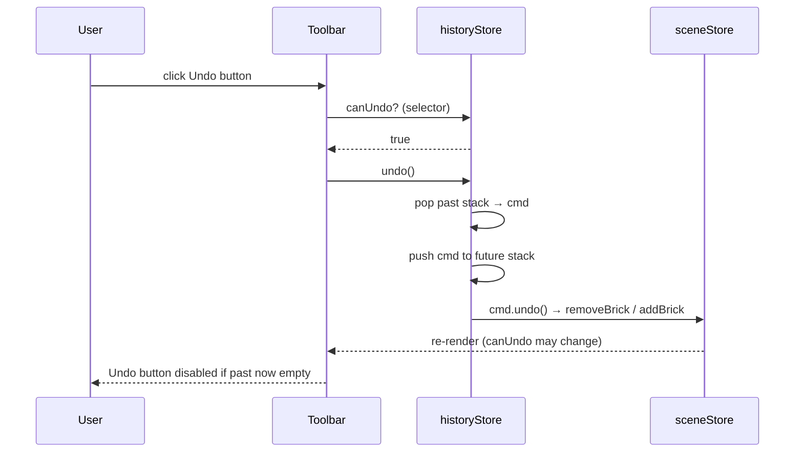
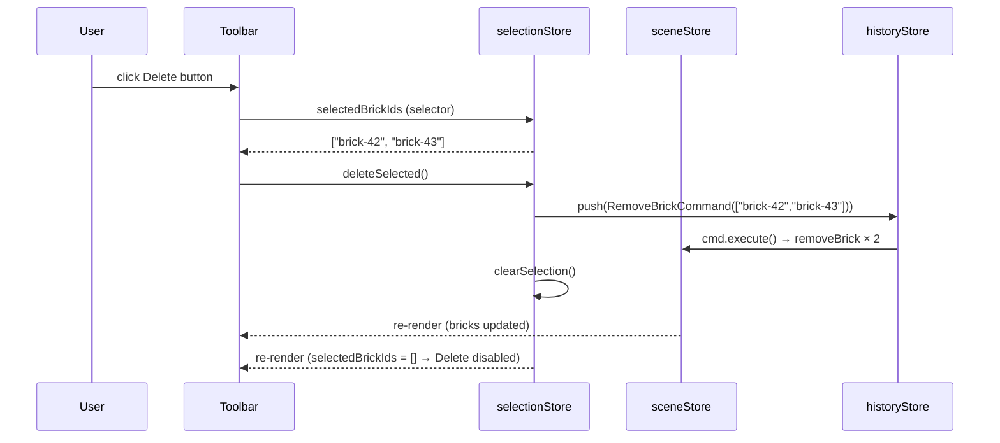
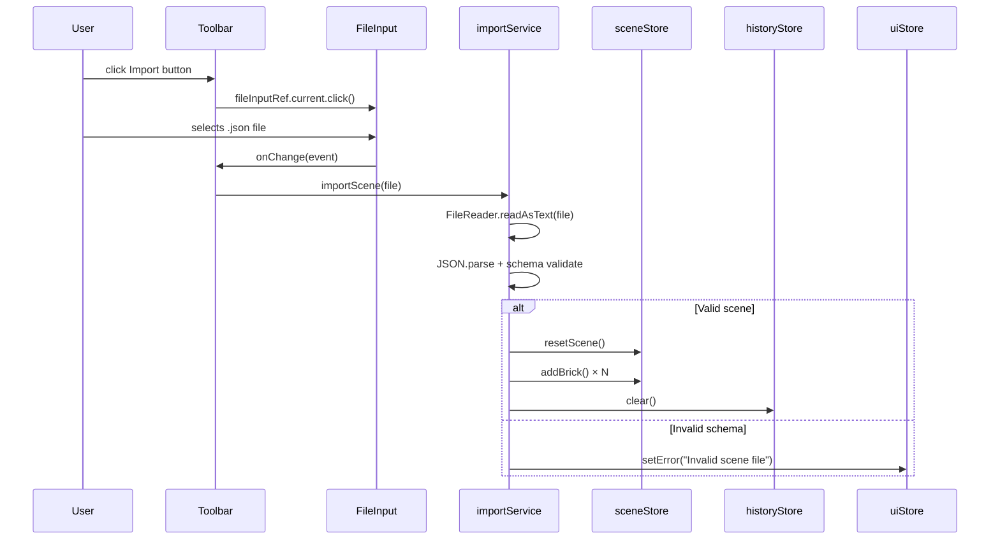
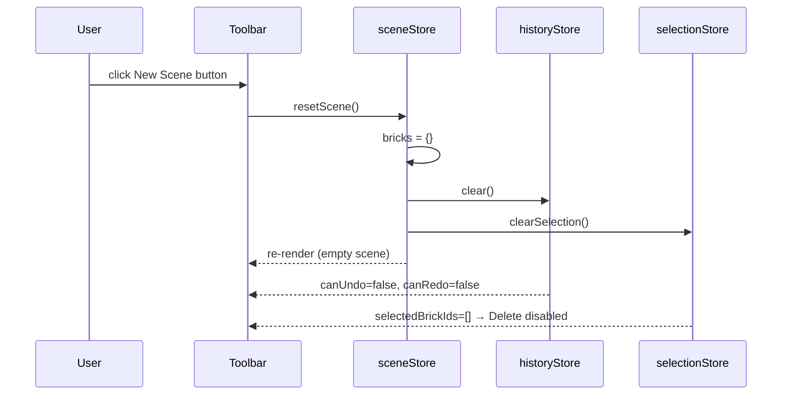
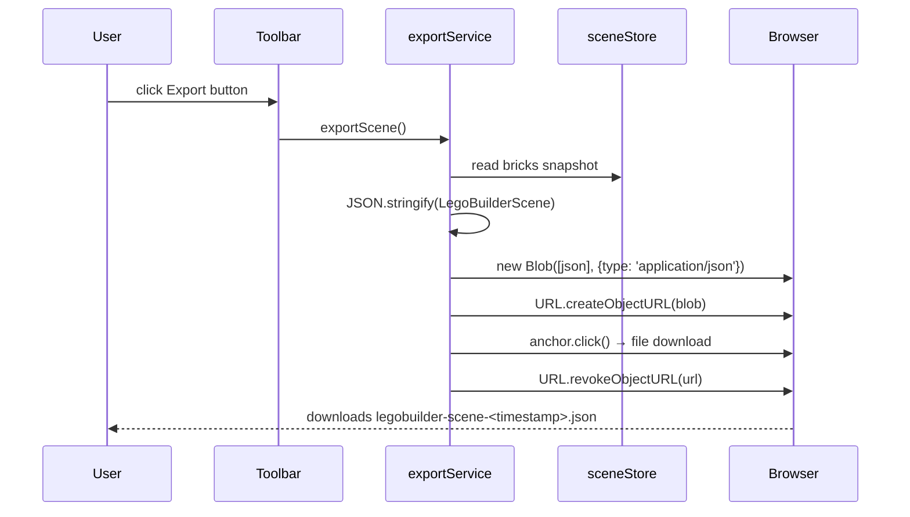

# Low-Level Design: FR-UI-001 — Toolbar Component

**Feature:** Implement toolbar with New Scene, Import, Export, Undo, Redo, Delete, and Reset Camera buttons
**Issue:** #23
**FR-ID:** FR-UI-001
**Author:** Design Agent (Spectra Framework)
**Status:** Draft — Awaiting Gate 6a Design Review
**Dependencies:** #8 (FR-SCENE-001), #16 (FR-EDIT-003), #14 (FR-EDIT-001)

---

## 1. Overview

The Toolbar is a stateful React component rendered at the top of the viewport. It exposes seven action buttons — **New Scene**, **Import**, **Export**, **Undo**, **Redo**, **Delete**, and **Reset Camera** — each of which reflects live application state (enabled/disabled) derived from Zustand stores. No server-side API calls are involved; all interactions are purely client-side.

### 1.1 Scope

| In Scope | Out of Scope |
|---|---|
| Toolbar component implementation | Underlying store action implementations (owned by FR-SCENE-001, FR-EDIT-001, FR-EDIT-003) |
| Button state derivation from stores | Import/Export file parsing logic (owned by importService / exportService) |
| Icon rendering via Heroicons | Keyboard shortcut binding (owned by `useKeyboardShortcuts` hook) |
| Accessibility (ARIA, focus management) | Drag-and-drop toolbar reordering |
| Unit + E2E test contracts | Tooltip animation library |

---

## 2. Component Architecture

### 2.1 Component Tree

```
App
└── Toolbar                          (frontend/src/components/ui/Toolbar.tsx)
    ├── ToolbarButton (×7)           (inline sub-component or shared primitive)
    │   ├── HeroIcon                 (@heroicons/react)
    │   └── Tooltip                  (native title attr or Radix UI Tooltip)
    └── ImportFileInput              (hidden <input type="file"> ref)
```

### 2.2 File Map

| File | Role | Action |
|---|---|---|
| `frontend/src/components/ui/Toolbar.tsx` | Main toolbar component | **Implement** (scaffold exists) |
| `frontend/src/components/ui/ToolbarButton.tsx` | Reusable button primitive | **Create** |
| `frontend/src/stores/historyStore.ts` | Undo/redo availability | **Read-only** (already scaffolded) |
| `frontend/src/stores/selectionStore.ts` | Delete availability | **Read-only** (already scaffolded) |
| `frontend/src/stores/sceneStore.ts` | New Scene action | **Read-only** (already scaffolded) |
| `frontend/src/stores/cameraStore.ts` | Reset Camera action | **Read-only** (already scaffolded) |
| `frontend/src/services/exportService.ts` | Export trigger | **Read-only** (already scaffolded) |
| `frontend/src/services/importService.ts` | Import trigger | **Read-only** (already scaffolded) |

---

## 3. Data Models & TypeScript Interfaces

### 3.1 ToolbarButton Props

```typescript
// frontend/src/components/ui/ToolbarButton.tsx

export interface ToolbarButtonProps {
  /** Accessible label (used for aria-label and tooltip) */
  label: string;
  /** Heroicon component (outline variant) */
  icon: React.ComponentType<React.SVGProps<SVGSVGElement>>;
  /** Click handler — only called when not disabled */
  onClick: () => void;
  /** When true, button is rendered in disabled state */
  disabled?: boolean;
  /** Optional keyboard shortcut hint shown in tooltip */
  shortcut?: string;
  /** Optional data-testid for Playwright/Vitest selectors */
  testId?: string;
}
```

### 3.2 Toolbar Internal State

The `Toolbar` component is **stateless** — all derived state comes from Zustand selectors. No local `useState` is required except for the hidden file-input ref.

```typescript
// Zustand selector contracts consumed by Toolbar

// historyStore
interface HistoryStoreSelectors {
  canUndo: boolean;   // true when past stack length > 0
  canRedo: boolean;   // true when future stack length > 0
  undo: () => void;
  redo: () => void;
}

// selectionStore
interface SelectionStoreSelectors {
  selectedBrickIds: string[];  // empty → Delete disabled
  clearSelection: () => void;
}

// sceneStore
interface SceneStoreSelectors {
  resetScene: () => void;  // clears all bricks + resets history
}

// cameraStore
interface CameraStoreSelectors {
  resetCamera: () => void;  // restores default orbit position
}
```

### 3.3 Button Configuration Table (Static)

```typescript
// Defined as a const array inside Toolbar.tsx

interface ButtonConfig {
  id: ToolbarButtonId;
  label: string;
  icon: React.ComponentType<React.SVGProps<SVGSVGElement>>;
  shortcut?: string;
  testId: string;
}

type ToolbarButtonId =
  | 'new-scene'
  | 'import'
  | 'export'
  | 'undo'
  | 'redo'
  | 'delete'
  | 'reset-camera';
```

---

## 4. Component Specification

### 4.1 Toolbar Component

```typescript
// frontend/src/components/ui/Toolbar.tsx

import React, { useRef } from 'react';
import {
  DocumentPlusIcon,
  ArrowUpTrayIcon,
  ArrowDownTrayIcon,
  ArrowUturnLeftIcon,
  ArrowUturnRightIcon,
  TrashIcon,
  VideoCameraIcon,
} from '@heroicons/react/24/outline';
import { useHistoryStore } from '../../stores/historyStore';
import { useSelectionStore } from '../../stores/selectionStore';
import { useSceneStore } from '../../stores/sceneStore';
import { useCameraStore } from '../../stores/cameraStore';
import { exportService } from '../../services/exportService';
import { importService } from '../../services/importService';
import { ToolbarButton } from './ToolbarButton';

export const Toolbar: React.FC = () => {
  const fileInputRef = useRef<HTMLInputElement>(null);

  // Store selectors — each selector is granular to avoid over-rendering
  const canUndo = useHistoryStore((s) => s.canUndo);
  const canRedo = useHistoryStore((s) => s.canRedo);
  const undo    = useHistoryStore((s) => s.undo);
  const redo    = useHistoryStore((s) => s.redo);

  const selectedBrickIds = useSelectionStore((s) => s.selectedBrickIds);
  const deleteSelected   = useSelectionStore((s) => s.deleteSelected);

  const resetScene  = useSceneStore((s) => s.resetScene);
  const resetCamera = useCameraStore((s) => s.resetCamera);

  // Derived disabled states
  const canDelete = selectedBrickIds.length > 0;

  // Handlers
  const handleNewScene  = () => resetScene();
  const handleImport    = () => fileInputRef.current?.click();
  const handleExport    = () => exportService.exportScene();
  const handleUndo      = () => canUndo && undo();
  const handleRedo      = () => canRedo && redo();
  const handleDelete    = () => canDelete && deleteSelected();
  const handleResetCam  = () => resetCamera();

  const handleFileChange = (e: React.ChangeEvent<HTMLInputElement>) => {
    const file = e.target.files?.[0];
    if (file) importService.importScene(file);
    // Reset input so same file can be re-imported
    e.target.value = '';
  };

  return (
    <header
      role="toolbar"
      aria-label="Scene toolbar"
      className="flex items-center gap-1 px-3 py-2 bg-gray-900 border-b border-gray-700 select-none"
    >
      <ToolbarButton label="New Scene"    icon={DocumentPlusIcon}    onClick={handleNewScene}  testId="btn-new-scene"    shortcut="Ctrl+N" />
      <ToolbarButton label="Import"       icon={ArrowUpTrayIcon}     onClick={handleImport}    testId="btn-import" />
      <ToolbarButton label="Export"       icon={ArrowDownTrayIcon}   onClick={handleExport}    testId="btn-export" />
      <div className="w-px h-6 bg-gray-600 mx-1" role="separator" aria-orientation="vertical" />
      <ToolbarButton label="Undo"         icon={ArrowUturnLeftIcon}  onClick={handleUndo}      testId="btn-undo"         shortcut="Ctrl+Z"  disabled={!canUndo} />
      <ToolbarButton label="Redo"         icon={ArrowUturnRightIcon} onClick={handleRedo}      testId="btn-redo"         shortcut="Ctrl+Y"  disabled={!canRedo} />
      <div className="w-px h-6 bg-gray-600 mx-1" role="separator" aria-orientation="vertical" />
      <ToolbarButton label="Delete"       icon={TrashIcon}           onClick={handleDelete}    testId="btn-delete"       shortcut="Del"     disabled={!canDelete} />
      <ToolbarButton label="Reset Camera" icon={VideoCameraIcon}     onClick={handleResetCam}  testId="btn-reset-camera" shortcut="Ctrl+0" />

      {/* Hidden file input for Import */}
      <input
        ref={fileInputRef}
        type="file"
        accept=".json"
        className="hidden"
        aria-hidden="true"
        onChange={handleFileChange}
      />
    </header>
  );
};
```

### 4.2 ToolbarButton Primitive

```typescript
// frontend/src/components/ui/ToolbarButton.tsx

import React from 'react';
import type { ToolbarButtonProps } from './ToolbarButton.types';

export const ToolbarButton: React.FC<ToolbarButtonProps> = ({
  label,
  icon: Icon,
  onClick,
  disabled = false,
  shortcut,
  testId,
}) => {
  const title = shortcut ? `${label} (${shortcut})` : label;

  return (
    <button
      type="button"
      aria-label={label}
      title={title}
      disabled={disabled}
      onClick={onClick}
      data-testid={testId}
      className={[
        'flex items-center justify-center w-9 h-9 rounded',
        'transition-colors duration-100',
        disabled
          ? 'text-gray-600 cursor-not-allowed'
          : 'text-gray-300 hover:bg-gray-700 hover:text-white active:bg-gray-600',
      ].join(' ')}
    >
      <Icon className="w-5 h-5" aria-hidden="true" />
    </button>
  );
};
```

---

## 5. Store Action Contracts

The Toolbar **reads** these store actions but does **not** implement them. The contracts below define what the Toolbar expects; the owning features must satisfy them.

### 5.1 historyStore (FR-EDIT-001 / #14)

```typescript
interface HistoryStore {
  // State
  past:   Command[];   // stack of executed commands
  future: Command[];   // stack of undone commands

  // Derived (computed or stored)
  canUndo: boolean;    // past.length > 0
  canRedo: boolean;    // future.length > 0

  // Actions
  undo(): void;        // pops past, pushes to future, calls command.undo()
  redo(): void;        // pops future, pushes to past, calls command.execute()
  push(cmd: Command): void;  // executes cmd, clears future, pushes to past
  clear(): void;       // resets both stacks (called by resetScene)
}
```

### 5.2 selectionStore (FR-EDIT-003 / #16)

```typescript
interface SelectionStore {
  // State
  selectedBrickIds: string[];  // IDs of currently selected bricks

  // Actions
  select(id: string): void;
  deselect(id: string): void;
  clearSelection(): void;
  deleteSelected(): void;  // removes selected bricks from sceneStore + clears selection
}
```

### 5.3 sceneStore (FR-SCENE-001 / #8)

```typescript
interface SceneStore {
  // State
  bricks: Record<string, Brick>;

  // Actions
  resetScene(): void;  // clears all bricks, calls historyStore.clear(), calls selectionStore.clearSelection()
  addBrick(brick: Brick): void;
  removeBrick(id: string): void;
}
```

### 5.4 cameraStore

```typescript
interface CameraStore {
  // State
  position: [number, number, number];  // current camera position
  target:   [number, number, number];  // current orbit target

  // Actions
  resetCamera(): void;  // restores default position [10, 10, 10] and target [0, 0, 0]
}
```

---

## 6. Service Contracts

### 6.1 exportService

```typescript
// frontend/src/services/exportService.ts

export interface ExportService {
  /**
   * Serializes the current sceneStore state to JSON and triggers
   * a browser file download named `legobuilder-scene-<timestamp>.json`.
   * No return value; errors are surfaced via uiStore.setError().
   */
  exportScene(): void;
}
```

**Export flow:**
1. Read `sceneStore.bricks` snapshot.
2. Serialize to `LegoBuilderScene` JSON schema (version field included).
3. Create `Blob` with `application/json` MIME type.
4. Create object URL → anchor click → revoke URL.
5. On error: call `uiStore.setError('Export failed: ' + err.message)`.

### 6.2 importService

```typescript
// frontend/src/services/importService.ts

export interface ImportService {
  /**
   * Reads a File object, validates the JSON schema, and loads the
   * scene into sceneStore (replacing current state).
   * Errors are surfaced via uiStore.setError().
   */
  importScene(file: File): Promise<void>;
}
```

**Import flow:**
1. `FileReader.readAsText(file)`.
2. Parse JSON → validate against `LegoBuilderScene` schema (Zod or manual).
3. Call `sceneStore.resetScene()` then replay bricks via `sceneStore.addBrick()`.
4. Call `historyStore.clear()` (import is not undoable).
5. On validation error: call `uiStore.setError('Invalid scene file: ' + details)`.

---

## 7. Sequence Diagrams

### 7.1 Undo Button Click



### 7.2 Delete Button Click



### 7.3 Import Flow



### 7.4 New Scene Flow



### 7.5 Export Flow



---

## 8. Icon Mapping

| Button | Heroicons 24/outline | Rationale |
|---|---|---|
| New Scene | `DocumentPlusIcon` | Document creation metaphor |
| Import | `ArrowUpTrayIcon` | Upload/ingest metaphor |
| Export | `ArrowDownTrayIcon` | Download/save metaphor |
| Undo | `ArrowUturnLeftIcon` | Standard undo convention |
| Redo | `ArrowUturnRightIcon` | Standard redo convention |
| Delete | `TrashIcon` | Universal delete metaphor |
| Reset Camera | `VideoCameraIcon` | Camera reset metaphor |

**Icon library:** `@heroicons/react` v2 (already in package.json via Tailwind ecosystem).
**Icon size:** `w-5 h-5` (20 × 20 px) inside a `w-9 h-9` (36 × 36 px) button target.

---

## 9. Styling Specification

### 9.1 Toolbar Container

```
flex items-center gap-1 px-3 py-2
bg-gray-900 border-b border-gray-700
select-none
```

- Fixed to top of viewport via parent layout (App shell handles positioning).
- Height: ~44 px (py-2 = 8 px × 2 + icon 28 px).
- Full viewport width.

### 9.2 Button States

| State | Tailwind Classes |
|---|---|
| Default (enabled) | `text-gray-300 hover:bg-gray-700 hover:text-white active:bg-gray-600` |
| Disabled | `text-gray-600 cursor-not-allowed` |
| Focus visible | `focus-visible:ring-2 focus-visible:ring-blue-500 focus-visible:outline-none` |

### 9.3 Separator

```html
<div class="w-px h-6 bg-gray-600 mx-1" role="separator" aria-orientation="vertical" />
```

Two separators: one between Export and Undo, one between Redo and Delete.

---

## 10. Accessibility

| Requirement | Implementation |
|---|---|
| Toolbar role | `<header role="toolbar" aria-label="Scene toolbar">` |
| Button labels | `aria-label={label}` on every `<button>` |
| Disabled state | Native `disabled` attribute (not just visual) |
| Keyboard navigation | Tab order follows DOM order; no roving tabindex needed for linear toolbar |
| Icon decorative | `aria-hidden="true"` on all SVG icons |
| Tooltip | `title` attribute with label + shortcut hint |
| Focus ring | `focus-visible:ring-2 focus-visible:ring-blue-500` |
| Screen reader | Disabled buttons announce "dimmed" / "unavailable" via native disabled semantics |

---

## 11. Test Case Mapping

| Test ID | Description | Type | Assertion |
|---|---|---|---|
| T-FE-UI-001-01 | All 7 buttons render on mount | Unit (Vitest + RTL) | `getByTestId('btn-new-scene')` etc. all present |
| T-FE-UI-001-02 | Undo disabled when `canUndo=false` | Unit (Vitest + RTL) | `btn-undo` has `disabled` attribute |
| T-FE-UI-001-03 | Redo disabled when `canRedo=false` | Unit (Vitest + RTL) | `btn-redo` has `disabled` attribute |
| T-FE-UI-001-04 | Delete disabled when `selectedBrickIds=[]` | Unit (Vitest + RTL) | `btn-delete` has `disabled` attribute |
| T-E2E-UI-001-01 | Full toolbar visible in browser | E2E (Playwright) | All 7 buttons visible + enabled/disabled states correct |

### 11.1 Unit Test Approach (Vitest + React Testing Library)

```typescript
// frontend/src/__tests__/Toolbar.test.tsx

describe('Toolbar', () => {
  it('renders all 7 buttons', () => {
    // Mock stores: canUndo=true, canRedo=true, selectedBrickIds=['x']
    render(<Toolbar />);
    expect(screen.getByTestId('btn-new-scene')).toBeInTheDocument();
    expect(screen.getByTestId('btn-import')).toBeInTheDocument();
    expect(screen.getByTestId('btn-export')).toBeInTheDocument();
    expect(screen.getByTestId('btn-undo')).toBeInTheDocument();
    expect(screen.getByTestId('btn-redo')).toBeInTheDocument();
    expect(screen.getByTestId('btn-delete')).toBeInTheDocument();
    expect(screen.getByTestId('btn-reset-camera')).toBeInTheDocument();
  });

  it('disables Undo when canUndo is false', () => {
    // Mock historyStore: canUndo=false
    render(<Toolbar />);
    expect(screen.getByTestId('btn-undo')).toBeDisabled();
  });

  it('disables Redo when canRedo is false', () => {
    // Mock historyStore: canRedo=false
    render(<Toolbar />);
    expect(screen.getByTestId('btn-redo')).toBeDisabled();
  });

  it('disables Delete when no bricks selected', () => {
    // Mock selectionStore: selectedBrickIds=[]
    render(<Toolbar />);
    expect(screen.getByTestId('btn-delete')).toBeDisabled();
  });

  it('enables Delete when bricks are selected', () => {
    // Mock selectionStore: selectedBrickIds=['brick-1']
    render(<Toolbar />);
    expect(screen.getByTestId('btn-delete')).not.toBeDisabled();
  });
});
```

### 11.2 E2E Test Approach (Playwright)

```typescript
// e2e/toolbar.spec.ts

test('toolbar renders all 7 buttons on app load', async ({ page }) => {
  await page.goto('/');
  await expect(page.getByTestId('btn-new-scene')).toBeVisible();
  await expect(page.getByTestId('btn-import')).toBeVisible();
  await expect(page.getByTestId('btn-export')).toBeVisible();
  await expect(page.getByTestId('btn-undo')).toBeVisible();
  await expect(page.getByTestId('btn-redo')).toBeVisible();
  await expect(page.getByTestId('btn-delete')).toBeVisible();
  await expect(page.getByTestId('btn-reset-camera')).toBeVisible();
});

test('Undo and Redo are disabled on fresh load', async ({ page }) => {
  await page.goto('/');
  await expect(page.getByTestId('btn-undo')).toBeDisabled();
  await expect(page.getByTestId('btn-redo')).toBeDisabled();
});

test('Delete is disabled when no brick is selected', async ({ page }) => {
  await page.goto('/');
  await expect(page.getByTestId('btn-delete')).toBeDisabled();
});
```

---

## 12. Error Handling Strategy

| Scenario | Handling | User Feedback |
|---|---|---|
| Import: file read error | `FileReader.onerror` → `uiStore.setError()` | Error toast/status bar message |
| Import: invalid JSON | `JSON.parse` throws → `uiStore.setError()` | "Invalid scene file" message |
| Import: schema validation failure | Zod `safeParse` returns error → `uiStore.setError()` | "Scene file version mismatch" message |
| Export: serialization error | try/catch → `uiStore.setError()` | "Export failed" message |
| Undo/Redo: called when disabled | Guard in handler (`canUndo && undo()`) | No-op; button is visually disabled |
| Delete: called when disabled | Guard in handler (`canDelete && deleteSelected()`) | No-op; button is visually disabled |
| New Scene: store throws | try/catch → `uiStore.setError()` | "Failed to reset scene" message |

---

## 13. Security Considerations

| Concern | Mitigation |
|---|---|
| Malicious JSON import | Schema validation (Zod) before any store mutation; no `eval()` or `Function()` used |
| XSS via file content | JSON.parse produces plain objects; no innerHTML or dangerouslySetInnerHTML used |
| File size DoS | Limit accepted file size to 10 MB via `file.size` check before FileReader |
| Object URL leak | `URL.revokeObjectURL()` called immediately after anchor click in export flow |
| Prototype pollution | Zod schema strips unknown keys; no `Object.assign` from untrusted input |

---

## 14. Performance Considerations

| Concern | Mitigation |
|---|---|
| Over-rendering on store updates | Granular Zustand selectors (one selector per value, not whole store) |
| Icon bundle size | Tree-shaken via `@heroicons/react` named imports; only 7 icons imported |
| File input re-use | `e.target.value = ''` reset after import allows same file re-import without re-mount |
| Toolbar re-render on unrelated store changes | Zustand shallow equality; selectors return primitives (boolean, string[]) |

---

## 15. Dependencies

| Dependency | Version | Purpose |
|---|---|---|
| `@heroicons/react` | ^2.x | Icon library (outline variant) |
| `zustand` | ^4.x | State management (historyStore, selectionStore, sceneStore, cameraStore) |
| `react` | ^18.x | Component framework |
| `tailwindcss` | ^3.x | Utility-first styling |
| `zod` | ^3.x | Import schema validation |
| `@testing-library/react` | ^14.x | Unit test rendering |
| `@playwright/test` | ^1.x | E2E test runner |

---

## 16. Open Questions

| # | Question | Owner | Priority |
|---|---|---|---|
| OQ-1 | Should "New Scene" show a confirmation dialog if the scene has unsaved changes? | Product | Medium |
| OQ-2 | Should Export be disabled when the scene is empty (no bricks)? | Product | Low |
| OQ-3 | Should Import be disabled during an active import operation (loading state)? | Engineering | Low |
| OQ-4 | Is `@heroicons/react` already in `package.json`, or does it need to be added? | Engineering | High — must confirm before implementation |
| OQ-5 | Should `deleteSelected` push a single batched `RemoveBrickCommand` or one command per brick? | Engineering | Medium — affects undo granularity |

---

## 17. Acceptance Criteria Traceability

| Acceptance Criterion | Design Element | Test ID |
|---|---|---|
| All 7 buttons visible with recognizable icons | `Toolbar.tsx` renders 7 `ToolbarButton` with Heroicons | T-FE-UI-001-01, T-E2E-UI-001-01 |
| Undo disabled when history empty | `canUndo` selector → `disabled={!canUndo}` | T-FE-UI-001-02 |
| Redo disabled when redo stack empty | `canRedo` selector → `disabled={!canRedo}` | T-FE-UI-001-03 |
| Delete disabled when no brick selected | `selectedBrickIds.length > 0` → `disabled={!canDelete}` | T-FE-UI-001-04 |

---

*Generated by Spectra Design Agent — Gate 6a approval required before implementation.*
