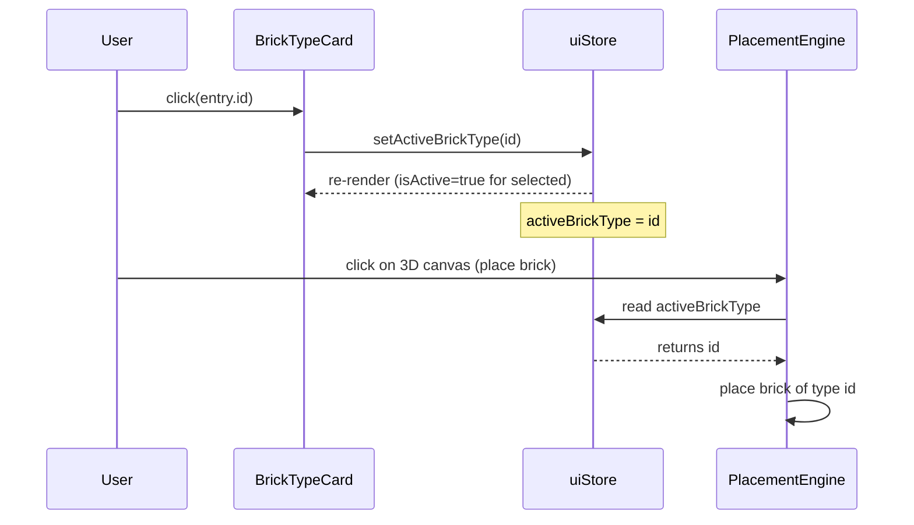
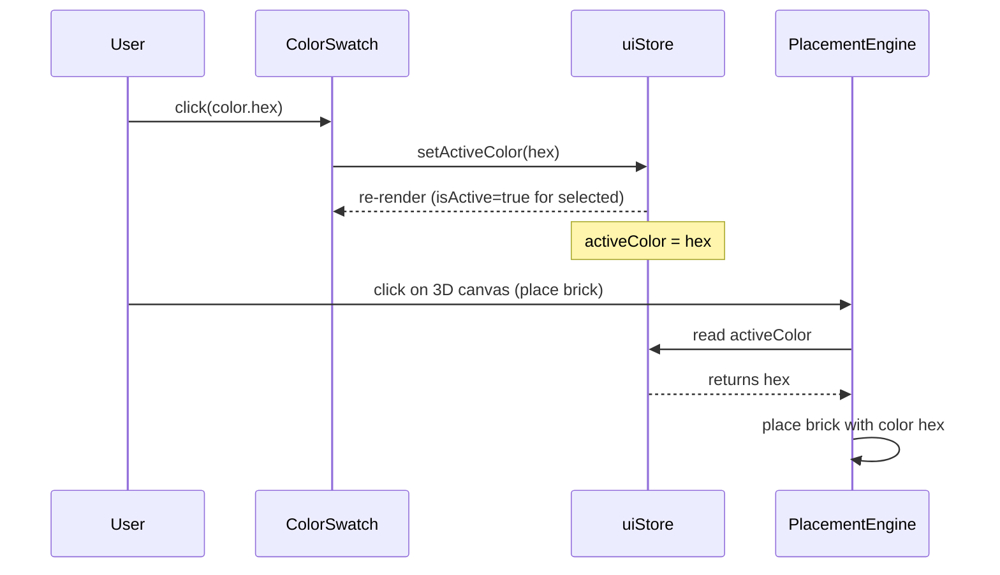
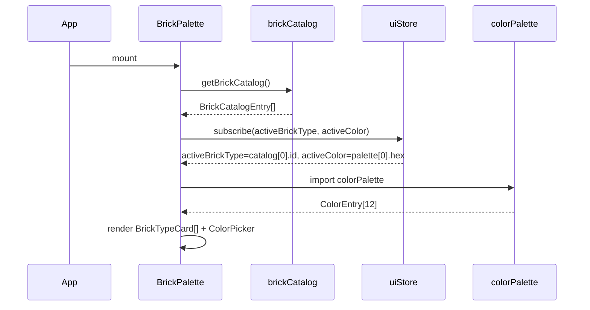
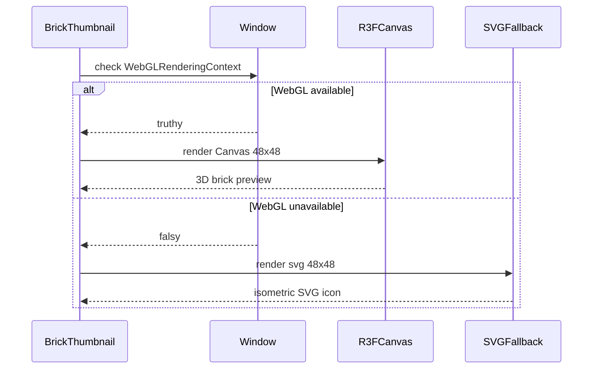

# Low-Level Design: FR-UI-002 — Brick Palette Sidebar with Visual Previews and Color Picker

**Feature ID:** FR-UI-002
**Issue:** [#24](https://github.com/sreenivasmrpivot/legobuilder/issues/24)
**Author:** Spectra Design Agent
**Status:** Draft — Awaiting Gate 6a Human Review
**Date:** 2026-04-11
**Depends On:** FR-BRICK-003 (Issue #12)

---

## Table of Contents

1. [Overview](#1-overview)
2. [Acceptance Criteria Mapping](#2-acceptance-criteria-mapping)
3. [Component Architecture](#3-component-architecture)
4. [Data Models & Type Interfaces](#4-data-models--type-interfaces)
5. [State Management Design (uiStore)](#5-state-management-design-uistore)
6. [Component Specifications](#6-component-specifications)
7. [Sequence Diagrams](#7-sequence-diagrams)
8. [Layout & Sizing Contract](#8-layout--sizing-contract)
9. [Error Handling Strategy](#9-error-handling-strategy)
10. [Security Considerations](#10-security-considerations)
11. [Performance Targets](#11-performance-targets)
12. [Accessibility (a11y)](#12-accessibility-a11y)
13. [Test Case Mapping](#13-test-case-mapping)
14. [Open Questions](#14-open-questions)

---

## 1. Overview

FR-UI-002 delivers the **Brick Palette Sidebar** — a fixed-width left-side panel that allows users to:

1. Browse available brick types as 3D thumbnail previews.
2. Select the active brick type for placement.
3. Choose a color from a 12-swatch color picker that applies to all subsequent brick placements.

The sidebar is a **pure client-side React component** that reads from `brickCatalog` (engine layer) and writes to `uiStore` (Zustand). It has **no backend API surface** — all state is in-memory and ephemeral per session.

### Architectural Position

```
+--------------------------------------------------------------+
|  App.tsx (layout root)                                       |
|  +------------------+  +----------------------------------+  |
|  |  BrickPalette    |  |  ViewportCanvas (R3F)            |  |
|  |  (w-64 / 256px)  |  |  (flex-1, remaining width)       |  |
|  |                  |  |                                  |  |
|  |  BrickTypeCard[] |  |                                  |  |
|  |  ColorPicker     |  |                                  |  |
|  +------------------+  +----------------------------------+  |
+--------------------------------------------------------------+
```

---

## 2. Acceptance Criteria Mapping

| AC # | Acceptance Criterion | Implementing Component | Test ID |
|------|---------------------|----------------------|---------|
| AC-1 | Brick types displayed as 3D thumbnail previews | `BrickThumbnail` (R3F mini-canvas or SVG fallback) | T-FE-UI-002-01 |
| AC-2 | Clicking a brick type sets it as active placement brick | `BrickTypeCard` -> `uiStore.setActiveBrickType()` | T-FE-UI-002-02 |
| AC-3 | Selecting a color updates subsequent brick placements | `ColorSwatch` -> `uiStore.setActiveColor()` | T-FE-UI-002-03 |
| AC-4 | Sidebar <= 25% of 1024px canvas width (<= 256px) | `BrickPalette` Tailwind `w-64` + layout contract | T-FE-UI-002-04 |
| AC-5 | Active brick type visually highlighted | `BrickTypeCard` active ring style | T-FE-UI-002-05 |

---

## 3. Component Architecture

### Module Dependency Graph

```
frontend/src/
+-- components/
|   +-- ui/
|       +-- BrickPalette.tsx          <- root sidebar component (already scaffolded)
|       +-- BrickTypeCard.tsx         <- NEW: individual brick type tile
|       +-- BrickThumbnail.tsx        <- NEW: 3D preview or SVG icon per brick
|       +-- ColorPicker.tsx           <- NEW: 12-swatch color grid
|       +-- ColorSwatch.tsx           <- NEW: single color swatch button
+-- stores/
|   +-- uiStore.ts                   <- EXTEND: add activeBrickType + activeColor
+-- engine/
|   +-- brickCatalog.ts              <- READ-ONLY: source of brick type definitions
+-- utils/
    +-- colorPalette.ts              <- READ-ONLY: 12-color array
```

### Component Hierarchy

```
BrickPalette
+-- section[aria-label="Brick Types"]
|   +-- BrickTypeCard (x N, one per catalog entry)
|       +-- BrickThumbnail
|           +-- [strategy A] <Canvas> (R3F, 48x48px, isolated renderer)
|           +-- [strategy B] <svg> (fallback for low-end devices)
+-- section[aria-label="Color Picker"]
    +-- ColorPicker
        +-- ColorSwatch (x 12)
```

### File Responsibilities

| File | Responsibility | New / Modified |
|------|---------------|----------------|
| `BrickPalette.tsx` | Layout shell, renders two sections, reads catalog | Modified (scaffold -> full impl) |
| `BrickTypeCard.tsx` | Tile with label + thumbnail, handles click -> store | New |
| `BrickThumbnail.tsx` | Renders 3D preview (R3F) or SVG icon; memoized | New |
| `ColorPicker.tsx` | Grid of 12 swatches, section heading | New |
| `ColorSwatch.tsx` | Single color button, active ring, aria-label | New |
| `uiStore.ts` | Add `activeBrickType: BrickTypeId`, `activeColor: string`, setters | Modified |

---

## 4. Data Models & Type Interfaces

### 4.1 BrickTypeId (from existing `types/brick.ts`)

```typescript
// Existing — no change required
export type BrickTypeId = string; // e.g. '1x1', '1x2', '2x2', '2x4'
```

### 4.2 BrickCatalogEntry (from existing `engine/brickCatalog.ts`)

```typescript
// Existing shape (read-only by this feature)
export interface BrickCatalogEntry {
  id: BrickTypeId;          // '1x1', '1x2', '2x2', '2x4'
  label: string;            // Display name: '1x1 Brick'
  studsX: number;           // Width in studs
  studsZ: number;           // Depth in studs
  heightUnits: number;      // Height in plate units
}
```

### 4.3 UIStore State Extension

```typescript
// frontend/src/stores/uiStore.ts — additions
interface UIState {
  // --- existing fields (unchanged) ---
  tool: ToolMode;
  // ... other existing fields ...

  // --- FR-UI-002 additions ---
  activeBrickType: BrickTypeId;   // default: first entry in brickCatalog
  activeColor: string;            // default: colorPalette[0] (hex string)

  // Actions
  setActiveBrickType: (id: BrickTypeId) => void;
  setActiveColor: (hex: string) => void;
}
```

### 4.4 ColorEntry (from existing `utils/colorPalette.ts`)

```typescript
// Existing shape (read-only by this feature)
export interface ColorEntry {
  hex: string;    // '#FF0000'
  label: string;  // 'Red'
}

// colorPalette: ColorEntry[]  — exactly 12 entries
```

### 4.5 Component Props Interfaces

```typescript
// BrickTypeCard.tsx
interface BrickTypeCardProps {
  entry: BrickCatalogEntry;
  isActive: boolean;
  onSelect: (id: BrickTypeId) => void;
}

// BrickThumbnail.tsx
interface BrickThumbnailProps {
  entry: BrickCatalogEntry;
  size?: number;  // px, default 48
}

// ColorPicker.tsx
interface ColorPickerProps {
  colors: ColorEntry[];
  activeColor: string;
  onSelect: (hex: string) => void;
}

// ColorSwatch.tsx
interface ColorSwatchProps {
  color: ColorEntry;
  isActive: boolean;
  onSelect: (hex: string) => void;
}
```

---

## 5. State Management Design (uiStore)

### 5.1 Current uiStore Shape (before FR-UI-002)

The existing `uiStore.ts` manages `tool` (ToolMode) and sidebar visibility flags. FR-UI-002 extends it with two new fields.

### 5.2 Extended uiStore Interface

```typescript
import { create } from 'zustand';
import { BrickTypeId } from '../types/brick';
import { getBrickCatalog } from '../engine/brickCatalog';
import { colorPalette } from '../utils/colorPalette';

interface UIState {
  tool: ToolMode;
  activeBrickType: BrickTypeId;
  activeColor: string;
  setActiveBrickType: (id: BrickTypeId) => void;
  setActiveColor: (hex: string) => void;
}

export const useUIStore = create<UIState>((set) => ({
  tool: 'place',
  activeBrickType: getBrickCatalog()[0].id,  // first catalog entry
  activeColor: colorPalette[0].hex,           // first color swatch
  setActiveBrickType: (id) => set({ activeBrickType: id }),
  setActiveColor: (hex) => set({ activeColor: hex }),
}));
```

### 5.3 State Flow

```
brickCatalog (static)  --read-->  BrickPalette  --renders-->  BrickTypeCard[]
                                                                    |
                                                              onClick(id)
                                                                    |
                                                                    v
                                                         uiStore.setActiveBrickType(id)
                                                                    |
                                                                    v
                                                         placementEngine reads
                                                         uiStore.activeBrickType
                                                         on next brick placement

colorPalette (static)  --read-->  ColorPicker   --renders-->  ColorSwatch[]
                                                                    |
                                                              onClick(hex)
                                                                    |
                                                                    v
                                                         uiStore.setActiveColor(hex)
                                                                    |
                                                                    v
                                                         placementEngine reads
                                                         uiStore.activeColor
                                                         on next brick placement
```

---

## 6. Component Specifications

### 6.1 BrickPalette (root)

**File:** `frontend/src/components/ui/BrickPalette.tsx`
**Type:** React functional component
**Tailwind classes:** `w-64 h-full flex flex-col bg-gray-900 border-r border-gray-700 overflow-y-auto`

```typescript
const BrickPalette: React.FC = () => {
  const activeBrickType    = useUIStore((s) => s.activeBrickType);
  const activeColor        = useUIStore((s) => s.activeColor);
  const setActiveBrickType = useUIStore((s) => s.setActiveBrickType);
  const setActiveColor     = useUIStore((s) => s.setActiveColor);
  const catalog = getBrickCatalog(); // static, no re-render cost

  return (
    <aside
      className="w-64 h-full flex flex-col bg-gray-900 border-r border-gray-700 overflow-y-auto"
      aria-label="Brick Palette"
      data-testid="brick-palette"
    >
      <section aria-label="Brick Types" className="p-2">
        <h2 className="text-xs font-semibold text-gray-400 uppercase tracking-wider mb-2">
          Brick Types
        </h2>
        <div className="grid grid-cols-2 gap-2">
          {catalog.map((entry) => (
            <BrickTypeCard
              key={entry.id}
              entry={entry}
              isActive={entry.id === activeBrickType}
              onSelect={setActiveBrickType}
            />
          ))}
        </div>
      </section>

      <section aria-label="Color Picker" className="p-2 border-t border-gray-700">
        <h2 className="text-xs font-semibold text-gray-400 uppercase tracking-wider mb-2">
          Color
        </h2>
        <ColorPicker
          colors={colorPalette}
          activeColor={activeColor}
          onSelect={setActiveColor}
        />
      </section>
    </aside>
  );
};
```

**Constraints:**
- `w-64` = 256px = exactly 25% of 1024px viewport -> satisfies AC-4.
- `overflow-y-auto` ensures the sidebar scrolls internally if catalog grows.
- `aside` landmark with `aria-label` satisfies WCAG 2.1 landmark navigation.

---

### 6.2 BrickTypeCard

**File:** `frontend/src/components/ui/BrickTypeCard.tsx`
**Type:** React functional component, `React.memo` wrapped

```typescript
const BrickTypeCard: React.FC<BrickTypeCardProps> = React.memo(
  ({ entry, isActive, onSelect }) => {
    return (
      <button
        type="button"
        onClick={() => onSelect(entry.id)}
        aria-pressed={isActive}
        aria-label={`Select ${entry.label}`}
        data-testid={`brick-type-card-${entry.id}`}
        className={[
          'flex flex-col items-center p-2 rounded-lg border-2 transition-colors',
          isActive
            ? 'border-blue-500 bg-blue-900/30'
            : 'border-transparent bg-gray-800 hover:bg-gray-700',
        ].join(' ')}
      >
        <BrickThumbnail entry={entry} size={48} />
        <span className="mt-1 text-xs text-gray-300 truncate w-full text-center">
          {entry.label}
        </span>
      </button>
    );
  }
);
```

**Active state:** `border-blue-500 bg-blue-900/30` ring — visually distinct, satisfies AC-5.
**`aria-pressed`:** Communicates toggle state to screen readers.
**`React.memo`:** Prevents re-render of inactive cards when active selection changes.

---

### 6.3 BrickThumbnail

**File:** `frontend/src/components/ui/BrickThumbnail.tsx`
**Type:** React functional component, `React.memo` wrapped
**Strategy:** Two-tier rendering with automatic fallback.

#### Strategy A — R3F Mini-Canvas (preferred)

A small isolated `<Canvas>` (48x48px) renders a single brick mesh using the existing Three.js geometry from the engine layer. This provides true 3D previews.

```typescript
// Strategy A: R3F isolated canvas
const BrickThumbnailR3F: React.FC<BrickThumbnailProps> = ({ entry, size = 48 }) => (
  <Canvas
    style={{ width: size, height: size }}
    camera={{ position: [2, 2, 2], fov: 40 }}
    gl={{ antialias: true, alpha: true }}
    aria-hidden="true"  // decorative; label is on parent button
  >
    <ambientLight intensity={0.6} />
    <directionalLight position={[3, 5, 3]} intensity={0.8} />
    <BrickMesh
      studsX={entry.studsX}
      studsZ={entry.studsZ}
      heightUnits={entry.heightUnits}
      color="#A0A0A0"  // neutral gray for preview
    />
    <OrbitControls enableZoom={false} enablePan={false} autoRotate autoRotateSpeed={2} />
  </Canvas>
);
```

#### Strategy B — SVG Icon Fallback

For devices where WebGL is unavailable or when `window.WebGLRenderingContext` is falsy, render a simple SVG isometric projection.

```typescript
// Strategy B: SVG fallback
const BrickThumbnailSVG: React.FC<BrickThumbnailProps> = ({ entry, size = 48 }) => (
  <svg
    width={size}
    height={size}
    viewBox="0 0 48 48"
    aria-hidden="true"
    className="text-gray-400"
  >
    {/* Isometric box approximation scaled by studsX x studsZ */}
    <rect
      x={8}
      y={16}
      width={entry.studsX * 8}
      height={entry.studsZ * 6}
      rx={2}
      fill="currentColor"
      opacity={0.7}
    />
    <text x="24" y="38" textAnchor="middle" fontSize="8" fill="white">
      {entry.studsX}x{entry.studsZ}
    </text>
  </svg>
);
```

#### Thumbnail Selector

```typescript
const BrickThumbnail: React.FC<BrickThumbnailProps> = React.memo(
  ({ entry, size = 48 }) => {
    const webglAvailable = typeof window !== 'undefined' &&
      !!window.WebGLRenderingContext;
    return webglAvailable
      ? <BrickThumbnailR3F entry={entry} size={size} />
      : <BrickThumbnailSVG entry={entry} size={size} />;
  }
);
```

**Performance note:** Each R3F `<Canvas>` creates an independent WebGL context. With N brick types (currently 4 in catalog), this creates 4 WebGL contexts. Browsers typically allow 8-16 simultaneous contexts. If the catalog grows beyond 8 entries, the implementation agent MUST switch to a **shared offscreen canvas** approach (render-to-texture per brick type, share one WebGL context). This is flagged as an open question in Section 14.

---

### 6.4 ColorPicker

**File:** `frontend/src/components/ui/ColorPicker.tsx`
**Type:** React functional component

```typescript
const ColorPicker: React.FC<ColorPickerProps> = ({ colors, activeColor, onSelect }) => (
  <div
    role="group"
    aria-label="Color swatches"
    className="grid grid-cols-4 gap-1"
    data-testid="color-picker"
  >
    {colors.map((color) => (
      <ColorSwatch
        key={color.hex}
        color={color}
        isActive={color.hex === activeColor}
        onSelect={onSelect}
      />
    ))}
  </div>
);
```

**Layout:** `grid-cols-4` renders 12 swatches in 3 rows of 4 — compact and scannable.

---

### 6.5 ColorSwatch

**File:** `frontend/src/components/ui/ColorSwatch.tsx`
**Type:** React functional component, `React.memo` wrapped

```typescript
const ColorSwatch: React.FC<ColorSwatchProps> = React.memo(
  ({ color, isActive, onSelect }) => (
    <button
      type="button"
      onClick={() => onSelect(color.hex)}
      aria-pressed={isActive}
      aria-label={color.label}
      data-testid={`color-swatch-${color.hex.replace('#', '')}`}
      title={color.label}
      className={[
        'w-8 h-8 rounded-md border-2 transition-transform',
        isActive ? 'border-white scale-110' : 'border-transparent hover:scale-105',
      ].join(' ')}
      style={{ backgroundColor: color.hex }}
    />
  )
);
```

**Active state:** `border-white scale-110` — white ring + slight scale-up.
**`aria-pressed`:** Communicates selection state.
**`title`:** Tooltip with color name for mouse users.

---

## 7. Sequence Diagrams

### 7.1 Brick Type Selection



### 7.2 Color Selection



### 7.3 Initial Render & Catalog Load



### 7.4 WebGL Availability Check (Thumbnail Strategy)



---

## 8. Layout & Sizing Contract

### 8.1 Width Constraint (AC-4)

| Viewport Width | Sidebar Width | Canvas Width | Sidebar % |
|---------------|--------------|-------------|----------|
| 1024px | 256px (`w-64`) | 768px | 25.0% PASS |
| 1280px | 256px (`w-64`) | 1024px | 20.0% PASS |
| 768px | 256px (`w-64`) | 512px | 33.3% NOTE |

**Note:** At 768px the sidebar exceeds 25%. The AC specifies "at 1024px viewport width" — the `w-64` constraint satisfies this exactly. No responsive collapse is required by FR-UI-002, but it is flagged as a future enhancement.

### 8.2 App Layout Integration

The `App.tsx` layout must use a flex row to position the sidebar and canvas:

```tsx
// App.tsx layout contract
<div className="flex h-screen w-screen overflow-hidden">
  <BrickPalette />                    {/* w-64, flex-shrink-0 */}
  <div className="flex-1 relative">   {/* takes remaining width */}
    <ViewportCanvas />
    <Toolbar />
    <StatusBar />
  </div>
</div>
```

### 8.3 Sidebar Internal Layout

```
+-----------------------------+  <- w-64 (256px)
|  BRICK TYPES                |  <- section heading (text-xs uppercase)
|  +------+ +------+         |
|  | [3D] | | [3D] |         |  <- BrickTypeCard (grid-cols-2)
|  | 1x1  | | 1x2  |         |
|  +------+ +------+         |
|  +------+ +------+         |
|  | [3D] | | [3D] |         |
|  | 2x2  | | 2x4  |         |
|  +------+ +------+         |
+-----------------------------+  <- border-t divider
|  COLOR                      |  <- section heading
|  [] [] [] []                |
|  [] [] [] []                |  <- ColorSwatch grid (grid-cols-4, 3 rows)
|  [] [] [] []                |
+-----------------------------+
```

---

## 9. Error Handling Strategy

| Failure Mode | Detection | Recovery Strategy | User Impact |
|-------------|-----------|------------------|-------------|
| `getBrickCatalog()` returns empty array | `catalog.length === 0` guard in `BrickPalette` | Render empty state message: "No brick types available" | Cannot place bricks; non-blocking |
| WebGL context creation fails | `try/catch` around R3F `<Canvas>` mount | Automatic fallback to SVG thumbnail | Degraded preview; functional |
| WebGL context limit exceeded (>16 contexts) | Browser silently fails canvas | SVG fallback activates per-thumbnail | Degraded preview; functional |
| `colorPalette` import returns empty array | `colors.length === 0` guard in `ColorPicker` | Render empty state; `activeColor` retains last value | Cannot change color; non-blocking |
| `uiStore.setActiveBrickType` called with unknown id | Zustand setter accepts any string; no validation needed at store level | `BrickTypeCard` only calls with valid catalog ids | None |
| `uiStore.setActiveColor` called with invalid hex | No validation at store level | `ColorSwatch` only calls with valid palette hex values | None |

### Error Boundary

Wrap `BrickPalette` in a React Error Boundary at the `App.tsx` level:

```tsx
<BrickPaletteErrorBoundary fallback={<SidebarErrorFallback />}>
  <BrickPalette />
</BrickPaletteErrorBoundary>
```

If the entire sidebar crashes, the canvas remains functional and the user can still interact with the 3D scene.

---

## 10. Security Considerations

| Concern | Assessment | Mitigation |
|---------|-----------|------------|
| XSS via color hex values | `colorPalette` is a static compile-time constant; no user input | No runtime sanitization needed; values are hardcoded |
| XSS via brick type labels | `brickCatalog` is a static compile-time constant | No runtime sanitization needed |
| WebGL shader injection | R3F uses Three.js built-in shaders; no user-supplied GLSL | No risk |
| CSS injection via `style={{ backgroundColor: hex }}` | Hex values from static `colorPalette` only | Safe; if palette ever becomes dynamic, validate hex format with `/^#[0-9A-Fa-f]{6}$/` |
| Prototype pollution | No `Object.assign` or dynamic key access on user input | No risk |

**Overall:** FR-UI-002 has a minimal security surface. All data sources are static compile-time constants. No user-supplied strings are rendered as HTML or injected into styles.

---

## 11. Performance Targets

| Metric | Target | Measurement Method |
|--------|--------|-------------------|
| Initial sidebar render time | < 100ms | React DevTools Profiler |
| BrickTypeCard click -> store update | < 16ms (1 frame) | Zustand synchronous setter |
| ColorSwatch click -> store update | < 16ms (1 frame) | Zustand synchronous setter |
| R3F thumbnail first paint (per canvas) | < 200ms | `onCreated` callback timing |
| Total WebGL contexts (4 brick types) | 4 contexts | Browser DevTools |
| Sidebar re-render on active change | Only active + previously-active cards | React.memo isolation |
| Memory per R3F thumbnail canvas | < 2MB GPU memory | Chrome GPU memory inspector |

### React.memo Strategy

- `BrickTypeCard` is memoized: only re-renders when `isActive` or `entry` changes.
- `BrickThumbnail` is memoized: only re-renders when `entry` or `size` changes (never after initial mount for static catalog).
- `ColorSwatch` is memoized: only re-renders when `isActive` changes.
- Net result: a brick type selection causes exactly **2 card re-renders** (deactivated + activated), not N.

---

## 12. Accessibility (a11y)

### WCAG 2.1 AA Compliance

| Requirement | Implementation |
|-------------|---------------|
| 1.1.1 Non-text content | `aria-hidden="true"` on thumbnails; label on parent `<button>` |
| 1.4.1 Use of color | Active state uses both color ring AND scale change (not color alone) |
| 1.4.3 Contrast ratio | Gray-400 text on gray-900 background: 7.2:1 PASS |
| 2.1.1 Keyboard | All interactive elements are `<button>` — natively keyboard focusable |
| 2.4.3 Focus order | DOM order matches visual order (top-to-bottom, left-to-right) |
| 2.4.6 Headings | Section `<h2>` headings for "Brick Types" and "Color" |
| 4.1.2 Name, Role, Value | `aria-pressed` on all toggle buttons; `aria-label` on all buttons |

### Keyboard Navigation

```
Tab          -> Move focus between brick type cards and color swatches
Enter/Space  -> Activate focused brick type or color swatch
Arrow keys   -> (Future enhancement) Navigate within grid
```

### Screen Reader Announcement

When a brick type is selected:
> "Select 1x2 Brick, pressed" (from `aria-label` + `aria-pressed`)

When a color is selected:
> "Red, pressed" (from `aria-label` + `aria-pressed`)

---

## 13. Test Case Mapping

| Test ID | Description | Component Under Test | Test Type | Assertion |
|---------|-------------|---------------------|-----------|----------|
| T-FE-UI-002-01 | Brick types render as thumbnail previews | `BrickPalette` + `BrickThumbnail` | Vitest + RTL | `data-testid="brick-type-card-{id}"` present for each catalog entry |
| T-FE-UI-002-02 | Clicking brick type sets active placement brick | `BrickTypeCard` -> `uiStore` | Vitest + RTL | `uiStore.activeBrickType` equals clicked id; `aria-pressed="true"` on card |
| T-FE-UI-002-03 | Selecting color updates active color | `ColorSwatch` -> `uiStore` | Vitest + RTL | `uiStore.activeColor` equals clicked hex; `aria-pressed="true"` on swatch |
| T-FE-UI-002-04 | Sidebar width <= 256px at 1024px viewport | `BrickPalette` layout | Playwright E2E | `getBoundingClientRect().width <= 256` at 1024px viewport |
| T-FE-UI-002-05 | Active brick type has visual highlight | `BrickTypeCard` | Vitest + RTL | Active card has `border-blue-500` class; inactive cards do not |

### Unit Test Setup Notes

- Mock `getBrickCatalog()` to return a fixed 2-entry array for deterministic tests.
- Mock `colorPalette` to return a fixed 3-entry array for color tests.
- Use `@testing-library/user-event` for click simulation.
- Wrap component in `<BrickPaletteErrorBoundary>` in test setup.
- For R3F canvas tests: mock `@react-three/fiber` `<Canvas>` with a `<div data-testid="r3f-canvas" />`.

---

## 14. Open Questions

| # | Question | Impact | Owner |
|---|----------|--------|-------|
| OQ-1 | If `brickCatalog` grows beyond 8 entries, should `BrickThumbnail` switch to a shared offscreen canvas (one WebGL context, render-to-texture per brick)? | Performance — browser WebGL context limit | Engineering |
| OQ-2 | Should the sidebar be collapsible (toggle button) to reclaim canvas space on smaller viewports? | UX on < 1024px screens | Product |
| OQ-3 | Should `autoRotate` on R3F thumbnails be disabled by default and only activate on hover? | Performance — GPU usage when idle | Engineering |
| OQ-4 | Should `activeColor` and `activeBrickType` persist across sessions (localStorage)? | UX continuity | Product |
| OQ-5 | Is the 12-color palette fixed, or should users be able to add custom hex colors? | Scope of FR-UI-002 vs future FR | Product |

---

## Appendix A: File Change Summary

| File | Change Type | Description |
|------|------------|-------------|
| `frontend/src/components/ui/BrickPalette.tsx` | Modify | Implement full sidebar layout (scaffold -> production) |
| `frontend/src/components/ui/BrickTypeCard.tsx` | Create | Brick type tile with thumbnail and active state |
| `frontend/src/components/ui/BrickThumbnail.tsx` | Create | R3F mini-canvas or SVG fallback thumbnail |
| `frontend/src/components/ui/ColorPicker.tsx` | Create | 12-swatch color grid |
| `frontend/src/components/ui/ColorSwatch.tsx` | Create | Single color swatch button |
| `frontend/src/stores/uiStore.ts` | Modify | Add `activeBrickType`, `activeColor`, and setters |
| `frontend/src/components/App.tsx` | Modify | Integrate `BrickPalette` into flex layout |

---

*Generated by Spectra Design Agent — FR-UI-002 — Issue #24*
