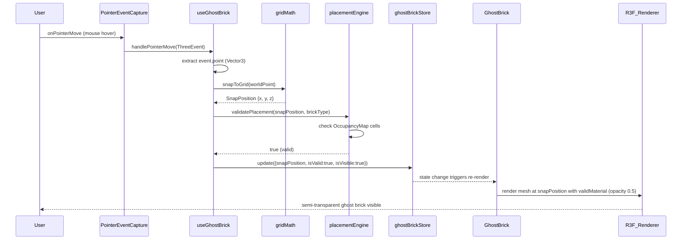
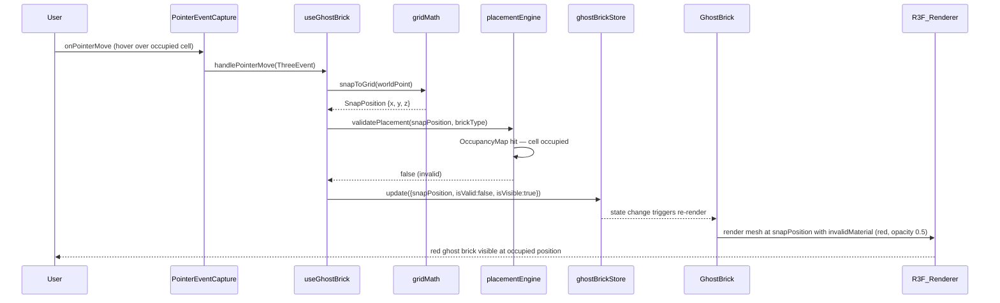
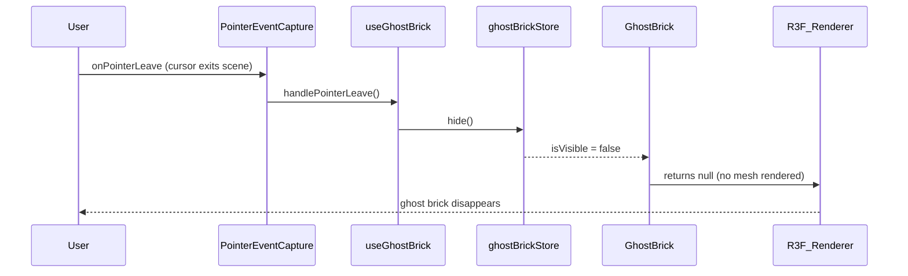
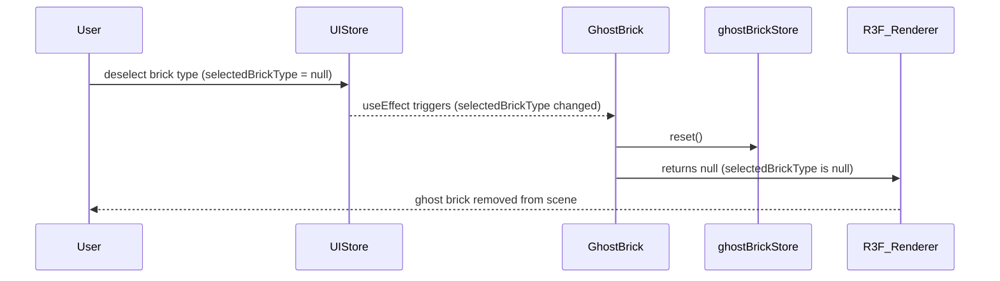

# Low-Level Design: FR-UI-003 — Ghost Brick Placement Preview

**Feature:** Implement ghost brick placement preview with valid/invalid position indication
**FR-ID:** FR-UI-003
**Issue:** [#25](https://github.com/sreenivasmrpivot/legobuilder/issues/25)
**Author:** Design Agent (Spectra Framework)
**Status:** Draft — Awaiting Gate 6a Design Review
**Dependencies:** FR-BRICK-001 (#10), FR-SCENE-003 (#9), FR-UI-002 (#24)

---

## Table of Contents

1. [Overview](#1-overview)
2. [Component Architecture](#2-component-architecture)
3. [Data Models](#3-data-models)
4. [State Management](#4-state-management)
5. [Interfaces & Contracts](#5-interfaces--contracts)
6. [Sequence Diagrams](#6-sequence-diagrams)
7. [Error Handling Strategy](#7-error-handling-strategy)
8. [Performance Design](#8-performance-design)
9. [Security Considerations](#9-security-considerations)
10. [Accessibility](#10-accessibility)
11. [Test Design Mapping](#11-test-design-mapping)
12. [Open Questions](#12-open-questions)

---

## 1. Overview

### 1.1 Purpose

FR-UI-003 introduces a **ghost brick** — a semi-transparent Three.js mesh that follows the user's cursor in real-time, snapping to valid grid positions and providing immediate visual feedback on placement validity:

- **Valid position** → semi-transparent mesh using the active brick color (opacity 0.5)
- **Invalid position** (occupied) → red mesh (opacity 0.5) indicating rejection

The ghost brick must update at ≥ 60 FPS and must not interfere with BVH raycasting used by the scene's collision detection.

### 1.2 Scope

| In Scope | Out of Scope |
|---|---|
| Ghost mesh creation and lifecycle | Actual brick placement (FR-UI-002) |
| Real-time pointer-move position update | Multi-brick ghost preview |
| Valid/invalid material switching | Ghost brick rotation preview |
| BVH raycast exclusion | Undo/redo of ghost state |
| Integration with `placementEngine.validatePlacement()` | Server-side validation |
| Performance budget enforcement (≤ 16.7 ms/frame) | Mobile touch events |

### 1.3 Architecture Context

LegoBuilder is a **pure client-side SPA** built with:
- **React 18** + **React Three Fiber (R3F) v8** for 3D rendering
- **Three.js r160** as the underlying WebGL engine
- **Zustand** for global state management
- **TypeScript** throughout
- No backend API — all logic runs in the browser

The ghost brick lives entirely within the R3F `<Canvas>` scene tree and is managed by a dedicated React component (`GhostBrick`) and a Zustand slice (`ghostBrickStore`).

---

## 2. Component Architecture

### 2.1 Component Tree

```
App
└── Viewport (R3F Canvas)
    ├── Scene
    │   ├── Baseplate
    │   ├── GridOverlay
    │   ├── BrickInstances          ← existing placed bricks
    │   ├── GhostBrick              ← NEW: FR-UI-003
    │   └── PointerEventCapture    ← NEW: FR-UI-003 (invisible plane)
    └── CameraControls
```

### 2.2 New Components

#### 2.2.1 `GhostBrick` Component

**File:** `src/components/3d/GhostBrick.tsx`

**Responsibility:** Renders the ghost mesh at the current snap position with the correct material (valid or invalid). Mounts only when a brick type is selected.

**Props:**
```typescript
interface GhostBrickProps {
  // No external props — reads entirely from ghostBrickStore and uiStore
}
```

**Internal behavior:**
- Reads `ghostBrickStore.snapPosition`, `ghostBrickStore.isVisible`, `ghostBrickStore.isValid`
- Reads `uiStore.selectedBrickType` to determine geometry dimensions
- Renders a `<mesh>` with `raycast={() => null}` to exclude from BVH
- Switches between `validMaterial` and `invalidMaterial` based on `isValid`
- Returns `null` when `isVisible === false` or `selectedBrickType === null`

**Material definitions (module-level constants):**
```typescript
// Valid: semi-transparent active color — color injected at render time
const validMaterial = new THREE.MeshStandardMaterial({
  transparent: true,
  opacity: 0.5,
  depthWrite: false,   // prevents z-fighting with placed bricks
});

// Invalid: red semi-transparent
const invalidMaterial = new THREE.MeshStandardMaterial({
  color: 0xff2222,
  transparent: true,
  opacity: 0.5,
  depthWrite: false,
});
```

**Geometry:**
- Uses `THREE.BoxGeometry` sized to the selected brick's stud dimensions
- Brick dimensions sourced from `brickCatalog[selectedBrickType].dimensions`
- Geometry is memoized via `useMemo` keyed on `selectedBrickType`

#### 2.2.2 `PointerEventCapture` Component

**File:** `src/components/3d/PointerEventCapture.tsx`

**Responsibility:** An invisible plane mesh that captures `onPointerMove` events across the entire scene floor. Delegates to `useGhostBrick` hook for position calculation.

**Props:**
```typescript
interface PointerEventCaptureProps {
  planeSize?: number;  // default: 200 (studs)
}
```

**Behavior:**
- Renders a large invisible `<mesh>` at y=0 (baseplate level)
- Material: `MeshBasicMaterial({ visible: false })`
- Handles `onPointerMove`, `onPointerLeave` R3F events
- Does NOT use `raycast: () => null` — it must receive pointer events
- On `onPointerLeave`: dispatches `ghostBrickStore.hide()`

### 2.3 New Hook

#### `useGhostBrick` Hook

**File:** `src/hooks/useGhostBrick.ts`

**Responsibility:** Encapsulates all ghost brick update logic. Called by `PointerEventCapture`.

**Signature:**
```typescript
function useGhostBrick(): {
  handlePointerMove: (event: ThreeEvent<PointerEvent>) => void;
  handlePointerLeave: () => void;
}
```

**Internal logic:**
1. Receives R3F `ThreeEvent<PointerEvent>` from `PointerEventCapture`
2. Extracts world-space intersection point: `event.point` (THREE.Vector3)
3. Calls `gridMath.snapToGrid(point)` → `SnapPosition`
4. Calls `placementEngine.validatePlacement(snapPosition, selectedBrickType)` → `boolean`
5. Dispatches `ghostBrickStore.update({ snapPosition, isValid, isVisible: true })`
6. All steps execute synchronously within the pointer event handler

**Performance contract:** Steps 2–5 must complete in < 1 ms to stay within the 16.7 ms frame budget.

### 2.4 Modified Components

#### `Viewport` Component

**File:** `src/components/3d/Viewport.tsx` (existing)

**Changes:**
- Import and render `<GhostBrick />` inside the R3F `<Canvas>` scene
- Import and render `<PointerEventCapture />` inside the R3F `<Canvas>` scene
- No other changes to Viewport

---

## 3. Data Models

### 3.1 Ghost Brick State

```typescript
// src/stores/ghostBrickStore.ts

interface SnapPosition {
  x: number;   // grid column (integer stud units)
  y: number;   // layer height (integer stud units)
  z: number;   // grid row (integer stud units)
}

interface GhostBrickState {
  /** Whether the ghost brick is currently visible */
  isVisible: boolean;

  /** Whether the current snap position is a valid placement */
  isValid: boolean;

  /** Current snapped grid position in stud units */
  snapPosition: SnapPosition;

  // Actions
  update: (payload: { snapPosition: SnapPosition; isValid: boolean; isVisible: boolean }) => void;
  hide: () => void;
  reset: () => void;
}
```

### 3.2 Brick Catalog Entry (existing, referenced)

```typescript
// src/data/brickCatalog.ts (existing)
interface BrickCatalogEntry {
  id: string;
  name: string;
  dimensions: {
    studsX: number;   // width in studs
    studsY: number;   // height in plate units
    studsZ: number;   // depth in studs
  };
  // ... other fields
}
```

### 3.3 World-Space to Grid Coordinate Mapping

The `gridMath.snapToGrid()` function maps a continuous Three.js world-space `Vector3` to discrete stud-unit grid coordinates:

```typescript
// src/utils/gridMath.ts (existing, extended)

const STUD_SIZE = 1.6;   // world units per stud (existing constant)
const PLATE_HEIGHT = 0.64; // world units per plate height

function snapToGrid(worldPoint: THREE.Vector3): SnapPosition {
  return {
    x: Math.round(worldPoint.x / STUD_SIZE),
    y: Math.round(worldPoint.y / PLATE_HEIGHT),
    z: Math.round(worldPoint.z / STUD_SIZE),
  };
}

function gridToWorld(snap: SnapPosition): THREE.Vector3 {
  return new THREE.Vector3(
    snap.x * STUD_SIZE,
    snap.y * PLATE_HEIGHT,
    snap.z * STUD_SIZE
  );
}
```

### 3.4 Placement Validation Contract (existing, referenced)

```typescript
// src/engine/placementEngine.ts (existing)
function validatePlacement(
  position: SnapPosition,
  brickType: string
): boolean;
// Returns true if all cells required by brickType at position are unoccupied
// Uses OccupancyMap for O(1) per-cell lookup
// Time complexity: O(studsX × studsZ) — bounded by brick footprint
```

---

## 4. State Management

### 4.1 `ghostBrickStore` Zustand Slice

**File:** `src/stores/ghostBrickStore.ts`

```typescript
import { create } from 'zustand';

const INITIAL_SNAP: SnapPosition = { x: 0, y: 0, z: 0 };

export const useGhostBrickStore = create<GhostBrickState>((set) => ({
  isVisible: false,
  isValid: true,
  snapPosition: INITIAL_SNAP,

  update: ({ snapPosition, isValid, isVisible }) =>
    set({ snapPosition, isValid, isVisible }),

  hide: () =>
    set({ isVisible: false }),

  reset: () =>
    set({ isVisible: false, isValid: true, snapPosition: INITIAL_SNAP }),
}));
```

**Design decisions:**
- **No subscriptions / middleware** — ghost brick state is ephemeral and high-frequency; no persistence, no devtools overhead
- **Flat state** — avoids nested object mutation overhead on every pointer move
- **`hide()` action** — separate from `update()` to avoid passing `isVisible: false` with stale position data
- **`reset()` action** — called when brick type selection is cleared (integrates with `uiStore`)

### 4.2 Store Integration Map

```
uiStore.selectedBrickType
    │
    ├──► GhostBrick (reads geometry dimensions)
    └──► useGhostBrick hook (reads for validatePlacement call)

ghostBrickStore
    │
    ├──► GhostBrick (reads isVisible, isValid, snapPosition)
    └──► useGhostBrick hook (writes via update/hide)

sceneStore.occupancyMap
    └──► placementEngine.validatePlacement() (reads occupancy)
```

### 4.3 Lifecycle Integration with `uiStore`

When `uiStore.selectedBrickType` changes to `null` (user deselects a brick):
- `GhostBrick` component returns `null` (no render)
- `ghostBrickStore.reset()` is called via a `useEffect` in `GhostBrick`

---

## 5. Interfaces & Contracts

### 5.1 `GhostBrick` Component Interface

```typescript
// src/components/3d/GhostBrick.tsx

import { useGhostBrickStore } from '@/stores/ghostBrickStore';
import { useUIStore } from '@/stores/uiStore';
import { brickCatalog } from '@/data/brickCatalog';
import { STUD_SIZE, PLATE_HEIGHT } from '@/utils/gridMath';
import * as THREE from 'three';
import { useEffect, useMemo } from 'react';

export function GhostBrick(): JSX.Element | null {
  const selectedBrickType = useUIStore((s) => s.selectedBrickType);
  const { isVisible, isValid, snapPosition, reset } = useGhostBrickStore();

  // Reset ghost state when brick type is deselected
  useEffect(() => {
    if (!selectedBrickType) reset();
  }, [selectedBrickType, reset]);

  // Memoize geometry per brick type
  const geometry = useMemo(() => {
    if (!selectedBrickType) return null;
    const entry = brickCatalog[selectedBrickType];
    return new THREE.BoxGeometry(
      entry.dimensions.studsX * STUD_SIZE,
      entry.dimensions.studsY * PLATE_HEIGHT,
      entry.dimensions.studsZ * STUD_SIZE
    );
  }, [selectedBrickType]);

  if (!isVisible || !selectedBrickType || !geometry) return null;

  const worldPos = [
    snapPosition.x * STUD_SIZE,
    snapPosition.y * PLATE_HEIGHT,
    snapPosition.z * STUD_SIZE,
  ] as [number, number, number];

  return (
    <mesh
      position={worldPos}
      geometry={geometry}
      raycast={() => null}          // BVH exclusion
      renderOrder={1}               // render on top of placed bricks
    >
      <meshStandardMaterial
        color={isValid ? undefined : 0xff2222}
        transparent
        opacity={0.5}
        depthWrite={false}
      />
    </mesh>
  );
}
```

### 5.2 `PointerEventCapture` Component Interface

```typescript
// src/components/3d/PointerEventCapture.tsx

import { ThreeEvent } from '@react-three/fiber';
import { useGhostBrick } from '@/hooks/useGhostBrick';

export function PointerEventCapture({ planeSize = 200 }: PointerEventCaptureProps) {
  const { handlePointerMove, handlePointerLeave } = useGhostBrick();

  return (
    <mesh
      rotation={[-Math.PI / 2, 0, 0]}   // horizontal plane
      position={[0, 0, 0]}
      onPointerMove={handlePointerMove}
      onPointerLeave={handlePointerLeave}
    >
      <planeGeometry args={[planeSize, planeSize]} />
      <meshBasicMaterial visible={false} />
    </mesh>
  );
}
```

### 5.3 `useGhostBrick` Hook Interface

```typescript
// src/hooks/useGhostBrick.ts

import { useCallback } from 'react';
import { ThreeEvent } from '@react-three/fiber';
import { useGhostBrickStore } from '@/stores/ghostBrickStore';
import { useUIStore } from '@/stores/uiStore';
import { snapToGrid } from '@/utils/gridMath';
import { validatePlacement } from '@/engine/placementEngine';

export function useGhostBrick() {
  const { update, hide } = useGhostBrickStore();
  const selectedBrickType = useUIStore((s) => s.selectedBrickType);

  const handlePointerMove = useCallback(
    (event: ThreeEvent<PointerEvent>) => {
      if (!selectedBrickType) return;
      if (!brickCatalog[selectedBrickType]) return;      // guard: unknown type

      const worldPoint = event.point;
      if (!isFinite(worldPoint.x) || !isFinite(worldPoint.z)) return; // guard: NaN

      const snapPosition = snapToGrid(worldPoint);

      let isValid = false;
      try {
        isValid = validatePlacement(snapPosition, selectedBrickType);
      } catch (err) {
        console.error('[GhostBrick] validatePlacement error:', err);
      }

      update({ snapPosition, isValid, isVisible: true });
    },
    [selectedBrickType, update]
  );

  const handlePointerLeave = useCallback(() => {
    hide();
  }, [hide]);

  return { handlePointerMove, handlePointerLeave };
}
```

### 5.4 `gridMath` Extensions

```typescript
// src/utils/gridMath.ts — additions to existing file

export const STUD_SIZE = 1.6;      // world units per stud
export const PLATE_HEIGHT = 0.64;  // world units per plate height

export function snapToGrid(worldPoint: THREE.Vector3): SnapPosition {
  return {
    x: Math.round(worldPoint.x / STUD_SIZE),
    y: Math.max(0, Math.round(worldPoint.y / PLATE_HEIGHT)),  // clamp to y >= 0
    z: Math.round(worldPoint.z / STUD_SIZE),
  };
}

export function gridToWorld(snap: SnapPosition): THREE.Vector3 {
  return new THREE.Vector3(
    snap.x * STUD_SIZE,
    snap.y * PLATE_HEIGHT,
    snap.z * STUD_SIZE
  );
}
```

---

## 6. Sequence Diagrams

### 6.1 Happy Path — Valid Placement Preview



### 6.2 Invalid Placement — Occupied Position



### 6.3 Pointer Leave — Ghost Brick Hidden



### 6.4 Brick Type Deselection — Ghost Reset



---

## 7. Error Handling Strategy

### 7.1 Error Scenarios

| Scenario | Detection | Handling | User Impact |
|---|---|---|---|
| `selectedBrickType` not found in `brickCatalog` | `brickCatalog[type] === undefined` | `useGhostBrick` early-returns; ghost stays hidden | No ghost shown; silent failure |
| `event.point` is `NaN` or `Infinity` | `isFinite()` check in `snapToGrid` | Clamp to `{x:0, y:0, z:0}`; log warning | Ghost snaps to origin; no crash |
| `validatePlacement` throws | try/catch in `useGhostBrick` | Treat as invalid (show red ghost); log error | Red ghost shown; no crash |
| `snapPosition.y < 0` (below baseplate) | `Math.max(0, ...)` in `snapToGrid` | Clamp y to 0 | Ghost stays at baseplate level |
| Geometry creation fails (OOM) | `useMemo` error boundary | React Error Boundary catches; ghost hidden | No ghost; scene continues |

### 7.2 Defensive Guards in `useGhostBrick`

```typescript
const handlePointerMove = useCallback(
  (event: ThreeEvent<PointerEvent>) => {
    if (!selectedBrickType) return;                    // guard: no selection
    if (!brickCatalog[selectedBrickType]) return;      // guard: unknown type

    const worldPoint = event.point;
    if (!isFinite(worldPoint.x) || !isFinite(worldPoint.z)) return; // guard: NaN

    const snapPosition = snapToGrid(worldPoint);

    let isValid = false;
    try {
      isValid = validatePlacement(snapPosition, selectedBrickType);
    } catch (err) {
      console.error('[GhostBrick] validatePlacement error:', err);
    }

    update({ snapPosition, isValid, isVisible: true });
  },
  [selectedBrickType, update]
);
```

### 7.3 React Error Boundary

The `GhostBrick` component is wrapped in a lightweight `GhostBrickErrorBoundary` that catches geometry/material errors and renders `null` (no ghost) rather than crashing the scene:

```typescript
// src/components/3d/GhostBrickErrorBoundary.tsx
class GhostBrickErrorBoundary extends React.Component<...> {
  state = { hasError: false };
  static getDerivedStateFromError() { return { hasError: true }; }
  componentDidCatch(err: Error) { console.error('[GhostBrick] render error:', err); }
  render() {
    if (this.state.hasError) return null;
    return this.props.children;
  }
}
```

---

## 8. Performance Design

### 8.1 Performance Budget

| Operation | Budget | Strategy |
|---|---|---|
| Full ghost update cycle (pointer → render) | ≤ 16.7 ms | Synchronous path; no async/await |
| `snapToGrid()` | < 0.1 ms | Pure math, no allocations |
| `validatePlacement()` | < 1 ms | O(studsX × studsZ) OccupancyMap lookup |
| `ghostBrickStore.update()` | < 0.1 ms | Flat Zustand set, no middleware |
| `GhostBrick` re-render | < 2 ms | Single mesh, no children, memoized geometry |
| Target frame rate | ≥ 60 FPS | All above budgets combined |

### 8.2 Optimization Techniques

1. **`raycast: () => null`** — Ghost mesh is excluded from Three.js raycasting, preventing it from interfering with BVH intersection tests on every frame.

2. **`depthWrite: false`** — Prevents the ghost mesh from writing to the depth buffer, avoiding z-fighting artifacts with placed bricks at the same position.

3. **`renderOrder={1}`** — Ensures ghost renders after placed bricks, maintaining correct visual layering without sorting overhead.

4. **Memoized geometry** — `useMemo` keyed on `selectedBrickType` ensures `BoxGeometry` is created once per brick type, not on every pointer move.

5. **Flat Zustand state** — No nested objects; `set()` replaces three primitive values per update, minimizing React reconciliation work.

6. **No `useFrame` polling** — Ghost position is updated only on `onPointerMove` events (event-driven), not on every animation frame. This avoids unnecessary work when the cursor is stationary.

7. **`useCallback` on handlers** — Prevents `handlePointerMove` and `handlePointerLeave` from being recreated on every render of `PointerEventCapture`.

8. **Material reuse** — `validMaterial` and `invalidMaterial` are module-level constants (not created per-render). Only the `color` property is updated via JSX prop.

### 8.3 Memory Management

- Ghost mesh geometry is disposed in `GhostBrick`'s cleanup `useEffect` when `selectedBrickType` changes:
  ```typescript
  useEffect(() => {
    return () => { geometry?.dispose(); };
  }, [geometry]);
  ```
- Materials are module-level constants and are never disposed (they persist for the app lifetime).

---

## 9. Security Considerations

| Concern | Assessment | Mitigation |
|---|---|---|
| XSS via brick type string | `selectedBrickType` is an enum-like string from `brickCatalog` keys | Validate against `brickCatalog` keys before use; never inject into DOM innerHTML |
| Prototype pollution via `snapPosition` | `snapToGrid` returns a plain object literal | No `Object.assign` from untrusted input; values are `Math.round()` outputs |
| Denial of service via rapid pointer events | High-frequency `onPointerMove` events | R3F batches pointer events per frame; no additional throttling needed |
| WebGL shader injection | Three.js `MeshStandardMaterial` uses built-in shaders | No custom shader strings; no user-controlled shader code |
| State corruption via concurrent updates | Zustand `set()` is synchronous | No race conditions; pointer events are processed sequentially in the JS event loop |

This feature has **no network calls**, **no user-generated content rendered as HTML**, and **no authentication surface**. Security risk is minimal.

---

## 10. Accessibility

| Requirement | Implementation |
|---|---|
| Color-only distinction (valid=blue, invalid=red) | Ghost brick shape and position provide spatial context beyond color; red is a widely understood rejection signal |
| Screen reader announcement | Ghost brick is a 3D WebGL element — not in the DOM accessibility tree. No ARIA needed for the mesh itself. |
| Keyboard users | Ghost brick is pointer-driven; keyboard-only users rely on FR-UI-002 click-to-place flow. Ghost is a visual enhancement only. |
| Reduced motion | Ghost brick position updates are discrete snaps (not animations); no CSS transitions or tweens. Compliant with `prefers-reduced-motion`. |
| High contrast mode | Ghost brick uses opacity-based transparency; high contrast OS settings do not affect WebGL canvas rendering. |

**WCAG 2.1 AA compliance note:** The ghost brick is a supplementary visual aid. The primary placement action (click) is accessible via keyboard. The color distinction (valid/invalid) is reinforced by the spatial context (position snapping) and does not rely solely on color.

---

## 11. Test Design Mapping

### 11.1 Test Cases from Issue

| Test ID | Description | Acceptance Criterion |
|---|---|---|
| T-FE-UI-003-01 | Ghost brick appears on hover over valid position | Semi-transparent mesh visible at snap position when brick type selected |
| T-FE-UI-003-02 | Ghost brick turns red on invalid (occupied) position | Red mesh visible when `validatePlacement` returns false |

### 11.2 Additional Test Cases (Design-Derived)

| Test ID | Description | Type |
|---|---|---|
| T-FE-UI-003-03 | Ghost brick hidden when pointer leaves scene | Unit (hook) |
| T-FE-UI-003-04 | Ghost brick hidden when no brick type selected | Unit (component) |
| T-FE-UI-003-05 | Ghost mesh has `raycast: () => null` (BVH exclusion) | Unit (component) |
| T-FE-UI-003-06 | `snapToGrid` clamps y to 0 for negative world y | Unit (utility) |
| T-FE-UI-003-07 | Ghost position updates at ≥ 60 FPS under continuous pointer move | Performance (Playwright) |
| T-FE-UI-003-08 | Geometry disposed on brick type change | Unit (hook/component) |

### 11.3 Test Implementation Notes

**Unit tests (Vitest + React Testing Library + @react-three/test-renderer):**
- Mock `ghostBrickStore` with `vi.mock`
- Mock `placementEngine.validatePlacement` to return `true`/`false`
- Assert mesh `raycast` prop is `() => null`
- Assert material `color` and `opacity` values

**Performance test (Playwright):**
- Simulate rapid `mousemove` events across the canvas
- Measure frame time via `requestAnimationFrame` timestamps
- Assert p95 frame time ≤ 16.7 ms over 300 frames

---

## 12. Open Questions

| # | Question | Impact | Owner |
|---|---|---|---|
| OQ-1 | Does `PointerEventCapture` plane need to match the exact baseplate dimensions, or should it be larger to capture hover near edges? | Affects `planeSize` default value | Frontend team |
| OQ-2 | Should the ghost brick show at the correct layer height (y > 0) when hovering over existing bricks, or always at y=0? | Affects `snapToGrid` y-axis logic and `PointerEventCapture` plane placement | Product / Frontend team |
| OQ-3 | Is the active brick color sourced from `uiStore.selectedColor` or from `brickCatalog[type].defaultColor`? | Affects `validMaterial` color assignment in `GhostBrick` | Frontend team |
| OQ-4 | Should ghost brick be visible during camera orbit (OrbitControls drag)? | May require suppressing ghost during camera drag events | Frontend team |

---

## Appendix A: File Manifest

| File | Status | Description |
|---|---|---|
| `src/components/3d/GhostBrick.tsx` | **NEW** | Ghost mesh component |
| `src/components/3d/GhostBrickErrorBoundary.tsx` | **NEW** | Error boundary for ghost mesh |
| `src/components/3d/PointerEventCapture.tsx` | **NEW** | Invisible pointer capture plane |
| `src/hooks/useGhostBrick.ts` | **NEW** | Ghost brick update logic hook |
| `src/stores/ghostBrickStore.ts` | **NEW** | Zustand slice for ghost state |
| `src/utils/gridMath.ts` | **MODIFIED** | Add `snapToGrid`, `gridToWorld`, constants |
| `src/components/3d/Viewport.tsx` | **MODIFIED** | Mount `GhostBrick` + `PointerEventCapture` |

---

## Appendix B: Dependency Graph

```
GhostBrick
  ├── ghostBrickStore (reads: isVisible, isValid, snapPosition)
  ├── uiStore (reads: selectedBrickType)
  ├── brickCatalog (reads: dimensions)
  └── gridMath (reads: STUD_SIZE, PLATE_HEIGHT)

PointerEventCapture
  └── useGhostBrick (delegates all logic)

useGhostBrick
  ├── ghostBrickStore (writes: update, hide)
  ├── uiStore (reads: selectedBrickType)
  ├── gridMath (calls: snapToGrid)
  └── placementEngine (calls: validatePlacement)

ghostBrickStore
  └── (no dependencies — pure Zustand slice)
```

---

*Document generated by Spectra Framework — Design Agent*
*FR-ID: FR-UI-003 | Issue: #25 | Branch: feature/25-fr-ui-003-design*
