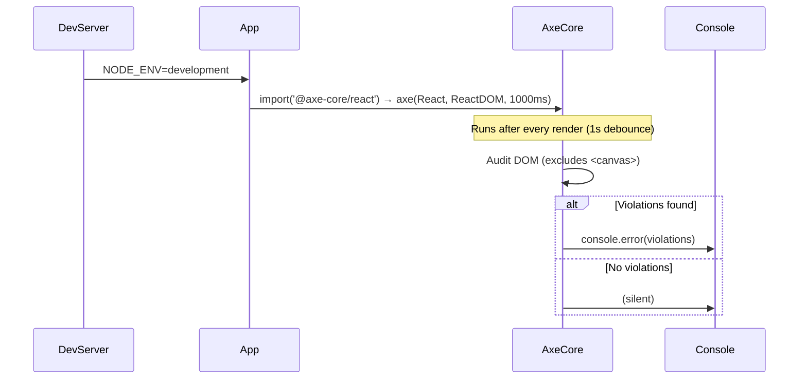

# Low-Level Design: NFR-A11Y-001 — Keyboard Navigation for Toolbar & Palette

**FR-ID:** NFR-A11Y-001  
**Issue:** #33  
**Title:** Ensure all toolbar and palette actions are keyboard-navigable (Tab, Enter, arrow keys)  
**Status:** Draft — Pending Design Review (Gate 6a)  
**Date:** 2026-04-12  
**Author:** Spectra Design Agent  

---

## 1. Overview

This document provides the low-level design for implementing WCAG 2.1 AA-compliant keyboard navigation across all toolbar buttons and the brick palette in the LegoBuilder React application. The feature ensures that every interactive UI element is reachable and operable via keyboard alone (Tab, Shift+Tab, Enter, Space, and arrow keys), and that zero axe-core violations are reported on non-3D UI elements.

### 1.1 Scope

| Component | Keyboard Behaviour Required |
|-----------|-----------------------------|
| `Toolbar` | Tab through all 7 buttons in DOM order; Enter/Space activates |
| `BrickPalette` | Arrow keys navigate between brick types; Enter/Space selects |
| `App` (root) | axe-core audit in dev; jest-axe in tests |
| `<canvas>` (Three.js) | **Excluded** from a11y audit — inherently inaccessible |

### 1.2 Dependencies

- **#23 FR-UI-001** — Toolbar component must exist before keyboard attributes are added.
- **#24 FR-UI-002** — BrickPalette component must exist before arrow-key handler is added.

---

## 2. Component Architecture

### 2.1 Module Map

```
src/
├── components/
│   ├── Toolbar/
│   │   ├── Toolbar.tsx          ← Add aria-label, ensure <button> elements
│   │   └── Toolbar.test.tsx     ← jest-axe + keyboard interaction tests
│   ├── BrickPalette/
│   │   ├── BrickPalette.tsx     ← Add onKeyDown arrow-key handler + roving tabIndex
│   │   └── BrickPalette.test.tsx← jest-axe + arrow-key navigation tests
│   └── App/
│       └── App.tsx              ← Mount @axe-core/react in development mode
├── hooks/
│   └── useRovingTabIndex.ts     ← NEW: reusable roving tabIndex hook
└── utils/
    └── a11y.ts                  ← NEW: shared a11y helpers (key constants, etc.)
```

### 2.2 Component Interfaces

#### `Toolbar` Component

```typescript
// src/components/Toolbar/Toolbar.tsx
interface ToolbarProps {
  onAddBrick: () => void;
  onDeleteBrick: () => void;
  onUndo: () => void;
  onRedo: () => void;
  onSave: () => void;
  onLoad: () => void;
  onExport: () => void;
}

// Accessibility contract:
// - Each action maps to a native <button> element
// - aria-label describes the action (e.g., aria-label="Add Brick")
// - No tabIndex manipulation — natural DOM order provides logical tab sequence
// - role="toolbar" on the container with aria-label="Editor Toolbar"
```

#### `BrickPalette` Component

```typescript
// src/components/BrickPalette/BrickPalette.tsx
interface BrickPaletteProps {
  brickTypes: BrickType[];
  selectedBrickType: string;
  onSelectBrickType: (type: string) => void;
}

interface BrickType {
  id: string;
  label: string;
  color: string;
  dimensions: { width: number; height: number; depth: number };
}

// Accessibility contract:
// - Container: role="listbox" aria-label="Brick Types" aria-orientation="vertical"
// - Each item: role="option" aria-selected={isSelected} tabIndex={isActive ? 0 : -1}
// - Roving tabIndex pattern: only one item in tab sequence at a time
// - Arrow keys move focus; Enter/Space selects
```

#### `useRovingTabIndex` Hook

```typescript
// src/hooks/useRovingTabIndex.ts
interface UseRovingTabIndexOptions {
  itemCount: number;
  orientation?: 'horizontal' | 'vertical' | 'both';
  wrap?: boolean; // wrap around at boundaries (default: true)
}

interface UseRovingTabIndexReturn {
  activeIndex: number;
  setActiveIndex: (index: number) => void;
  getItemProps: (index: number) => {
    tabIndex: 0 | -1;
    onKeyDown: React.KeyboardEventHandler;
    'data-active': boolean;
  };
}

export function useRovingTabIndex(
  options: UseRovingTabIndexOptions
): UseRovingTabIndexReturn;
```

---

## 3. Detailed Design

### 3.1 Toolbar — Keyboard Navigation

**Strategy:** Use native `<button>` elements in DOM order. No `tabIndex` manipulation is needed because the browser's default tab order follows DOM order.

**ARIA Roles & Attributes:**

| Element | Role | Attributes |
|---------|------|------------|
| `<div>` container | `toolbar` | `aria-label="Editor Toolbar"` |
| Each `<button>` | `button` (implicit) | `aria-label="<Action Name>"`, `type="button"` |

**Tab Order (DOM order = logical order):**

```
[Add Brick] → [Delete Brick] → [Undo] → [Redo] → [Save] → [Load] → [Export]
  Tab 1          Tab 2         Tab 3    Tab 4    Tab 5    Tab 6    Tab 7
```

**Activation:** Enter and Space both trigger `onClick` natively on `<button>` elements — no extra handler needed.

**Focus Visibility:** CSS `:focus-visible` outline must be present. Minimum contrast ratio 3:1 against adjacent colours (WCAG 2.1 SC 1.4.11).

```css
/* Toolbar.module.css */
.toolbarButton:focus-visible {
  outline: 2px solid #005fcc;
  outline-offset: 2px;
  border-radius: 4px;
}
```

### 3.2 BrickPalette — Arrow Key Navigation (Roving tabIndex)

**Strategy:** Implement the [ARIA Listbox pattern](https://www.w3.org/WAI/ARIA/apg/patterns/listbox/) with a roving `tabIndex`. Only the currently active item has `tabIndex={0}`; all others have `tabIndex={-1}`.

**Key Bindings:**

| Key | Action |
|-----|--------|
| `ArrowDown` | Move focus to next brick type (wraps to first) |
| `ArrowUp` | Move focus to previous brick type (wraps to last) |
| `Home` | Move focus to first brick type |
| `End` | Move focus to last brick type |
| `Enter` / `Space` | Select focused brick type |
| `Tab` | Exit palette, move to next focusable element |

**`onKeyDown` Handler Logic:**

```typescript
const handleKeyDown = (e: React.KeyboardEvent, index: number) => {
  const count = brickTypes.length;
  switch (e.key) {
    case 'ArrowDown':
      e.preventDefault();
      setActiveIndex((index + 1) % count);
      break;
    case 'ArrowUp':
      e.preventDefault();
      setActiveIndex((index - 1 + count) % count);
      break;
    case 'Home':
      e.preventDefault();
      setActiveIndex(0);
      break;
    case 'End':
      e.preventDefault();
      setActiveIndex(count - 1);
      break;
    case 'Enter':
    case ' ':
      e.preventDefault();
      onSelectBrickType(brickTypes[index].id);
      break;
    default:
      break;
  }
};
```

**Focus Management:** When `activeIndex` changes, call `.focus()` on the newly active item's DOM node via a `useEffect` + `useRef` array.

```typescript
const itemRefs = useRef<(HTMLDivElement | null)[]>([]);

useEffect(() => {
  itemRefs.current[activeIndex]?.focus();
}, [activeIndex]);
```

### 3.3 axe-core Integration

#### Development Mode (`@axe-core/react`)

Mount in `App.tsx` only when `process.env.NODE_ENV === 'development'`:

```typescript
// src/components/App/App.tsx
import React from 'react';
import ReactDOM from 'react-dom';

if (process.env.NODE_ENV === 'development') {
  import('@axe-core/react').then(({ default: axe }) => {
    axe(React, ReactDOM, 1000);
  });
}
```

This logs WCAG violations to the browser console during development. The 3D `<canvas>` element is excluded by default because axe-core does not audit canvas content.

#### Test Mode (`jest-axe`)

Each component test file includes an axe audit:

```typescript
// src/components/Toolbar/Toolbar.test.tsx
import { axe, toHaveNoViolations } from 'jest-axe';
import { render } from '@testing-library/react';
import Toolbar from './Toolbar';

expect.extend(toHaveNoViolations);

test('Toolbar has no axe violations', async () => {
  const { container } = render(<Toolbar {...mockProps} />);
  const results = await axe(container);
  expect(results).toHaveNoViolations();
});
```

---

## 4. Data Models

This NFR does not introduce new data entities. It augments existing component state:

### 4.1 BrickPalette State Extension

```typescript
// Existing state (from FR-UI-002 LLD)
const [selectedBrickType, setSelectedBrickType] = useState<string>(brickTypes[0].id);

// NEW: keyboard focus tracking (local UI state, not persisted)
const [activeIndex, setActiveIndex] = useState<number>(0);
```

### 4.2 No New API Endpoints

Keyboard navigation is a pure client-side concern. No backend API changes are required.

---

## 5. Sequence Diagrams

### 5.1 Tab Navigation Through Toolbar

```mermaid
sequenceDiagram
    participant User
    participant Browser
    participant Toolbar

    User->>Browser: Press Tab
    Browser->>Toolbar: Focus first <button> (Add Brick)
    Note over Toolbar: :focus-visible outline appears
    User->>Browser: Press Tab
    Browser->>Toolbar: Focus second <button> (Delete Brick)
    User->>Browser: Press Enter
    Toolbar->>Toolbar: onClick() fires → onDeleteBrick()
    Note over Toolbar: Action executes; focus remains on button
```

### 5.2 Arrow Key Navigation in BrickPalette

```mermaid
sequenceDiagram
    participant User
    participant BrickPalette
    participant useRovingTabIndex

    User->>BrickPalette: Tab into palette (activeIndex=0 gets focus)
    User->>BrickPalette: Press ArrowDown
    BrickPalette->>useRovingTabIndex: setActiveIndex(1)
    useRovingTabIndex->>BrickPalette: tabIndex[0]=-1, tabIndex[1]=0
    BrickPalette->>BrickPalette: itemRefs[1].focus()
    Note over BrickPalette: Focus moves to second brick type
    User->>BrickPalette: Press Enter
    BrickPalette->>BrickPalette: onSelectBrickType(brickTypes[1].id)
    Note over BrickPalette: Brick type selected; aria-selected updates
```

### 5.3 axe-core Audit Flow (Development)



---

## 6. Error Handling Strategy

| Scenario | Handling |
|----------|----------|
| `itemRefs.current[activeIndex]` is `null` | Guard with optional chaining (`?.focus()`); log warning in dev |
| `brickTypes` array is empty | `useRovingTabIndex` returns `activeIndex=0`; no keyboard events fire |
| `@axe-core/react` import fails (network/bundle issue) | Dynamic import wrapped in `.catch()`; failure is non-fatal, logged to console |
| `jest-axe` reports violations in CI | Test fails with descriptive violation list; PR blocked until fixed |
| Focus lost after brick selection | After `onSelectBrickType`, focus remains on the selected palette item (no focus reset) |

---

## 7. Security Considerations

| Concern | Assessment | Mitigation |
|---------|------------|------------|
| XSS via `aria-label` | Low risk — labels are static strings, not user input | No mitigation needed |
| `@axe-core/react` in production | Medium risk — adds bundle weight and console output | Conditional import: `NODE_ENV === 'development'` only |
| `tabIndex` injection | Not applicable — tabIndex values are 0 or -1, never user-controlled | N/A |
| Focus trapping | Not applicable — no modal dialogs in this feature | N/A |

---

## 8. Acceptance Criteria Mapping

| Acceptance Criterion | Design Element | Test ID |
|----------------------|---------------|----------|
| Tab through all 7 toolbar buttons in logical order | Native `<button>` DOM order; `role="toolbar"` | T-A11Y-A11Y-001-01 |
| Arrow keys move focus through brick types | `useRovingTabIndex` hook + `onKeyDown` handler | T-A11Y-A11Y-001-02 |
| Enter on focused button triggers action | Native `<button>` Enter activation | T-A11Y-A11Y-001-03 |
| Zero axe-core WCAG 2.1 AA violations on non-3D UI | `jest-axe` in component tests; `@axe-core/react` in dev | T-A11Y-A11Y-001-04 |

---

## 9. NFR Targets

| NFR | Target | Measurement |
|-----|--------|-------------|
| WCAG 2.1 AA compliance | 0 violations on non-3D elements | axe-core audit (automated) |
| Tab order correctness | 7 toolbar buttons in DOM order | Manual + automated test |
| Focus visibility | ≥ 3:1 contrast ratio for focus ring | Colour contrast analyser |
| Arrow key response time | < 16ms (one frame at 60fps) | React profiler |
| Test coverage | 100% of keyboard interaction paths | jest-axe + RTL |

---

## 10. Implementation Notes for Frontend Agent

1. **Do not add `tabIndex` to toolbar buttons** — native `<button>` elements are already in the tab sequence.
2. **Use `role="toolbar"` on the toolbar container** — this is an ARIA landmark that screen readers announce.
3. **The `useRovingTabIndex` hook** should be implemented as a standalone hook in `src/hooks/` so it can be reused by other list-like components (e.g., colour picker).
4. **`@axe-core/react` must not appear in the production bundle** — use a dynamic `import()` inside an `if (process.env.NODE_ENV === 'development')` guard.
5. **`jest-axe` must be added to `devDependencies`** — it is a test-only dependency.
6. **Focus ring CSS** must use `:focus-visible` (not `:focus`) to avoid showing outlines on mouse click.
7. **3D canvas exclusion** — axe-core automatically skips `<canvas>` elements; no explicit exclusion rule is needed.

---

## 11. File Change Summary

| File | Change Type | Description |
|------|-------------|-------------|
| `src/components/Toolbar/Toolbar.tsx` | Modify | Add `role="toolbar"`, `aria-label` on container and buttons |
| `src/components/Toolbar/Toolbar.module.css` | Modify | Add `:focus-visible` outline styles |
| `src/components/Toolbar/Toolbar.test.tsx` | Modify | Add `jest-axe` audit + keyboard interaction tests |
| `src/components/BrickPalette/BrickPalette.tsx` | Modify | Add `role="listbox"`, roving tabIndex, `onKeyDown` handler |
| `src/components/BrickPalette/BrickPalette.test.tsx` | Modify | Add `jest-axe` audit + arrow-key navigation tests |
| `src/components/App/App.tsx` | Modify | Mount `@axe-core/react` in development mode |
| `src/hooks/useRovingTabIndex.ts` | Create | Reusable roving tabIndex hook |
| `src/utils/a11y.ts` | Create | Key constants and shared a11y helpers |
| `package.json` | Modify | Add `jest-axe` to devDependencies; `@axe-core/react` to devDependencies |
