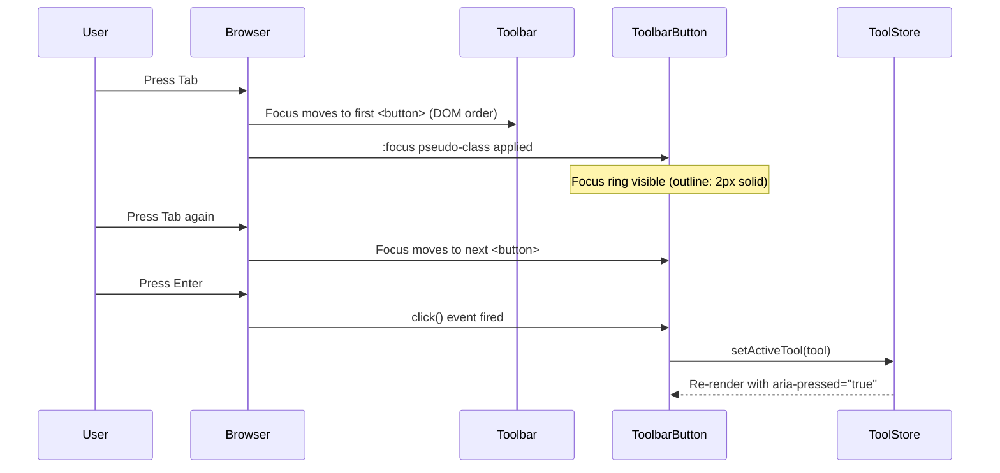
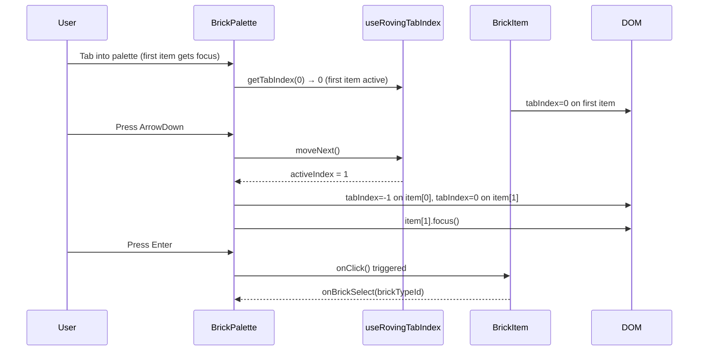
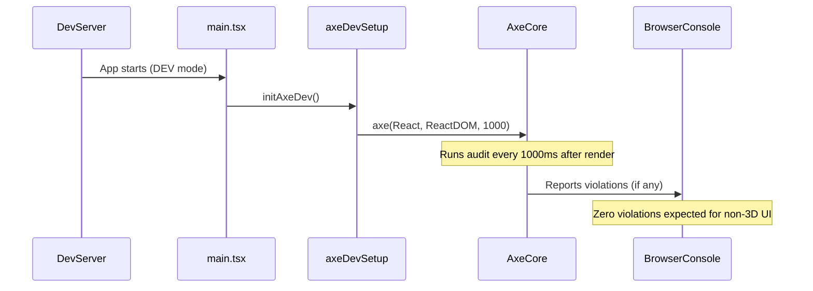
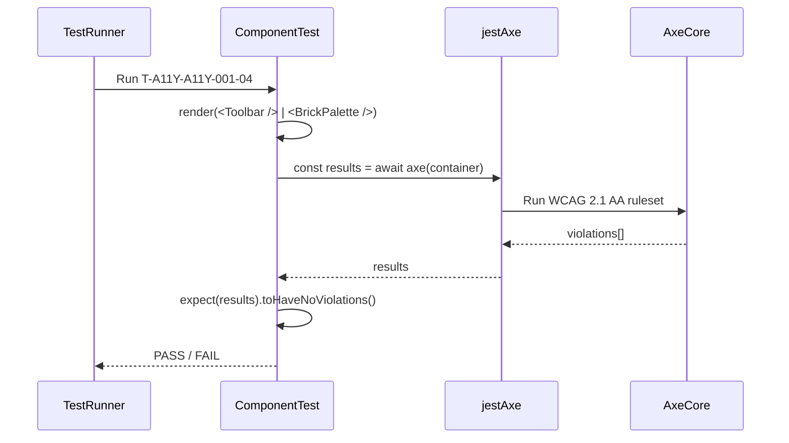

# Low-Level Design: NFR-A11Y-001
## Keyboard Navigation Accessibility — Toolbar & Palette

**FR-ID:** NFR-A11Y-001  
**Issue:** [#33](https://github.com/sreenivasmrpivot/legobuilder/issues/33)  
**Status:** Draft — Awaiting Gate 6a Design Review  
**Area:** Frontend  
**Dependencies:** FR-UI-001 (Issue #23), FR-UI-002 (Issue #24)  
**Test Cases:** T-A11Y-A11Y-001-01, T-A11Y-A11Y-001-02, T-A11Y-A11Y-001-03, T-A11Y-A11Y-001-04  

---

## 1. Overview

This document defines the low-level design for ensuring all toolbar and palette actions in the LegoBuilder application are fully keyboard-navigable in compliance with WCAG 2.1 AA. The design covers:

- Tab-order management for the 7 toolbar buttons
- Arrow-key navigation within the `BrickPalette` component
- Enter/Space key activation for all interactive elements
- axe-core integration for automated accessibility auditing
- ARIA attribute strategy for non-native interactive elements

The 3D canvas (`<canvas>`) is explicitly excluded from the accessibility audit scope as it is inherently inaccessible to screen readers.

---

## 2. Component Architecture

### 2.1 Component Tree (Affected Components)

```
App
├── Toolbar                        ← Tab-order: 7 native <button> elements
│   ├── ToolbarButton (×7)         ← Native <button>, no tabIndex manipulation
│   └── ToolbarDivider             ← aria-hidden="true", not focusable
├── BrickPalette                   ← Arrow-key roving tabIndex container
│   ├── PaletteHeader              ← Static, aria-label="Brick Palette"
│   ├── BrickCategoryList          ← role="listbox", aria-label="Brick categories"
│   │   └── BrickCategoryItem (×N) ← role="option", tabIndex managed by roving
│   └── BrickItemGrid              ← role="listbox", aria-label="Brick types"
│       └── BrickItem (×M)         ← role="option", tabIndex managed by roving
└── ViewportCanvas                 ← aria-hidden="true", tabIndex={-1}
```

### 2.2 Module Responsibilities

| Module | File Path | Responsibility |
|--------|-----------|----------------|
| `Toolbar` | `src/components/Toolbar/Toolbar.tsx` | Renders 7 toolbar buttons in DOM order; relies on natural tab flow |
| `ToolbarButton` | `src/components/Toolbar/ToolbarButton.tsx` | Native `<button>` element; receives `aria-label`, `aria-pressed` |
| `BrickPalette` | `src/components/BrickPalette/BrickPalette.tsx` | Owns roving tabIndex state; handles `onKeyDown` for arrow navigation |
| `BrickCategoryList` | `src/components/BrickPalette/BrickCategoryList.tsx` | `role="listbox"` container for category items |
| `BrickCategoryItem` | `src/components/BrickPalette/BrickCategoryItem.tsx` | `role="option"`, receives `tabIndex` from parent roving state |
| `BrickItemGrid` | `src/components/BrickPalette/BrickItemGrid.tsx` | `role="listbox"` container for brick type items |
| `BrickItem` | `src/components/BrickPalette/BrickItem.tsx` | `role="option"`, receives `tabIndex` from parent roving state |
| `useRovingTabIndex` | `src/hooks/useRovingTabIndex.ts` | Custom hook encapsulating roving tabIndex logic |
| `useKeyboardNav` | `src/hooks/useKeyboardNav.ts` | Generic keyboard event handler factory (ArrowUp/Down/Left/Right/Home/End) |
| `axeDevSetup` | `src/utils/axeDevSetup.ts` | Initialises `@axe-core/react` in development mode only |

---

## 3. Data Models & State

### 3.1 Roving TabIndex State (BrickPalette)

No global store changes are required. Keyboard navigation state is **local** to the `BrickPalette` component via the `useRovingTabIndex` hook.

```typescript
// useRovingTabIndex.ts
interface RovingTabIndexState {
  /** Index of the currently "active" (tabIndex=0) item within the list */
  activeIndex: number;
  /** Total number of items in the navigable list */
  itemCount: number;
  /** Whether navigation wraps at boundaries (true = wrap, false = clamp) */
  wrap: boolean;
}

interface RovingTabIndexActions {
  /** Move focus to the next item */
  moveNext: () => void;
  /** Move focus to the previous item */
  movePrev: () => void;
  /** Move focus to the first item */
  moveFirst: () => void;
  /** Move focus to the last item */
  moveLast: () => void;
  /** Set active index directly (e.g., on mouse click) */
  setActiveIndex: (index: number) => void;
  /** Get tabIndex value for item at position i */
  getTabIndex: (i: number) => 0 | -1;
}
```

### 3.2 Toolbar State (No Change)

The Toolbar uses native `<button>` elements in DOM order. No additional state is needed for keyboard navigation — the browser handles Tab focus natively. The existing `toolStore` (Zustand) tracks the active tool; `aria-pressed` is derived from this store.

```typescript
// Existing toolStore shape (read-only for this NFR)
interface ToolState {
  activeTool: 'select' | 'place' | 'delete' | 'rotate' | 'color' | 'undo' | 'redo';
  setActiveTool: (tool: ToolState['activeTool']) => void;
}
```

### 3.3 ARIA Attribute Map

| Element | Role | aria-label | aria-pressed | tabIndex | Notes |
|---------|------|------------|--------------|----------|-------|
| `<button>` (Toolbar) | implicit `button` | Tool name (e.g., "Select tool") | `true`/`false` based on `activeTool` | default (0) | Native button; no override needed |
| `BrickCategoryItem` | `option` | Category name | — | 0 (active) / -1 | Roving tabIndex |
| `BrickItem` | `option` | Brick name + dimensions | — | 0 (active) / -1 | Roving tabIndex |
| `ViewportCanvas` | — | — | — | -1 | `aria-hidden="true"` |
| `ToolbarDivider` | — | — | — | — | `aria-hidden="true"` |

---

## 4. API / Prop Contracts

### 4.1 `useRovingTabIndex` Hook

```typescript
/**
 * Custom hook implementing the ARIA roving tabIndex pattern.
 * @see https://www.w3.org/WAI/ARIA/apg/practices/keyboard-interface/#kbd_roving_tabindex
 */
function useRovingTabIndex(options: {
  itemCount: number;
  initialIndex?: number;  // default: 0
  wrap?: boolean;         // default: true
  orientation?: 'horizontal' | 'vertical' | 'both'; // default: 'vertical'
}): RovingTabIndexState & RovingTabIndexActions;
```

### 4.2 `useKeyboardNav` Hook

```typescript
/**
 * Factory hook that returns an onKeyDown handler for list navigation.
 * Handles: ArrowUp, ArrowDown, ArrowLeft, ArrowRight, Home, End.
 */
function useKeyboardNav(options: {
  onNext: () => void;
  onPrev: () => void;
  onFirst: () => void;
  onLast: () => void;
  orientation?: 'horizontal' | 'vertical' | 'both'; // default: 'vertical'
}): (event: React.KeyboardEvent) => void;
```

### 4.3 `ToolbarButton` Props

```typescript
interface ToolbarButtonProps {
  /** Unique tool identifier */
  tool: ToolState['activeTool'];
  /** Accessible label for screen readers */
  ariaLabel: string;
  /** Icon component to render */
  icon: React.ReactNode;
  /** Click handler */
  onClick: () => void;
  /** Whether this button is currently active (maps to aria-pressed) */
  isActive?: boolean;
  /** Optional keyboard shortcut hint for tooltip */
  shortcutHint?: string;
}
```

### 4.4 `BrickPalette` Props (Updated)

```typescript
interface BrickPaletteProps {
  /** List of available brick categories */
  categories: BrickCategory[];
  /** Currently selected category ID */
  selectedCategoryId: string | null;
  /** Callback when a category is selected */
  onCategorySelect: (categoryId: string) => void;
  /** Callback when a brick type is selected */
  onBrickSelect: (brickTypeId: string) => void;
  /** Currently selected brick type ID */
  selectedBrickTypeId: string | null;
}
```

### 4.5 `axeDevSetup` Utility

```typescript
/**
 * Initialises @axe-core/react in development mode.
 * Must be called once in the application entry point (main.tsx).
 * No-op in production builds.
 */
function initAxeDev(): void;

// Usage in main.tsx:
// if (import.meta.env.DEV) { initAxeDev(); }
```

---

## 5. Sequence Diagrams

### 5.1 Toolbar Tab Navigation



### 5.2 BrickPalette Arrow Key Navigation



### 5.3 axe-core Audit Flow (Development)



### 5.4 jest-axe Component Test Flow



---

## 6. Implementation Details

### 6.1 Toolbar — Native Tab Order

The Toolbar renders 7 `<button>` elements in DOM order. No `tabIndex` manipulation is required. The browser's natural tab order follows DOM sequence.

**Key implementation rules:**
- All 7 buttons MUST be native `<button>` elements (not `<div>` or `<span>`).
- Each button MUST have a descriptive `aria-label` (e.g., `"Select tool (S)"`).
- Active tool button MUST have `aria-pressed="true"`; inactive buttons `aria-pressed="false"`.
- Focus ring MUST be visible: `outline: 2px solid #005FCC; outline-offset: 2px;` (do NOT use `outline: none`).
- Keyboard shortcut hints displayed in tooltip via `title` attribute or `aria-describedby`.

**Toolbar button order (DOM sequence = Tab order):**

| Tab Position | Tool | aria-label | Keyboard Shortcut |
|-------------|------|------------|-------------------|
| 1 | Select | "Select tool (S)" | S |
| 2 | Place | "Place brick (P)" | P |
| 3 | Delete | "Delete brick (D)" | D |
| 4 | Rotate | "Rotate brick (R)" | R |
| 5 | Color | "Change color (C)" | C |
| 6 | Undo | "Undo (Ctrl+Z)" | Ctrl+Z |
| 7 | Redo | "Redo (Ctrl+Y)" | Ctrl+Y |

### 6.2 BrickPalette — Roving TabIndex Pattern

The `BrickPalette` implements the [ARIA Roving TabIndex](https://www.w3.org/WAI/ARIA/apg/practices/keyboard-interface/#kbd_roving_tabindex) pattern:

- Only ONE item in the palette has `tabIndex=0` at any time (the "active" item).
- All other items have `tabIndex=-1`.
- Arrow keys move the active index and call `.focus()` on the newly active item's DOM node.
- `Home` key moves to the first item; `End` key moves to the last item.
- Navigation wraps at boundaries (ArrowDown on last item → first item).

**Two-level navigation:**
1. **Category level** (`BrickCategoryList`): ArrowUp/ArrowDown navigates between categories. Selecting a category (Enter/Space) expands it and moves focus to the first brick item.
2. **Item level** (`BrickItemGrid`): ArrowUp/ArrowDown/ArrowLeft/ArrowRight navigates the grid. Escape returns focus to the category level.

```typescript
// BrickPalette.tsx — simplified onKeyDown handler
const handleCategoryKeyDown = (e: React.KeyboardEvent, index: number) => {
  switch (e.key) {
    case 'ArrowDown': e.preventDefault(); categoryNav.moveNext(); break;
    case 'ArrowUp':   e.preventDefault(); categoryNav.movePrev(); break;
    case 'Home':      e.preventDefault(); categoryNav.moveFirst(); break;
    case 'End':       e.preventDefault(); categoryNav.moveLast(); break;
    case 'Enter':
    case ' ':         e.preventDefault(); handleCategorySelect(index); break;
  }
};

const handleItemKeyDown = (e: React.KeyboardEvent, index: number) => {
  switch (e.key) {
    case 'ArrowDown':  e.preventDefault(); itemNav.moveNext(); break;
    case 'ArrowUp':    e.preventDefault(); itemNav.movePrev(); break;
    case 'ArrowRight': e.preventDefault(); itemNav.moveNext(); break;
    case 'ArrowLeft':  e.preventDefault(); itemNav.movePrev(); break;
    case 'Home':       e.preventDefault(); itemNav.moveFirst(); break;
    case 'End':        e.preventDefault(); itemNav.moveLast(); break;
    case 'Escape':     e.preventDefault(); returnFocusToCategory(); break;
    case 'Enter':
    case ' ':          e.preventDefault(); handleBrickSelect(index); break;
  }
};
```

### 6.3 Focus Management — DOM Ref Strategy

```typescript
// useRovingTabIndex.ts — focus management
const itemRefs = useRef<(HTMLElement | null)[]>([]);

const focusItem = useCallback((index: number) => {
  setActiveIndex(index);
  // Use requestAnimationFrame to ensure tabIndex update is committed before focus
  requestAnimationFrame(() => {
    itemRefs.current[index]?.focus();
  });
}, []);

// Expose ref setter for child components
const setItemRef = useCallback((index: number) => (
  (el: HTMLElement | null) => { itemRefs.current[index] = el; }
), []);
```

### 6.4 axe-core Integration

**Development runtime (`@axe-core/react`):**

```typescript
// src/utils/axeDevSetup.ts
import React from 'react';
import ReactDOM from 'react-dom';

export function initAxeDev(): void {
  if (process.env.NODE_ENV !== 'development') return;
  import('@axe-core/react').then(({ default: axe }) => {
    axe(React, ReactDOM, 1000);
  });
}
```

**Test-time (`jest-axe`):**

```typescript
// Example: Toolbar.a11y.test.tsx
import { render } from '@testing-library/react';
import { axe, toHaveNoViolations } from 'jest-axe';
import { Toolbar } from './Toolbar';

expect.extend(toHaveNoViolations);

test('T-A11Y-A11Y-001-04: Toolbar has no WCAG 2.1 AA violations', async () => {
  const { container } = render(<Toolbar />);
  const results = await axe(container, {
    runOnly: { type: 'tag', values: ['wcag2a', 'wcag2aa'] },
  });
  expect(results).toHaveNoViolations();
});
```

**axe-core scope exclusion for 3D canvas:**

```typescript
// Exclude <canvas> from axe audit
const results = await axe(container, {
  exclude: [['canvas']],
  runOnly: { type: 'tag', values: ['wcag2a', 'wcag2aa'] },
});
```

---

## 7. Error Handling Strategy

| Scenario | Handling Strategy |
|----------|------------------|
| `itemRefs.current[index]` is `null` (item unmounted during navigation) | Guard with optional chaining (`?.focus()`); log warning in DEV mode |
| `itemCount` is 0 (empty palette) | `useRovingTabIndex` returns `activeIndex = -1`; no keyboard events processed |
| axe-core dynamic import fails (network/CSP issue) | Catch promise rejection; log warning; do NOT block app startup |
| `@axe-core/react` reports violations in DEV | Console warning only; does NOT throw; does NOT affect production |
| Focus lost after category collapse | `returnFocusToCategory()` restores focus to the previously active category item |
| Browser does not support `requestAnimationFrame` | Fallback to `setTimeout(fn, 0)` for focus scheduling |

---

## 8. Security Considerations

| Concern | Mitigation |
|---------|------------|
| `axe-core` in production bundle | `@axe-core/react` is a dev-only dependency; `initAxeDev()` is guarded by `NODE_ENV !== 'development'`; dynamic import ensures zero production bundle impact |
| XSS via `aria-label` | All `aria-label` values are static string constants defined in component props; no user-controlled content is injected into ARIA attributes |
| Focus trap escape | No focus traps are introduced; the roving tabIndex pattern allows Tab to exit the palette naturally |
| Keyboard event propagation | `e.preventDefault()` is called only for navigation keys (Arrow, Home, End, Enter, Space within listbox); does not suppress global shortcuts |

---

## 9. Performance Considerations

| Concern | Target | Strategy |
|---------|--------|----------|
| Re-renders on `activeIndex` change | < 1ms per keystroke | `useRovingTabIndex` uses `useState`; only the two affected items re-render (tabIndex change) |
| `requestAnimationFrame` overhead | Negligible | Single rAF per keypress; cancelled if component unmounts |
| axe-core bundle size | 0 KB in production | Dynamic import + DEV guard; tree-shaken from production build |
| `itemRefs` array size | O(N) where N = brick types | Refs are lightweight; no performance concern for expected N < 200 |

---

## 10. Accessibility Compliance Summary

### WCAG 2.1 AA Criteria Addressed

| Criterion | Level | Description | Implementation |
|-----------|-------|-------------|----------------|
| 1.3.1 Info and Relationships | A | Structure conveyed via markup | `role="listbox"`, `role="option"`, `aria-label` on all interactive elements |
| 2.1.1 Keyboard | A | All functionality via keyboard | Tab for toolbar; Arrow keys for palette; Enter/Space for activation |
| 2.1.2 No Keyboard Trap | A | Focus not trapped | Roving tabIndex allows Tab to exit; Escape returns to category level |
| 2.4.3 Focus Order | A | Logical focus sequence | DOM order for toolbar; roving tabIndex for palette |
| 2.4.7 Focus Visible | AA | Focus indicator visible | `outline: 2px solid #005FCC; outline-offset: 2px` on all focusable elements |
| 4.1.2 Name, Role, Value | A | UI components have accessible names | `aria-label` on all buttons; `aria-pressed` on toolbar buttons |

### Exclusions

- `<canvas>` (3D viewport): Excluded from all a11y audits per WCAG guidance on non-text content that cannot be made accessible. `aria-hidden="true"` applied.

---

## 11. Test Case Mapping

| Test ID | Description | Component Under Test | Verification Method |
|---------|-------------|---------------------|---------------------|
| T-A11Y-A11Y-001-01 | Tab through all 7 toolbar buttons in order | `Toolbar` | `userEvent.tab()` ×7; assert each button receives focus in sequence |
| T-A11Y-A11Y-001-02 | Arrow key navigation through brick palette | `BrickPalette` | `userEvent.keyboard('{ArrowDown}')` ×N; assert `activeIndex` increments |
| T-A11Y-A11Y-001-03 | Enter key triggers button action | `ToolbarButton`, `BrickItem` | `userEvent.keyboard('{Enter}')` on focused element; assert handler called |
| T-A11Y-A11Y-001-04 | axe-core WCAG 2.1 AA audit — zero violations | `Toolbar`, `BrickPalette` | `jest-axe`: `expect(results).toHaveNoViolations()` |

---

## 12. File Change Summary

### New Files

| File | Purpose |
|------|---------| 
| `src/hooks/useRovingTabIndex.ts` | Roving tabIndex custom hook |
| `src/hooks/useKeyboardNav.ts` | Generic keyboard navigation handler factory |
| `src/utils/axeDevSetup.ts` | axe-core dev-mode initialisation |

### Modified Files

| File | Change |
|------|--------|
| `src/components/Toolbar/Toolbar.tsx` | Ensure all 7 buttons are native `<button>`; add `aria-label`, `aria-pressed` |
| `src/components/Toolbar/ToolbarButton.tsx` | Add `ariaLabel`, `isActive` props; render `aria-label`, `aria-pressed` |
| `src/components/BrickPalette/BrickPalette.tsx` | Integrate `useRovingTabIndex`; add `onKeyDown` handlers |
| `src/components/BrickPalette/BrickCategoryList.tsx` | Add `role="listbox"`, `aria-label` |
| `src/components/BrickPalette/BrickCategoryItem.tsx` | Add `role="option"`, roving `tabIndex` |
| `src/components/BrickPalette/BrickItemGrid.tsx` | Add `role="listbox"`, `aria-label` |
| `src/components/BrickPalette/BrickItem.tsx` | Add `role="option"`, roving `tabIndex` |
| `src/components/ViewportCanvas/ViewportCanvas.tsx` | Add `aria-hidden="true"`, `tabIndex={-1}` |
| `src/main.tsx` | Call `initAxeDev()` in DEV mode |
| `package.json` | Add `@axe-core/react` (devDependency), `jest-axe` (devDependency) |

---

## 13. Open Questions / Assumptions

| # | Question / Assumption | Resolution |
|---|----------------------|------------|
| 1 | **Assumption:** Toolbar has exactly 7 buttons as specified in the issue. | Confirmed by issue AC: "all 7 toolbar buttons receive focus in logical order" |
| 2 | **Assumption:** BrickPalette uses a two-level hierarchy (categories → items). | Consistent with FR-UI-002 (Issue #24) design. |
| 3 | **Question:** Should the palette support 2D grid navigation (ArrowLeft/Right across columns) or only linear (ArrowUp/Down)? | **Decision:** Support both ArrowUp/Down (linear) and ArrowLeft/Right (grid) for `BrickItemGrid`; linear only for `BrickCategoryList`. |
| 4 | **Assumption:** `@axe-core/react` dynamic import is acceptable (no strict CSP blocking dynamic imports). | If CSP is restrictive, use static import with `/* @vite-ignore */` comment. |
| 5 | **Question:** Should keyboard shortcuts (S, P, D, R, C) be implemented as part of this NFR? | **Decision:** Keyboard shortcuts are out of scope for NFR-A11Y-001; they are documented in `aria-label` as hints only. |

---

*Generated by Spectra Design Agent — NFR-A11Y-001 — LegoBuilder*
