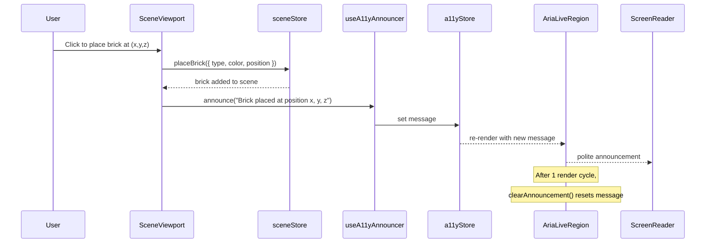
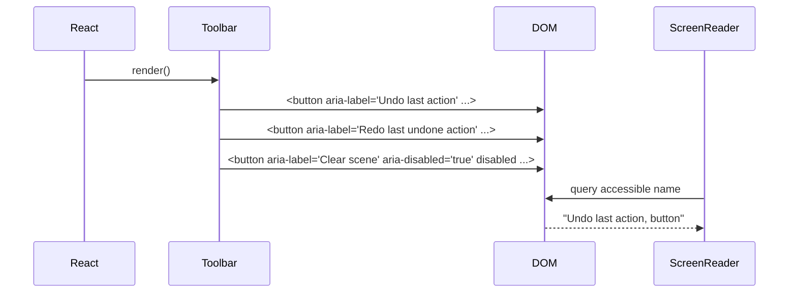
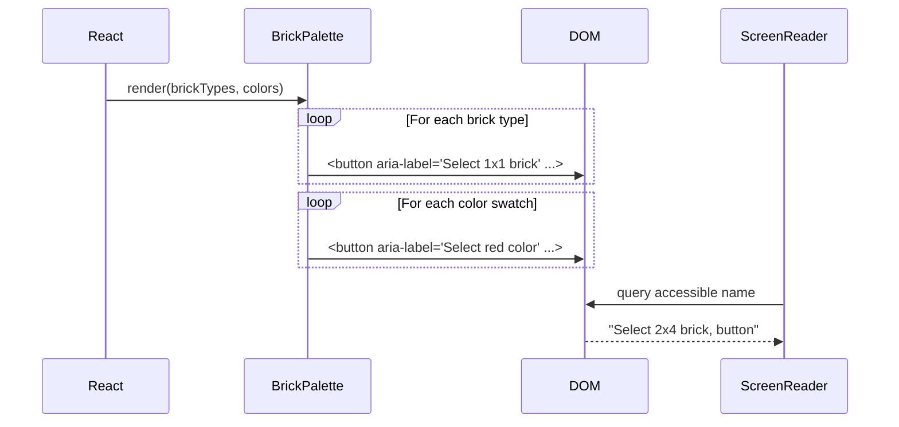

# Low-Level Design: NFR-A11Y-002
## ARIA Labels for Toolbar & Palette; Scene State Announcements

**FR-ID:** NFR-A11Y-002
**Issue:** [#34](https://github.com/sreenivasmrpivot/legobuilder/issues/34)
**Status:** Draft — Pending Design Review (Gate 6a)
**Author:** Spectra Design Agent
**Date:** 2026-04-11

---

## 1. Overview

This document specifies the low-level design for adding WCAG 2.1 AA-compliant ARIA attributes to the LegoBuilder frontend. The scope covers:

1. **`aria-label`** on every `<button>` in `Toolbar` and every brick-type / color-swatch button in `BrickPalette`.
2. **`aria-disabled="true"`** on disabled toolbar buttons (in addition to the native `disabled` attribute).
3. **ARIA live region** in `App.tsx` that announces scene state changes (brick placed, brick deleted, scene cleared) to screen readers.
4. A new **`useA11yAnnouncer` hook** that encapsulates live-region message dispatch.

This feature depends on **NFR-A11Y-001** (keyboard navigation, issue #33) being merged first.

---

## 2. Acceptance Criteria (Traceability)

| AC | Requirement | Test ID |
|----|-------------|----------|
| AC-1 | Every `<button>` in `Toolbar` has a descriptive `aria-label` (e.g., "Undo last action", "Export scene as JSON") | T-A11Y-A11Y-002-01 |
| AC-2 | Every brick-type and color-swatch button in `BrickPalette` has a descriptive `aria-label` | T-A11Y-A11Y-002-01 |
| AC-3 | Brick placed/deleted/scene-cleared events are announced via an ARIA live region | T-A11Y-A11Y-002-02 |
| AC-4 | Disabled toolbar buttons carry `aria-disabled="true"` in addition to `disabled` | T-A11Y-A11Y-002-01 |

---

## 3. Component Architecture

### 3.1 Affected Components

```
frontend/src/
├── components/
│   ├── App.tsx                          ← Add <AriaLiveRegion> + wire useA11yAnnouncer
│   └── ui/
│       ├── Toolbar.tsx                  ← Add aria-label + aria-disabled to all buttons
│       └── BrickPalette.tsx             ← Add aria-label to brick-type + color-swatch buttons
├── hooks/
│   └── useA11yAnnouncer.ts              ← NEW: live-region message dispatch hook
└── stores/
    └── a11yStore.ts                     ← NEW: Zustand store for announcer message state
```

### 3.2 New Modules

#### `frontend/src/stores/a11yStore.ts`

A lightweight Zustand store that holds the current live-region announcement message.

```typescript
// Interface
interface A11yState {
  /** Current announcement message. Empty string = no announcement. */
  message: string;
  /** Announce a scene state change to screen readers. */
  announce: (msg: string) => void;
  /** Clear the current announcement (called after render cycle). */
  clearAnnouncement: () => void;
}
```

**State transitions:**
- `announce(msg)` → sets `message = msg`
- `clearAnnouncement()` → sets `message = ""`

#### `frontend/src/hooks/useA11yAnnouncer.ts`

A React hook that subscribes to `a11yStore` and returns a stable `announce` function. Consumers call `announce(msg)` to push a message into the live region.

```typescript
// Signature
function useA11yAnnouncer(): {
  announce: (message: string) => void;
}
```

**Internal behaviour:**
- Reads `announce` from `a11yStore`.
- Returns a memoised wrapper so referential equality is stable across renders.

---

## 4. Data Models

### 4.1 A11y Store State

```typescript
// frontend/src/stores/a11yStore.ts
type A11yState = {
  message: string;           // Current live-region text
  announce: (msg: string) => void;
  clearAnnouncement: () => void;
};
```

### 4.2 Toolbar Button Descriptor

Each toolbar button is described by a static configuration object:

```typescript
interface ToolbarButtonConfig {
  /** Unique action identifier */
  id: string;
  /** Human-readable ARIA label (screen reader text) */
  ariaLabel: string;
  /** Icon component or emoji */
  icon: React.ReactNode;
  /** Click handler */
  onClick: () => void;
  /** Whether the button is currently disabled */
  disabled?: boolean;
}
```

### 4.3 Palette Item Descriptor

```typescript
interface PaletteItemConfig {
  /** Brick type identifier (e.g., "1x1", "2x4") */
  brickType: string;
  /** ARIA label for the brick-type button */
  ariaLabel: string;
}

interface ColorSwatchConfig {
  /** CSS color value */
  color: string;
  /** Human-readable color name for ARIA label */
  colorName: string;
  /** ARIA label: "Select {colorName} color" */
  ariaLabel: string;
}
```

---

## 5. API / Interface Specifications

> This is a pure frontend feature with no backend API surface. All interfaces are React component props and Zustand store contracts.

### 5.1 `Toolbar` Component Props (updated)

```typescript
// No new props — aria-label values are derived from existing action metadata.
// The component internally maps each action to its aria-label string.

// Toolbar button aria-label mapping (static constant):
const TOOLBAR_ARIA_LABELS: Record<string, string> = {
  undo:        "Undo last action",
  redo:        "Redo last undone action",
  clearScene:  "Clear scene — remove all bricks",
  exportJSON:  "Export scene as JSON",
  exportPNG:   "Export scene as PNG image",
  // extend as new toolbar actions are added
};
```

### 5.2 `BrickPalette` Component Props (updated)

```typescript
// No new props — aria-label values are derived from brick type and color name.

// Brick-type aria-label pattern:
// "Select {brickType} brick" → e.g., "Select 1x1 brick", "Select 2x4 brick"

// Color-swatch aria-label pattern:
// "Select {colorName} color" → e.g., "Select red color", "Select blue color"
```

### 5.3 `AriaLiveRegion` Component

A new presentational component rendered once in `App.tsx`:

```typescript
interface AriaLiveRegionProps {
  /** The message to announce. Empty string = silent. */
  message: string;
}

// Rendered HTML:
// <div
//   role="status"
//   aria-live="polite"
//   aria-atomic="true"
//   className="sr-only"
// >
//   {message}
// </div>
```

**Attributes rationale:**
- `role="status"` + `aria-live="polite"` — announces after the current speech finishes (non-interruptive).
- `aria-atomic="true"` — the entire region content is read as one unit.
- `className="sr-only"` — visually hidden via Tailwind utility (position: absolute; width: 1px; height: 1px; overflow: hidden; clip: rect(0,0,0,0)).

### 5.4 Announcement Message Strings

| Trigger | Message Template | Example |
|---------|------------------|---------|
| Brick placed | `"Brick placed at position {x}, {y}, {z}"` | `"Brick placed at position 2, 0, 3"` |
| Brick deleted | `"Brick deleted"` | `"Brick deleted"` |
| Scene cleared | `"Scene cleared"` | `"Scene cleared"` |
| Undo | `"Action undone"` | `"Action undone"` |
| Redo | `"Action redone"` | `"Action redone"` |

---

## 6. Sequence Diagrams

### 6.1 Brick Placement Announcement Flow



### 6.2 Toolbar Button ARIA Rendering



### 6.3 Palette Item ARIA Rendering



---

## 7. Implementation Plan

### 7.1 File Changes

| File | Change Type | Description |
|------|-------------|-------------|
| `frontend/src/stores/a11yStore.ts` | **CREATE** | Zustand store for live-region message state |
| `frontend/src/hooks/useA11yAnnouncer.ts` | **CREATE** | Hook exposing `announce()` function |
| `frontend/src/components/App.tsx` | **MODIFY** | Add `<AriaLiveRegion>`, wire `useA11yAnnouncer` to scene events |
| `frontend/src/components/ui/Toolbar.tsx` | **MODIFY** | Add `aria-label` + `aria-disabled` to all `<button>` elements |
| `frontend/src/components/ui/BrickPalette.tsx` | **MODIFY** | Add `aria-label` to brick-type and color-swatch buttons |

### 7.2 `a11yStore.ts` — Full Specification

```typescript
import { create } from 'zustand';

interface A11yState {
  message: string;
  announce: (msg: string) => void;
  clearAnnouncement: () => void;
}

export const useA11yStore = create<A11yState>((set) => ({
  message: '',
  announce: (msg: string) => set({ message: msg }),
  clearAnnouncement: () => set({ message: '' }),
}));
```

### 7.3 `useA11yAnnouncer.ts` — Full Specification

```typescript
import { useCallback } from 'react';
import { useA11yStore } from '../stores/a11yStore';

export function useA11yAnnouncer() {
  const announce = useA11yStore((s) => s.announce);
  // Return stable reference — announce from Zustand is already stable,
  // but wrap in useCallback for explicit contract.
  const stableAnnounce = useCallback(
    (message: string) => announce(message),
    [announce]
  );
  return { announce: stableAnnounce };
}
```

### 7.4 `AriaLiveRegion` Component — Full Specification

```typescript
// Inline in App.tsx or extracted to components/ui/AriaLiveRegion.tsx
import { useEffect } from 'react';
import { useA11yStore } from '../../stores/a11yStore';

export function AriaLiveRegion() {
  const message = useA11yStore((s) => s.message);
  const clearAnnouncement = useA11yStore((s) => s.clearAnnouncement);

  // Clear after one render cycle so repeated identical messages re-trigger
  useEffect(() => {
    if (message) {
      const timer = setTimeout(clearAnnouncement, 1000);
      return () => clearTimeout(timer);
    }
  }, [message, clearAnnouncement]);

  return (
    <div
      role="status"
      aria-live="polite"
      aria-atomic="true"
      className="sr-only"
    >
      {message}
    </div>
  );
}
```

### 7.5 `Toolbar.tsx` — ARIA Attribute Specification

For each `<button>` element in `Toolbar`, add:

```tsx
// Undo button
<button
  aria-label="Undo last action"
  disabled={!canUndo}
  aria-disabled={!canUndo}
  onClick={handleUndo}
>
  {/* icon */}
</button>

// Redo button
<button
  aria-label="Redo last undone action"
  disabled={!canRedo}
  aria-disabled={!canRedo}
  onClick={handleRedo}
>
  {/* icon */}
</button>

// Clear Scene button
<button
  aria-label="Clear scene — remove all bricks"
  onClick={handleClearScene}
>
  {/* icon */}
</button>

// Export JSON button
<button
  aria-label="Export scene as JSON"
  onClick={handleExportJSON}
>
  {/* icon */}
</button>

// Export PNG button (if present)
<button
  aria-label="Export scene as PNG image"
  onClick={handleExportPNG}
>
  {/* icon */}
</button>
```

**Rule:** `aria-disabled` must mirror the `disabled` prop value (boolean → string `"true"` / `"false"`).

### 7.6 `BrickPalette.tsx` — ARIA Attribute Specification

```tsx
// Brick type button
<button
  key={brickType}
  aria-label={`Select ${brickType} brick`}
  onClick={() => onSelectBrickType(brickType)}
  aria-pressed={selectedBrickType === brickType}
>
  {brickType}
</button>

// Color swatch button
<button
  key={color}
  aria-label={`Select ${colorName} color`}
  style={{ backgroundColor: color }}
  onClick={() => onSelectColor(color)}
  aria-pressed={selectedColor === color}
/>
```

**Note:** `aria-pressed` is added to indicate toggle state for selected brick type and color, improving screen reader UX beyond the minimum AC requirement.

### 7.7 `App.tsx` — Integration Specification

```tsx
// 1. Import AriaLiveRegion
import { AriaLiveRegion } from './ui/AriaLiveRegion';

// 2. Import useA11yAnnouncer
import { useA11yAnnouncer } from '../hooks/useA11yAnnouncer';

// 3. Inside App component:
const { announce } = useA11yAnnouncer();

// 4. Wire to scene events (subscribe to sceneStore actions):
// When brick is placed:
const handleBrickPlaced = (position: { x: number; y: number; z: number }) => {
  announce(`Brick placed at position ${position.x}, ${position.y}, ${position.z}`);
};

// When brick is deleted:
const handleBrickDeleted = () => {
  announce('Brick deleted');
};

// When scene is cleared:
const handleSceneCleared = () => {
  announce('Scene cleared');
};

// 5. Render AriaLiveRegion once at the root:
return (
  <>
    <AriaLiveRegion />
    {/* ... rest of app ... */}
  </>
);
```

**Integration pattern:** Subscribe to `sceneStore` via Zustand's `subscribe` API or use `useEffect` with store selectors to detect state changes and call `announce()`.

---

## 8. Error Handling Strategy

| Scenario | Handling |
|----------|----------|
| `announce()` called with empty string | No-op — guard: `if (!msg.trim()) return;` |
| `announce()` called with very long string | Truncate to 200 characters to avoid overwhelming screen readers |
| `AriaLiveRegion` unmounted before timer fires | `useEffect` cleanup cancels `setTimeout` — no memory leak |
| Rapid successive announcements | Each call overwrites the previous message; `clearAnnouncement` timer resets on each new message |
| Missing `colorName` for a color hex | Fall back to hex value: `aria-label={\`Select ${colorName ?? color} color\`}` |
| Missing `brickType` label | Fall back to `"Select brick"` as a safe default |

---

## 9. Security Considerations

| Concern | Mitigation |
|---------|------------|
| XSS via announcement strings | All announcement strings are constructed from trusted store state (position numbers, brick type strings) — no user-supplied HTML is injected into the live region. React's JSX escapes text content by default. |
| Sensitive data in announcements | Announcement messages contain only positional coordinates and action names — no PII or sensitive data. |
| Third-party screen reader compatibility | Use standard WAI-ARIA attributes (`aria-live`, `aria-label`, `role`) supported by NVDA, JAWS, VoiceOver, and TalkBack. Avoid non-standard ARIA extensions. |

---

## 10. Testing Strategy

### 10.1 Automated Tests (Vitest + Testing Library)

| Test ID | Description | Assertion |
|---------|-------------|----------|
| T-A11Y-A11Y-002-01 | Toolbar buttons have correct aria-labels | `getByRole('button', { name: 'Undo last action' })` exists |
| T-A11Y-A11Y-002-01 | Disabled toolbar buttons have `aria-disabled="true"` | `expect(button).toHaveAttribute('aria-disabled', 'true')` |
| T-A11Y-A11Y-002-01 | BrickPalette brick-type buttons have aria-labels | `getByRole('button', { name: 'Select 2x4 brick' })` exists |
| T-A11Y-A11Y-002-01 | BrickPalette color-swatch buttons have aria-labels | `getByRole('button', { name: 'Select red color' })` exists |
| T-A11Y-A11Y-002-02 | Live region announces brick placement | After `placeBrick()`, `getByRole('status')` contains placement text |
| T-A11Y-A11Y-002-02 | Live region announces brick deletion | After `deleteBrick()`, `getByRole('status')` contains "Brick deleted" |
| T-A11Y-A11Y-002-02 | Live region announces scene clear | After `clearScene()`, `getByRole('status')` contains "Scene cleared" |

### 10.2 Manual Screen Reader Tests

| Platform | Tool | Test Steps |
|----------|------|------------|
| Windows | NVDA + Chrome | Tab through toolbar; verify each button is announced with its label. Place a brick; verify announcement. |
| macOS | VoiceOver + Safari | Same as above. |
| iOS | VoiceOver + Safari | Swipe through palette items; verify labels. |

---

## 11. Accessibility Standards Compliance

| Standard | Requirement | Implementation |
|----------|-------------|----------------|
| WCAG 2.1 SC 4.1.2 | Name, Role, Value — UI components have accessible names | `aria-label` on all interactive elements |
| WCAG 2.1 SC 4.1.3 | Status Messages — status messages can be determined programmatically | `role="status"` + `aria-live="polite"` live region |
| WCAG 2.1 SC 1.3.1 | Info and Relationships — state conveyed programmatically | `aria-disabled`, `aria-pressed` |
| WAI-ARIA 1.2 | `aria-live` regions | `aria-live="polite"`, `aria-atomic="true"` |

---

## 12. Dependencies

| Dependency | Version | Purpose |
|------------|---------|----------|
| `react` | ^18.x | Component rendering, hooks |
| `zustand` | ^4.x | `a11yStore` state management |
| `@testing-library/react` | ^14.x | Component testing |
| `@testing-library/jest-dom` | ^6.x | ARIA attribute assertions |
| NFR-A11Y-001 (issue #33) | — | Keyboard navigation must be merged first |

---

## 13. Open Questions

| # | Question | Owner | Resolution |
|---|----------|-------|------------|
| 1 | Should undo/redo actions also trigger live-region announcements? | Product | Recommended: yes ("Action undone", "Action redone") — included in message table above |
| 2 | What is the complete list of toolbar buttons in the current `Toolbar.tsx`? | Engineering | Confirm against actual component before implementation |
| 3 | Are color names available as strings in the existing color constants, or only as hex values? | Engineering | If only hex, a `COLOR_NAMES` map must be added to `frontend/src/constants/` |
| 4 | Should `aria-live="assertive"` be used for any announcements (e.g., errors)? | Accessibility | For scene state changes, `polite` is correct. Error states (if any) should use `assertive`. |

---

## 14. Revision History

| Version | Date | Author | Notes |
|---------|------|--------|-------|
| 1.0 | 2026-04-11 | Spectra Design Agent | Initial LLD for NFR-A11Y-002 |
