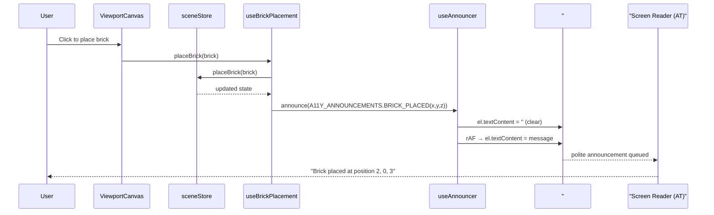
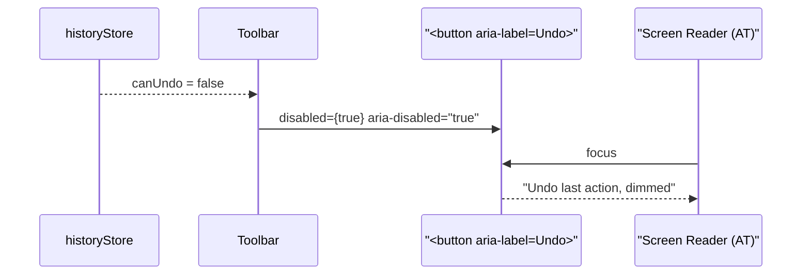
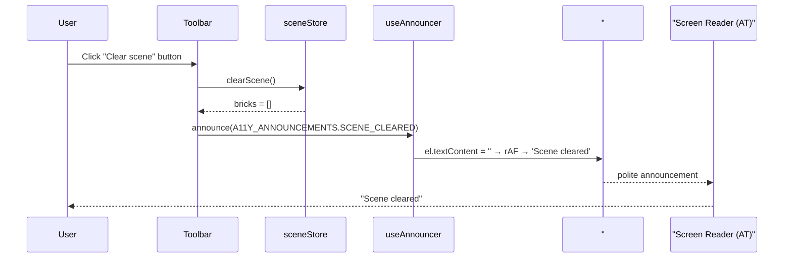

# Low-Level Design: NFR-A11Y-002
## Add ARIA Labels to Toolbar Buttons and Palette Items; Announce Scene State Changes

**FR-ID:** NFR-A11Y-002  
**Issue:** [#34](https://github.com/sreenivasmrpivot/legobuilder/issues/34)  
**Status:** Draft — Awaiting Gate 6a Design Review  
**Author:** Spectra Design Agent  
**Date:** 2026-04-11  
**Depends On:** NFR-A11Y-001 (#33)

---

## 1. Overview

This document defines the low-level design for NFR-A11Y-002, which mandates that all interactive toolbar buttons and brick palette items carry descriptive ARIA labels, and that scene state changes (brick placed, brick deleted, scene cleared) are announced to screen readers via an ARIA live region.

The implementation is **purely frontend** — no backend API changes are required. All changes are confined to React component props, a shared `useAnnouncer` hook, and a single live-region element mounted in `App.tsx`.

---

## 2. Scope

| In Scope | Out of Scope |
|---|---|
| `aria-label` on all `<button>` elements in `Toolbar` | Keyboard navigation order (NFR-A11Y-001) |
| `aria-label` on every brick-type card and color swatch in `BrickPalette` | Screen reader testing automation (manual NVDA/VoiceOver) |
| `aria-disabled="true"` on disabled toolbar buttons | ARIA roles for 3D canvas (separate NFR) |
| ARIA live region in `App.tsx` for scene announcements | i18n / localization of ARIA strings |
| `useAnnouncer` hook wiring into `sceneStore` actions | |

---

## 3. Component Architecture

### 3.1 Component Tree (Affected)

```
App
├── <div aria-live="polite" aria-atomic="true" id="scene-announcer" />
├── Toolbar
│   ├── <button aria-label="Undo last action" aria-disabled={!canUndo} />
│   ├── <button aria-label="Redo last action" aria-disabled={!canRedo} />
│   ├── <button aria-label="Export scene as JSON" />
│   ├── <button aria-label="Import scene from JSON" />
│   ├── <button aria-label="Clear scene" />
│   └── <button aria-label="Toggle grid visibility" />
└── BrickPalette
    ├── BrickTypeCard  (aria-label="{brick.name} brick, {brick.studs} studs")
    └── ColorSwatch    (aria-label="{color.name} color")
```

### 3.2 New Hook: `useAnnouncer`

A lightweight custom hook that writes announcement strings into the live region DOM node. It is the **single source of truth** for all screen-reader announcements.

```typescript
// src/hooks/useAnnouncer.ts
export interface AnnouncerAPI {
  announce: (message: string) => void;
}

export function useAnnouncer(): AnnouncerAPI {
  const announce = useCallback((message: string) => {
    const el = document.getElementById('scene-announcer');
    if (!el) return;
    // Clear then set to force re-announcement of identical messages
    el.textContent = '';
    requestAnimationFrame(() => {
      el.textContent = message;
    });
  }, []);
  return { announce };
}
```

**Design rationale:** Using `requestAnimationFrame` between clear and set ensures screen readers re-announce even when the same message is repeated (e.g., placing two identical bricks in a row).

### 3.3 Live Region Element (App.tsx)

```tsx
// Mounted once at the App root — never unmounted
<div
  id="scene-announcer"
  role="status"
  aria-live="polite"
  aria-atomic="true"
  className="sr-only"   // Tailwind visually-hidden utility
/>
```

**`aria-live="polite"`** — announcements queue behind current speech; does not interrupt the user.  
**`aria-atomic="true"`** — the entire region content is read as a single unit.  
**`role="status"`** — semantic alias for `aria-live="polite"` that improves compatibility with older AT.

### 3.4 Toolbar Component Changes

Each `<button>` receives a static `aria-label` prop and a dynamic `aria-disabled` prop:

| Button | `aria-label` | `aria-disabled` condition |
|---|---|---|
| Undo | `"Undo last action"` | `!canUndo` |
| Redo | `"Redo last action"` | `!canRedo` |
| Export | `"Export scene as JSON"` | `false` |
| Import | `"Import scene from JSON"` | `false` |
| Clear | `"Clear scene"` | `brickCount === 0` |
| Toggle Grid | `"Toggle grid visibility"` | `false` |

**Note:** `aria-disabled="true"` is set **in addition to** the native `disabled` attribute so that AT can still focus and read the button's purpose even when it is disabled.

### 3.5 BrickPalette Component Changes

#### BrickTypeCard

```tsx
<button
  aria-label={`${brick.name} brick, ${brick.studs} studs`}
  aria-pressed={selectedBrickType === brick.id}
  onClick={() => selectBrickType(brick.id)}
>
  {/* visual content */}
</button>
```

`aria-pressed` communicates the current selection state to screen readers.

#### ColorSwatch

```tsx
<button
  aria-label={`${color.name} color`}
  aria-pressed={selectedColor === color.id}
  onClick={() => selectColor(color.id)}
/>
```

---

## 4. Data Models

No new data models are introduced. The following existing store fields are consumed:

### 4.1 `historyStore` (Zustand) — consumed by Toolbar

```typescript
interface HistoryStore {
  canUndo: boolean;   // drives aria-disabled on Undo button
  canRedo: boolean;   // drives aria-disabled on Redo button
  undo: () => void;
  redo: () => void;
}
```

### 4.2 `sceneStore` (Zustand) — consumed by Toolbar + announcer wiring

```typescript
interface SceneStore {
  bricks: Brick[];          // brickCount = bricks.length
  placeBrick: (brick: Brick) => void;   // triggers announcement
  removeBrick: (id: string) => void;    // triggers announcement
  clearScene: () => void;               // triggers announcement
}
```

### 4.3 `uiStore` (Zustand) — consumed by BrickPalette

```typescript
interface UIStore {
  selectedBrickType: string | null;
  selectedColor: string | null;
  selectBrickType: (id: string) => void;
  selectColor: (id: string) => void;
}
```

### 4.4 Announcement Message Catalogue

| Trigger | Announcement String |
|---|---|
| `placeBrick` | `"Brick placed at position {x}, {y}, {z}"` |
| `removeBrick` | `"Brick deleted"` |
| `clearScene` | `"Scene cleared"` |

Strings are defined as constants in `src/constants/a11y.ts` to enable future i18n.

```typescript
// src/constants/a11y.ts
export const A11Y_ANNOUNCEMENTS = {
  BRICK_PLACED: (x: number, y: number, z: number) =>
    `Brick placed at position ${x}, ${y}, ${z}`,
  BRICK_DELETED: 'Brick deleted',
  SCENE_CLEARED: 'Scene cleared',
} as const;
```

---

## 5. API Endpoints

Not applicable. NFR-A11Y-002 is a purely client-side accessibility enhancement with no backend API surface.

---

## 6. Sequence Diagrams

### 6.1 Brick Placement Announcement Flow



### 6.2 Toolbar Disabled State Flow



### 6.3 Scene Clear Announcement Flow



---

## 7. Module Dependencies

```
src/
├── constants/
│   └── a11y.ts                  [NEW] Announcement string catalogue
├── hooks/
│   └── useAnnouncer.ts          [NEW] Live-region write hook
├── components/
│   ├── App.tsx                  [MODIFY] Mount live region; wire useAnnouncer
│   ├── Toolbar.tsx              [MODIFY] Add aria-label, aria-disabled props
│   └── BrickPalette.tsx         [MODIFY] Add aria-label, aria-pressed props
└── hooks/
    └── useBrickPlacement.ts     [MODIFY] Call announce() after place/remove
```

### Dependency Graph

```
App.tsx
  └── useAnnouncer (mounts live region, passes announce fn)
        └── #scene-announcer (DOM node)

Toolbar.tsx
  ├── historyStore (canUndo, canRedo)
  ├── sceneStore (brickCount for Clear disabled state)
  └── useAnnouncer (announce on clearScene)

BrickPalette.tsx
  └── uiStore (selectedBrickType, selectedColor)

useBrickPlacement.ts
  ├── sceneStore (placeBrick, removeBrick)
  └── useAnnouncer (announce on place/remove)
```

---

## 8. Error Handling Strategy

| Scenario | Handling |
|---|---|
| `#scene-announcer` DOM node not found | `useAnnouncer.announce()` is a no-op; logs `console.warn` in development |
| `requestAnimationFrame` not available (SSR/test env) | Fallback: set `textContent` synchronously |
| Brick position undefined during announcement | Announce `"Brick placed"` without coordinates |
| `aria-label` prop missing (future regression) | ESLint `jsx-a11y/aria-props` rule catches at lint time |

```typescript
// useAnnouncer.ts — defensive implementation
export function useAnnouncer(): AnnouncerAPI {
  const announce = useCallback((message: string) => {
    const el = document.getElementById('scene-announcer');
    if (!el) {
      if (process.env.NODE_ENV === 'development') {
        console.warn('[a11y] #scene-announcer element not found');
      }
      return;
    }
    el.textContent = '';
    if (typeof requestAnimationFrame === 'function') {
      requestAnimationFrame(() => { el.textContent = message; });
    } else {
      el.textContent = message; // synchronous fallback
    }
  }, []);
  return { announce };
}
```

---

## 9. Security Considerations

| Concern | Mitigation |
|---|---|
| XSS via announcement strings | All announcement strings are constructed from typed constants and numeric coordinates — no user-supplied HTML is injected. `textContent` (not `innerHTML`) is used exclusively. |
| Sensitive data in announcements | Announcement strings contain only positional coordinates (integers) and action names — no PII or sensitive data. |
| Third-party AT interaction | ARIA live regions are a W3C standard; no third-party scripts are introduced. |

---

## 10. Accessibility Compliance Targets

| Standard | Requirement | Target |
|---|---|---|
| WCAG 2.1 AA | 4.1.2 Name, Role, Value | All interactive elements have accessible names via `aria-label` |
| WCAG 2.1 AA | 4.1.3 Status Messages | Scene state changes announced via `role="status"` live region |
| WCAG 2.1 AA | 1.3.1 Info and Relationships | `aria-pressed` communicates selection state |
| WCAG 2.1 AA | 4.1.2 Name, Role, Value | `aria-disabled` communicates disabled state |
| Screen Reader | NVDA (Windows) + VoiceOver (macOS) | Manual validation per acceptance criteria |

---

## 11. Performance Considerations

- `useAnnouncer` uses `useCallback` with an empty dependency array — the `announce` function reference is stable and will not cause unnecessary re-renders.
- The live region DOM node is a single `<div>` with no children rendered by React — it is updated imperatively via `textContent` to avoid React reconciliation overhead on every announcement.
- `aria-label` props are static strings or simple template literals — zero runtime cost beyond prop diffing.
- No new dependencies are added to the bundle.

---

## 12. Test Case Mapping

| Test ID | Description | Acceptance Criterion |
|---|---|---|
| T-A11Y-A11Y-002-01 | Every toolbar button has a descriptive `aria-label` | Query all `<button>` in `Toolbar`; assert `aria-label` is non-empty and descriptive |
| T-A11Y-A11Y-002-02 | Every palette item has a descriptive `aria-label` | Query all `<button>` in `BrickPalette`; assert `aria-label` matches `{name} brick, {studs} studs` or `{name} color` |
| T-A11Y-A11Y-002-03 | Brick placement triggers live region announcement | Simulate `placeBrick`; assert `#scene-announcer` textContent matches `"Brick placed at position X, Y, Z"` |
| T-A11Y-A11Y-002-04 | Brick deletion triggers live region announcement | Simulate `removeBrick`; assert `#scene-announcer` textContent = `"Brick deleted"` |
| T-A11Y-A11Y-002-05 | Scene clear triggers live region announcement | Simulate `clearScene`; assert `#scene-announcer` textContent = `"Scene cleared"` |
| T-A11Y-A11Y-002-06 | Disabled Undo button has `aria-disabled="true"` | When `canUndo=false`, assert Undo button has both `disabled` and `aria-disabled="true"` |

> **Note:** T-A11Y-A11Y-002-01 and T-A11Y-A11Y-002-02 are the primary test cases mapped in the issue. T-A11Y-A11Y-002-03 through -06 are derived from the acceptance criteria and technical notes.

---

## 13. Implementation Checklist

- [ ] Create `src/constants/a11y.ts` with `A11Y_ANNOUNCEMENTS` catalogue
- [ ] Create `src/hooks/useAnnouncer.ts` with `rAF`-based implementation
- [ ] Add `<div id="scene-announcer" role="status" aria-live="polite" aria-atomic="true" className="sr-only" />` to `App.tsx`
- [ ] Wire `useAnnouncer` into `App.tsx` and pass `announce` down (or use context)
- [ ] Add `aria-label` and `aria-disabled` to all 6 toolbar buttons in `Toolbar.tsx`
- [ ] Add `aria-label` and `aria-pressed` to `BrickTypeCard` buttons in `BrickPalette.tsx`
- [ ] Add `aria-label` and `aria-pressed` to `ColorSwatch` buttons in `BrickPalette.tsx`
- [ ] Call `announce()` in `useBrickPlacement.ts` after `placeBrick` and `removeBrick`
- [ ] Call `announce()` in `Toolbar.tsx` after `clearScene`
- [ ] Add `eslint-plugin-jsx-a11y` rule `jsx-a11y/aria-props` to ESLint config
- [ ] Write unit tests for `useAnnouncer` (clear + rAF pattern)
- [ ] Write component tests for `Toolbar` ARIA attributes
- [ ] Write component tests for `BrickPalette` ARIA attributes
- [ ] Manual screen reader validation: NVDA (Windows) + VoiceOver (macOS)

---

## 14. Open Questions

| # | Question | Owner | Resolution |
|---|---|---|---|
| 1 | Should `aria-live="assertive"` be used for error states (e.g., invalid placement)? | Design/PM | Deferred to NFR-A11Y-003 if created; use `polite` for now |
| 2 | Should announcement strings be i18n-ready from day one? | PM | Deferred; constants in `a11y.ts` make future i18n straightforward |
| 3 | Should `BrickTypeCard` use `role="radio"` within a `role="radiogroup"` instead of `aria-pressed`? | Design | `aria-pressed` on individual buttons is simpler and sufficient for WCAG 2.1 AA; `radiogroup` pattern deferred |

---

*Generated by Spectra Design Agent — Gate 6a approval required before implementation.*
