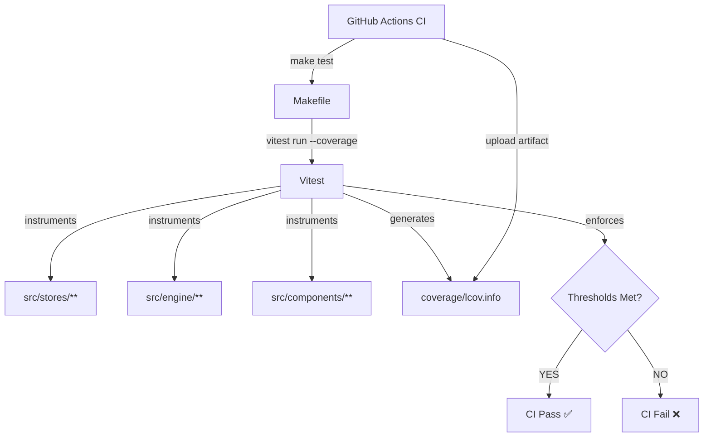
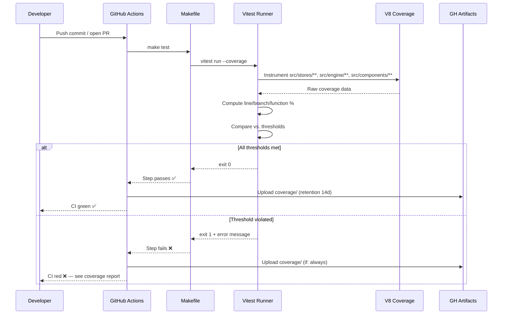
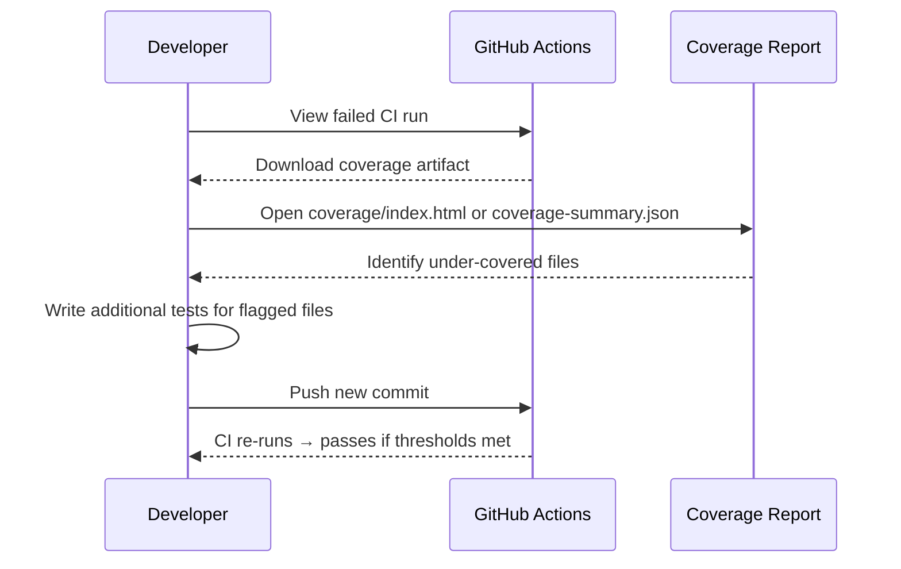

# Low-Level Design: NFR-MAINT-001
## Enforce ≥60% State Logic and ≥50% Component Test Coverage in CI

**FR-ID:** NFR-MAINT-001  
**Issue:** [#37](https://github.com/sreenivasmrpivot/legobuilder/issues/37)  
**Status:** Draft — Awaiting Gate 6a Design Review  
**Author:** Spectra Design Agent  
**Date:** 2026-04-11  

---

## 1. Overview

This document defines the low-level design for enforcing minimum test coverage thresholds in the LegoBuilder CI pipeline. The requirement mandates:

- **≥60% line coverage** for state logic modules (`frontend/src/stores/`, `frontend/src/engine/`)
- **≥50% line coverage** for React component modules (`frontend/src/components/`)

Coverage is measured via Vitest with the `@vitest/coverage-v8` provider. The CI build **must fail** when either threshold is not met. Coverage reports are uploaded as CI artifacts for visibility.

This is a **cross-cutting NFR** — it does not add new product features but enforces a quality gate that applies to all existing and future feature implementations.

---

## 2. Scope

| In Scope | Out of Scope |
|---|---|
| Vitest coverage configuration (`vitest.config.ts`) | Writing new tests (owned by test agents per FR) |
| Per-directory threshold enforcement | Backend server-side coverage (no backend in this SPA) |
| CI workflow integration (`Makefile`, GitHub Actions) | Coverage badge generation |
| Coverage artifact upload | Third-party coverage services (Codecov, Coveralls) |
| Threshold failure → CI build failure | Enforcing 100% coverage |

---

## 3. Architecture Context

LegoBuilder is a **client-side SPA** (React + TypeScript + Vite + Three.js). There is no backend server. All state logic lives in Zustand stores and engine modules within the `frontend/` directory.

```
frontend/
├── src/
│   ├── stores/          ← State logic — target ≥60% line coverage
│   ├── engine/          ← State logic — target ≥60% line coverage
│   └── components/      ← React components — target ≥50% line coverage
├── vitest.config.ts     ← Coverage thresholds configured here
└── package.json
```

---

## 4. Component Architecture

### 4.1 Module Responsibilities

| Module | Role | Coverage Target |
|---|---|---|
| `vitest.config.ts` | Declares coverage provider, include/exclude globs, per-directory thresholds | N/A (config) |
| `Makefile` (test target) | Runs `vitest run --coverage`; CI calls this target | N/A (tooling) |
| `.github/workflows/ci.yml` | Calls `make test`, uploads coverage artifact | N/A (CI) |
| `frontend/src/stores/**` | Zustand state slices (scene, camera, brick, UI) | ≥60% lines |
| `frontend/src/engine/**` | 3D engine helpers, geometry utils, stud math | ≥60% lines |
| `frontend/src/components/**` | React UI components (Viewport, Toolbar, Palette, etc.) | ≥50% lines |

### 4.2 Dependency Graph



---

## 5. Configuration Design

### 5.1 `vitest.config.ts` — Coverage Thresholds

Vitest supports per-directory thresholds via the `coverage.thresholds` object. Each key is a glob pattern; the value is a threshold object.

```typescript
// vitest.config.ts
import { defineConfig } from 'vitest/config';
import react from '@vitejs/plugin-react';

export default defineConfig({
  plugins: [react()],
  test: {
    globals: true,
    environment: 'jsdom',
    setupFiles: ['./src/test/setup.ts'],
    coverage: {
      provider: 'v8',                    // @vitest/coverage-v8
      reporter: ['text', 'lcov', 'json-summary'],
      reportsDirectory: './coverage',
      include: [
        'src/stores/**',
        'src/engine/**',
        'src/components/**',
      ],
      exclude: [
        'src/**/*.test.{ts,tsx}',
        'src/**/*.spec.{ts,tsx}',
        'src/test/**',
        'src/**/*.d.ts',
        'src/main.tsx',
        'src/vite-env.d.ts',
      ],
      thresholds: {
        // State logic: stores + engine — ≥60% line coverage
        'src/stores/**': {
          lines: 60,
          functions: 60,
          branches: 50,
          statements: 60,
        },
        'src/engine/**': {
          lines: 60,
          functions: 60,
          branches: 50,
          statements: 60,
        },
        // React components — ≥50% line coverage
        'src/components/**': {
          lines: 50,
          functions: 50,
          branches: 40,
          statements: 50,
        },
      },
    },
  },
});
```

**Key decisions:**
- `provider: 'v8'` — uses Node.js V8 native coverage, zero instrumentation overhead, no Babel transform required.
- `reporter: ['text', 'lcov', 'json-summary']` — `text` for CI log readability, `lcov` for artifact upload, `json-summary` for programmatic threshold checks.
- `reportsDirectory: './coverage'` — standard output directory, gitignored.
- Per-directory thresholds rather than global thresholds — allows different targets for stores/engine vs. components.
- `branches` threshold is set 10 points below `lines` to account for defensive branching in 3D math utilities.

### 5.2 `Makefile` — Test Target

```makefile
# Makefile (frontend section)
.PHONY: test test-coverage

test:
	cd frontend && npx vitest run --coverage

test-coverage: test
	@echo "Coverage report generated at frontend/coverage/"
```

**Behaviour:**
- `make test` runs the full suite with coverage enabled.
- Exit code is non-zero if any threshold is violated — CI picks this up as a build failure.
- No separate `test-coverage` step needed in CI; `make test` always includes coverage.

### 5.3 GitHub Actions CI Workflow

```yaml
# .github/workflows/ci.yml (coverage section)
jobs:
  test:
    name: Test & Coverage
    runs-on: ubuntu-latest
    steps:
      - uses: actions/checkout@v4

      - name: Setup Node.js
        uses: actions/setup-node@v4
        with:
          node-version: '20'
          cache: 'npm'
          cache-dependency-path: frontend/package-lock.json

      - name: Install dependencies
        run: cd frontend && npm ci

      - name: Run tests with coverage
        run: make test
        # Exit code non-zero → step fails → job fails → CI fails

      - name: Upload coverage report
        if: always()   # Upload even on failure for debugging
        uses: actions/upload-artifact@v4
        with:
          name: coverage-report
          path: frontend/coverage/
          retention-days: 14
```

**Key decisions:**
- `if: always()` on the upload step — ensures coverage artifacts are available even when thresholds fail, enabling developers to diagnose which files are under-covered.
- `retention-days: 14` — balances storage cost vs. debugging window.
- `cache: 'npm'` with `cache-dependency-path` — speeds up CI by caching `node_modules`.

---

## 6. Data Models

This NFR has no runtime data models. The relevant data structures are the **coverage report formats** produced by Vitest:

### 6.1 `coverage/coverage-summary.json` Schema (json-summary reporter)

```json
{
  "total": {
    "lines": { "total": 1200, "covered": 780, "skipped": 0, "pct": 65.0 },
    "statements": { "total": 1250, "covered": 812, "skipped": 0, "pct": 64.96 },
    "functions": { "total": 180, "covered": 120, "skipped": 0, "pct": 66.67 },
    "branches": { "total": 320, "covered": 176, "skipped": 0, "pct": 55.0 }
  },
  "src/stores/sceneStore.ts": {
    "lines": { "total": 85, "covered": 60, "skipped": 0, "pct": 70.59 },
    "statements": { "total": 90, "covered": 63, "skipped": 0, "pct": 70.0 },
    "functions": { "total": 12, "covered": 9, "skipped": 0, "pct": 75.0 },
    "branches": { "total": 24, "covered": 14, "skipped": 0, "pct": 58.33 }
  }
}
```

### 6.2 Threshold Violation Output (Vitest stderr)

When a threshold is violated, Vitest exits with code 1 and prints:

```
ERROR: Coverage for lines (45.2%) does not meet global threshold (50%)
ERROR: Coverage for lines (55.1%) does not meet threshold (60%) for src/stores/**
```

This output appears in the CI log and is sufficient for developer diagnosis.

---

## 7. API Endpoints

This NFR introduces **no API endpoints**. It is a pure CI/tooling concern with no runtime HTTP surface.

---

## 8. Sequence Diagrams

### 8.1 CI Coverage Enforcement Flow



### 8.2 Developer Remediation Flow



---

## 9. Error Handling Strategy

| Failure Mode | Detection | Response |
|---|---|---|
| Coverage threshold not met | Vitest exits with code 1 | CI step fails; artifact uploaded for diagnosis |
| `@vitest/coverage-v8` not installed | npm ci fails | CI fails at install step; fix: add to `devDependencies` |
| `vitest.config.ts` syntax error | Vitest fails to parse config | CI fails with parse error in log |
| Coverage report directory missing | Upload artifact step skipped | `if: always()` ensures upload attempt; warn in log |
| Flaky test causes intermittent failure | Test fails non-deterministically | Investigate test isolation; use `vi.useFakeTimers()` for time-dependent tests |
| Per-directory glob matches no files | Vitest warns but does not fail | Ensure glob patterns match actual file structure |

### 9.1 Threshold Tuning Strategy

If the initial thresholds are too aggressive for the current codebase state:
1. Run `vitest run --coverage` locally to see current percentages.
2. Set initial thresholds at current coverage − 5% (floor).
3. Ratchet thresholds upward in subsequent PRs as coverage improves.
4. Never lower thresholds without a documented justification in the PR.

---

## 10. Security Considerations

| Concern | Assessment | Mitigation |
|---|---|---|
| Coverage data exposure | Coverage reports contain file paths and line numbers — no secrets | Reports are CI artifacts, not deployed to production |
| Dependency supply chain | `@vitest/coverage-v8` is a Vitest first-party package | Pin to exact version in `package.json`; use `npm ci` (lockfile) |
| CI secret leakage | Coverage step does not require secrets | No secrets needed for coverage measurement |
| Artifact retention | 14-day retention limits storage exposure | Adjust retention if compliance requires shorter window |

---

## 11. Performance Considerations

| Metric | Target | Notes |
|---|---|---|
| CI test + coverage time | ≤ 3 minutes | V8 provider adds ~10-15% overhead vs. no coverage |
| Coverage report size | ≤ 5 MB | lcov + json-summary for a ~50-file SPA |
| Local dev impact | Zero | Coverage only runs in CI (`make test`); local dev uses `vitest watch` without `--coverage` |

**V8 vs. Istanbul trade-off:**
- `@vitest/coverage-v8` (chosen): No source transformation, faster, works natively with Vite's ESM output.
- `@vitest/coverage-istanbul`: Requires Babel instrumentation, slower, but supports more edge cases in branch coverage.
- Decision: Use V8 for speed; revisit Istanbul only if branch coverage accuracy becomes a concern.

---

## 12. Test Case Mapping

| Test ID | Description | Acceptance Criterion |
|---|---|---|
| T-BE-MAINT-001-01 | Vitest coverage for `src/stores/**` and `src/engine/**` meets ≥60% line threshold | CI passes when stores/engine coverage ≥60%; fails when <60% |
| T-FE-MAINT-001-01 | Vitest coverage for `src/components/**` meets ≥50% line threshold | CI passes when component coverage ≥50%; fails when <50% |

### 12.1 Verification Approach

These test cases are **meta-tests** — they verify the CI enforcement mechanism itself:

1. **T-BE-MAINT-001-01 verification:** Temporarily lower a store's coverage below 60% (e.g., delete a test), confirm CI fails, restore the test, confirm CI passes.
2. **T-FE-MAINT-001-01 verification:** Temporarily lower a component's coverage below 50%, confirm CI fails, restore, confirm CI passes.

Alternatively, the CI configuration itself (threshold values in `vitest.config.ts`) serves as the executable specification — if the config is correct and CI enforces it, the NFR is satisfied.

---

## 13. Implementation Checklist

- [ ] Install `@vitest/coverage-v8` as a dev dependency in `frontend/package.json`
- [ ] Update `vitest.config.ts` with coverage provider, reporters, include/exclude globs, and per-directory thresholds
- [ ] Update `Makefile` test target to run `vitest run --coverage`
- [ ] Add/update `.github/workflows/ci.yml` with coverage upload step
- [ ] Add `frontend/coverage/` to `.gitignore`
- [ ] Verify thresholds are achievable with current test suite (run locally first)
- [ ] Document threshold rationale in PR description

---

## 14. Open Questions

| # | Question | Owner | Resolution |
|---|---|---|---|
| 1 | Should `src/engine/**` be split from `src/stores/**` with different thresholds? | Tech Lead | Current design uses same 60% for both; revisit if engine has complex untestable 3D math |
| 2 | Should branch coverage thresholds be equal to line coverage? | Tech Lead | Current design sets branch 10% lower; adjust after first CI run |
| 3 | Is 14-day artifact retention sufficient for compliance? | Product Owner | Default; adjust if audit requirements demand longer retention |
| 4 | Should coverage be enforced on PRs only, or also on direct pushes to main? | Tech Lead | Current design enforces on all CI triggers; adjust workflow trigger if needed |

---

## 15. Revision History

| Version | Date | Author | Change |
|---|---|---|---|
| 0.1 | 2026-04-11 | Spectra Design Agent | Initial draft |
