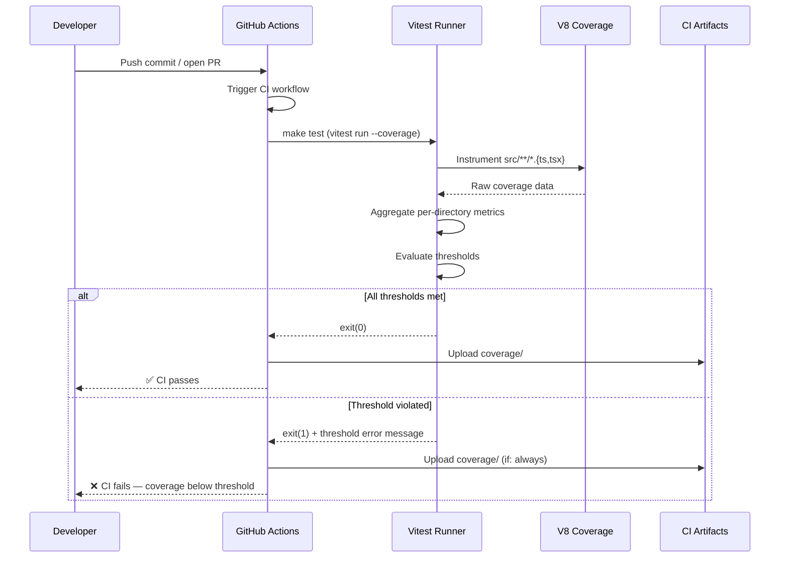
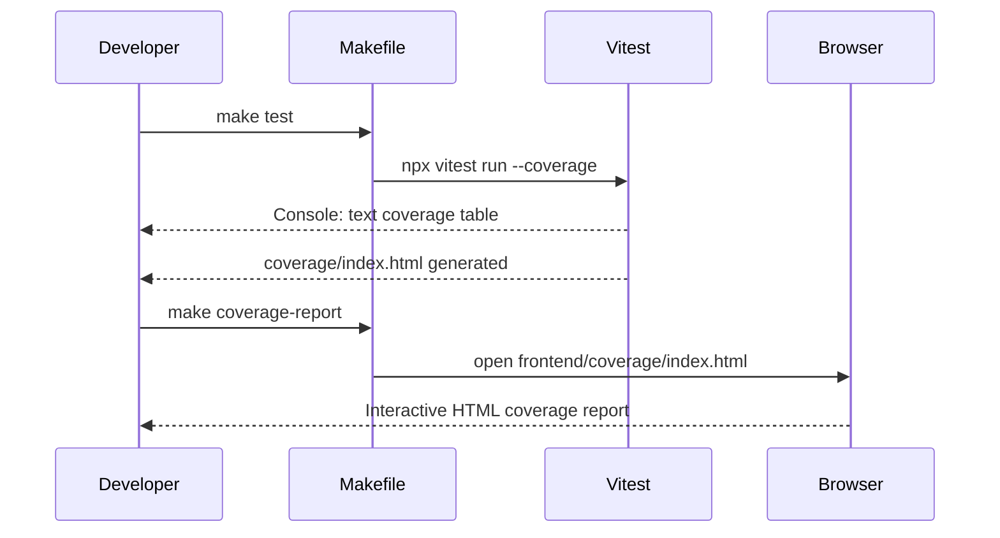

# Low-Level Design: NFR-MAINT-001
## Enforce ≥60% State Logic and ≥50% Component Test Coverage in CI

**FR-ID:** NFR-MAINT-001  
**Issue:** [#37](https://github.com/sreenivasmrpivot/legobuilder/issues/37)  
**Status:** Draft — Pending Design Review (Gate 6a)  
**Author:** Spectra Design Agent  
**Date:** 2026-04-12  

---

## 1. Overview

This document defines the low-level design for enforcing measurable test coverage thresholds in the LegoBuilder CI pipeline. The goal is to guarantee that:

- **State logic modules** (`frontend/src/stores/`, `frontend/src/engine/`) maintain **≥60% line coverage**.
- **React component modules** (`frontend/src/components/`) maintain **≥50% line coverage**.
- **CI fails** automatically when either threshold is not met, preventing regressions in test quality.

This is a **pure frontend / CI configuration** change. No backend services exist in this repository. All coverage is measured via Vitest with the `@vitest/coverage-v8` provider.

---

## 2. Scope

| In Scope | Out of Scope |
|---|---|
| `frontend/vitest.config.ts` — per-directory coverage thresholds | Backend coverage (no backend in repo) |
| `Makefile` — `test` target updated to run `--coverage` | E2E / Playwright coverage |
| `.github/workflows/` — CI workflow uploads coverage artifact | Visual regression coverage |
| `frontend/package.json` — ensure `@vitest/coverage-v8` is a dev dependency | Third-party library coverage |

---

## 3. Component Architecture

```
LegoBuilder CI Coverage Enforcement
│
├── frontend/vitest.config.ts          ← Coverage provider + per-directory thresholds
│   ├── provider: @vitest/coverage-v8
│   ├── include: ["src/**/*.{ts,tsx}"]
│   ├── exclude: ["src/main.tsx", "src/vite-env.d.ts", "src/**/*.d.ts"]
│   └── thresholds:
│       ├── "src/stores/**": { lines: 60, functions: 60, branches: 60, statements: 60 }
│       ├── "src/engine/**": { lines: 60, functions: 60, branches: 60, statements: 60 }
│       └── "src/components/**": { lines: 50, functions: 50, branches: 50, statements: 50 }
│
├── Makefile (test target)
│   └── cd frontend && npx vitest run --coverage
│
└── .github/workflows/ci.yml (or equivalent)
    ├── step: Run tests with coverage
    │   └── run: make test
    └── step: Upload coverage report
        └── uses: actions/upload-artifact@v4
            └── path: frontend/coverage/
```

---

## 4. Vitest Configuration Design

### 4.1 Coverage Provider Selection

| Provider | Rationale |
|---|---|
| `@vitest/coverage-v8` | **Selected.** Native V8 instrumentation — zero Babel transform overhead, accurate for TypeScript/TSX, supported in Vitest ≥0.34. |
| `@vitest/coverage-istanbul` | Alternative. Requires Babel plugin, heavier setup. Not selected. |

### 4.2 `vitest.config.ts` — Updated Configuration

```typescript
// frontend/vitest.config.ts
import { defineConfig } from 'vitest/config';
import react from '@vitejs/plugin-react';

export default defineConfig({
  plugins: [react()],
  test: {
    globals: true,
    environment: 'jsdom',
    setupFiles: ['./src/test-setup.ts'],  // if exists
    coverage: {
      provider: 'v8',
      reporter: ['text', 'json', 'html', 'lcov'],
      reportsDirectory: './coverage',
      include: ['src/**/*.{ts,tsx}'],
      exclude: [
        'src/main.tsx',
        'src/vite-env.d.ts',
        'src/**/*.d.ts',
        'src/**/*.stories.{ts,tsx}',
        'src/types/**',
        'src/constants/**',
      ],
      thresholds: {
        // State logic: stores + engine — ≥60%
        'src/stores/**': {
          lines: 60,
          functions: 60,
          branches: 60,
          statements: 60,
        },
        'src/engine/**': {
          lines: 60,
          functions: 60,
          branches: 60,
          statements: 60,
        },
        // React components — ≥50%
        'src/components/**': {
          lines: 50,
          functions: 50,
          branches: 50,
          statements: 50,
        },
      },
    },
  },
});
```

> **Note:** The `thresholds` object in `@vitest/coverage-v8` supports glob-pattern keys for per-directory enforcement. When a threshold is not met, Vitest exits with a non-zero code, causing CI to fail.

### 4.3 Threshold Enforcement Mechanism

```
Vitest run --coverage
    │
    ├── Collects V8 coverage for all instrumented files
    ├── Aggregates per-file line/branch/function/statement counts
    ├── Evaluates each threshold glob pattern
    │   ├── src/stores/** → checks lines ≥ 60%
    │   ├── src/engine/** → checks lines ≥ 60%
    │   └── src/components/** → checks lines ≥ 50%
    └── If ANY threshold fails:
        └── process.exit(1)  ← CI step fails → build blocked
```

---

## 5. Makefile Design

### 5.1 Current State (assumed)

```makefile
test:
	cd frontend && npx vitest run
```

### 5.2 Updated `test` Target

```makefile
test:
	cd frontend && npx vitest run --coverage

# Optional: separate target for watch mode (no coverage)
test-watch:
	cd frontend && npx vitest

# Optional: open HTML coverage report
coverage-report:
	open frontend/coverage/index.html
```

> **Rationale:** Adding `--coverage` to the `test` target ensures every CI run enforces thresholds. The `--coverage` flag activates the `coverage` block in `vitest.config.ts`.

---

## 6. CI Workflow Design

### 6.1 GitHub Actions Workflow Step (`.github/workflows/ci.yml`)

If a CI workflow file exists, the following steps must be present in the test job:

```yaml
- name: Run tests with coverage
  working-directory: frontend
  run: npx vitest run --coverage

- name: Upload coverage report
  if: always()   # upload even on failure for debugging
  uses: actions/upload-artifact@v4
  with:
    name: coverage-report
    path: frontend/coverage/
    retention-days: 14
```

### 6.2 CI Failure Behaviour

| Scenario | Vitest Exit Code | CI Result |
|---|---|---|
| All thresholds met | 0 | ✅ Pass |
| `src/stores/**` lines < 60% | 1 | ❌ Fail |
| `src/engine/**` lines < 60% | 1 | ❌ Fail |
| `src/components/**` lines < 50% | 1 | ❌ Fail |
| Test suite has failures | 1 | ❌ Fail |

---

## 7. Data Models / File Targets

No new data models are introduced. The following source directories are the coverage targets:

### 7.1 State Logic Modules (≥60% target)

| Directory | Description | Coverage Target |
|---|---|---|
| `frontend/src/stores/` | Zustand/Jotai/Valtio state stores | ≥60% lines |
| `frontend/src/engine/` | Pure logic: placement engine, collision detection, grid math | ≥60% lines |

### 7.2 Component Modules (≥50% target)

| Directory | Description | Coverage Target |
|---|---|---|
| `frontend/src/components/` | React UI components (Canvas, Toolbar, BrickPalette, etc.) | ≥50% lines |

### 7.3 Excluded from Coverage Enforcement

| Path | Reason |
|---|---|
| `frontend/src/main.tsx` | App bootstrap — not unit-testable in isolation |
| `frontend/src/vite-env.d.ts` | Type declarations only |
| `frontend/src/types/**` | TypeScript interfaces — no executable code |
| `frontend/src/constants/**` | Static data — no logic to test |
| `frontend/src/**/*.d.ts` | Declaration files |

---

## 8. Sequence Diagrams

### 8.1 CI Coverage Enforcement Flow



### 8.2 Developer Workflow (Local)



---

## 9. Error Handling Strategy

### 9.1 Threshold Violation

- **Detection:** Vitest prints a table showing which directories failed and by how much.
- **CI Response:** Non-zero exit code blocks PR merge via branch protection rules.
- **Developer Response:** Run `make test` locally, inspect `frontend/coverage/index.html` to identify uncovered lines, add tests.

### 9.2 Missing Coverage Provider

- **Detection:** Vitest throws `Error: Coverage provider 'v8' not found`.
- **Resolution:** Ensure `@vitest/coverage-v8` is in `devDependencies` in `frontend/package.json`.
- **CI Guard:** `npm ci` (or `npm install`) in CI installs all devDependencies before running tests.

### 9.3 Empty Directory (No Files Yet)

- **Scenario:** A target directory (e.g., `src/stores/`) has no `.ts` files yet.
- **Behaviour:** Vitest reports 0% coverage for the glob — threshold fails.
- **Mitigation:** Thresholds only activate once implementation PRs land. The NFR-MAINT-001 configuration PR should be merged after at least one file exists in each target directory, OR the threshold can be set to `0` initially and raised as coverage grows.
- **Decision:** Thresholds are set to final values (60%/50%) from day one. CI will fail until implementation PRs provide sufficient coverage. This is the correct enforcement posture.

### 9.4 Glob Pattern Mismatch

- **Risk:** Vitest threshold globs are relative to the `root` (project root), not `reportsDirectory`.
- **Mitigation:** Use `src/stores/**` (relative to `frontend/`) as the glob key, consistent with the `include` pattern.

---

## 10. Security Considerations

| Concern | Assessment | Mitigation |
|---|---|---|
| Coverage data exposure | Coverage HTML reports may expose internal file paths | Reports are CI artifacts, not deployed to production |
| Dependency supply chain | `@vitest/coverage-v8` is a first-party Vitest package | Pin to a specific version in `package.json` |
| CI secret leakage | Coverage reports do not contain secrets | No mitigation needed |
| Threshold bypass | Developer could lower thresholds to pass CI | Thresholds are in version-controlled `vitest.config.ts`; changes require PR review |

---

## 11. Test Cases

| Test ID | Description | Acceptance Criterion |
|---|---|---|
| T-BE-MAINT-001-01 | Vitest coverage for `src/stores/**` meets ≥60% | CI passes; `vitest run --coverage` exits 0 when stores coverage ≥60% |
| T-FE-MAINT-001-01 | Vitest coverage for `src/components/**` meets ≥50% | CI passes; `vitest run --coverage` exits 0 when component coverage ≥50% |
| T-NFR-MAINT-001-02 | CI fails when `src/engine/**` coverage drops below 60% | Vitest exits 1; CI step marked failed |
| T-NFR-MAINT-001-03 | Coverage HTML report uploaded as CI artifact | `frontend/coverage/` artifact present in GitHub Actions run |

---

## 12. Implementation Checklist

The following changes are required in the implementation PR (separate from this design PR):

- [ ] Update `frontend/vitest.config.ts` — add `coverage` block with `provider: 'v8'`, `thresholds`, `include`, `exclude`
- [ ] Add `@vitest/coverage-v8` to `frontend/package.json` devDependencies (if not already present)
- [ ] Update `Makefile` `test` target to include `--coverage` flag
- [ ] Add/update `.github/workflows/ci.yml` to upload `frontend/coverage/` as artifact
- [ ] Verify `frontend/coverage/` is in `.gitignore`
- [ ] Run `make test` locally to confirm thresholds pass with existing test suite

---

## 13. Dependencies

| Dependency | Version | Purpose |
|---|---|---|
| `vitest` | ≥1.0.0 | Test runner |
| `@vitest/coverage-v8` | ≥1.0.0 | V8 coverage provider |
| `@vitejs/plugin-react` | ≥4.0.0 | React JSX transform for Vitest |
| `jsdom` | ≥20.0.0 | DOM environment for component tests |

> This NFR depends on all FR implementation issues being completed, as coverage thresholds require actual test files to exist.

---

## 14. Open Questions

| # | Question | Owner | Resolution |
|---|---|---|---|
| 1 | Should `src/hooks/**` have a coverage threshold? | Tech Lead | Not specified in issue; recommend adding ≥50% in a follow-up |
| 2 | Should `src/utils/**` have a coverage threshold? | Tech Lead | Not specified in issue; recommend adding ≥60% in a follow-up |
| 3 | Is there an existing `.github/workflows/ci.yml`? | DevOps | Check repo; if absent, a new workflow file is needed |
| 4 | Should `@vitest/coverage-istanbul` be kept as fallback? | Tech Lead | Not recommended — adds complexity; V8 is sufficient |

---

*Generated by Spectra Design Agent — NFR-MAINT-001 | Issue #37*
