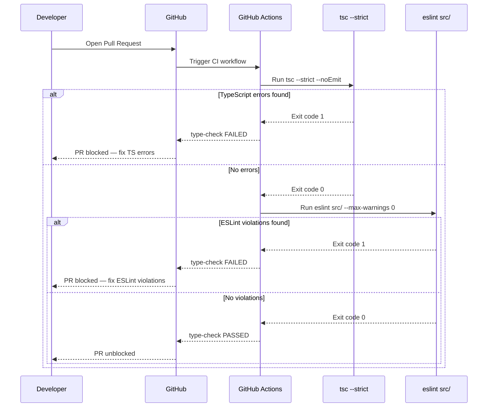
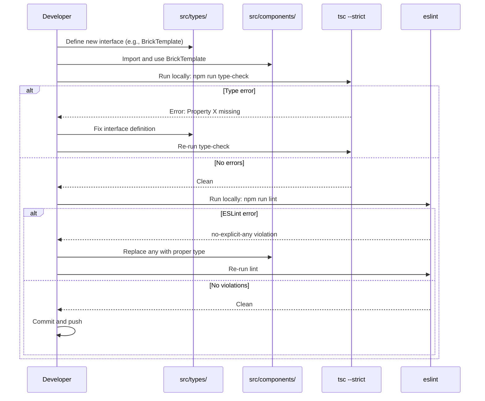
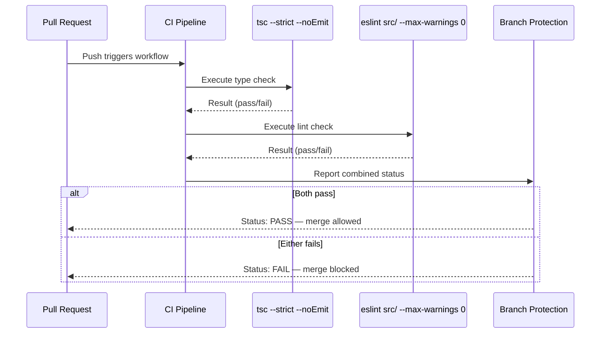

# Low-Level Design: NFR-MAINT-002
## Enforce 100% TypeScript Strict Mode with Zero `any` Types in Production Code

**FR-ID:** NFR-MAINT-002
**Issue:** #38
**Status:** Draft — Pending Design Review (Gate 6a)
**Author:** Spectra Design Agent
**Date:** 2026-04-11

---

## 1. Overview

This document defines the low-level design for enforcing 100% TypeScript strict mode with zero `any` types across the LegoBuilder frontend codebase. The enforcement is achieved through a combination of compiler configuration, ESLint rules, and CI pipeline gates that prevent any regression from being merged.

This is a **non-functional requirement** (maintainability / type safety). It does not introduce new user-visible features but establishes a quality gate that all future code must pass.

---

## 2. Scope

| In Scope | Out of Scope |
|---|---|
| `frontend/src/**/*.ts` and `frontend/src/**/*.tsx` | Third-party `node_modules` |
| `frontend/tsconfig.json` strict flags | Test files (`*.test.ts`, `*.spec.ts`) — covered by separate tsconfig |
| `frontend/eslint.config.js` `no-explicit-any` rule | Backend code (no backend in this repo) |
| GitHub Actions CI workflow step | Auto-fixing existing violations (manual remediation) |
| `frontend/src/types/` shared type definitions | `*.js` / `*.cjs` config files |

---

## 3. TypeScript Configuration Design

### 3.1 `tsconfig.json` — Strict Flags

The existing `frontend/tsconfig.json` must have the following compiler options enabled. All flags below are implied by `"strict": true` but are listed explicitly for auditability:

```jsonc
// frontend/tsconfig.json
{
  "compilerOptions": {
    // --- Strict mode umbrella (enables all flags below) ---
    "strict": true,

    // --- Individual strict flags (explicit for auditability) ---
    "strictNullChecks": true,          // null/undefined are not assignable to other types
    "strictFunctionTypes": true,       // Contravariant function parameter checking
    "strictBindCallApply": true,       // Strict bind/call/apply type checking
    "strictPropertyInitialization": true, // Class properties must be initialized
    "noImplicitAny": true,             // Error on implicit any inference
    "noImplicitThis": true,            // Error on implicit this type
    "alwaysStrict": true,              // Emit 'use strict' in all files

    // --- Additional safety flags (beyond strict umbrella) ---
    "noUncheckedIndexedAccess": true,  // Array/index access returns T | undefined
    "noImplicitReturns": true,         // All code paths must return a value
    "noFallthroughCasesInSwitch": true, // No fallthrough in switch statements
    "exactOptionalPropertyTypes": true, // Optional props cannot be set to undefined explicitly
    "useUnknownInCatchVariables": true, // catch(e) binds e as unknown, not any

    // --- Existing project settings (preserved) ---
    "target": "ES2020",
    "lib": ["ES2020", "DOM", "DOM.Iterable"],
    "module": "ESNext",
    "moduleResolution": "bundler",
    "jsx": "react-jsx",
    "esModuleInterop": true,
    "skipLibCheck": true,
    "resolveJsonModule": true,
    "isolatedModules": true,
    "noEmit": true
  },
  "include": ["src"],
  "exclude": ["node_modules", "dist"]
}
```

### 3.2 `tsconfig.test.json` — Test Relaxation

Test files (Vitest unit tests, Playwright e2e) may use `any` for mocking purposes. A separate tsconfig for tests relaxes only the `no-explicit-any` ESLint rule (not the compiler flags):

```jsonc
// frontend/tsconfig.test.json
{
  "extends": "./tsconfig.json",
  "compilerOptions": {
    // Tests still compile under strict mode.
    // ESLint no-explicit-any is overridden per-file via eslint-disable comments
    // or via the eslint.config.js overrides section (see Section 4.2).
  },
  "include": ["src", "tests"]
}
```

---

## 4. ESLint Configuration Design

### 4.1 Rule: `@typescript-eslint/no-explicit-any`

The ESLint rule `@typescript-eslint/no-explicit-any` must be set to `"error"` in the production source scope. This prevents any `any` type annotation from being introduced, even when the TypeScript compiler would accept it (e.g., explicit `as any` casts).

```js
// frontend/eslint.config.js — relevant section
import tseslint from 'typescript-eslint';

export default tseslint.config(
  // ... existing config ...
  {
    // Production source files only
    files: ['src/**/*.ts', 'src/**/*.tsx'],
    rules: {
      '@typescript-eslint/no-explicit-any': 'error',
      '@typescript-eslint/no-unsafe-assignment': 'error',
      '@typescript-eslint/no-unsafe-call': 'error',
      '@typescript-eslint/no-unsafe-member-access': 'error',
      '@typescript-eslint/no-unsafe-return': 'error',
      '@typescript-eslint/no-unsafe-argument': 'error',
    },
  },
  {
    // Test files — relax no-explicit-any for mocking
    files: ['src/**/*.test.ts', 'src/**/*.test.tsx', 'tests/**/*.ts'],
    rules: {
      '@typescript-eslint/no-explicit-any': 'warn',  // warn, not error
      '@typescript-eslint/no-unsafe-assignment': 'off',
    },
  }
);
```

### 4.2 Companion Rules

The following companion rules are enabled alongside `no-explicit-any` to close common escape hatches:

| Rule | Severity | Rationale |
|---|---|---|
| `@typescript-eslint/no-explicit-any` | `error` | Primary enforcement |
| `@typescript-eslint/no-unsafe-assignment` | `error` | Prevents `any` spreading via assignment |
| `@typescript-eslint/no-unsafe-call` | `error` | Prevents calling `any`-typed values |
| `@typescript-eslint/no-unsafe-member-access` | `error` | Prevents property access on `any` |
| `@typescript-eslint/no-unsafe-return` | `error` | Prevents returning `any` from typed functions |
| `@typescript-eslint/no-unsafe-argument` | `error` | Prevents passing `any` to typed parameters |
| `@typescript-eslint/consistent-type-imports` | `error` | Enforces `import type` for type-only imports |
| `@typescript-eslint/prefer-as-const` | `error` | Prefers `as const` over literal type assertions |

---

## 5. Type System Architecture

### 5.1 Shared Type Definitions (`frontend/src/types/`)

All shared domain types live in `frontend/src/types/`. These files are the single source of truth for the type system. No `any` is permitted in these files.

```
frontend/src/types/
├── brick.ts       — BrickId, BrickColor, BrickSize, PlacedBrick, BrickTemplate
├── scene.ts       — SceneState, GridPosition, Viewport, RenderLayer
├── commands.ts    — Command<T>, CommandResult, UndoStack
└── project.ts     — Project, ProjectMetadata, SaveState
```

### 5.2 Generic Patterns (Preferred over `any`)

When flexible typing is needed, generics are the approved pattern:

```typescript
// ❌ Forbidden
function processEvent(event: any): void { ... }

// ✅ Approved — generic with constraint
function processEvent<T extends Event>(event: T): void { ... }

// ❌ Forbidden
const cache: Record<string, any> = {};

// ✅ Approved — generic cache
const cache = new Map<string, BrickTemplate>();

// ❌ Forbidden
function parseJSON(raw: string): any { ... }

// ✅ Approved — unknown + type guard
function parseJSON(raw: string): unknown { ... }
function isBrick(value: unknown): value is PlacedBrick { ... }
```

### 5.3 `unknown` as the Safe Alternative

For values whose type cannot be statically known (e.g., JSON parsing, external events, error objects), `unknown` is the approved alternative to `any`:

| Scenario | Forbidden | Approved |
|---|---|---|
| JSON.parse result | `any` | `unknown` + type guard |
| catch clause variable | `any` (pre-TS 4.4) | `unknown` (useUnknownInCatchVariables: true) |
| Dynamic import result | `any` | typed import or `unknown` |
| Event handler payload | `any` | `Event` subtype or generic `<T extends Event>` |
| Third-party callback | `any` | `Parameters<typeof callback>` |

### 5.4 Type Guard Pattern

```typescript
// Standard type guard pattern for unknown values
function isPlacedBrick(value: unknown): value is PlacedBrick {
  return (
    typeof value === 'object' &&
    value !== null &&
    'id' in value &&
    'position' in value &&
    'color' in value
  );
}

// Usage
const parsed: unknown = JSON.parse(raw);
if (isPlacedBrick(parsed)) {
  // parsed is now PlacedBrick — fully typed
  scene.addBrick(parsed);
}
```

---

## 6. CI Pipeline Design

### 6.1 GitHub Actions Workflow Step

A dedicated `type-check` job is added to the CI workflow (`.github/workflows/ci.yml`). It runs on every PR and push to `main`:

```yaml
# .github/workflows/ci.yml — type-check job
jobs:
  type-check:
    name: TypeScript Strict Check
    runs-on: ubuntu-latest
    defaults:
      run:
        working-directory: frontend
    steps:
      - uses: actions/checkout@v4

      - uses: actions/setup-node@v4
        with:
          node-version: '20'
          cache: 'npm'
          cache-dependency-path: frontend/package-lock.json

      - name: Install dependencies
        run: npm ci

      - name: TypeScript strict check
        run: npx tsc --strict --noEmit
        # Fails the job if any TypeScript error is found.
        # Exit code 1 = errors present; exit code 0 = clean.

      - name: ESLint no-explicit-any check
        run: npx eslint src/ --max-warnings 0
        # --max-warnings 0 means any warning or error fails the job.
        # no-explicit-any is set to 'error' so any any type fails here.
```

### 6.2 CI Gate Sequence



### 6.3 Branch Protection Rule

The `type-check` CI job must be added to the required status checks for the `main` branch:

| Setting | Value |
|---|---|
| Required status check name | `TypeScript Strict Check` |
| Require branches to be up to date | `true` |
| Applies to | `main` branch |
| Bypass allowed for | Repository admins only |

---

## 7. Component Architecture

### 7.1 Affected Modules

All modules under `frontend/src/` are in scope. The table below maps each module to its primary type-safety concern:

| Module | Path | Primary Concern |
|---|---|---|
| Types | `src/types/` | Source of truth — zero `any` mandatory |
| Components | `src/components/` | React prop types, event handler types |
| Stores | `src/stores/` | Zustand state shape, action parameter types |
| Hooks | `src/hooks/` | Return type annotations, generic constraints |
| Engine | `src/engine/` | 3D math types, Three.js wrapper types |
| Services | `src/services/` | API response types, serialization types |
| Utils | `src/utils/` | Generic utility function signatures |
| Errors | `src/errors/` | Custom error class hierarchies |

### 7.2 Dependency Flow

```mermaid
graph TD
    A[src/types/] -->|imported by| B[src/stores/]
    A -->|imported by| C[src/engine/]
    A -->|imported by| D[src/services/]
    A -->|imported by| E[src/components/]
    A -->|imported by| F[src/hooks/]
    A -->|imported by| G[src/utils/]
    B -->|imported by| E
    C -->|imported by| E
    D -->|imported by| F
    F -->|imported by| E
    G -->|imported by all|
    H[src/errors/] -->|imported by| D
    H -->|imported by| C
```

### 7.3 Type Annotation Requirements per Module

#### `src/types/` — Domain Types
- All exported interfaces and types must be fully annotated.
- No `any`, no `object`, no `Function` (use specific signatures).
- Use `readonly` for immutable fields.

#### `src/components/` — React Components
- All component props must have explicit interface definitions.
- Event handlers: use `React.ChangeEvent<HTMLInputElement>`, `React.MouseEvent<HTMLButtonElement>`, etc.
- `children` prop: use `React.ReactNode` (not `any`).
- Ref types: use `React.RefObject<HTMLDivElement>` (not `any`).

#### `src/stores/` — Zustand Stores
- Store state interface must be fully typed.
- Action functions must have explicit parameter and return types.
- `immer` produce callbacks: use typed draft `Draft<StateType>`.

#### `src/engine/` — 3D Engine
- Three.js objects: use `THREE.Mesh`, `THREE.Scene`, etc. (not `any`).
- Geometry/material types: use specific Three.js generics.
- Raycaster intersections: use `THREE.Intersection<THREE.Object3D>`.

#### `src/hooks/` — Custom Hooks
- All hooks must declare explicit return types.
- Generic hooks must use constrained type parameters.

#### `src/services/` — Data Services
- All service functions must have explicit return types.
- JSON parsing must use `unknown` + type guards.
- `localStorage` reads must use `unknown` + type guards.

---

## 8. Error Handling Strategy

### 8.1 Type-Safe Error Handling

With `useUnknownInCatchVariables: true`, all `catch` clauses receive `unknown`. The approved pattern:

```typescript
// Standard error handling pattern
function handleError(error: unknown): string {
  if (error instanceof Error) {
    return error.message;
  }
  if (typeof error === 'string') {
    return error;
  }
  return 'An unknown error occurred';
}

// Usage in try/catch
try {
  await saveProject(project);
} catch (error: unknown) {
  const message = handleError(error);
  showErrorToast(message);
}
```

### 8.2 Custom Error Classes

```typescript
// src/errors/LegoBuilderError.ts
export class LegoBuilderError extends Error {
  readonly code: string;

  constructor(message: string, code: string) {
    super(message);
    this.name = 'LegoBuilderError';
    this.code = code;
    // Maintains proper prototype chain in transpiled code
    Object.setPrototypeOf(this, LegoBuilderError.prototype);
  }
}

export class BrickPlacementError extends LegoBuilderError {
  readonly position: { x: number; y: number; z: number };

  constructor(
    message: string,
    position: { x: number; y: number; z: number }
  ) {
    super(message, 'BRICK_PLACEMENT_ERROR');
    this.position = position;
    Object.setPrototypeOf(this, BrickPlacementError.prototype);
  }
}
```

---

## 9. Security Considerations

| Concern | Risk | Mitigation |
|---|---|---|
| `any` bypasses type checks | High — runtime errors, XSS via untyped DOM manipulation | `no-explicit-any: error` + `no-unsafe-*` rules |
| JSON.parse from untrusted sources | Medium — unexpected shape causes runtime crash | `unknown` return type + type guards before use |
| `as any` cast to bypass checks | High — silently disables type safety | ESLint `no-explicit-any` catches explicit casts |
| Third-party library `any` leakage | Low — `skipLibCheck: true` isolates lib types | Wrapper types around third-party APIs |
| `localStorage` data tampering | Medium — stored data may not match expected shape | `unknown` + type guard on all reads |

---

## 10. Sequence Diagrams

### 10.1 Developer Workflow — Introducing a New Type



### 10.2 CI Enforcement Flow



---

## 11. Implementation Plan

### Phase 1: Configuration (No Code Changes)
1. Update `frontend/tsconfig.json` — add `noUncheckedIndexedAccess`, `noImplicitReturns`, `noFallthroughCasesInSwitch`, `exactOptionalPropertyTypes`, `useUnknownInCatchVariables`.
2. Update `frontend/eslint.config.js` — add `no-explicit-any: error` and companion `no-unsafe-*` rules for `src/**`.
3. Add `tsconfig.test.json` for test-specific overrides.
4. Add CI workflow file `.github/workflows/ci.yml` with `type-check` job.

### Phase 2: Remediation (Fix Existing Violations)
1. Run `tsc --strict --noEmit` locally — capture all errors.
2. Run `eslint src/ --max-warnings 0` locally — capture all violations.
3. Fix violations module by module, starting with `src/types/` (foundation).
4. Order: `types/` → `errors/` → `utils/` → `services/` → `stores/` → `hooks/` → `engine/` → `components/`.

### Phase 3: CI Integration
1. Add `type-check` job to CI workflow.
2. Add `TypeScript Strict Check` to required status checks on `main`.
3. Verify CI passes on a clean branch.

---

## 12. Test Cases

| Test ID | Description | Verification Method |
|---|---|---|
| T-BE-MAINT-002-01 | `tsc --strict --noEmit` exits with code 0 on full codebase | CI job exit code |
| T-BE-MAINT-002-02 | `eslint src/ --max-warnings 0` exits with code 0 | CI job exit code |
| T-BE-MAINT-002-03 | PR introducing `any` type causes CI failure | Manual test: add `any`, open PR, verify CI fails |
| T-BE-MAINT-002-04 | `unknown` + type guard pattern compiles cleanly | Unit test: compile type guard file |

---

## 13. Acceptance Criteria Mapping

| Acceptance Criterion | Design Element | Section |
|---|---|---|
| `tsc --strict --noEmit` reports zero errors in CI | tsconfig.json strict flags + CI job | §3.1, §6.1 |
| `no-explicit-any` reports zero violations on `src/` | ESLint rule + companion rules | §4.1, §4.2 |
| PR introducing `any` fails CI | Branch protection + required status check | §6.3 |

---

## 14. Open Questions

| # | Question | Impact | Owner |
|---|---|---|---|
| 1 | Should `noUncheckedIndexedAccess` be enabled? It is stricter than `strict: true` and may require many `?? defaultValue` additions. | Medium — may increase remediation effort | Tech Lead |
| 2 | Should test files be fully strict or allow `no-explicit-any: warn`? | Low — affects test authoring ergonomics | Team |
| 3 | Are there existing `// @ts-ignore` or `// @ts-expect-error` comments that suppress errors? | High — must be audited and removed or justified | Dev |

---

*Generated by Spectra Design Agent — Gate 6a approval required before implementation.*
