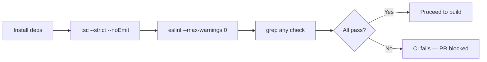
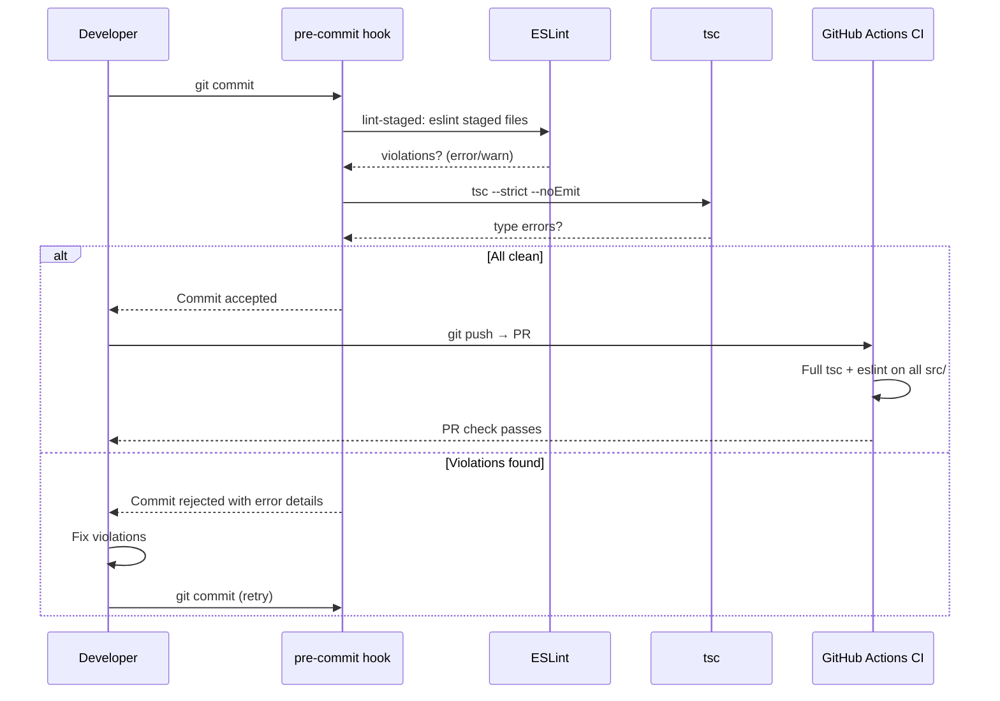
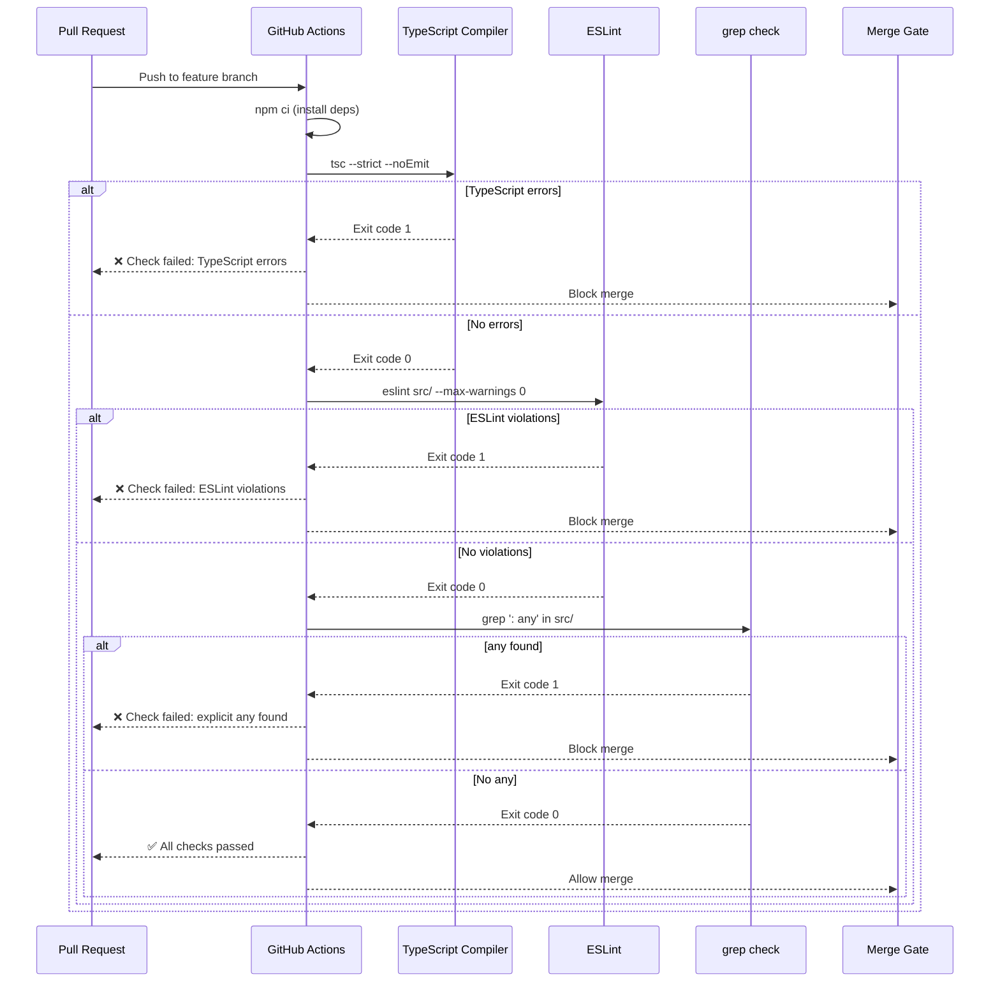
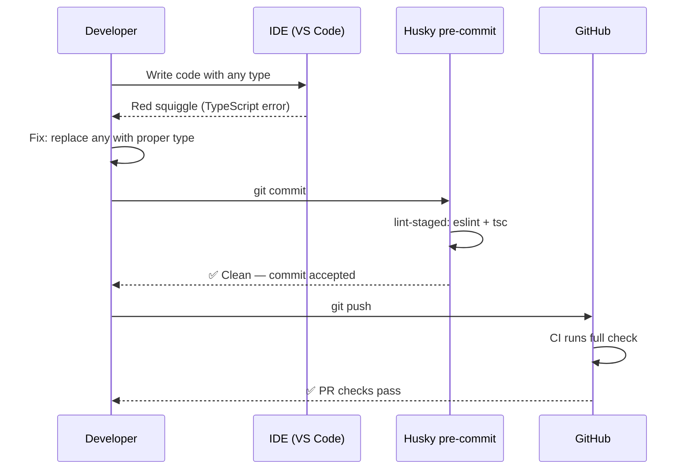
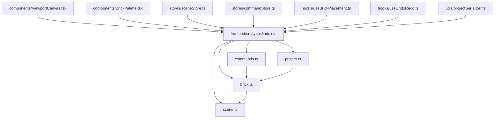

# Low-Level Design: NFR-MAINT-002 — TypeScript Strict Mode Enforcement

**FR-ID:** NFR-MAINT-002
**Issue:** #38
**Title:** Enforce 100% TypeScript strict mode with zero `any` types in production code
**Author:** Design Agent (Spectra Framework)
**Status:** Draft — Awaiting Gate 6a Design Review
**Date:** 2026-04-11

---

## 1. Overview

This document defines the low-level design for enforcing 100% TypeScript strict mode across the LegoBuilder frontend codebase. This is a non-functional requirement (NFR) focused on maintainability and type safety. The enforcement is achieved through a combination of TypeScript compiler configuration, ESLint rules, and CI pipeline gates — not through runtime code changes.

### 1.1 Scope

| In Scope | Out of Scope |
|---|---|
| `tsconfig.json` strict mode flags | Runtime type guards (covered by individual FRs) |
| ESLint `no-explicit-any` rule configuration | Third-party library type definitions |
| CI pipeline type-check and lint steps | Test files (may use `any` with justification) |
| Shared type definitions in `frontend/src/types/` | Node.js / build tooling scripts |
| Developer workflow (pre-commit hooks) | Backend code (no backend in this SPA) |

### 1.2 Goals

- Zero TypeScript errors when `tsc --strict --noEmit` runs in CI.
- Zero ESLint `no-explicit-any` violations in `src/` production code.
- Any PR introducing an `any` type causes CI to fail automatically.
- All shared types are centralized in `frontend/src/types/` for discoverability.

---

## 2. TypeScript Configuration Design

### 2.1 `tsconfig.json` — Strict Mode Flags

The root `tsconfig.json` (at `frontend/tsconfig.json`) SHALL include the following compiler options:

```json
{
  "compilerOptions": {
    "strict": true,
    "noImplicitAny": true,
    "strictNullChecks": true,
    "strictFunctionTypes": true,
    "strictBindCallApply": true,
    "strictPropertyInitialization": true,
    "noImplicitThis": true,
    "alwaysStrict": true,
    "noUncheckedIndexedAccess": true,
    "noImplicitReturns": true,
    "noFallthroughCasesInSwitch": true,
    "exactOptionalPropertyTypes": false,
    "useUnknownInCatchVariables": true,
    "target": "ES2020",
    "module": "ESNext",
    "moduleResolution": "bundler",
    "jsx": "react-jsx",
    "lib": ["ES2020", "DOM", "DOM.Iterable"],
    "baseUrl": ".",
    "paths": {
      "@/*": ["src/*"]
    },
    "skipLibCheck": true,
    "esModuleInterop": true,
    "allowSyntheticDefaultImports": true,
    "resolveJsonModule": true,
    "isolatedModules": true,
    "noEmit": true
  },
  "include": ["src"],
  "exclude": ["node_modules", "dist", "**/*.test.ts", "**/*.test.tsx", "**/*.spec.ts", "**/*.spec.tsx"]
}
```

**Key decisions:**

| Flag | Value | Rationale |
|---|---|---|
| `strict` | `true` | Enables all strict sub-flags as a group |
| `noUncheckedIndexedAccess` | `true` | Array/object index access returns `T \| undefined`, preventing silent runtime errors |
| `useUnknownInCatchVariables` | `true` | Catch clause variables typed as `unknown` instead of `any` |
| `noImplicitReturns` | `true` | All code paths in functions must return a value |
| `exactOptionalPropertyTypes` | `false` | Deferred — too strict for initial adoption; can be enabled incrementally |
| `skipLibCheck` | `true` | Avoids failures from third-party `.d.ts` files with loose types |
| `noEmit` | `true` | Type-check only; Vite handles transpilation |

### 2.2 `tsconfig.test.json` — Test Relaxation

Test files may use `any` in limited, justified cases (e.g., mocking). A separate test config extends the base:

```json
{
  "extends": "./tsconfig.json",
  "compilerOptions": {
    "noUncheckedIndexedAccess": false
  },
  "include": ["src", "**/*.test.ts", "**/*.test.tsx", "**/*.spec.ts", "**/*.spec.tsx"]
}
```

ESLint will still enforce `no-explicit-any` in test files but with a `warn` severity (not `error`) to allow controlled test mocking patterns.

---

## 3. ESLint Configuration Design

### 3.1 Rule Configuration

The `.eslintrc.cjs` (or `eslint.config.js` for flat config) SHALL include:

```js
// .eslintrc.cjs
module.exports = {
  root: true,
  parser: '@typescript-eslint/parser',
  parserOptions: {
    project: './tsconfig.json',
    tsconfigRootDir: __dirname,
    ecmaVersion: 'latest',
    sourceType: 'module',
  },
  plugins: ['@typescript-eslint'],
  extends: [
    'eslint:recommended',
    'plugin:@typescript-eslint/recommended-type-checked',
    'plugin:@typescript-eslint/stylistic-type-checked',
    'plugin:react-hooks/recommended',
    'plugin:react/recommended',
    'plugin:react/jsx-runtime',
  ],
  rules: {
    // Core type-safety rules
    '@typescript-eslint/no-explicit-any': 'error',
    '@typescript-eslint/no-unsafe-assignment': 'error',
    '@typescript-eslint/no-unsafe-call': 'error',
    '@typescript-eslint/no-unsafe-member-access': 'error',
    '@typescript-eslint/no-unsafe-return': 'error',
    '@typescript-eslint/no-unsafe-argument': 'error',

    // Prefer type-safe alternatives
    '@typescript-eslint/prefer-as-const': 'error',
    '@typescript-eslint/consistent-type-imports': ['error', { prefer: 'type-imports' }],
    '@typescript-eslint/consistent-type-definitions': ['error', 'interface'],
    '@typescript-eslint/no-non-null-assertion': 'warn',

    // Catch clause
    '@typescript-eslint/use-unknown-in-catch-variables': 'error',

    // Generics over any
    '@typescript-eslint/no-unnecessary-type-assertion': 'error',
    '@typescript-eslint/no-redundant-type-constituents': 'error',
  },
  overrides: [
    {
      // Relax rules for test files
      files: ['**/*.test.ts', '**/*.test.tsx', '**/*.spec.ts', '**/*.spec.tsx'],
      rules: {
        '@typescript-eslint/no-explicit-any': 'warn',
        '@typescript-eslint/no-unsafe-assignment': 'off',
        '@typescript-eslint/no-unsafe-call': 'off',
        '@typescript-eslint/no-unsafe-member-access': 'off',
      },
    },
  ],
  settings: {
    react: { version: 'detect' },
  },
};
```

### 3.2 Rule Rationale

| Rule | Severity | Rationale |
|---|---|---|
| `no-explicit-any` | `error` | Primary enforcement — zero `any` in production |
| `no-unsafe-assignment` | `error` | Prevents `any` from propagating through assignments |
| `no-unsafe-call` | `error` | Prevents calling `any`-typed values as functions |
| `no-unsafe-member-access` | `error` | Prevents property access on `any`-typed values |
| `no-unsafe-return` | `error` | Prevents returning `any` from typed functions |
| `no-unsafe-argument` | `error` | Prevents passing `any` to typed function parameters |
| `consistent-type-imports` | `error` | Enforces `import type` for type-only imports (tree-shaking) |
| `no-non-null-assertion` | `warn` | Discourages `!` operator; prefer explicit null checks |

---

## 4. Shared Type Definitions

### 4.1 Directory Structure

```
frontend/src/types/
├── brick.ts          # BrickId, BrickColor, BrickDimensions, PlacedBrick
├── scene.ts          # SceneState, CameraState, GridConfig
├── commands.ts       # Command, CommandType, UndoableCommand
├── project.ts        # LegoProject, ProjectMetadata, SaveState
└── index.ts          # Re-exports all types for clean imports
```

### 4.2 Type Module Contracts

#### `brick.ts`

```typescript
// frontend/src/types/brick.ts

export type BrickId = string & { readonly __brand: 'BrickId' };

export interface BrickColor {
  readonly hex: string;       // e.g. '#FF0000'
  readonly name: string;      // e.g. 'Red'
  readonly legoId: number;    // Official LEGO color ID
}

export interface BrickDimensions {
  readonly width: number;     // studs (X axis)
  readonly depth: number;     // studs (Z axis)
  readonly height: number;    // plates (Y axis)
}

export interface BrickPosition {
  readonly x: number;         // stud units
  readonly y: number;         // plate units
  readonly z: number;         // stud units
}

export type BrickRotation = 0 | 90 | 180 | 270;  // degrees around Y axis

export interface PlacedBrick {
  readonly id: BrickId;
  readonly partId: string;    // LEGO part number
  readonly color: BrickColor;
  readonly position: BrickPosition;
  readonly rotation: BrickRotation;
  readonly dimensions: BrickDimensions;
}
```

#### `scene.ts`

```typescript
// frontend/src/types/scene.ts

export interface CameraState {
  readonly azimuth: number;   // degrees
  readonly elevation: number; // degrees
  readonly distance: number;  // stud units
  readonly target: Readonly<{ x: number; y: number; z: number }>;
}

export interface GridConfig {
  readonly size: number;      // studs per side
  readonly visible: boolean;
  readonly color: string;     // hex
}

export interface SceneState {
  readonly bricks: ReadonlyMap<string, import('./brick').PlacedBrick>;
  readonly selectedBrickId: string | null;
  readonly camera: CameraState;
  readonly grid: GridConfig;
  readonly isLoading: boolean;
  readonly error: string | null;
}
```

#### `commands.ts`

```typescript
// frontend/src/types/commands.ts
import type { PlacedBrick, BrickId } from './brick';

export type CommandType =
  | 'PLACE_BRICK'
  | 'REMOVE_BRICK'
  | 'MOVE_BRICK'
  | 'ROTATE_BRICK'
  | 'CHANGE_COLOR';

export interface UndoableCommand {
  readonly type: CommandType;
  readonly timestamp: number;
  execute(): void;
  undo(): void;
}

export interface PlaceBrickCommand extends UndoableCommand {
  readonly type: 'PLACE_BRICK';
  readonly brick: PlacedBrick;
}

export interface RemoveBrickCommand extends UndoableCommand {
  readonly type: 'REMOVE_BRICK';
  readonly brickId: BrickId;
  readonly removedBrick: PlacedBrick; // stored for undo
}

export type Command = PlaceBrickCommand | RemoveBrickCommand;
```

#### `project.ts`

```typescript
// frontend/src/types/project.ts
import type { PlacedBrick } from './brick';

export interface ProjectMetadata {
  readonly id: string;
  readonly name: string;
  readonly createdAt: string;   // ISO 8601
  readonly updatedAt: string;   // ISO 8601
  readonly version: number;
}

export interface LegoProject {
  readonly metadata: ProjectMetadata;
  readonly bricks: readonly PlacedBrick[];
  readonly thumbnail?: string;  // base64 data URL
}

export type SaveState = 'unsaved' | 'saving' | 'saved' | 'error';
```

#### `index.ts` — Barrel Export

```typescript
// frontend/src/types/index.ts
export type { BrickId, BrickColor, BrickDimensions, BrickPosition, BrickRotation, PlacedBrick } from './brick';
export type { CameraState, GridConfig, SceneState } from './scene';
export type { CommandType, UndoableCommand, PlaceBrickCommand, RemoveBrickCommand, Command } from './commands';
export type { ProjectMetadata, LegoProject, SaveState } from './project';
```

### 4.3 Branded Types Pattern

To prevent accidental mixing of primitive types (e.g., passing a raw `string` where a `BrickId` is expected), branded types are used:

```typescript
// Pattern: Opaque/branded type
type BrickId = string & { readonly __brand: 'BrickId' };

// Factory function (type-safe constructor)
function createBrickId(raw: string): BrickId {
  return raw as BrickId; // Only place where cast is allowed
}
```

This pattern is the **only** approved use of type assertions (`as`) in production code.

### 4.4 Generics Over `any`

Where flexible typing is needed, generics SHALL be used instead of `any`:

```typescript
// ❌ Forbidden
function getValue(obj: any, key: string): any {
  return obj[key];
}

// ✅ Required
function getValue<T, K extends keyof T>(obj: T, key: K): T[K] {
  return obj[key];
}

// ❌ Forbidden — event handler
const handleEvent = (e: any) => { ... };

// ✅ Required — event handler
const handleEvent = (e: React.MouseEvent<HTMLButtonElement>) => { ... };
```

---

## 5. CI Pipeline Design

### 5.1 CI Steps (GitHub Actions)

The CI workflow SHALL include the following steps in order:

```yaml
# .github/workflows/ci.yml (relevant steps)
jobs:
  type-check-and-lint:
    name: Type Check & Lint
    runs-on: ubuntu-latest
    steps:
      - uses: actions/checkout@v4

      - name: Setup Node.js
        uses: actions/setup-node@v4
        with:
          node-version: '20'
          cache: 'npm'

      - name: Install dependencies
        run: npm ci
        working-directory: frontend

      - name: TypeScript strict type check
        run: npx tsc --strict --noEmit
        working-directory: frontend
        # Fails if ANY TypeScript error exists

      - name: ESLint — zero warnings
        run: npx eslint src/ --max-warnings 0 --ext .ts,.tsx
        working-directory: frontend
        # Fails if ANY lint warning or error exists

      - name: Check for any types (belt-and-suspenders)
        run: |
          if grep -rn ': any' src/ --include='*.ts' --include='*.tsx' | grep -v '.test.' | grep -v '.spec.'; then
            echo "ERROR: Explicit 'any' type found in production code"
            exit 1
          fi
        working-directory: frontend
        # Belt-and-suspenders grep check as a final safety net
```

### 5.2 Step Ordering Rationale



**Rationale for ordering:**
1. `tsc` runs first — catches structural type errors before linting.
2. `eslint` runs second — catches `any` usage and style violations.
3. `grep` runs last — belt-and-suspenders check for any edge cases ESLint misses.

### 5.3 PR Gate Behavior

| Scenario | CI Result | PR Status |
|---|---|---|
| Zero TypeScript errors, zero ESLint violations | ✅ Pass | Mergeable |
| TypeScript error introduced | ❌ Fail | Blocked |
| `any` type introduced in `src/` | ❌ Fail | Blocked |
| `any` in test file only | ⚠️ Warn | Mergeable (warn only) |
| Third-party `.d.ts` type error | ✅ Pass | `skipLibCheck: true` bypasses |

---

## 6. Pre-commit Hook Design (Developer Workflow)

To catch violations before CI, a pre-commit hook via `husky` + `lint-staged` SHALL be configured:

```json
// package.json (relevant sections)
{
  "scripts": {
    "type-check": "tsc --strict --noEmit",
    "lint": "eslint src/ --max-warnings 0 --ext .ts,.tsx",
    "lint:fix": "eslint src/ --fix --ext .ts,.tsx",
    "prepare": "husky install"
  },
  "lint-staged": {
    "src/**/*.{ts,tsx}": [
      "eslint --max-warnings 0",
      "tsc --strict --noEmit --skipLibCheck"
    ]
  }
}
```

```bash
# .husky/pre-commit
#!/usr/bin/env sh
. "$(dirname -- "$0")/_/husky.sh"
npx lint-staged
```

**Developer feedback loop:**



---

## 7. Error Handling Strategy

### 7.1 TypeScript Error Categories

| Error Category | Example | Resolution Pattern |
|---|---|---|
| Implicit `any` from untyped import | `import data from './data.json'` | Add `resolveJsonModule: true` + explicit type |
| `any` from third-party API | `window.someLib.method()` | Create typed wrapper or `declare module` |
| Catch clause `any` | `catch (e) { e.message }` | Use `useUnknownInCatchVariables` + type guard |
| Index signature `any` | `obj[dynamicKey]` | Use `Record<string, T>` or `Map<string, T>` |
| Generic constraint missing | `function fn(x)` | Add explicit generic `<T>(x: T)` |

### 7.2 Catch Clause Pattern

```typescript
// ❌ Forbidden (implicit any in catch)
try {
  await loadScene();
} catch (e) {
  console.error(e.message); // e is any — TypeScript error
}

// ✅ Required (unknown + type guard)
try {
  await loadScene();
} catch (e: unknown) {
  if (e instanceof Error) {
    console.error(e.message);
  } else {
    console.error('Unknown error', String(e));
  }
}
```

### 7.3 Third-Party Library Typing

When a third-party library lacks type definitions:

1. **Check `@types/` registry first** — `npm install -D @types/<package>`
2. **Use `declare module`** if no `@types/` package exists:
   ```typescript
   // frontend/src/types/declarations.d.ts
   declare module 'untyped-library' {
     export function doThing(input: string): number;
   }
   ```
3. **Never use `// @ts-ignore`** — use `// @ts-expect-error` with a comment explaining why.

---

## 8. Security Considerations

| Consideration | Design Decision |
|---|---|
| Type assertion abuse | Only branded type factories may use `as` casts; enforced by code review |
| `@ts-ignore` suppression | Forbidden in production code; `@ts-expect-error` allowed with mandatory comment |
| `any` in API response parsing | All API responses (localStorage, fetch) must be parsed through Zod or explicit type guards |
| Prototype pollution via index access | `noUncheckedIndexedAccess: true` forces `undefined` checks on all index access |
| Type-unsafe JSON parsing | `JSON.parse()` returns `unknown` (with `useUnknownInCatchVariables`); must be validated before use |

### 8.1 Safe JSON Parsing Pattern

```typescript
// ❌ Forbidden
const data = JSON.parse(raw) as LegoProject; // unsafe cast

// ✅ Required — validate before use
import { legoProjectSchema } from '@/schemas/project';

function parseProject(raw: string): LegoProject | null {
  try {
    const parsed: unknown = JSON.parse(raw);
    const result = legoProjectSchema.safeParse(parsed);
    return result.success ? result.data : null;
  } catch {
    return null;
  }
}
```

---

## 9. Sequence Diagrams

### 9.1 CI Type-Check Flow



### 9.2 Developer Violation Fix Flow



---

## 10. Component Architecture

This NFR does not introduce new UI components. Instead, it defines the **type infrastructure** that all components depend on.

### 10.1 Type Dependency Graph



### 10.2 Module Responsibilities

| Module | Responsibility | Type Exports |
|---|---|---|
| `types/brick.ts` | Brick entity types | `BrickId`, `PlacedBrick`, `BrickColor`, `BrickDimensions`, `BrickPosition`, `BrickRotation` |
| `types/scene.ts` | Scene/camera state types | `SceneState`, `CameraState`, `GridConfig` |
| `types/commands.ts` | Command pattern types | `Command`, `UndoableCommand`, `CommandType` |
| `types/project.ts` | Project persistence types | `LegoProject`, `ProjectMetadata`, `SaveState` |
| `types/index.ts` | Barrel re-export | All of the above |

---

## 11. NFR Measurable Targets

| Metric | Target | Measurement Method |
|---|---|---|
| TypeScript errors in CI | 0 | `tsc --strict --noEmit` exit code |
| ESLint `any` violations in `src/` | 0 | `eslint --max-warnings 0` exit code |
| `any` types in production files | 0 | `grep ': any'` count |
| Type coverage (via `type-coverage`) | ≥ 99% | `npx type-coverage --at-least 99` |
| Pre-commit hook catch rate | 100% | All violations caught before push |
| CI type-check duration | < 30s | GitHub Actions step timing |

---

## 12. Test Case Mapping

| Test ID | Description | Verification Method |
|---|---|---|
| T-BE-MAINT-002-01 | `tsc --strict --noEmit` reports zero errors on full codebase | CI step exit code = 0 |
| T-BE-MAINT-002-02 | `eslint src/ --max-warnings 0` reports zero violations | CI step exit code = 0 |
| T-BE-MAINT-002-03 (derived) | PR introducing `any` type causes CI failure | CI step exit code = 1 on test branch |

---

## 13. Implementation Checklist

The coding agent SHALL complete the following tasks:

- [ ] Update `frontend/tsconfig.json` with all strict flags listed in §2.1
- [ ] Create `frontend/tsconfig.test.json` extending base config (§2.2)
- [ ] Update `.eslintrc.cjs` with all rules listed in §3.1
- [ ] Create `frontend/src/types/brick.ts` with types from §4.2
- [ ] Create `frontend/src/types/scene.ts` with types from §4.2
- [ ] Create `frontend/src/types/commands.ts` with types from §4.2
- [ ] Create `frontend/src/types/project.ts` with types from §4.2
- [ ] Create `frontend/src/types/index.ts` barrel export (§4.2)
- [ ] Add CI steps to `.github/workflows/ci.yml` (§5.1)
- [ ] Configure `husky` + `lint-staged` in `package.json` (§6)
- [ ] Create `.husky/pre-commit` hook script (§6)
- [ ] Verify zero TypeScript errors with `tsc --strict --noEmit`
- [ ] Verify zero ESLint violations with `eslint src/ --max-warnings 0`

---

## 14. Open Questions / Assumptions

| # | Question / Assumption | Resolution |
|---|---|---|
| 1 | **Assumption:** `exactOptionalPropertyTypes` is disabled initially to reduce adoption friction. | Can be enabled in a follow-up NFR once all FRs are implemented. |
| 2 | **Assumption:** Test files use `warn` severity for `no-explicit-any` to allow mock patterns. | If stricter test typing is desired, update the ESLint override to `error`. |
| 3 | **Question:** Does the project use Zod for runtime validation? | Assumed yes based on §8.1 safe JSON parsing pattern. Coding agent should confirm. |
| 4 | **Assumption:** `husky` is not yet installed in the scaffold. | Coding agent should run `npm install -D husky lint-staged` and `npx husky install`. |

---

*Document generated by Spectra Design Agent — Gate 6a approval required before implementation.*
