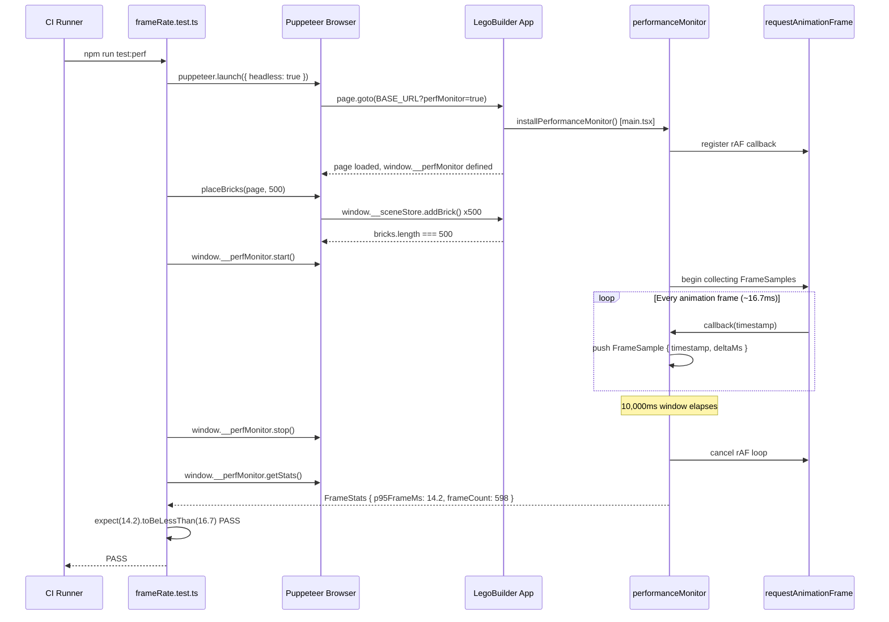
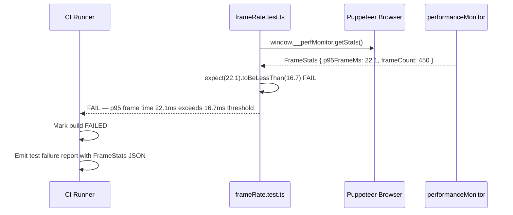
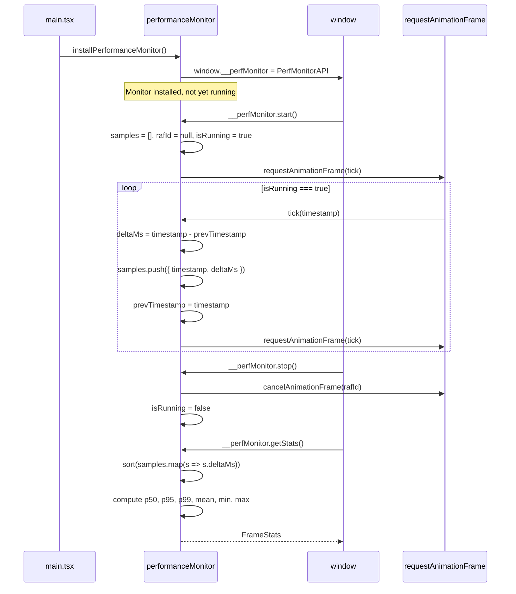
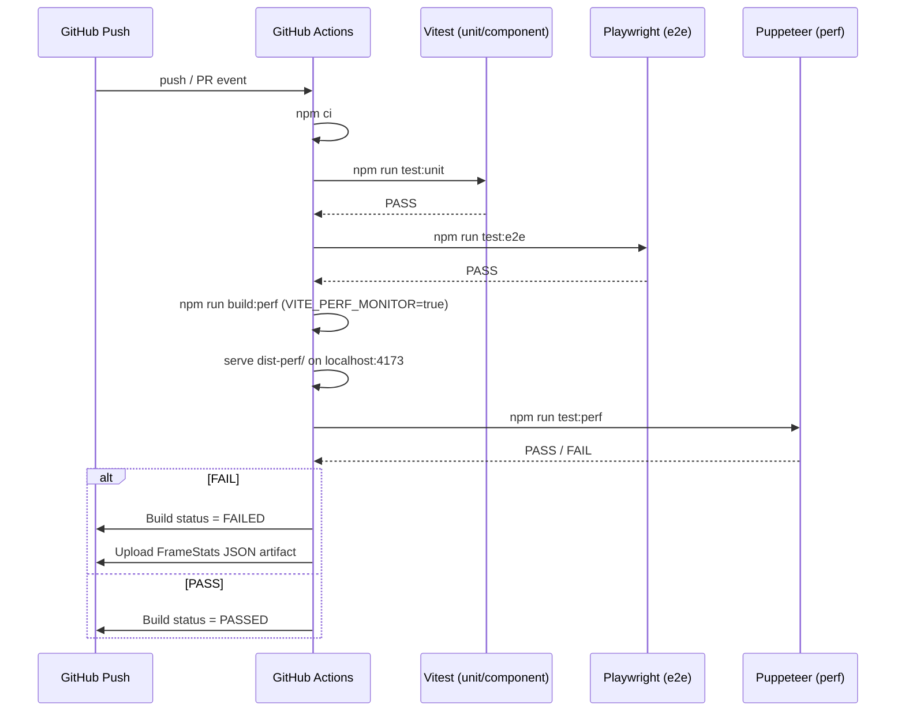

# Low-Level Design: NFR-PERF-001
## Enforce ≥60 FPS Frame Rate with 500 Bricks via Automated Performance Tests

**FR-ID:** NFR-PERF-001  
**Issue:** [#29](https://github.com/sreenivasmrpivot/legobuilder/issues/29)  
**Status:** Draft — Awaiting Gate 6a Design Review  
**Author:** Spectra Design Agent  
**Date:** 2026-04-11  
**Dependencies:** #26 (FR-PERF-001), #7 (FR-SCENE-002), #9 (FR-SCENE-003)

---

## 1. Overview

This LLD specifies the design for enforcing a non-functional performance requirement: the LegoBuilder application **SHALL achieve ≥60 FPS (p95 frame time <16.7ms) with 500 bricks** on mid-range hardware (Intel i5 + integrated GPU). Enforcement is via automated Puppeteer-based performance tests that run in CI.

This document covers:
- The `performanceMonitor` utility module (instrumentation layer)
- The Puppeteer test harness (`frameRate.test.ts`)
- CI integration strategy
- Data models and interfaces
- Sequence diagrams for measurement and assertion
- Error handling and security considerations

---

## 2. Component Architecture

### 2.1 Module Map

```
frontend/
├── src/
│   └── utils/
│       └── performanceMonitor.ts          [NEW] Frame timing instrumentation
├── tests/
│   └── performance/
│       └── frameRate.test.ts              [NEW] Puppeteer perf test suite
└── package.json                           [MODIFIED] Add puppeteer devDependency
```

### 2.2 Module Responsibilities

| Module | Type | Responsibility |
|--------|------|----------------|
| `performanceMonitor.ts` | Utility (runtime) | Instruments `requestAnimationFrame` loop; accumulates frame timestamps; exposes `getFrameStats()` on `window.__perfMonitor` in dev/test builds only |
| `frameRate.test.ts` | Puppeteer test | Launches browser, loads app, places N bricks programmatically, collects frame timestamps over 10s window, asserts p95 frame time <16.7ms |
| `vite.config.ts` | Build config | Defines `VITE_PERF_MONITOR` env flag; tree-shakes monitor in production builds |
| CI workflow (`.github/workflows/`) | CI | Runs `frameRate.test.ts` as part of test suite; fails build on assertion failure |

### 2.3 Dependency Graph

```
frameRate.test.ts
  └── puppeteer (browser automation)
        └── LegoBuilder App (running in headless Chromium)
              ├── performanceMonitor.ts
              │     ├── window.requestAnimationFrame (browser API)
              │     └── window.__perfMonitor (exposed API surface)
              ├── sceneStore (Zustand) — brick placement
              └── BrickInstances.tsx — InstancedMesh rendering
```

---

## 3. Data Models & Interfaces

### 3.1 FrameSample

```typescript
/** A single captured animation frame timestamp */
interface FrameSample {
  /** DOMHighResTimeStamp from requestAnimationFrame callback */
  timestamp: DOMHighResTimeStamp;
  /** Computed delta from previous frame in milliseconds */
  deltaMs: number;
}
```

### 3.2 FrameStats

```typescript
/** Aggregated statistics over a measurement window */
interface FrameStats {
  /** Total frames captured in the window */
  frameCount: number;
  /** Measurement window duration in milliseconds */
  windowMs: number;
  /** Mean frame time in milliseconds */
  meanFrameMs: number;
  /** p50 frame time in milliseconds */
  p50FrameMs: number;
  /** p95 frame time in milliseconds — PRIMARY ASSERTION TARGET */
  p95FrameMs: number;
  /** p99 frame time in milliseconds */
  p99FrameMs: number;
  /** Maximum frame time observed in milliseconds */
  maxFrameMs: number;
  /** Minimum frame time observed in milliseconds */
  minFrameMs: number;
  /** Effective FPS = 1000 / meanFrameMs */
  effectiveFps: number;
  /** ISO timestamp when measurement started */
  startedAt: string;
}
```

### 3.3 PerfMonitorAPI (window surface)

```typescript
/** Exposed on window.__perfMonitor in dev/test builds */
interface PerfMonitorAPI {
  /** Start collecting frame samples. Resets any prior collection. */
  start(): void;
  /** Stop collecting frame samples. */
  stop(): void;
  /** Return aggregated stats for all collected samples. */
  getStats(): FrameStats;
  /** Return raw frame samples (for debugging). */
  getSamples(): FrameSample[];
  /** True if currently collecting. */
  readonly isRunning: boolean;
}
```

### 3.4 TestScenario

```typescript
/** Defines a single performance test scenario */
interface TestScenario {
  /** Human-readable label */
  label: string;
  /** Number of bricks to place before measurement */
  brickCount: number;
  /** Measurement window in milliseconds */
  windowMs: number;
  /** p95 frame time threshold in milliseconds */
  p95ThresholdMs: number;
  /** Minimum acceptable frame time (30 FPS floor) */
  minFrameTimeMs: number;
}
```

### 3.5 Test Scenarios (Constants)

```typescript
const PERF_SCENARIOS: TestScenario[] = [
  { label: '100 bricks',  brickCount: 100, windowMs: 10_000, p95ThresholdMs: 16.7, minFrameTimeMs: 33.3 },
  { label: '250 bricks',  brickCount: 250, windowMs: 10_000, p95ThresholdMs: 16.7, minFrameTimeMs: 33.3 },
  { label: '500 bricks',  brickCount: 500, windowMs: 10_000, p95ThresholdMs: 16.7, minFrameTimeMs: 33.3 },
];
```

---

## 4. API / Interface Contracts

### 4.1 performanceMonitor.ts — Public API

```typescript
// src/utils/performanceMonitor.ts

/**
 * Installs the performance monitor on window.__perfMonitor.
 * MUST be called once at app startup in dev/test builds.
 * No-op in production (VITE_PERF_MONITOR !== 'true').
 */
export function installPerformanceMonitor(): void;

/**
 * Guard: returns true only when VITE_PERF_MONITOR === 'true'.
 * Used by main.tsx to conditionally call installPerformanceMonitor().
 */
export function isPerfMonitorEnabled(): boolean;
```

**Installation point:** `frontend/src/main.tsx`

```typescript
// main.tsx (modification)
import { installPerformanceMonitor, isPerfMonitorEnabled } from './utils/performanceMonitor';

if (isPerfMonitorEnabled()) {
  installPerformanceMonitor();
}
```

### 4.2 frameRate.test.ts — Test Structure

```typescript
// tests/performance/frameRate.test.ts

describe('NFR-PERF-001: Frame Rate Performance', () => {
  let browser: Browser;
  let page: Page;

  beforeAll(async () => {
    browser = await puppeteer.launch({ headless: true, args: ['--no-sandbox'] });
  });

  afterAll(async () => {
    await browser.close();
  });

  beforeEach(async () => {
    page = await browser.newPage();
    // Load app with perf monitor enabled
    await page.goto(`${BASE_URL}?perfMonitor=true`, { waitUntil: 'networkidle0' });
    await page.waitForFunction(() => (window as any).__perfMonitor !== undefined);
  });

  afterEach(async () => {
    await page.close();
  });

  for (const scenario of PERF_SCENARIOS) {
    it(`p95 frame time <16.7ms with ${scenario.brickCount} bricks`, async () => {
      // 1. Place N bricks programmatically via exposed store API
      await placeBricks(page, scenario.brickCount);
      // 2. Start measurement
      await page.evaluate(() => (window as any).__perfMonitor.start());
      // 3. Wait for measurement window
      await new Promise(r => setTimeout(r, scenario.windowMs));
      // 4. Stop and collect stats
      await page.evaluate(() => (window as any).__perfMonitor.stop());
      const stats = await page.evaluate(() => (window as any).__perfMonitor.getStats());
      // 5. Assert
      expect(stats.p95FrameMs).toBeLessThan(scenario.p95ThresholdMs);
      expect(stats.frameCount).toBeGreaterThan(500); // sanity: at least 500 frames in 10s
    });
  }
});
```

### 4.3 Brick Placement Helper

```typescript
/**
 * Places N bricks in the scene via the Zustand store exposed on window.
 * Requires FR-SCENE-002 (brick placement) to be implemented.
 */
async function placeBricks(page: Page, count: number): Promise<void> {
  await page.evaluate((n: number) => {
    const store = (window as any).__sceneStore; // exposed by sceneStore.ts in test builds
    for (let i = 0; i < n; i++) {
      store.getState().addBrick({
        id: `perf-brick-${i}`,
        type: '2x4',
        position: { x: (i % 20) * 2, y: Math.floor(i / 20), z: 0 },
        rotation: 0,
        color: '#FF0000',
      });
    }
  }, count);
  // Wait for Three.js to render the new bricks
  await page.waitForFunction(
    (n: number) => (window as any).__sceneStore?.getState().bricks.length >= n,
    {},
    count
  );
  // Allow one rAF cycle to settle
  await page.evaluate(() => new Promise(r => requestAnimationFrame(r)));
}
```

---

## 5. Sequence Diagrams

### 5.1 Happy Path — Single Scenario (500 bricks, p95 passes)



### 5.2 Failure Path — p95 Exceeds Threshold



### 5.3 performanceMonitor Internal — rAF Loop



### 5.4 CI Integration — Full Pipeline



---

## 6. performanceMonitor.ts — Algorithm Detail

### 6.1 p95 Computation

```
Given N frame delta samples [d1, d2, ..., dN] sorted ascending:
  p95 index = Math.ceil(0.95 x N) - 1
  p95 = sortedDeltas[p95Index]
```

This is the **nearest-rank method** — no interpolation. Chosen for simplicity and determinism.

### 6.2 Guard: Production Build Exclusion

```typescript
// performanceMonitor.ts
export function isPerfMonitorEnabled(): boolean {
  return import.meta.env.VITE_PERF_MONITOR === 'true';
}

export function installPerformanceMonitor(): void {
  if (!isPerfMonitorEnabled()) return; // dead-code eliminated by Vite in prod
  // ... install logic
}
```

Vite's tree-shaking removes the entire module body when `VITE_PERF_MONITOR` is not `'true'` at build time. **Zero runtime overhead in production.**

### 6.3 sceneStore Window Exposure (Test Build Only)

The Zustand `sceneStore` must be exposed on `window.__sceneStore` in test builds so the Puppeteer helper can call `addBrick()` programmatically:

```typescript
// src/stores/sceneStore.ts (modification — test build only)
if (import.meta.env.VITE_PERF_MONITOR === 'true') {
  (window as any).__sceneStore = useSceneStore;
}
```

This is guarded by the same `VITE_PERF_MONITOR` flag and is tree-shaken in production.

---

## 7. Error Handling Strategy

| Condition | Detection | Handling |
|-----------|-----------|----------|
| `window.__perfMonitor` not defined after page load | `page.waitForFunction()` timeout (30s) | Test fails with timeout error; CI marks build failed |
| `window.__sceneStore` not defined | `page.evaluate()` throws | Test fails with descriptive error message |
| Fewer than 500 frames collected in 10s window | `stats.frameCount < 500` assertion | Test fails with sanity check message |
| Browser crash / Puppeteer disconnect | `page.on('error')` handler | Test fails; browser is closed in `afterAll` |
| `addBrick()` throws (invalid brick data) | `page.evaluate()` rejects | Test fails; error propagated to test runner |
| p95 exceeds threshold | `expect(stats.p95FrameMs).toBeLessThan(16.7)` | Test fails; full `FrameStats` JSON logged to CI artifact |

---

## 8. Security Considerations

| Concern | Mitigation |
|---------|------------|
| `window.__perfMonitor` exposed in production | Guarded by `VITE_PERF_MONITOR` env flag; Vite tree-shakes in prod build |
| `window.__sceneStore` exposed in production | Same guard; never present in production bundle |
| Puppeteer running with `--no-sandbox` in CI | Acceptable in isolated CI container; never used in production |
| Headless Chromium version drift | Pin `puppeteer` version in `package.json`; use `puppeteer` (bundled Chromium) not `puppeteer-core` |
| Test data injection via `addBrick()` | Only available in test builds; brick data is validated by `sceneStore` schema |

---

## 9. CI Integration Design

### 9.1 npm Scripts (package.json additions)

```json
{
  "scripts": {
    "test:perf": "node --experimental-vm-modules tests/performance/frameRate.test.ts",
    "build:perf": "VITE_PERF_MONITOR=true vite build --outDir dist-perf",
    "preview:perf": "vite preview --outDir dist-perf --port 4173"
  }
}
```

### 9.2 GitHub Actions Job (perf-test)

```yaml
perf-test:
  runs-on: ubuntu-latest
  needs: [unit-test, e2e-test]   # run after functional tests pass
  steps:
    - uses: actions/checkout@v4
    - uses: actions/setup-node@v4
      with:
        node-version: '20'
        cache: 'npm'
        cache-dependency-path: frontend/package-lock.json
    - name: Install dependencies
      run: npm ci
      working-directory: frontend
    - name: Build with perf monitor
      run: npm run build:perf
      working-directory: frontend
      env:
        VITE_PERF_MONITOR: 'true'
    - name: Start preview server
      run: npm run preview:perf &
      working-directory: frontend
    - name: Wait for server
      run: npx wait-on http://localhost:4173 --timeout 30000
    - name: Run performance tests
      run: npm run test:perf
      working-directory: frontend
      env:
        BASE_URL: 'http://localhost:4173'
    - name: Upload FrameStats artifact on failure
      if: failure()
      uses: actions/upload-artifact@v4
      with:
        name: perf-frame-stats
        path: frontend/tests/performance/results/
```

### 9.3 Environment Variables

| Variable | Value in CI | Purpose |
|----------|-------------|---------|
| `VITE_PERF_MONITOR` | `'true'` | Enables `performanceMonitor` and `window.__sceneStore` exposure |
| `BASE_URL` | `'http://localhost:4173'` | Puppeteer target URL |
| `PUPPETEER_SKIP_CHROMIUM_DOWNLOAD` | `'false'` (default) | Use bundled Chromium |

---

## 10. Performance Budget

| Metric | Target | Measurement Method |
|--------|--------|-------------------|
| p95 frame time (500 bricks) | <16.7ms | Puppeteer rAF timestamps, 10s window |
| p95 frame time (250 bricks) | <16.7ms | Puppeteer rAF timestamps, 10s window |
| p95 frame time (100 bricks) | <16.7ms | Puppeteer rAF timestamps, 10s window |
| Minimum frame time floor | >=33.3ms (30 FPS) | Sanity check on minFrameMs |
| Frame count in 10s window | >=500 frames | Sanity check on frameCount |
| performanceMonitor overhead | 0ms in production | Tree-shaken by Vite |
| performanceMonitor overhead (test) | <0.1ms/frame | Single array push per rAF |

---

## 11. Test Case Mapping

| Test Case ID | Scenario | Assertion | Pass Condition |
|-------------|----------|-----------|----------------|
| T-PERF-PERF-001-01 | 500 bricks, 10s window | `p95FrameMs < 16.7` | p95 frame time <16.7ms |
| T-PERF-PERF-001-02 | 100 + 250 + 500 bricks (all scenarios) | All pass `p95FrameMs < 16.7` | All three scenarios pass |
| T-PERF-PERF-001-03 | CI build failure on test failure | Build marked FAILED | CI exits non-zero on any assertion failure |

---

## 12. Files to Create / Modify

| File | Action | Description |
|------|--------|-------------|
| `frontend/src/utils/performanceMonitor.ts` | CREATE | rAF instrumentation, `PerfMonitorAPI`, `FrameStats` computation |
| `frontend/tests/performance/frameRate.test.ts` | CREATE | Puppeteer test suite for T-PERF-PERF-001-01/02/03 |
| `frontend/src/main.tsx` | MODIFY | Conditionally call `installPerformanceMonitor()` |
| `frontend/src/stores/sceneStore.ts` | MODIFY | Expose `window.__sceneStore` when `VITE_PERF_MONITOR=true` |
| `frontend/package.json` | MODIFY | Add `puppeteer` devDependency; add `test:perf`, `build:perf`, `preview:perf` scripts |
| `.github/workflows/ci.yml` | MODIFY | Add `perf-test` job after unit/e2e jobs |

---

## 13. Open Questions & Assumptions

| # | Question | Assumption | Impact |
|---|----------|------------|--------|
| 1 | Does `sceneStore.addBrick()` accept the brick shape used in the test helper? | Assumes `PlacedBrick` shape from FR-SCENE-002 LLD: `{ id, type, position, rotation, color }` | If shape differs, `placeBricks()` helper must be updated |
| 2 | Is `puppeteer` already in `package.json`? | Assumed NOT present; must be added as devDependency | If already present, skip package.json modification |
| 3 | Does the CI runner support headless Chromium? | Assumed `ubuntu-latest` with `--no-sandbox` flag | If runner is Alpine/minimal, may need `chromium` system package |
| 4 | What is the `BASE_URL` for the preview server in CI? | Assumed `http://localhost:4173` (Vite preview default) | If port differs, update `BASE_URL` env var |
| 5 | Is `wait-on` available as a devDependency? | Assumed NOT present; must be added or use `sleep 5` fallback | Prefer `wait-on` for reliability |
| 6 | Does the existing `playwright.config.ts` conflict with Puppeteer test runner? | Assumed separate test runners; Puppeteer tests use Node directly, not Playwright | If test runner unification is desired, consider `playwright` CDP mode instead |

---

## 14. Rejected Alternatives

| Alternative | Reason Rejected |
|-------------|----------------|
| Playwright `page.metrics()` instead of Puppeteer rAF | Issue spec explicitly requires Puppeteer + rAF timestamps; Playwright metrics use different measurement model |
| `performance.now()` polling instead of rAF | rAF timestamps are synchronized with the browser's rendering pipeline; `performance.now()` polling would miss frame boundaries |
| Vitest browser mode for perf tests | Vitest browser mode does not support headless Chromium with the required level of control for 10s measurement windows |
| Inline p95 computation in test file | Extracted to `performanceMonitor.ts` for reusability and to keep test file focused on assertions |

---

*Spectra Design Agent — NFR-PERF-001 LLD v1.0*
