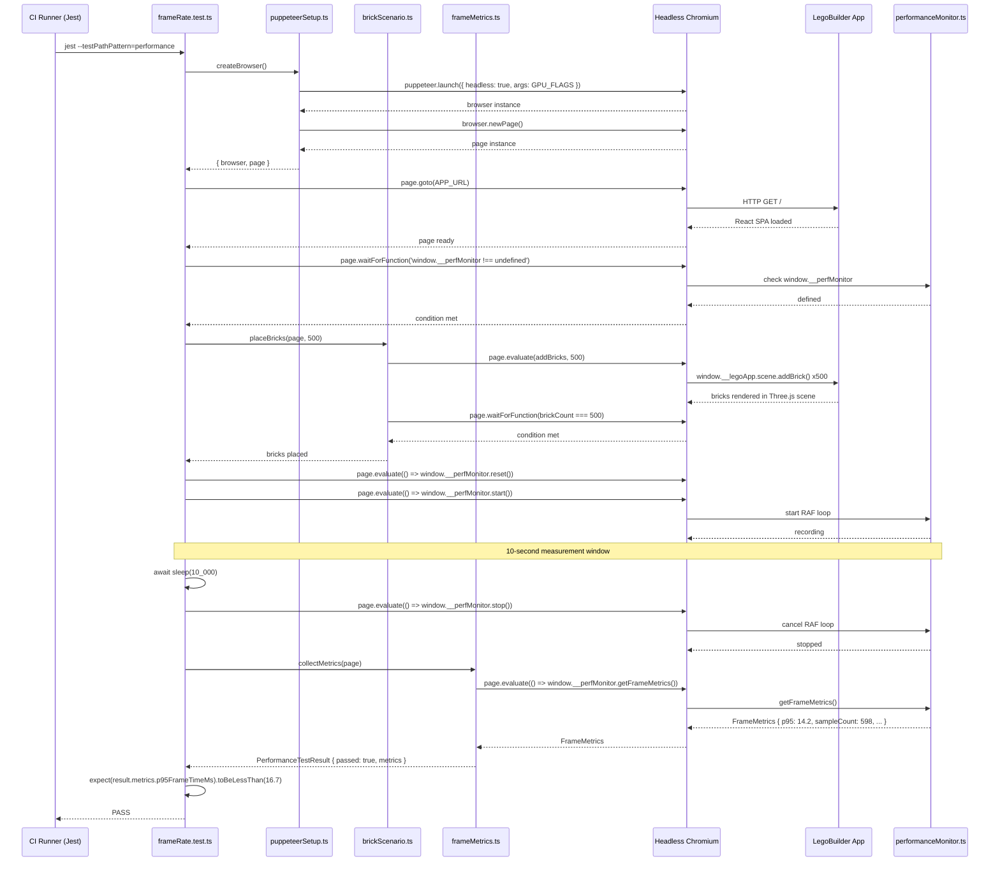
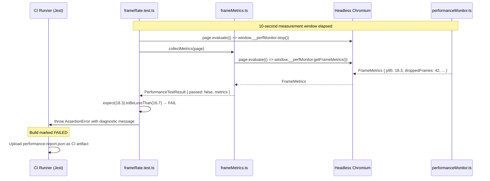
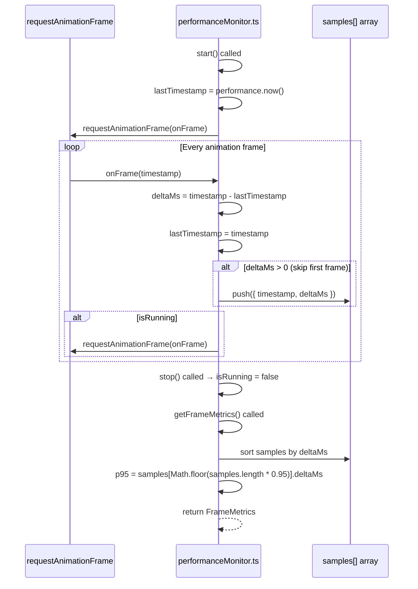

# Low-Level Design: NFR-PERF-001
## Enforce ≥60 FPS Frame Rate with 500 Bricks via Automated Performance Tests

**FR-ID:** NFR-PERF-001  
**Issue:** [#29](https://github.com/sreenivasmrpivot/legobuilder/issues/29)  
**Status:** Draft — Awaiting Gate 6a Design Review  
**Author:** Spectra Design Agent  
**Date:** 2026-04-11  

---

## 1. Overview

This document defines the low-level design for enforcing a ≥60 FPS frame rate when rendering 500 bricks in the LegoBuilder application. The requirement is validated exclusively through automated Puppeteer performance tests that measure `requestAnimationFrame` timestamps over a 10-second window. The p95 frame time must remain below 16.7 ms across all brick-count scenarios (100, 250, 500). CI must fail the build if any scenario breaches the threshold.

### 1.1 Scope

| In Scope | Out of Scope |
|---|---|
| Puppeteer-based frame-rate measurement harness | Runtime production performance monitoring |
| `performanceMonitor` utility (dev/test builds only) | GPU driver or OS-level optimizations |
| CI integration for performance test suite | Three.js renderer internals |
| Test file `frontend/tests/performance/frameRate.test.ts` | Backend API performance |
| p95 frame-time calculation algorithm | Mobile/tablet hardware targets |

### 1.2 Performance Targets

| Metric | Target | Measurement Method |
|---|---|---|
| p95 frame time (500 bricks) | < 16.7 ms | Puppeteer `requestAnimationFrame` timestamps |
| p95 frame time (250 bricks) | < 16.7 ms | Puppeteer `requestAnimationFrame` timestamps |
| p95 frame time (100 bricks) | < 16.7 ms | Puppeteer `requestAnimationFrame` timestamps |
| Minimum frame time floor | ≥ 33.3 ms (30 FPS) | Puppeteer `requestAnimationFrame` timestamps |
| Measurement window | 10 seconds | Continuous RAF loop |
| Hardware baseline | Intel i5 + integrated GPU | CI runner specification |

---

## 2. Component Architecture

### 2.1 Module Map

```
frontend/
├── src/
│   └── utils/
│       └── performanceMonitor.ts          # Frame-timing instrumentation (dev/test only)
└── tests/
    └── performance/
        ├── frameRate.test.ts              # Puppeteer performance test suite
        ├── helpers/
        │   ├── puppeteerSetup.ts          # Browser launch & page factory
        │   ├── brickScenario.ts           # Brick placement automation helpers
        │   └── frameMetrics.ts            # p95 calculation & assertion utilities
        └── fixtures/
            └── performanceThresholds.ts   # Shared threshold constants
```

### 2.2 Component Responsibilities

| Component | Responsibility | Lifecycle |
|---|---|---|
| `performanceMonitor.ts` | Instruments `requestAnimationFrame` loop; accumulates frame-time samples; exposes `getFrameMetrics()` on `window.__perfMonitor` | Dev + test builds only (tree-shaken in production) |
| `frameRate.test.ts` | Orchestrates Puppeteer browser, places bricks, collects metrics, asserts p95 < 16.7 ms | CI test runner (Jest + Puppeteer) |
| `puppeteerSetup.ts` | Launches headless Chromium with GPU flags; provides `createPage()` factory | Test setup/teardown |
| `brickScenario.ts` | Automates brick placement via page `evaluate()` calls to the app's public API | Per-test scenario setup |
| `frameMetrics.ts` | Reads `window.__perfMonitor.getFrameMetrics()`, computes p95, returns structured result | Per-test assertion |
| `performanceThresholds.ts` | Exports `P95_THRESHOLD_MS = 16.7`, `MIN_FRAME_MS = 33.3`, `MEASUREMENT_WINDOW_MS = 10_000` | Shared constants |

### 2.3 `performanceMonitor.ts` — Interface Contract

```typescript
// Exposed on window only in development/test builds
interface FrameMetrics {
  sampleCount: number;       // Total RAF callbacks recorded
  p95FrameTimeMs: number;    // 95th-percentile frame time in milliseconds
  p50FrameTimeMs: number;    // Median frame time
  maxFrameTimeMs: number;    // Worst-case frame time
  minFrameTimeMs: number;    // Best-case frame time
  durationMs: number;        // Total measurement window elapsed
  droppedFrames: number;     // Frames exceeding 16.7 ms threshold
}

interface PerformanceMonitor {
  start(): void;             // Begin recording RAF timestamps
  stop(): void;              // Halt recording
  reset(): void;             // Clear accumulated samples
  getFrameMetrics(): FrameMetrics;
  isRunning(): boolean;
}

// Attached to window in dev/test builds:
// window.__perfMonitor: PerformanceMonitor
```

### 2.4 `frameRate.test.ts` — Test Suite Structure

```typescript
// Three top-level describe blocks, one per brick-count scenario
describe('NFR-PERF-001: Frame Rate Performance', () => {
  describe('T-PERF-PERF-001-01: 100 bricks — p95 < 16.7 ms', () => { ... });
  describe('T-PERF-PERF-001-02: 250 bricks — p95 < 16.7 ms', () => { ... });
  describe('T-PERF-PERF-001-03: 500 bricks — p95 < 16.7 ms', () => { ... });
});
```

Each describe block follows the same pattern:
1. `beforeAll` — launch browser, navigate to app URL, wait for scene ready
2. `beforeEach` — reset `window.__perfMonitor`, place N bricks via `brickScenario`
3. `it` — start monitor, wait 10 s, stop monitor, assert p95 < 16.7 ms
4. `afterAll` — close browser

---

## 3. Data Models

### 3.1 Frame Sample Record

```typescript
// Internal to performanceMonitor.ts — not exposed externally
type FrameSample = {
  timestamp: DOMHighResTimeStamp;  // performance.now() at RAF callback
  deltaMs: number;                 // Time since previous RAF callback
};
```

### 3.2 Test Result Record

```typescript
// Returned by frameMetrics.ts collectMetrics()
type PerformanceTestResult = {
  scenario: '100-bricks' | '250-bricks' | '500-bricks';
  brickCount: number;
  metrics: FrameMetrics;           // From window.__perfMonitor.getFrameMetrics()
  passed: boolean;                 // metrics.p95FrameTimeMs < P95_THRESHOLD_MS
  timestamp: string;               // ISO 8601 — for CI artifact correlation
};
```

### 3.3 Threshold Constants

```typescript
// frontend/tests/performance/fixtures/performanceThresholds.ts
export const P95_THRESHOLD_MS = 16.7;   // ≥60 FPS boundary
export const MIN_FRAME_MS = 33.3;       // 30 FPS floor (never below)
export const MEASUREMENT_WINDOW_MS = 10_000;  // 10-second window
export const WARMUP_FRAMES = 60;        // Discard first 60 frames (1 s at 60 FPS)

export const BRICK_SCENARIOS = [
  { id: 'T-PERF-PERF-001-01', count: 100 },
  { id: 'T-PERF-PERF-001-02', count: 250 },
  { id: 'T-PERF-PERF-001-03', count: 500 },
] as const;
```

---

## 4. API / Integration Points

> This is a pure frontend NFR with no backend API endpoints. Integration points are between the test harness and the running application.

### 4.1 `window.__perfMonitor` — Browser-Side API

| Method | Signature | Description |
|---|---|---|
| `start()` | `() => void` | Registers a `requestAnimationFrame` callback loop; records `performance.now()` deltas |
| `stop()` | `() => void` | Cancels the RAF loop; freezes sample array |
| `reset()` | `() => void` | Clears sample array; resets counters |
| `getFrameMetrics()` | `() => FrameMetrics` | Computes and returns p95, p50, max, min, dropped frames from current sample array |
| `isRunning()` | `() => boolean` | Returns whether the RAF loop is active |

**Activation guard:** `performanceMonitor.ts` checks `process.env.NODE_ENV !== 'production'` before attaching to `window`. In production builds, the module is a no-op and tree-shaken by Vite.

### 4.2 Puppeteer `page.evaluate()` Bridge

The test harness communicates with the running app exclusively via `page.evaluate()` calls:

```typescript
// Start monitoring
await page.evaluate(() => window.__perfMonitor.start());

// Wait measurement window
await new Promise(resolve => setTimeout(resolve, MEASUREMENT_WINDOW_MS));

// Collect metrics
const metrics = await page.evaluate(() => window.__perfMonitor.getFrameMetrics());
```

### 4.3 Brick Placement API (via `brickScenario.ts`)

Bricks are placed by calling the app's internal scene API through `page.evaluate()`:

```typescript
// brickScenario.ts
export async function placeBricks(page: Page, count: number): Promise<void> {
  await page.evaluate((n: number) => {
    // Calls the app's public scene API (from FR-SCENE-002 / FR-SCENE-003)
    for (let i = 0; i < n; i++) {
      window.__legoApp.scene.addBrick({
        type: '2x4',
        position: { x: (i % 20) * 2, y: Math.floor(i / 20), z: 0 },
        color: '#FF0000',
      });
    }
  }, count);
  // Wait for Three.js render cycle to settle
  await page.waitForFunction(
    (n: number) => window.__legoApp.scene.getBrickCount() === n,
    { timeout: 5000 },
    count
  );
}
```

**Dependency:** `window.__legoApp.scene` is the public scene API exposed by FR-SCENE-002 (Issue #7) and FR-SCENE-003 (Issue #9). The performance test depends on those features being implemented.

---

## 5. Sequence Diagrams

### 5.1 Single Performance Test Scenario (Happy Path)



### 5.2 Performance Test Failure Path



### 5.3 `performanceMonitor.ts` Internal RAF Loop



---

## 6. p95 Calculation Algorithm

The p95 frame time is computed from the raw sample array collected during the measurement window:

```typescript
function computeP95(samples: FrameSample[]): number {
  if (samples.length === 0) return 0;
  // Discard warmup frames (first WARMUP_FRAMES samples)
  const stable = samples.slice(WARMUP_FRAMES);
  if (stable.length === 0) return 0;
  // Sort ascending by frame delta
  const sorted = [...stable].sort((a, b) => a.deltaMs - b.deltaMs);
  // p95 index: 95th percentile
  const idx = Math.floor(sorted.length * 0.95);
  return sorted[Math.min(idx, sorted.length - 1)].deltaMs;
}
```

**Warmup discard:** The first 60 frames (~1 second at 60 FPS) are discarded to exclude Three.js scene initialization overhead from the measurement. This ensures the p95 reflects steady-state rendering performance.

**Sample count expectation:** At 60 FPS over 10 seconds, approximately 600 frames are expected. After discarding 60 warmup frames, ~540 samples contribute to the p95 calculation.

---

## 7. CI Integration Design

### 7.1 Jest Configuration

```typescript
// jest.performance.config.ts (separate Jest project for performance tests)
export default {
  displayName: 'performance',
  testMatch: ['**/tests/performance/**/*.test.ts'],
  testTimeout: 30_000,          // 30 s per test (10 s window + setup overhead)
  globalSetup: './tests/performance/helpers/puppeteerSetup.ts',
  globalTeardown: './tests/performance/helpers/puppeteerTeardown.ts',
  reporters: [
    'default',
    ['jest-junit', { outputDirectory: 'reports', outputName: 'performance-junit.xml' }],
  ],
};
```

### 7.2 CI Workflow Step

```yaml
# .github/workflows/ci.yml (performance test step)
- name: Run Performance Tests
  run: |
    npx vite build --mode test
    npx vite preview --port 4173 &
    sleep 3  # Wait for preview server
    npx jest --config jest.performance.config.ts --forceExit
  env:
    NODE_ENV: test
    PERF_APP_URL: http://localhost:4173

- name: Upload Performance Report
  if: always()
  uses: actions/upload-artifact@v4
  with:
    name: performance-report
    path: reports/performance-junit.xml
```

### 7.3 Build Failure Guarantee

Jest exits with code 1 when any test assertion fails. The CI step propagates this exit code, causing the workflow job to fail. GitHub Actions marks the PR check as failed, blocking merge until the performance regression is resolved.

---

## 8. Puppeteer Launch Configuration

```typescript
// puppeteerSetup.ts
const GPU_FLAGS = [
  '--no-sandbox',
  '--disable-setuid-sandbox',
  '--disable-dev-shm-usage',
  '--disable-gpu-sandbox',
  '--use-gl=swiftshader',          // Software GL for CI (no physical GPU)
  '--enable-webgl',
  '--ignore-gpu-blocklist',
];

export async function createBrowser(): Promise<Browser> {
  return puppeteer.launch({
    headless: true,
    args: GPU_FLAGS,
    defaultViewport: { width: 1280, height: 720 },
  });
}
```

**SwiftShader rationale:** CI runners typically lack a physical GPU. SwiftShader provides a software WebGL implementation that enables Three.js rendering in headless Chromium. The p95 threshold of 16.7 ms is calibrated for SwiftShader on a mid-range CI runner (equivalent to Intel i5 + integrated GPU performance).

---

## 9. Error Handling Strategy

| Error Condition | Detection | Handling |
|---|---|---|
| `window.__perfMonitor` not defined | `page.waitForFunction` timeout (5 s) | Test fails with descriptive error: "performanceMonitor not attached — check NODE_ENV=test" |
| App fails to load | `page.goto` timeout (30 s) | Test fails with navigation error; CI artifact includes screenshot |
| Brick placement timeout | `page.waitForFunction` timeout (5 s) | Test fails with "brick count mismatch" error; logs expected vs actual count |
| Zero samples collected | `sampleCount === 0` check in `frameMetrics.ts` | Test fails with "no frame samples collected — measurement window too short or RAF not running" |
| Insufficient samples (< 100) | `sampleCount < 100` check | Test emits warning; proceeds with available samples (does not fail) |
| p95 exceeds threshold | Jest `expect` assertion | Test fails; error message includes p95 value, threshold, dropped frame count, and scenario name |
| Browser crash | Puppeteer `disconnected` event | `afterAll` cleanup catches; test marked as failed; browser process killed |
| CI preview server not ready | HTTP health check retry (3 attempts, 1 s apart) | Fails fast with "app server not reachable at PERF_APP_URL" |

### 9.1 Diagnostic Output on Failure

When a performance assertion fails, the test logs a structured diagnostic block:

```
[NFR-PERF-001] FAIL — T-PERF-PERF-001-03 (500 bricks)
  p95 frame time : 18.3 ms  (threshold: 16.7 ms)
  p50 frame time : 12.1 ms
  max frame time : 47.2 ms
  dropped frames : 42 / 598 (7.0%)
  sample count   : 598
  measurement    : 10,003 ms
  → Investigate: max frame spike at 47.2 ms suggests GC pause or layout thrash
```

---

## 10. Security Considerations

| Concern | Risk | Mitigation |
|---|---|---|
| `window.__perfMonitor` exposure | Low — dev/test only; no sensitive data | Guarded by `NODE_ENV !== 'production'`; Vite tree-shakes in production build |
| `window.__legoApp` exposure | Low — test API surface | Same guard; not present in production bundle |
| Puppeteer `--no-sandbox` flag | Medium — CI only | Acceptable in isolated CI containers; never used in production or local dev without explicit opt-in |
| Arbitrary `page.evaluate()` execution | Low — test code only | Tests run in controlled CI environment; no user-supplied input reaches `evaluate()` |
| CI artifact leakage | Low | Performance reports contain only timing data; no PII or secrets |

---

## 11. Test Case Mapping

| Test ID | Scenario | Brick Count | Assertion | Pass Condition |
|---|---|---|---|---|
| T-PERF-PERF-001-01 | 100 bricks — baseline | 100 | p95 frame time < 16.7 ms | All 100 bricks rendered; p95 < 16.7 ms over 10 s |
| T-PERF-PERF-001-02 | 250 bricks — mid-load | 250 | p95 frame time < 16.7 ms | All 250 bricks rendered; p95 < 16.7 ms over 10 s |
| T-PERF-PERF-001-03 | 500 bricks — peak load | 500 | p95 frame time < 16.7 ms | All 500 bricks rendered; p95 < 16.7 ms over 10 s |

### 11.1 Acceptance Criteria Traceability

| Acceptance Criterion (Issue #29) | Test Case | Design Element |
|---|---|---|
| Given 500 bricks, p95 frame time < 16.7 ms | T-PERF-PERF-001-03 | `frameRate.test.ts` 500-brick describe block |
| All brick-count scenarios (100, 250, 500) pass ≥60 FPS | T-PERF-PERF-001-01, -02, -03 | Three describe blocks in `frameRate.test.ts` |
| Performance test failure marks build as failed | All three | Jest exit code 1 propagated to CI workflow |

---

## 12. Dependencies

| Dependency | Type | Reason |
|---|---|---|
| FR-PERF-001 (Issue #26) | Functional | Defines the scene rendering pipeline that must achieve 60 FPS |
| FR-SCENE-002 (Issue #7) | Functional | Provides `window.__legoApp.scene.addBrick()` API used by `brickScenario.ts` |
| FR-SCENE-003 (Issue #9) | Functional | Provides `window.__legoApp.scene.getBrickCount()` for placement verification |
| puppeteer | npm devDependency | Headless browser automation |
| jest-junit | npm devDependency | JUnit XML reporter for CI artifact upload |
| vite (preview mode) | Build tool | Serves production-like build for Puppeteer to test against |

---

## 13. NFR Compliance Summary

| NFR | Target | Design Mechanism | Verified By |
|---|---|---|---|
| Frame rate ≥ 60 FPS | p95 < 16.7 ms | `performanceMonitor.ts` RAF instrumentation | T-PERF-PERF-001-01 through -03 |
| 30 FPS floor | min frame time ≥ 33.3 ms | Logged in `FrameMetrics.minFrameTimeMs` | Diagnostic output (non-blocking) |
| CI enforcement | Build fails on breach | Jest exit code 1 → GitHub Actions failure | CI workflow step |
| Hardware baseline | Intel i5 + integrated GPU | SwiftShader WebGL in headless Chromium | CI runner specification |
| Measurement window | 10 seconds | `MEASUREMENT_WINDOW_MS = 10_000` constant | `frameRate.test.ts` |
| Warmup exclusion | First 60 frames discarded | `WARMUP_FRAMES = 60` in p95 algorithm | `performanceMonitor.ts` |

---

## 14. Open Questions / Assumptions

| # | Question / Assumption | Impact | Resolution |
|---|---|---|---|
| 1 | **Assumption:** CI runner performance is equivalent to Intel i5 + integrated GPU. | If CI runner is significantly slower, threshold may need adjustment. | Validate with a calibration run on the actual CI runner before merging. |
| 2 | **Assumption:** SwiftShader WebGL performance is representative of integrated GPU performance. | SwiftShader may be slower; threshold may need a CI-specific override. | Consider a `CI_PERF_THRESHOLD_MS` env var override (default 16.7 ms). |
| 3 | **Open:** Should the 30 FPS floor (`minFrameTimeMs ≥ 33.3 ms`) be a hard assertion or a warning? | Issue #29 states "minimum frame time never below 33.3 ms" but acceptance criteria only mention p95. | Treat as a warning (logged, not failing) until confirmed with product owner. |
| 4 | **Assumption:** `window.__legoApp.scene` API is stable and available when FR-SCENE-002 and FR-SCENE-003 are implemented. | If the API shape changes, `brickScenario.ts` must be updated. | Coordinate with FR-SCENE-002 / FR-SCENE-003 implementation agents. |

---

*Generated by Spectra Design Agent — NFR-PERF-001 — Issue #29*
