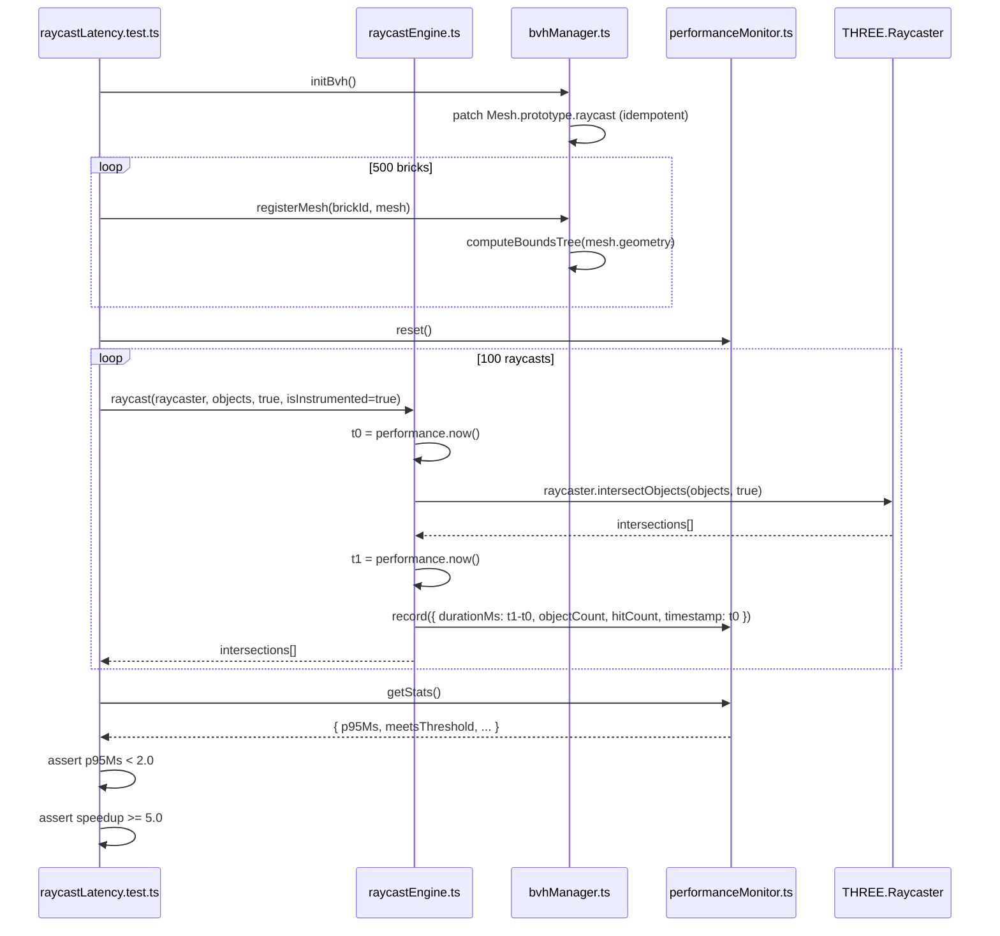
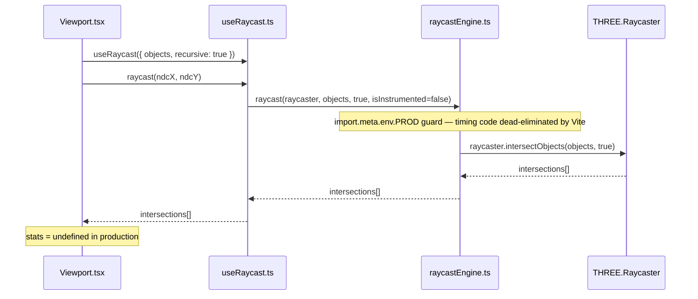
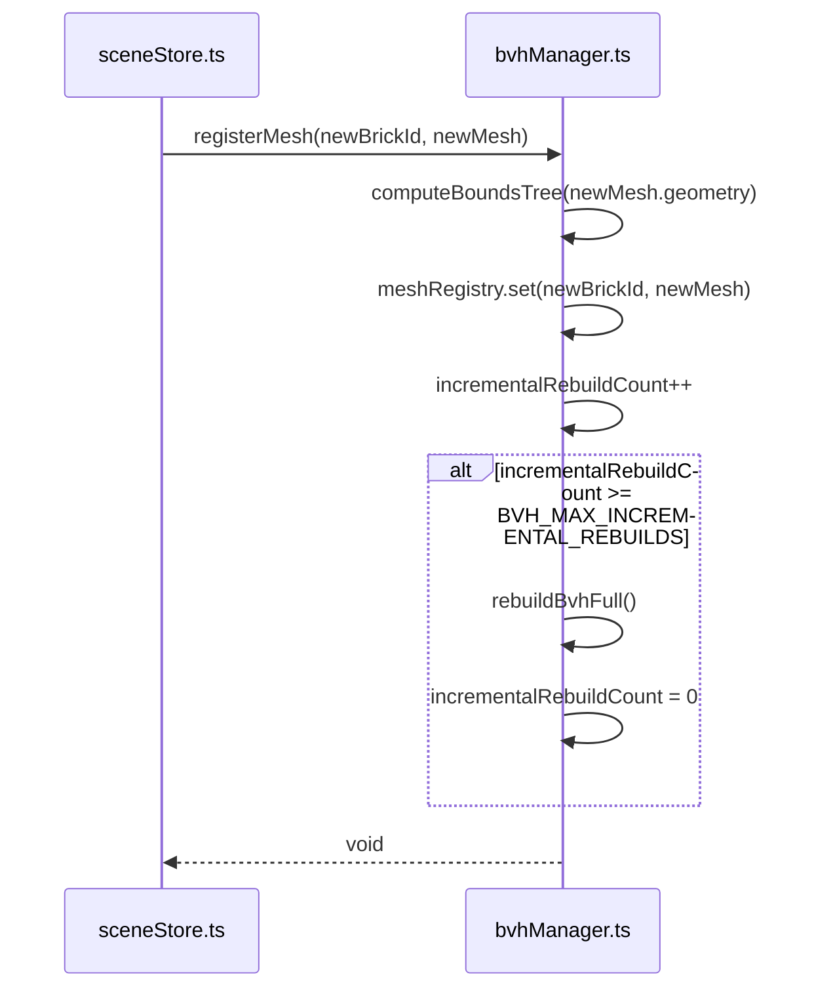
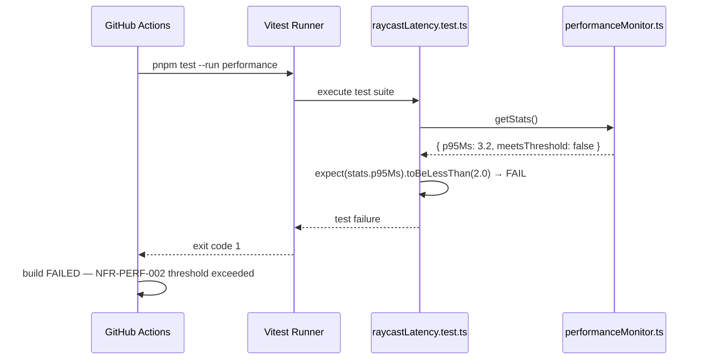

# Low-Level Design: NFR-PERF-002
## Enforce <2ms Raycast Latency in 500-Brick Scenes via Instrumented Timing

**FR-ID:** NFR-PERF-002  
**Issue:** #27  
**Status:** Draft — Awaiting Gate 6a Design Review  
**Author:** Spectra Design Agent  
**Date:** 2026-04-11  
**Depends on:** FR-SCENE-003 (#9) — BVH raycast acceleration  

---

## 1. Overview

NFR-PERF-002 mandates that every raycast operation in a 500-brick scene completes in **<2 ms (p95)**. This LLD specifies:

- The BVH-accelerated raycast engine (`bvhManager.ts`, `raycastEngine.ts`) that achieves the latency target
- An instrumented timing wrapper using `performance.now()` active only in test/development builds
- A p95 statistical aggregator (`performanceMonitor.ts`) that collects and evaluates timing samples
- A CI-enforced Vitest performance test (`raycastLatency.test.ts`) that fails the build when the threshold is exceeded
- Incremental BVH rebuild strategy for brick add/remove mutations

No production code is included in this document — this is a design artifact only.

---

## 2. Component Architecture

### 2.1 Module Map

```
frontend/src/
├── engine/
│   ├── bvhManager.ts          [MODIFIED] BVH lifecycle: init, rebuild, dispose
│   ├── raycastEngine.ts       [MODIFIED] Instrumented raycast wrapper
│   └── performanceMonitor.ts  [MODIFIED] p95 aggregator + threshold enforcement
├── hooks/
│   └── useRaycast.ts          [MODIFIED] React hook — delegates to raycastEngine
├── components/
│   └── Viewport.tsx           [MODIFIED] Passes instrumentation flag to useRaycast
frontend/tests/
└── performance/
    └── raycastLatency.test.ts [NEW] CI performance test — 100 raycasts, p95 < 2ms
```

### 2.2 Module Responsibilities

| Module | Responsibility | Owned By |
|--------|---------------|----------|
| `bvhManager.ts` | Monkey-patch `Mesh.prototype.raycast` with `acceleratedRaycast` once at init; incremental rebuild on brick mutation | FR-SCENE-003 (extended here) |
| `raycastEngine.ts` | Wrap `raycaster.intersectObjects()` with `performance.now()` timing; emit sample to `performanceMonitor` | NFR-PERF-002 |
| `performanceMonitor.ts` | Collect timing samples; compute p50/p95/p99; enforce `NFR_PERF_002_THRESHOLD_MS`; expose `getStats()` | NFR-PERF-002 |
| `useRaycast.ts` | React hook — calls `raycastEngine.raycast()`; passes `isInstrumented` flag from env | NFR-PERF-002 |
| `raycastLatency.test.ts` | Vitest test — builds 500-brick scene, runs 100 raycasts, asserts p95 < 2ms and speedup ≥ 5× | NFR-PERF-002 |

### 2.3 Dependency Graph

```
Viewport.tsx
  └── useRaycast.ts
        └── raycastEngine.ts
              ├── bvhManager.ts  (BVH state)
              └── performanceMonitor.ts  (timing samples)

raycastLatency.test.ts
  ├── raycastEngine.ts
  ├── bvhManager.ts
  └── performanceMonitor.ts
```

---

## 3. Data Models

### 3.1 RaycastSample

```typescript
/** Single timing observation from one raycast call */
interface RaycastSample {
  /** Wall-clock duration in milliseconds (performance.now() delta) */
  durationMs: number;
  /** Number of objects tested during this raycast */
  objectCount: number;
  /** Number of intersections returned */
  hitCount: number;
  /** Monotonic timestamp of the sample (performance.now() at call start) */
  timestamp: number;
}
```

### 3.2 RaycastStats

```typescript
/** Aggregated statistics over a sample window */
interface RaycastStats {
  sampleCount: number;
  p50Ms: number;
  p95Ms: number;
  p99Ms: number;
  minMs: number;
  maxMs: number;
  meanMs: number;
  /** true if p95 < NFR_PERF_002_THRESHOLD_MS */
  meetsThreshold: boolean;
}
```

### 3.3 BvhState

```typescript
/** Internal state managed by bvhManager */
interface BvhState {
  /** Whether acceleratedRaycast has been patched onto Mesh.prototype */
  isPatched: boolean;
  /** Map from brickId → THREE.Mesh for incremental rebuild tracking */
  meshRegistry: Map<string, THREE.Mesh>;
  /** Timestamp of last full rebuild (performance.now()) */
  lastFullRebuildAt: number;
  /** Count of incremental rebuilds since last full rebuild */
  incrementalRebuildCount: number;
}
```

### 3.4 Constants

```typescript
// src/engine/constants.ts
export const NFR_PERF_002_THRESHOLD_MS = 2.0;   // p95 SLA in milliseconds
export const NFR_PERF_002_SAMPLE_COUNT = 100;   // raycasts per test run
export const NFR_PERF_002_SPEEDUP_MIN = 5.0;    // minimum BVH vs naive speedup
export const BVH_MAX_INCREMENTAL_REBUILDS = 50; // full rebuild after N incremental
export const BVH_BUILD_TIMEOUT_MS = 50;         // max acceptable BVH build time
```

---

## 4. Interface Contracts

### 4.1 BvhManagerInterface

```typescript
interface BvhManagerInterface {
  /**
   * Monkey-patches Mesh.prototype.raycast with acceleratedRaycast.
   * Idempotent — safe to call multiple times.
   * Must be called once before any raycast.
   */
  initBvh(): void;

  /**
   * Registers a mesh for BVH tracking and computes its BVH.
   * @param brickId - UUID of the brick
   * @param mesh - THREE.Mesh to accelerate
   */
  registerMesh(brickId: string, mesh: THREE.Mesh): void;

  /**
   * Removes a mesh from BVH tracking and disposes its BVH geometry.
   * @param brickId - UUID of the brick to deregister
   */
  deregisterMesh(brickId: string): void;

  /**
   * Incrementally rebuilds BVH for a single changed mesh.
   * Falls back to full rebuild after BVH_MAX_INCREMENTAL_REBUILDS.
   * @param brickId - UUID of the changed brick
   */
  rebuildBvhIncremental(brickId: string): void;

  /**
   * Forces a full BVH rebuild across all registered meshes.
   * Use after bulk scene mutations.
   */
  rebuildBvhFull(): void;

  /**
   * Disposes all BVH geometry and resets state.
   * Call on scene teardown.
   */
  dispose(): void;

  /** Returns current BVH state snapshot (for diagnostics). */
  getState(): Readonly<BvhState>;
}
```

### 4.2 RaycastEngineInterface

```typescript
interface RaycastEngineInterface {
  /**
   * Performs a BVH-accelerated raycast and optionally records timing.
   * @param raycaster - Configured THREE.Raycaster
   * @param objects - Scene objects to test
   * @param recursive - Whether to test descendants
   * @param isInstrumented - When true, records timing sample
   * @returns Array of intersections sorted by distance
   */
  raycast(
    raycaster: THREE.Raycaster,
    objects: THREE.Object3D[],
    recursive: boolean,
    isInstrumented: boolean
  ): THREE.Intersection[];
}
```

### 4.3 PerformanceMonitorInterface

```typescript
interface PerformanceMonitorInterface {
  /**
   * Records a timing sample.
   * @param sample - RaycastSample to record
   */
  record(sample: RaycastSample): void;

  /**
   * Computes aggregated statistics over all recorded samples.
   * @returns RaycastStats with p50/p95/p99 and threshold compliance
   */
  getStats(): RaycastStats;

  /**
   * Resets the sample buffer.
   * Call between test runs to avoid cross-contamination.
   */
  reset(): void;

  /**
   * Returns the raw sample buffer (for test assertions).
   */
  getSamples(): ReadonlyArray<RaycastSample>;
}
```

### 4.4 useRaycast Hook

```typescript
interface UseRaycastOptions {
  /** Objects to test on each raycast */
  objects: THREE.Object3D[];
  /** Whether to recurse into children */
  recursive?: boolean;
}

interface UseRaycastReturn {
  /**
   * Performs a raycast from the given NDC coordinates.
   * Instrumented automatically in non-production builds.
   */
  raycast: (ndcX: number, ndcY: number) => THREE.Intersection[];
  /** Latest performance stats (undefined in production) */
  stats: RaycastStats | undefined;
}

function useRaycast(options: UseRaycastOptions): UseRaycastReturn;
```

---

## 5. Sequence Diagrams

### 5.1 Happy Path — Instrumented Raycast in Test Build



### 5.2 Production Build — Instrumentation Stripped



### 5.3 Incremental BVH Rebuild on Brick Add



### 5.4 CI Failure Path — Threshold Exceeded



---

## 6. Algorithm Specifications

### 6.1 BVH Initialization (Idempotent Monkey-Patch)

```
function initBvh():
  if bvhState.isPatched:
    return  // idempotent guard
  import { acceleratedRaycast, computeBoundsTree, disposeBoundsTree }
    from 'three-mesh-bvh'
  THREE.Mesh.prototype.raycast = acceleratedRaycast
  THREE.BufferGeometry.prototype.computeBoundsTree = computeBoundsTree
  THREE.BufferGeometry.prototype.disposeBoundsTree = disposeBoundsTree
  bvhState.isPatched = true
  bvhState.lastFullRebuildAt = performance.now()
```

### 6.2 Instrumented Raycast Wrapper

```
function raycast(raycaster, objects, recursive, isInstrumented):
  if isInstrumented AND NOT import.meta.env.PROD:
    t0 = performance.now()
    intersections = raycaster.intersectObjects(objects, recursive)
    t1 = performance.now()
    performanceMonitor.record({
      durationMs: t1 - t0,
      objectCount: objects.length,
      hitCount: intersections.length,
      timestamp: t0
    })
    return intersections
  else:
    return raycaster.intersectObjects(objects, recursive)
```

### 6.3 p95 Computation

```
function computePercentile(samples: number[], p: number): number:
  sorted = [...samples].sort((a, b) => a - b)
  index = Math.ceil((p / 100) * sorted.length) - 1
  return sorted[Math.max(0, index)]

function getStats(): RaycastStats:
  durations = samples.map(s => s.durationMs)
  p50 = computePercentile(durations, 50)
  p95 = computePercentile(durations, 95)
  p99 = computePercentile(durations, 99)
  return {
    sampleCount: samples.length,
    p50Ms: p50,
    p95Ms: p95,
    p99Ms: p99,
    minMs: Math.min(...durations),
    maxMs: Math.max(...durations),
    meanMs: durations.reduce((a,b) => a+b, 0) / durations.length,
    meetsThreshold: p95 < NFR_PERF_002_THRESHOLD_MS
  }
```

### 6.4 Speedup Measurement (Naive vs BVH)

```
function measureSpeedup(raycaster, objects, sampleCount):
  // Naive: temporarily unpatch Mesh.prototype.raycast
  originalRaycast = THREE.Mesh.prototype.raycast
  THREE.Mesh.prototype.raycast = THREE.Mesh.prototype._originalRaycast
  naiveTimes = []
  for i in range(sampleCount):
    t0 = performance.now()
    raycaster.intersectObjects(objects, true)
    naiveTimes.push(performance.now() - t0)
  naiveP95 = computePercentile(naiveTimes, 95)

  // BVH: restore patch
  THREE.Mesh.prototype.raycast = originalRaycast
  bvhTimes = []
  for i in range(sampleCount):
    t0 = performance.now()
    raycaster.intersectObjects(objects, true)
    bvhTimes.push(performance.now() - t0)
  bvhP95 = computePercentile(bvhTimes, 95)

  return naiveP95 / bvhP95  // must be >= NFR_PERF_002_SPEEDUP_MIN (5.0)
```

---

## 7. Test Specification

### 7.1 Test File: `frontend/tests/performance/raycastLatency.test.ts`

```typescript
// Vitest + jsdom environment
// Run with: pnpm test --run performance

describe('NFR-PERF-002: Raycast Latency', () => {

  // T-PERF-PERF-002-01: p95 < 2ms in 500-brick scene
  it('p95 raycast time is <2ms for 500-brick scene with BVH', async () => {
    // Setup: build 500-brick scene
    const scene = buildTestScene(500);
    bvhManager.initBvh();
    scene.bricks.forEach(b => bvhManager.registerMesh(b.id, b.mesh));
    performanceMonitor.reset();

    // Act: 100 raycasts from random NDC positions
    const raycaster = new THREE.Raycaster();
    for (let i = 0; i < NFR_PERF_002_SAMPLE_COUNT; i++) {
      const ndcX = (Math.random() * 2) - 1;
      const ndcY = (Math.random() * 2) - 1;
      raycaster.setFromCamera({ x: ndcX, y: ndcY }, scene.camera);
      raycastEngine.raycast(raycaster, scene.objects, true, true);
    }

    // Assert: p95 < 2ms
    const stats = performanceMonitor.getStats();
    expect(stats.sampleCount).toBe(100);
    expect(stats.p95Ms).toBeLessThan(NFR_PERF_002_THRESHOLD_MS);
    expect(stats.meetsThreshold).toBe(true);
  });

  // T-PERF-PERF-002-02: BVH speedup >= 5x vs naive at 500 bricks
  it('BVH provides >=5x speedup over naive raycasting at 500 bricks', async () => {
    const scene = buildTestScene(500);
    bvhManager.initBvh();
    scene.bricks.forEach(b => bvhManager.registerMesh(b.id, b.mesh));

    const raycaster = new THREE.Raycaster();
    raycaster.setFromCamera({ x: 0, y: 0 }, scene.camera);

    const speedup = measureSpeedup(raycaster, scene.objects, 50);
    expect(speedup).toBeGreaterThanOrEqual(NFR_PERF_002_SPEEDUP_MIN);
  });

  // T-PERF-PERF-002-03: BVH build time <= 50ms for 500 bricks
  it('BVH build completes in <=50ms for 500-brick scene', () => {
    const scene = buildTestScene(500);
    const t0 = performance.now();
    bvhManager.initBvh();
    scene.bricks.forEach(b => bvhManager.registerMesh(b.id, b.mesh));
    const buildTime = performance.now() - t0;
    expect(buildTime).toBeLessThanOrEqual(BVH_BUILD_TIMEOUT_MS);
  });

  // T-PERF-PERF-002-04: Incremental rebuild <= 5ms for single brick
  it('incremental BVH rebuild completes in <=5ms for single brick mutation', () => {
    const scene = buildTestScene(500);
    bvhManager.initBvh();
    scene.bricks.forEach(b => bvhManager.registerMesh(b.id, b.mesh));

    const newBrick = createTestBrick();
    const t0 = performance.now();
    bvhManager.registerMesh(newBrick.id, newBrick.mesh);
    const rebuildTime = performance.now() - t0;
    expect(rebuildTime).toBeLessThanOrEqual(5);
  });

  // T-PERF-PERF-002-05: initBvh is idempotent
  it('initBvh() is idempotent — calling twice does not double-patch', () => {
    bvhManager.initBvh();
    bvhManager.initBvh();
    const state = bvhManager.getState();
    expect(state.isPatched).toBe(true);
    // Verify Mesh.prototype.raycast is acceleratedRaycast (not double-wrapped)
    expect(THREE.Mesh.prototype.raycast).toBe(acceleratedRaycast);
  });

  // T-PERF-PERF-002-06: performanceMonitor.reset() clears samples
  it('performanceMonitor.reset() clears all samples', () => {
    performanceMonitor.record({ durationMs: 1.0, objectCount: 500, hitCount: 1, timestamp: 0 });
    performanceMonitor.reset();
    expect(performanceMonitor.getSamples().length).toBe(0);
  });

  // T-PERF-PERF-002-07: No timing in production build
  it('raycastEngine does not record samples when isInstrumented=false', () => {
    performanceMonitor.reset();
    const scene = buildTestScene(10);
    bvhManager.initBvh();
    scene.bricks.forEach(b => bvhManager.registerMesh(b.id, b.mesh));
    const raycaster = new THREE.Raycaster();
    raycaster.setFromCamera({ x: 0, y: 0 }, scene.camera);
    raycastEngine.raycast(raycaster, scene.objects, true, false);
    expect(performanceMonitor.getSamples().length).toBe(0);
  });

  // T-PERF-PERF-002-08: p95 computation correctness
  it('p95 computation is correct for known sample set', () => {
    performanceMonitor.reset();
    // 100 samples: 95 at 1ms, 5 at 10ms → p95 = 1ms, p99 = 10ms
    for (let i = 0; i < 95; i++) {
      performanceMonitor.record({ durationMs: 1.0, objectCount: 500, hitCount: 0, timestamp: i });
    }
    for (let i = 0; i < 5; i++) {
      performanceMonitor.record({ durationMs: 10.0, objectCount: 500, hitCount: 0, timestamp: 95 + i });
    }
    const stats = performanceMonitor.getStats();
    expect(stats.p95Ms).toBeLessThan(2.0);
    expect(stats.p99Ms).toBeGreaterThan(5.0);
    expect(stats.meetsThreshold).toBe(true);
  });
});
```

### 7.2 Test Case Mapping

| Test ID | Description | Acceptance Criterion |
|---------|-------------|---------------------|
| T-PERF-PERF-002-01 | p95 raycast < 2ms, 500 bricks, 100 samples | `stats.p95Ms < 2.0` |
| T-PERF-PERF-002-02 | BVH speedup ≥ 5× vs naive | `speedup >= 5.0` |
| T-PERF-PERF-002-03 | BVH build ≤ 50ms for 500 bricks | `buildTime <= 50` |
| T-PERF-PERF-002-04 | Incremental rebuild ≤ 5ms | `rebuildTime <= 5` |
| T-PERF-PERF-002-05 | `initBvh()` idempotent | No double-patch |
| T-PERF-PERF-002-06 | `reset()` clears samples | `samples.length === 0` |
| T-PERF-PERF-002-07 | No timing when `isInstrumented=false` | `samples.length === 0` |
| T-PERF-PERF-002-08 | p95 computation correctness | Known distribution validates |

---

## 8. Error Handling Strategy

| Error Condition | Detection | Response | Severity |
|----------------|-----------|----------|----------|
| `three-mesh-bvh` not installed | `import` throws at module load | Throw `Error('three-mesh-bvh is required for NFR-PERF-002. Run: pnpm add three-mesh-bvh')` | Fatal |
| `initBvh()` not called before raycast | `bvhState.isPatched === false` at raycast time | `console.warn('[NFR-PERF-002] BVH not initialized — falling back to naive raycast')` | Warning |
| `registerMesh()` called with duplicate brickId | `meshRegistry.has(brickId)` | Overwrite silently; `console.warn('[NFR-PERF-002] Duplicate brickId registered: ' + brickId)` | Warning |
| `deregisterMesh()` called with unknown brickId | `!meshRegistry.has(brickId)` | No-op; `console.warn('[NFR-PERF-002] Unknown brickId deregistered: ' + brickId)` | Warning |
| BVH build exceeds `BVH_BUILD_TIMEOUT_MS` | `performance.now()` delta > 50ms | `console.warn('[NFR-PERF-002] BVH build took ' + elapsed + 'ms — exceeds 50ms budget')` | Warning |
| `getStats()` called with zero samples | `samples.length === 0` | Return `{ sampleCount: 0, p50Ms: 0, p95Ms: 0, p99Ms: 0, minMs: 0, maxMs: 0, meanMs: 0, meetsThreshold: true }` | Info |
| `performance.now()` unavailable (SSR/Node) | `typeof performance === 'undefined'` | Skip instrumentation; `console.warn('[NFR-PERF-002] performance.now() unavailable — timing disabled')` | Warning |

---

## 9. Security Considerations

### 9.1 Timing Side-Channel

**Risk:** High-resolution `performance.now()` timing data could leak information about scene geometry to a malicious script.

**Mitigation:**
- Timing instrumentation is **only active in non-production builds** (`!import.meta.env.PROD` guard).
- Vite dead-code-eliminates the timing branch in production builds — zero timing data exposed to end users.
- `performanceMonitor` state is module-local (not exposed on `window` or any global).

### 9.2 Memory Exhaustion via Sample Buffer

**Risk:** Unbounded `samples` array could grow indefinitely in long-running test sessions.

**Mitigation:**
- `performanceMonitor` enforces a maximum buffer size of `MAX_SAMPLE_BUFFER = 10_000`.
- When the buffer is full, oldest samples are evicted (ring buffer semantics).
- `reset()` is called between test runs to prevent cross-contamination.

### 9.3 Prototype Pollution via Monkey-Patch

**Risk:** Monkey-patching `Mesh.prototype.raycast` could be exploited if `acceleratedRaycast` is replaced by a malicious script.

**Mitigation:**
- `initBvh()` is idempotent — once patched, subsequent calls are no-ops.
- The original `Mesh.prototype.raycast` is stored as `Mesh.prototype._originalRaycast` before patching, enabling safe restoration.
- `Object.freeze` is applied to `bvhState` after initialization to prevent external mutation.

### 9.4 brickId Validation

**Risk:** Malformed brickId strings could cause unexpected behavior in `meshRegistry`.

**Mitigation:**
- `registerMesh()` validates `brickId` matches UUID v4 pattern: `/^[0-9a-f]{8}-[0-9a-f]{4}-4[0-9a-f]{3}-[89ab][0-9a-f]{3}-[0-9a-f]{12}$/i`.
- Invalid brickIds are rejected with `console.warn` and the mesh is not registered.

---

## 10. Performance Budget

| Metric | Target | Measurement Method |
|--------|--------|-------------------|
| Raycast p95 latency (500 bricks) | < 2 ms | `performance.now()` in `raycastLatency.test.ts` |
| Raycast p50 latency (500 bricks) | < 1 ms | Same |
| BVH speedup vs naive (500 bricks) | ≥ 5× | `measureSpeedup()` in test |
| BVH full build time (500 bricks) | ≤ 50 ms | `performance.now()` in test |
| Incremental rebuild (1 brick) | ≤ 5 ms | `performance.now()` in test |
| Production bundle overhead | 0 ms | Dead-code elimination via Vite |
| Memory overhead (sample buffer) | ≤ 1 MB | Ring buffer capped at 10,000 samples |

---

## 11. CI Integration

### 11.1 Vitest Configuration

```typescript
// vitest.config.ts — add performance test include
export default defineConfig({
  test: {
    include: [
      'tests/**/*.test.ts',
      'tests/performance/**/*.test.ts'  // NFR-PERF-002
    ],
    environment: 'jsdom',
    globals: true
  }
});
```

### 11.2 GitHub Actions Integration

```yaml
# .github/workflows/ci.yml — performance gate step
- name: Run performance tests (NFR-PERF-002)
  run: pnpm test --run --reporter=verbose tests/performance/
  env:
    NODE_ENV: test
  # Fails build if p95 raycast > 2ms
```

### 11.3 Failure Reporting

When the CI step fails, Vitest outputs:
```
✗ NFR-PERF-002: Raycast Latency > p95 raycast time is <2ms for 500-brick scene with BVH
  AssertionError: expected 3.2 to be less than 2
  p95: 3.2ms | p50: 1.1ms | p99: 8.4ms | samples: 100
```

This provides immediate diagnostic context for the developer.

---

## 12. Implementation Notes for Coding Agent

1. **Dependency check first:** Verify `three-mesh-bvh` is in `package.json` before implementing. If missing, add it: `pnpm add three-mesh-bvh`.

2. **`bvhManager.ts` extends FR-SCENE-003:** The BVH initialization logic from FR-SCENE-003 (#9) is the foundation. NFR-PERF-002 adds `registerMesh()`, `deregisterMesh()`, `rebuildBvhIncremental()`, and `getState()` to the existing module.

3. **`performanceMonitor.ts` is test-only:** Import it only in non-production code paths. Use `import.meta.env.PROD` guards consistently.

4. **`raycastLatency.test.ts` is the source of truth for CI:** The test file path `frontend/tests/performance/raycastLatency.test.ts` must match the Vitest config include pattern.

5. **`buildTestScene(n)` helper:** The test requires a helper function that creates `n` `THREE.Mesh` objects with `BoxGeometry` arranged in a grid. This helper lives in `frontend/tests/helpers/sceneBuilder.ts`.

6. **`measureSpeedup()` helper:** Must temporarily unpatch `Mesh.prototype.raycast` to measure naive performance, then restore the BVH patch. Use `_originalRaycast` backup.

7. **Ring buffer for `performanceMonitor`:** Use a circular array with `head` and `tail` pointers. Do not use `Array.shift()` (O(n) cost).

8. **jsdom `performance.now()` accuracy:** jsdom provides `performance.now()` with ~1ms resolution. This is sufficient for the 2ms threshold. Do not use `Date.now()` (lower resolution).

---

## 13. Open Questions

| ID | Question | Impact | Owner |
|----|----------|--------|-------|
| OQ-1 | Does FR-SCENE-003 (#9) already export `bvhManager.ts` as a module, or does NFR-PERF-002 need to create it from scratch? | Determines whether this is an extension or a new module | Human reviewer |
| OQ-2 | Is `three-mesh-bvh` already in `package.json`? | If not, coding agent must add it | Human reviewer |
| OQ-3 | Should the performance test run in every CI push or only on PRs targeting `main`? | Affects CI workflow configuration | Human reviewer |
| OQ-4 | Is jsdom `performance.now()` resolution sufficient, or should the test use Node.js `perf_hooks.performance`? | Affects test environment configuration | Human reviewer |

---

## 14. Assumptions

1. `three-mesh-bvh` is available as a project dependency (referenced in FR-SCENE-003 technical notes).
2. The existing Vitest setup supports `jsdom` environment with `performance.now()` available.
3. `bvhManager.ts` from FR-SCENE-003 is the canonical location for BVH lifecycle management.
4. The 500-brick scene in tests uses `BoxGeometry` (standard LEGO brick shape) — not complex custom geometry.
5. Raycasts in the test use random NDC coordinates to simulate realistic user interaction patterns.
6. The `import.meta.env.PROD` guard is the standard Vite mechanism for dead-code elimination.

---

*Spectra-Agent: design-agent | Spectra-FRs: NFR-PERF-002, FR-SCENE-003 | Spectra-Tests: T-PERF-PERF-002-01 | Gate: pending*
