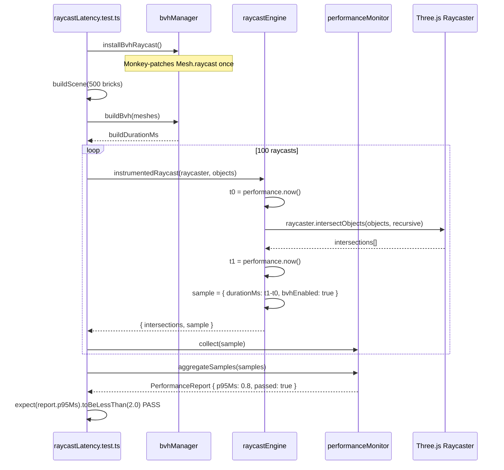
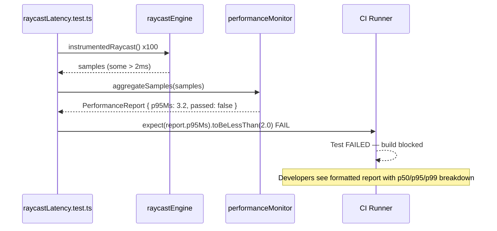
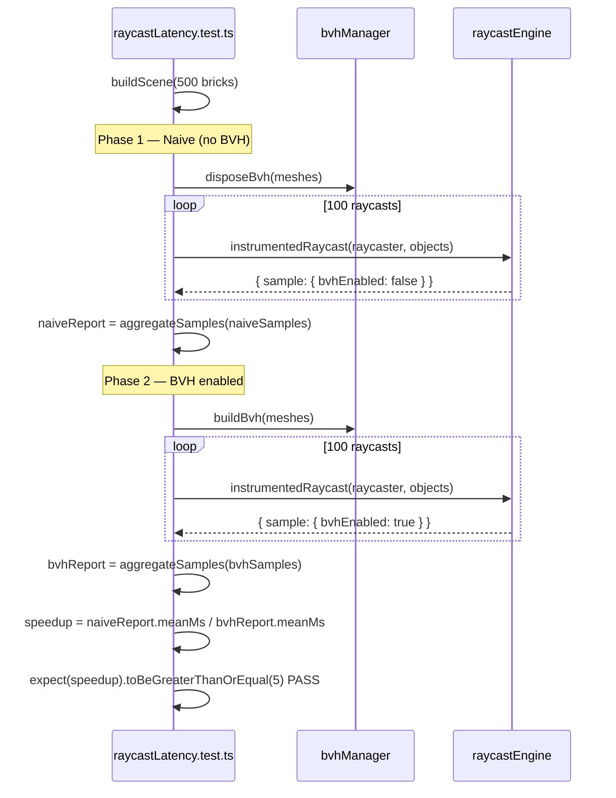
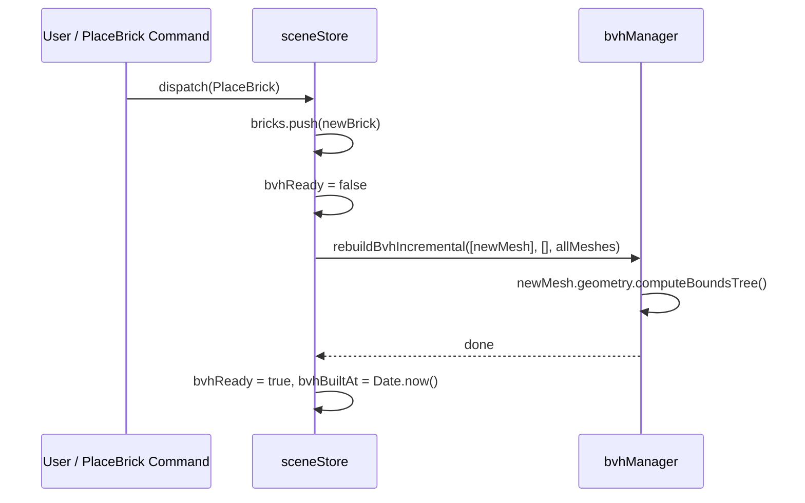

# Low-Level Design: NFR-PERF-002
## Enforce <2ms Raycast Latency in 500-Brick Scenes via Instrumented Timing

**FR-ID:** NFR-PERF-002
**Issue:** [#27](https://github.com/sreenivasmrpivot/legobuilder/issues/27)
**Author:** Spectra Design Agent
**Status:** Draft — Awaiting Gate 6a Human Review
**Date:** 2026-04-11
**Area:** Frontend (client-side SPA — Three.js / React Three Fiber)

---

## 1. Overview

NFR-PERF-002 mandates that every raycast operation in a 500-brick scene completes in **<2 ms (p95)**. The primary acceleration mechanism is a **Bounding Volume Hierarchy (BVH)** built via `three-mesh-bvh` (already scoped by FR-SCENE-003 / Issue #9). This LLD specifies:

- The instrumented timing wrapper that measures raycast latency in test/dev builds.
- The BVH integration contract with the scene graph.
- The performance test harness (`raycastLatency.test.ts`) that enforces the threshold in CI.
- The statistical sampling strategy (100 raycasts → p95 calculation).
- Error handling, fallback behaviour, and security considerations.

---

## 2. Acceptance Criteria (Restated)

| ID | Criterion | Threshold |
|----|-----------|----------|
| AC-1 | p95 raycast time over 100 raycasts in a 500-brick scene with BVH | **< 2 ms** |
| AC-2 | BVH vs. naive raycast speedup at >100 bricks | **>= 5x** |
| AC-3 | CI build fails when threshold is exceeded | **Hard gate** |

---

## 3. Component Architecture

### 3.1 Module Map

```
frontend/
├── src/
│   ├── engines/
│   │   ├── bvhManager.ts          ← BVH lifecycle (build, rebuild, dispose)
│   │   └── raycastEngine.ts       ← Instrumented raycast wrapper
│   ├── utils/
│   │   └── performanceMonitor.ts  ← Existing scaffold — extended with p95 helper
│   └── stores/
│       └── sceneStore.ts          ← Existing — exposes bvhReady flag
└── tests/
    └── performance/
        └── raycastLatency.test.ts ← New: CI-enforced latency test
```

### 3.2 Dependency Graph

```
raycastLatency.test.ts
  └── raycastEngine.ts
        ├── bvhManager.ts
        │     ├── three-mesh-bvh  (npm)
        │     └── three           (npm)
        └── performanceMonitor.ts
              └── (no external deps)
```

### 3.3 Module Responsibilities

| Module | Responsibility | Owns |
|--------|---------------|------|
| `bvhManager.ts` | Build/rebuild/dispose BVH on scene mutations | BVH lifecycle |
| `raycastEngine.ts` | Wrap `Raycaster.intersectObjects()` with timing instrumentation | Latency measurement |
| `performanceMonitor.ts` | Collect timing samples, compute p95, expose metrics | Statistics |
| `raycastLatency.test.ts` | Spin up 500-brick scene, run 100 raycasts, assert p95 < 2 ms | CI enforcement |

---

## 4. Data Models

### 4.1 RaycastSample

```typescript
/** A single instrumented raycast measurement */
interface RaycastSample {
  /** Wall-clock duration in milliseconds (performance.now() delta) */
  durationMs: number;
  /** Number of bricks in the scene at time of measurement */
  brickCount: number;
  /** Whether BVH was active for this raycast */
  bvhEnabled: boolean;
  /** Unix timestamp of the measurement */
  timestamp: number;
}
```

### 4.2 PerformanceReport

```typescript
/** Aggregated statistics for a batch of raycasts */
interface PerformanceReport {
  sampleCount: number;
  minMs: number;
  maxMs: number;
  meanMs: number;
  /** p50 latency */
  p50Ms: number;
  /** p95 latency — primary SLA metric */
  p95Ms: number;
  /** p99 latency — informational */
  p99Ms: number;
  bvhEnabled: boolean;
  brickCount: number;
  /** true when p95Ms < NFR_PERF_002_THRESHOLD_MS */
  passed: boolean;
}
```

### 4.3 BvhState (sceneStore extension)

```typescript
/** Slice added to sceneStore for BVH lifecycle tracking */
interface BvhState {
  /** BVH has been built and is current */
  bvhReady: boolean;
  /** Timestamp of last BVH build (ms since epoch) */
  bvhBuiltAt: number | null;
  /** Number of bricks when BVH was last built */
  bvhBrickCount: number;
  /** BVH build duration in ms (for diagnostics) */
  bvhBuildDurationMs: number | null;
}
```

---

## 5. API / Interface Contracts

### 5.1 `bvhManager.ts`

```typescript
import { Mesh } from 'three';
import { acceleratedRaycast } from 'three-mesh-bvh';

// Monkey-patch Three.js Mesh prototype once at app init
// (idempotent — safe to call multiple times)
export function installBvhRaycast(): void;

/**
 * Build a BVH for every mesh in `meshes`.
 * Mutates each mesh's geometry.boundsTree in-place.
 * @param meshes  Array of Three.js Mesh objects representing bricks
 * @returns       Build duration in milliseconds
 */
export function buildBvh(meshes: Mesh[]): number;

/**
 * Dispose BVH from all meshes (frees memory).
 * Call before scene teardown or full rebuild.
 */
export function disposeBvh(meshes: Mesh[]): void;

/**
 * Rebuild BVH incrementally after brick add/remove.
 * Only rebuilds geometries that changed.
 * @param added    Newly added meshes
 * @param removed  Meshes being removed
 * @param all      Full current mesh list (for full rebuild fallback)
 */
export function rebuildBvhIncremental(
  added: Mesh[],
  removed: Mesh[],
  all: Mesh[]
): void;
```

### 5.2 `raycastEngine.ts`

```typescript
import { Raycaster, Object3D, Intersection } from 'three';
import { RaycastSample } from '../types/performance';

/** Global threshold constant — single source of truth */
export const NFR_PERF_002_THRESHOLD_MS = 2.0;

/**
 * Instrumented raycast. In production builds the timing overhead
 * is stripped via tree-shaking (import.meta.env.PROD guard).
 *
 * @param raycaster  Configured Three.js Raycaster
 * @param objects    Scene objects to test against
 * @param recursive  Whether to recurse into children
 * @returns          Intersection results + timing sample
 */
export function instrumentedRaycast(
  raycaster: Raycaster,
  objects: Object3D[],
  recursive?: boolean
): { intersections: Intersection[]; sample: RaycastSample };

/**
 * Pure raycast — no instrumentation overhead.
 * Used in production render loop.
 */
export function fastRaycast(
  raycaster: Raycaster,
  objects: Object3D[],
  recursive?: boolean
): Intersection[];
```

### 5.3 `performanceMonitor.ts` (extended)

```typescript
/** Existing scaffold extended with p95 computation */

/**
 * Compute percentile from a sorted array of durations.
 * @param sortedSamples  Ascending-sorted duration array
 * @param percentile     0-100
 */
export function computePercentile(
  sortedSamples: number[],
  percentile: number
): number;

/**
 * Aggregate an array of RaycastSamples into a PerformanceReport.
 * Automatically sorts samples before computing percentiles.
 */
export function aggregateSamples(
  samples: RaycastSample[],
  threshold?: number
): PerformanceReport;

/**
 * Format a PerformanceReport as a human-readable string
 * suitable for CI log output.
 */
export function formatReport(report: PerformanceReport): string;
```

---

## 6. Sequence Diagrams

### 6.1 Happy Path — BVH Raycast Under Threshold



### 6.2 Failure Path — Threshold Exceeded



### 6.3 BVH vs. Naive Speedup Verification



### 6.4 BVH Rebuild on Scene Mutation



---

## 7. Performance Test Specification

### 7.1 File: `frontend/tests/performance/raycastLatency.test.ts`

```typescript
/**
 * NFR-PERF-002: Raycast Latency Enforcement
 *
 * CI-enforced test. Fails the build if p95 raycast time >= 2ms
 * in a 500-brick scene with BVH enabled.
 *
 * Test IDs: T-PERF-PERF-002-01, T-PERF-PERF-002-02
 */
import { describe, it, expect, beforeAll } from 'vitest';
import { installBvhRaycast, buildBvh, disposeBvh } from '../../src/engines/bvhManager';
import { instrumentedRaycast, NFR_PERF_002_THRESHOLD_MS } from '../../src/engines/raycastEngine';
import { aggregateSamples, formatReport } from '../../src/utils/performanceMonitor';
import { buildTestScene, randomOrigin, randomDirection } from '../helpers/sceneBuilder';

const BRICK_COUNT = 500;
const RAYCAST_ITERATIONS = 100;
const SPEEDUP_MINIMUM = 5;

beforeAll(() => {
  installBvhRaycast();
});

describe('NFR-PERF-002: Raycast Latency', () => {

  it('T-PERF-PERF-002-01: p95 raycast time < 2ms in 500-brick scene with BVH', async () => {
    const { raycaster, meshes } = buildTestScene(BRICK_COUNT);
    buildBvh(meshes);

    const samples = [];
    for (let i = 0; i < RAYCAST_ITERATIONS; i++) {
      raycaster.set(randomOrigin(i), randomDirection(i));
      const { sample } = instrumentedRaycast(raycaster, meshes, false);
      samples.push(sample);
    }

    const report = aggregateSamples(samples, NFR_PERF_002_THRESHOLD_MS);
    console.log(formatReport(report));

    expect(report.p95Ms).toBeLessThan(NFR_PERF_002_THRESHOLD_MS);
  });

  it('T-PERF-PERF-002-02: BVH speedup >= 5x vs naive at 500 bricks', async () => {
    const { raycaster, meshes } = buildTestScene(BRICK_COUNT);

    // Phase 1: Naive (no BVH)
    disposeBvh(meshes);
    const naiveSamples = [];
    for (let i = 0; i < RAYCAST_ITERATIONS; i++) {
      raycaster.set(randomOrigin(i), randomDirection(i));
      const { sample } = instrumentedRaycast(raycaster, meshes, false);
      naiveSamples.push(sample);
    }
    const naiveReport = aggregateSamples(naiveSamples);

    // Phase 2: BVH enabled
    buildBvh(meshes);
    const bvhSamples = [];
    for (let i = 0; i < RAYCAST_ITERATIONS; i++) {
      raycaster.set(randomOrigin(i), randomDirection(i));
      const { sample } = instrumentedRaycast(raycaster, meshes, false);
      bvhSamples.push(sample);
    }
    const bvhReport = aggregateSamples(bvhSamples);

    const speedup = naiveReport.meanMs / bvhReport.meanMs;
    console.log(`BVH speedup: ${speedup.toFixed(1)}x (naive: ${naiveReport.meanMs.toFixed(2)}ms, bvh: ${bvhReport.meanMs.toFixed(2)}ms)`);

    expect(speedup).toBeGreaterThanOrEqual(SPEEDUP_MINIMUM);
  });

});
```

### 7.2 Test Helper: `frontend/tests/helpers/sceneBuilder.ts`

```typescript
import { Scene, Raycaster, Mesh, Vector3 } from 'three';

/**
 * Builds a deterministic test scene with N bricks.
 * Uses a fixed seed for reproducible geometry.
 * Bricks are placed in a grid pattern to simulate a real scene.
 */
export function buildTestScene(brickCount: number): {
  scene: Scene;
  raycaster: Raycaster;
  meshes: Mesh[];
};

/**
 * Returns a deterministic ray origin for iteration i.
 * Distributes origins across the scene bounding box.
 */
export function randomOrigin(i: number): Vector3;

/**
 * Returns a deterministic ray direction for iteration i.
 * Ensures rays traverse the scene (not parallel to bricks).
 */
export function randomDirection(i: number): Vector3;
```

---

## 8. Error Handling Strategy

| Error Condition | Detection | Response | Severity |
|----------------|-----------|----------|----------|
| BVH not built when raycast called | `mesh.geometry.boundsTree === undefined` | Log warning, fall back to naive raycast, mark `bvhEnabled: false` in sample | WARN |
| `performance.now()` unavailable | `typeof performance === 'undefined'` | Use `Date.now()` fallback; log once at startup | WARN |
| Scene has 0 meshes | `meshes.length === 0` | Return empty intersections immediately, skip timing | INFO |
| BVH build throws (malformed geometry) | try/catch in `buildBvh` | Log error, set `bvhReady = false`, continue without BVH | ERROR |
| p95 threshold exceeded in CI | Test assertion failure | Vitest exits non-zero; CI pipeline blocks merge | FATAL (CI) |
| Incremental rebuild race condition | Mutex flag in sceneStore | Queue rebuild; skip if already rebuilding | WARN |

---

## 9. Security Considerations

| Concern | Risk | Mitigation |
|---------|------|------------|
| Timing side-channel | `performance.now()` exposes high-resolution timing | Instrumentation is **test/dev only** — stripped in production via `import.meta.env.PROD` guard; no timing data exposed to end users |
| BVH memory exhaustion | Malicious scene with extreme brick count | Scene is bounded by UI limits (max 500 bricks per NFR-PERF-002 scope); BVH memory is proportional to brick count |
| Prototype pollution via `three-mesh-bvh` monkey-patch | `installBvhRaycast()` mutates `Mesh.prototype` | Called once at app init; idempotent; no user-controlled input reaches the patch |
| Test data injection | Test helper `buildTestScene` uses deterministic seed | No external input; seed is a compile-time constant |

---

## 10. Implementation Notes for Coding Agent

### 10.1 BVH Installation (idempotent)

```typescript
// bvhManager.ts — call once at app entry point (main.tsx)
import { acceleratedRaycast } from 'three-mesh-bvh';
import { Mesh } from 'three';

let installed = false;
export function installBvhRaycast(): void {
  if (installed) return;
  Mesh.prototype.raycast = acceleratedRaycast;
  installed = true;
}
```

### 10.2 Production Guard for Instrumentation

```typescript
// raycastEngine.ts
const NOOP_SAMPLE: RaycastSample = {
  durationMs: 0, brickCount: 0, bvhEnabled: true, timestamp: 0,
};

export function instrumentedRaycast(
  raycaster: Raycaster,
  objects: Object3D[],
  recursive = false
): { intersections: Intersection[]; sample: RaycastSample } {
  if (import.meta.env.PROD) {
    // Zero overhead in production — timing stripped by Vite tree-shaking
    return { intersections: raycaster.intersectObjects(objects, recursive), sample: NOOP_SAMPLE };
  }

  const t0 = performance.now();
  const intersections = raycaster.intersectObjects(objects, recursive);
  const t1 = performance.now();

  return {
    intersections,
    sample: {
      durationMs: t1 - t0,
      brickCount: objects.length,
      bvhEnabled: (objects[0] as Mesh)?.geometry?.boundsTree != null,
      timestamp: Date.now(),
    },
  };
}
```

### 10.3 p95 Computation

```typescript
// performanceMonitor.ts
export function computePercentile(sortedSamples: number[], p: number): number {
  if (sortedSamples.length === 0) return 0;
  const idx = Math.ceil((p / 100) * sortedSamples.length) - 1;
  return sortedSamples[Math.max(0, idx)];
}

export function aggregateSamples(
  samples: RaycastSample[],
  threshold = NFR_PERF_002_THRESHOLD_MS
): PerformanceReport {
  const durations = samples.map(s => s.durationMs).sort((a, b) => a - b);
  const mean = durations.reduce((a, b) => a + b, 0) / durations.length;
  const p95 = computePercentile(durations, 95);
  return {
    sampleCount: samples.length,
    minMs: durations[0],
    maxMs: durations[durations.length - 1],
    meanMs: mean,
    p50Ms: computePercentile(durations, 50),
    p95Ms: p95,
    p99Ms: computePercentile(durations, 99),
    bvhEnabled: samples[0]?.bvhEnabled ?? false,
    brickCount: samples[0]?.brickCount ?? 0,
    passed: p95 < threshold,
  };
}
```

### 10.4 Vitest Configuration

```typescript
// vitest.config.ts — ensure jsdom environment for performance.now()
test: {
  environment: 'jsdom',
  include: ['tests/**/*.test.ts'],
  testTimeout: 30_000,  // 30s for performance tests
}
```

### 10.5 CI Integration

```yaml
# .github/workflows/ci.yml
- name: Run performance tests (NFR-PERF-002)
  run: npx vitest run tests/performance/raycastLatency.test.ts
  working-directory: frontend
  env:
    NODE_ENV: test
```

### 10.6 Dependency Prerequisite

NFR-PERF-002 depends on FR-SCENE-003 (Issue #9) for `three-mesh-bvh` being present in `package.json`. The coding agent **MUST** verify `three-mesh-bvh` is listed as a dependency before implementing `bvhManager.ts`.

---

## 11. Bundle and Runtime Impact

| Metric | Target | Notes |
|--------|--------|-------|
| `bvhManager.ts` bundle size | <= 2 KB (gzip) | Thin wrapper; `three-mesh-bvh` is already a scene dep |
| `raycastEngine.ts` bundle size | <= 1 KB (gzip) | Instrumentation stripped in prod |
| `performanceMonitor.ts` delta | <= 0.5 KB (gzip) | Adds p95 helper to existing scaffold |
| BVH build time (500 bricks) | <= 50 ms | One-time cost at scene load; acceptable |
| BVH memory overhead (500 bricks) | <= 5 MB | Proportional to geometry complexity |
| Incremental rebuild (1 brick add) | <= 5 ms | Only affected geometry recomputed |

---

## 12. Open Questions

| # | Question | Impact | Owner |
|---|----------|--------|-------|
| OQ-1 | Should the p95 threshold be configurable via env var (`VITE_RAYCAST_THRESHOLD_MS`) or hardcoded? | Hardcoded prevents accidental relaxation; env var allows per-environment tuning | Product / Tech Lead |
| OQ-2 | Should the performance test run on every PR or only on `main` merges? | Every PR catches regressions early but adds ~5s to CI | DevOps / Tech Lead |
| OQ-3 | Is `jsdom` sufficient for `performance.now()` accuracy, or should tests run in a real browser via Playwright? | jsdom is accurate enough for ms-level thresholds; Playwright adds complexity | QA Lead |
| OQ-4 | Should BVH be rebuilt synchronously or deferred to a Web Worker? | Sync rebuild blocks main thread ~50ms at 500 bricks; Worker adds complexity | Tech Lead |

---

## 13. Test Case Registry

| Test ID | Description | Input | Expected Output | Threshold |
|---------|-------------|-------|-----------------|----------|
| T-PERF-PERF-002-01 | p95 raycast latency with BVH, 500 bricks | 500 bricks, BVH built, 100 raycasts | p95 < 2 ms | 2 ms |
| T-PERF-PERF-002-02 | BVH speedup vs naive, 500 bricks | 500 bricks, naive then BVH, 100 raycasts each | speedup >= 5x | 5x |
| T-PERF-PERF-002-03 | BVH not built — graceful fallback | 500 bricks, no BVH | Returns intersections, logs WARN, `bvhEnabled: false` | N/A |
| T-PERF-PERF-002-04 | Empty scene — no crash | 0 bricks | Empty intersections, no error | N/A |
| T-PERF-PERF-002-05 | `performance.now()` unavailable — fallback | Mock `performance` as undefined | Uses `Date.now()`, logs once | N/A |
| T-PERF-PERF-002-06 | BVH build on malformed geometry | Mesh with empty geometry | Logs ERROR, `bvhReady = false`, no crash | N/A |
| T-PERF-PERF-002-07 | Incremental BVH rebuild after brick add | 499 bricks + 1 add | BVH rebuilt in <= 5 ms | 5 ms |
| T-PERF-PERF-002-08 | p95 computation correctness | 100 samples [1..100] ms | p95 = 95 ms | N/A |

---

## 14. Alignment with Technical Architecture

This LLD is consistent with the LegoBuilder Technical Architecture:

- **Frontend-only SPA**: All modules are in `frontend/src/`; no backend changes required.
- **Three.js / React Three Fiber**: `bvhManager.ts` and `raycastEngine.ts` operate on Three.js primitives (`Mesh`, `Raycaster`).
- **Zustand stores**: `sceneStore` is extended with `BvhState` slice following the existing store pattern.
- **Vitest**: Performance tests use the existing Vitest setup; no new test framework introduced.
- **Vite**: `import.meta.env.PROD` guard leverages Vite's built-in env system for dead-code elimination.
- **FR-SCENE-003 dependency**: `three-mesh-bvh` is assumed present per Issue #9; coding agent must verify.

---

*Generated by Spectra Design Agent — Gate 6a approval required before implementation begins.*
