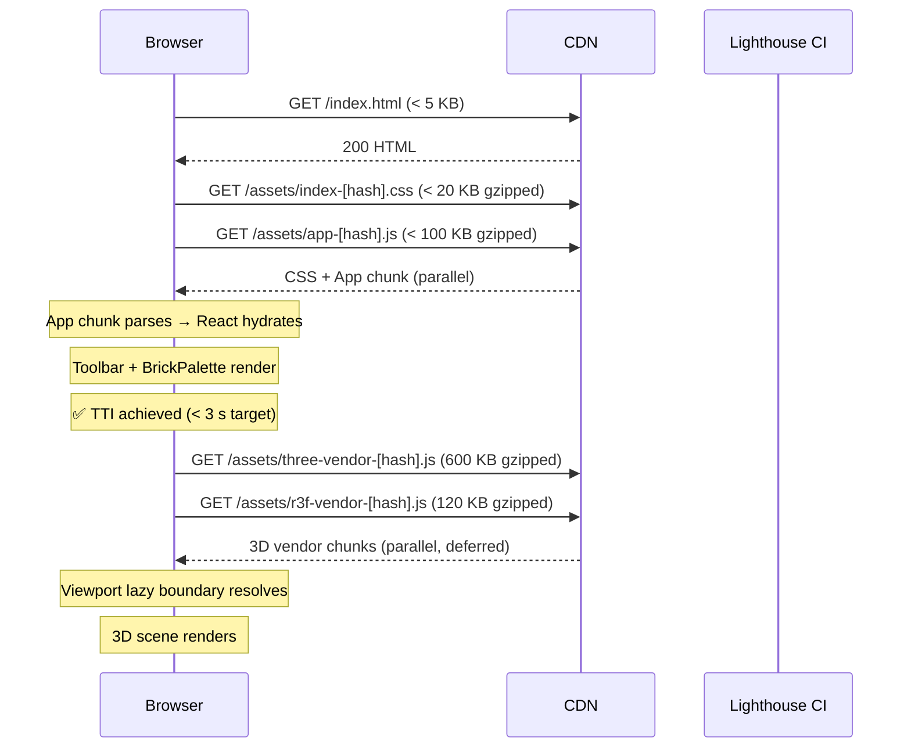
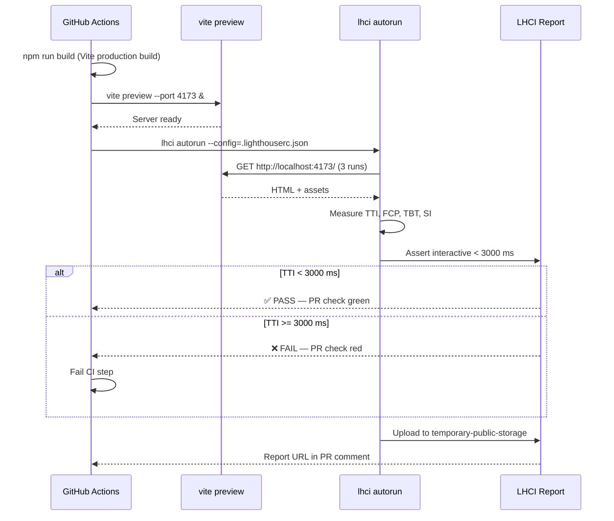
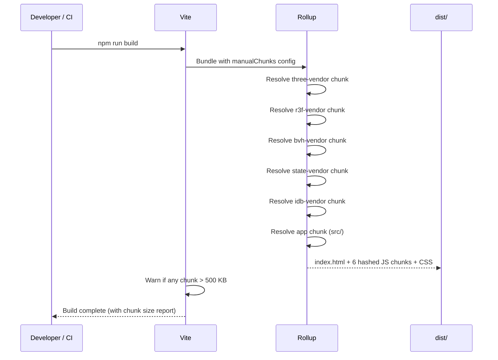

# Low-Level Design: NFR-PERF-003 — Enforce Time-to-Interactive <3 Seconds on 10 Mbps via Lighthouse CI

**FR-ID:** NFR-PERF-003  
**Issue:** [#28](https://github.com/sreenivasmrpivot/legobuilder/issues/28)  
**Status:** Draft — Pending Gate 6a Design Review  
**Author:** Spectra Design Agent  
**Date:** 2026-04-12  
**Stack:** React 18 + TypeScript + Vite + Three.js (@react-three/fiber) + Tailwind CSS  

---

## 1. Overview

NFR-PERF-003 mandates that the LegoBuilder SPA achieves a **Time-to-Interactive (TTI) of less than 3 seconds** on a 10 Mbps connection with a clean browser cache. This is enforced via **Lighthouse CI** running on every pull request, with a hard budget assertion that fails the PR check when TTI exceeds the threshold.

The primary levers are:
1. **Vite code splitting** — separating Three.js/R3F from application code so the browser can parse and execute chunks in parallel.
2. **Lazy loading** — deferring non-critical modules (3D scene, palette thumbnails) until after the initial interactive shell renders.
3. **Asset optimisation** — compressing textures, tree-shaking unused Three.js modules, and minimising the critical-path CSS.
4. **Lighthouse CI integration** — automated TTI measurement on every PR with a `<3s` budget assertion.

---

## 2. Acceptance Criteria Mapping

| AC | Criterion | Verification |
|----|-----------|-------------|
| AC-1 | TTI < 3 s on 10 Mbps throttled network (clean cache) | Lighthouse CI `--throttling.downloadThroughputKbps=10240` |
| AC-2 | Lighthouse CI check runs on every PR; fails when TTI > 3 s | GitHub Actions workflow step |
| AC-3 | No single JS chunk > 500 KB (uncompressed) | `rollup-plugin-visualizer` bundle report |

**Test Cases:** T-PERF-PERF-003-01  
**Dependencies:** FR-PERF-001 (#26), FR-SCENE-002 (#7)

---

## 3. Component Architecture

### 3.1 Module Dependency Graph

```
App.tsx (critical shell)
├── Toolbar.tsx          ← rendered immediately (no 3D)
├── BrickPalette.tsx     ← rendered immediately (no 3D)
├── ResumeModal.tsx      ← conditional, lightweight
└── Viewport.tsx         ← LAZY LOADED via React.lazy()
    ├── ViewportCanvas.tsx
    │   ├── @react-three/fiber Canvas
    │   ├── BrickInstances.tsx
    │   ├── GroundGrid.tsx
    │   └── GhostBrick.tsx
    └── useCameraControls.ts
```

### 3.2 Critical Rendering Path

The critical path must deliver an **interactive shell** (Toolbar + BrickPalette) before the 3D scene loads:

```
HTML parse → CSS parse → App.tsx hydrate → Toolbar + BrickPalette interactive
                                          ↓ (async)
                                    Viewport chunk loads → 3D scene renders
```

### 3.3 Vite Chunk Strategy

```typescript
// vite.config.ts
export default defineConfig({
  build: {
    rollupOptions: {
      output: {
        manualChunks: {
          // Vendor chunk 1: Three.js core (~600 KB gzipped)
          'three-vendor': ['three'],
          // Vendor chunk 2: React Three Fiber + Drei (~120 KB gzipped)
          'r3f-vendor': ['@react-three/fiber', '@react-three/drei'],
          // Vendor chunk 3: BVH acceleration (~40 KB gzipped)
          'bvh-vendor': ['three-mesh-bvh'],
          // Vendor chunk 4: State management (~15 KB gzipped)
          'state-vendor': ['zustand', 'immer'],
          // Vendor chunk 5: Persistence (~8 KB gzipped)
          'idb-vendor': ['idb'],
          // App chunk: application code (target < 100 KB gzipped)
          // (auto-split by Vite from src/)
        },
      },
    },
    // Enable chunk size warnings at 500 KB
    chunkSizeWarningLimit: 500,
  },
});
```

**Rationale:** Three.js is the largest dependency (~600 KB gzipped). Isolating it in its own chunk allows the browser to:
- Cache it independently across deployments (content-hash stays stable when only app code changes)
- Download it in parallel with the app chunk
- Defer its parse/execution until the Viewport lazy boundary triggers

### 3.4 React Lazy Loading

```typescript
// frontend/src/components/App.tsx
import React, { Suspense, lazy } from 'react';
import Toolbar from './ui/Toolbar';
import BrickPalette from './ui/BrickPalette';
import LoadingFallback from './ui/LoadingFallback';

// Viewport and all 3D code deferred until after shell renders
const Viewport = lazy(() => import('./viewport/Viewport'));

export const App: React.FC = () => {
  return (
    <div className="flex flex-col h-screen bg-gray-900">
      {/* Critical shell — renders immediately */}
      <Toolbar />
      <div className="flex flex-1 overflow-hidden">
        <BrickPalette />
        {/* 3D viewport deferred — shows spinner until chunk loads */}
        <Suspense fallback={<LoadingFallback />}>
          <Viewport />
        </Suspense>
      </div>
    </div>
  );
};
```

### 3.5 LoadingFallback Component

```typescript
// frontend/src/components/ui/LoadingFallback.tsx
export const LoadingFallback: React.FC = () => (
  <div
    className="flex-1 flex items-center justify-center bg-gray-800"
    role="status"
    aria-label="Loading 3D scene"
  >
    <div className="text-center">
      <div className="animate-spin rounded-full h-12 w-12 border-b-2 border-blue-400 mx-auto mb-4" />
      <p className="text-gray-400 text-sm">Loading 3D scene…</p>
    </div>
  </div>
);
```

---

## 4. Data Models

NFR-PERF-003 is a build-time and CI-time concern. No new runtime data models are introduced. The relevant configuration artefacts are:

### 4.1 Lighthouse CI Configuration

```json
// .lighthouserc.json
{
  "ci": {
    "collect": {
      "url": ["http://localhost:4173/"],
      "numberOfRuns": 3,
      "settings": {
        "throttling": {
          "rttMs": 40,
          "throughputKbps": 10240,
          "cpuSlowdownMultiplier": 4
        },
        "formFactor": "desktop",
        "screenEmulation": {
          "mobile": false,
          "width": 1350,
          "height": 940,
          "deviceScaleFactor": 1
        }
      }
    },
    "assert": {
      "assertions": {
        "interactive": ["error", { "maxNumericValue": 3000 }],
        "first-contentful-paint": ["warn", { "maxNumericValue": 1500 }],
        "speed-index": ["warn", { "maxNumericValue": 2500 }],
        "total-blocking-time": ["warn", { "maxNumericValue": 300 }]
      }
    },
    "upload": {
      "target": "temporary-public-storage"
    }
  }
}
```

### 4.2 Vite Build Configuration Schema

```typescript
// Type annotation for the chunk strategy
interface ChunkStrategy {
  name: string;          // Chunk identifier
  modules: string[];     // npm package names
  targetSizeKB: number;  // Uncompressed size budget
  gzippedSizeKB: number; // Gzipped size estimate
  cacheStrategy: 'long-term' | 'short-term'; // Cache-Control intent
}

const CHUNK_STRATEGY: ChunkStrategy[] = [
  { name: 'three-vendor',  modules: ['three'],                              targetSizeKB: 1800, gzippedSizeKB: 600,  cacheStrategy: 'long-term' },
  { name: 'r3f-vendor',    modules: ['@react-three/fiber','@react-three/drei'], targetSizeKB: 400,  gzippedSizeKB: 120,  cacheStrategy: 'long-term' },
  { name: 'bvh-vendor',    modules: ['three-mesh-bvh'],                     targetSizeKB: 120,  gzippedSizeKB: 40,   cacheStrategy: 'long-term' },
  { name: 'state-vendor',  modules: ['zustand','immer'],                    targetSizeKB: 50,   gzippedSizeKB: 15,   cacheStrategy: 'long-term' },
  { name: 'idb-vendor',    modules: ['idb'],                                targetSizeKB: 25,   gzippedSizeKB: 8,    cacheStrategy: 'long-term' },
  { name: 'app',           modules: ['src/'],                               targetSizeKB: 300,  gzippedSizeKB: 100,  cacheStrategy: 'short-term' },
];
```

---

## 5. API Endpoints

LegoBuilder is a **client-only SPA** with no backend. There are no HTTP API endpoints. The relevant "interfaces" are:

### 5.1 Lighthouse CI HTTP Interface

Lighthouse CI runs against the **Vite preview server** (`vite preview`) during CI:

| Endpoint | Method | Purpose |
|----------|--------|---------|
| `http://localhost:4173/` | GET | Lighthouse audits the root SPA entry point |
| `http://localhost:4173/assets/*.js` | GET | Chunk download timing measured by Lighthouse |
| `http://localhost:4173/assets/*.css` | GET | CSS parse timing measured by Lighthouse |

### 5.2 Bundle Analyser Interface

```typescript
// vite.config.ts — bundle visualiser plugin
import { visualizer } from 'rollup-plugin-visualizer';

plugins: [
  // Only in analyse mode: ANALYSE=true vite build
  process.env.ANALYSE === 'true' && visualizer({
    filename: 'dist/bundle-report.html',
    open: false,
    gzipSize: true,
    brotliSize: true,
    template: 'treemap',
  }),
]
```

---

## 6. Sequence Diagrams

### 6.1 Browser Load Sequence (10 Mbps)



### 6.2 Lighthouse CI Pipeline Sequence



### 6.3 Vite Build + Code Splitting Sequence



---

## 7. Implementation Details

### 7.1 Files to Create / Modify

| File | Action | Purpose |
|------|--------|---------|
| `vite.config.ts` | Modify | Add `manualChunks`, `chunkSizeWarningLimit: 500`, `visualizer` plugin |
| `frontend/src/components/App.tsx` | Modify | Wrap `Viewport` in `React.lazy()` + `<Suspense>` |
| `frontend/src/components/ui/LoadingFallback.tsx` | Create | Spinner shown while 3D chunk loads |
| `.lighthouserc.json` | Create | Lighthouse CI config with TTI < 3000 ms assertion |
| `.github/workflows/ci.yml` | Modify | Add `lhci autorun` step after `vite build` |
| `package.json` | Modify | Add `@lhci/cli` dev dependency |
| `Makefile` | Modify | Add `make lhci` target |

### 7.2 GitHub Actions CI Step

```yaml
# .github/workflows/ci.yml — add after existing build step
- name: Build production bundle
  run: npm run build
  working-directory: frontend

- name: Start preview server
  run: npx vite preview --port 4173 &
  working-directory: frontend

- name: Wait for preview server
  run: npx wait-on http://localhost:4173 --timeout 30000

- name: Run Lighthouse CI
  run: npx lhci autorun --config=../.lighthouserc.json
  working-directory: frontend
  env:
    LHCI_GITHUB_APP_TOKEN: ${{ secrets.LHCI_GITHUB_APP_TOKEN }}
```

### 7.3 Makefile Target

```makefile
# Makefile
lhci: build
	cd frontend && npx vite preview --port 4173 & \
	sleep 3 && \
	npx lhci autorun --config=../.lighthouserc.json

bundle-report:
	cd frontend && ANALYSE=true npm run build && open dist/bundle-report.html
```

### 7.4 Three.js Tree-Shaking

To minimise the `three-vendor` chunk, all Three.js imports must use **named imports** (not the default namespace):

```typescript
// ✅ CORRECT — tree-shakeable
import { BoxGeometry, MeshStandardMaterial, InstancedMesh, Color } from 'three';

// ❌ WRONG — imports entire Three.js namespace
import * as THREE from 'three';
```

ESLint rule to enforce this:
```json
// .eslintrc.json
{
  "rules": {
    "no-restricted-imports": [
      "error",
      {
        "patterns": [
          {
            "group": ["three"],
            "importNames": ["default"],
            "message": "Use named imports from 'three' for tree-shaking. Avoid 'import * as THREE'."
          }
        ]
      }
    ]
  }
}
```

### 7.5 CSS Critical Path Optimisation

Tailwind CSS is configured to purge unused classes at build time:

```typescript
// tailwind.config.ts
export default {
  content: [
    './index.html',
    './src/**/*.{ts,tsx}',
  ],
  // Purge removes unused classes → CSS bundle < 20 KB gzipped
};
```

The CSS bundle is inlined into the HTML `<head>` for zero additional round-trips on the critical path:

```typescript
// vite.config.ts
plugins: [
  react(),
  // CSS is extracted and linked (not inlined) — Vite default
  // Ensure CSS is in <head> via index.html link tag
],
```

### 7.6 Preload Hints

Add `<link rel="preload">` hints for the app chunk in `index.html` to start downloading before the browser parses the `<script>` tag:

```html
<!-- index.html -->
<!DOCTYPE html>
<html lang="en">
  <head>
    <meta charset="UTF-8" />
    <meta name="viewport" content="width=device-width, initial-scale=1.0" />
    <title>LegoBuilder</title>
    <!-- Vite injects hashed asset links here at build time -->
    <!-- The app chunk is automatically preloaded by Vite's modulepreload -->
  </head>
  <body>
    <div id="root"></div>
    <script type="module" src="/src/main.tsx"></script>
  </body>
</html>
```

Vite automatically generates `<link rel="modulepreload">` for the entry chunk and its direct imports. The `three-vendor` chunk is **not** preloaded (it's deferred behind the lazy boundary).

---

## 8. Error Handling Strategy

### 8.1 Lazy Load Failure

If the Viewport chunk fails to load (network error, CDN outage), the `<Suspense>` boundary will not catch it — React will propagate the error to the nearest **Error Boundary**:

```typescript
// frontend/src/components/ViewportErrorBoundary.tsx
import React, { Component, ErrorInfo, ReactNode } from 'react';

interface State { hasError: boolean; error: Error | null; }

export class ViewportErrorBoundary extends Component<{ children: ReactNode }, State> {
  state: State = { hasError: false, error: null };

  static getDerivedStateFromError(error: Error): State {
    return { hasError: true, error };
  }

  componentDidCatch(error: Error, info: ErrorInfo): void {
    console.error('[ViewportErrorBoundary]', error, info);
  }

  render(): ReactNode {
    if (this.state.hasError) {
      return (
        <div className="flex-1 flex items-center justify-center bg-gray-800">
          <div className="text-center text-red-400">
            <p className="text-lg font-semibold">Failed to load 3D scene</p>
            <p className="text-sm mt-2">Please refresh the page.</p>
            <button
              className="mt-4 px-4 py-2 bg-blue-600 text-white rounded hover:bg-blue-700"
              onClick={() => window.location.reload()}
            >
              Reload
            </button>
          </div>
        </div>
      );
    }
    return this.props.children;
  }
}
```

Usage in `App.tsx`:
```typescript
<ViewportErrorBoundary>
  <Suspense fallback={<LoadingFallback />}>
    <Viewport />
  </Suspense>
</ViewportErrorBoundary>
```

### 8.2 Lighthouse CI Failure Handling

| Failure Mode | Behaviour | Recovery |
|-------------|-----------|----------|
| TTI assertion fails (> 3 s) | CI step exits non-zero; PR check red | Developer investigates bundle size regression; fixes chunk strategy |
| Preview server fails to start | `wait-on` times out after 30 s; CI fails | Check `vite build` output for errors |
| LHCI upload fails | Warning only; assertion result still reported | Non-blocking; report URL unavailable |
| Bundle chunk > 500 KB | Vite emits warning (not error) | Developer reviews `bundle-report.html` |

### 8.3 Bundle Size Regression Detection

The `chunkSizeWarningLimit: 500` in `vite.config.ts` emits a **warning** (not an error) when a chunk exceeds 500 KB. To make this a **hard failure** in CI:

```yaml
# .github/workflows/ci.yml
- name: Check bundle sizes
  run: |
    cd frontend
    npm run build 2>&1 | tee build-output.txt
    if grep -q "chunk size warning" build-output.txt; then
      echo "❌ Bundle chunk exceeds 500 KB limit"
      exit 1
    fi
```

---

## 9. Security Considerations

### 9.1 Content Security Policy Compatibility

Code splitting with dynamic `import()` requires the CSP `script-src` directive to allow `'self'` for module scripts. The existing NFR-SEC-002 CSP design must be compatible:

```
Content-Security-Policy: 
  default-src 'self';
  script-src 'self';          ← allows hashed chunks from same origin
  style-src 'self' 'unsafe-inline';  ← Tailwind inline styles (if any)
  worker-src 'self' blob:;    ← Three.js may use workers
  connect-src 'self';
  img-src 'self' data:;
  font-src 'self';
```

**No `'unsafe-eval'`** is required. Vite's production build does not use `eval()`. Dynamic `import()` is a native ES module feature and does not require `'unsafe-eval'`.

### 9.2 Subresource Integrity

Vite generates content-hashed filenames (e.g., `three-vendor-a1b2c3d4.js`). For additional integrity, SRI hashes can be added to the generated `index.html` via the `vite-plugin-sri` plugin. This is optional for MVP but recommended for production hardening.

### 9.3 LHCI Token Security

The `LHCI_GITHUB_APP_TOKEN` is stored as a GitHub Actions secret and never exposed in logs. The Lighthouse CI report is uploaded to `temporary-public-storage` (ephemeral, no PII).

---

## 10. Performance Budget Summary

| Metric | Target | Measurement Method |
|--------|--------|-------------------|
| Time-to-Interactive (TTI) | < 3,000 ms | Lighthouse CI (10 Mbps throttle, 3 runs median) |
| First Contentful Paint (FCP) | < 1,500 ms | Lighthouse CI (warning) |
| Speed Index | < 2,500 ms | Lighthouse CI (warning) |
| Total Blocking Time (TBT) | < 300 ms | Lighthouse CI (warning) |
| `three-vendor` chunk | < 1,800 KB uncompressed / ~600 KB gzipped | `rollup-plugin-visualizer` |
| `r3f-vendor` chunk | < 400 KB uncompressed / ~120 KB gzipped | `rollup-plugin-visualizer` |
| `app` chunk | < 300 KB uncompressed / ~100 KB gzipped | `rollup-plugin-visualizer` |
| Any single chunk | < 500 KB uncompressed | Vite `chunkSizeWarningLimit` |
| CSS bundle | < 50 KB uncompressed / ~20 KB gzipped | Vite build output |
| Total initial download (critical path) | < 200 KB gzipped | HTML + CSS + app chunk only |

**Key insight:** The Three.js vendor chunk (~600 KB gzipped) is **not** on the critical path because it is deferred behind the `React.lazy()` boundary. The browser only needs to download and parse the app chunk (~100 KB gzipped) + CSS (~20 KB gzipped) + HTML (~5 KB) to achieve TTI.

---

## 11. NFR Traceability

| NFR | Requirement | Design Decision | Verification |
|-----|-------------|-----------------|-------------|
| NFR-PERF-003 | TTI < 3 s on 10 Mbps | React.lazy + Suspense for Viewport; Vite manualChunks | Lighthouse CI assertion |
| NFR-PERF-003 | No single chunk > 500 KB | Vite `chunkSizeWarningLimit: 500`; manualChunks splits Three.js | CI bundle size check |
| NFR-PERF-003 | Lighthouse CI on every PR | `.lighthouserc.json` + GitHub Actions step | PR check status |
| NFR-SEC-002 | No eval(); CSP compatible | Dynamic import() is native ESM; no eval needed | CSP audit |
| NFR-MAINT-002 | TypeScript strict mode | All new files use strict types; no `any` | `tsc --strict --noEmit` |

---

## 12. Test Plan Alignment

| Test ID | Description | How LLD Enables It |
|---------|-------------|--------------------|
| T-PERF-PERF-003-01 | TTI < 3 s on 10 Mbps (Lighthouse CI) | `.lighthouserc.json` asserts `interactive < 3000`; CI runs `lhci autorun` |

**Additional tests recommended:**
- `T-PERF-PERF-003-02` (new): Bundle chunk size check — verify no chunk > 500 KB in CI
- `T-PERF-PERF-003-03` (new): FCP < 1,500 ms — Lighthouse warning assertion

---

## 13. Open Questions / Risks

| # | Question / Risk | Severity | Mitigation |
|---|----------------|----------|------------|
| 1 | Three.js chunk size may grow as features are added | Medium | Monitor `bundle-report.html` on each PR; enforce chunk budget in CI |
| 2 | Lighthouse CI results vary across CI runner hardware | Low | Use 3-run median; desktop throttling profile is more stable than mobile |
| 3 | `wait-on` timeout may be too short on slow CI runners | Low | Increase to 60 s if needed; use `--interval 500` for faster polling |
| 4 | `LHCI_GITHUB_APP_TOKEN` setup requires GitHub App installation | Medium | Document setup in README; token is optional (report upload only) |
| 5 | Tailwind CSS `unsafe-inline` in CSP may conflict with NFR-SEC-002 | Medium | Use Tailwind JIT with no inline styles; verify CSP compatibility with NFR-SEC-002 LLD |
