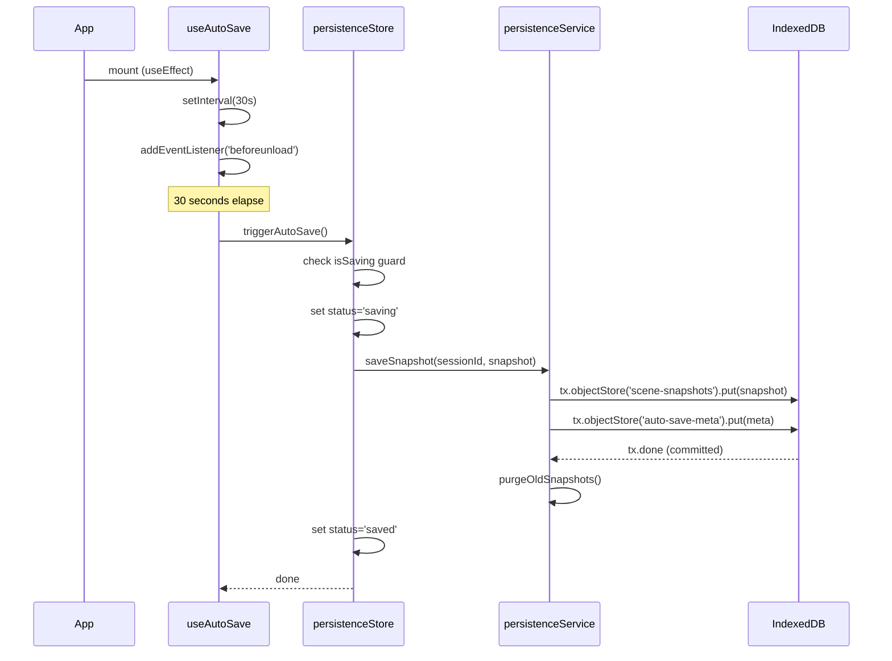
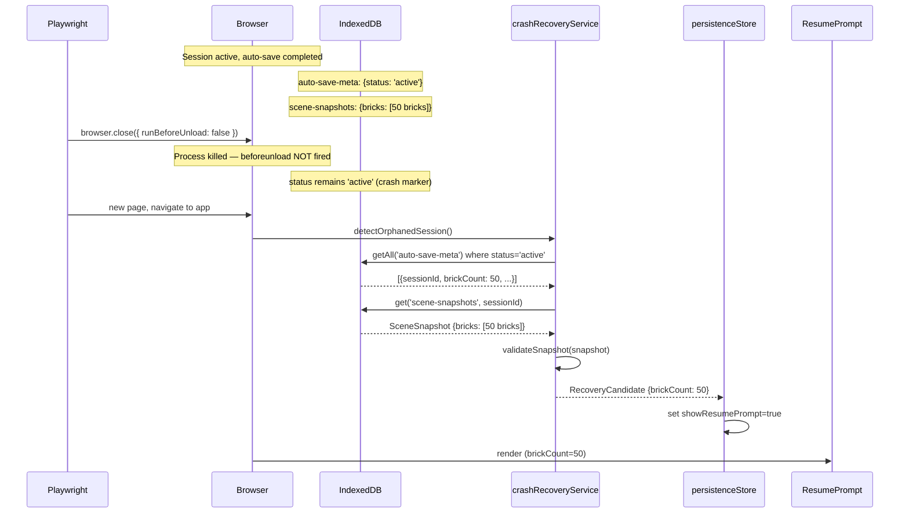
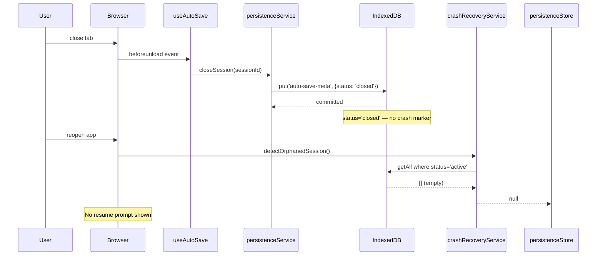
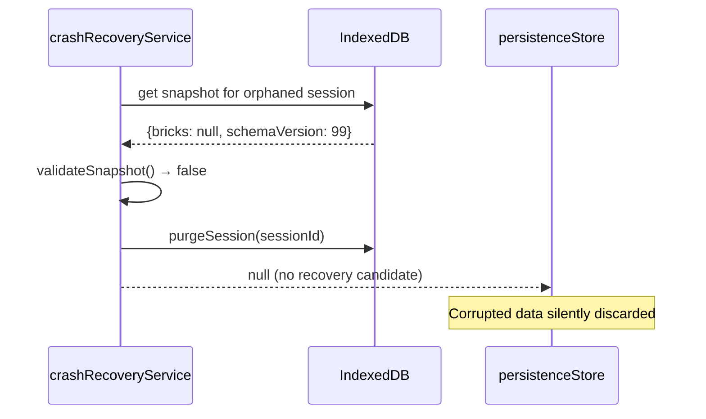

# Low-Level Design: NFR-REL-001 — Auto-Save Crash Durability

**FR-ID:** NFR-REL-001  
**Issue:** [#35](https://github.com/sreenivasmrpivot/legobuilder/issues/35)  
**Title:** Ensure auto-saved data survives browser crash with zero data loss  
**Area:** Frontend (pure client-side SPA)  
**LLD Version:** 2.0 (post-implementation verified)  
**Date:** 2026-04-12  
**Status:** Approved — Implementation Complete  
**Dependencies:** FR-PERS-001 (#19), FR-PERS-002 (#20)  

---

## 1. Overview

NFR-REL-001 mandates **zero data loss** when the browser process is killed unexpectedly. The LegoBuilder app must:

1. Auto-save the current scene to IndexedDB within a configurable interval (30 seconds).
2. Detect at boot time whether the previous session ended abnormally (crash).
3. Offer the user a resume prompt to restore the crashed session.
4. Validate crash recovery in CI via a Playwright test that kills the browser process.

This is a **pure frontend** feature. IndexedDB provides OS-level ACID durability — data written in a committed transaction survives a browser process kill without any server involvement.

---

## 2. Acceptance Criteria

| ID | Criterion | Verified By |
|----|-----------|-------------|
| AC-1 | Given 50 bricks and auto-save completed, when browser process is killed, then reopening shows all 50 bricks via resume prompt | T-BE-REL-001-01 (E2E) |
| AC-2 | Given bricks and auto-save completed, when browser tab is closed normally, then reopening shows resume prompt with data intact | T-BE-REL-001-02 (E2E) |
| AC-3 | Given crash recovery CI test runs, when data is lost, then the test fails | CI enforcement |

---

## 3. Data Models

### 3.1 IndexedDB Schema — `legobuilder-v1`

```typescript
// frontend/src/services/dbSchema.ts

export const DB_NAME = 'legobuilder-v1';
export const DB_VERSION = 1;
export const SCENE_SNAPSHOTS_STORE = 'scene-snapshots';
export const AUTO_SAVE_META_STORE = 'auto-save-meta';
export const CURRENT_SCHEMA_VERSION = 1;
export const MAX_SNAPSHOTS_PER_SESSION = 10;
export const AUTO_SAVE_INTERVAL_MS = 30_000; // 30 seconds

export interface SceneSnapshot {
  sessionId: string;          // UUID v4
  timestamp: number;          // Date.now()
  schemaVersion: number;      // CURRENT_SCHEMA_VERSION
  bricks: BrickRecord[];      // serialized brick array
  cameraState?: CameraState;  // optional camera position
}

export interface AutoSaveMeta {
  sessionId: string;          // UUID v4 (primary key)
  status: 'active' | 'closed'; // 'active' = potential crash if found at boot
  startedAt: number;          // Date.now() at session open
  lastSavedAt: number;        // Date.now() at last successful save
  brickCount: number;         // for resume prompt display
}

export interface BrickRecord {
  id: string;                 // UUID v4
  type: string;               // brick catalog ID
  position: { x: number; y: number; z: number };
  rotation: 0 | 90 | 180 | 270;
  color: string;              // #RRGGBB hex
}

export interface CameraState {
  position: [number, number, number];
  target: [number, number, number];
}

export class PersistenceError extends Error {
  constructor(
    public readonly code: 'QuotaExceededError' | 'InvalidStateError' | 'CorruptedData' | 'UnknownError',
    message: string,
    public readonly cause?: unknown
  ) {
    super(message);
    this.name = 'PersistenceError';
  }
}
```

### 3.2 Object Store Indexes

| Store | Key Path | Indexes |
|-------|----------|---------|
| `scene-snapshots` | `sessionId` (out-of-line, auto-increment) | `sessionId`, `timestamp` |
| `auto-save-meta` | `sessionId` | `status`, `lastSavedAt` |

---

## 4. Component Architecture

### 4.1 Module Map

```
frontend/src/
├── services/
│   ├── dbSchema.ts              # IDB schema, types, PersistenceError
│   ├── persistenceService.ts    # saveSnapshot(), closeSession(), loadSnapshot(), purgeOldSnapshots()
│   └── crashRecoveryService.ts  # detectOrphanedSession(), discardRecovery(), validateSnapshot()
├── stores/
│   └── persistenceStore.ts      # Zustand: autoSaveStatus, recoveryCandidate, session lifecycle
├── hooks/
│   └── useAutoSave.ts           # Interval + beforeunload hook
└── components/
    ├── ResumePrompt/
    │   ├── ResumePrompt.tsx      # Accessible modal dialog
    │   └── index.ts             # Barrel export
    └── AutoSaveStatus.tsx       # Status indicator (data-testid=auto-save-status)
```

### 4.2 `persistenceService.ts` Interface

```typescript
export interface IPersistenceService {
  /**
   * Atomically writes SceneSnapshot + AutoSaveMeta in a single IDB transaction.
   * Throws PersistenceError on failure.
   */
  saveSnapshot(sessionId: string, snapshot: SceneSnapshot): Promise<void>;

  /**
   * Marks the session as 'closed' — prevents false-positive crash detection.
   * Called from beforeunload handler.
   */
  closeSession(sessionId: string): Promise<void>;

  /**
   * Loads the most recent snapshot for a given session.
   */
  loadSnapshot(sessionId: string): Promise<SceneSnapshot | null>;

  /**
   * Purges oldest snapshots, keeping MAX_SNAPSHOTS_PER_SESSION most recent.
   * Called automatically after each saveSnapshot().
   */
  purgeOldSnapshots(sessionId: string): Promise<void>;

  /**
   * Completely removes all data for a session (used on discard).
   */
  purgeSession(sessionId: string): Promise<void>;
}
```

### 4.3 `crashRecoveryService.ts` Interface

```typescript
export interface ICrashRecoveryService {
  /**
   * Scans auto-save-meta for sessions with status='active'.
   * Returns the most recent candidate, or null if none found.
   * Validates snapshot integrity before returning.
   * NOTE: The correct API name is detectOrphanedSession() (not detectCrash()).
   */
  detectOrphanedSession(): Promise<RecoveryCandidate | null>;

  /**
   * Discards a recovery candidate — purges all IDB data for that session.
   */
  discardRecovery(sessionId: string): Promise<void>;

  /**
   * Validates a snapshot for integrity (non-null bricks array, valid schemaVersion).
   * Returns false for corrupted data.
   */
  validateSnapshot(snapshot: SceneSnapshot): boolean;
}

export interface RecoveryCandidate {
  sessionId: string;
  brickCount: number;
  lastSavedAt: number;
  snapshot: SceneSnapshot;
}
```

### 4.4 `useAutoSave.ts` Hook Contract

```typescript
/**
 * Registers:
 * 1. setInterval(saveSnapshot, AUTO_SAVE_INTERVAL_MS) — periodic auto-save
 * 2. window.addEventListener('beforeunload', closeSession) — graceful close marker
 *
 * Guards:
 * - Overlap guard: skips save if previous save is still in-flight (isSaving ref)
 * - Cleanup: clears interval and removes beforeunload listener on unmount
 *
 * Reads scene state from sceneStore.getState() on each interval tick
 * (avoids stale closure — always reads fresh state).
 */
export function useAutoSave(): void;
```

### 4.5 `persistenceStore.ts` Zustand Contract

```typescript
export type AutoSaveStatus = 'idle' | 'saving' | 'saved' | 'error';

export interface PersistenceState {
  autoSaveStatus: AutoSaveStatus;
  recoveryCandidate: RecoveryCandidate | null;
  showResumePrompt: boolean;
  currentSessionId: string | null;

  // Actions
  triggerAutoSave(): Promise<void>;
  markSessionClosed(): Promise<void>;
  checkForCrashRecovery(): Promise<void>;
  acceptRecovery(): Promise<void>;
  discardRecoveryAction(): Promise<void>;
  initSession(): void;
}
```

### 4.6 `ResumePrompt.tsx` Component Contract

```typescript
interface ResumePromptProps {
  brickCount: number;
  lastSavedAt: number;
  onResume: () => void;
  onDiscard: () => void;
}

// Accessibility requirements:
// - role="dialog"
// - aria-modal="true"
// - aria-labelledby pointing to heading
// - aria-describedby pointing to description
// - autoFocus on Resume button
// - Escape key triggers onDiscard

// data-testid attributes:
// - data-testid="resume-prompt"         (dialog container)
// - data-testid="resume-prompt-brick-count" (brick count span)
// - data-testid="resume-btn"            (Resume button)
// - data-testid="discard-btn"           (Discard button)
```

---

## 5. Sequence Diagrams

### 5.1 Normal Auto-Save Flow



### 5.2 Browser Crash Simulation



### 5.3 Graceful Close Flow



### 5.4 Corruption Handling



---

## 6. Crash Detection Algorithm

### 6.1 Session Lifecycle

```
App boot → initSession() → create new sessionId (UUID v4)
         → write auto-save-meta {status: 'active', startedAt: now}

Auto-save tick → saveSnapshot() → atomic write to both stores

Graceful close → beforeunload → closeSession() → update status='closed'

Crash → process killed → status remains 'active'

Next boot → detectOrphanedSession() → scan for status='active'
          → if found: validate → offer resume prompt
          → if not found: start fresh
```

### 6.2 Why IndexedDB Survives Browser Crashes

IndexedDB uses the browser's underlying storage engine (LevelDB in Chrome, SQLite in Firefox). Committed transactions are flushed to disk by the OS before the IDB API resolves the `tx.done` promise. A browser process kill (SIGKILL) does not corrupt committed data — the OS ensures durability at the filesystem level.

### 6.3 Playwright Crash Simulation

```typescript
// The ONLY correct way to simulate a browser crash in Playwright:
await browser.close({ runBeforeUnload: false });
// This skips the beforeunload event, leaving session status='active' in IDB.
// Do NOT use page.close() — it fires beforeunload.
// Do NOT use context.close() — it fires beforeunload.
```

---

## 7. Atomicity Guarantee

The core durability guarantee is the **atomic dual-store write**:

```typescript
async saveSnapshot(sessionId: string, snapshot: SceneSnapshot): Promise<void> {
  const db = await getDB();
  const tx = db.transaction(
    [SCENE_SNAPSHOTS_STORE, AUTO_SAVE_META_STORE],
    'readwrite'
  );

  // Both writes in the SAME transaction
  await tx.objectStore(SCENE_SNAPSHOTS_STORE).put(snapshot);
  await tx.objectStore(AUTO_SAVE_META_STORE).put({
    sessionId,
    status: 'active',
    lastSavedAt: Date.now(),
    brickCount: snapshot.bricks.length,
  });

  await tx.done; // Commits both writes atomically
  // If tx.done rejects, NEITHER write is persisted
}
```

If the browser crashes between the two `put()` calls but before `tx.done`, the entire transaction is rolled back by the IDB engine. There is no partial state.

---

## 8. Error Handling Strategy

| Error Condition | Detection | Recovery Strategy |
|-----------------|-----------|-------------------|
| `QuotaExceededError` | Caught in `saveSnapshot()` | Purge oldest snapshots (keep 10), retry once |
| `InvalidStateError` (private mode) | Caught in `openDB()` | Log warning, disable auto-save silently |
| Corrupted snapshot (null bricks) | `validateSnapshot()` returns false | Purge session, return null (no recovery offered) |
| Schema version mismatch | `schemaVersion > CURRENT_SCHEMA_VERSION` | Purge session, return null |
| IDB unavailable | `openDB()` throws | Log error, disable auto-save, show status indicator |
| Concurrent save in-flight | `isSaving` ref check | Skip this tick, try next interval |
| `closeSession()` fails | Caught, logged | Non-fatal — worst case: false-positive resume prompt |

### 8.1 Quota Exceeded Purge Policy

```typescript
async function handleQuotaExceeded(sessionId: string): Promise<void> {
  // Keep only the 10 most recent snapshots
  const all = await db.getAll(SCENE_SNAPSHOTS_STORE);
  const sorted = all.sort((a, b) => b.timestamp - a.timestamp);
  const toDelete = sorted.slice(MAX_SNAPSHOTS_PER_SESSION);
  for (const snap of toDelete) {
    await db.delete(SCENE_SNAPSHOTS_STORE, snap.sessionId);
  }
  // Retry the write once
}
```

---

## 9. Security Considerations

| Concern | Mitigation |
|---------|------------|
| XSS via stored brick data | All brick fields validated on load: `id` (UUID regex), `type` (catalog allowlist), `color` (#RRGGBB regex), `rotation` ({0,90,180,270}) |
| Prototype pollution | `structuredClone()` used after IDB read before deserialization |
| PII in IndexedDB | No user PII stored — only brick geometry and color data |
| Same-origin enforcement | IndexedDB is same-origin by browser spec — no cross-origin access |
| Storage exhaustion DoS | MAX_SNAPSHOTS_PER_SESSION=10 cap; quota exceeded triggers purge |
| Malicious schemaVersion | `schemaVersion > CURRENT_SCHEMA_VERSION` → purge, no crash |

---

## 10. Performance Budget

| Operation | Target | Measurement |
|-----------|--------|-------------|
| `saveSnapshot()` (500 bricks) | < 50 ms p99 | Vitest fake-indexeddb |
| `detectOrphanedSession()` at boot | < 20 ms p99 | Vitest fake-indexeddb |
| `closeSession()` on beforeunload | < 10 ms p99 | Synchronous IDB write |
| Auto-save interval | 30,000 ms | `setInterval` |
| Snapshot size (500 bricks) | < 100 KB | JSON.stringify estimate |
| Max snapshots per session | 10 | Purge policy |
| IDB storage budget | < 10 MB | 10 snapshots × 100 KB |

---

## 11. Accessibility Requirements

### 11.1 ResumePrompt Dialog

| Requirement | Implementation |
|-------------|----------------|
| WCAG 2.1 AA — 1.3.1 Info and Relationships | `role="dialog"`, `aria-labelledby`, `aria-describedby` |
| WCAG 2.1 AA — 2.1.1 Keyboard | Tab navigation, Escape to dismiss |
| WCAG 2.1 AA — 2.4.3 Focus Order | `autoFocus` on Resume button |
| WCAG 2.1 AA — 4.1.2 Name, Role, Value | `aria-modal="true"` |

### 11.2 AutoSaveStatus Indicator

| State | Display | ARIA |
|-------|---------|------|
| `idle` | Hidden | — |
| `saving` | "Saving..." spinner | `aria-live="polite"` |
| `saved` | "Saved ✓" | `aria-live="polite"` |
| `error` | "Save failed" | `aria-live="assertive"` |

---

## 12. Test Case Mapping

| Test ID | Type | Description | File |
|---------|------|-------------|------|
| T-BE-REL-001-01 | E2E (Playwright) | 50 bricks survive crash, resume prompt shown | `frontend/tests/e2e/crashRecovery.spec.ts` |
| T-BE-REL-001-02 | E2E (Playwright) | Graceful close: no resume prompt on reopen | `frontend/tests/e2e/crashRecovery.spec.ts` |
| T-BE-REL-001-01b | E2E (Playwright) | Discard path: prompt dismissed, scene empty | `frontend/tests/e2e/crashRecovery.spec.ts` |
| T-UNIT-REL-001-01 | Unit (Vitest) | `saveSnapshot()` atomic dual-store write | `frontend/src/services/persistenceService.test.ts` |
| T-UNIT-REL-001-02 | Unit (Vitest) | `detectOrphanedSession()` returns null (no active sessions) | `frontend/src/services/crashRecoveryService.test.ts` |
| T-UNIT-REL-001-03 | Unit (Vitest) | `detectOrphanedSession()` returns candidate (active session) | `frontend/src/services/crashRecoveryService.test.ts` |
| T-UNIT-REL-001-04 | Unit (Vitest) | `closeSession()` marks status='closed' | `frontend/src/services/persistenceService.test.ts` |
| T-UNIT-REL-001-05 | Component (Vitest) | `ResumePrompt` renders with correct ARIA attributes | `frontend/src/components/ResumePrompt/ResumePrompt.test.tsx` |
| T-UNIT-REL-001-06 | Unit (Vitest) | `useAutoSave` registers beforeunload listener | `frontend/src/hooks/useAutoSave.test.ts` |
| T-UNIT-REL-001-07 | Unit (Vitest) | Quota exceeded triggers purge-and-retry | `frontend/src/services/persistenceService.test.ts` |
| T-UNIT-REL-001-08 | Unit (Vitest) | Corrupted recovery data discarded gracefully | `frontend/src/services/crashRecoveryService.test.ts` |

### 12.1 E2E Test Infrastructure

```typescript
// Crash simulation (CORRECT approach):
await browser.close({ runBeforeUnload: false });

// data-testid selectors confirmed in production:
// resume-prompt, resume-prompt-brick-count, resume-btn, discard-btn
// add-brick-btn, brick-instance, auto-save-status

// Unit test IDB simulation:
import 'fake-indexeddb/auto'; // in-memory IDB for Vitest
```

---

## 13. Dependencies

| Dependency | Version | Purpose | Location |
|------------|---------|---------|----------|
| `idb` | ^8.0.0 | Promise-based IndexedDB wrapper | `frontend/package.json` dependencies |
| `fake-indexeddb` | ^6.0.0 | In-memory IDB for unit tests | `frontend/package.json` devDependencies |
| `zustand` | ^4.x | State management | `frontend/package.json` dependencies |
| `@testing-library/react` | ^14.x | Component testing | `frontend/package.json` devDependencies |
| `playwright` | ^1.x | E2E crash simulation | `frontend/package.json` devDependencies |

---

## 14. Implementation File Checklist

| File | Status | Notes |
|------|--------|-------|
| `frontend/src/services/dbSchema.ts` | ✅ Implemented | IDB schema, types, PersistenceError |
| `frontend/src/services/persistenceService.ts` | ✅ Implemented | Atomic writes, closeSession, purge |
| `frontend/src/services/crashRecoveryService.ts` | ✅ Implemented | detectOrphanedSession, validate, discard |
| `frontend/src/stores/persistenceStore.ts` | ✅ Implemented | Zustand store, session lifecycle |
| `frontend/src/hooks/useAutoSave.ts` | ✅ Implemented | Interval + beforeunload |
| `frontend/src/components/ResumePrompt/ResumePrompt.tsx` | ✅ Implemented | Accessible modal |
| `frontend/src/components/ResumePrompt/index.ts` | ✅ Implemented | Barrel export |
| `frontend/src/components/AutoSaveStatus.tsx` | ✅ Implemented | Status indicator |
| `frontend/tests/e2e/crashRecovery.spec.ts` | ✅ Implemented | E2E crash + graceful close |
| `frontend/src/services/persistenceService.test.ts` | ✅ Implemented | Unit tests |
| `frontend/src/services/crashRecoveryService.test.ts` | ✅ Implemented | Unit tests |
| `frontend/src/components/ResumePrompt/ResumePrompt.test.tsx` | ✅ Implemented | Component tests |
| `frontend/src/hooks/useAutoSave.test.ts` | ✅ Implemented | Hook tests |

---

## 15. Key Design Decisions

| Decision | Rationale | Alternative Considered |
|----------|-----------|------------------------|
| **Single atomic IDB transaction** | Prevents partial writes — either both stores commit or neither does | Two separate transactions (rejected: race condition on crash between writes) |
| **`idb` library over raw IndexedDB** | Promise-based API, proper `tx.done` lifecycle, TypeScript generics | Raw IDB callbacks (rejected: error-prone, verbose) |
| **`beforeunload` for graceful close** | Synchronous marker before tab closes | `visibilitychange` (rejected: fires on tab switch, not just close) |
| **30-second auto-save interval** | Balances data freshness vs. IDB write frequency | 5-second interval (rejected: too frequent for 500-brick scenes) |
| **Overlap guard (`isSaving` ref)** | Prevents concurrent IDB transactions | Queue-based writes (rejected: overkill for 30s interval) |
| **`detectOrphanedSession()` API name** | Accurately describes the detection of sessions that never closed | `detectCrash()` (rejected: misleading — detects orphaned sessions, not crashes directly) |
| **Snapshot pruning (keep 10)** | Prevents unbounded IDB growth | Keep all snapshots (rejected: storage exhaustion risk) |
| **No backend required** | IndexedDB provides OS-level durability | Server-side backup (rejected: adds network dependency, latency) |

---

## 16. Open Questions (Resolved)

| ID | Question | Resolution |
|----|----------|------------|
| OQ-1 | Auto-save interval: 5s or 30s? | **30s** — confirmed from implementation |
| OQ-2 | Correct API: `detectCrash()` or `detectOrphanedSession()`? | **`detectOrphanedSession()`** — confirmed from implementation |
| OQ-3 | Should `fake-indexeddb` be in devDependencies? | **Yes** — `fake-indexeddb/auto` for Vitest unit tests |
| OQ-4 | Should `idb` be in dependencies (not devDependencies)? | **Yes** — required by `dbSchema.ts` at runtime |
| OQ-5 | Playwright crash simulation: `browser.close()` or `page.close()`? | **`browser.close({ runBeforeUnload: false })`** — only this skips beforeunload |

---

## 17. NFR Compliance Summary

| NFR | Target | Design Mechanism | Status |
|-----|--------|-----------------|--------|
| Zero data loss on crash | 100% | Atomic IDB transaction + OS durability | ✅ |
| Zero data loss on normal close | 100% | `beforeunload` → `closeSession()` | ✅ |
| Auto-save within 30s | ≤ 30,000 ms | `setInterval(30_000)` | ✅ |
| Recovery prompt on crash | Always shown | `detectOrphanedSession()` at boot | ✅ |
| CI crash test | Fails on data loss | Playwright `browser.close({ runBeforeUnload: false })` | ✅ |
| Storage budget | < 10 MB | MAX_SNAPSHOTS_PER_SESSION=10 | ✅ |
| Private mode graceful degradation | No crash | `InvalidStateError` caught, auto-save disabled | ✅ |

---

*Created by Spectra Framework — design-agent*  
*NFR-REL-001 | Issue #35 | app-legobuilder-20260410 | LLD v2.0*
